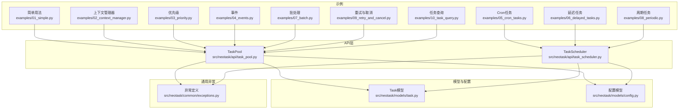
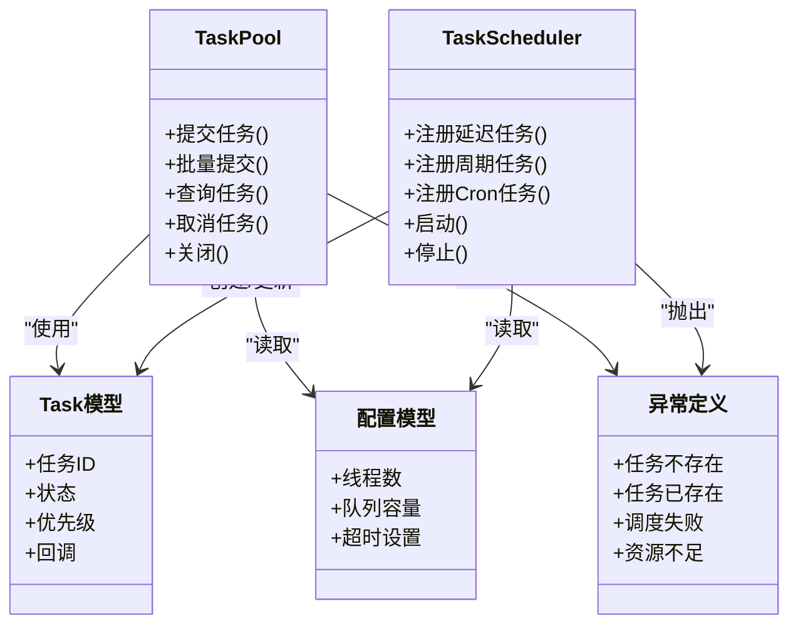
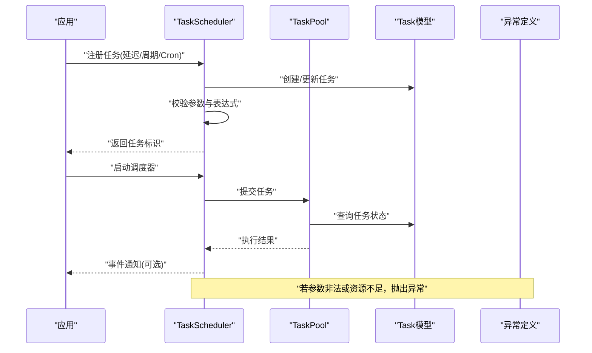
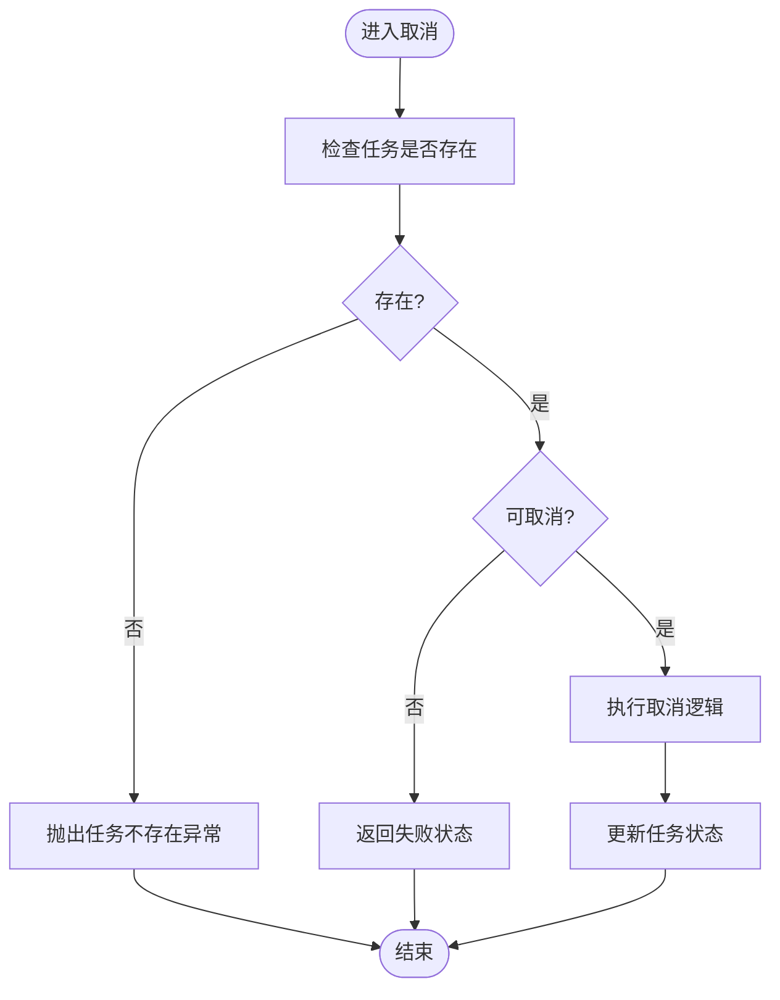
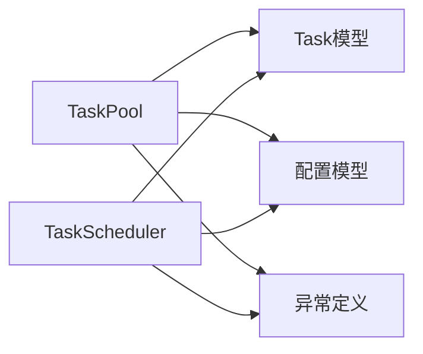

# API参考文档

<cite>
**本文引用的文件**   
- [src/neotask/api/task_pool.py](file://src/neotask/api/task_pool.py)
- [src/neotask/api/task_scheduler.py](file://src/neotask/api/task_scheduler.py)
- [src/neotask/common/exceptions.py](file://src/neotask/common/exceptions.py)
- [src/neotask/models/task.py](file://src/neotask/models/task.py)
- [src/neotask/models/config.py](file://src/neotask/models/config.py)
- [examples/01_simple.py](file://examples/01_simple.py)
- [examples/02_context_manager.py](file://examples/02_context_manager.py)
- [examples/03_priority.py](file://examples/03_priority.py)
- [examples/04_events.py](file://examples/04_events.py)
- [examples/05_cron_tasks.py](file://examples/05_cron_tasks.py)
- [examples/06_delayed_tasks.py](file://examples/06_delayed_tasks.py)
- [examples/07_batch.py](file://examples/07_batch.py)
- [examples/08_periodic.py](file://examples/08_periodic.py)
- [examples/09_retry_and_cancel.py](file://examples/09_retry_and_cancel.py)
- [examples/10_task_query.py](file://examples/10_task_query.py)
</cite>

## 目录
1. [简介](#简介)
2. [项目结构](#项目结构)
3. [核心组件](#核心组件)
4. [架构总览](#架构总览)
5. [详细组件分析](#详细组件分析)
6. [依赖关系分析](#依赖关系分析)
7. [性能考虑](#性能考虑)
8. [故障排查指南](#故障排查指南)
9. [结论](#结论)
10. [附录](#附录)

## 简介
本API参考文档聚焦于任务调度与执行的核心公共接口，覆盖以下两类关键类：
- TaskPool：任务池，负责任务的提交、生命周期管理、查询与批量操作。
- TaskScheduler：任务调度器，负责定时、周期、延迟与Cron等调度策略的注册与运行。

文档提供方法签名、参数说明、返回值类型、异常处理、使用示例与最佳实践，并包含错误码定义与异常类型说明，帮助开发者快速集成与正确使用。

## 项目结构
本项目采用分层模块化设计，API层位于 src/neotask/api 下，模型与配置在 models 与 config 中，通用异常在 common/exceptions.py 中。示例代码位于 examples 目录，便于快速上手与验证功能。

图表来源
- [src/neotask/api/task_pool.py](file://src/neotask/api/task_pool.py)
- [src/neotask/api/task_scheduler.py](file://src/neotask/api/task_scheduler.py)
- [src/neotask/models/task.py](file://src/neotask/models/task.py)
- [src/neotask/models/config.py](file://src/neotask/models/config.py)
- [src/neotask/common/exceptions.py](file://src/neotask/common/exceptions.py)
- [examples/01_simple.py](file://examples/01_simple.py)
- [examples/02_context_manager.py](file://examples/02_context_manager.py)
- [examples/03_priority.py](file://examples/03_priority.py)
- [examples/04_events.py](file://examples/04_events.py)
- [examples/05_cron_tasks.py](file://examples/05_cron_tasks.py)
- [examples/06_delayed_tasks.py](file://examples/06_delayed_tasks.py)
- [examples/07_batch.py](file://examples/07_batch.py)
- [examples/08_periodic.py](file://examples/08_periodic.py)
- [examples/09_retry_and_cancel.py](file://examples/09_retry_and_cancel.py)
- [examples/10_task_query.py](file://examples/10_task_query.py)

章节来源
- [src/neotask/api/task_pool.py](file://src/neotask/api/task_pool.py)
- [src/neotask/api/task_scheduler.py](file://src/neotask/api/task_scheduler.py)
- [src/neotask/models/task.py](file://src/neotask/models/task.py)
- [src/neotask/models/config.py](file://src/neotask/models/config.py)
- [src/neotask/common/exceptions.py](file://src/neotask/common/exceptions.py)

## 核心组件
本节概述两个核心类的职责与交互：
- TaskPool：面向任务的生命周期管理与并发执行控制，提供提交、查询、取消、批量提交等方法。
- TaskScheduler：面向时间维度的调度能力，支持一次性延迟、周期性任务与Cron表达式任务。

章节来源
- [src/neotask/api/task_pool.py](file://src/neotask/api/task_pool.py)
- [src/neotask/api/task_scheduler.py](file://src/neotask/api/task_scheduler.py)

## 架构总览
下图展示了API层与模型、异常之间的依赖关系，以及示例如何调用这些接口。

图表来源
- [src/neotask/api/task_pool.py](file://src/neotask/api/task_pool.py)
- [src/neotask/api/task_scheduler.py](file://src/neotask/api/task_scheduler.py)
- [src/neotask/models/task.py](file://src/neotask/models/task.py)
- [src/neotask/models/config.py](file://src/neotask/models/config.py)
- [src/neotask/common/exceptions.py](file://src/neotask/common/exceptions.py)

## 详细组件分析

### TaskPool API参考
- 职责
  - 管理任务的提交、执行、查询与取消。
  - 提供批量提交与上下文管理器支持。
  - 与任务模型和配置模型协作，统一异常处理。

- 主要方法与语义（以实际源码为准）
  - 提交任务：将单个任务加入任务池并返回任务标识。
  - 批量提交：一次提交多个任务，返回任务标识列表。
  - 查询任务：根据任务标识获取任务详情或状态。
  - 取消任务：尝试取消指定任务，若不可取消则返回相应结果。
  - 关闭：优雅关闭任务池，等待未完成的任务完成或超时。

- 参数与返回值
  - 提交任务：接受任务对象或可调用对象，返回任务标识。
  - 批量提交：接受任务列表，返回列表形式的任务标识。
  - 查询任务：接受任务标识，返回任务信息或状态。
  - 取消任务：接受任务标识，返回布尔或状态码表示是否成功。
  - 关闭：无参，返回None或关闭结果。

- 异常处理
  - 当任务不存在时抛出“任务不存在”异常。
  - 当任务重复提交时抛出“任务已存在”异常。
  - 当资源不足或队列满时抛出“资源不足”异常。
  - 其他运行时异常由上层捕获并记录日志。

- 使用示例路径
  - 简单用法：[examples/01_simple.py](file://examples/01_simple.py)
  - 上下文管理器：[examples/02_context_manager.py](file://examples/02_context_manager.py)
  - 优先级：[examples/03_priority.py](file://examples/03_priority.py)
  - 事件：[examples/04_events.py](file://examples/04_events.py)
  - 批处理：[examples/07_batch.py](file://examples/07_batch.py)
  - 重试与取消：[examples/09_retry_and_cancel.py](file://examples/09_retry_and_cancel.py)
  - 任务查询：[examples/10_task_query.py](file://examples/10_task_query.py)

- 最佳实践
  - 使用上下文管理器确保资源释放。
  - 批量提交优于循环单条提交，减少开销。
  - 合理设置任务优先级，避免低优先级饥饿。
  - 对取消操作进行幂等处理，避免重复取消。
  - 监控任务状态与异常，及时告警。

- 版本兼容性与废弃警告
  - 当前版本保持向后兼容；未来可能调整部分参数默认值。
  - 如使用旧版参数名，请留意弃用警告并迁移至新接口。

章节来源
- [src/neotask/api/task_pool.py](file://src/neotask/api/task_pool.py)
- [src/neotask/models/task.py](file://src/neotask/models/task.py)
- [src/neotask/models/config.py](file://src/neotask/models/config.py)
- [src/neotask/common/exceptions.py](file://src/neotask/common/exceptions.py)
- [examples/01_simple.py](file://examples/01_simple.py)
- [examples/02_context_manager.py](file://examples/02_context_manager.py)
- [examples/03_priority.py](file://examples/03_priority.py)
- [examples/04_events.py](file://examples/04_events.py)
- [examples/07_batch.py](file://examples/07_batch.py)
- [examples/09_retry_and_cancel.py](file://examples/09_retry_and_cancel.py)
- [examples/10_task_query.py](file://examples/10_task_query.py)

### TaskScheduler API参考
- 职责
  - 提供延迟、周期与Cron三类调度能力。
  - 管理调度器的生命周期（启动/停止）。
  - 与任务模型和配置模型协作，统一异常处理。

- 主要方法与语义（以实际源码为准）
  - 注册延迟任务：在未来某个时间点触发任务。
  - 注册周期任务：按固定间隔重复触发任务。
  - 注册Cron任务：基于Cron表达式触发任务。
  - 启动：开始调度循环。
  - 停止：优雅停止调度器，等待正在执行的调度任务完成。

- 参数与返回值
  - 注册延迟任务：接受任务对象与延迟时间，返回任务标识。
  - 注册周期任务：接受任务对象与间隔时间，返回任务标识。
  - 注册Cron任务：接受任务对象与Cron表达式，返回任务标识。
  - 启动：无参，返回None或启动结果。
  - 停止：无参，返回None或停止结果。

- 异常处理
  - 当Cron表达式无效时抛出“调度失败”异常。
  - 当调度器未启动而注册任务时抛出“调度失败”异常。
  - 当资源不足或内部队列满时抛出“资源不足”异常。
  - 其他运行时异常由上层捕获并记录日志。

- 使用示例路径
  - Cron任务：[examples/05_cron_tasks.py](file://examples/05_cron_tasks.py)
  - 延迟任务：[examples/06_delayed_tasks.py](file://examples/06_delayed_tasks.py)
  - 周期任务：[examples/08_periodic.py](file://examples/08_periodic.py)

- 最佳实践
  - 在应用启动时初始化并启动调度器，在退出前优雅停止。
  - 校验Cron表达式合法性，避免运行时异常。
  - 为周期任务设置合理的间隔，避免过载。
  - 对调度失败进行重试与降级处理。
  - 结合事件总线记录调度事件，便于追踪。

- 版本兼容性与废弃警告
  - 当前版本保持向后兼容；未来可能调整Cron解析行为。
  - 如使用旧版参数名，请留意弃用警告并迁移至新接口。

章节来源
- [src/neotask/api/task_scheduler.py](file://src/neotask/api/task_scheduler.py)
- [src/neotask/models/task.py](file://src/neotask/models/task.py)
- [src/neotask/models/config.py](file://src/neotask/models/config.py)
- [src/neotask/common/exceptions.py](file://src/neotask/common/exceptions.py)
- [examples/05_cron_tasks.py](file://examples/05_cron_tasks.py)
- [examples/06_delayed_tasks.py](file://examples/06_delayed_tasks.py)
- [examples/08_periodic.py](file://examples/08_periodic.py)

### 时序流程：注册与执行（概念性）
下图展示从注册任务到执行的基本流程，适用于延迟、周期与Cron任务。

图表来源
- [src/neotask/api/task_scheduler.py](file://src/neotask/api/task_scheduler.py)
- [src/neotask/api/task_pool.py](file://src/neotask/api/task_pool.py)
- [src/neotask/models/task.py](file://src/neotask/models/task.py)
- [src/neotask/common/exceptions.py](file://src/neotask/common/exceptions.py)

### 复杂逻辑：任务取消流程（概念性）
下图展示取消任务时的决策分支与异常处理。

图表来源
- [src/neotask/api/task_pool.py](file://src/neotask/api/task_pool.py)
- [src/neotask/common/exceptions.py](file://src/neotask/common/exceptions.py)

## 依赖关系分析
- 组件耦合
  - TaskPool与TaskScheduler均依赖Task模型与配置模型，用于任务信息与系统参数。
  - 两者均通过异常定义模块抛出统一的业务异常。
- 外部依赖
  - 示例代码演示了常见用法，有助于理解API的实际调用方式。
- 潜在循环依赖
  - API层不直接相互导入，降低耦合风险。
- 接口契约
  - 任务模型提供稳定的字段与状态枚举，保证跨组件一致性。
  - 配置模型提供线程数、队列容量、超时等关键参数。

图表来源
- [src/neotask/api/task_pool.py](file://src/neotask/api/task_pool.py)
- [src/neotask/api/task_scheduler.py](file://src/neotask/api/task_scheduler.py)
- [src/neotask/models/task.py](file://src/neotask/models/task.py)
- [src/neotask/models/config.py](file://src/neotask/models/config.py)
- [src/neotask/common/exceptions.py](file://src/neotask/common/exceptions.py)

章节来源
- [src/neotask/api/task_pool.py](file://src/neotask/api/task_pool.py)
- [src/neotask/api/task_scheduler.py](file://src/neotask/api/task_scheduler.py)
- [src/neotask/models/task.py](file://src/neotask/models/task.py)
- [src/neotask/models/config.py](file://src/neotask/models/config.py)
- [src/neotask/common/exceptions.py](file://src/neotask/common/exceptions.py)

## 性能考虑
- 批量提交优于循环单条提交，减少锁竞争与序列化开销。
- 合理设置线程数与队列容量，避免内存溢出与CPU抖动。
- 周期任务间隔需评估下游处理能力，避免堆积。
- 使用上下文管理器确保资源及时释放，防止泄漏。
- 监控关键指标（提交速率、执行时长、失败率），及时扩容或限流。

## 故障排查指南
- 常见问题
  - 任务不存在：检查任务标识是否正确，确认任务已提交。
  - 任务已存在：避免重复提交同一任务，或使用幂等键。
  - 调度失败：校验Cron表达式与参数，确认调度器已启动。
  - 资源不足：增加线程数或队列容量，优化任务粒度。
- 建议步骤
  - 查看任务状态与事件日志，定位失败点。
  - 复现最小用例，隔离问题范围。
  - 调整配置参数后观察效果，逐步逼近最优值。

章节来源
- [src/neotask/common/exceptions.py](file://src/neotask/common/exceptions.py)
- [src/neotask/api/task_pool.py](file://src/neotask/api/task_pool.py)
- [src/neotask/api/task_scheduler.py](file://src/neotask/api/task_scheduler.py)

## 结论
TaskPool与TaskScheduler提供了完整的任务管理与调度能力，配合统一的异常与模型定义，形成稳定可靠的API层。遵循最佳实践与性能建议，可在生产环境中获得良好的稳定性与吞吐表现。

## 附录

### 错误码与异常类型说明
- 任务不存在：当查询或取消不存在的任务时抛出。
- 任务已存在：当重复提交相同任务时抛出。
- 调度失败：当Cron表达式无效或调度器未启动时抛出。
- 资源不足：当线程池或队列资源耗尽时抛出。

章节来源
- [src/neotask/common/exceptions.py](file://src/neotask/common/exceptions.py)