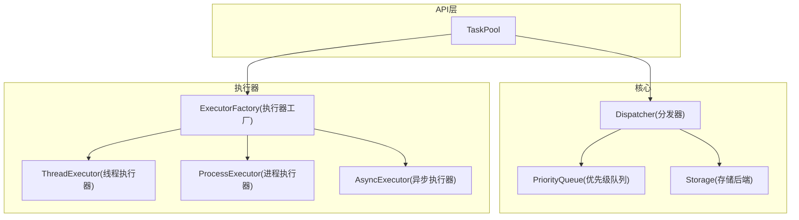
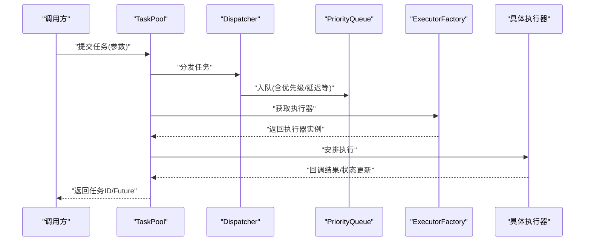
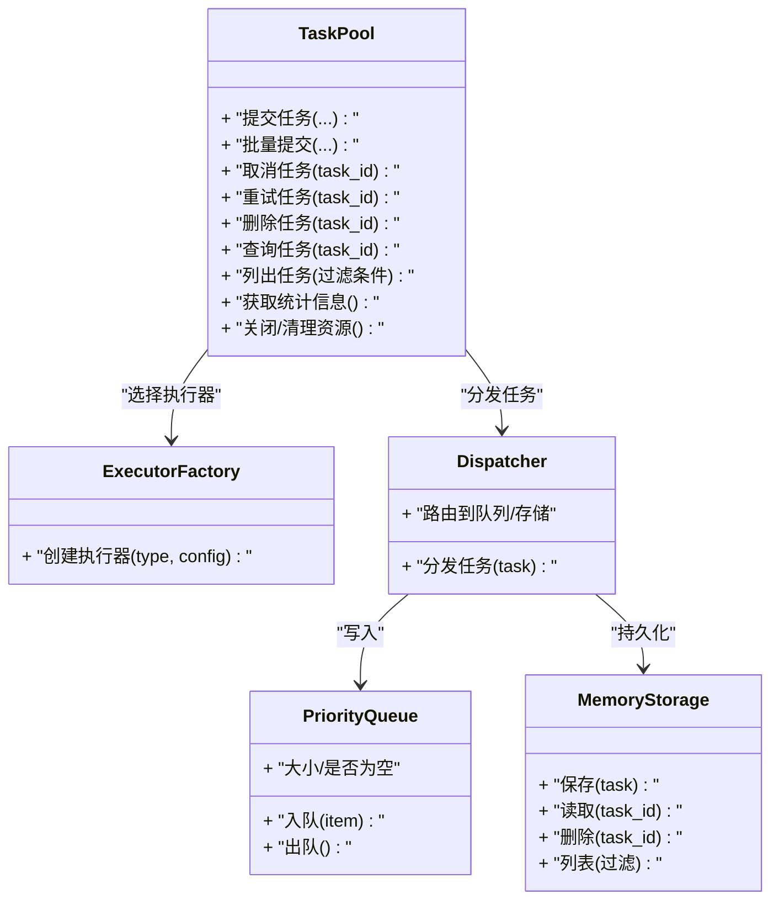
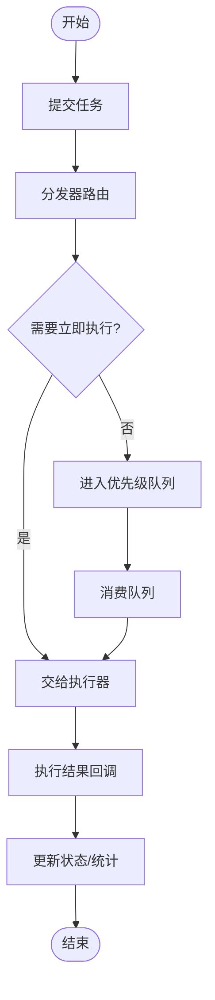
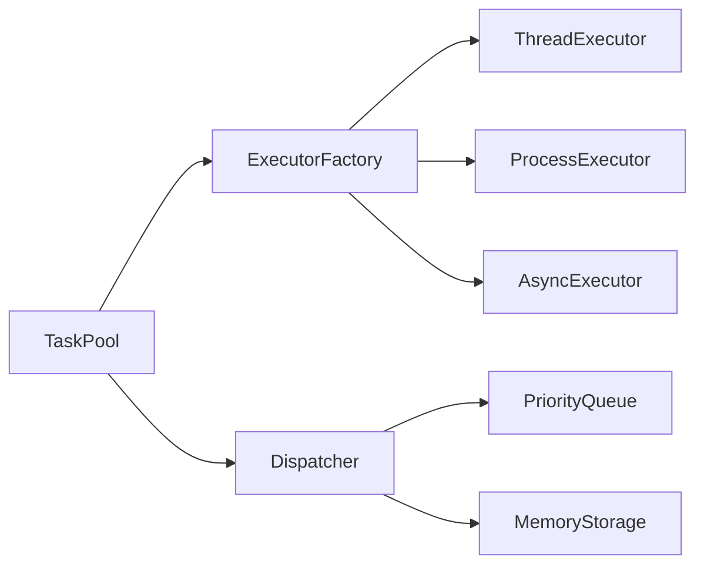

# TaskPool类API

<cite>
**本文引用的文件**   
- [src/neotask/api/task_pool.py](file://src/neotask/api/task_pool.py)
- [src/neotask/models/task.py](file://src/neotask/models/task.py)
- [src/neotask/executor/base.py](file://src/neotask/executor/base.py)
- [src/neotask/executor/factory.py](file://src/neotask/executor/factory.py)
- [src/neotask/core/dispatcher.py](file://src/neotask/core/dispatcher.py)
- [src/neotask/queue/priority_queue.py](file://src/neotask/queue/priority_queue.py)
- [src/neotask/storage/memory.py](file://src/neotask/storage/memory.py)
- [examples/07_batch.py](file://examples/07_batch.py)
- [examples/10_task_query.py](file://examples/10_task_query.py)
- [tests/integration/test_task_pool.py](file://tests/integration/test_task_pool.py)
</cite>

## 目录
1. [简介](#简介)
2. [项目结构](#项目结构)
3. [核心组件](#核心组件)
4. [架构总览](#架构总览)
5. [详细组件分析](#详细组件分析)
6. [依赖分析](#依赖分析)
7. [性能考虑](#性能考虑)
8. [故障排查指南](#故障排查指南)
9. [结论](#结论)
10. [附录](#附录)

## 简介
本文件为 TaskPool 类的权威 API 文档，覆盖任务添加、删除、查询、状态管理、批量提交、监控与错误处理等核心接口。同时说明配置选项（线程池、执行器选择）、与底层调度器和执行器的交互关系，并提供常见使用模式的参考路径与示例入口。

## 项目结构
TaskPool 位于 API 层，向上暴露统一的任务管理能力，向下通过执行器工厂选择具体执行器（线程/进程/异步），并通过分发器将任务投递到队列或存储后端。

图表来源
- [src/neotask/api/task_pool.py](file://src/neotask/api/task_pool.py)
- [src/neotask/core/dispatcher.py](file://src/neotask/core/dispatcher.py)
- [src/neotask/queue/priority_queue.py](file://src/neotask/queue/priority_queue.py)
- [src/neotask/storage/memory.py](file://src/neotask/storage/memory.py)
- [src/neotask/executor/factory.py](file://src/neotask/executor/factory.py)

章节来源
- [src/neotask/api/task_pool.py](file://src/neotask/api/task_pool.py)
- [src/neotask/core/dispatcher.py](file://src/neotask/core/dispatcher.py)
- [src/neotask/executor/factory.py](file://src/neotask/executor/factory.py)

## 核心组件
- TaskPool：对外提供任务生命周期管理与查询能力，封装执行器选择、任务入队/出队、状态同步与监控。
- ExecutorFactory：根据配置创建并返回合适的执行器实例（线程/进程/异步）。
- Dispatcher：负责将任务从 API 层分发到队列或持久化存储，协调执行器与队列的交互。
- PriorityQueue：支持按优先级调度任务的内存队列实现。
- Storage：抽象存储后端，Memory 为默认实现，用于任务元数据持久化与查询。

章节来源
- [src/neotask/api/task_pool.py](file://src/neotask/api/task_pool.py)
- [src/neotask/executor/factory.py](file://src/neotask/executor/factory.py)
- [src/neotask/core/dispatcher.py](file://src/neotask/core/dispatcher.py)
- [src/neotask/queue/priority_queue.py](file://src/neotask/queue/priority_queue.py)
- [src/neotask/storage/memory.py](file://src/neotask/storage/memory.py)

## 架构总览
TaskPool 作为统一入口，屏蔽底层执行器与存储差异，提供一致的任务操作语义。其关键交互如下：
- 任务提交：TaskPool -> Dispatcher -> Queue/Storage -> Executor
- 任务查询：TaskPool -> Storage（可选经 Dispatcher）
- 状态管理：TaskPool 维护任务状态视图，必要时与存储同步
- 监控与指标：TaskPool 暴露统计信息，供上层采集

图表来源
- [src/neotask/api/task_pool.py](file://src/neotask/api/task_pool.py)
- [src/neotask/core/dispatcher.py](file://src/neotask/core/dispatcher.py)
- [src/neotask/queue/priority_queue.py](file://src/neotask/queue/priority_queue.py)
- [src/neotask/executor/factory.py](file://src/neotask/executor/factory.py)

## 详细组件分析

### TaskPool 类概览
- 职责
  - 统一管理任务的生命周期：创建、提交、取消、重试、删除、查询、统计
  - 选择执行器：基于配置动态切换线程/进程/异步执行器
  - 与调度器协作：支持优先级、延迟、周期性任务
  - 提供监控与指标：运行态统计、健康检查
- 典型依赖
  - 执行器工厂：ExecutorFactory
  - 分发器：Dispatcher
  - 队列：PriorityQueue
  - 存储：Memory（可扩展至 Redis/SQLite）
  - 任务模型：Task

图表来源
- [src/neotask/api/task_pool.py](file://src/neotask/api/task_pool.py)
- [src/neotask/executor/factory.py](file://src/neotask/executor/factory.py)
- [src/neotask/core/dispatcher.py](file://src/neotask/core/dispatcher.py)
- [src/neotask/queue/priority_queue.py](file://src/neotask/queue/priority_queue.py)
- [src/neotask/storage/memory.py](file://src/neotask/storage/memory.py)

章节来源
- [src/neotask/api/task_pool.py](file://src/neotask/api/task_pool.py)
- [src/neotask/models/task.py](file://src/neotask/models/task.py)

### 公共方法详解

以下方法描述聚焦于行为契约、参数与返回值约定、异常处理要点以及使用建议。为避免泄露实现细节，未直接粘贴代码内容，请参见“章节来源”中的文件定位。

- 提交任务
  - 功能：将单个任务加入任务池并安排执行
  - 主要参数：任务标识、可调用对象或任务定义、优先级、延迟时间、超时、重试策略、标签/分组等
  - 返回值：任务ID或Future对象（取决于执行器类型）
  - 异常：参数校验失败、执行器不可用、队列满、存储异常等
  - 使用建议：优先使用带超时的提交；对高并发场景设置合理优先级
  - 参考示例：[examples/07_batch.py](file://examples/07_batch.py)、[examples/10_task_query.py](file://examples/10_task_query.py)

- 批量提交
  - 功能：一次性提交多个任务，提升吞吐
  - 主要参数：任务列表、批大小、是否顺序提交、回退策略
  - 返回值：任务ID列表或Future列表
  - 异常：部分失败时可选择全部回滚或部分成功策略
  - 使用建议：结合优先级与分组进行批量控制

- 取消任务
  - 功能：尝试取消尚未执行或正在执行的任务
  - 主要参数：任务ID
  - 返回值：布尔值表示是否成功取消
  - 异常：任务不存在、已完成的不可取消
  - 注意：取消可能受执行器支持程度影响

- 重试任务
  - 功能：对失败任务进行手动重试
  - 主要参数：任务ID、重试次数、间隔策略
  - 返回值：新任务ID或原任务ID（视实现）
  - 异常：任务不存在、不允许重试的状态

- 删除任务
  - 功能：从任务池和存储中移除任务记录
  - 主要参数：任务ID
  - 返回值：布尔值表示是否成功删除
  - 异常：任务不存在

- 查询任务
  - 功能：根据任务ID或过滤条件查询任务详情
  - 主要参数：任务ID、状态、标签、时间范围等
  - 返回值：任务对象或列表
  - 异常：无效参数、存储查询失败

- 列出任务
  - 功能：分页/过滤列出任务集合
  - 主要参数：页码、每页大小、排序字段、过滤条件
  - 返回值：任务列表及总数
  - 异常：分页参数非法、存储查询失败

- 获取统计信息
  - 功能：返回任务池运行态统计（如待执行数、已完成数、失败数、平均耗时等）
  - 主要参数：无或时间窗口
  - 返回值：统计字典或对象
  - 异常：统计源不可用时返回降级数据

- 关闭/清理资源
  - 功能：优雅关闭执行器、清空队列、释放资源
  - 主要参数：超时等待时间
  - 返回值：无
  - 异常：关闭过程中出现中断或超时

章节来源
- [src/neotask/api/task_pool.py](file://src/neotask/api/task_pool.py)
- [examples/07_batch.py](file://examples/07_batch.py)
- [examples/10_task_query.py](file://examples/10_task_query.py)

### 配置与高级功能

- 执行器选择
  - 类型：线程、进程、异步
  - 选择方式：通过配置项指定执行器类型，由执行器工厂创建对应实例
  - 适用场景：CPU密集型选进程，IO密集型选线程，协程任务选异步

- 线程池设置
  - 关键参数：最大工作线程数、队列容量、超时时间、拒绝策略
  - 建议：根据系统核数与任务特性调优；避免队列过大导致内存压力

- 优先级与延迟
  - 优先级：数值越小优先级越高（或反之，依实现而定）
  - 延迟：支持在指定时间点或相对时间后执行
  - 组合：优先级+延迟可实现复杂调度策略

- 重试与容错
  - 策略：固定间隔、指数退避、抖动
  - 上限：最大重试次数与总重试时长限制
  - 死信队列：长期失败任务转入死信以便人工干预

- 存储后端
  - 默认：内存存储，适合单机与测试
  - 扩展：Redis/SQLite 等持久化后端，支持跨进程共享与恢复

章节来源
- [src/neotask/executor/factory.py](file://src/neotask/executor/factory.py)
- [src/neotask/queue/priority_queue.py](file://src/neotask/queue/priority_queue.py)
- [src/neotask/storage/memory.py](file://src/neotask/storage/memory.py)

### 与底层调度器和执行器的交互

- 分发流程
  - TaskPool 将任务交给 Dispatcher，后者决定入队或持久化
  - 队列消费者从 PriorityQueue 取出任务并交由执行器执行
  - 执行器完成回调后，TaskPool 更新任务状态与统计

- 执行器契约
  - 统一的提交接口与 Future 语义
  - 支持取消、超时、结果回调
  - 不同执行器对取消/超时的支持度存在差异

图表来源
- [src/neotask/core/dispatcher.py](file://src/neotask/core/dispatcher.py)
- [src/neotask/queue/priority_queue.py](file://src/neotask/queue/priority_queue.py)
- [src/neotask/executor/base.py](file://src/neotask/executor/base.py)

章节来源
- [src/neotask/core/dispatcher.py](file://src/neotask/core/dispatcher.py)
- [src/neotask/executor/base.py](file://src/neotask/executor/base.py)

### 使用示例与模式

- 批量任务提交
  - 目标：提高吞吐，减少上下文切换
  - 关键点：批大小、顺序/并行提交、失败回退策略
  - 参考示例：[examples/07_batch.py](file://examples/07_batch.py)

- 任务监控与查询
  - 目标：观察任务运行态、定位问题
  - 关键点：统计接口、过滤查询、分页
  - 参考示例：[examples/10_task_query.py](file://examples/10_task_query.py)

- 错误处理与重试
  - 目标：增强鲁棒性
  - 关键点：重试策略、死信队列、告警
  - 参考示例：集成测试用例

章节来源
- [examples/07_batch.py](file://examples/07_batch.py)
- [examples/10_task_query.py](file://examples/10_task_query.py)
- [tests/integration/test_task_pool.py](file://tests/integration/test_task_pool.py)

## 依赖分析

图表来源
- [src/neotask/api/task_pool.py](file://src/neotask/api/task_pool.py)
- [src/neotask/executor/factory.py](file://src/neotask/executor/factory.py)
- [src/neotask/core/dispatcher.py](file://src/neotask/core/dispatcher.py)
- [src/neotask/queue/priority_queue.py](file://src/neotask/queue/priority_queue.py)
- [src/neotask/storage/memory.py](file://src/neotask/storage/memory.py)

章节来源
- [src/neotask/api/task_pool.py](file://src/neotask/api/task_pool.py)
- [src/neotask/executor/factory.py](file://src/neotask/executor/factory.py)
- [src/neotask/core/dispatcher.py](file://src/neotask/core/dispatcher.py)
- [src/neotask/queue/priority_queue.py](file://src/neotask/queue/priority_queue.py)
- [src/neotask/storage/memory.py](file://src/neotask/storage/memory.py)

## 性能考虑
- 执行器选择
  - CPU密集型：进程执行器可降低GIL影响，但开销较大
  - IO密集型：线程执行器更合适，需调整线程池大小
  - 协程任务：异步执行器具备更高并发效率
- 队列与存储
  - 内存队列吞吐高但易丢失，生产环境建议持久化
  - 大任务体应避免放入队列，改用外部存储引用
- 批处理
  - 合理批大小可减少调度开销，但会增大延迟方差
- 监控与限流
  - 关注队列长度、执行器利用率、失败率等指标
  - 必要时引入背压与限流策略

## 故障排查指南
- 常见问题
  - 任务不执行：检查执行器是否可用、队列是否阻塞、优先级是否过低
  - 任务重复执行：确认幂等性与去重机制
  - 内存增长：排查大任务体、未释放的Future、队列积压
  - 取消无效：确认执行器是否支持取消、任务是否已开始执行
- 诊断步骤
  - 查看统计信息与日志
  - 使用查询接口定位任务状态
  - 降低负载验证是否为资源瓶颈
  - 切换到内存存储快速复现问题

章节来源
- [tests/integration/test_task_pool.py](file://tests/integration/test_task_pool.py)

## 结论
TaskPool 提供了统一、可扩展的任务管理能力，通过执行器工厂与分发器解耦了执行细节与调度逻辑。合理配置执行器与队列、完善监控与错误处理，可在多种业务场景中稳定高效地运行。

## 附录
- 相关模型
  - 任务模型：包含任务标识、状态、元数据、执行上下文等
- 参考示例
  - 批量提交：[examples/07_batch.py](file://examples/07_batch.py)
  - 任务查询：[examples/10_task_query.py](file://examples/10_task_query.py)
- 集成测试
  - 端到端用例：[tests/integration/test_task_pool.py](file://tests/integration/test_task_pool.py)

章节来源
- [src/neotask/models/task.py](file://src/neotask/models/task.py)
- [examples/07_batch.py](file://examples/07_batch.py)
- [examples/10_task_query.py](file://examples/10_task_query.py)
- [tests/integration/test_task_pool.py](file://tests/integration/test_task_pool.py)