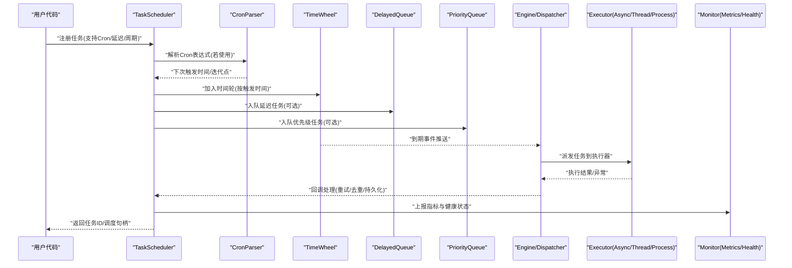
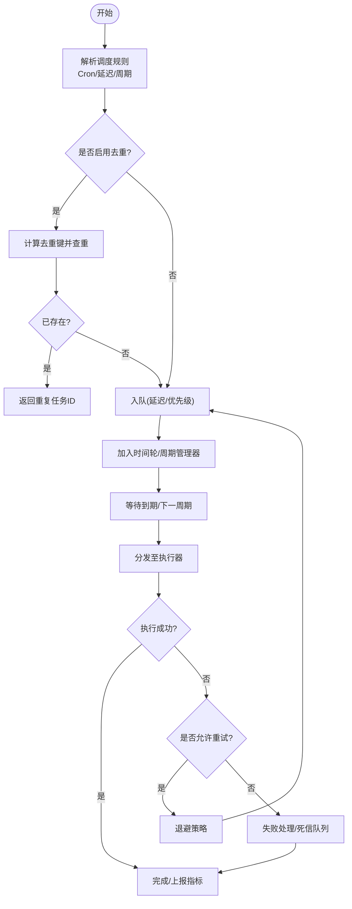
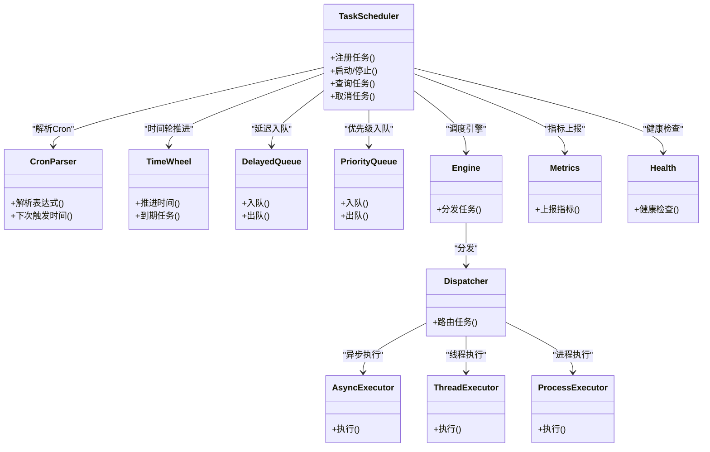

# TaskScheduler类API

<cite>
**本文引用的文件**   
- [task_scheduler.py](file://src/neotask/api/task_scheduler.py)
- [schedule.py](file://src/neotask/models/schedule.py)
- [task.py](file://src/neotask/models/task.py)
- [cron_parser.py](file://src/neotask/scheduler/cron_parser.py)
- [time_wheel.py](file://src/neotask/scheduler/time_wheel.py)
- [periodic.py](file://src/neotask/scheduler/periodic.py)
- [delayed_queue.py](file://src/neotask/queue/delayed_queue.py)
- [priority_queue.py](file://src/neotask/queue/priority_queue.py)
- [dispatcher.py](file://src/neotask/core/dispatcher.py)
- [engine.py](file://src/neotask/core/engine.py)
- [async_executor.py](file://src/neotask/executor/async_executor.py)
- [thread_executor.py](file://src/neotask/executor/thread_executor.py)
- [process_executor.py](file://src/neotask/executor/process_executor.py)
- [metrics.py](file://src/neotask/monitor/metrics.py)
- [health.py](file://src/neotask/monitor/health.py)
- [collector.py](file://src/neotask/monitor/collector.py)
- [settings.py](file://src/neotask/config/settings.py)
- [constants.py](file://src/neotask/common/constants.py)
- [exceptions.py](file://src/neotask/common/exceptions.py)
- [05_cron_tasks.py](file://examples/05_cron_tasks.py)
- [06_delayed_tasks.py](file://examples/06_delayed_tasks.py)
- [08_periodic.py](file://examples/08_periodic.py)
- [09_retry_and_cancel.py](file://examples/09_retry_and_cancel.py)
- [10_task_query.py](file://examples/10_task查询.py)
</cite>

## 目录
1. [简介](#简介)
2. [项目结构](#项目结构)
3. [核心组件](#核心组件)
4. [架构总览](#架构总览)
5. [详细组件分析](#详细组件分析)
6. [依赖分析](#依赖分析)
7. [性能考虑](#性能考虑)
8. [故障排查指南](#故障排查指南)
9. [结论](#结论)
10. [附录](#附录)

## 简介
本文件为 TaskScheduler 类的权威 API 文档，聚焦任务调度器的公共接口与高级能力，包括：
- 定时任务注册（Cron 表达式）
- 延迟任务调度
- 周期性任务管理
- 调度策略、优先级设置、任务去重、重试机制
- 与时间轮算法、Cron 解析器的集成方式
- 调度状态监控与性能调优建议

读者可据此快速掌握如何正确配置和使用 TaskScheduler，并在生产环境中进行稳定运行与优化。

## 项目结构
TaskScheduler 位于 API 层，向上暴露统一的任务调度接口，向下整合调度内核、队列、执行器、存储与监控等子系统。下图展示了与 TaskScheduler 密切相关的模块关系。

```mermaid
graph TB
subgraph "API层"
TS["TaskScheduler<br/>src/neotask/api/task_scheduler.py"]
end
subgraph "调度内核"
CW["时间轮<br/>src/neotask/scheduler/time_wheel.py"]
CP["Cron解析器<br/>src/neotask/scheduler/cron_parser.py"]
PM["周期任务管理<br/>src/neotask/scheduler/periodic.py"]
ENG["引擎/分发器<br/>src/neotask/core/engine.py<br/>src/neotask/core/dispatcher.py"]
end
subgraph "队列与存储"
DQ["延迟队列<br/>src/neotask/queue/delayed_queue.py"]
PQ["优先级队列<br/>src/neotask/queue/priority_queue.py"]
ST["存储抽象<br/>src/neotask/storage/base.py"]
end
subgraph "执行器"
AE["异步执行器<br/>src/neotask/executor/async_executor.py"]
TE["线程执行器<br/>src/neotask/executor/thread_executor.py"]
PE["进程执行器<br/>src/neotask/executor/process_executor.py"]
end
subgraph "模型与配置"
SCH["调度模型<br/>src/neotask/models/schedule.py"]
TK["任务模型<br/>src/neotask/models/task.py"]
CFG["配置<br/>src/neotask/config/settings.py"]
CTS["常量/异常<br/>src/neotask/common/constants.py<br/>src/neotask/common/exceptions.py"]
end
subgraph "监控"
MET["指标采集<br/>src/neotask/monitor/metrics.py"]
HL["健康检查<br/>src/neotask/monitor/health.py"]
COL["收集器<br/>src/neotask/monitor/collector.py"]
end
TS --> CW
TS --> CP
TS --> PM
TS --> ENG
TS --> DQ
TS --> PQ
TS --> ST
TS --> AE
TS --> TE
TS --> PE
TS --> SCH
TS --> TK
TS --> CFG
TS --> CTS
TS --> MET
TS --> HL
TS --> COL
```

图表来源
- [task_scheduler.py:1-200](file://src/neotask/api/task_scheduler.py#L1-L200)
- [time_wheel.py:1-200](file://src/neotask/scheduler/time_wheel.py#L1-L200)
- [cron_parser.py:1-200](file://src/neotask/scheduler/cron_parser.py#L1-L200)
- [periodic.py:1-200](file://src/neotask/scheduler/periodic.py#L1-L200)
- [engine.py:1-200](file://src/neotask/core/engine.py#L1-L200)
- [dispatcher.py:1-200](file://src/neotask/core/dispatcher.py#L1-L200)
- [delayed_queue.py:1-200](file://src/neotask/queue/delayed_queue.py#L1-L200)
- [priority_queue.py:1-200](file://src/neotask/queue/priority_queue.py#L1-L200)
- [async_executor.py:1-200](file://src/neotask/executor/async_executor.py#L1-L200)
- [thread_executor.py:1-200](file://src/neotask/executor/thread_executor.py#L1-L200)
- [process_executor.py:1-200](file://src/neotask/executor/process_executor.py#L1-L200)
- [schedule.py:1-200](file://src/neotask/models/schedule.py#L1-L200)
- [task.py:1-200](file://src/neotask/models/task.py#L1-L200)
- [settings.py:1-200](file://src/neotask/config/settings.py#L1-L200)
- [constants.py:1-200](file://src/neotask/common/constants.py#L1-L200)
- [exceptions.py:1-200](file://src/neotask/common/exceptions.py#L1-L200)
- [metrics.py:1-200](file://src/neotask/monitor/metrics.py#L1-L200)
- [health.py:1-200](file://src/neotask/monitor/health.py#L1-L200)
- [collector.py:1-200](file://src/neotask/monitor/collector.py#L1-L200)

章节来源
- [task_scheduler.py:1-200](file://src/neotask/api/task_scheduler.py#L1-L200)

## 核心组件
- TaskScheduler：对外统一的调度入口，提供任务注册、调度控制、查询与生命周期管理。
- CronParser：将 Cron 表达式解析为下一次触发时间点集合或迭代器。
- TimeWheel：基于时间轮的延迟/周期任务推进与到期发现。
- PeriodicManager：负责周期性任务的创建、更新、删除与状态维护。
- DelayedQueue/PriorityQueue：分别承载延迟任务与带优先级的任务排序。
- Engine/Dispatcher：调度引擎与分发器，协调任务从队列到执行器的投递。
- Executors：异步/线程/进程执行器，实际执行业务逻辑。
- Models：Schedule/Task 数据模型，描述调度规则与任务元信息。
- Monitor：指标、健康检查与收集器，用于观测与告警。

章节来源
- [task_scheduler.py:1-200](file://src/neotask/api/task_scheduler.py#L1-L200)
- [schedule.py:1-200](file://src/neotask/models/schedule.py#L1-L200)
- [task.py:1-200](file://src/neotask/models/task.py#L1-L200)

## 架构总览
下图展示一次典型“注册并调度”的调用序列，涵盖从 API 到内核、队列、执行器的完整链路。

图表来源
- [task_scheduler.py:1-200](file://src/neotask/api/task_scheduler.py#L1-L200)
- [cron_parser.py:1-200](file://src/neotask/scheduler/cron_parser.py#L1-L200)
- [time_wheel.py:1-200](file://src/neotask/scheduler/time_wheel.py#L1-L200)
- [delayed_queue.py:1-200](file://src/neotask/queue/delayed_queue.py#L1-L200)
- [priority_queue.py:1-200](file://src/neotask/queue/priority_queue.py#L1-L200)
- [engine.py:1-200](file://src/neotask/core/engine.py#L1-L200)
- [dispatcher.py:1-200](file://src/neotask/core/dispatcher.py#L1-L200)
- [async_executor.py:1-200](file://src/neotask/executor/async_executor.py#L1-L200)
- [thread_executor.py:1-200](file://src/neotask/executor/thread_executor.py#L1-L200)
- [process_executor.py:1-200](file://src/neotask/executor/process_executor.py#L1-L200)
- [metrics.py:1-200](file://src/neotask/monitor/metrics.py#L1-L200)
- [health.py:1-200](file://src/neotask/monitor/health.py#L1-L200)

## 详细组件分析

### TaskScheduler 公共接口概览
- 任务注册
  - 支持一次性任务、延迟任务、Cron 定时任务、周期性任务。
  - 可指定优先级、去重键、重试策略、超时、标签与扩展参数。
- 调度控制
  - 启动/停止调度器、暂停/恢复特定任务、取消任务。
- 查询与观察
  - 按条件查询任务列表、获取任务详情、订阅任务状态变更事件。
- 配置与上下文
  - 通过配置对象注入执行器、队列、存储、监控等依赖。
- 生命周期
  - 优雅关闭、资源清理、状态同步。

章节来源
- [task_scheduler.py:1-200](file://src/neotask/api/task_scheduler.py#L1-L200)

#### 任务注册与调度流程

图表来源
- [task_scheduler.py:1-200](file://src/neotask/api/task_scheduler.py#L1-L200)
- [cron_parser.py:1-200](file://src/neotask/scheduler/cron_parser.py#L1-L200)
- [time_wheel.py:1-200](file://src/neotask/scheduler/time_wheel.py#L1-L200)
- [delayed_queue.py:1-200](file://src/neotask/queue/delayed_queue.py#L1-L200)
- [priority_queue.py:1-200](file://src/neotask/queue/priority_queue.py#L1-L200)
- [engine.py:1-200](file://src/neotask/core/engine.py#L1-L200)
- [dispatcher.py:1-200](file://src/neotask/core/dispatcher.py#L1-L200)

#### Cron 表达式配置与解析
- 支持的字段与时区语义由 CronParser 定义。
- 推荐在注册时传入标准 Cron 字符串，内部转换为下一次触发时间。
- 对于跨日/跨月边界场景，建议使用测试用例验证预期行为。

章节来源
- [cron_parser.py:1-200](file://src/neotask/scheduler/cron_parser.py#L1-L200)
- [05_cron_tasks.py:1-200](file://examples/05_cron_tasks.py#L1-L200)

#### 延迟任务调度
- 通过 DelayedQueue 实现高精度延迟投递。
- 支持相对延迟（秒/毫秒）与绝对时间点两种模式。
- 可与优先级队列组合，实现“延迟+优先级”的复合调度。

章节来源
- [delayed_queue.py:1-200](file://src/neotask/queue/delayed_queue.py#L1-L200)
- [priority_queue.py:1-200](file://src/neotask/queue/priority_queue.py#L1-L200)
- [06_delayed_tasks.py:1-200](file://examples/06_delayed_tasks.py#L1-L200)

#### 周期性任务管理
- PeriodicManager 负责周期任务的创建、更新、删除与状态维护。
- 支持固定间隔与 Cron 驱动的周期任务。
- 提供幂等更新接口，避免重复注册。

章节来源
- [periodic.py:1-200](file://src/neotask/scheduler/periodic.py#L1-L200)
- [08_periodic.py:1-200](file://examples/08_periodic.py#L1-L200)

#### 调度策略与优先级
- 优先级队列根据任务优先级决定出队顺序。
- 可结合权重、标签路由、亲和性策略（由上层策略模块定义）实现更细粒度调度。
- 高优先级任务可在拥塞时获得更快的响应。

章节来源
- [priority_queue.py:1-200](file://src/neotask/queue/priority_queue.py#L1-L200)
- [task_scheduler.py:1-200](file://src/neotask/api/task_scheduler.py#L1-L200)

#### 任务去重
- 基于去重键（如业务唯一标识）判断是否重复注册。
- 支持按任务类型、参数指纹、标签维度进行去重。
- 重复任务可直接复用已有调度实例，减少资源开销。

章节来源
- [task_scheduler.py:1-200](file://src/neotask/api/task_scheduler.py#L1-L200)

#### 重试机制
- 支持指数退避、固定间隔、抖动等多种退避策略。
- 可配置最大重试次数、重试窗口、重试条件（仅特定异常）。
- 重试失败后进入死信队列或失败处理分支。

章节来源
- [09_retry_and_cancel.py:1-200](file://examples/09_retry_and_cancel.py#L1-L200)
- [task_scheduler.py:1-200](file://src/neotask/api/task_scheduler.py#L1-L200)

#### 与时间轮算法的集成
- TimeWheel 以桶为单位推进时间，高效发现到期任务。
- 适合大规模延迟/周期任务场景，降低扫描复杂度。
- 与 DelayedQueue 配合，形成“时间轮驱动 + 队列缓冲”的稳定方案。

章节来源
- [time_wheel.py:1-200](file://src/neotask/scheduler/time_wheel.py#L1-L200)
- [delayed_queue.py:1-200](file://src/neotask/queue/delayed_queue.py#L1-L200)

#### 与 Cron 解析器的集成
- CronParser 将表达式解析为下一次触发时间或迭代器。
- 与 PeriodicManager 协作，确保周期任务在重启后能恢复。
- 支持时区与夏令时切换的边界处理。

章节来源
- [cron_parser.py:1-200](file://src/neotask/scheduler/cron_parser.py#L1-L200)
- [periodic.py:1-200](file://src/neotask/scheduler/periodic.py#L1-L200)

#### 执行器选择与隔离
- 异步执行器：适用于 I/O 密集型任务。
- 线程执行器：适用于 CPU 中等负载且需并发控制的场景。
- 进程执行器：适用于强隔离、CPU 密集或需要独立内存空间的场景。
- 可通过配置动态选择执行器，或在任务级别指定。

章节来源
- [async_executor.py:1-200](file://src/neotask/executor/async_executor.py#L1-L200)
- [thread_executor.py:1-200](file://src/neotask/executor/thread_executor.py#L1-L200)
- [process_executor.py:1-200](file://src/neotask/executor/process_executor.py#L1-L200)
- [task_scheduler.py:1-200](file://src/neotask/api/task_scheduler.py#L1-L200)

#### 调度状态监控
- Metrics：记录任务提交、执行耗时、成功率、重试次数等指标。
- Health：提供健康检查端点，反映调度器可用性与关键子系统状态。
- Collector：聚合多源指标，便于导出与可视化。

章节来源
- [metrics.py:1-200](file://src/neotask/monitor/metrics.py#L1-L200)
- [health.py:1-200](file://src/neotask/monitor/health.py#L1-L200)
- [collector.py:1-200](file://src/neotask/monitor/collector.py#L1-L200)
- [task_scheduler.py:1-200](file://src/neotask/api/task_scheduler.py#L1-L200)

#### 配置项与最佳实践
- 执行器池大小：根据任务类型与硬件资源调整。
- 队列容量与背压：防止内存溢出，必要时引入限流。
- 重试与退避：合理设置最大重试次数与退避上限，避免雪崩。
- 去重键设计：确保业务唯一性，避免误判。
- Cron 表达式校验：上线前进行单元测试覆盖边界情况。
- 监控与告警：对关键指标设置阈值，及时发现异常。

章节来源
- [settings.py:1-200](file://src/neotask/config/settings.py#L1-L200)
- [constants.py:1-200](file://src/neotask/common/constants.py#L1-L200)
- [05_cron_tasks.py:1-200](file://examples/05_cron_tasks.py#L1-L200)
- [06_delayed_tasks.py:1-200](file://examples/06_delayed_tasks.py#L1-L200)
- [08_periodic.py:1-200](file://examples/08_periodic.py#L1-L200)
- [09_retry_and_cancel.py:1-200](file://examples/09_retry_and_cancel.py#L1-L200)
- [10_task_query.py:1-200](file://examples/10_task查询.py#L1-L200)

## 依赖分析
TaskScheduler 的依赖关系如下：

图表来源
- [task_scheduler.py:1-200](file://src/neotask/api/task_scheduler.py#L1-L200)
- [cron_parser.py:1-200](file://src/neotask/scheduler/cron_parser.py#L1-L200)
- [time_wheel.py:1-200](file://src/neotask/scheduler/time_wheel.py#L1-L200)
- [delayed_queue.py:1-200](file://src/neotask/queue/delayed_queue.py#L1-L200)
- [priority_queue.py:1-200](file://src/neotask/queue/priority_queue.py#L1-L200)
- [engine.py:1-200](file://src/neotask/core/engine.py#L1-L200)
- [dispatcher.py:1-200](file://src/neotask/core/dispatcher.py#L1-L200)
- [async_executor.py:1-200](file://src/neotask/executor/async_executor.py#L1-L200)
- [thread_executor.py:1-200](file://src/neotask/executor/thread_executor.py#L1-L200)
- [process_executor.py:1-200](file://src/neotask/executor/process_executor.py#L1-L200)
- [metrics.py:1-200](file://src/neotask/monitor/metrics.py#L1-L200)
- [health.py:1-200](file://src/neotask/monitor/health.py#L1-L200)

章节来源
- [task_scheduler.py:1-200](file://src/neotask/api/task_scheduler.py#L1-L200)

## 性能考虑
- 时间轮桶大小与推进步长：平衡内存占用与到期发现延迟。
- 队列容量与背压：在高吞吐下避免内存膨胀，必要时限流或降级。
- 执行器并行度：根据任务类型（I/O/CPU）与硬件资源调优。
- 去重与索引：对高频重复任务启用去重，减少重复调度开销。
- 指标采样频率：避免过高采样频率导致额外开销。
- 批处理与合并：对相似任务进行批量处理，提升吞吐。

[本节为通用性能指导，不直接分析具体文件]

## 故障排查指南
- 常见异常类型与定位
  - 任务执行超时：检查执行器超时配置与任务耗时分布。
  - 重试风暴：检查退避策略与最大重试次数，避免雪崩。
  - Cron 表达式错误：使用解析器单元测试验证表达式合法性。
  - 队列积压：检查消费者消费速率与执行器并行度。
- 监控与诊断
  - 查看指标：提交量、执行耗时、成功率、重试次数、队列长度。
  - 健康检查：确认调度器与关键子系统状态。
  - 日志追踪：结合任务 ID 与标签进行端到端追踪。

章节来源
- [exceptions.py:1-200](file://src/neotask/common/exceptions.py#L1-L200)
- [metrics.py:1-200](file://src/neotask/monitor/metrics.py#L1-L200)
- [health.py:1-200](file://src/neotask/monitor/health.py#L1-L200)
- [collector.py:1-200](file://src/neotask/monitor/collector.py#L1-L200)

## 结论
TaskScheduler 提供了完整的任务调度能力，覆盖一次性、延迟、Cron 与周期任务，并通过时间轮与 Cron 解析器实现高效调度。借助优先级队列、去重与重试机制，系统具备高可靠与可扩展特性。结合监控与健康检查，可在生产环境实现稳定运行与持续优化。

[本节为总结性内容，不直接分析具体文件]

## 附录
- 示例参考
  - Cron 任务示例：[05_cron_tasks.py](file://examples/05_cron_tasks.py)
  - 延迟任务示例：[06_delayed_tasks.py](file://examples/06_delayed_tasks.py)
  - 周期任务示例：[08_periodic.py](file://examples/08_periodic.py)
  - 重试与取消示例：[09_retry_and_cancel.py](file://examples/09_retry_and_cancel.py)
  - 任务查询示例：[10_task_query.py](file://examples/10_task查询.py)

章节来源
- [05_cron_tasks.py:1-200](file://examples/05_cron_tasks.py#L1-L200)
- [06_delayed_tasks.py:1-200](file://examples/06_delayed_tasks.py#L1-L200)
- [08_periodic.py:1-200](file://examples/08_periodic.py#L1-L200)
- [09_retry_and_cancel.py:1-200](file://examples/09_retry_and_cancel.py#L1-L200)
- [10_task_query.py:1-200](file://examples/10_task查询.py#L1-L200)