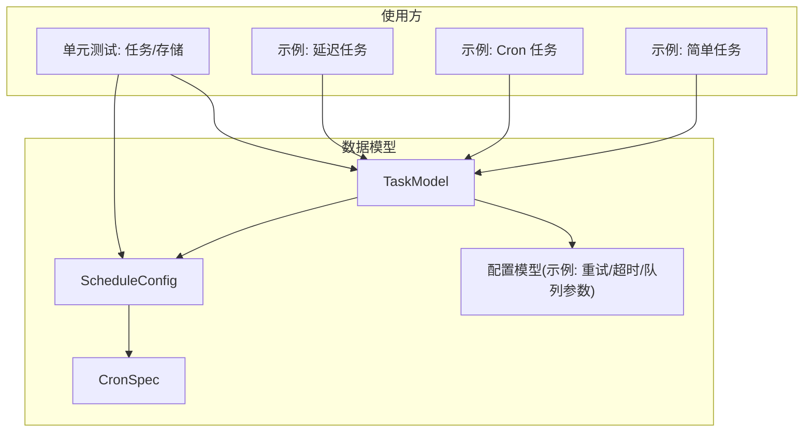
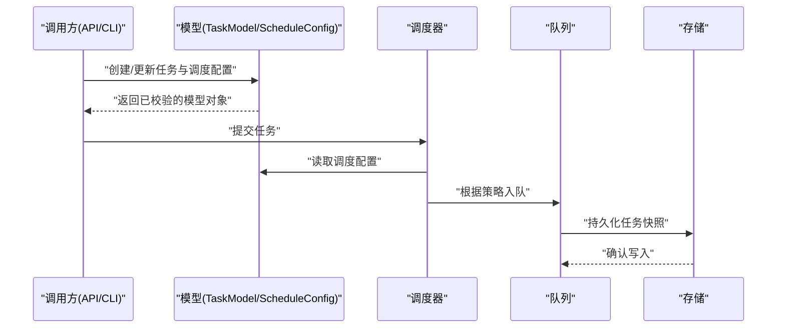
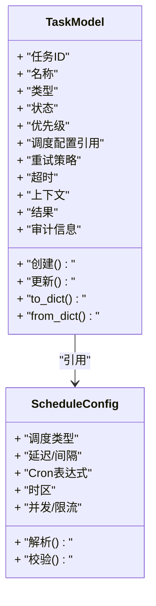
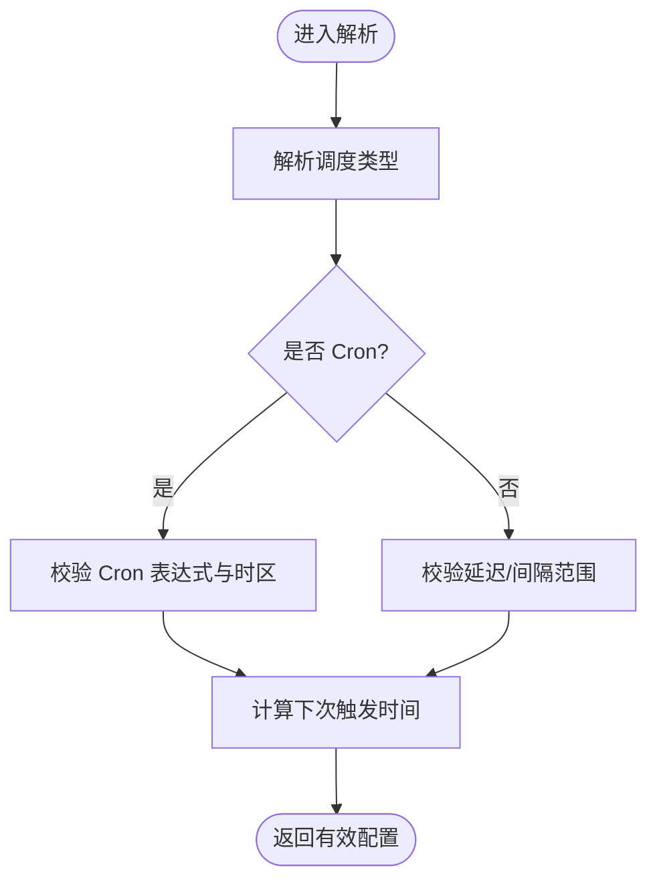
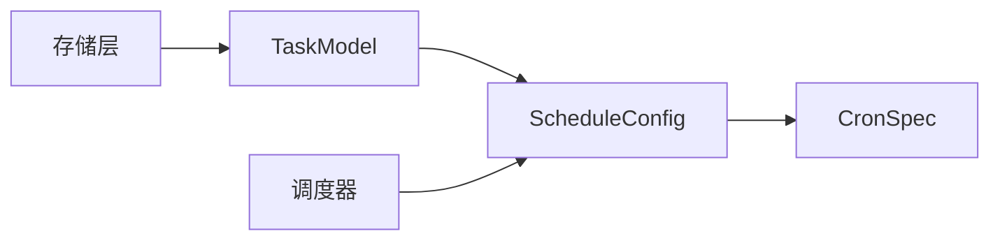

# 数据模型类

<cite>
**本文引用的文件**   
- [src/neotask/models/task.py](file://src/neotask/models/task.py)
- [src/neotask/models/schedule.py](file://src/neotask/models/schedule.py)
- [src/neotask/models/config.py](file://src/neotask/models/config.py)
- [src/neotask/models/__init__.py](file://src/neotask/models/__init__.py)
- [examples/01_simple.py](file://examples/01_simple.py)
- [examples/05_cron_tasks.py](file://examples/05_cron_tasks.py)
- [examples/06_delayed_tasks.py](file://examples/06_delayed_tasks.py)
- [tests/unit/test_task.py](file://tests/unit/test_task.py)
- [tests/unit/test_storage.py](file://tests/unit/test_storage.py)
</cite>

## 目录
1. [简介](#简介)
2. [项目结构](#项目结构)
3. [核心组件](#核心组件)
4. [架构总览](#架构总览)
5. [详细组件分析](#详细组件分析)
6. [依赖关系分析](#依赖关系分析)
7. [性能考虑](#性能考虑)
8. [故障排查指南](#故障排查指南)
9. [结论](#结论)
10. [附录](#附录)

## 简介
本文件聚焦于任务调度系统中的数据模型，重点覆盖 TaskModel、ScheduleConfig 等核心数据结构。文档将详细说明字段定义、数据类型、验证规则与业务含义，对象之间的关系与依赖，创建、序列化与反序列化的使用方式，版本兼容性与迁移策略，以及在 API 调用中的注意事项。目标是帮助开发者快速理解并正确使用这些模型，确保在存储、传输和跨版本演进过程中的稳定性与一致性。

## 项目结构
数据模型位于 models 包中，按职责拆分为任务模型、调度配置与通用配置：
- 任务模型：TaskModel（任务实体）
- 调度模型：ScheduleConfig（调度配置）、CronSpec（Cron 表达式规范）
- 配置模型：全局或模块级配置项（如重试、超时、队列参数等）

图表来源
- [src/neotask/models/task.py](file://src/neotask/models/task.py)
- [src/neotask/models/schedule.py](file://src/neotask/models/schedule.py)
- [src/neotask/models/config.py](file://src/neotask/models/config.py)
- [examples/01_simple.py](file://examples/01_simple.py)
- [examples/05_cron_tasks.py](file://examples/05_cron_tasks.py)
- [examples/06_delayed_tasks.py](file://examples/06_delayed_tasks.py)
- [tests/unit/test_task.py](file://tests/unit/test_task.py)
- [tests/unit/test_storage.py](file://tests/unit/test_storage.py)

章节来源
- [src/neotask/models/task.py](file://src/neotask/models/task.py)
- [src/neotask/models/schedule.py](file://src/neotask/models/schedule.py)
- [src/neotask/models/config.py](file://src/neotask/models/config.py)
- [src/neotask/models/__init__.py](file://src/neotask/models/__init__.py)

## 核心组件
本节概述关键数据模型的职责与相互关系，为后续深入分析提供框架。

- TaskModel
  - 职责：表示一个可执行的任务实例，包含标识、状态、调度信息、执行上下文、结果与审计信息等。
  - 关键字段（概念性说明）：任务ID、名称、类型、状态、优先级、调度配置引用、重试策略、超时、错误信息、创建/更新时间、执行结果等。
  - 行为：支持创建、更新、序列化/反序列化、校验、状态转换约束等。

- ScheduleConfig
  - 职责：描述任务的调度策略，包括一次性延迟、周期执行、Cron 表达式等。
  - 关键字段（概念性说明）：调度类型、延迟秒数、间隔秒数、Cron 表达式、时区、最大并发、限流等。
  - 行为：解析与校验调度表达式、计算下次触发时间、与 TaskModel 关联。

- CronSpec
  - 职责：对 Cron 表达式的结构化描述与校验，便于持久化与可视化展示。
  - 关键字段（概念性说明）：原始表达式、解析后的分钟/小时/日/月/周等字段、时区、有效性标志。

- 配置模型（示例）
  - 职责：系统或模块级配置，如默认重试次数、超时阈值、队列容量、存储后端参数等。
  - 行为：加载、合并、校验、提供默认值。

章节来源
- [src/neotask/models/task.py](file://src/neotask/models/task.py)
- [src/neotask/models/schedule.py](file://src/neotask/models/schedule.py)
- [src/neotask/models/config.py](file://src/neotask/models/config.py)

## 架构总览
数据模型在整个系统中的位置与交互如下：
- 上层 API/CLI/WebUI 通过工厂或构造器创建 TaskModel 与 ScheduleConfig。
- 调度器读取 ScheduleConfig 计算触发时间，驱动任务入队。
- 存储层以 JSON/二进制形式持久化 TaskModel 与 ScheduleConfig。
- 监控与事件总线消费模型变更事件，用于指标采集与告警。

图表来源
- [src/neotask/models/task.py](file://src/neotask/models/task.py)
- [src/neotask/models/schedule.py](file://src/neotask/models/schedule.py)
- [src/neotask/models/config.py](file://src/neotask/models/config.py)

## 详细组件分析

### TaskModel 分析
- 字段定义与业务含义（概念性）
  - 标识类：任务ID、批次ID、父任务ID
  - 元数据：名称、标签、描述、版本
  - 调度相关：调度配置引用、优先级、重试策略、超时
  - 执行上下文：执行器类型、参数、环境变量、工作目录
  - 状态与审计：当前状态、错误信息、开始/结束时间、完成比例
  - 结果与日志：输出摘要、日志指针、追踪ID
- 数据类型与验证规则（概念性）
  - ID 采用不可变唯一标识；状态枚举受有限集合约束；数值型字段存在范围限制（如超时>0、重试>=0）。
  - 必填字段：任务ID、调度配置（若需要调度）、执行器类型等。
  - 可选字段：标签、描述、环境变量等。
- 对象关系与依赖
  - 依赖 ScheduleConfig（当任务由调度驱动时）。
  - 被存储层、调度器、执行器、监控与事件总线消费。
- 创建与生命周期
  - 通过构造器或工厂方法创建，内部进行基础校验。
  - 状态机驱动：待调度 -> 排队中 -> 运行中 -> 已完成/失败/取消。
- 序列化与反序列化
  - 提供 to_dict/from_dict 或等价接口，保证向后兼容（新增字段带默认值，废弃字段保留兼容映射）。
- 典型用法路径
  - 创建任务：参考示例脚本路径
  - 查询与过滤：参考测试用例路径

图表来源
- [src/neotask/models/task.py](file://src/neotask/models/task.py)
- [src/neotask/models/schedule.py](file://src/neotask/models/schedule.py)

章节来源
- [src/neotask/models/task.py](file://src/neotask/models/task.py)
- [tests/unit/test_task.py](file://tests/unit/test_task.py)

### ScheduleConfig 与 CronSpec 分析
- 字段定义与业务含义（概念性）
  - 调度类型：一次性延迟、固定间隔、Cron 表达式。
  - 延迟/间隔：秒级精度，需大于等于0。
  - CronSpec：结构化解析后的 Cron 字段与时区。
  - 并发与限流：最大并行度、速率限制。
- 验证规则（概念性）
  - Cron 表达式合法性校验；时区有效性；数值范围检查。
- 与 TaskModel 的关系
  - 作为外键式引用，TaskModel 持有其标识或副本，避免循环依赖。
- 常用流程：解析与计算下次触发时间

图表来源
- [src/neotask/models/schedule.py](file://src/neotask/models/schedule.py)

章节来源
- [src/neotask/models/schedule.py](file://src/neotask/models/schedule.py)

### 配置模型（示例）
- 常见字段（概念性）
  - 重试：默认次数、退避策略、最大重试时间。
  - 超时：默认任务超时、执行器超时。
  - 队列：容量、优先级策略、死信队列开关。
  - 存储：后端类型、连接参数、索引策略。
- 行为
  - 加载顺序：默认值 -> 配置文件 -> 环境变量 -> 运行时覆盖。
  - 校验：必填项、取值范围、互斥组合。

章节来源
- [src/neotask/models/config.py](file://src/neotask/models/config.py)

### 创建、序列化与反序列化示例（路径指引）
- 创建任务与调度配置
  - 简单任务：[examples/01_simple.py](file://examples/01_simple.py)
  - Cron 任务：[examples/05_cron_tasks.py](file://examples/05_cron_tasks.py)
  - 延迟任务：[examples/06_delayed_tasks.py](file://examples/06_delayed_tasks.py)
- 序列化/反序列化
  - 参考模型提供的 to_dict/from_dict 或等价接口（具体实现见模型文件）。
- 单元测试参考
  - 任务模型行为与边界条件：[tests/unit/test_task.py](file://tests/unit/test_task.py)
  - 存储层序列化兼容性：[tests/unit/test_storage.py](file://tests/unit/test_storage.py)

章节来源
- [examples/01_simple.py](file://examples/01_simple.py)
- [examples/05_cron_tasks.py](file://examples/05_cron_tasks.py)
- [examples/06_delayed_tasks.py](file://examples/06_delayed_tasks.py)
- [tests/unit/test_task.py](file://tests/unit/test_task.py)
- [tests/unit/test_storage.py](file://tests/unit/test_storage.py)

### 版本兼容性与迁移指南
- 设计原则
  - 新增字段必须提供默认值，保持旧客户端可正常读写。
  - 废弃字段保留兼容映射，逐步淘汰并在日志中提示。
  - 版本号字段用于存储格式与语义版本控制。
- 迁移步骤（概念性）
  - 升级存储后端前，先运行兼容性检查脚本。
  - 分批滚动升级，观察异常与指标。
  - 清理废弃字段与旧索引。
- 回滚策略
  - 保留旧版本模型读能力，确保回滚后数据可读。
  - 禁止在回滚窗口内写入新字段。

章节来源
- [src/neotask/models/task.py](file://src/neotask/models/task.py)
- [src/neotask/models/schedule.py](file://src/neotask/models/schedule.py)
- [src/neotask/models/config.py](file://src/neotask/models/config.py)

### API 调用中的使用方式与注意事项
- 输入校验
  - 所有外部传入的模型字段应在入口处进行严格校验，拒绝非法值。
- 幂等性
  - 基于任务ID实现幂等写入，避免重复提交导致的状态不一致。
- 并发与锁
  - 更新任务状态时使用分布式锁或乐观锁，防止竞态条件。
- 序列化安全
  - 对外暴露的 JSON 仅包含必要字段，敏感信息脱敏。
- 错误处理
  - 统一错误码与消息，记录上下文以便定位问题。

章节来源
- [src/neotask/models/task.py](file://src/neotask/models/task.py)
- [src/neotask/models/schedule.py](file://src/neotask/models/schedule.py)

## 依赖关系分析
- 直接依赖
  - TaskModel 依赖 ScheduleConfig（当任务由调度驱动）。
  - ScheduleConfig 依赖 CronSpec（当使用 Cron 表达式）。
- 间接依赖
  - 存储层依赖模型的序列化接口。
  - 调度器依赖模型的解析与计算接口。
- 潜在循环依赖
  - 通过“引用标识”而非直接对象引用来避免循环依赖。

图表来源
- [src/neotask/models/task.py](file://src/neotask/models/task.py)
- [src/neotask/models/schedule.py](file://src/neotask/models/schedule.py)

章节来源
- [src/neotask/models/task.py](file://src/neotask/models/task.py)
- [src/neotask/models/schedule.py](file://src/neotask/models/schedule.py)

## 性能考虑
- 序列化开销
  - 大对象频繁序列化会影响吞吐，建议按需序列化与批量操作。
- 索引与查询
  - 为高频查询字段建立索引（如状态、优先级、调度类型）。
- 内存占用
  - 避免在模型中携带过大上下文，必要时使用指针或外部存储。
- 并发更新
  - 使用轻量级快照与增量更新，减少锁竞争。

## 故障排查指南
- 常见问题
  - 调度表达式无效：检查 Cron 表达式与时区设置。
  - 任务状态不一致：检查并发更新逻辑与锁策略。
  - 序列化失败：检查字段类型与默认值。
- 诊断手段
  - 启用详细日志，记录模型变更前后快照。
  - 使用单元测试复现边界场景。
  - 监控关键指标（失败率、耗时、队列积压）。

章节来源
- [tests/unit/test_task.py](file://tests/unit/test_task.py)
- [tests/unit/test_storage.py](file://tests/unit/test_storage.py)

## 结论
通过对 TaskModel、ScheduleConfig 与 CronSpec 等核心数据模型的深入分析，明确了字段定义、验证规则、对象关系与使用方式。遵循版本兼容与迁移策略，可在不中断服务的前提下平滑演进。结合 API 调用的最佳实践与性能优化建议，有助于构建稳定高效的调度系统。

## 附录
- 术语表
  - 任务：一次可执行的作业单元。
  - 调度：决定任务何时以及如何触发的策略。
  - Cron：一种时间表达式语法，用于周期性调度。
- 参考路径
  - 模型定义：[src/neotask/models/task.py](file://src/neotask/models/task.py)、[src/neotask/models/schedule.py](file://src/neotask/models/schedule.py)、[src/neotask/models/config.py](file://src/neotask/models/config.py)
  - 示例与测试：[examples/01_simple.py](file://examples/01_simple.py)、[examples/05_cron_tasks.py](file://examples/05_cron_tasks.py)、[examples/06_delayed_tasks.py](file://examples/06_delayed_tasks.py)、[tests/unit/test_task.py](file://tests/unit/test_task.py)、[tests/unit/test_storage.py](file://tests/unit/test_storage.py)