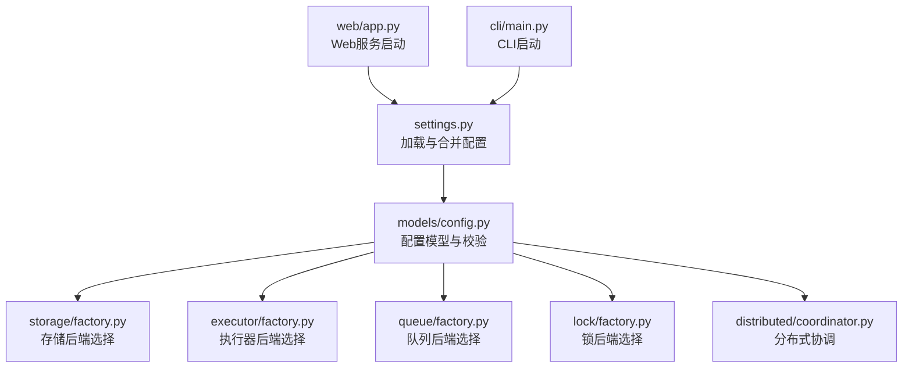
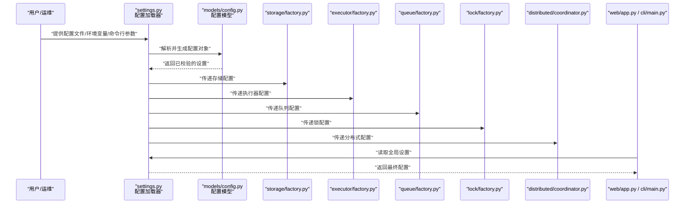
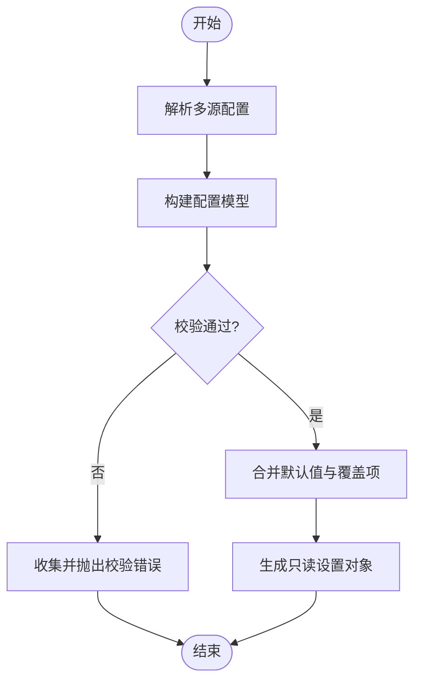
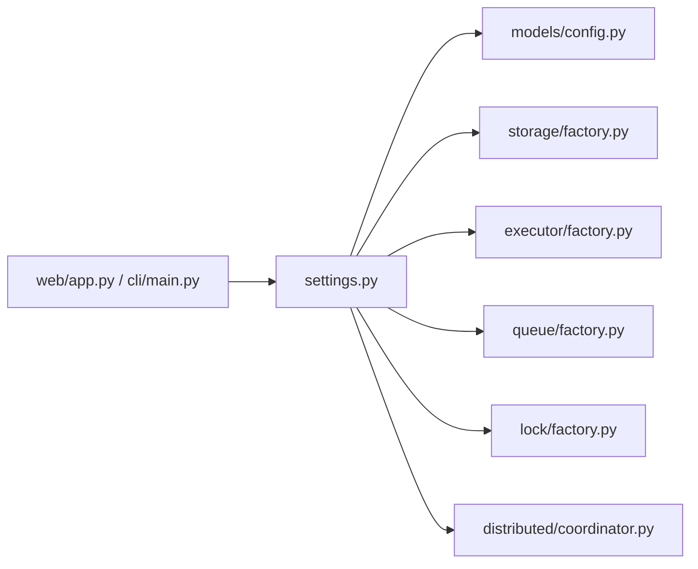

# 配置管理API

<cite>
**本文引用的文件**   
- [src/neotask/config/settings.py](file://src/neotask/config/settings.py)
- [src/neotask/models/config.py](file://src/neotask/models/config.py)
- [src/neotask/storage/factory.py](file://src/neotask/storage/factory.py)
- [src/neotask/executor/factory.py](file://src/neotask/executor/factory.py)
- [src/neotask/queue/factory.py](file://src/neotask/queue/factory.py)
- [src/neotask/lock/factory.py](file://src/neotask/lock/factory.py)
- [src/neotask/distributed/coordinator.py](file://src/neotask/distributed/coordinator.py)
- [src/neotask/web/app.py](file://src/neotask/web/app.py)
- [src/neotask/cli/main.py](file://src/neotask/cli/main.py)
- [src/neotask/common/constants.py](file://src/neotask/common/constants.py)
- [examples/00_quick_start.py](file://examples/00_quick_start.py)
</cite>

## 目录
1. [简介](#简介)
2. [项目结构](#项目结构)
3. [核心组件](#核心组件)
4. [架构总览](#架构总览)
5. [详细组件分析](#详细组件分析)
6. [依赖关系分析](#依赖关系分析)
7. [性能考虑](#性能考虑)
8. [故障排查指南](#故障排查指南)
9. [结论](#结论)
10. [附录](#附录)

## 简介
本文件面向“任务调度管理器”的配置管理子系统，提供完整的配置类与配置项说明、YAML与环境变量示例、优先级与继承规则、动态更新机制、验证规则与默认值说明，以及不同部署场景下的模板与最佳实践。目标读者包括运维工程师、平台开发者与集成方。

## 项目结构
配置相关代码主要分布在以下模块：
- 配置加载与设置对象：config/settings.py
- 配置数据模型与校验：models/config.py
- 各子系统的工厂（根据配置创建实例）：storage/factory.py、executor/factory.py、queue/factory.py、lock/factory.py
- 分布式协调器（读取分布式相关配置）：distributed/coordinator.py
- Web应用与CLI入口（初始化时消费配置）：web/app.py、cli/main.py
- 常量定义（用于默认值或约束）：common/constants.py
- 快速开始示例（展示最小可用配置）：examples/00_quick_start.py

图表来源
- [src/neotask/config/settings.py](file://src/neotask/config/settings.py)
- [src/neotask/models/config.py](file://src/neotask/models/config.py)
- [src/neotask/storage/factory.py](file://src/neotask/storage/factory.py)
- [src/neotask/executor/factory.py](file://src/neotask/executor/factory.py)
- [src/neotask/queue/factory.py](file://src/neotask/queue/factory.py)
- [src/neotask/lock/factory.py](file://src/neotask/lock/factory.py)
- [src/neotask/distributed/coordinator.py](file://src/neotask/distributed/coordinator.py)
- [src/neotask/web/app.py](file://src/neotask/web/app.py)
- [src/neotask/cli/main.py](file://src/neotask/cli/main.py)

章节来源
- [src/neotask/config/settings.py](file://src/neotask/config/settings.py)
- [src/neotask/models/config.py](file://src/neotask/models/config.py)
- [src/neotask/storage/factory.py](file://src/neotask/storage/factory.py)
- [src/neotask/executor/factory.py](file://src/neotask/executor/factory.py)
- [src/neotask/queue/factory.py](file://src/neotask/queue/factory.py)
- [src/neotask/lock/factory.py](file://src/neotask/lock/factory.py)
- [src/neotask/distributed/coordinator.py](file://src/neotask/distributed/coordinator.py)
- [src/neotask/web/app.py](file://src/neotask/web/app.py)
- [src/neotask/cli/main.py](file://src/neotask/cli/main.py)

## 核心组件
- 配置加载器与设置对象
  - 负责从多源（配置文件、环境变量、命令行参数等）加载并合并配置，生成统一的设置对象供全局使用。
  - 支持热重载与增量更新（见“动态更新机制”）。
- 配置数据模型
  - 以强类型结构描述所有配置项，包含字段名、类型、默认值、取值范围与校验逻辑。
  - 提供按命名空间分组的基础配置、调度配置、执行器配置、存储配置、分布式配置等。
- 子系统工厂
  - storage/executor/queue/lock 的工厂根据配置选择具体实现（如内存/Redis/SQLite等），并在构造时进行必要校验。
- 分布式协调器
  - 读取分布式相关配置（节点发现、心跳、选举、分片策略等），驱动集群行为。
- 应用入口
  - Web应用与CLI在启动阶段消费配置，完成初始化与资源准备。

章节来源
- [src/neotask/config/settings.py](file://src/neotask/config/settings.py)
- [src/neotask/models/config.py](file://src/neotask/models/config.py)
- [src/neotask/storage/factory.py](file://src/neotask/storage/factory.py)
- [src/neotask/executor/factory.py](file://src/neotask/executor/factory.py)
- [src/neotask/queue/factory.py](file://src/neotask/queue/factory.py)
- [src/neotask/lock/factory.py](file://src/neotask/lock/factory.py)
- [src/neotask/distributed/coordinator.py](file://src/neotask/distributed/coordinator.py)
- [src/neotask/web/app.py](file://src/neotask/web/app.py)
- [src/neotask/cli/main.py](file://src/neotask/cli/main.py)

## 架构总览
下图展示了配置在系统内的流转路径：从多源加载到模型校验，再到各子系统工厂与应用入口的装配过程。

图表来源
- [src/neotask/config/settings.py](file://src/neotask/config/settings.py)
- [src/neotask/models/config.py](file://src/neotask/models/config.py)
- [src/neotask/storage/factory.py](file://src/neotask/storage/factory.py)
- [src/neotask/executor/factory.py](file://src/neotask/executor/factory.py)
- [src/neotask/queue/factory.py](file://src/neotask/queue/factory.py)
- [src/neotask/lock/factory.py](file://src/neotask/lock/factory.py)
- [src/neotask/distributed/coordinator.py](file://src/neotask/distributed/coordinator.py)
- [src/neotask/web/app.py](file://src/neotask/web/app.py)
- [src/neotask/cli/main.py](file://src/neotask/cli/main.py)

## 详细组件分析

### 基础配置（基础运行参数）
- 典型字段类别
  - 进程/线程池大小、日志级别、调试开关、超时时间、重试次数、指标采集开关等。
- 默认值与来源
  - 默认值由配置模型定义；可通过配置文件覆盖；环境变量可进一步覆盖；命令行参数优先级最高。
- 校验规则
  - 非负整数、区间范围、枚举值、必填项检查。
- 常见影响面
  - 并发度、吞吐、延迟、资源占用、监控可见性。

章节来源
- [src/neotask/models/config.py](file://src/neotask/models/config.py)
- [src/neotask/config/settings.py](file://src/neotask/config/settings.py)
- [src/neotask/common/constants.py](file://src/neotask/common/constants.py)

### 调度配置（定时与周期任务）
- 典型字段类别
  - 调度器数量、时间轮精度、周期任务注册表刷新间隔、Cron表达式解析选项等。
- 默认值与来源
  - 默认值来自模型；可按环境切换（开发/测试/生产）。
- 校验规则
  - 时间单位合法性、表达式语法校验、最大并发限制。
- 性能提示
  - 高吞吐场景建议增大调度器实例数与时间轮桶大小，避免频繁GC。

章节来源
- [src/neotask/models/config.py](file://src/neotask/models/config.py)
- [src/neotask/config/settings.py](file://src/neotask/config/settings.py)

### 执行器配置（任务执行后端）
- 典型字段类别
  - 执行器类型（线程/进程）、工作进程数、最大任务并行度、超时与取消策略、隔离策略等。
- 默认值与来源
  - 默认值来自模型；通过配置文件或环境变量指定。
- 校验规则
  - 类型枚举、数值范围、互斥字段检查（例如某些模式不可同时启用）。
- 与工厂的关系
  - executor/factory.py 根据配置选择具体执行器实现并注入运行时参数。

章节来源
- [src/neotask/models/config.py](file://src/neotask/models/config.py)
- [src/neotask/executor/factory.py](file://src/neotask/executor/factory.py)
- [src/neotask/config/settings.py](file://src/neotask/config/settings.py)

### 存储配置（持久化与缓存）
- 典型字段类别
  - 存储后端类型（内存/SQLite/Redis等）、连接字符串、数据库名、连接池大小、读写超时、重试策略。
- 默认值与来源
  - 默认值来自模型；生产环境通常强制外部存储。
- 校验规则
  - 连接串格式、端口范围、认证信息完整性、可用性探测。
- 与工厂的关系
  - storage/factory.py 依据配置创建对应存储实例。

章节来源
- [src/neotask/models/config.py](file://src/neotask/models/config.py)
- [src/neotask/storage/factory.py](file://src/neotask/storage/factory.py)
- [src/neotask/config/settings.py](file://src/neotask/config/settings.py)

### 队列配置（任务队列与延迟队列）
- 典型字段类别
  - 队列后端类型、分区/分片数量、消费者数量、预取策略、死信队列开关、延迟队列精度。
- 默认值与来源
  - 默认值来自模型；可按业务规模调整。
- 校验规则
  - 分区数与消费者数的合理性、延迟精度与后端能力匹配。
- 与工厂的关系
  - queue/factory.py 根据配置构建队列与调度器。

章节来源
- [src/neotask/models/config.py](file://src/neotask/models/config.py)
- [src/neotask/queue/factory.py](file://src/neotask/queue/factory.py)
- [src/neotask/config/settings.py](file://src/neotask/config/settings.py)

### 锁配置（分布式锁与会话）
- 典型字段类别
  - 锁后端类型（内存/Redis等）、键前缀、过期策略、重试与退避、Watchdog开关。
- 默认值与来源
  - 默认值来自模型；分布式场景需显式配置。
- 校验规则
  - 后端能力与功能开关一致性、密钥前缀唯一性。
- 与工厂的关系
  - lock/factory.py 根据配置选择锁实现。

章节来源
- [src/neotask/models/config.py](file://src/neotask/models/config.py)
- [src/neotask/lock/factory.py](file://src/neotask/lock/factory.py)
- [src/neotask/config/settings.py](file://src/neotask/config/settings.py)

### 分布式配置（集群与协调）
- 典型字段类别
  - 节点发现方式、心跳间隔、选举策略、分片算法、广播通道、健康检查端点。
- 默认值与来源
  - 默认值来自模型；生产环境需明确配置。
- 校验规则
  - 网络可达性、ID唯一性、拓扑一致性。
- 与协调器的关系
  - distributed/coordinator.py 读取配置并驱动节点加入、心跳与分片重平衡。

章节来源
- [src/neotask/models/config.py](file://src/neotask/models/config.py)
- [src/neotask/distributed/coordinator.py](file://src/neotask/distributed/coordinator.py)
- [src/neotask/config/settings.py](file://src/neotask/config/settings.py)

### 配置模型与校验流程
- 模型组织
  - 按命名空间划分：基础、调度、执行器、存储、队列、锁、分布式等。
- 校验流程
  - 解析后进入模型层进行类型转换、范围检查、依赖项校验与错误聚合。
- 可视化流程

图表来源
- [src/neotask/config/settings.py](file://src/neotask/config/settings.py)
- [src/neotask/models/config.py](file://src/neotask/models/config.py)

章节来源
- [src/neotask/models/config.py](file://src/neotask/models/config.py)
- [src/neotask/config/settings.py](file://src/neotask/config/settings.py)

### 配置优先级与继承关系
- 优先级顺序（从高到低）
  - 命令行参数 > 环境变量 > 配置文件 > 模型默认值
- 继承关系
  - 子命名空间可继承父命名空间的默认值；未显式覆盖的字段沿用上级或全局默认。
- 覆盖策略
  - 同层级同名键直接覆盖；嵌套结构采用深度合并。

章节来源
- [src/neotask/config/settings.py](file://src/neotask/config/settings.py)
- [src/neotask/models/config.py](file://src/neotask/models/config.py)

### 动态更新机制
- 支持的热更范围
  - 日志级别、部分运行时阈值、监控开关等安全字段。
- 更新方式
  - 通过配置中心推送或本地文件变更触发监听，重新加载并应用。
- 注意事项
  - 涉及连接池、执行器数量等关键参数的变更需要平滑重启或滚动生效。

章节来源
- [src/neotask/config/settings.py](file://src/neotask/config/settings.py)

### YAML 配置示例（结构示意）
以下为结构化示例，展示各命名空间的关键字段位置与含义（不展示具体值）：
- 基础配置
  - 进程/线程池大小、日志级别、调试开关、超时与重试等
- 调度配置
  - 调度器实例数、时间轮精度、周期任务刷新间隔等
- 执行器配置
  - 执行器类型、工作进程数、最大并行度、超时与取消策略等
- 存储配置
  - 后端类型、连接串、连接池大小、读写超时等
- 队列配置
  - 后端类型、分区/分片数、消费者数、预取策略、死信队列等
- 锁配置
  - 后端类型、键前缀、过期策略、重试与退避、Watchdog等
- 分布式配置
  - 节点发现、心跳间隔、选举策略、分片算法、健康检查端点等

章节来源
- [src/neotask/models/config.py](file://src/neotask/models/config.py)
- [src/neotask/config/settings.py](file://src/neotask/config/settings.py)

### 环境变量设置方法
- 命名规范
  - 统一使用前缀，按命名空间分层，例如：NEOTASK_BASE_LOG_LEVEL、NEOTASK_STORAGE_REDIS_URL 等。
- 覆盖规则
  - 环境变量将覆盖配置文件中的同名键；命令行参数再次覆盖环境变量。
- 示例要点
  - 布尔型使用 true/false；数值型使用数字；集合/映射使用标准分隔符（遵循模型解析约定）。

章节来源
- [src/neotask/config/settings.py](file://src/neotask/config/settings.py)
- [src/neotask/models/config.py](file://src/neotask/models/config.py)

### 配置验证规则与默认值
- 验证规则
  - 类型检查、范围检查、枚举校验、必填项、跨字段依赖校验。
- 默认值
  - 由配置模型集中定义，确保开箱即用；生产环境建议显式声明关键项。
- 错误处理
  - 校验失败时输出清晰的错误定位与修复建议。

章节来源
- [src/neotask/models/config.py](file://src/neotask/models/config.py)
- [src/neotask/config/settings.py](file://src/neotask/config/settings.py)

### 不同部署场景的配置模板与最佳实践
- 单机开发
  - 使用内存存储与线程执行器，开启调试与详细日志，关闭分布式特性。
- 单进程多核
  - 使用SQLite或轻量存储，适当提升线程池与工作进程数，开启指标采集。
- 多进程/容器化
  - 使用外部存储（如Redis/关系型数据库），合理设置连接池与超时，启用健康检查。
- 分布式集群
  - 启用分布式锁与协调器，配置节点发现与健康检查，调优分片与心跳参数。
- 高吞吐低延迟
  - 增大调度器与执行器实例数，优化时间轮精度与队列预取策略，关注GC与IO瓶颈。

章节来源
- [src/neotask/models/config.py](file://src/neotask/models/config.py)
- [src/neotask/storage/factory.py](file://src/neotask/storage/factory.py)
- [src/neotask/executor/factory.py](file://src/neotask/executor/factory.py)
- [src/neotask/queue/factory.py](file://src/neotask/queue/factory.py)
- [src/neotask/lock/factory.py](file://src/neotask/lock/factory.py)
- [src/neotask/distributed/coordinator.py](file://src/neotask/distributed/coordinator.py)

### 应用入口对配置的消费
- Web应用
  - 启动时读取全局设置，初始化路由、中间件与资源，暴露健康检查与监控端点。
- CLI
  - 启动时加载配置，按需拉起调度器、执行器与存储后端，提供命令式操作。

章节来源
- [src/neotask/web/app.py](file://src/neotask/web/app.py)
- [src/neotask/cli/main.py](file://src/neotask/cli/main.py)
- [src/neotask/config/settings.py](file://src/neotask/config/settings.py)

## 依赖关系分析
- 耦合与内聚
  - settings.py 作为配置中枢，对内聚模型与多源解析；对外为各子系统工厂与应用入口提供只读设置。
  - models/config.py 集中定义字段与校验，保证高内聚与可维护性。
- 外部依赖
  - 存储/队列/锁的后端实现通过工厂解耦，便于替换与扩展。
- 潜在循环依赖
  - 当前设计通过工厂与只读设置规避循环依赖风险。

图表来源
- [src/neotask/config/settings.py](file://src/neotask/config/settings.py)
- [src/neotask/models/config.py](file://src/neotask/models/config.py)
- [src/neotask/storage/factory.py](file://src/neotask/storage/factory.py)
- [src/neotask/executor/factory.py](file://src/neotask/executor/factory.py)
- [src/neotask/queue/factory.py](file://src/neotask/queue/factory.py)
- [src/neotask/lock/factory.py](file://src/neotask/lock/factory.py)
- [src/neotask/distributed/coordinator.py](file://src/neotask/distributed/coordinator.py)
- [src/neotask/web/app.py](file://src/neotask/web/app.py)
- [src/neotask/cli/main.py](file://src/neotask/cli/main.py)

章节来源
- [src/neotask/config/settings.py](file://src/neotask/config/settings.py)
- [src/neotask/models/config.py](file://src/neotask/models/config.py)
- [src/neotask/storage/factory.py](file://src/neotask/storage/factory.py)
- [src/neotask/executor/factory.py](file://src/neotask/executor/factory.py)
- [src/neotask/queue/factory.py](file://src/neotask/queue/factory.py)
- [src/neotask/lock/factory.py](file://src/neotask/lock/factory.py)
- [src/neotask/distributed/coordinator.py](file://src/neotask/distributed/coordinator.py)
- [src/neotask/web/app.py](file://src/neotask/web/app.py)
- [src/neotask/cli/main.py](file://src/neotask/cli/main.py)

## 性能考虑
- 并发与资源
  - 合理设置线程/进程池大小与队列消费者数，避免上下文切换与锁竞争。
- IO与连接池
  - 针对存储与锁后端，调整连接池大小与超时，减少等待与重试风暴。
- 调度与时间轮
  - 在高吞吐场景下提高时间轮精度与桶容量，降低扫描开销。
- 监控与观测
  - 开启指标采集与慢查询追踪，结合告警定位瓶颈。

[本节为通用指导，无需特定文件引用]

## 故障排查指南
- 常见问题
  - 配置缺失或类型错误：查看模型校验错误输出，确认必填项与类型。
  - 连接失败：检查连接串、端口、认证信息与网络连通性。
  - 性能抖动：观察线程/进程利用率、锁等待、队列堆积与存储延迟。
- 定位步骤
  - 启用详细日志，复现问题；逐步缩小范围至具体子系统；核对配置覆盖顺序。
- 恢复建议
  - 回滚到稳定配置版本；必要时滚动重启受影响的组件。

章节来源
- [src/neotask/models/config.py](file://src/neotask/models/config.py)
- [src/neotask/config/settings.py](file://src/neotask/config/settings.py)

## 结论
本配置管理体系通过“多源加载 + 强类型模型 + 工厂装配”的方式，实现了高内聚、可扩展且易维护的配置治理。在生产环境中，建议显式声明关键配置、启用监控与告警，并结合场景化模板进行调优。

[本节为总结性内容，无需特定文件引用]

## 附录
- 快速开始参考
  - 示例脚本展示了最小可用配置与基本用法，可作为基线参考。

章节来源
- [examples/00_quick_start.py](file://examples/00_quick_start.py)