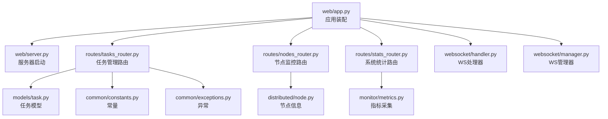
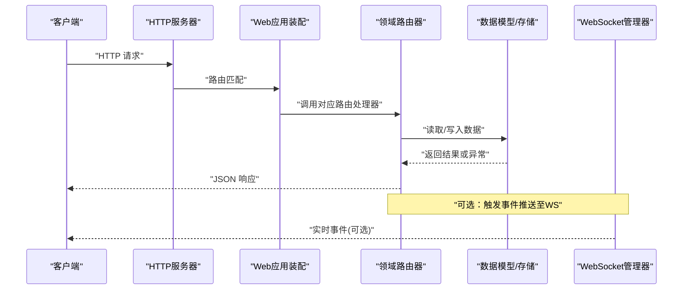
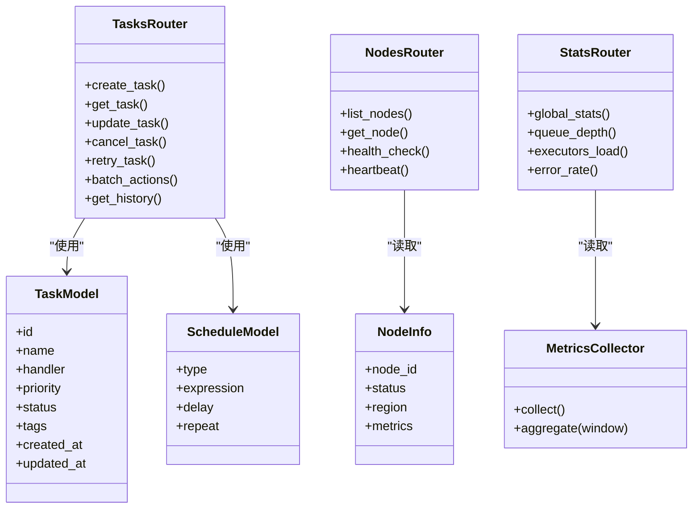
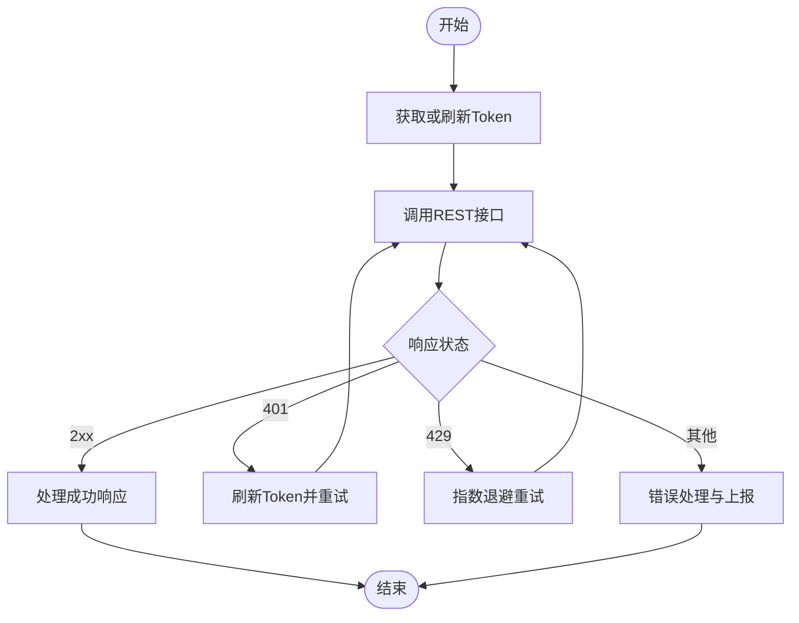

# REST API接口文档

<cite>
**本文引用的文件**   
- [src/neotask/web/app.py](file://src/neotask/web/app.py)
- [src/neotask/web/server.py](file://src/neotask/web/server.py)
- [src/neotask/web/routes/tasks_router.py](file://src/neotask/web/routes/tasks_router.py)
- [src/neotask/web/routes/nodes_router.py](file://src/neotask/web/routes/nodes_router.py)
- [src/neotask/web/routes/stats_router.py](file://src/neotask/web/routes/stats_router.py)
- [src/neotask/web/websocket/handler.py](file://src/neotask/web/websocket/handler.py)
- [src/neotask/web/websocket/manager.py](file://src/neotask/web/websocket/manager.py)
- [src/neotask/models/task.py](file://src/neotask/models/task.py)
- [src/neotask/models/schedule.py](file://src/neotask/models/schedule.py)
- [src/neotask/common/constants.py](file://src/neotask/common/constants.py)
- [src/neotask/common/exceptions.py](file://src/neotask/common/exceptions.py)
- [src/neotask/config/settings.py](file://src/neotask/config/settings.py)
- [src/neotask/monitor/metrics.py](file://src/neotask/monitor/metrics.py)
- [src/neotask/distributed/node.py](file://src/neotask/distributed/node.py)
</cite>

## 目录
1. [简介](#简介)
2. [项目结构](#项目结构)
3. [核心组件](#核心组件)
4. [架构总览](#架构总览)
5. [详细组件分析](#详细组件分析)
6. [依赖关系分析](#依赖关系分析)
7. [性能考虑](#性能考虑)
8. [故障排查指南](#故障排查指南)
9. [结论](#结论)
10. [附录](#附录)

## 简介
本文件为任务调度管理器的REST API接口文档，覆盖任务管理、节点监控、系统统计等路由端点。文档包含HTTP方法、URL模式、请求与响应模型、认证方式、参数校验、错误处理、状态码定义与示例。同时提供API版本控制策略、速率限制与安全建议，以及常见使用场景的客户端实现指南和性能优化建议。

## 项目结构
Web服务基于模块化路由组织，核心入口负责应用初始化、中间件注册与生命周期管理；各功能域通过独立路由器暴露REST接口；WebSocket用于实时事件推送；数据模型与常量在独立模块中维护。

图表来源
- [src/neotask/web/app.py](file://src/neotask/web/app.py)
- [src/neotask/web/server.py](file://src/neotask/web/server.py)
- [src/neotask/web/routes/tasks_router.py](file://src/neotask/web/routes/tasks_router.py)
- [src/neotask/web/routes/nodes_router.py](file://src/neotask/web/routes/nodes_router.py)
- [src/neotask/web/routes/stats_router.py](file://src/neotask/web/routes/stats_router.py)
- [src/neotask/web/websocket/handler.py](file://src/neotask/web/websocket/handler.py)
- [src/neotask/web/websocket/manager.py](file://src/neotask/web/websocket/manager.py)
- [src/neotask/models/task.py](file://src/neotask/models/task.py)
- [src/neotask/common/constants.py](file://src/neotask/common/constants.py)
- [src/neotask/common/exceptions.py](file://src/neotask/common/exceptions.py)
- [src/neotask/distributed/node.py](file://src/neotask/distributed/node.py)
- [src/neotask/monitor/metrics.py](file://src/neotask/monitor/metrics.py)

章节来源
- [src/neotask/web/app.py](file://src/neotask/web/app.py)
- [src/neotask/web/server.py](file://src/neotask/web/server.py)

## 核心组件
- Web应用装配：统一注册路由、中间件、异常映射、静态资源与生命周期钩子。
- 路由层：按领域划分任务、节点、统计三个路由器，分别承载对应业务接口。
- WebSocket：提供任务执行事件、节点心跳、系统指标的实时推送通道。
- 数据模型：任务与调度模型定义字段、约束与枚举值，作为请求/响应的契约。
- 常量与异常：统一的错误码、状态枚举与异常类型，保证一致的响应格式。
- 配置与设置：端口、鉴权开关、限流阈值、日志级别等运行时参数。
- 指标与监控：聚合系统运行指标，供统计接口与外部监控系统消费。

章节来源
- [src/neotask/web/app.py](file://src/neotask/web/app.py)
- [src/neotask/web/routes/tasks_router.py](file://src/neotask/web/routes/tasks_router.py)
- [src/neotask/web/routes/nodes_router.py](file://src/neotask/web/routes/nodes_router.py)
- [src/neotask/web/routes/stats_router.py](file://src/neotask/web/routes/stats_router.py)
- [src/neotask/web/websocket/handler.py](file://src/neotask/web/websocket/handler.py)
- [src/neotask/web/websocket/manager.py](file://src/neotask/web/websocket/manager.py)
- [src/neotask/models/task.py](file://src/neotask/models/task.py)
- [src/neotask/models/schedule.py](file://src/neotask/models/schedule.py)
- [src/neotask/common/constants.py](file://src/neotask/common/constants.py)
- [src/neotask/common/exceptions.py](file://src/neotask/common/exceptions.py)
- [src/neotask/config/settings.py](file://src/neotask/config/settings.py)
- [src/neotask/monitor/metrics.py](file://src/neotask/monitor/metrics.py)

## 架构总览
REST API由Web应用装配并挂载到HTTP服务器，路由层将请求分发至具体业务逻辑，数据访问与持久化由存储层完成（不在本节展开）。WebSocket与REST共享同一进程，便于实时通知与查询一致性。

图表来源
- [src/neotask/web/app.py](file://src/neotask/web/app.py)
- [src/neotask/web/server.py](file://src/neotask/web/server.py)
- [src/neotask/web/routes/tasks_router.py](file://src/neotask/web/routes/tasks_router.py)
- [src/neotask/web/routes/nodes_router.py](file://src/neotask/web/routes/nodes_router.py)
- [src/neotask/web/routes/stats_router.py](file://src/neotask/web/routes/stats_router.py)
- [src/neotask/web/websocket/manager.py](file://src/neotask/web/websocket/manager.py)

## 详细组件分析

### 通用约定
- 基础路径：所有REST接口以统一前缀开头，例如 /api/v1。
- 内容类型：请求与响应默认使用 application/json。
- 字符编码：UTF-8。
- 分页：列表接口支持 page、page_size 参数，返回 total、items 等字段。
- 排序：支持 sort_by、order 参数，如 created_at desc。
- 过滤：支持按状态、优先级、标签等条件过滤。
- 时间格式：ISO 8601 字符串，时区UTC。
- 幂等性：创建类接口需客户端生成唯一ID或使用幂等键。

章节来源
- [src/neotask/web/app.py](file://src/neotask/web/app.py)
- [src/neotask/common/constants.py](file://src/neotask/common/constants.py)

### 认证与授权
- 认证方式：Bearer Token（JWT）或会话Cookie，取决于配置。
- 获取令牌：通过认证端点提交用户名/密码或密钥，返回 access_token、refresh_token、expires_in。
- 权限范围：不同角色拥有不同操作权限，如只读、读写、管理员。
- 刷新令牌：使用 refresh_token 换取新的 access_token。
- 安全头：建议启用 HTTPS、CORS白名单、CSRF保护（若使用Cookie）。

章节来源
- [src/neotask/config/settings.py](file://src/neotask/config/settings.py)
- [src/neotask/web/app.py](file://src/neotask/web/app.py)

### 任务管理 API
- 基础路径：/api/v1/tasks
- 能力概览：创建、查询、更新、取消、重试、批量操作、历史与日志。

#### 创建任务
- 方法：POST
- URL：/api/v1/tasks
- 请求体字段：
  - name: 字符串，必填
  - handler: 字符串，必填，处理器标识
  - args: 数组，可选
  - kwargs: 对象，可选
  - priority: 整数，可选，默认中等
  - schedule: 对象，可选，延迟或定时
  - tags: 数组，可选
  - idempotency_key: 字符串，可选，幂等键
- 成功响应：201 Created，返回任务对象，包含 id、status、created_at 等
- 失败响应：
  - 400 Bad Request：参数校验失败
  - 409 Conflict：幂等键冲突
  - 401 Unauthorized：未认证
  - 403 Forbidden：无权限
  - 429 Too Many Requests：限流
  - 500 Internal Server Error：内部错误

章节来源
- [src/neotask/web/routes/tasks_router.py](file://src/neotask/web/routes/tasks_router.py)
- [src/neotask/models/task.py](file://src/neotask/models/task.py)
- [src/neotask/common/exceptions.py](file://src/neotask/common/exceptions.py)

#### 查询任务
- 方法：GET
- URL：/api/v1/tasks/{task_id}
- 路径参数：task_id（字符串，必填）
- 查询参数：include_details（布尔，可选），fields（逗号分隔，可选）
- 成功响应：200 OK，返回任务详情
- 失败响应：
  - 404 Not Found：任务不存在
  - 401/403：认证/权限问题
  - 429：限流
  - 500：内部错误

章节来源
- [src/neotask/web/routes/tasks_router.py](file://src/neotask/web/routes/tasks_router.py)
- [src/neotask/models/task.py](file://src/neotask/models/task.py)

#### 更新任务
- 方法：PUT/PATCH
- URL：/api/v1/tasks/{task_id}
- 请求体字段：priority、tags、schedule、备注等可更新字段
- 成功响应：200 OK，返回更新后的任务对象
- 失败响应：
  - 400：参数校验失败
  - 404：任务不存在
  - 409：状态不允许更新
  - 401/403：认证/权限问题
  - 429：限流
  - 500：内部错误

章节来源
- [src/neotask/web/routes/tasks_router.py](file://src/neotask/web/routes/tasks_router.py)
- [src/neotask/models/task.py](file://src/neotask/models/task.py)

#### 取消任务
- 方法：DELETE
- URL：/api/v1/tasks/{task_id}/cancel
- 成功响应：200 OK，返回确认消息
- 失败响应：
  - 404：任务不存在
  - 409：任务不可取消
  - 401/403：认证/权限问题
  - 429：限流
  - 500：内部错误

章节来源
- [src/neotask/web/routes/tasks_router.py](file://src/neotask/web/routes/tasks_router.py)

#### 重试任务
- 方法：POST
- URL：/api/v1/tasks/{task_id}/retry
- 请求体字段：max_retries（整数，可选）、delay（秒，可选）
- 成功响应：200 OK，返回新任务或原任务的重试信息
- 失败响应：
  - 404：任务不存在
  - 409：任务状态不允许重试
  - 401/403：认证/权限问题
  - 429：限流
  - 500：内部错误

章节来源
- [src/neotask/web/routes/tasks_router.py](file://src/neotask/web/routes/tasks_router.py)

#### 批量操作
- 方法：POST
- URL：/api/v1/tasks/batch
- 请求体字段：actions（数组，每项含 task_id、action、params）
- 成功响应：200 OK，返回每个动作的执行结果
- 失败响应：
  - 400：批量参数非法
  - 401/403：认证/权限问题
  - 429：限流
  - 500：内部错误

章节来源
- [src/neotask/web/routes/tasks_router.py](file://src/neotask/web/routes/tasks_router.py)

#### 任务历史与日志
- 方法：GET
- URL：/api/v1/tasks/{task_id}/history
- 查询参数：limit、offset、level（可选）
- 成功响应：200 OK，返回历史条目列表
- 失败响应：
  - 404：任务不存在
  - 401/403：认证/权限问题
  - 429：限流
  - 500：内部错误

章节来源
- [src/neotask/web/routes/tasks_router.py](file://src/neotask/web/routes/tasks_router.py)

### 节点监控 API
- 基础路径：/api/v1/nodes
- 能力概览：节点列表、节点详情、健康检查、心跳上报、拓扑视图。

#### 节点列表
- 方法：GET
- URL：/api/v1/nodes
- 查询参数：status（可选）、region（可选）、page、page_size
- 成功响应：200 OK，返回节点集合与分页信息
- 失败响应：
  - 401/403：认证/权限问题
  - 429：限流
  - 500：内部错误

章节来源
- [src/neotask/web/routes/nodes_router.py](file://src/neotask/web/routes/nodes_router.py)
- [src/neotask/distributed/node.py](file://src/neotask/distributed/node.py)

#### 节点详情
- 方法：GET
- URL：/api/v1/nodes/{node_id}
- 路径参数：node_id（字符串，必填）
- 成功响应：200 OK，返回节点详细信息
- 失败响应：
  - 404：节点不存在
  - 401/403：认证/权限问题
  - 429：限流
  - 500：内部错误

章节来源
- [src/neotask/web/routes/nodes_router.py](file://src/neotask/web/routes/nodes_router.py)
- [src/neotask/distributed/node.py](file://src/neotask/distributed/node.py)

#### 健康检查
- 方法：GET
- URL：/api/v1/nodes/{node_id}/health
- 成功响应：200 OK，返回健康状态与指标摘要
- 失败响应：
  - 404：节点不存在
  - 401/403：认证/权限问题
  - 429：限流
  - 500：内部错误

章节来源
- [src/neotask/web/routes/nodes_router.py](file://src/neotask/web/routes/nodes_router.py)

#### 心跳上报
- 方法：POST
- URL：/api/v1/nodes/{node_id}/heartbeat
- 请求体字段：metrics（对象，可选）、status（字符串，可选）
- 成功响应：200 OK，返回确认
- 失败响应：
  - 404：节点不存在
  - 400：参数校验失败
  - 401/403：认证/权限问题
  - 429：限流
  - 500：内部错误

章节来源
- [src/neotask/web/routes/nodes_router.py](file://src/neotask/web/routes/nodes_router.py)
- [src/neotask/distributed/node.py](file://src/neotask/distributed/node.py)

### 系统统计 API
- 基础路径：/api/v1/stats
- 能力概览：全局指标、任务队列深度、执行器负载、错误率、资源使用。

#### 全局指标
- 方法：GET
- URL：/api/v1/stats/global
- 查询参数：window（秒，可选）、aggregation（可选）
- 成功响应：200 OK，返回聚合后的指标对象
- 失败响应：
  - 401/403：认证/权限问题
  - 429：限流
  - 500：内部错误

章节来源
- [src/neotask/web/routes/stats_router.py](file://src/neotask/web/routes/stats_router.py)
- [src/neotask/monitor/metrics.py](file://src/neotask/monitor/metrics.py)

#### 任务队列深度
- 方法：GET
- URL：/api/v1/stats/queue_depth
- 查询参数：by_tag（可选）、by_priority（可选）
- 成功响应：200 OK，返回队列深度分布
- 失败响应：
  - 401/403：认证/权限问题
  - 429：限流
  - 500：内部错误

章节来源
- [src/neotask/web/routes/stats_router.py](file://src/neotask/web/routes/stats_router.py)

#### 执行器负载
- 方法：GET
- URL：/api/v1/stats/executors
- 查询参数：executor_type（可选）、node_id（可选）
- 成功响应：200 OK，返回执行器负载情况
- 失败响应：
  - 401/403：认证/权限问题
  - 429：限流
  - 500：内部错误

章节来源
- [src/neotask/web/routes/stats_router.py](file://src/neotask/web/routes/stats_router.py)

#### 错误率与告警
- 方法：GET
- URL：/api/v1/stats/errors
- 查询参数：since（时间戳，可选）、level（可选）
- 成功响应：200 OK，返回错误统计与趋势
- 失败响应：
  - 401/403：认证/权限问题
  - 429：限流
  - 500：内部错误

章节来源
- [src/neotask/web/routes/stats_router.py](file://src/neotask/web/routes/stats_router.py)

### WebSocket 实时事件
- 连接地址：ws(s)://host/ws/events
- 订阅主题：tasks、nodes、stats
- 消息格式：标准事件对象，包含 type、payload、timestamp
- 重连策略：指数退避，最大重试次数
- 鉴权：握手阶段携带Token或在URL中附带token参数

章节来源
- [src/neotask/web/websocket/handler.py](file://src/neotask/web/websocket/handler.py)
- [src/neotask/web/websocket/manager.py](file://src/neotask/web/websocket/manager.py)

### 数据模型与常量
- 任务模型：包含id、name、handler、args、kwargs、priority、status、tags、created_at、updated_at、result等字段。
- 调度模型：支持cron表达式、延迟时间、重复策略。
- 状态枚举：pending、running、success、failed、cancelled、retrying。
- 错误码：统一错误响应结构，包含code、message、details。

章节来源
- [src/neotask/models/task.py](file://src/neotask/models/task.py)
- [src/neotask/models/schedule.py](file://src/neotask/models/schedule.py)
- [src/neotask/common/constants.py](file://src/neotask/common/constants.py)
- [src/neotask/common/exceptions.py](file://src/neotask/common/exceptions.py)

## 依赖关系分析
- 路由对模型的依赖：任务路由依赖任务与调度模型，确保请求/响应契约一致。
- 路由对常量的依赖：使用统一的状态码与错误码，避免不一致。
- 统计路由对指标模块的依赖：从监控子系统拉取聚合数据。
- 节点路由对分布式节点的依赖：读取节点元数据与健康状态。
- WebSocket对管理器的依赖：集中管理连接与广播。

图表来源
- [src/neotask/web/routes/tasks_router.py](file://src/neotask/web/routes/tasks_router.py)
- [src/neotask/web/routes/nodes_router.py](file://src/neotask/web/routes/nodes_router.py)
- [src/neotask/web/routes/stats_router.py](file://src/neotask/web/routes/stats_router.py)
- [src/neotask/models/task.py](file://src/neotask/models/task.py)
- [src/neotask/models/schedule.py](file://src/neotask/models/schedule.py)
- [src/neotask/monitor/metrics.py](file://src/neotask/monitor/metrics.py)
- [src/neotask/distributed/node.py](file://src/neotask/distributed/node.py)

章节来源
- [src/neotask/web/routes/tasks_router.py](file://src/neotask/web/routes/tasks_router.py)
- [src/neotask/web/routes/nodes_router.py](file://src/neotask/web/routes/nodes_router.py)
- [src/neotask/web/routes/stats_router.py](file://src/neotask/web/routes/stats_router.py)
- [src/neotask/models/task.py](file://src/neotask/models/task.py)
- [src/neotask/models/schedule.py](file://src/neotask/models/schedule.py)
- [src/neotask/monitor/metrics.py](file://src/neotask/monitor/metrics.py)
- [src/neotask/distributed/node.py](file://src/neotask/distributed/node.py)

## 性能考虑
- 缓存热点数据：节点健康与全局指标可使用短期缓存减少后端压力。
- 分页与字段裁剪：列表接口强制分页，允许按需选择字段以减少传输体积。
- 异步处理：创建与批量操作采用异步队列，避免阻塞主线程。
- 连接复用：客户端保持HTTP长连接或连接池，降低握手开销。
- 压缩：启用Gzip/Brotli压缩，尤其对大响应体。
- 限流：针对写接口与统计聚合接口实施速率限制，防止雪崩。
- 批量化：合并小请求为批量接口，减少网络往返。
- 监控：结合Prometheus/Grafana进行端到端观测。

[本节为通用指导，不直接分析具体文件]

## 故障排查指南
- 认证失败：检查Token是否过期、权限范围是否足够、CORS与HTTPS配置是否正确。
- 参数校验错误：核对必填字段、类型与取值范围，关注错误响应中的details。
- 状态冲突：任务处于不可变状态时无法更新或取消，先查询当前状态再操作。
- 限流触发：观察响应头中的限流提示，调整客户端重试策略与退避算法。
- 内部错误：查看服务端日志与堆栈，定位底层存储或执行器异常。
- WebSocket断连：检查鉴权握手、网络防火墙与代理配置，实现指数退避重连。

章节来源
- [src/neotask/common/exceptions.py](file://src/neotask/common/exceptions.py)
- [src/neotask/config/settings.py](file://src/neotask/config/settings.py)
- [src/neotask/web/websocket/handler.py](file://src/neotask/web/websocket/handler.py)

## 结论
本API文档覆盖了任务管理、节点监控与系统统计的核心接口，明确了认证、校验、错误处理与状态码规范。通过版本化前缀、限流与安全策略，保障接口的稳定性与安全性。配合WebSocket可实现实时运维与监控。建议在生产环境启用HTTPS、最小权限原则与完善的监控告警体系。

[本节为总结，不直接分析具体文件]

## 附录

### API版本控制策略
- 使用URL前缀区分版本，如 /api/v1、/api/v2。
- 向后兼容：新增字段与接口优先采用可选参数与默认值。
- 废弃策略：提前公告弃用计划，提供迁移指南与并行期。
- 兼容性测试：每次发布进行回归与兼容性验证。

章节来源
- [src/neotask/web/app.py](file://src/neotask/web/app.py)

### 速率限制
- 维度：按用户、IP、接口粒度限制。
- 策略：固定窗口或滑动窗口，支持突发与配额。
- 响应头：返回剩余配额与重置时间，便于客户端自适应。
- 降级：超限返回429并提供重试After-Retry-After。

章节来源
- [src/neotask/config/settings.py](file://src/neotask/config/settings.py)

### 安全考虑
- 传输安全：强制HTTPS，禁用弱加密套件。
- 身份认证：JWT短时效+刷新令牌，支持多因素认证。
- 授权控制：RBAC细粒度权限，最小权限原则。
- 输入校验：严格白名单校验，防注入与XSS。
- 审计日志：记录关键操作与访问轨迹。
- CORS与CSRF：合理配置跨域与表单防护。

章节来源
- [src/neotask/config/settings.py](file://src/neotask/config/settings.py)
- [src/neotask/web/app.py](file://src/neotask/web/app.py)

### 客户端实现指南
- HTTP客户端：
  - 建立连接池，设置超时与重试。
  - 统一拦截器处理鉴权、错误码与限流。
  - 解析分页与字段裁剪，减少带宽占用。
- WebSocket客户端：
  - 握手携带Token，支持自动重连与心跳保活。
  - 订阅所需主题，避免全量接收。
  - 本地去抖与合并，降低UI渲染压力。
- 示例流程（概念图）：

[此图为概念流程，不直接映射具体代码文件]

### 常见使用场景
- 创建周期性任务：提交cron调度配置，设置优先级与标签，监听WS事件跟踪执行。
- 批量导入任务：构造批量动作数组，分批次提交，监控进度与错误。
- 节点扩容与下线：定期拉取节点列表与健康状态，动态调整流量分配。
- 指标看板：轮询统计接口或订阅WS事件，构建可视化面板。

章节来源
- [src/neotask/web/routes/tasks_router.py](file://src/neotask/web/routes/tasks_router.py)
- [src/neotask/web/routes/nodes_router.py](file://src/neotask/web/routes/nodes_router.py)
- [src/neotask/web/routes/stats_router.py](file://src/neotask/web/routes/stats_router.py)
- [src/neotask/web/websocket/handler.py](file://src/neotask/web/websocket/handler.py)