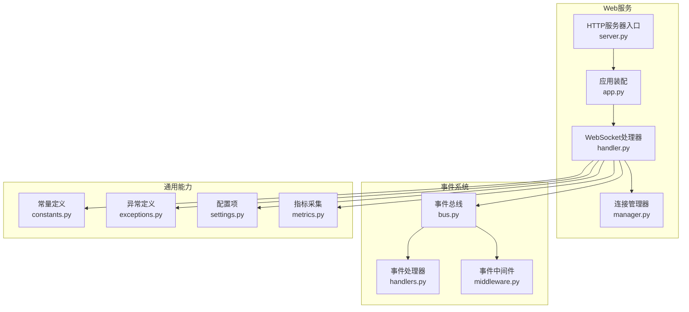
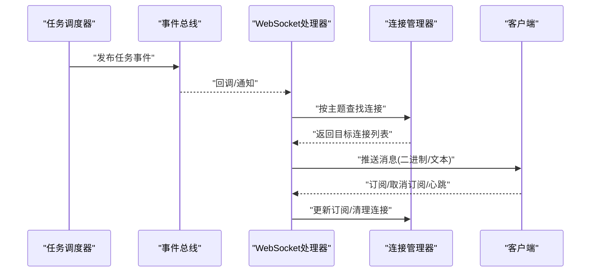
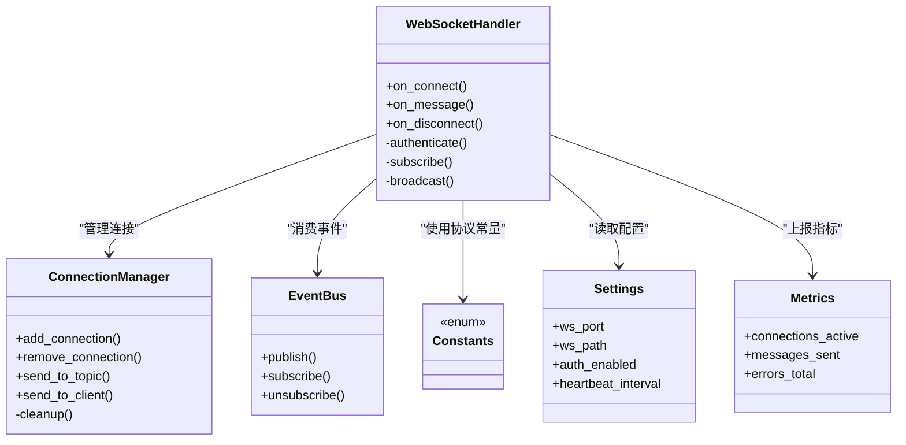
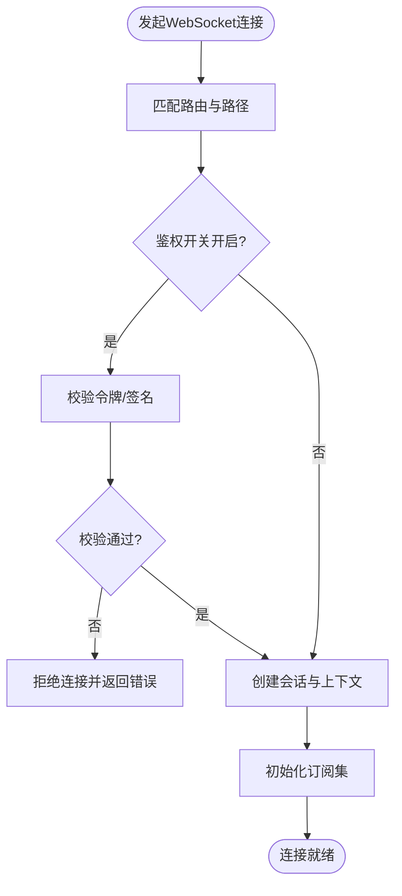

# WebSocket实时通信

<cite>
**本文引用的文件**   
- [src/neotask/web/websocket/handler.py](file://src/neotask/web/websocket/handler.py)
- [src/neotask/web/websocket/manager.py](file://src/neotask/web/websocket/manager.py)
- [src/neotask/web/app.py](file://src/neotask/web/app.py)
- [src/neotask/web/server.py](file://src/neotask/web/server.py)
- [src/neotask/event/bus.py](file://src/neotask/event/bus.py)
- [src/neotask/event/handlers.py](file://src/neotask/event/handlers.py)
- [src/neotask/event/middleware.py](file://src/neotask/event/middleware.py)
- [src/neotask/common/constants.py](file://src/neotask/common/constants.py)
- [src/neotask/common/exceptions.py](file://src/neotask/common/exceptions.py)
- [src/neotask/config/settings.py](file://src/neotask/config/settings.py)
- [src/neotask/monitor/metrics.py](file://src/neotask/monitor/metrics.py)
</cite>

## 目录
1. [简介](#简介)
2. [项目结构](#项目结构)
3. [核心组件](#核心组件)
4. [架构总览](#架构总览)
5. [详细组件分析](#详细组件分析)
6. [依赖关系分析](#依赖关系分析)
7. [性能考虑](#性能考虑)
8. [故障排查指南](#故障排查指南)
9. [结论](#结论)
10. [附录](#附录)

## 简介
本章节面向需要集成与使用WebSocket实时通信能力的开发者，系统性说明连接建立、消息格式、事件类型、实时交互模式、连接管理、消息分发、错误处理与重连机制的实现细节，并提供客户端集成示例、调试工具与监控方法，以及安全配置、权限控制与性能优化策略。

## 项目结构
WebSocket相关代码位于web子模块的websocket目录中，并通过HTTP服务挂载路由。事件总线用于跨模块广播任务状态变更等事件，WebSocket层订阅并推送给在线客户端。

图表来源
- [src/neotask/web/websocket/handler.py](file://src/neotask/web/websocket/handler.py)
- [src/neotask/web/websocket/manager.py](file://src/neotask/web/websocket/manager.py)
- [src/neotask/web/app.py](file://src/neotask/web/app.py)
- [src/neotask/web/server.py](file://src/neotask/web/server.py)
- [src/neotask/event/bus.py](file://src/neotask/event/bus.py)
- [src/neotask/event/handlers.py](file://src/neotask/event/handlers.py)
- [src/neotask/event/middleware.py](file://src/neotask/event/middleware.py)
- [src/neotask/common/constants.py](file://src/neotask/common/constants.py)
- [src/neotask/common/exceptions.py](file://src/neotask/common/exceptions.py)
- [src/neotask/config/settings.py](file://src/neotask/config/settings.py)
- [src/neotask/monitor/metrics.py](file://src/neotask/monitor/metrics.py)

章节来源
- [src/neotask/web/websocket/handler.py](file://src/neotask/web/websocket/handler.py)
- [src/neotask/web/websocket/manager.py](file://src/neotask/web/websocket/manager.py)
- [src/neotask/web/app.py](file://src/neotask/web/app.py)
- [src/neotask/web/server.py](file://src/neotask/web/server.py)
- [src/neotask/event/bus.py](file://src/neotask/event/bus.py)
- [src/neotask/event/handlers.py](file://src/neotask/event/handlers.py)
- [src/neotask/event/middleware.py](file://src/neotask/event/middleware.py)
- [src/neotask/common/constants.py](file://src/neotask/common/constants.py)
- [src/neotask/common/exceptions.py](file://src/neotask/common/exceptions.py)
- [src/neotask/config/settings.py](file://src/neotask/config/settings.py)
- [src/neotask/monitor/metrics.py](file://src/neotask/monitor/metrics.py)

## 核心组件
- WebSocket处理器：负责握手鉴权、订阅主题、接收客户端消息、向指定或全部连接广播事件。
- 连接管理器：维护活跃连接集合、按主题分组、发送消息、清理离线连接。
- 事件总线：作为发布-订阅中枢，将任务调度器产生的事件转发到WebSocket层。
- 常量与异常：统一消息类型、错误码与异常类型，保证前后端契约一致。
- 配置与指标：提供端口、路径、鉴权开关、心跳间隔等配置；暴露连接数、消息吞吐等指标。

章节来源
- [src/neotask/web/websocket/handler.py](file://src/neotask/web/websocket/handler.py)
- [src/neotask/web/websocket/manager.py](file://src/neotask/web/websocket/manager.py)
- [src/neotask/event/bus.py](file://src/neotask/event/bus.py)
- [src/neotask/common/constants.py](file://src/neotask/common/constants.py)
- [src/neotask/common/exceptions.py](file://src/neotask/common/exceptions.py)
- [src/neotask/config/settings.py](file://src/neotask/config/settings.py)
- [src/neotask/monitor/metrics.py](file://src/neotask/monitor/metrics.py)

## 架构总览
下图展示了从任务调度产生事件到WebSocket推送给客户端的端到端流程。

图表来源
- [src/neotask/web/websocket/handler.py](file://src/neotask/web/websocket/handler.py)
- [src/neotask/web/websocket/manager.py](file://src/neotask/web/websocket/manager.py)
- [src/neotask/event/bus.py](file://src/neotask/event/bus.py)

## 详细组件分析

### WebSocket处理器（连接与协议）
职责
- 在HTTP服务上注册WebSocket路由，完成握手与鉴权。
- 解析客户端消息，支持订阅/取消订阅主题、心跳、查询等指令。
- 将服务端事件转换为标准消息格式并下发。
- 处理断线、超时、异常，触发清理与指标上报。

关键流程
- 连接建立：校验请求头/参数（如token），创建会话上下文，初始化订阅集。
- 消息收发：读取帧，分派到对应处理函数；写回响应时进行序列化与限流。
- 事件订阅：根据主题过滤连接，批量推送。
- 心跳保活：周期性检测空闲连接，关闭长时间无心跳的连接。

错误处理
- 认证失败：拒绝连接并记录原因。
- 协议错误：返回标准化错误帧，避免客户端崩溃。
- 写入失败：捕获异常并尝试优雅关闭。

章节来源
- [src/neotask/web/websocket/handler.py](file://src/neotask/web/websocket/handler.py)

### 连接管理器（连接与分发）
职责
- 维护所有活跃连接及其元数据（ID、IP、注册时间、最后心跳时间）。
- 按主题索引连接，支持快速广播与定向推送。
- 提供发送接口，内部实现重试、背压与队列化。
- 定时清理失效连接，释放资源。

数据结构与复杂度
- 连接表：O(1)插入/删除，O(n)遍历。
- 主题索引：O(1)获取某主题下的连接集合。
- 发送：单连接O(1)，广播O(k)（k为目标连接数）。

并发与安全
- 使用线程安全的容器或锁保护共享状态。
- 对大消息进行分片或限速，防止内存抖动。

章节来源
- [src/neotask/web/websocket/manager.py](file://src/neotask/web/websocket/manager.py)

### 事件总线（发布-订阅）
职责
- 提供统一的发布/订阅API。
- 支持中间件链（鉴权、审计、转换）。
- 解耦业务事件与传输层，便于扩展其他消费者。

与WebSocket集成
- WebSocket处理器作为事件消费者之一，订阅任务相关主题。
- 事件处理器可封装为中间件，统一格式化消息体。

章节来源
- [src/neotask/event/bus.py](file://src/neotask/event/bus.py)
- [src/neotask/event/handlers.py](file://src/neotask/event/handlers.py)
- [src/neotask/event/middleware.py](file://src/neotask/event/middleware.py)

### 常量与异常（协议契约）
- 消息类型：如连接、心跳、订阅、取消订阅、任务状态、错误等。
- 错误码：统一编码，便于前端分类提示。
- 字段规范：id、type、payload、timestamp等。

章节来源
- [src/neotask/common/constants.py](file://src/neotask/common/constants.py)
- [src/neotask/common/exceptions.py](file://src/neotask/common/exceptions.py)

### 配置与指标（运行期控制）
- 配置项：WebSocket端口、路径、鉴权开关、心跳间隔、最大连接数、消息大小限制等。
- 指标：在线连接数、每秒消息数、平均延迟、错误率等。

章节来源
- [src/neotask/config/settings.py](file://src/neotask/config/settings.py)
- [src/neotask/monitor/metrics.py](file://src/neotask/monitor/metrics.py)

### HTTP服务与路由挂载
- 在HTTP服务启动时注册WebSocket路由。
- 提供健康检查与基础统计接口，便于运维观测。

章节来源
- [src/neotask/web/server.py](file://src/neotask/web/server.py)
- [src/neotask/web/app.py](file://src/neotask/web/app.py)

## 依赖关系分析

图表来源
- [src/neotask/web/websocket/handler.py](file://src/neotask/web/websocket/handler.py)
- [src/neotask/web/websocket/manager.py](file://src/neotask/web/websocket/manager.py)
- [src/neotask/event/bus.py](file://src/neotask/event/bus.py)
- [src/neotask/common/constants.py](file://src/neotask/common/constants.py)
- [src/neotask/config/settings.py](file://src/neotask/config/settings.py)
- [src/neotask/monitor/metrics.py](file://src/neotask/monitor/metrics.py)

章节来源
- [src/neotask/web/websocket/handler.py](file://src/neotask/web/websocket/handler.py)
- [src/neotask/web/websocket/manager.py](file://src/neotask/web/websocket/manager.py)
- [src/neotask/event/bus.py](file://src/neotask/event/bus.py)
- [src/neotask/common/constants.py](file://src/neotask/common/constants.py)
- [src/neotask/config/settings.py](file://src/neotask/config/settings.py)
- [src/neotask/monitor/metrics.py](file://src/neotask/monitor/metrics.py)

## 性能考虑
- 连接复用与长连接：保持少量长连接，减少握手开销。
- 批量推送：合并同一周期内的小消息，降低网络往返。
- 背压与限流：对慢消费者进行限速或丢弃低优先级消息。
- 内存控制：限制单连接消息队列长度，避免OOM。
- 心跳与超时：合理设置心跳间隔与超时阈值，及时回收僵尸连接。
- 指标驱动：基于在线连接数、消息吞吐、错误率动态调整策略。

[本节为通用指导，不直接分析具体文件]

## 故障排查指南
常见问题与定位步骤
- 无法建立连接
  - 检查路由是否注册、端口是否开放、鉴权是否开启。
  - 查看握手阶段日志与错误码。
- 频繁断线
  - 核对心跳间隔与超时配置，确认客户端是否正确发送心跳。
  - 观察连接管理器清理日志与指标。
- 消息未到达
  - 确认客户端已正确订阅主题。
  - 检查事件总线是否发布了对应主题的事件。
  - 查看连接管理器发送队列与错误计数。
- 性能问题
  - 关注指标中的连接数、消息速率、错误率。
  - 评估消息体大小与频率，必要时启用压缩或降频。

章节来源
- [src/neotask/web/websocket/handler.py](file://src/neotask/web/websocket/handler.py)
- [src/neotask/web/websocket/manager.py](file://src/neotask/web/websocket/manager.py)
- [src/neotask/event/bus.py](file://src/neotask/event/bus.py)
- [src/neotask/monitor/metrics.py](file://src/neotask/monitor/metrics.py)

## 结论
本WebSocket实时通信方案以“处理器+连接管理器+事件总线”为核心，结合统一的协议常量与异常体系，实现了高内聚、低耦合的实时推送能力。通过合理的配置与指标监控，可在生产环境获得稳定、可扩展的实时体验。

[本节为总结性内容，不直接分析具体文件]

## 附录

### 连接建立与鉴权流程

图表来源
- [src/neotask/web/websocket/handler.py](file://src/neotask/web/websocket/handler.py)
- [src/neotask/config/settings.py](file://src/neotask/config/settings.py)

### 消息格式与事件类型
- 消息结构建议包含：唯一标识、类型、负载、时间戳、可选签名。
- 事件类型建议包括：连接、心跳、订阅、取消订阅、任务状态、错误等。
- 负载结构应与业务模型对齐，确保向后兼容。

章节来源
- [src/neotask/common/constants.py](file://src/neotask/common/constants.py)
- [src/neotask/common/exceptions.py](file://src/neotask/common/exceptions.py)

### 实时交互模式
- 单向推送：服务端主动推送任务状态、告警等。
- 双向交互：客户端订阅/取消订阅、查询状态、触发操作。
- 心跳保活：客户端定期发送心跳，服务端检测空闲连接。

章节来源
- [src/neotask/web/websocket/handler.py](file://src/neotask/web/websocket/handler.py)
- [src/neotask/web/websocket/manager.py](file://src/neotask/web/websocket/manager.py)

### 客户端集成示例（概念性）
- 建立连接：使用WebSocket库连接到配置的地址与路径。
- 鉴权：在握手前附加必要的头部或查询参数。
- 订阅主题：发送订阅指令，指定感兴趣的任务或节点主题。
- 处理消息：根据类型分支处理，更新UI或触发本地逻辑。
- 心跳：定时发送心跳帧，处理断线重连。
- 错误处理：捕获网络与协议错误，指数退避重连。

[本节为概念性说明，不直接分析具体文件]

### 调试工具与监控方法
- 浏览器开发者工具：Network面板查看WebSocket帧。
- 命令行工具：使用通用WebSocket客户端进行连通性与协议测试。
- 服务端日志：输出握手、订阅、发送、错误等关键日志。
- 指标面板：展示在线连接数、消息吞吐、错误率等。

章节来源
- [src/neotask/monitor/metrics.py](file://src/neotask/monitor/metrics.py)

### 安全配置与权限控制
- 传输安全：在生产环境启用TLS，强制HTTPS/WSS。
- 鉴权：在握手阶段校验令牌或签名，拒绝非法请求。
- 授权：基于用户角色或资源标签控制订阅主题范围。
- 限流：对连接数、消息频率、消息大小进行限制。
- 审计：记录关键操作与异常，便于追溯。

章节来源
- [src/neotask/config/settings.py](file://src/neotask/config/settings.py)
- [src/neotask/web/websocket/handler.py](file://src/neotask/web/websocket/handler.py)

### 错误处理与重连机制
- 服务端错误：返回标准化错误帧，附带错误码与简要信息。
- 客户端重连：采用指数退避与随机抖动，避免雪崩。
- 断线恢复：重连后自动重新订阅主题，必要时拉取增量状态。

章节来源
- [src/neotask/web/websocket/handler.py](file://src/neotask/web/websocket/handler.py)
- [src/neotask/common/exceptions.py](file://src/neotask/common/exceptions.py)