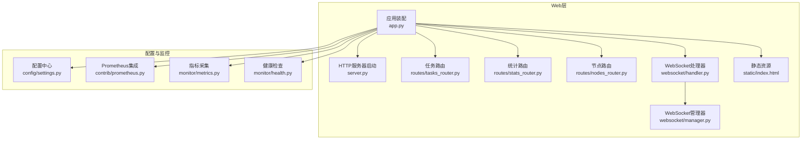
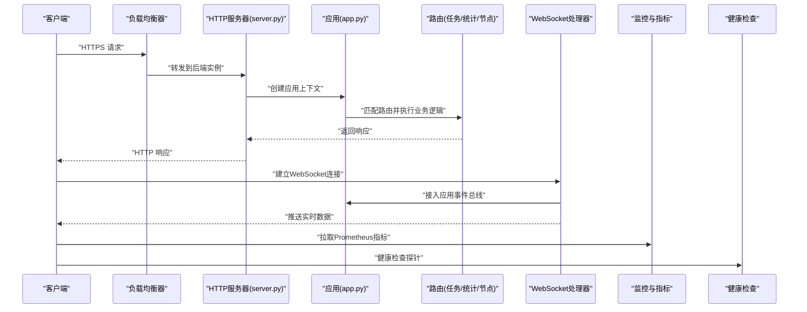
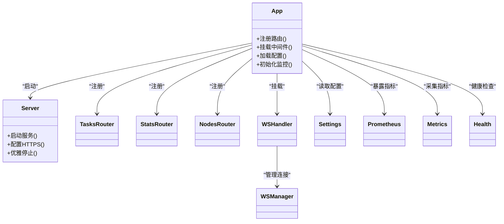

# Web服务器配置

<cite>
**本文引用的文件**   
- [src/neotask/web/app.py](file://src/neotask/web/app.py)
- [src/neotask/web/server.py](file://src/neotask/web/server.py)
- [src/neotask/web/routes/tasks_router.py](file://src/neotask/web/routes/tasks_router.py)
- [src/neotask/web/routes/stats_router.py](file://src/neotask/web/routes/stats_router.py)
- [src/neotask/web/routes/nodes_router.py](file://src/neotask/web/routes/nodes_router.py)
- [src/neotask/web/static/index.html](file://src/neotask/web/static/index.html)
- [src/neotask/web/websocket/handler.py](file://src/neotask/web/websocket/handler.py)
- [src/neotask/web/websocket/manager.py](file://src/neotask/web/websocket/manager.py)
- [src/neotask/config/settings.py](file://src/neotask/config/settings.py)
- [src/neotask/contrib/prometheus.py](file://src/neotask/contrib/prometheus.py)
- [src/neotask/monitor/metrics.py](file://src/neotask/monitor/metrics.py)
- [src/neotask/monitor/health.py](file://src/neotask/monitor/health.py)
- [examples/01_simple.py](file://examples/01_simple.py)
- [examples/02_context_manager.py](file://examples/02_context_manager.py)
- [pyproject.toml](file://pyproject.toml)
</cite>

## 目录
1. [简介](#简介)
2. [项目结构](#项目结构)
3. [核心组件](#核心组件)
4. [架构总览](#架构总览)
5. [详细组件分析](#详细组件分析)
6. [依赖关系分析](#依赖关系分析)
7. [性能考虑](#性能考虑)
8. [故障排查指南](#故障排查指南)
9. [结论](#结论)
10. [附录](#附录)

## 简介
本文件聚焦于Web服务器的配置与部署，覆盖应用初始化、中间件、静态资源管理、模板渲染、HTTPS、CORS、会话管理、缓存策略、多环境部署、负载均衡、性能调优、监控指标与故障排查等主题。文档以仓库中的Web模块为核心，结合配置与监控相关代码进行说明，并提供可操作的实践建议。

## 项目结构
Web服务位于 src/neotask/web 下，包含应用装配、HTTP服务器启动、路由、静态资源与WebSocket处理；配置集中在 src/neotask/config/settings.py；监控与指标在 monitor 与 contrib/prometheus.py 中提供。

图表来源
- [src/neotask/web/app.py](file://src/neotask/web/app.py)
- [src/neotask/web/server.py](file://src/neotask/web/server.py)
- [src/neotask/web/routes/tasks_router.py](file://src/neotask/web/routes/tasks_router.py)
- [src/neotask/web/routes/stats_router.py](file://src/neotask/web/routes/stats_router.py)
- [src/neotask/web/routes/nodes_router.py](file://src/neotask/web/routes/nodes_router.py)
- [src/neotask/web/websocket/handler.py](file://src/neotask/web/websocket/handler.py)
- [src/neotask/web/websocket/manager.py](file://src/neotask/web/websocket/manager.py)
- [src/neotask/web/static/index.html](file://src/neotask/web/static/index.html)
- [src/neotask/config/settings.py](file://src/neotask/config/settings.py)
- [src/neotask/contrib/prometheus.py](file://src/neotask/contrib/prometheus.py)
- [src/neotask/monitor/metrics.py](file://src/neotask/monitor/metrics.py)
- [src/neotask/monitor/health.py](file://src/neotask/monitor/health.py)

章节来源
- [src/neotask/web/app.py](file://src/neotask/web/app.py)
- [src/neotask/web/server.py](file://src/neotask/web/server.py)
- [src/neotask/config/settings.py](file://src/neotask/config/settings.py)

## 核心组件
- 应用装配：负责注册路由、挂载中间件、加载配置、初始化监控与健康检查端点。
- HTTP服务器：封装底层WSGI/ASGI服务器参数（如端口、工作进程、超时、TLS等），并支持优雅启停。
- 路由层：按功能域划分路由（任务、统计、节点）。
- WebSocket：用于实时推送（如任务状态变更、系统事件）。
- 静态资源：前端页面与资源托管。
- 配置中心：集中读取环境变量与配置文件，为Web层提供统一配置入口。
- 监控与指标：暴露Prometheus指标与健康检查接口。

章节来源
- [src/neotask/web/app.py](file://src/neotask/web/app.py)
- [src/neotask/web/server.py](file://src/neotask/web/server.py)
- [src/neotask/web/routes/tasks_router.py](file://src/neotask/web/routes/tasks_router.py)
- [src/neotask/web/routes/stats_router.py](file://src/neotask/web/routes/stats_router.py)
- [src/neotask/web/routes/nodes_router.py](file://src/neotask/web/routes/nodes_router.py)
- [src/neotask/web/websocket/handler.py](file://src/neotask/web/websocket/handler.py)
- [src/neotask/web/websocket/manager.py](file://src/neotask/web/websocket/manager.py)
- [src/neotask/web/static/index.html](file://src/neotask/web/static/index.html)
- [src/neotask/config/settings.py](file://src/neotask/config/settings.py)
- [src/neotask/contrib/prometheus.py](file://src/neotask/contrib/prometheus.py)
- [src/neotask/monitor/metrics.py](file://src/neotask/monitor/metrics.py)
- [src/neotask/monitor/health.py](file://src/neotask/monitor/health.py)

## 架构总览
下图展示从客户端到Web服务各层的调用路径，包括HTTP请求、WebSocket连接、静态资源访问以及监控指标的暴露流程。

图表来源
- [src/neotask/web/server.py](file://src/neotask/web/server.py)
- [src/neotask/web/app.py](file://src/neotask/web/app.py)
- [src/neotask/web/routes/tasks_router.py](file://src/neotask/web/routes/tasks_router.py)
- [src/neotask/web/routes/stats_router.py](file://src/neotask/web/routes/stats_router.py)
- [src/neotask/web/routes/nodes_router.py](file://src/neotask/web/routes/nodes_router.py)
- [src/neotask/web/websocket/handler.py](file://src/neotask/web/websocket/handler.py)
- [src/neotask/contrib/prometheus.py](file://src/neotask/contrib/prometheus.py)
- [src/neotask/monitor/health.py](file://src/neotask/monitor/health.py)

## 详细组件分析

### 应用初始化与中间件
- 应用初始化
  - 通过应用装配模块完成路由注册、中间件挂载、配置加载、监控与健康检查端点注册。
  - 建议在应用启动时校验关键配置项（如存储、队列、锁实现）是否可用，并在不可用时快速失败。
- 中间件
  - 典型中间件包括：请求日志、CORS、安全头、限流、认证鉴权、请求体大小限制、Gzip压缩等。
  - 中间件顺序很重要：鉴权应在日志之后、业务路由之前；CORS应尽早生效。
- 配置加载
  - 使用配置中心统一读取环境变量与配置文件，区分开发、测试、生产环境。
  - 敏感信息（证书、密钥、数据库密码）应从环境变量或密钥管理服务注入。

章节来源
- [src/neotask/web/app.py](file://src/neotask/web/app.py)
- [src/neotask/config/settings.py](file://src/neotask/config/settings.py)

### HTTP服务器与HTTPS配置
- 服务器参数
  - 监听地址与端口、工作进程数、线程池大小、请求超时、Keep-Alive、最大并发连接等。
- HTTPS/TLS
  - 提供证书与私钥路径配置，可选择强制HTTPS重定向。
  - 在生产环境中建议使用反向代理（Nginx/Traefik）终止TLS，应用仅监听内网端口。
- 优雅启停
  - 支持信号处理，平滑关闭连接，避免中断正在处理的请求。

章节来源
- [src/neotask/web/server.py](file://src/neotask/web/server.py)

### CORS设置
- 允许的来源、方法、头部、凭据、预检缓存时长等。
- 建议仅在受信任域名开启，并最小化暴露的头部与方法。
- 对于前后端分离场景，确保跨域预检请求正确返回。

章节来源
- [src/neotask/web/app.py](file://src/neotask/web/app.py)

### 会话管理与认证
- 会话存储
  - 内存会话适用于单进程开发；分布式部署需使用Redis等外部存储。
- 安全建议
  - 启用Secure、HttpOnly、SameSite属性；定期轮换签名密钥；限制会话有效期。
- 认证鉴权
  - 基于Token或Cookie的鉴权中间件，配合RBAC或ABAC策略。

章节来源
- [src/neotask/web/app.py](file://src/neotask/web/app.py)

### 静态资源管理与模板渲染
- 静态资源
  - 指定静态目录与URL前缀，启用缓存控制与版本化文件名。
  - 生产环境建议由反向代理或CDN托管静态资源。
- 模板渲染
  - 选择模板引擎（如Jinja2），配置模板目录、自动重载（仅开发）、缓存编译结果。
  - 对模板输出进行转义与内容安全策略（CSP）配置。

章节来源
- [src/neotask/web/app.py](file://src/neotask/web/app.py)
- [src/neotask/web/static/index.html](file://src/neotask/web/static/index.html)

### 路由与API设计
- 路由组织
  - 按领域划分路由模块（任务、统计、节点），便于维护与权限控制。
- 请求/响应规范
  - 统一的错误码与消息格式；分页、排序、过滤参数约定。
- 速率限制与幂等
  - 针对写操作实施限流与幂等键，防止重复提交与滥用。

章节来源
- [src/neotask/web/routes/tasks_router.py](file://src/neotask/web/routes/tasks_router.py)
- [src/neotask/web/routes/stats_router.py](file://src/neotask/web/routes/stats_router.py)
- [src/neotask/web/routes/nodes_router.py](file://src/neotask/web/routes/nodes_router.py)

### WebSocket实时通信
- 连接管理
  - 连接建立、心跳保活、断线重连、广播与点对点消息。
- 与事件总线集成
  - 将内部事件（任务状态、节点上下线）推送到前端。
- 安全与限流
  - 鉴权后升级协议；限制单个客户端连接数与消息速率。

章节来源
- [src/neotask/web/websocket/handler.py](file://src/neotask/web/websocket/handler.py)
- [src/neotask/web/websocket/manager.py](file://src/neotask/web/websocket/manager.py)

### 监控指标与健康检查
- Prometheus指标
  - 暴露应用级指标（QPS、延迟分布、错误率、队列长度、锁竞争等）。
- 健康检查
  - 存活探针（Liveness）与就绪探针（Readiness），结合外部依赖可用性。
- 告警规则
  - 基于指标阈值触发告警（如错误率飙升、延迟P99过高）。

章节来源
- [src/neotask/contrib/prometheus.py](file://src/neotask/contrib/prometheus.py)
- [src/neotask/monitor/metrics.py](file://src/neotask/monitor/metrics.py)
- [src/neotask/monitor/health.py](file://src/neotask/monitor/health.py)

## 依赖关系分析
Web层依赖配置中心与监控模块，路由模块之间相对独立，WebSocket与事件总线耦合度较高。

图表来源
- [src/neotask/web/app.py](file://src/neotask/web/app.py)
- [src/neotask/web/server.py](file://src/neotask/web/server.py)
- [src/neotask/web/routes/tasks_router.py](file://src/neotask/web/routes/tasks_router.py)
- [src/neotask/web/routes/stats_router.py](file://src/neotask/web/routes/stats_router.py)
- [src/neotask/web/routes/nodes_router.py](file://src/neotask/web/routes/nodes_router.py)
- [src/neotask/web/websocket/handler.py](file://src/neotask/web/websocket/handler.py)
- [src/neotask/web/websocket/manager.py](file://src/neotask/web/websocket/manager.py)
- [src/neotask/config/settings.py](file://src/neotask/config/settings.py)
- [src/neotask/contrib/prometheus.py](file://src/neotask/contrib/prometheus.py)
- [src/neotask/monitor/metrics.py](file://src/neotask/monitor/metrics.py)
- [src/neotask/monitor/health.py](file://src/neotask/monitor/health.py)

章节来源
- [src/neotask/web/app.py](file://src/neotask/web/app.py)
- [src/neotask/web/server.py](file://src/neotask/web/server.py)
- [src/neotask/config/settings.py](file://src/neotask/config/settings.py)

## 性能考虑
- 进程与线程
  - 根据CPU核数与工作负载类型调整工作进程与线程池大小；I/O密集型可适当增加线程。
- 连接与超时
  - 合理设置Keep-Alive、请求超时与空闲连接回收，避免资源泄漏。
- 缓存策略
  - 静态资源启用强缓存与版本化；热点数据使用本地或分布式缓存；注意缓存一致性。
- 反压与限流
  - 对上游流量进行限流与熔断，保护下游存储与队列。
- 监控与观测
  - 采集关键指标（延迟分位、错误率、队列积压、锁等待时间），结合日志与链路追踪定位瓶颈。

[本节为通用指导，不直接分析具体文件]

## 故障排查指南
- 常见问题
  - 端口冲突：检查绑定地址与端口占用。
  - TLS错误：确认证书与私钥路径、权限与格式。
  - CORS失败：核对允许的源、方法与头部。
  - 会话丢失：检查会话存储连通性与密钥一致性。
  - 静态资源404：确认静态目录与URL前缀配置。
- 诊断步骤
  - 查看应用日志与错误堆栈。
  - 访问健康检查端点判断服务状态。
  - 抓取Prometheus指标对比基线。
  - 复现问题并收集请求ID与上下文。
- 恢复策略
  - 重启服务、回滚配置、切换备用依赖（如存储、队列）。
  - 临时降级非核心功能，优先保障核心API可用。

章节来源
- [src/neotask/monitor/health.py](file://src/neotask/monitor/health.py)
- [src/neotask/contrib/prometheus.py](file://src/neotask/contrib/prometheus.py)
- [src/neotask/monitor/metrics.py](file://src/neotask/monitor/metrics.py)

## 结论
通过合理的配置与部署策略，Web服务器可在不同环境下稳定运行。建议在生产环境采用反向代理终止TLS、启用HTTPS强制跳转、配置CORS与安全头、使用外部会话存储与缓存、完善监控与告警，并结合负载均衡与弹性伸缩提升整体可靠性与性能。

[本节为总结性内容，不直接分析具体文件]

## 附录

### 部署与环境示例
- 开发环境
  - 本地调试，禁用严格安全策略，开启模板自动重载与详细日志。
- 测试环境
  - 模拟生产配置，启用基础监控与健康检查。
- 生产环境
  - 反向代理终止TLS，启用HTTPS、CORS白名单、会话外部存储、静态资源CDN、指标与告警。

章节来源
- [examples/01_simple.py](file://examples/01_simple.py)
- [examples/02_context_manager.py](file://examples/02_context_manager.py)
- [pyproject.toml](file://pyproject.toml)

### 负载均衡配置要点
- 四层负载均衡（TCP/UDP）
  - 保持长连接与会话亲和（必要时）。
- 七层负载均衡（HTTP/HTTPS）
  - 健康检查、重试与超时策略、请求大小限制、Gzip压缩。
- 多副本与滚动更新
  - 就绪探针确保新实例接收流量，旧实例优雅退出。

[本节为通用指导，不直接分析具体文件]

### 监控指标清单（建议）
- 应用指标：QPS、平均/分位延迟、错误率、活跃连接数、请求体大小分布。
- 业务指标：任务入队/出队速率、执行成功率、重试次数、死信队列长度。
- 系统指标：CPU、内存、磁盘IO、网络IO、文件描述符使用量。
- 依赖指标：存储/队列/锁服务的延迟与错误率。

章节来源
- [src/neotask/contrib/prometheus.py](file://src/neotask/contrib/prometheus.py)
- [src/neotask/monitor/metrics.py](file://src/neotask/monitor/metrics.py)