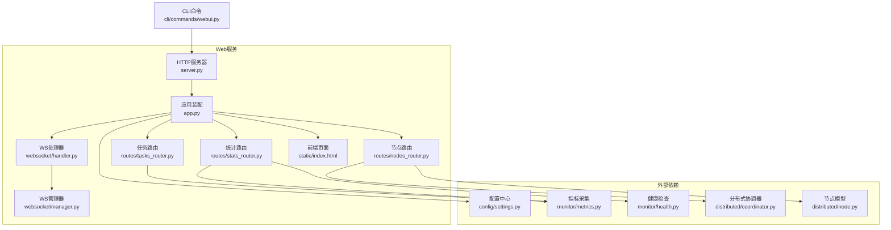
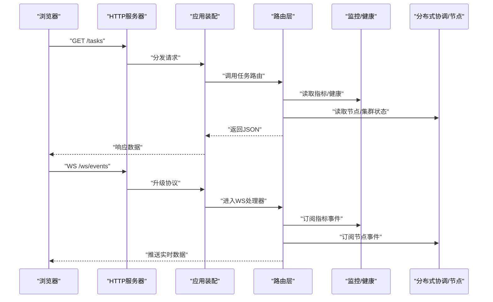
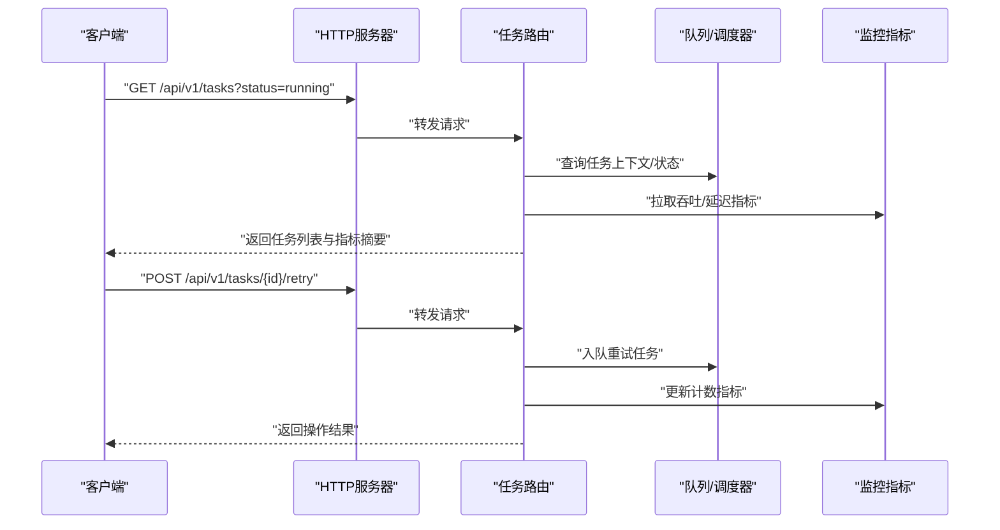
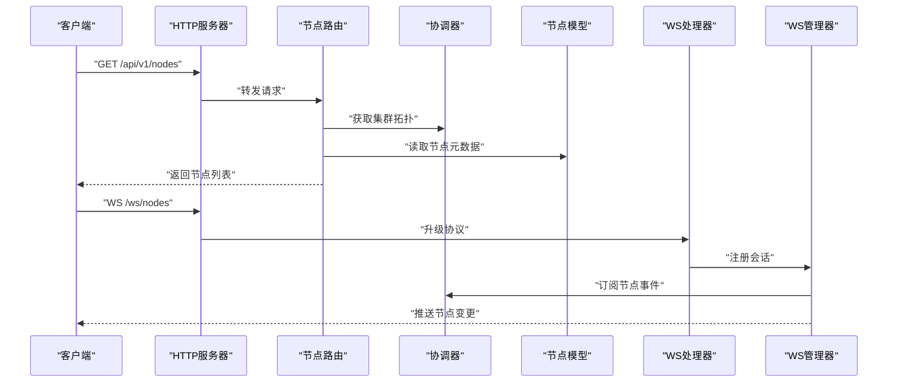
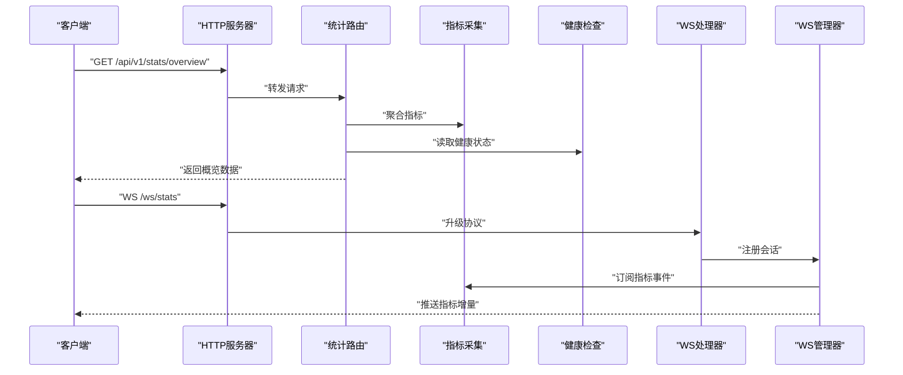
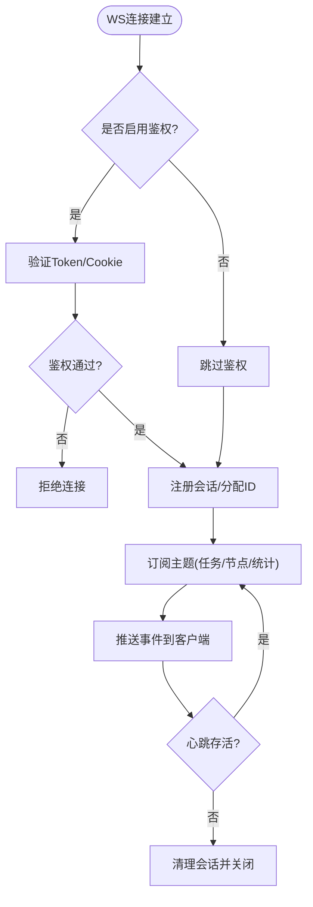
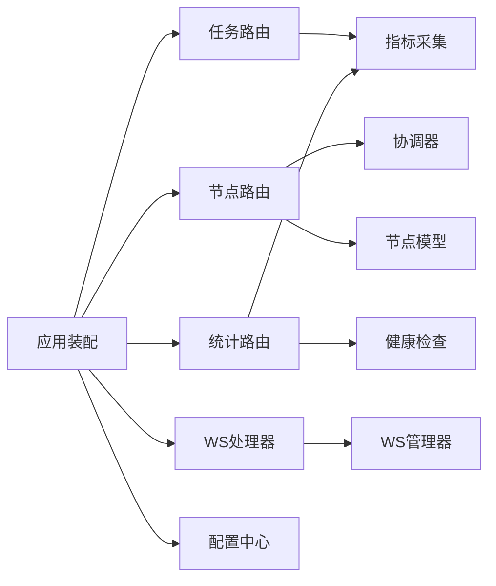

# Web管理界面

<cite>
**本文引用的文件**   
- [src/neotask/web/app.py](file://src/neotask/web/app.py)
- [src/neotask/web/server.py](file://src/neotask/web/server.py)
- [src/neotask/web/routes/tasks_router.py](file://src/neotask/web/routes/tasks_router.py)
- [src/neotask/web/routes/nodes_router.py](file://src/neotask/web/routes/nodes_router.py)
- [src/neotask/web/routes/stats_router.py](file://src/neotask/web/routes/stats_router.py)
- [src/neotask/web/websocket/handler.py](file://src/neotask/web/websocket/handler.py)
- [src/neotask/web/websocket/manager.py](file://src/neotask/web/websocket/manager.py)
- [src/neotask/web/static/index.html](file://src/neotask/web/static/index.html)
- [src/neotask/cli/commands/webui.py](file://src/neotask/cli/commands/webui.py)
- [src/neotask/config/settings.py](file://src/neotask/config/settings.py)
- [src/neotask/monitor/metrics.py](file://src/neotask/monitor/metrics.py)
- [src/neotask/monitor/health.py](file://src/neotask/monitor/health.py)
- [src/neotask/distributed/coordinator.py](file://src/neotask/distributed/coordinator.py)
- [src/neotask/distributed/node.py](file://src/neotask/distributed/node.py)
</cite>

## 目录
1. [简介](#简介)
2. [项目结构](#项目结构)
3. [核心组件](#核心组件)
4. [架构总览](#架构总览)
5. [详细组件分析](#详细组件分析)
6. [依赖关系分析](#依赖关系分析)
7. [性能考虑](#性能考虑)
8. [故障排查指南](#故障排查指南)
9. [结论](#结论)
10. [附录](#附录)

## 简介
本章节面向使用与运维人员，系统性介绍任务调度系统的Web管理界面。内容覆盖：
- 任务管理、节点监控、系统统计等核心功能的使用说明
- RESTful API与WebSocket实时通信的接入方式
- 界面定制、权限控制与安全配置等高级能力
- 部署配置与性能优化建议
- 常见问题排查与用户反馈收集方法

## 项目结构
Web管理界面位于web子模块中，采用“路由+静态资源+WebSocket”的分层组织方式；CLI提供启动入口，配置由settings统一加载，监控指标与健康检查分别由monitor模块提供。

图示来源
- [src/neotask/web/app.py](file://src/neotask/web/app.py)
- [src/neotask/web/server.py](file://src/neotask/web/server.py)
- [src/neotask/web/routes/tasks_router.py](file://src/neotask/web/routes/tasks_router.py)
- [src/neotask/web/routes/nodes_router.py](file://src/neotask/web/routes/nodes_router.py)
- [src/neotask/web/routes/stats_router.py](file://src/neotask/web/routes/stats_router.py)
- [src/neotask/web/websocket/handler.py](file://src/neotask/web/websocket/handler.py)
- [src/neotask/web/websocket/manager.py](file://src/neotask/web/websocket/manager.py)
- [src/neotask/web/static/index.html](file://src/neotask/web/static/index.html)
- [src/neotask/config/settings.py](file://src/neotask/config/settings.py)
- [src/neotask/monitor/metrics.py](file://src/neotask/monitor/metrics.py)
- [src/neotask/monitor/health.py](file://src/neotask/monitor/health.py)
- [src/neotask/distributed/coordinator.py](file://src/neotask/distributed/coordinator.py)
- [src/neotask/distributed/node.py](file://src/neotask/distributed/node.py)

章节来源
- [src/neotask/web/app.py](file://src/neotask/web/app.py)
- [src/neotask/web/server.py](file://src/neotask/web/server.py)
- [src/neotask/web/routes/tasks_router.py](file://src/neotask/web/routes/tasks_router.py)
- [src/neotask/web/routes/nodes_router.py](file://src/neotask/web/routes/nodes_router.py)
- [src/neotask/web/routes/stats_router.py](file://src/neotask/web/routes/stats_router.py)
- [src/neotask/web/websocket/handler.py](file://src/neotask/web/websocket/handler.py)
- [src/neotask/web/websocket/manager.py](file://src/neotask/web/websocket/manager.py)
- [src/neotask/web/static/index.html](file://src/neotask/web/static/index.html)
- [src/neotask/cli/commands/webui.py](file://src/neotask/cli/commands/webui.py)
- [src/neotask/config/settings.py](file://src/neotask/config/settings.py)
- [src/neotask/monitor/metrics.py](file://src/neotask/monitor/metrics.py)
- [src/neotask/monitor/health.py](file://src/neotask/monitor/health.py)
- [src/neotask/distributed/coordinator.py](file://src/neotask/distributed/coordinator.py)
- [src/neotask/distributed/node.py](file://src/neotask/distributed/node.py)

## 核心组件
- Web应用装配：负责注册路由、挂载静态资源、初始化中间件与生命周期钩子。
- HTTP服务器：承载请求分发、连接池、超时与并发参数。
- 路由层：
  - 任务路由：任务的创建、查询、状态变更、重试/取消等操作。
  - 节点路由：节点列表、节点详情、心跳与健康状态聚合。
  - 统计路由：系统级指标、队列深度、执行吞吐、错误率等。
- WebSocket：
  - 处理器：建立连接、鉴权（可选）、消息路由。
  - 管理器：维护连接集合、广播事件、订阅主题。
- 静态资源：单页应用或仪表盘HTML，通过REST/WS获取数据并渲染。
- 配置中心：端口、绑定地址、日志级别、安全开关等。
- 监控与健康：指标采集、健康探针、告警阈值。
- 分布式协调与节点：集群拓扑、主从选举、节点注册与发现。

章节来源
- [src/neotask/web/app.py](file://src/neotask/web/app.py)
- [src/neotask/web/server.py](file://src/neotask/web/server.py)
- [src/neotask/web/routes/tasks_router.py](file://src/neotask/web/routes/tasks_router.py)
- [src/neotask/web/routes/nodes_router.py](file://src/neotask/web/routes/nodes_router.py)
- [src/neotask/web/routes/stats_router.py](file://src/neotask/web/routes/stats_router.py)
- [src/neotask/web/websocket/handler.py](file://src/neotask/web/websocket/handler.py)
- [src/neotask/web/websocket/manager.py](file://src/neotask/web/websocket/manager.py)
- [src/neotask/web/static/index.html](file://src/neotask/web/static/index.html)
- [src/neotask/config/settings.py](file://src/neotask/config/settings.py)
- [src/neotask/monitor/metrics.py](file://src/neotask/monitor/metrics.py)
- [src/neotask/monitor/health.py](file://src/neotask/monitor/health.py)
- [src/neotask/distributed/coordinator.py](file://src/neotask/distributed/coordinator.py)
- [src/neotask/distributed/node.py](file://src/neotask/distributed/node.py)

## 架构总览
Web管理面以HTTP/WS为对外接口，内部通过路由访问业务逻辑与监控子系统，同时可读取分布式协调器与节点信息，形成“展示—控制—观测”闭环。

图示来源
- [src/neotask/web/server.py](file://src/neotask/web/server.py)
- [src/neotask/web/app.py](file://src/neotask/web/app.py)
- [src/neotask/web/routes/tasks_router.py](file://src/neotask/web/routes/tasks_router.py)
- [src/neotask/web/routes/nodes_router.py](file://src/neotask/web/routes/nodes_router.py)
- [src/neotask/web/routes/stats_router.py](file://src/neotask/web/routes/stats_router.py)
- [src/neotask/web/websocket/handler.py](file://src/neotask/web/websocket/handler.py)
- [src/neotask/monitor/metrics.py](file://src/neotask/monitor/metrics.py)
- [src/neotask/monitor/health.py](file://src/neotask/monitor/health.py)
- [src/neotask/distributed/coordinator.py](file://src/neotask/distributed/coordinator.py)
- [src/neotask/distributed/node.py](file://src/neotask/distributed/node.py)

## 详细组件分析

### 任务管理（REST）
- 主要能力
  - 任务列表与筛选：按状态、优先级、时间范围过滤。
  - 任务详情：查看输入输出、重试次数、失败原因、耗时分布。
  - 任务操作：触发运行、重试、取消、强制结束。
  - 批量操作：批量重试/取消、批量导出。
- 典型流程
  - 查询任务：客户端发起GET请求，路由层聚合任务存储与监控指标，返回分页结果。
  - 变更任务：客户端POST/PATCH请求，路由层校验参数后下发到调度器/执行器，并记录审计日志。
- 关键交互时序

图示来源
- [src/neotask/web/routes/tasks_router.py](file://src/neotask/web/routes/tasks_router.py)
- [src/neotask/monitor/metrics.py](file://src/neotask/monitor/metrics.py)

章节来源
- [src/neotask/web/routes/tasks_router.py](file://src/neotask/web/routes/tasks_router.py)

### 节点监控（REST + WS）
- 主要能力
  - 节点清单：在线/离线、负载、CPU/内存、队列积压。
  - 节点详情：实例ID、版本、最近心跳、错误统计。
  - 实时推送：节点状态变化、心跳丢失、异常告警。
- 关键交互时序

图示来源
- [src/neotask/web/routes/nodes_router.py](file://src/neotask/web/routes/nodes_router.py)
- [src/neotask/distributed/coordinator.py](file://src/neotask/distributed/coordinator.py)
- [src/neotask/distributed/node.py](file://src/neotask/distributed/node.py)
- [src/neotask/web/websocket/handler.py](file://src/neotask/web/websocket/handler.py)
- [src/neotask/web/websocket/manager.py](file://src/neotask/web/websocket/manager.py)

章节来源
- [src/neotask/web/routes/nodes_router.py](file://src/neotask/web/routes/nodes_router.py)
- [src/neotask/web/websocket/handler.py](file://src/neotask/web/websocket/handler.py)
- [src/neotask/web/websocket/manager.py](file://src/neotask/web/websocket/manager.py)
- [src/neotask/distributed/coordinator.py](file://src/neotask/distributed/coordinator.py)
- [src/neotask/distributed/node.py](file://src/neotask/distributed/node.py)

### 系统统计（REST + WS）
- 主要能力
  - 概览面板：任务总量、成功率、平均耗时、P95/P99、错误率。
  - 队列视图：待处理、进行中、已完成、失败、死信数量。
  - 趋势图：按分钟/小时粒度聚合的吞吐与时延曲线。
  - 实时流：通过WS推送最新指标快照。
- 关键交互时序

图示来源
- [src/neotask/web/routes/stats_router.py](file://src/neotask/web/routes/stats_router.py)
- [src/neotask/monitor/metrics.py](file://src/neotask/monitor/metrics.py)
- [src/neotask/monitor/health.py](file://src/neotask/monitor/health.py)
- [src/neotask/web/websocket/handler.py](file://src/neotask/web/websocket/handler.py)
- [src/neotask/web/websocket/manager.py](file://src/neotask/web/websocket/manager.py)

章节来源
- [src/neotask/web/routes/stats_router.py](file://src/neotask/web/routes/stats_router.py)
- [src/neotask/monitor/metrics.py](file://src/neotask/monitor/metrics.py)
- [src/neotask/monitor/health.py](file://src/neotask/monitor/health.py)

### WebSocket实时通信
- 连接建立：浏览器通过WS协议连接到指定路径，服务端完成握手与会话注册。
- 鉴权与会话：支持基于Token或Cookie的鉴权（可按需开启），会话绑定用户角色与可见范围。
- 主题订阅：客户端可订阅任务、节点、统计等主题，服务端将事件推送到对应会话。
- 断线重连：客户端实现指数退避重连，服务端清理空闲会话。

图示来源
- [src/neotask/web/websocket/handler.py](file://src/neotask/web/websocket/handler.py)
- [src/neotask/web/websocket/manager.py](file://src/neotask/web/websocket/manager.py)

章节来源
- [src/neotask/web/websocket/handler.py](file://src/neotask/web/websocket/handler.py)
- [src/neotask/web/websocket/manager.py](file://src/neotask/web/websocket/manager.py)

### 静态资源与界面定制
- 静态页面：index.html作为前端入口，可通过CDN或反向代理缓存提升首屏速度。
- 界面定制：
  - 主题与布局：通过替换静态资源或注入自定义CSS/JS实现。
  - 多语言：在HTML/JS中扩展i18n字典。
  - 插件化：通过模块化脚本按需加载图表库或第三方组件。
- 部署建议：对静态资源启用压缩与缓存头，结合反向代理进行Gzip/Brotli压缩。

章节来源
- [src/neotask/web/static/index.html](file://src/neotask/web/static/index.html)

### 权限控制与安全配置
- 访问控制：可在应用装配层集成认证中间件，对API与WS进行统一鉴权。
- 角色与范围：基于角色的访问控制（RBAC），限制不同用户对任务/节点/统计的读写权限。
- 传输安全：建议前置HTTPS/TLS终止，设置严格的安全头（HSTS、X-Frame-Options等）。
- 敏感配置：通过环境变量或配置文件集中管理密钥与证书，避免硬编码。

章节来源
- [src/neotask/web/app.py](file://src/neotask/web/app.py)
- [src/neotask/config/settings.py](file://src/neotask/config/settings.py)

### 部署与启动
- CLI启动：通过命令行命令启动Web服务，支持绑定地址、端口、日志级别等参数。
- 进程管理：建议使用systemd或容器编排工具管理进程生命周期与重启策略。
- 反向代理：推荐Nginx/Envoy等作为入口，负责TLS终止、限流、静态资源缓存。

章节来源
- [src/neotask/cli/commands/webui.py](file://src/neotask/cli/commands/webui.py)
- [src/neotask/web/server.py](file://src/neotask/web/server.py)

## 依赖关系分析
Web层依赖监控、分布式协调与配置中心，形成低耦合、高内聚的模块边界。

图示来源
- [src/neotask/web/app.py](file://src/neotask/web/app.py)
- [src/neotask/web/routes/tasks_router.py](file://src/neotask/web/routes/tasks_router.py)
- [src/neotask/web/routes/nodes_router.py](file://src/neotask/web/routes/nodes_router.py)
- [src/neotask/web/routes/stats_router.py](file://src/neotask/web/routes/stats_router.py)
- [src/neotask/web/websocket/handler.py](file://src/neotask/web/websocket/handler.py)
- [src/neotask/web/websocket/manager.py](file://src/neotask/web/websocket/manager.py)
- [src/neotask/monitor/metrics.py](file://src/neotask/monitor/metrics.py)
- [src/neotask/monitor/health.py](file://src/neotask/monitor/health.py)
- [src/neotask/distributed/coordinator.py](file://src/neotask/distributed/coordinator.py)
- [src/neotask/distributed/node.py](file://src/neotask/distributed/node.py)
- [src/neotask/config/settings.py](file://src/neotask/config/settings.py)

章节来源
- [src/neotask/web/app.py](file://src/neotask/web/app.py)
- [src/neotask/web/routes/tasks_router.py](file://src/neotask/web/routes/tasks_router.py)
- [src/neotask/web/routes/nodes_router.py](file://src/neotask/web/routes/nodes_router.py)
- [src/neotask/web/routes/stats_router.py](file://src/neotask/web/routes/stats_router.py)
- [src/neotask/web/websocket/handler.py](file://src/neotask/web/websocket/handler.py)
- [src/neotask/web/websocket/manager.py](file://src/neotask/web/websocket/manager.py)
- [src/neotask/monitor/metrics.py](file://src/neotask/monitor/metrics.py)
- [src/neotask/monitor/health.py](file://src/neotask/monitor/health.py)
- [src/neotask/distributed/coordinator.py](file://src/neotask/distributed/coordinator.py)
- [src/neotask/distributed/node.py](file://src/neotask/distributed/node.py)
- [src/neotask/config/settings.py](file://src/neotask/config/settings.py)

## 性能考虑
- 连接与并发
  - 调整HTTP服务器的工作进程/线程数，匹配CPU核数与I/O模型。
  - 合理设置WS最大连接数与心跳间隔，避免长连接风暴。
- 缓存与压缩
  - 静态资源启用强缓存与CDN；API响应启用ETag/Last-Modified。
  - 开启Gzip/Brotli压缩，减少带宽占用。
- 指标采样
  - 对高频指标采用降采样或窗口聚合，降低写入压力。
- 数据库/存储
  - 对热点查询增加索引与分页限制，避免全表扫描。
- 反压与限流
  - 在WS推送端实施令牌桶/漏桶限流，防止突发流量打满链路。

[本节为通用指导，不直接分析具体文件]

## 故障排查指南
- 无法访问Web界面
  - 检查端口绑定与防火墙规则；确认反向代理配置是否正确。
  - 查看服务日志中的启动信息与错误堆栈。
- 任务操作无响应
  - 核对任务路由的参数校验与幂等性；检查下游调度器/队列可用性。
  - 观察指标中失败率与超时比例是否突增。
- 节点离线或心跳丢失
  - 检查节点健康探针与网络连通性；确认协调器主从状态。
  - 查看WS推送是否正常，是否存在连接泄漏。
- 指标缺失或延迟
  - 检查指标采集器的轮询周期与存储后端；确认健康检查端点可用。
- 鉴权失败
  - 校验Token/Cookie格式与有效期；确认中间件顺序与白名单配置。

章节来源
- [src/neotask/web/routes/tasks_router.py](file://src/neotask/web/routes/tasks_router.py)
- [src/neotask/web/routes/nodes_router.py](file://src/neotask/web/routes/nodes_router.py)
- [src/neotask/web/routes/stats_router.py](file://src/neotask/web/routes/stats_router.py)
- [src/neotask/web/websocket/handler.py](file://src/neotask/web/websocket/handler.py)
- [src/neotask/monitor/metrics.py](file://src/neotask/monitor/metrics.py)
- [src/neotask/monitor/health.py](file://src/neotask/monitor/health.py)
- [src/neotask/distributed/coordinator.py](file://src/neotask/distributed/coordinator.py)
- [src/neotask/distributed/node.py](file://src/neotask/distributed/node.py)

## 结论
Web管理界面提供了完整的任务管理、节点监控与系统统计能力，并通过REST与WebSocket实现高效的数据交互。配合合理的部署与安全配置，可满足生产环境的可视化管控需求。建议在上线前完成容量规划、限流与熔断策略，并建立完善的监控与告警体系。

[本节为总结性内容，不直接分析具体文件]

## 附录

### 常用API参考（示例）
- 任务
  - GET /api/v1/tasks：查询任务列表
  - POST /api/v1/tasks：创建任务
  - PATCH /api/v1/tasks/{id}：更新任务
  - POST /api/v1/tasks/{id}/retry：重试任务
  - POST /api/v1/tasks/{id}/cancel：取消任务
- 节点
  - GET /api/v1/nodes：节点列表
  - GET /api/v1/nodes/{id}：节点详情
- 统计
  - GET /api/v1/stats/overview：概览指标
  - GET /api/v1/stats/queue：队列状态
- WebSocket
  - WS /ws/events：全局事件
  - WS /ws/nodes：节点事件
  - WS /ws/stats：统计事件

[本节为概念性参考，不直接分析具体文件]

### 界面定制清单
- 替换静态资源：favicon、logo、主题色
- 扩展图表：引入ECharts/AntV等库
- 国际化：添加多语言字典与切换逻辑
- 权限菜单：根据角色动态渲染导航项

章节来源
- [src/neotask/web/static/index.html](file://src/neotask/web/static/index.html)

### 安全配置要点
- 启用HTTPS与HSTS
- 配置CSP与X-Frame-Options
- 最小权限原则：仅开放必要API
- 审计日志：记录关键操作与登录行为

章节来源
- [src/neotask/web/app.py](file://src/neotask/web/app.py)
- [src/neotask/config/settings.py](file://src/neotask/config/settings.py)

### 部署与运维建议
- 使用systemd或容器编排管理进程
- 反向代理统一入口，集中TLS与限流
- 灰度发布与回滚策略
- 定期演练故障恢复与扩容流程

章节来源
- [src/neotask/cli/commands/webui.py](file://src/neotask/cli/commands/webui.py)
- [src/neotask/web/server.py](file://src/neotask/web/server.py)