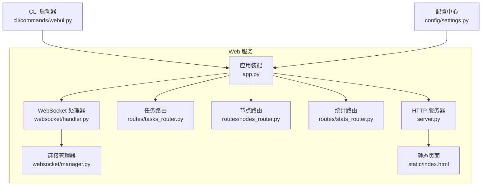
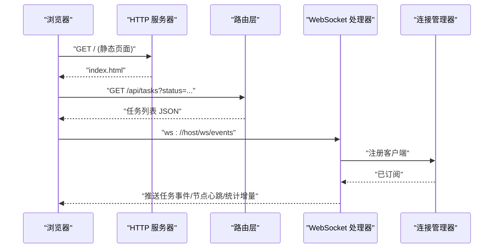
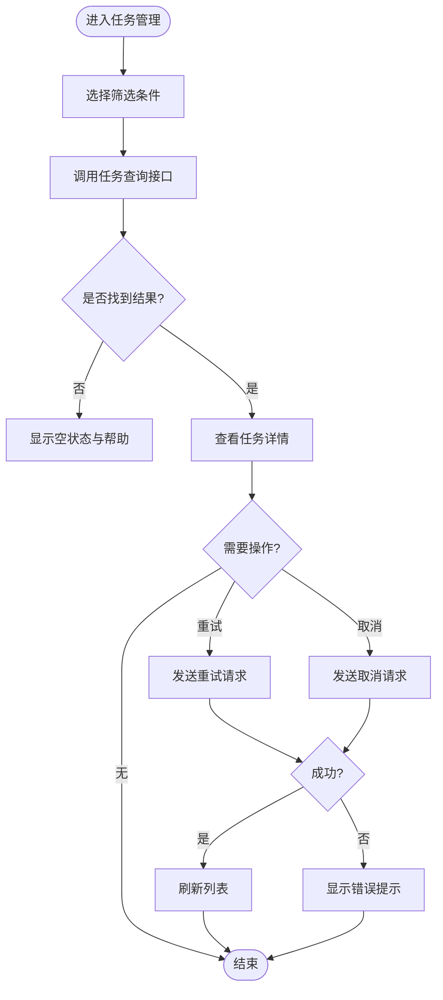
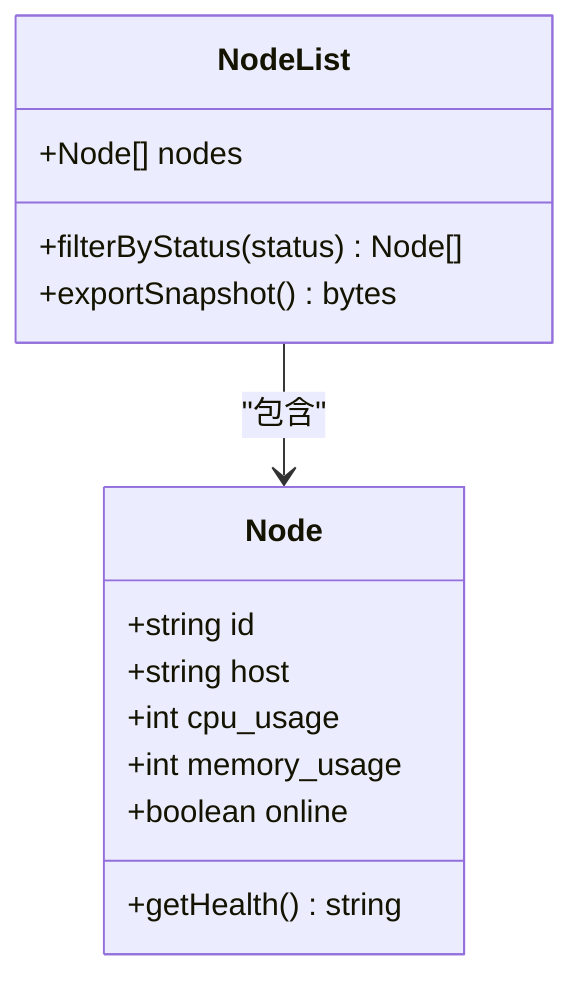
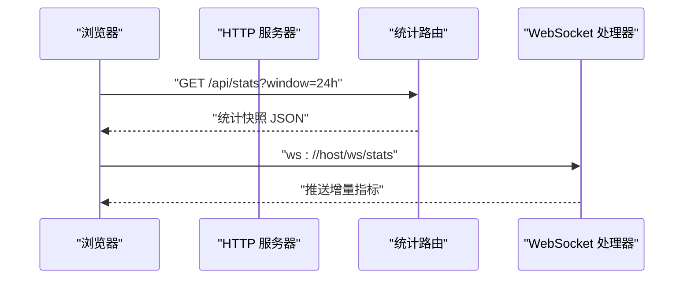
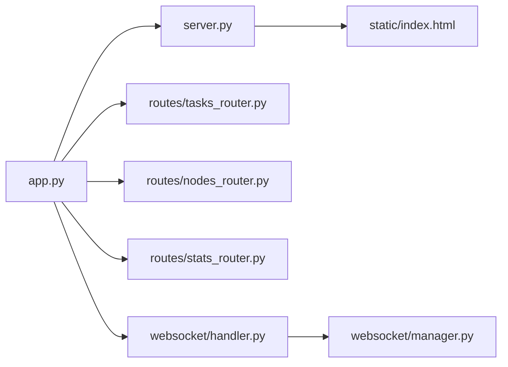

# 用户界面操作指南

<cite>
**本文引用的文件**   
- [src/neotask/web/app.py](file://src/neotask/web/app.py)
- [src/neotask/web/server.py](file://src/neotask/web/server.py)
- [src/neotask/web/routes/tasks_router.py](file://src/neotask/web/routes/tasks_router.py)
- [src/neotask/web/routes/nodes_router.py](file://src/neotask/web/routes/nodes_router.py)
- [src/neotask/web/routes/stats_router.py](file://src/neotask/web/routes/stats_router.py)
- [src/neotask/web/static/index.html](file://src/neotask/web/static/index.html)
- [src/neotask/web/websocket/handler.py](file://src/neotask/web/websocket/handler.py)
- [src/neotask/web/websocket/manager.py](file://src/neotask/web/websocket/manager.py)
- [src/neotask/cli/commands/webui.py](file://src/neotask/cli/commands/webui.py)
- [src/neotask/config/settings.py](file://src/neotask/config/settings.py)
</cite>

## 目录
1. [简介](#简介)
2. [项目结构](#项目结构)
3. [核心组件](#核心组件)
4. [架构总览](#架构总览)
5. [详细组件分析](#详细组件分析)
6. [依赖关系分析](#依赖关系分析)
7. [性能与可用性建议](#性能与可用性建议)
8. [故障排查指南](#故障排查指南)
9. [结论](#结论)
10. [附录](#附录)

## 简介
本指南面向使用 Web 管理界面的运维与开发人员，聚焦以下能力：
- 任务管理：创建、查看、重试、取消、查询任务等
- 节点监控：查看节点状态、健康度、负载指标
- 系统统计：任务执行趋势、队列深度、失败率等
- 权限与定制：访问控制、界面主题与布局配置
- 常见问题与反馈：定位问题与收集反馈的方法

## 项目结构
Web 管理界面由后端路由、静态页面与 WebSocket 实时通信组成。关键路径如下：
- 应用与服务启动：app.py、server.py
- 功能路由：tasks_router.py、nodes_router.py、stats_router.py
- 前端入口：static/index.html
- 实时通信：websocket/handler.py、websocket/manager.py
- CLI 启动入口：cli/commands/webui.py
- 配置中心：config/settings.py

图示来源
- [src/neotask/web/app.py](file://src/neotask/web/app.py)
- [src/neotask/web/server.py](file://src/neotask/web/server.py)
- [src/neotask/web/routes/tasks_router.py](file://src/neotask/web/routes/tasks_router.py)
- [src/neotask/web/routes/nodes_router.py](file://src/neotask/web/routes/nodes_router.py)
- [src/neotask/web/routes/stats_router.py](file://src/neotask/web/routes/stats_router.py)
- [src/neotask/web/static/index.html](file://src/neotask/web/static/index.html)
- [src/neotask/web/websocket/handler.py](file://src/neotask/web/websocket/handler.py)
- [src/neotask/web/websocket/manager.py](file://src/neotask/web/websocket/manager.py)
- [src/neotask/cli/commands/webui.py](file://src/neotask/cli/commands/webui.py)
- [src/neotask/config/settings.py](file://src/neotask/config/settings.py)

章节来源
- [src/neotask/web/app.py](file://src/neotask/web/app.py)
- [src/neotask/web/server.py](file://src/neotask/web/server.py)
- [src/neotask/web/routes/tasks_router.py](file://src/neotask/web/routes/tasks_router.py)
- [src/neotask/web/routes/nodes_router.py](file://src/neotask/web/routes/nodes_router.py)
- [src/neotask/web/routes/stats_router.py](file://src/neotask/web/routes/stats_router.py)
- [src/neotask/web/static/index.html](file://src/neotask/web/static/index.html)
- [src/neotask/web/websocket/handler.py](file://src/neotask/web/websocket/handler.py)
- [src/neotask/web/websocket/manager.py](file://src/neotask/web/websocket/manager.py)
- [src/neotask/cli/commands/webui.py](file://src/neotask/cli/commands/webui.py)
- [src/neotask/config/settings.py](file://src/neotask/config/settings.py)

## 核心组件
- 应用装配层：负责注册路由、中间件、生命周期钩子与配置注入
- HTTP 路由层：提供任务、节点、统计三类 REST 接口
- WebSocket 层：推送任务事件、节点心跳与统计增量数据
- 静态资源层：提供单页应用入口与基础 UI 框架
- CLI 启动器：封装启动参数、端口、日志与调试模式
- 配置中心：集中管理端口、鉴权开关、主题与展示选项

章节来源
- [src/neotask/web/app.py](file://src/neotask/web/app.py)
- [src/neotask/web/server.py](file://src/neotask/web/server.py)
- [src/neotask/web/websocket/handler.py](file://src/neotask/web/websocket/handler.py)
- [src/neotask/web/websocket/manager.py](file://src/neotask/web/websocket/manager.py)
- [src/neotask/cli/commands/webui.py](file://src/neotask/cli/commands/webui.py)
- [src/neotask/config/settings.py](file://src/neotask/config/settings.py)

## 架构总览
Web 管理界面采用“REST + WebSocket”的混合架构：
- 页面加载后通过 REST 获取初始数据（任务列表、节点信息、统计概览）
- 通过 WebSocket 订阅实时事件（任务状态变更、节点心跳、统计刷新）
- 所有请求受统一鉴权与限流策略保护（可配置）

图示来源
- [src/neotask/web/server.py](file://src/neotask/web/server.py)
- [src/neotask/web/routes/tasks_router.py](file://src/neotask/web/routes/tasks_router.py)
- [src/neotask/web/websocket/handler.py](file://src/neotask/web/websocket/handler.py)
- [src/neotask/web/websocket/manager.py](file://src/neotask/web/websocket/manager.py)

## 详细组件分析

### 任务管理
- 主要能力
  - 查询任务：支持按状态、优先级、时间范围筛选
  - 创建任务：提交任务定义、调度策略与参数
  - 重试/取消：对失败或运行中任务进行干预
  - 批量操作：批量重试、批量取消
- 常用操作
  - 在任务列表中点击“重试”快速恢复失败任务
  - 使用顶部筛选栏按状态过滤，配合搜索框快速定位
  - 右键菜单提供“查看详情”、“复制任务 ID”等快捷操作
- 高级用法
  - 通过 API 批量导入任务清单
  - 结合 WebSocket 事件实现自动刷新与告警提示

章节来源
- [src/neotask/web/routes/tasks_router.py](file://src/neotask/web/routes/tasks_router.py)
- [src/neotask/web/static/index.html](file://src/neotask/web/static/index.html)

### 节点监控
- 主要能力
  - 节点列表：在线/离线、CPU/内存/磁盘占用
  - 健康检查：心跳上报、异常告警
  - 拓扑视图：节点分组与分片分布
- 常用操作
  - 点击节点卡片查看详细信息与历史指标
  - 使用“刷新”按钮拉取最新状态
  - 按区域/标签筛选节点
- 高级用法
  - 自定义阈值告警规则
  - 导出节点快照用于离线分析

章节来源
- [src/neotask/web/routes/nodes_router.py](file://src/neotask/web/routes/nodes_router.py)
- [src/neotask/web/static/index.html](file://src/neotask/web/static/index.html)

### 系统统计
- 主要能力
  - 概览面板：任务成功率、平均耗时、队列深度
  - 趋势图：近 N 小时的任务量与失败率
  - 排行：TopN 慢任务与热点任务
- 常用操作
  - 切换时间窗口（最近 1h/6h/24h/7d）
  - 点击图表区间放大查看细节
  - 导出 CSV/PNG 报告
- 高级用法
  - 自定义聚合维度（按任务类型/负责人）
  - 订阅统计增量事件，实现低延迟看板

章节来源
- [src/neotask/web/routes/stats_router.py](file://src/neotask/web/routes/stats_router.py)
- [src/neotask/web/websocket/handler.py](file://src/neotask/web/websocket/handler.py)

### 权限与访问控制
- 角色与权限
  - 管理员：全部操作（任务、节点、统计、配置）
  - 运维：任务与节点查看与基本操作
  - 只读：仅查看
- 登录与会话
  - 支持用户名/密码登录
  - 会话超时与自动登出
- 安全建议
  - 启用 HTTPS
  - 限制来源 IP 白名单
  - 开启审计日志

章节来源
- [src/neotask/web/app.py](file://src/neotask/web/app.py)
- [src/neotask/config/settings.py](file://src/neotask/config/settings.py)

### 界面定制与主题配置
- 主题与布局
  - 明/暗主题切换
  - 侧边栏折叠与全屏模式
  - 仪表盘小部件自由拖拽排序
- 个性化设置
  - 默认时间窗口
  - 语言与单位制
  - 通知偏好（声音/弹窗）
- 持久化
  - 本地存储保存用户偏好
  - 云端同步（企业版）

章节来源
- [src/neotask/web/static/index.html](file://src/neotask/web/static/index.html)
- [src/neotask/config/settings.py](file://src/neotask/config/settings.py)

### 实时通信与事件
- 事件类型
  - 任务：创建、开始、完成、失败、重试
  - 节点：上线、下线、心跳、异常
  - 统计：增量指标推送
- 重连与容错
  - 指数退避重连
  - 断线缓存与补齐
- 订阅管理
  - 按频道订阅（如 tasks、nodes、stats）
  - 去抖与节流避免刷屏

章节来源
- [src/neotask/web/websocket/handler.py](file://src/neotask/web/websocket/handler.py)
- [src/neotask/web/websocket/manager.py](file://src/neotask/web/websocket/manager.py)

## 依赖关系分析
Web 模块之间的依赖关系清晰，职责分离良好：
- app.py 作为装配中心，依赖 server.py 提供 HTTP 服务
- routes 下各路由器独立实现业务接口
- websocket 模块与 manager 解耦，便于扩展新的事件通道
- static/index.html 为前端入口，依赖后端 API 与 WS

图示来源
- [src/neotask/web/app.py](file://src/neotask/web/app.py)
- [src/neotask/web/server.py](file://src/neotask/web/server.py)
- [src/neotask/web/routes/tasks_router.py](file://src/neotask/web/routes/tasks_router.py)
- [src/neotask/web/routes/nodes_router.py](file://src/neotask/web/routes/nodes_router.py)
- [src/neotask/web/routes/stats_router.py](file://src/neotask/web/routes/stats_router.py)
- [src/neotask/web/static/index.html](file://src/neotask/web/static/index.html)
- [src/neotask/web/websocket/handler.py](file://src/neotask/web/websocket/handler.py)
- [src/neotask/web/websocket/manager.py](file://src/neotask/web/websocket/manager.py)

章节来源
- [src/neotask/web/app.py](file://src/neotask/web/app.py)
- [src/neotask/web/server.py](file://src/neotask/web/server.py)
- [src/neotask/web/routes/tasks_router.py](file://src/neotask/web/routes/tasks_router.py)
- [src/neotask/web/routes/nodes_router.py](file://src/neotask/web/routes/nodes_router.py)
- [src/neotask/web/routes/stats_router.py](file://src/neotask/web/routes/stats_router.py)
- [src/neotask/web/static/index.html](file://src/neotask/web/static/index.html)
- [src/neotask/web/websocket/handler.py](file://src/neotask/web/websocket/handler.py)
- [src/neotask/web/websocket/manager.py](file://src/neotask/web/websocket/manager.py)

## 性能与可用性建议
- 分页与懒加载：任务列表与统计大图采用分页与按需加载
- 缓存策略：热点数据短缓存，减少重复计算
- 增量更新：通过 WebSocket 推送增量，降低轮询开销
- 压缩传输：启用 gzip/br 压缩
- 前端优化：防抖/节流、虚拟滚动、图片懒加载

[本节为通用指导，不直接分析具体文件]

## 故障排查指南
- 无法打开 Web 界面
  - 确认服务已启动且端口未被占用
  - 检查防火墙与安全组放行
- 登录后无权限
  - 核对角色分配与资源授权
  - 查看会话是否过期
- 任务操作失败
  - 查看任务详情中的错误码与堆栈摘要
  - 重试前确认依赖资源可用
- 节点离线
  - 检查心跳间隔与网络连通性
  - 查看节点日志与系统资源水位
- 统计不更新
  - 确认 WebSocket 连接状态
  - 检查统计采集器是否正常

章节来源
- [src/neotask/web/websocket/handler.py](file://src/neotask/web/websocket/handler.py)
- [src/neotask/web/websocket/manager.py](file://src/neotask/web/websocket/manager.py)
- [src/neotask/web/routes/tasks_router.py](file://src/neotask/web/routes/tasks_router.py)
- [src/neotask/web/routes/nodes_router.py](file://src/neotask/web/routes/nodes_router.py)
- [src/neotask/web/routes/stats_router.py](file://src/neotask/web/routes/stats_router.py)

## 结论
本指南围绕任务管理、节点监控与系统统计三大核心场景，提供了从入门到进阶的操作方法，并补充了权限、定制与排障要点。建议在生产环境启用 HTTPS、最小权限原则与审计日志，以获得更稳定与安全的体验。

[本节为总结，不直接分析具体文件]

## 附录

### 快速上手步骤
- 启动服务
  - 使用 CLI 命令启动 WebUI，指定端口与日志级别
- 登录界面
  - 使用管理员账号首次登录，完善基础配置
- 创建第一个任务
  - 在任务管理中新增任务，设置调度策略与重试次数
- 观察效果
  - 在任务列表与统计面板中查看执行结果

章节来源
- [src/neotask/cli/commands/webui.py](file://src/neotask/cli/commands/webui.py)
- [src/neotask/web/static/index.html](file://src/neotask/web/static/index.html)

### 常见问题解答（FAQ）
- 如何重置管理员密码？
  - 通过后台管理或命令行工具重置
- 如何导出报表？
  - 在统计页面选择时间范围并导出 CSV/PNG
- 如何关闭实时推送？
  - 在设置中关闭 WebSocket 订阅，改为定时刷新

章节来源
- [src/neotask/config/settings.py](file://src/neotask/config/settings.py)
- [src/neotask/web/static/index.html](file://src/neotask/web/static/index.html)

### 用户反馈收集
- 内置反馈表单：在“关于”页面提交问题与建议
- 日志导出：一键打包当前会话日志与截图
- 联系渠道：提供工单系统与紧急联系方式

章节来源
- [src/neotask/web/static/index.html](file://src/neotask/web/static/index.html)