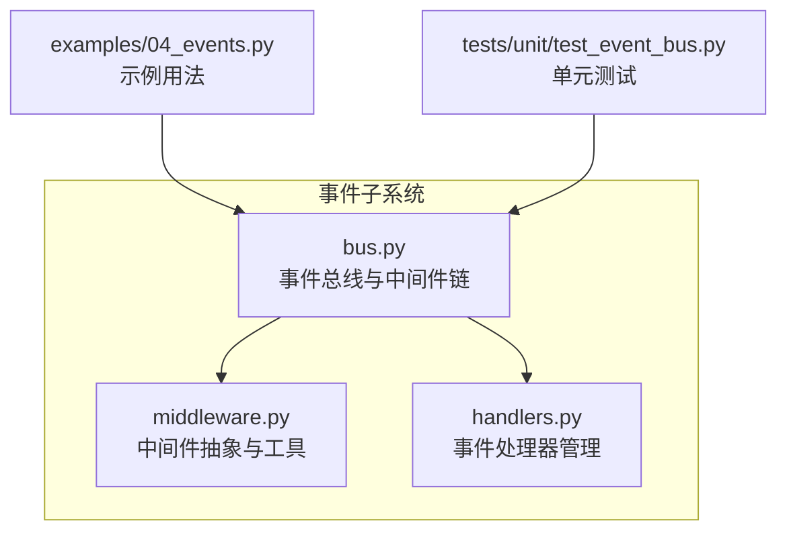
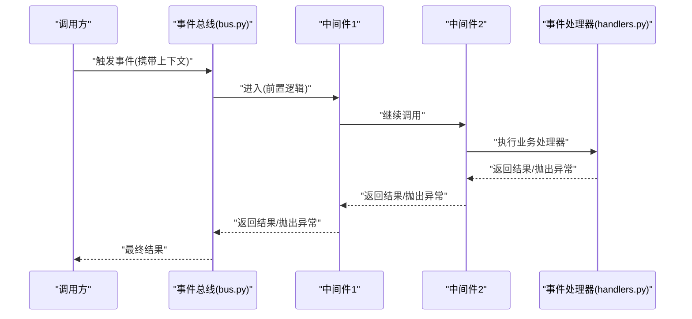
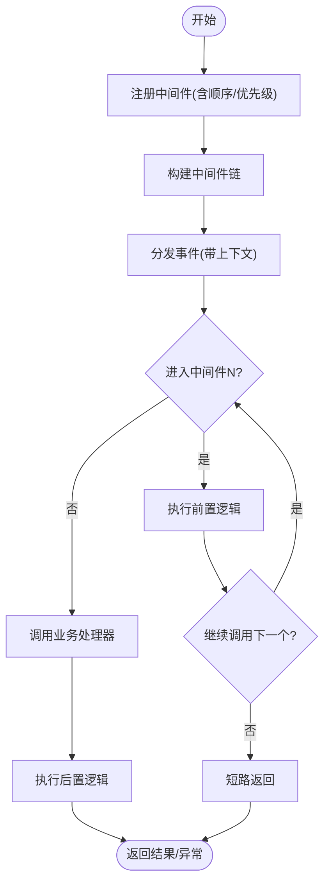
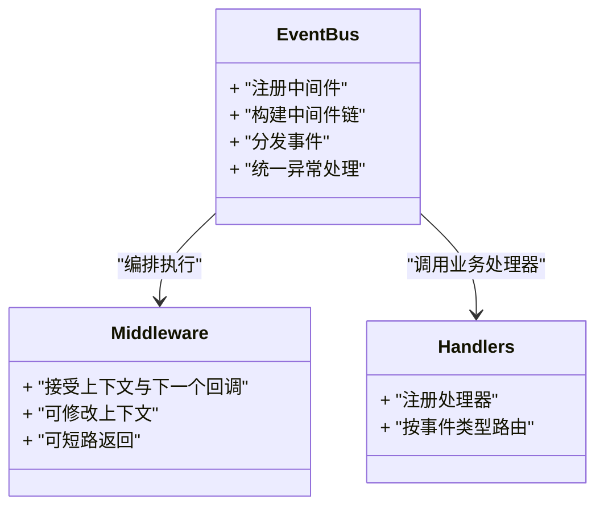

# 事件中间件

<cite>
**本文引用的文件**   
- [src/neotask/event/middleware.py](file://src/neotask/event/middleware.py)
- [src/neotask/event/bus.py](file://src/neotask/event/bus.py)
- [src/neotask/event/handlers.py](file://src/neotask/event/handlers.py)
- [examples/04_events.py](file://examples/04_events.py)
- [tests/unit/test_event_bus.py](file://tests/unit/test_event_bus.py)
</cite>

## 目录
1. [简介](#简介)
2. [项目结构](#项目结构)
3. [核心组件](#核心组件)
4. [架构总览](#架构总览)
5. [详细组件分析](#详细组件分析)
6. [依赖关系分析](#依赖关系分析)
7. [性能考虑](#性能考虑)
8. [故障排查指南](#故障排查指南)
9. [结论](#结论)
10. [附录](#附录)

## 简介
本文件围绕“事件中间件”主题，系统化阐述该仓库中事件系统的中间件架构模式与链式处理机制。重点覆盖：
- 中间件的注册、执行顺序与拦截机制
- 内置能力（日志记录、权限验证、数据转换、错误处理）的设计要点与扩展方式
- 自定义中间件的开发指南（接口约定、上下文传递、异常处理）
- 性能考量、调试技巧与最佳实践案例

## 项目结构
事件子系统位于 src/neotask/event 下，包含三个关键模块：
- bus.py：事件总线，负责中间件链的构建、调度与分发
- middleware.py：中间件抽象与通用工具
- handlers.py：事件处理器注册与管理

图表来源
- [src/neotask/event/middleware.py](file://src/neotask/event/middleware.py)
- [src/neotask/event/bus.py](file://src/neotask/event/bus.py)
- [src/neotask/event/handlers.py](file://src/neotask/event/handlers.py)
- [examples/04_events.py](file://examples/04_events.py)
- [tests/unit/test_event_bus.py](file://tests/unit/test_event_bus.py)

章节来源
- [src/neotask/event/middleware.py](file://src/neotask/event/middleware.py)
- [src/neotask/event/bus.py](file://src/neotask/event/bus.py)
- [src/neotask/event/handlers.py](file://src/neotask/event/handlers.py)
- [examples/04_events.py](file://examples/04_events.py)
- [tests/unit/test_event_bus.py](file://tests/unit/test_event_bus.py)

## 核心组件
- 中间件抽象与工具（middleware.py）
  - 定义中间件调用契约与装饰器/工厂辅助，用于将普通函数或类适配为中间件
  - 提供统一的上下文对象，贯穿请求/响应生命周期
- 事件总线（bus.py）
  - 维护中间件链，按注册顺序组装并执行
  - 负责在中间件前后注入钩子、捕获异常、收集指标
- 事件处理器（handlers.py）
  - 管理业务处理器注册表，支持按事件类型路由到具体处理器
  - 与中间件链协作，确保横切关注点先于业务逻辑执行

章节来源
- [src/neotask/event/middleware.py](file://src/neotask/event/middleware.py)
- [src/neotask/event/bus.py](file://src/neotask/event/bus.py)
- [src/neotask/event/handlers.py](file://src/neotask/event/handlers.py)

## 架构总览
事件总线采用“洋葱模型”的链式中间件架构。每个中间件可访问上下文、决定继续或短路返回，并在进入/退出时执行前置/后置逻辑。

图表来源
- [src/neotask/event/bus.py](file://src/neotask/event/bus.py)
- [src/neotask/event/handlers.py](file://src/neotask/event/handlers.py)
- [src/neotask/event/middleware.py](file://src/neotask/event/middleware.py)

## 详细组件分析

### 中间件抽象与工具（middleware.py）
- 设计要点
  - 统一中间件签名：接收上下文与下一个回调，允许修改上下文、提前返回或透传
  - 提供装饰器/工厂封装，简化同步/异步中间件编写
  - 上下文对象贯穿全链路，承载事件元信息、用户身份、追踪ID等
- 典型职责
  - 日志记录：记录进入/退出时间、耗时、输入输出摘要
  - 权限校验：基于上下文中的身份信息判定是否放行
  - 数据转换：规范化输入参数、补充默认值、脱敏敏感字段
  - 错误处理：捕获异常并转换为标准错误响应，记录堆栈
- 开发建议
  - 保持幂等与无副作用（除必要的日志/指标）
  - 对异常进行明确分类与包装，便于上层统一处理
  - 避免在中间件中执行重IO或阻塞操作

章节来源
- [src/neotask/event/middleware.py](file://src/neotask/event/middleware.py)

### 事件总线（bus.py）
- 设计要点
  - 中间件注册：支持按优先级或插入位置控制顺序
  - 链式执行：按注册顺序依次进入，最后一个节点通常是业务处理器
  - 拦截机制：任一中间件可短路返回或抛出异常以中断后续流程
  - 生命周期钩子：在进入/退出阶段统一收集指标、埋点与审计
- 执行顺序
  - 通常遵循“先注册先执行”的顺序；若支持优先级，则按优先级排序后执行
- 异常传播
  - 未捕获异常沿链回传，由最外层统一处理并转换为标准错误

图表来源
- [src/neotask/event/bus.py](file://src/neotask/event/bus.py)

章节来源
- [src/neotask/event/bus.py](file://src/neotask/event/bus.py)

### 事件处理器（handlers.py）
- 设计要点
  - 处理器注册表：按事件类型映射到具体处理函数/方法
  - 路由策略：支持精确匹配、通配符或前缀匹配（视实现而定）
  - 与中间件解耦：仅关注业务逻辑，横切关注点由中间件完成
- 使用建议
  - 处理器应保持单一职责，避免重复校验与格式化
  - 对返回值进行标准化，便于中间件统一处理

章节来源
- [src/neotask/event/handlers.py](file://src/neotask/event/handlers.py)

### 内置中间件能力说明
以下为常见内置能力的实现思路与接入点（不直接展示代码，给出路径参考）：
- 日志记录中间件
  - 作用：记录进入/退出、耗时、关键参数摘要
  - 接入点：[src/neotask/event/middleware.py](file://src/neotask/event/middleware.py)
- 权限验证中间件
  - 作用：从上下文提取身份/角色，校验访问权限
  - 接入点：[src/neotask/event/middleware.py](file://src/neotask/event/middleware.py)
- 数据转换中间件
  - 作用：参数校验、类型转换、默认值填充、字段脱敏
  - 接入点：[src/neotask/event/middleware.py](file://src/neotask/event/middleware.py)
- 错误处理中间件
  - 作用：捕获异常、记录堆栈、转换为标准错误响应
  - 接入点：[src/neotask/event/bus.py](file://src/neotask/event/bus.py), [src/neotask/event/middleware.py](file://src/neotask/event/middleware.py)

章节来源
- [src/neotask/event/middleware.py](file://src/neotask/event/middleware.py)
- [src/neotask/event/bus.py](file://src/neotask/event/bus.py)

### 自定义中间件开发指南
- 接口约定
  - 中间件函数签名：接收上下文与下一个回调，可选择修改上下文、提前返回或透传
  - 支持装饰器/工厂封装，减少样板代码
- 上下文传递
  - 通过上下文对象在各中间件间共享状态（如用户信息、追踪ID、请求头）
- 异常处理
  - 在中间件内捕获并包装异常，必要时短路返回
  - 将特定异常类型交由错误处理中间件统一处理
- 示例参考
  - 使用示例：[examples/04_events.py](file://examples/04_events.py)
  - 单元测试参考：[tests/unit/test_event_bus.py](file://tests/unit/test_event_bus.py)

章节来源
- [src/neotask/event/middleware.py](file://src/neotask/event/middleware.py)
- [examples/04_events.py](file://examples/04_events.py)
- [tests/unit/test_event_bus.py](file://tests/unit/test_event_bus.py)

## 依赖关系分析
事件子系统内部依赖关系如下：

图表来源
- [src/neotask/event/middleware.py](file://src/neotask/event/middleware.py)
- [src/neotask/event/bus.py](file://src/neotask/event/bus.py)
- [src/neotask/event/handlers.py](file://src/neotask/event/handlers.py)

章节来源
- [src/neotask/event/middleware.py](file://src/neotask/event/middleware.py)
- [src/neotask/event/bus.py](file://src/neotask/event/bus.py)
- [src/neotask/event/handlers.py](file://src/neotask/event/handlers.py)

## 性能考虑
- 中间件数量与顺序
  - 越靠近外层的中间件开销越大，应优先放置轻量级中间件（如日志、鉴权）
  - 将昂贵操作（如远程校验、复杂计算）放在靠后的中间件或处理器中
- 上下文拷贝与序列化
  - 避免在中间件中频繁深拷贝大对象；按需传递必要字段
- I/O 与阻塞
  - 中间件应避免阻塞I/O；如需网络调用，建议使用异步或限流
- 指标与采样
  - 对高频事件启用采样统计，降低监控开销
- 短路优化
  - 尽早短路失败场景，减少后续中间件与处理器执行

## 故障排查指南
- 常见问题定位
  - 中间件顺序问题：确认注册顺序是否符合预期，必要时调整优先级
  - 上下文缺失：检查上游中间件是否正确写入上下文字段
  - 异常未捕获：确认错误处理中间件已注册且位于合适位置
- 调试技巧
  - 在关键中间件增加进入/退出日志与耗时统计
  - 使用追踪ID贯穿全链路，便于跨中间件关联日志
  - 借助单元测试快速验证中间件行为（参考测试用例）
- 参考路径
  - 中间件与总线实现：[src/neotask/event/middleware.py](file://src/neotask/event/middleware.py), [src/neotask/event/bus.py](file://src/neotask/event/bus.py)
  - 示例与测试：[examples/04_events.py](file://examples/04_events.py), [tests/unit/test_event_bus.py](file://tests/unit/test_event_bus.py)

章节来源
- [src/neotask/event/middleware.py](file://src/neotask/event/middleware.py)
- [src/neotask/event/bus.py](file://src/neotask/event/bus.py)
- [examples/04_events.py](file://examples/04_events.py)
- [tests/unit/test_event_bus.py](file://tests/unit/test_event_bus.py)

## 结论
事件中间件通过统一的链式编排，将横切关注点与业务逻辑解耦，提升了系统的可观测性、可维护性与可扩展性。合理设计中间件顺序、严格规范上下文与异常处理，并结合完善的测试与监控，可在保证性能的同时获得良好的工程体验。

## 附录
- 术语
  - 中间件：对事件生命周期进行增强的横切组件
  - 上下文：贯穿中间件链的状态载体
  - 短路：中间件提前返回，阻止后续中间件执行
- 最佳实践清单
  - 明确中间件职责边界，避免重复逻辑
  - 使用装饰器/工厂统一中间件形态
  - 对异常进行分类与包装，统一错误响应
  - 为关键路径添加耗时与指标埋点
  - 通过单元测试覆盖正常与异常分支