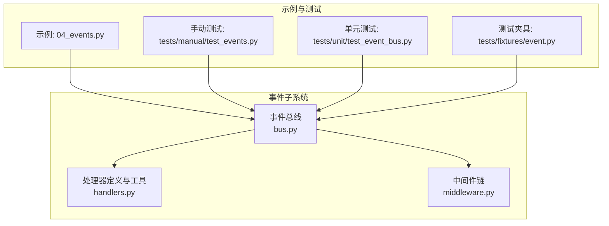
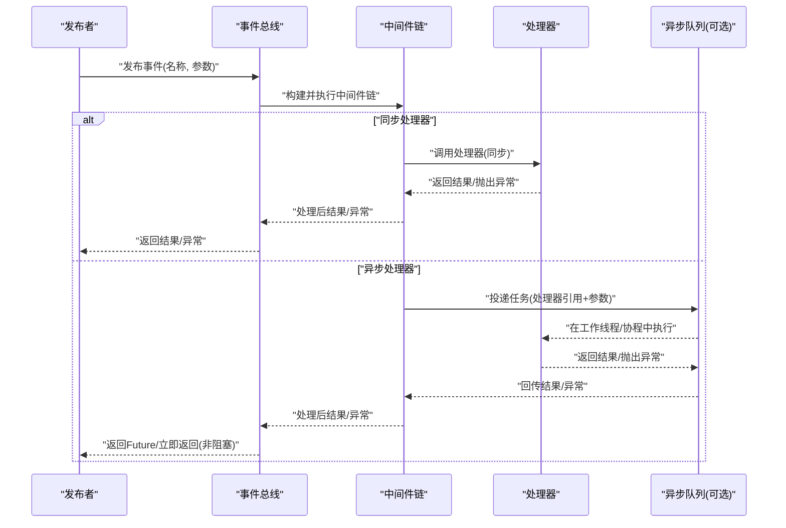
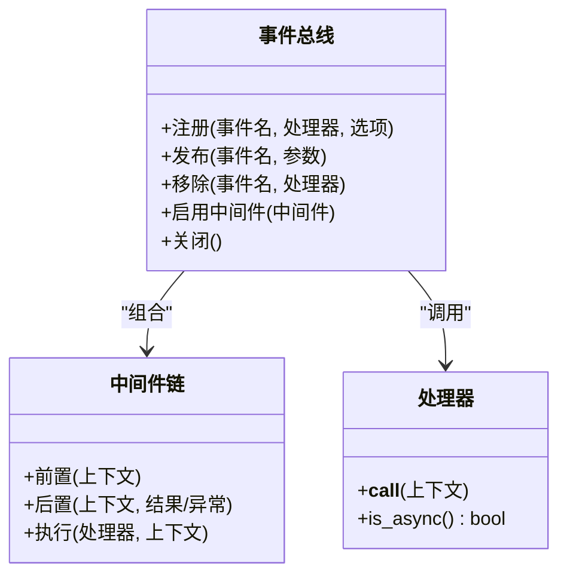
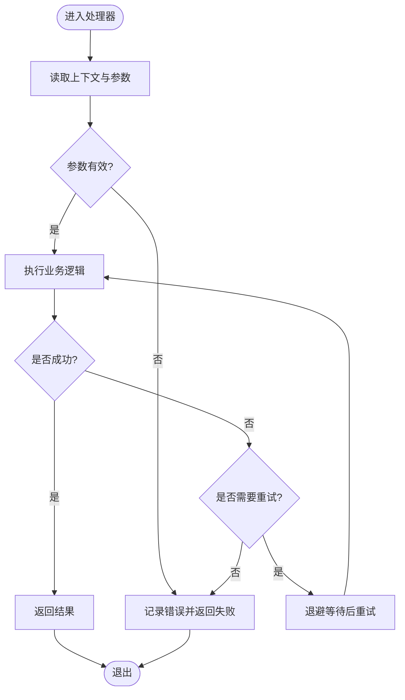
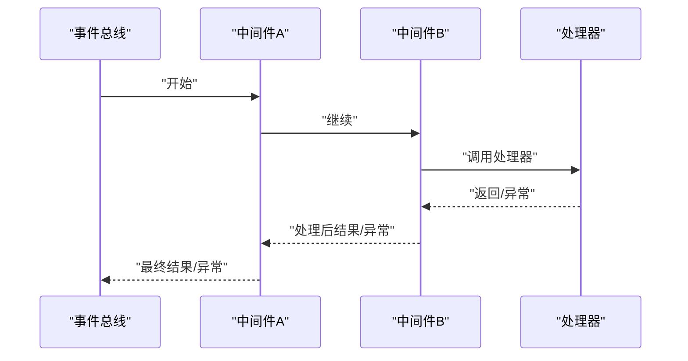
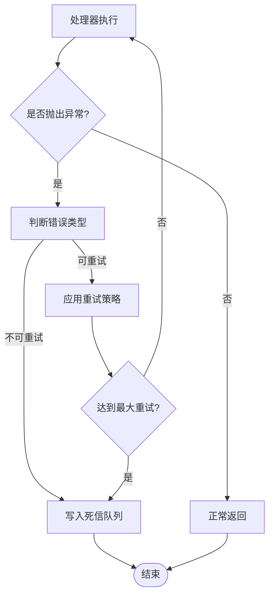
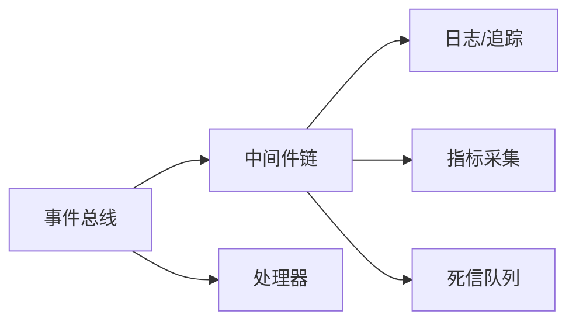

# 事件处理器

<cite>
**本文引用的文件**   
- [src/neotask/event/bus.py](file://src/neotask/event/bus.py)
- [src/neotask/event/handlers.py](file://src/neotask/event/handlers.py)
- [src/neotask/event/middleware.py](file://src/neotask/event/middleware.py)
- [examples/04_events.py](file://examples/04_events.py)
- [tests/manual/test_events.py](file://tests/manual/test_events.py)
- [tests/unit/test_event_bus.py](file://tests/unit/test_event_bus.py)
- [tests/fixtures/event.py](file://tests/fixtures/event.py)
</cite>

## 目录
1. [简介](#简介)
2. [项目结构](#项目结构)
3. [核心组件](#核心组件)
4. [架构总览](#架构总览)
5. [详细组件分析](#详细组件分析)
6. [依赖关系分析](#依赖关系分析)
7. [性能考虑](#性能考虑)
8. [故障排查指南](#故障排查指南)
9. [结论](#结论)
10. [附录](#附录)

## 简介
本章节面向“事件处理器”的设计与实现，系统性阐述同步与异步处理器的差异、注册与调用流程、参数传递与返回值处理、生命周期管理、错误处理策略与重试机制，并提供函数式、类式、装饰器式等典型使用示例。同时给出性能调优、资源管理与并发控制的最佳实践建议。

## 项目结构
事件子系统位于 src/neotask/event 目录下，包含事件总线、处理器基类与中间件能力；配套示例与测试覆盖常见用法与边界场景。

图表来源
- [src/neotask/event/bus.py](file://src/neotask/event/bus.py)
- [src/neotask/event/handlers.py](file://src/neotask/event/handlers.py)
- [src/neotask/event/middleware.py](file://src/neotask/event/middleware.py)
- [examples/04_events.py](file://examples/04_events.py)
- [tests/manual/test_events.py](file://tests/manual/test_events.py)
- [tests/unit/test_event_bus.py](file://tests/unit/test_event_bus.py)
- [tests/fixtures/event.py](file://tests/fixtures/event.py)

章节来源
- [src/neotask/event/bus.py](file://src/neotask/event/bus.py)
- [src/neotask/event/handlers.py](file://src/neotask/event/handlers.py)
- [src/neotask/event/middleware.py](file://src/neotask/event/middleware.py)
- [examples/04_events.py](file://examples/04_events.py)
- [tests/manual/test_events.py](file://tests/manual/test_events.py)
- [tests/unit/test_event_bus.py](file://tests/unit/test_event_bus.py)
- [tests/fixtures/event.py](file://tests/fixtures/event.py)

## 核心组件
- 事件总线：负责事件的发布、订阅、分发与执行调度，支持同步与异步两种模式。
- 处理器：可被注册的回调或对象方法，用于消费事件；提供统一接口与上下文信息。
- 中间件：在处理器执行前后注入横切逻辑（如日志、指标、限流、重试等）。

章节来源
- [src/neotask/event/bus.py](file://src/neotask/event/bus.py)
- [src/neotask/event/handlers.py](file://src/neotask/event/handlers.py)
- [src/neotask/event/middleware.py](file://src/neotask/event/middleware.py)

## 架构总览
下图展示了事件从发布到处理的端到端流程，包括中间件链与同步/异步分支。

图表来源
- [src/neotask/event/bus.py](file://src/neotask/event/bus.py)
- [src/neotask/event/middleware.py](file://src/neotask/event/middleware.py)
- [src/neotask/event/handlers.py](file://src/neotask/event/handlers.py)

## 详细组件分析

### 事件总线（同步与异步）
- 职责
  - 维护订阅关系（事件名 -> 处理器列表）
  - 解析处理器类型（函数/类方法/装饰器包装），统一为可调用的处理器实例
  - 按配置选择同步或异步执行路径
  - 组装中间件链，并在执行前后注入上下文
- 关键行为
  - 注册：将处理器绑定到指定事件名，支持优先级与过滤条件
  - 发布：根据处理器类型与执行模型进行分发
  - 返回值：同步直接返回；异步返回 Future 或忽略（取决于 API）
  - 错误传播：中间件捕获异常，决定是否重试或进入死信队列

图表来源
- [src/neotask/event/bus.py](file://src/neotask/event/bus.py)
- [src/neotask/event/middleware.py](file://src/neotask/event/middleware.py)
- [src/neotask/event/handlers.py](file://src/neotask/event/handlers.py)

章节来源
- [src/neotask/event/bus.py](file://src/neotask/event/bus.py)
- [src/neotask/event/middleware.py](file://src/neotask/event/middleware.py)
- [src/neotask/event/handlers.py](file://src/neotask/event/handlers.py)

### 处理器定义与工具
- 处理器形态
  - 函数处理器：普通函数或带签名的可调用对象
  - 类处理器：实现统一接口的类实例，便于状态与资源管理
  - 装饰器处理器：通过装饰器自动注册与元数据声明
- 上下文与参数
  - 事件名、时间戳、源标识、扩展字段等
  - 参数透传与校验由中间件或处理器自身完成
- 返回值
  - 同步：直接返回
  - 异步：返回 Future 或由外部聚合

图表来源
- [src/neotask/event/handlers.py](file://src/neotask/event/handlers.py)
- [src/neotask/event/middleware.py](file://src/neotask/event/middleware.py)

章节来源
- [src/neotask/event/handlers.py](file://src/neotask/event/handlers.py)
- [src/neotask/event/middleware.py](file://src/neotask/event/middleware.py)

### 中间件与横切关注点
- 典型中间件
  - 日志与追踪：记录事件流转、耗时、堆栈
  - 指标采集：计数、时延分位、错误率
  - 限流与熔断：保护下游与系统稳定性
  - 重试与退避：对瞬时故障进行恢复
  - 死信队列：不可恢复错误持久化与告警
- 执行顺序
  - 中间件以链式方式包裹处理器，先入后出执行
  - 可在前置阶段做鉴权/参数校验，在后置阶段做清理/上报

图表来源
- [src/neotask/event/middleware.py](file://src/neotask/event/middleware.py)

章节来源
- [src/neotask/event/middleware.py](file://src/neotask/event/middleware.py)

### 生命周期管理
- 启动期
  - 初始化中间件、加载默认处理器、预热资源
- 运行期
  - 动态注册/注销处理器
  - 运行时切换执行模型（同步/异步）
- 停止期
  - 优雅关闭：等待未决任务完成、刷新指标、释放资源

章节来源
- [src/neotask/event/bus.py](file://src/neotask/event/bus.py)
- [src/neotask/event/middleware.py](file://src/neotask/event/middleware.py)

### 错误处理与重试机制
- 错误分类
  - 可重试：网络抖动、临时锁冲突、超时
  - 不可重试：参数非法、业务校验失败、权限不足
- 重试策略
  - 固定间隔、指数退避、抖动随机化
  - 最大重试次数与超时上限
- 失败落盘
  - 进入死信队列，附带上下文与堆栈，供后续人工干预

图表来源
- [src/neotask/event/middleware.py](file://src/neotask/event/middleware.py)

章节来源
- [src/neotask/event/middleware.py](file://src/neotask/event/middleware.py)

### 使用示例与最佳实践

#### 函数处理器
- 适用场景：轻量、无状态逻辑
- 要点：签名清晰、幂等设计、避免长耗时操作

章节来源
- [examples/04_events.py](file://examples/04_events.py)
- [tests/manual/test_events.py](file://tests/manual/test_events.py)

#### 类处理器
- 适用场景：需要连接池、缓存、状态机、复杂资源管理
- 要点：显式初始化/销毁、上下文隔离、线程安全

章节来源
- [src/neotask/event/handlers.py](file://src/neotask/event/handlers.py)
- [tests/fixtures/event.py](file://tests/fixtures/event.py)

#### 装饰器处理器
- 适用场景：快速注册、声明式元数据（优先级、标签、路由）
- 要点：装饰器内部完成注册与校验，保持调用语义一致

章节来源
- [src/neotask/event/handlers.py](file://src/neotask/event/handlers.py)
- [examples/04_events.py](file://examples/04_events.py)

#### 同步 vs 异步处理器
- 同步
  - 简单直观，适合短小、CPU密集且无需并发控制的场景
  - 注意阻塞风险，避免在热点路径上执行 I/O
- 异步
  - 高吞吐、低延迟，适合 I/O 密集与大规模并发
  - 需关注背压、队列容量与资源上限

章节来源
- [src/neotask/event/bus.py](file://src/neotask/event/bus.py)
- [tests/unit/test_event_bus.py](file://tests/unit/test_event_bus.py)

## 依赖关系分析
事件子系统内部耦合度较低，主要依赖如下：
- 事件总线依赖中间件链与处理器抽象
- 中间件可依赖日志、指标、存储等外部能力
- 示例与测试依赖总线提供的注册/发布 API

图表来源
- [src/neotask/event/bus.py](file://src/neotask/event/bus.py)
- [src/neotask/event/middleware.py](file://src/neotask/event/middleware.py)
- [src/neotask/event/handlers.py](file://src/neotask/event/handlers.py)

章节来源
- [src/neotask/event/bus.py](file://src/neotask/event/bus.py)
- [src/neotask/event/middleware.py](file://src/neotask/event/middleware.py)
- [src/neotask/event/handlers.py](file://src/neotask/event/handlers.py)

## 性能考虑
- 批量与合并
  - 对高频事件进行批处理，降低上下文切换与序列化开销
- 背压与限流
  - 基于队列长度或 CPU/IO 水位动态调整发布速率
- 资源复用
  - 连接池、线程池、协程池的合理配置与复用
- 监控与观测
  - 关键指标：发布速率、处理时延、错误率、队列积压
- 内存与GC
  - 避免在处理器中持有大对象引用，及时释放临时资源

[本节为通用指导，不直接分析具体文件]

## 故障排查指南
- 常见问题定位
  - 处理器未注册：检查注册时机与命名空间
  - 参数缺失/类型错误：在中间件层增加强校验
  - 异步任务堆积：观察队列深度与消费者并行度
  - 重复消费：确保幂等设计与去重键
- 诊断手段
  - 开启详细日志与链路追踪
  - 导出指标并与阈值告警联动
  - 对死信队列中的事件进行回放与复现

章节来源
- [tests/manual/test_events.py](file://tests/manual/test_events.py)
- [tests/unit/test_event_bus.py](file://tests/unit/test_event_bus.py)
- [tests/fixtures/event.py](file://tests/fixtures/event.py)

## 结论
事件处理器通过统一的注册与分发机制，结合中间件的可插拔能力，实现了高内聚、低耦合的事件驱动架构。同步与异步双模满足多样化场景，配合完善的错误处理与重试策略，提升了系统的健壮性与可观测性。在生产环境中，应结合业务特征进行容量规划与性能调优，并以监控与告警保障稳定运行。

## 附录
- 术语
  - 事件：一次业务动作或状态变更的抽象
  - 处理器：消费事件的回调或对象
  - 中间件：在执行前后注入横切逻辑的组件
  - 死信队列：存放不可恢复事件的持久化存储
- 参考示例与测试
  - 示例：[examples/04_events.py](file://examples/04_events.py)
  - 手动测试：[tests/manual/test_events.py](file://tests/manual/test_events.py)
  - 单元测试：[tests/unit/test_event_bus.py](file://tests/unit/test_event_bus.py)
  - 测试夹具：[tests/fixtures/event.py](file://tests/fixtures/event.py)