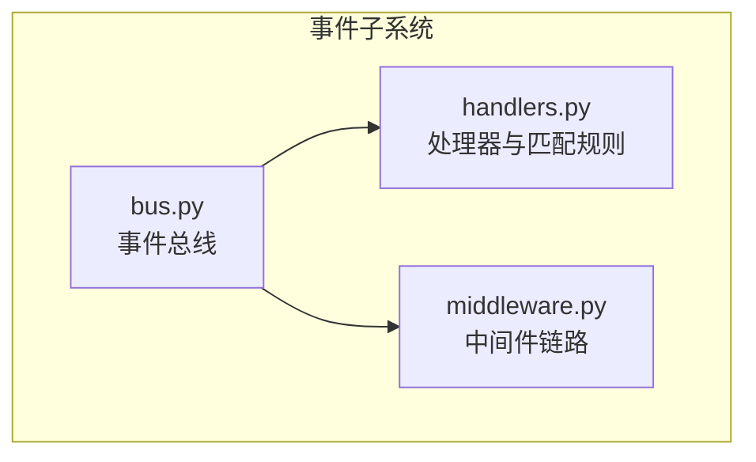
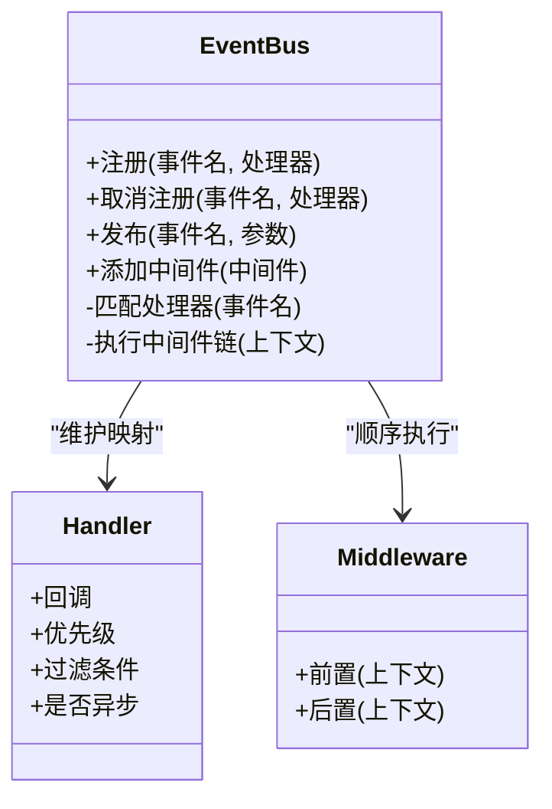
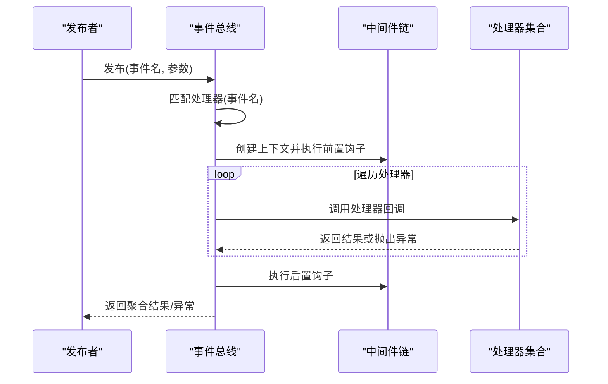
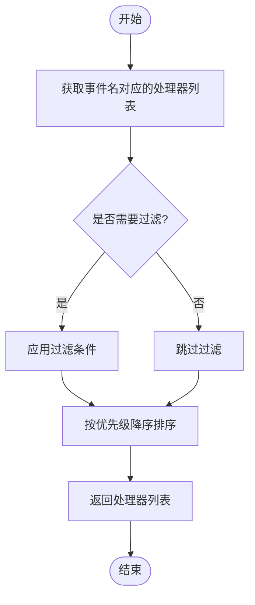
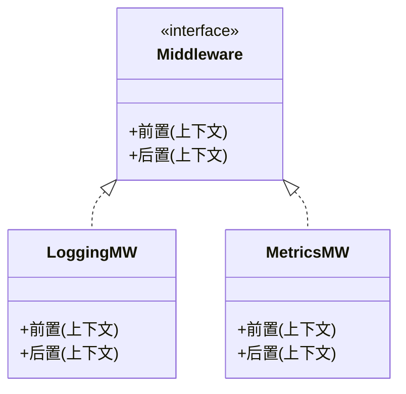
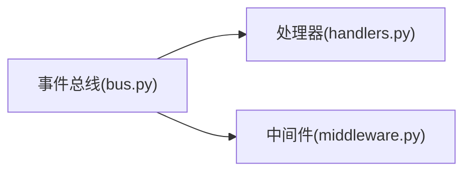

# 事件总线

<cite>
**本文引用的文件**   
- [src/neotask/event/bus.py](file://src/neotask/event/bus.py)
- [src/neotask/event/handlers.py](file://src/neotask/event/handlers.py)
- [src/neotask/event/middleware.py](file://src/neotask/event/middleware.py)
- [tests/unit/test_event_bus.py](file://tests/unit/test_event_bus.py)
- [examples/04_events.py](file://examples/04_events.py)
- [tests/fixtures/event.py](file://tests/fixtures/event.py)
</cite>

## 目录
1. [简介](#简介)
2. [项目结构](#项目结构)
3. [核心组件](#核心组件)
4. [架构总览](#架构总览)
5. [详细组件分析](#详细组件分析)
6. [依赖关系分析](#依赖关系分析)
7. [性能与内存管理](#性能与内存管理)
8. [使用示例](#使用示例)
9. [配置与监控](#配置与监控)
10. [故障排查指南](#故障排查指南)
11. [结论](#结论)

## 简介
本文件围绕事件子系统，系统化阐述事件总线的设计模式、核心架构与实现要点。重点覆盖发布-订阅模式的原理、事件的注册/发布/订阅机制、路由与分发逻辑、线程安全策略、性能优化与内存管理，并提供基本用法、批量处理、错误处理与异常传播的实践指引，以及配置选项、监控指标和故障排查方法。

## 项目结构
事件子系统位于 src/neotask/event 目录下，包含三个核心模块：
- bus.py：事件总线主入口，提供注册、发布、订阅等能力
- handlers.py：处理器抽象与匹配规则定义
- middleware.py：中间件链路与拦截点

图表来源
- [src/neotask/event/bus.py](file://src/neotask/event/bus.py)
- [src/neotask/event/handlers.py](file://src/neotask/event/handlers.py)
- [src/neotask/event/middleware.py](file://src/neotask/event/middleware.py)

章节来源
- [src/neotask/event/bus.py](file://src/neotask/event/bus.py)
- [src/neotask/event/handlers.py](file://src/neotask/event/handlers.py)
- [src/neotask/event/middleware.py](file://src/neotask/event/middleware.py)

## 核心组件
- 事件总线（EventBus）
  - 职责：维护事件名到处理器集合的映射；提供注册、取消注册、发布接口；负责按匹配规则选择处理器并执行；串联中间件链；聚合结果与异常。
- 处理器（Handler）
  - 职责：封装可调用对象及其元数据（如优先级、过滤条件、是否异步等），支持精确匹配或通配匹配。
- 中间件（Middleware）
  - 职责：在事件分发前后进行横切处理，如日志、限流、重试、指标上报等。

章节来源
- [src/neotask/event/bus.py](file://src/neotask/event/bus.py)
- [src/neotask/event/handlers.py](file://src/neotask/event/handlers.py)
- [src/neotask/event/middleware.py](file://src/neotask/event/middleware.py)

## 架构总览
事件总线采用“注册表 + 匹配器 + 分发器”的轻量架构，结合中间件形成可扩展的分发管线。

图表来源
- [src/neotask/event/bus.py](file://src/neotask/event/bus.py)
- [src/neotask/event/handlers.py](file://src/neotask/event/handlers.py)
- [src/neotask/event/middleware.py](file://src/neotask/event/middleware.py)

## 详细组件分析

### 事件总线（EventBus）
- 设计要点
  - 注册表：以事件名为键，存储匹配的处理器列表，支持按优先级排序。
  - 匹配策略：支持精确匹配与通配匹配，便于主题化事件路由。
  - 分发流程：先构建中间件上下文，再依次执行中间件前置钩子，随后遍历处理器执行回调，最后执行中间件后置钩子。
  - 结果与异常：对每个处理器执行结果进行收集；遇到异常时可选择短路或继续执行其他处理器，并将异常上抛或记录。
- 关键流程（序列图）

图表来源
- [src/neotask/event/bus.py](file://src/neotask/event/bus.py)
- [src/neotask/event/middleware.py](file://src/neotask/event/middleware.py)
- [src/neotask/event/handlers.py](file://src/neotask/event/handlers.py)

章节来源
- [src/neotask/event/bus.py](file://src/neotask/event/bus.py)

### 处理器与匹配规则（Handlers）
- 设计要点
  - 处理器封装：将回调函数与其元数据绑定，包括优先级、过滤条件、是否异步等。
  - 匹配规则：支持精确匹配与通配匹配（例如基于主题层级），用于灵活路由。
  - 排序策略：按优先级从高到低执行，保证重要处理器优先响应。
- 流程图（匹配与排序）

图表来源
- [src/neotask/event/handlers.py](file://src/neotask/event/handlers.py)

章节来源
- [src/neotask/event/handlers.py](file://src/neotask/event/handlers.py)

### 中间件（Middleware）
- 设计要点
  - 生命周期钩子：提供前置与后置两个扩展点，便于注入通用逻辑。
  - 组合方式：通过中间件链顺序执行，支持短路控制与上下文传递。
  - 典型用途：日志、指标采集、限流、重试、鉴权等。
- 类关系图

图表来源
- [src/neotask/event/middleware.py](file://src/neotask/event/middleware.py)

章节来源
- [src/neotask/event/middleware.py](file://src/neotask/event/middleware.py)

## 依赖关系分析
- 内部依赖
  - 事件总线依赖处理器模块进行匹配与排序，依赖中间件模块进行横切处理。
- 外部依赖
  - 无强耦合的外部库依赖，保持轻量与可移植性。
- 潜在循环依赖
  - 当前模块间为单向依赖，未发现循环引用风险。

图表来源
- [src/neotask/event/bus.py](file://src/neotask/event/bus.py)
- [src/neotask/event/handlers.py](file://src/neotask/event/handlers.py)
- [src/neotask/event/middleware.py](file://src/neotask/event/middleware.py)

章节来源
- [src/neotask/event/bus.py](file://src/neotask/event/bus.py)
- [src/neotask/event/handlers.py](file://src/neotask/event/handlers.py)
- [src/neotask/event/middleware.py](file://src/neotask/event/middleware.py)

## 性能与内存管理
- 性能优化建议
  - 处理器缓存：对高频事件名的处理器列表进行缓存，避免重复匹配开销。
  - 批量发布：合并多次发布为一次批量分发，减少锁竞争与上下文切换。
  - 异步执行：对耗时处理器采用异步执行，避免阻塞主分发路径。
  - 中间件裁剪：仅启用必要中间件，降低每事件额外开销。
- 内存管理建议
  - 及时取消注册：不再使用的处理器应及时移除，防止内存泄漏。
  - 控制处理器数量：对同一事件注册过多处理器可能导致分发延迟上升。
  - 限制中间件深度：过深的中间件链会增加栈与上下文对象占用。

[本节为通用指导，不直接分析具体文件]

## 使用示例
- 基本发布-订阅
  - 参考示例脚本与单元测试，展示如何注册处理器并发布事件。
- 批量事件处理
  - 通过批量发布接口一次性分发多个事件，提升吞吐。
- 错误处理与异常传播
  - 演示如何处理处理器抛出的异常，以及如何在中间件中捕获与上报。

章节来源
- [examples/04_events.py](file://examples/04_events.py)
- [tests/unit/test_event_bus.py](file://tests/unit/test_event_bus.py)
- [tests/fixtures/event.py](file://tests/fixtures/event.py)

## 配置与监控
- 配置项建议
  - 最大处理器数：限制单事件处理器数量，避免过度订阅。
  - 默认超时：为处理器执行设置超时，防止长尾任务拖慢系统。
  - 中间件开关：按需启用日志、指标、限流等中间件。
- 监控指标
  - 事件计数：按事件名统计发布次数。
  - 处理耗时：处理器执行耗时分布（P50/P95/P99）。
  - 失败率：处理器异常比例与原因分类。
  - 队列积压：若引入异步队列，关注待处理事件堆积量。
- 指标采集位置
  - 在中间件的前置/后置钩子中埋点，统一采集与上报。

章节来源
- [src/neotask/event/middleware.py](file://src/neotask/event/middleware.py)

## 故障排查指南
- 常见问题定位
  - 未触发处理器：检查事件名匹配规则与注册是否正确。
  - 处理器未执行：确认优先级与过滤条件是否导致被跳过。
  - 异常中断：查看中间件与处理器异常堆栈，判断是否短路。
  - 性能退化：评估处理器数量、中间件深度与异步策略。
- 诊断步骤
  - 开启详细日志：在中间件前置/后置输出事件名、处理器标识与耗时。
  - 复现最小用例：剥离无关中间件与处理器，逐步缩小范围。
  - 指标对比：观察失败率与耗时变化，定位回归点。

章节来源
- [src/neotask/event/middleware.py](file://src/neotask/event/middleware.py)
- [tests/unit/test_event_bus.py](file://tests/unit/test_event_bus.py)

## 结论
事件总线以简洁的注册-匹配-分发模型为核心，借助中间件实现横切能力的灵活扩展。通过合理的匹配策略、优先级排序与异步执行，可在高并发场景下保持稳定与高性能。配合完善的监控与排障手段，可有效保障系统的可观测性与可靠性。