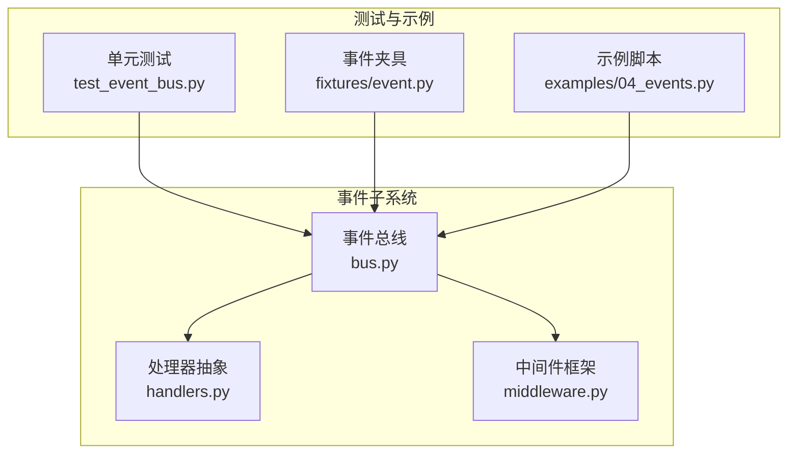
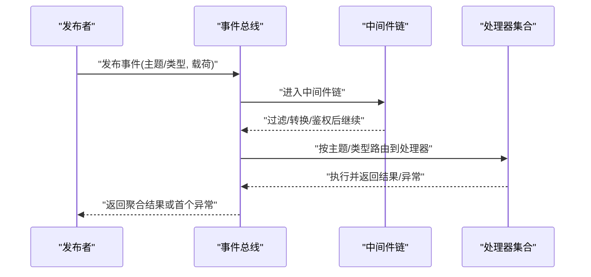
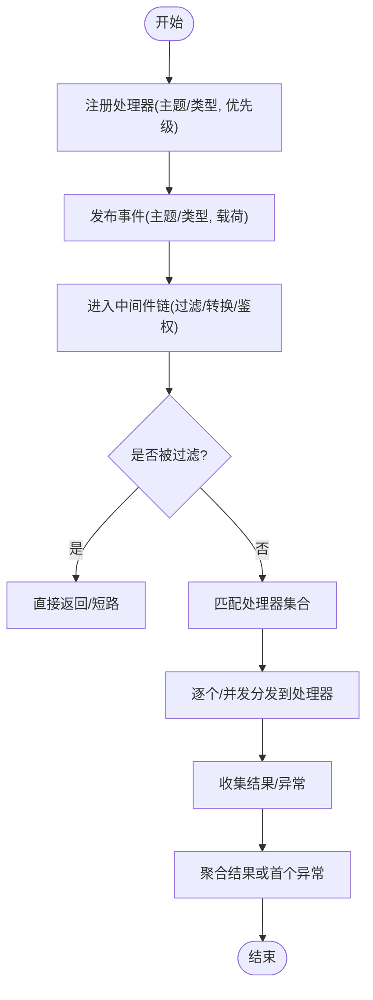
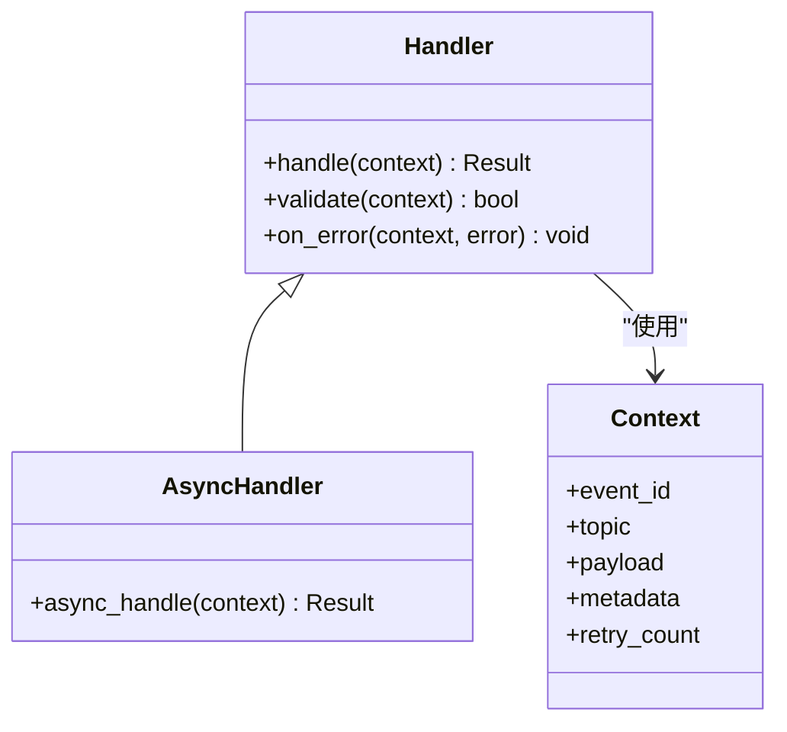
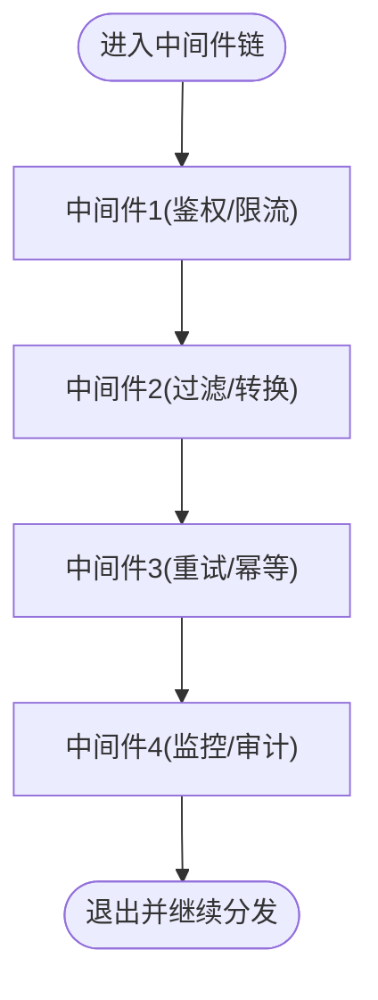
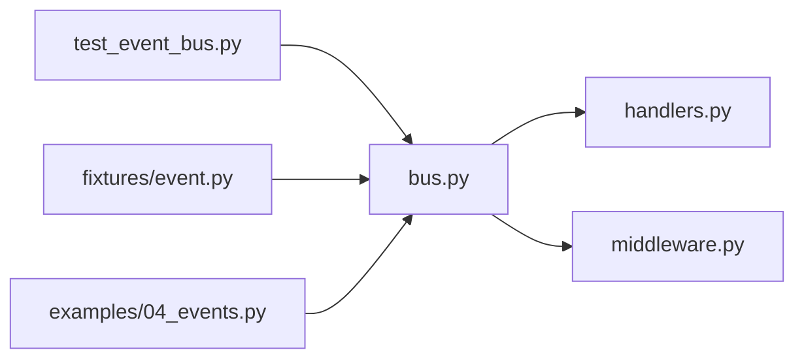

# 事件系统

<cite>
**本文引用的文件**   
- [src/neotask/event/bus.py](file://src/neotask/event/bus.py)
- [src/neotask/event/handlers.py](file://src/neotask/event/handlers.py)
- [src/neotask/event/middleware.py](file://src/neotask/event/middleware.py)
- [tests/unit/test_event_bus.py](file://tests/unit/test_event_bus.py)
- [tests/fixtures/event.py](file://tests/fixtures/event.py)
- [examples/04_events.py](file://examples/04_events.py)
</cite>

## 目录
1. [简介](#简介)
2. [项目结构](#项目结构)
3. [核心组件](#核心组件)
4. [架构总览](#架构总览)
5. [详细组件分析](#详细组件分析)
6. [依赖关系分析](#依赖关系分析)
7. [性能考虑](#性能考虑)
8. [故障排查指南](#故障排查指南)
9. [结论](#结论)
10. [附录](#附录)

## 简介
本文件围绕事件系统的设计与实现，系统性阐述事件总线模式、消息传递机制、发布订阅模型、中间件处理链、处理器注册策略，以及过滤、聚合、持久化等高级特性。同时给出事件驱动架构的设计模式与最佳实践，并提供性能调优与故障处理方法，帮助读者在复杂系统中构建高可靠、可扩展的事件基础设施。

## 项目结构
事件系统位于 src/neotask/event 目录下，包含三个核心模块：
- bus.py：事件总线（EventBus）的实现，负责事件生命周期管理、分发调度、中间件编排、处理器注册与查找。
- handlers.py：处理器抽象与内置处理器类型，定义统一的处理接口与执行上下文。
- middleware.py：中间件框架，支持拦截、过滤、转换、重试、监控等横切逻辑。

测试与示例覆盖单元测试、夹具与使用示例，便于理解与验证行为。

图表来源
- [src/neotask/event/bus.py](file://src/neotask/event/bus.py)
- [src/neotask/event/handlers.py](file://src/neotask/event/handlers.py)
- [src/neotask/event/middleware.py](file://src/neotask/event/middleware.py)
- [tests/unit/test_event_bus.py](file://tests/unit/test_event_bus.py)
- [tests/fixtures/event.py](file://tests/fixtures/event.py)
- [examples/04_events.py](file://examples/04_events.py)

章节来源
- [src/neotask/event/bus.py](file://src/neotask/event/bus.py)
- [src/neotask/event/handlers.py](file://src/neotask/event/handlers.py)
- [src/neotask/event/middleware.py](file://src/neotask/event/middleware.py)
- [tests/unit/test_event_bus.py](file://tests/unit/test_event_bus.py)
- [tests/fixtures/event.py](file://tests/fixtures/event.py)
- [examples/04_events.py](file://examples/04_events.py)

## 核心组件
- 事件总线（EventBus）
  - 职责：维护处理器注册表、中间件链、事件路由与分发；提供发布/订阅 API；协调异步执行与错误传播。
  - 关键能力：按主题或类型路由、优先级排序、批量发布、超时控制、失败重试、结果聚合。
- 处理器（Handlers）
  - 职责：定义统一的处理器接口与执行上下文；支持同步/异步处理器；可携带元数据与状态。
  - 关键能力：参数校验、上下文注入、异常封装、返回值标准化。
- 中间件（Middleware）
  - 职责：在处理器前后插入横切逻辑；支持过滤、转换、日志、指标、限流、重试、幂等。
  - 关键能力：链式调用、短路返回、透传上下文、异常捕获与恢复。

章节来源
- [src/neotask/event/bus.py](file://src/neotask/event/bus.py)
- [src/neotask/event/handlers.py](file://src/neotask/event/handlers.py)
- [src/neotask/event/middleware.py](file://src/neotask/event/middleware.py)

## 架构总览
事件系统采用“总线 + 处理器 + 中间件”的解耦架构。发布者通过总线发布事件，总线根据主题/类型匹配处理器，并在中间件链中依次执行横切逻辑，最终将事件投递给匹配的处理器集合。

图表来源
- [src/neotask/event/bus.py](file://src/neotask/event/bus.py)
- [src/neotask/event/middleware.py](file://src/neotask/event/middleware.py)
- [src/neotask/event/handlers.py](file://src/neotask/event/handlers.py)

## 详细组件分析

### 事件总线（EventBus）
- 设计要点
  - 处理器注册表：支持按主题/类型索引，允许同一主题多个处理器，支持优先级与顺序控制。
  - 中间件编排：在分发前/后插入横切逻辑，支持短路、透传上下文、异常包装。
  - 分发策略：同步/异步两种模式；支持批量发布与结果聚合；支持超时与取消。
  - 容错与重试：对单个处理器失败进行隔离，支持重试策略与死信队列集成点。
- 典型流程
  - 注册处理器：指定主题/类型、处理器实例、优先级、可选过滤器。
  - 发布事件：构造事件对象，进入中间件链，路由到处理器集合，收集结果。
  - 错误处理：捕获异常，记录日志，触发重试或降级策略，向上抛出或返回聚合错误。

图表来源
- [src/neotask/event/bus.py](file://src/neotask/event/bus.py)

章节来源
- [src/neotask/event/bus.py](file://src/neotask/event/bus.py)

### 处理器（Handlers）
- 设计要点
  - 统一接口：定义 handle(event_context) 方法，支持同步与异步实现。
  - 上下文对象：包含事件元数据、载荷、追踪ID、时间戳、重试次数等。
  - 返回值规范：成功返回标准化结果，失败抛出领域异常以便总线统一处理。
- 扩展点
  - 自定义处理器基类：提供通用校验、日志、指标埋点。
  - 组合处理器：通过装饰器或工厂组装多个小处理器形成复合处理链。

图表来源
- [src/neotask/event/handlers.py](file://src/neotask/event/handlers.py)

章节来源
- [src/neotask/event/handlers.py](file://src/neotask/event/handlers.py)

### 中间件（Middleware）
- 设计要点
  - 链式调用：每个中间件接收上下文并决定是否继续、修改上下文或提前返回。
  - 横切关注点：鉴权、限流、过滤、转换、日志、指标、重试、幂等、审计。
  - 错误隔离：中间件捕获异常并转换为标准错误，避免污染后续中间件。
- 常见中间件
  - 过滤中间件：基于主题/类型/负载字段快速丢弃不匹配事件。
  - 转换中间件：规范化载荷、补充元数据、脱敏敏感信息。
  - 重试中间件：对瞬时错误进行指数退避重试。
  - 监控中间件：采集耗时、成功率、错误码分布。

图表来源
- [src/neotask/event/middleware.py](file://src/neotask/event/middleware.py)

章节来源
- [src/neotask/event/middleware.py](file://src/neotask/event/middleware.py)

### 事件过滤、聚合、持久化
- 过滤
  - 在中间件层实现高效过滤，减少无效处理器调用，降低系统开销。
  - 支持基于主题、类型、负载字段的多条件过滤。
- 聚合
  - 总线层对多个处理器结果进行聚合，支持全部成功才返回、首个失败即返回、部分成功统计等策略。
- 持久化
  - 通过中间件或处理器将事件落盘（如写入存储后端），保证可追溯与回放能力。
  - 建议结合唯一事件ID与幂等键，避免重复消费导致副作用。

章节来源
- [src/neotask/event/middleware.py](file://src/neotask/event/middleware.py)
- [src/neotask/event/bus.py](file://src/neotask/event/bus.py)

### 处理器注册与路由
- 注册
  - 支持按主题/类型注册处理器，可设置优先级与可选过滤器。
  - 支持动态注册/注销，便于热更新与插件化。
- 路由
  - 精确匹配与通配符匹配并存；同主题多处理器按优先级排序。
  - 批量发布时复用路由结果，减少重复计算。

章节来源
- [src/neotask/event/bus.py](file://src/neotask/event/bus.py)

### 异步与并发
- 异步分发
  - 支持协程处理器与线程池/进程池执行器，提升吞吐。
- 并发控制
  - 限制最大并发数、队列长度、超时时间，防止雪崩。
- 背压与限流
  - 在中间件层实现令牌桶/漏桶限流，保护下游资源。

章节来源
- [src/neotask/event/bus.py](file://src/neotask/event/bus.py)

## 依赖关系分析
事件子系统内部依赖清晰：总线依赖处理器抽象与中间件框架；测试与示例依赖总线以验证行为。

图表来源
- [src/neotask/event/bus.py](file://src/neotask/event/bus.py)
- [src/neotask/event/handlers.py](file://src/neotask/event/handlers.py)
- [src/neotask/event/middleware.py](file://src/neotask/event/middleware.py)
- [tests/unit/test_event_bus.py](file://tests/unit/test_event_bus.py)
- [tests/fixtures/event.py](file://tests/fixtures/event.py)
- [examples/04_events.py](file://examples/04_events.py)

章节来源
- [src/neotask/event/bus.py](file://src/neotask/event/bus.py)
- [src/neotask/event/handlers.py](file://src/neotask/event/handlers.py)
- [src/neotask/event/middleware.py](file://src/neotask/event/middleware.py)
- [tests/unit/test_event_bus.py](file://tests/unit/test_event_bus.py)
- [tests/fixtures/event.py](file://tests/fixtures/event.py)
- [examples/04_events.py](file://examples/04_events.py)

## 性能考虑
- 路由优化
  - 缓存主题到处理器列表的映射，避免每次发布都重新计算。
  - 使用基数树或哈希索引加速通配符匹配。
- 中间件裁剪
  - 仅启用必要中间件，减少链长；将昂贵操作下沉到异步任务。
- 批处理与合并
  - 批量发布合并多次 I/O；对相同主题的处理器结果进行合并。
- 并发与背压
  - 合理设置并发度与队列容量；引入令牌桶限流与超时熔断。
- 序列化与传输
  - 选择轻量级序列化格式；避免大载荷，必要时分片或外置存储。
- 监控与观测
  - 采集关键指标：发布延迟、分发耗时、处理器成功率、错误码分布、中间件耗时。

[本节为通用性能指导，无需特定文件引用]

## 故障排查指南
- 常见问题
  - 处理器未注册或主题不匹配：检查注册API与主题命名约定。
  - 中间件短路：确认过滤条件与转换逻辑是否正确。
  - 超时与重试风暴：调整超时阈值与重试策略，增加退避与上限。
  - 内存泄漏：确保事件上下文及时释放，避免强引用循环。
- 定位手段
  - 开启详细日志与追踪ID，关联一次发布的完整链路。
  - 使用监控指标定位瓶颈（中间件、处理器、I/O）。
  - 复现最小用例，逐步禁用中间件缩小范围。
- 恢复策略
  - 死信队列暂存失败事件，人工介入后重放。
  - 灰度发布新处理器，观察错误率与延迟后再全量切换。

章节来源
- [tests/unit/test_event_bus.py](file://tests/unit/test_event_bus.py)
- [tests/fixtures/event.py](file://tests/fixtures/event.py)

## 结论
事件系统通过“总线 + 处理器 + 中间件”的解耦设计，实现了高内聚、低耦合的消息传递机制。借助过滤、聚合、持久化与异步并发控制，可在复杂业务场景中提供稳定、可扩展的事件基础设施。遵循本文的最佳实践与调优建议，可有效提升系统的可靠性与性能。

[本节为总结性内容，无需特定文件引用]

## 附录
- 使用示例路径
  - 示例脚本：examples/04_events.py
  - 单元测试：tests/unit/test_event_bus.py
  - 事件夹具：tests/fixtures/event.py

章节来源
- [examples/04_events.py](file://examples/04_events.py)
- [tests/unit/test_event_bus.py](file://tests/unit/test_event_bus.py)
- [tests/fixtures/event.py](file://tests/fixtures/event.py)