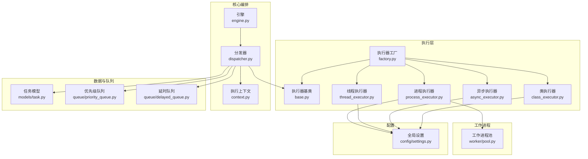
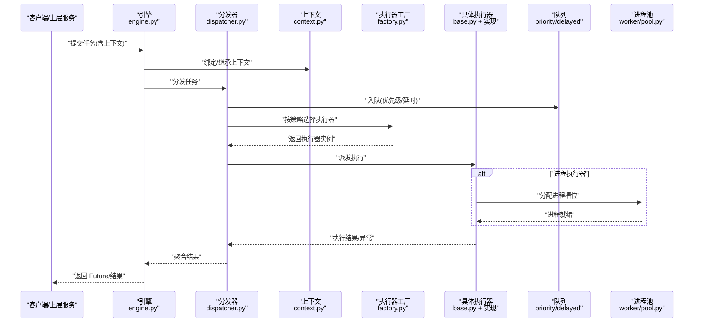
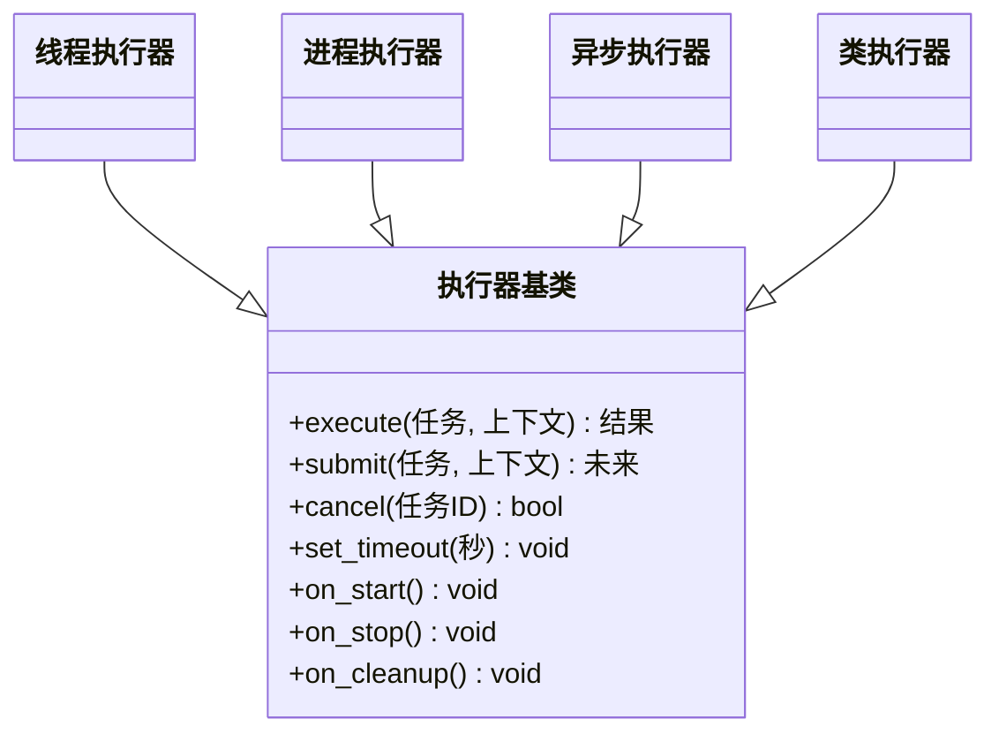
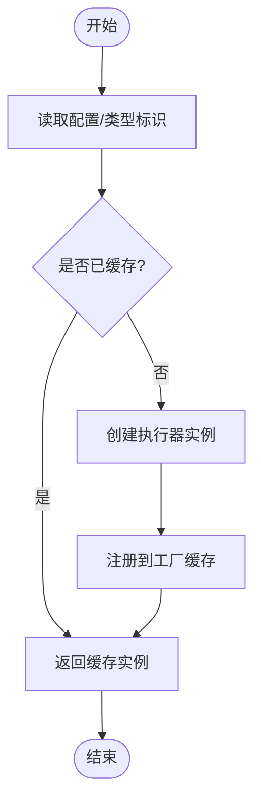
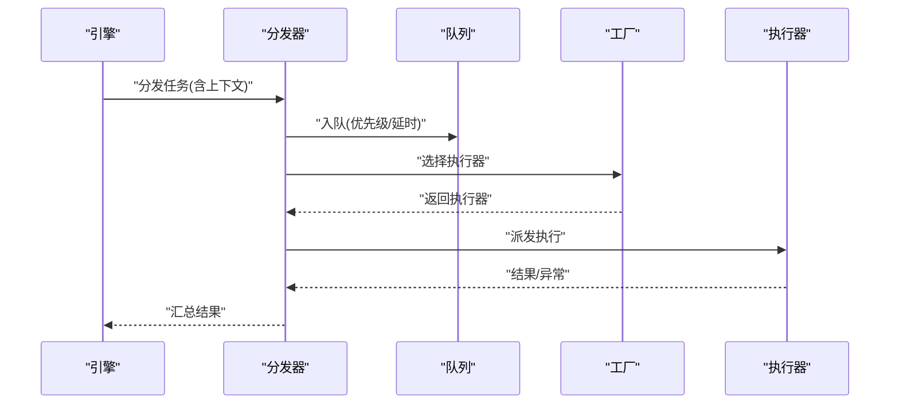
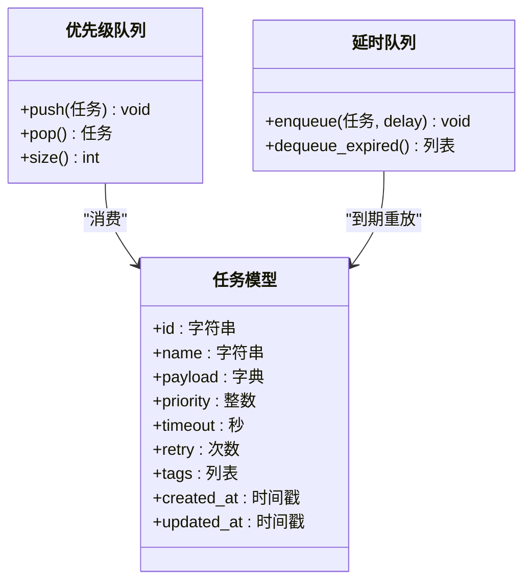
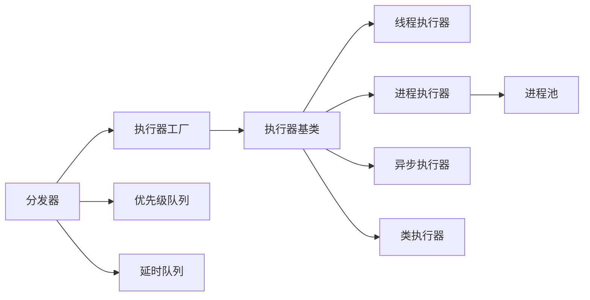

# 任务执行引擎

<cite>
**本文引用的文件**   
- [src/neotask/executor/base.py](file://src/neotask/executor/base.py)
- [src/neotask/executor/thread_executor.py](file://src/neotask/executor/thread_executor.py)
- [src/neotask/executor/process_executor.py](file://src/neotask/executor/process_executor.py)
- [src/neotask/executor/async_executor.py](file://src/neotask/executor/async_executor.py)
- [src/neotask/executor/class_executor.py](file://src/neotask/executor/class_executor.py)
- [src/neotask/executor/factory.py](file://src/neotask/executor/factory.py)
- [src/neotask/core/engine.py](file://src/neotask/core/engine.py)
- [src/neotask/core/context.py](file://src/neotask/core/context.py)
- [src/neotask/core/dispatcher.py](file://src/neotask/core/dispatcher.py)
- [src/neotask/models/task.py](file://src/neotask/models/task.py)
- [src/neotask/queue/priority_queue.py](file://src/neotask/queue/priority_queue.py)
- [src/neotask/queue/delayed_queue.py](file://src/neotask/queue/delayed_queue.py)
- [src/neotask/worker/pool.py](file://src/neotask/worker/pool.py)
- [src/neotask/config/settings.py](file://src/neotask/config/settings.py)
- [examples/01_simple.py](file://examples/01_simple.py)
- [examples/02_context_manager.py](file://examples/02_context_manager.py)
- [examples/03_priority.py](file://examples/03_priority.py)
- [tests/unit/test_executors.py](file://tests/unit/test_executors.py)
</cite>

## 目录
1. [引言](#引言)
2. [项目结构](#项目结构)
3. [核心组件](#核心组件)
4. [架构总览](#架构总览)
5. [详细组件分析](#详细组件分析)
6. [依赖关系分析](#依赖关系分析)
7. [性能考量](#性能考量)
8. [故障排查指南](#故障排查指南)
9. [结论](#结论)
10. [附录](#附录)

## 引言
本文件围绕“任务执行引擎”的设计与实现进行深入解析，重点覆盖以下方面：
- 执行器类型：线程执行器、进程执行器、异步执行器、类执行器的特点与适用场景
- 工厂模式：执行器工厂的实现与自定义执行器开发方法
- 资源管理：线程池与进程池的配置优化策略
- 关键机制：执行上下文传递、资源隔离、超时控制
- 实践指南：执行器选择与性能调优建议

## 项目结构
任务执行引擎位于 src/neotask 下，执行相关代码集中在 executor 子包，并与 core、models、queue、worker、config 等模块协作。整体采用分层与模块化设计：
- 执行层：executor 提供多种执行器实现与工厂
- 调度与编排：core.engine、core.dispatcher、core.context 负责任务编排、分发与上下文
- 数据模型：models.task 定义任务结构与生命周期
- 队列与延迟：queue.priority_queue、queue.delayed_queue 提供优先级与延时能力
- 工作进程：worker.pool 提供进程级池化能力（与进程执行器配合）
- 配置：config.settings 提供全局配置项

图示来源
- [src/neotask/executor/base.py](file://src/neotask/executor/base.py)
- [src/neotask/executor/thread_executor.py](file://src/neotask/executor/thread_executor.py)
- [src/neotask/executor/process_executor.py](file://src/neotask/executor/process_executor.py)
- [src/neotask/executor/async_executor.py](file://src/neotask/executor/async_executor.py)
- [src/neotask/executor/class_executor.py](file://src/neotask/executor/class_executor.py)
- [src/neotask/executor/factory.py](file://src/neotask/executor/factory.py)
- [src/neotask/core/engine.py](file://src/neotask/core/engine.py)
- [src/neotask/core/dispatcher.py](file://src/neotask/core/dispatcher.py)
- [src/neotask/core/context.py](file://src/neotask/core/context.py)
- [src/neotask/models/task.py](file://src/neotask/models/task.py)
- [src/neotask/queue/priority_queue.py](file://src/neotask/queue/priority_queue.py)
- [src/neotask/queue/delayed_queue.py](file://src/neotask/queue/delayed_queue.py)
- [src/neotask/worker/pool.py](file://src/neotask/worker/pool.py)
- [src/neotask/config/settings.py](file://src/neotask/config/settings.py)

章节来源
- [src/neotask/executor/base.py](file://src/neotask/executor/base.py)
- [src/neotask/executor/factory.py](file://src/neotask/executor/factory.py)
- [src/neotask/core/engine.py](file://src/neotask/core/engine.py)
- [src/neotask/core/dispatcher.py](file://src/neotask/core/dispatcher.py)
- [src/neotask/core/context.py](file://src/neotask/core/context.py)
- [src/neotask/models/task.py](file://src/neotask/models/task.py)
- [src/neotask/queue/priority_queue.py](file://src/neotask/queue/priority_queue.py)
- [src/neotask/queue/delayed_queue.py](file://src/neotask/queue/delayed_queue.py)
- [src/neotask/worker/pool.py](file://src/neotask/worker/pool.py)
- [src/neotask/config/settings.py](file://src/neotask/config/settings.py)

## 核心组件
- 执行器基类：定义统一的执行接口、生命周期钩子、结果封装与异常处理约定，为所有具体执行器提供一致契约。
- 线程执行器：基于线程并发执行任务，适合 I/O 密集型或轻量 CPU 任务；通过线程池控制并发度与资源占用。
- 进程执行器：在独立进程中执行任务，具备强资源隔离与崩溃隔离能力，适合 CPU 密集或需要隔离的负载；结合 worker.pool 进行进程池管理。
- 异步执行器：基于事件循环与协程执行，适合高并发 I/O 场景；可与异步队列和存储集成。
- 类执行器：以类实例方式组织任务逻辑，便于状态管理与复用；适用于复杂业务编排与可测试性要求高的场景。
- 执行器工厂：根据配置或运行时参数创建并缓存执行器实例，支持扩展新执行器类型。
- 引擎与分发器：协调任务入队、调度、执行与结果回收；分发器将任务路由到合适的执行器。
- 执行上下文：跨调用边界传递请求/任务元信息，保证日志追踪、审计与链路一致性。
- 任务模型与队列：统一任务描述、优先级与延时能力，支撑不同执行器的消费与调度。

章节来源
- [src/neotask/executor/base.py](file://src/neotask/executor/base.py)
- [src/neotask/executor/thread_executor.py](file://src/neotask/executor/thread_executor.py)
- [src/neotask/executor/process_executor.py](file://src/neotask/executor/process_executor.py)
- [src/neotask/executor/async_executor.py](file://src/neotask/executor/async_executor.py)
- [src/neotask/executor/class_executor.py](file://src/neotask/executor/class_executor.py)
- [src/neotask/executor/factory.py](file://src/neotask/executor/factory.py)
- [src/neotask/core/engine.py](file://src/neotask/core/engine.py)
- [src/neotask/core/dispatcher.py](file://src/neotask/core/dispatcher.py)
- [src/neotask/core/context.py](file://src/neotask/core/context.py)
- [src/neotask/models/task.py](file://src/neotask/models/task.py)
- [src/neotask/queue/priority_queue.py](file://src/neotask/queue/priority_queue.py)
- [src/neotask/queue/delayed_queue.py](file://src/neotask/queue/delayed_queue.py)

## 架构总览
下图展示了从任务提交到执行完成的关键路径，包括上下文注入、分发器选择执行器、执行器内部资源管理与结果回传。

图示来源
- [src/neotask/core/engine.py](file://src/neotask/core/engine.py)
- [src/neotask/core/dispatcher.py](file://src/neotask/core/dispatcher.py)
- [src/neotask/core/context.py](file://src/neotask/core/context.py)
- [src/neotask/executor/factory.py](file://src/neotask/executor/factory.py)
- [src/neotask/executor/base.py](file://src/neotask/executor/base.py)
- [src/neotask/queue/priority_queue.py](file://src/neotask/queue/priority_queue.py)
- [src/neotask/queue/delayed_queue.py](file://src/neotask/queue/delayed_queue.py)
- [src/neotask/worker/pool.py](file://src/neotask/worker/pool.py)

## 详细组件分析

### 执行器基类与统一契约
- 职责：定义 execute、submit、cancel、timeout 等通用接口；封装执行结果对象；提供生命周期钩子（启动、停止、清理）。
- 设计要点：
  - 抽象接口确保各执行器行为一致，便于工厂与分发器无差别调用
  - 结果对象包含成功值、异常、耗时、资源使用统计等
  - 超时与取消语义由基类统一约束，具体执行器按需实现
- 复杂度：接口调用 O(1)，结果封装与异常传播常数时间

图示来源
- [src/neotask/executor/base.py](file://src/neotask/executor/base.py)
- [src/neotask/executor/thread_executor.py](file://src/neotask/executor/thread_executor.py)
- [src/neotask/executor/process_executor.py](file://src/neotask/executor/process_executor.py)
- [src/neotask/executor/async_executor.py](file://src/neotask/executor/async_executor.py)
- [src/neotask/executor/class_executor.py](file://src/neotask/executor/class_executor.py)

章节来源
- [src/neotask/executor/base.py](file://src/neotask/executor/base.py)

### 线程执行器
- 特点：
  - 基于线程池并发执行，开销小、切换快
  - 适合 I/O 密集型任务（网络、磁盘）与轻量计算
  - 受 GIL 影响，CPU 密集场景不推荐
- 关键配置：
  - 最大线程数、队列容量、拒绝策略、超时时间
- 适用场景：
  - 高并发短任务、批量 I/O 操作、微服务间轻调用

章节来源
- [src/neotask/executor/thread_executor.py](file://src/neotask/executor/thread_executor.py)
- [src/neotask/config/settings.py](file://src/neotask/config/settings.py)

### 进程执行器
- 特点：
  - 在独立进程中运行，具备强隔离性与崩溃自愈
  - 适合 CPU 密集、内存敏感或需沙箱隔离的任务
  - 进程间通信带来额外开销，吞吐低于线程
- 关键配置：
  - 进程池大小、进程重启策略、资源限制、超时与心跳
- 适用场景：
  - 重型计算、外部系统调用、不可信代码执行

章节来源
- [src/neotask/executor/process_executor.py](file://src/neotask/executor/process_executor.py)
- [src/neotask/worker/pool.py](file://src/neotask/worker/pool.py)
- [src/neotask/config/settings.py](file://src/neotask/config/settings.py)

### 异步执行器
- 特点：
  - 基于事件循环与协程，单线程高并发 I/O
  - 与异步存储、队列、HTTP 客户端天然契合
- 关键配置：
  - 事件循环策略、并发协程上限、背压与限流
- 适用场景：
  - 大量并发 I/O、网关/代理、实时数据处理

章节来源
- [src/neotask/executor/async_executor.py](file://src/neotask/executor/async_executor.py)
- [src/neotask/config/settings.py](file://src/neotask/config/settings.py)

### 类执行器
- 特点：
  - 以类实例承载任务逻辑，便于状态维护、依赖注入与测试
  - 适合复杂业务流程编排与多阶段任务
- 关键配置：
  - 类加载策略、实例缓存、初始化参数
- 适用场景：
  - 领域驱动的业务任务、需要丰富上下文与副作用控制的场景

章节来源
- [src/neotask/executor/class_executor.py](file://src/neotask/executor/class_executor.py)
- [src/neotask/config/settings.py](file://src/neotask/config/settings.py)

### 执行器工厂与自定义执行器
- 工厂职责：
  - 根据类型标识或配置创建对应执行器实例
  - 支持实例缓存与生命周期管理
  - 提供注册扩展点，允许用户自定义执行器类型
- 自定义步骤：
  - 继承执行器基类，实现 execute/submit/cancel 等接口
  - 在工厂中注册新类型映射
  - 通过配置启用新执行器
- 复杂度：
  - 工厂查找 O(1)，实例创建与缓存命中常数时间

图示来源
- [src/neotask/executor/factory.py](file://src/neotask/executor/factory.py)
- [src/neotask/executor/base.py](file://src/neotask/executor/base.py)

章节来源
- [src/neotask/executor/factory.py](file://src/neotask/executor/factory.py)

### 引擎与分发器
- 引擎：
  - 负责任务生命周期管理、上下文注入、结果收集与监控上报
- 分发器：
  - 依据任务属性（类型、优先级、标签）选择执行器
  - 与队列协作，支持优先级与延时调度
- 上下文：
  - 跨调用边界传递 trace_id、租户、权限等元信息
  - 支持拦截器/中间件对上下文进行增强

图示来源
- [src/neotask/core/engine.py](file://src/neotask/core/engine.py)
- [src/neotask/core/dispatcher.py](file://src/neotask/core/dispatcher.py)
- [src/neotask/core/context.py](file://src/neotask/core/context.py)
- [src/neotask/executor/factory.py](file://src/neotask/executor/factory.py)
- [src/neotask/queue/priority_queue.py](file://src/neotask/queue/priority_queue.py)
- [src/neotask/queue/delayed_queue.py](file://src/neotask/queue/delayed_queue.py)

章节来源
- [src/neotask/core/engine.py](file://src/neotask/core/engine.py)
- [src/neotask/core/dispatcher.py](file://src/neotask/core/dispatcher.py)
- [src/neotask/core/context.py](file://src/neotask/core/context.py)

### 任务模型与队列
- 任务模型：
  - 统一任务描述、重试策略、超时、优先级、标签与回调
- 优先级队列：
  - 基于堆结构的优先出队，O(log n) 插入/弹出
- 延时队列：
  - 支持到期重放与延迟投递，常用于退避与定时任务

图示来源
- [src/neotask/models/task.py](file://src/neotask/models/task.py)
- [src/neotask/queue/priority_queue.py](file://src/neotask/queue/priority_queue.py)
- [src/neotask/queue/delayed_queue.py](file://src/neotask/queue/delayed_queue.py)

章节来源
- [src/neotask/models/task.py](file://src/neotask/models/task.py)
- [src/neotask/queue/priority_queue.py](file://src/neotask/queue/priority_queue.py)
- [src/neotask/queue/delayed_queue.py](file://src/neotask/queue/delayed_queue.py)

## 依赖关系分析
- 低耦合：执行器通过基类契约与工厂解耦，分发器仅依赖抽象接口
- 内聚性：每个执行器聚焦单一执行模型，配置与资源管理内聚于自身
- 外部依赖：
  - 线程执行器依赖标准库线程池
  - 进程执行器依赖进程池与 IPC
  - 异步执行器依赖事件循环与协程库
  - 队列与存储可能依赖 Redis/SQLite 等后端

图示来源
- [src/neotask/executor/base.py](file://src/neotask/executor/base.py)
- [src/neotask/executor/factory.py](file://src/neotask/executor/factory.py)
- [src/neotask/core/dispatcher.py](file://src/neotask/core/dispatcher.py)
- [src/neotask/queue/priority_queue.py](file://src/neotask/queue/priority_queue.py)
- [src/neotask/queue/delayed_queue.py](file://src/neotask/queue/delayed_queue.py)
- [src/neotask/worker/pool.py](file://src/neotask/worker/pool.py)

章节来源
- [src/neotask/executor/base.py](file://src/neotask/executor/base.py)
- [src/neotask/executor/factory.py](file://src/neotask/executor/factory.py)
- [src/neotask/core/dispatcher.py](file://src/neotask/core/dispatcher.py)
- [src/neotask/queue/priority_queue.py](file://src/neotask/queue/priority_queue.py)
- [src/neotask/queue/delayed_queue.py](file://src/neotask/queue/delayed_queue.py)
- [src/neotask/worker/pool.py](file://src/neotask/worker/pool.py)

## 性能考量
- 线程池优化：
  - 根据 I/O 比例与 CPU 核数调整最大线程数
  - 合理设置队列容量与拒绝策略，避免背压导致雪崩
  - 使用连接池与对象池减少频繁创建销毁开销
- 进程池优化：
  - 进程数不宜超过 CPU 核数，避免上下文切换过多
  - 控制单次任务内存峰值，防止 OOM
  - 启用健康检查与自动重启，提升稳定性
- 异步执行器优化：
  - 限制并发协程数量，避免事件循环阻塞
  - 使用零拷贝与缓冲策略降低序列化成本
- 队列与调度：
  - 优先级队列在高负载下注意堆操作开销
  - 延时队列需定期扫描过期任务，避免堆积
- 监控与指标：
  - 采集吞吐、延迟、错误率、资源利用率
  - 基于指标动态扩缩容与阈值告警

[本节为通用指导，无需列出具体文件来源]

## 故障排查指南
- 常见问题定位：
  - 任务未执行：检查队列积压、执行器实例是否可用、工厂注册是否正确
  - 超时频繁：评估任务耗时分布、调整超时阈值与重试策略
  - 资源泄漏：确认执行器 on_cleanup 钩子是否释放句柄/连接
  - 进程崩溃：查看进程池健康检查与重启日志
- 调试建议：
  - 开启详细日志与链路追踪（trace_id）
  - 使用单元测试与基准测试复现问题
  - 针对热点路径添加埋点与采样

章节来源
- [tests/unit/test_executors.py](file://tests/unit/test_executors.py)

## 结论
本执行引擎通过统一的执行器契约与工厂模式，实现了线程、进程、异步与类执行器的灵活组合；借助上下文传递、优先级与延时队列、以及进程池与线程池的资源管理，满足多样化任务场景。在生产环境中，应结合业务特征选择合适的执行器与参数，并通过监控与压测持续优化。

[本节为总结性内容，无需列出具体文件来源]

## 附录

### 快速上手示例
- 简单任务提交与执行
- 上下文管理器用法
- 优先级任务演示

章节来源
- [examples/01_simple.py](file://examples/01_simple.py)
- [examples/02_context_manager.py](file://examples/02_context_manager.py)
- [examples/03_priority.py](file://examples/03_priority.py)