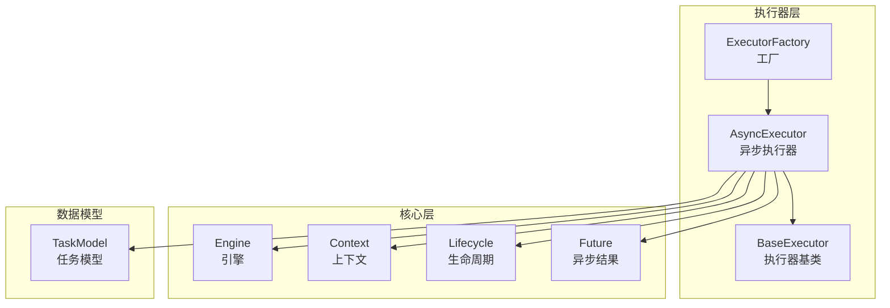
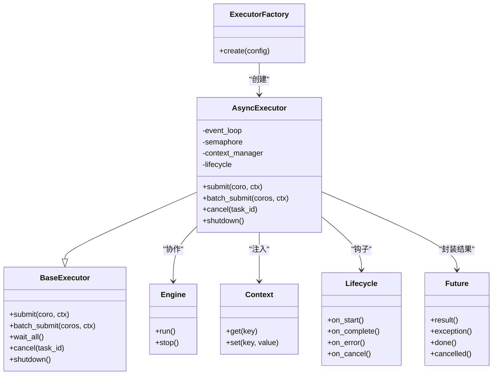
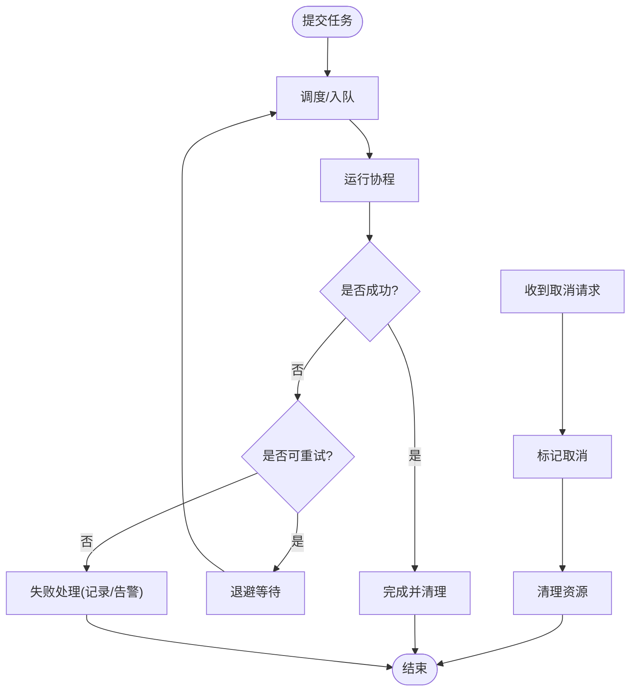
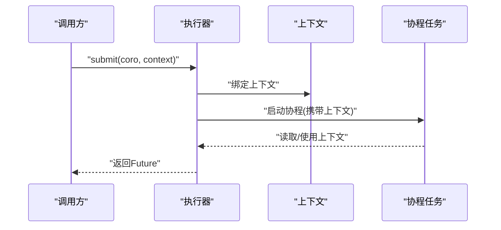
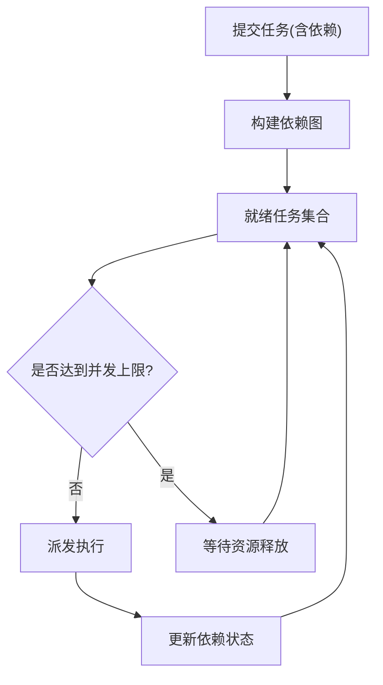
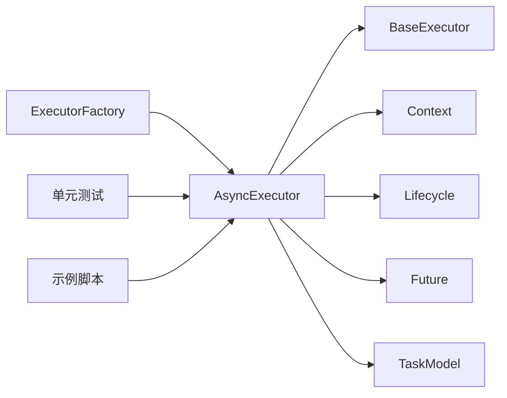

# 异步执行器

<cite>
**本文引用的文件**   
- [src/neotask/executor/async_executor.py](file://src/neotask/executor/async_executor.py)
- [src/neotask/executor/base.py](file://src/neotask/executor/base.py)
- [src/neotask/executor/factory.py](file://src/neotask/executor/factory.py)
- [src/neotask/core/engine.py](file://src/neotask/core/engine.py)
- [src/neotask/core/context.py](file://src/neotask/core/context.py)
- [src/neotask/core/lifecycle.py](file://src/neotask/core/lifecycle.py)
- [src/neotask/core/future.py](file://src/neotask/core/future.py)
- [src/neotask/models/task.py](file://src/neotask/models/task.py)
- [examples/09_retry_and_cancel.py](file://examples/09_retry_and_cancel.py)
- [examples/07_batch.py](file://examples/07_batch.py)
- [tests/unit/test_executors.py](file://tests/unit/test_executors.py)
</cite>

## 目录
1. [简介](#简介)
2. [项目结构](#项目结构)
3. [核心组件](#核心组件)
4. [架构总览](#架构总览)
5. [详细组件分析](#详细组件分析)
6. [依赖关系分析](#依赖关系分析)
7. [性能考虑](#性能考虑)
8. [故障排查指南](#故障排查指南)
9. [结论](#结论)
10. [附录](#附录)

## 简介
本技术文档聚焦于基于 asyncio 的异步执行器实现，围绕事件循环集成、协程调度与异步 I/O 优化展开，系统阐述任务生命周期管理、异常传播与取消机制、上下文传递、任务依赖管理与并发控制策略。同时覆盖异步资源管理、连接池复用与内存优化实践，并提供与同步代码混合使用的模式与注意事项，以及性能调优与常见陷阱规避建议。

## 项目结构
本项目采用分层与模块化组织方式，执行器相关能力集中在 executor 子包中，并通过 core 层提供引擎、上下文、生命周期与 Future 抽象；models 定义任务模型；examples 提供使用示例；tests 覆盖单元与集成测试。



图表来源
- [src/neotask/executor/async_executor.py](file://src/neotask/executor/async_executor.py)
- [src/neotask/executor/base.py](file://src/neotask/executor/base.py)
- [src/neotask/executor/factory.py](file://src/neotask/executor/factory.py)
- [src/neotask/core/engine.py](file://src/neotask/core/engine.py)
- [src/neotask/core/context.py](file://src/neotask/core/context.py)
- [src/neotask/core/lifecycle.py](file://src/neotask/core/lifecycle.py)
- [src/neotask/core/future.py](file://src/neotask/core/future.py)
- [src/neotask/models/task.py](file://src/neotask/models/task.py)

章节来源
- [src/neotask/executor/async_executor.py](file://src/neotask/executor/async_executor.py)
- [src/neotask/executor/base.py](file://src/neotask/executor/base.py)
- [src/neotask/executor/factory.py](file://src/neotask/executor/factory.py)
- [src/neotask/core/engine.py](file://src/neotask/core/engine.py)
- [src/neotask/core/context.py](file://src/neotask/core/context.py)
- [src/neotask/core/lifecycle.py](file://src/neotask/core/lifecycle.py)
- [src/neotask/core/future.py](file://src/neotask/core/future.py)
- [src/neotask/models/task.py](file://src/neotask/models/task.py)

## 核心组件
- AsyncExecutor：基于 asyncio 的异步执行器，负责将协程任务提交到事件循环，管理并发度、优先级、重试与取消等特性。
- BaseExecutor：执行器抽象基类，定义统一接口（提交、批量提交、等待、取消、关闭等），便于扩展线程/进程执行器。
- ExecutorFactory：根据配置或运行时条件创建合适的执行器实例。
- Engine：协调执行器、队列、存储、监控等子系统，驱动整体任务编排。
- Context：跨协程边界传递执行上下文（如追踪 ID、租户信息、限流配额等）。
- Lifecycle：统一管理执行器及关联资源的启动、运行、停止与清理。
- Future：封装异步结果与状态，支持回调、异常传播与超时控制。
- TaskModel：描述任务的元数据、参数、调度策略与执行约束。

章节来源
- [src/neotask/executor/async_executor.py](file://src/neotask/executor/async_executor.py)
- [src/neotask/executor/base.py](file://src/neotask/executor/base.py)
- [src/neotask/executor/factory.py](file://src/neotask/executor/factory.py)
- [src/neotask/core/engine.py](file://src/neotask/core/engine.py)
- [src/neotask/core/context.py](file://src/neotask/core/context.py)
- [src/neotask/core/lifecycle.py](file://src/neotask/core/lifecycle.py)
- [src/neotask/core/future.py](file://src/neotask/core/future.py)
- [src/neotask/models/task.py](file://src/neotask/models/task.py)

## 架构总览
下图展示了异步执行器在整体系统中的位置与交互关系：上层通过工厂获取执行器，执行器基于事件循环调度协程，结合上下文与生命周期进行资源管理，并通过 Future 暴露异步结果。

```mermaid
sequenceDiagram
participant App as "应用"
participant Factory as "执行器工厂"
participant Exec as "异步执行器"
participant Loop as "事件循环"
participant Ctx as "上下文"
participant Life as "生命周期"
participant Fut as "Future"
App->>Factory : "创建执行器(配置)"
Factory-->>App : "返回执行器实例"
App->>Exec : "提交协程任务(含上下文)"
Exec->>Ctx : "绑定/继承上下文"
Exec->>Life : "记录任务开始/结束"
Exec->>Loop : "schedule/coroutine"
Loop-->>Exec : "任务完成/异常/取消"
Exec->>Fut : "设置结果/异常/状态"
Exec-->>App : "返回Future供调用方await"
```

图表来源
- [src/neotask/executor/factory.py](file://src/neotask/executor/factory.py)
- [src/neotask/executor/async_executor.py](file://src/neotask/executor/async_executor.py)
- [src/neotask/core/context.py](file://src/neotask/core/context.py)
- [src/neotask/core/lifecycle.py](file://src/neotask/core/lifecycle.py)
- [src/neotask/core/future.py](file://src/neotask/core/future.py)

## 详细组件分析

### 异步执行器（AsyncExecutor）
- 事件循环集成：在构造或启动阶段绑定当前事件循环，确保所有协程在同一循环内调度，避免跨循环错误。
- 协程调度：提供 submit/schedule 方法，将协程包装为可跟踪的任务对象，并加入内部调度队列或直接提交至事件循环。
- 异步 I/O 优化：优先使用非阻塞 I/O API；对 CPU 密集任务建议交由线程/进程执行器；合理设置并发上限与批大小。
- 任务生命周期：从“入队/调度”到“运行/完成/失败/取消”，每个阶段由生命周期模块记录与上报。
- 异常传播：捕获协程异常并写入 Future，调用方可 await 获取；支持重试策略与退避。
- 取消机制：支持任务级取消与批量取消，底层通过 asyncio 的 cancel 语义实现，确保资源及时释放。
- 上下文传递：提交时携带上下文，执行器在协程启动前注入，保证链路追踪与权限校验一致性。
- 并发控制：通过信号量/令牌桶限制最大并发；支持优先级队列与公平调度。
- 资源管理：在执行器生命周期结束时关闭连接池、释放锁与清理临时资源。



图表来源
- [src/neotask/executor/base.py](file://src/neotask/executor/base.py)
- [src/neotask/executor/async_executor.py](file://src/neotask/executor/async_executor.py)
- [src/neotask/executor/factory.py](file://src/neotask/executor/factory.py)
- [src/neotask/core/engine.py](file://src/neotask/core/engine.py)
- [src/neotask/core/context.py](file://src/neotask/core/context.py)
- [src/neotask/core/lifecycle.py](file://src/neotask/core/lifecycle.py)
- [src/neotask/core/future.py](file://src/neotask/core/future.py)

章节来源
- [src/neotask/executor/async_executor.py](file://src/neotask/executor/async_executor.py)
- [src/neotask/executor/base.py](file://src/neotask/executor/base.py)
- [src/neotask/executor/factory.py](file://src/neotask/executor/factory.py)
- [src/neotask/core/engine.py](file://src/neotask/core/engine.py)
- [src/neotask/core/context.py](file://src/neotask/core/context.py)
- [src/neotask/core/lifecycle.py](file://src/neotask/core/lifecycle.py)
- [src/neotask/core/future.py](file://src/neotask/core/future.py)

### 任务生命周期与异常传播
- 生命周期阶段：初始化→调度→运行→完成/失败→清理。各阶段触发对应钩子，用于埋点、审计与告警。
- 异常传播：协程抛出的异常被捕获后写入 Future，调用方 await 时抛出；支持自定义异常类型与错误码。
- 重试与退避：可配置最大重试次数与退避策略（固定/指数/抖动），失败后重新入队或进入死信队列。
- 取消流程：调用方发起取消→标记任务→通知底层协程退出→清理资源→更新状态。



图表来源
- [src/neotask/core/lifecycle.py](file://src/neotask/core/lifecycle.py)
- [src/neotask/core/future.py](file://src/neotask/core/future.py)
- [examples/09_retry_and_cancel.py](file://examples/09_retry_and_cancel.py)

章节来源
- [src/neotask/core/lifecycle.py](file://src/neotask/core/lifecycle.py)
- [src/neotask/core/future.py](file://src/neotask/core/future.py)
- [examples/09_retry_and_cancel.py](file://examples/09_retry_and_cancel.py)

### 异步上下文传递
- 上下文作用域：在任务提交时绑定，随协程链传播，可用于追踪 ID、租户标识、限流配额、路由信息等。
- 隔离性：不同任务/批次的上下文相互隔离，避免交叉污染。
- 变更安全：在协程内部修改上下文需遵循只读或副本原则，防止副作用扩散。



图表来源
- [src/neotask/core/context.py](file://src/neotask/core/context.py)
- [src/neotask/executor/async_executor.py](file://src/neotask/executor/async_executor.py)

章节来源
- [src/neotask/core/context.py](file://src/neotask/core/context.py)
- [src/neotask/executor/async_executor.py](file://src/neotask/executor/async_executor.py)

### 任务依赖管理与并发控制
- 依赖管理：支持声明式依赖图（DAG），按拓扑顺序调度，避免竞态与重复执行。
- 并发控制：通过信号量/令牌桶限制并发度；支持优先级队列与公平调度；批量提交时控制批次大小与吞吐。
- 背压与限流：当下游资源紧张时，执行器可暂停入队或降低速率，保护系统稳定性。



图表来源
- [src/neotask/executor/async_executor.py](file://src/neotask/executor/async_executor.py)
- [src/neotask/models/task.py](file://src/neotask/models/task.py)

章节来源
- [src/neotask/executor/async_executor.py](file://src/neotask/executor/async_executor.py)
- [src/neotask/models/task.py](file://src/neotask/models/task.py)

### 异步资源管理与连接池复用
- 连接池：数据库/HTTP/消息队列等连接应复用，减少握手开销；在生命周期结束时统一关闭。
- 资源清理：确保异常路径下也能正确释放锁、句柄与缓冲区；避免悬挂连接导致泄漏。
- 内存优化：避免在协程间共享大对象；及时释放中间结果；使用生成器与流式处理降低峰值内存。

章节来源
- [src/neotask/core/lifecycle.py](file://src/neotask/core/lifecycle.py)
- [src/neotask/executor/async_executor.py](file://src/neotask/executor/async_executor.py)

### 与同步代码混合使用
- 混用模式：在同步入口中使用 run_in_executor 或 to_thread 将阻塞操作放入线程池；避免在事件循环中直接阻塞。
- 注意事项：不要在协程中调用阻塞 I/O；谨慎使用全局状态；确保取消能穿透到阻塞点。
- 最佳实践：尽量保持纯异步路径；仅在必要时桥接同步库；对同步调用增加超时与熔断。

章节来源
- [src/neotask/executor/async_executor.py](file://src/neotask/executor/async_executor.py)

## 依赖关系分析
执行器依赖核心层的上下文、生命周期与 Future，并通过工厂创建实例；任务模型提供统一的元数据结构；示例与测试验证关键行为。



图表来源
- [src/neotask/executor/factory.py](file://src/neotask/executor/factory.py)
- [src/neotask/executor/async_executor.py](file://src/neotask/executor/async_executor.py)
- [src/neotask/executor/base.py](file://src/neotask/executor/base.py)
- [src/neotask/core/context.py](file://src/neotask/core/context.py)
- [src/neotask/core/lifecycle.py](file://src/neotask/core/lifecycle.py)
- [src/neotask/core/future.py](file://src/neotask/core/future.py)
- [src/neotask/models/task.py](file://src/neotask/models/task.py)
- [tests/unit/test_executors.py](file://tests/unit/test_executors.py)
- [examples/07_batch.py](file://examples/07_batch.py)
- [examples/09_retry_and_cancel.py](file://examples/09_retry_and_cancel.py)

章节来源
- [src/neotask/executor/factory.py](file://src/neotask/executor/factory.py)
- [src/neotask/executor/async_executor.py](file://src/neotask/executor/async_executor.py)
- [src/neotask/executor/base.py](file://src/neotask/executor/base.py)
- [src/neotask/core/context.py](file://src/neotask/core/context.py)
- [src/neotask/core/lifecycle.py](file://src/neotask/core/lifecycle.py)
- [src/neotask/core/future.py](file://src/neotask/core/future.py)
- [src/neotask/models/task.py](file://src/neotask/models/task.py)
- [tests/unit/test_executors.py](file://tests/unit/test_executors.py)
- [examples/07_batch.py](file://examples/07_batch.py)
- [examples/09_retry_and_cancel.py](file://examples/09_retry_and_cancel.py)

## 性能考虑
- 事件循环选择：优先使用 uvloop 提升事件循环性能；合理设置 I/O 多路复用参数。
- 并发度调优：根据 CPU/IO 比例调整最大并发；CPU 密集型任务使用线程/进程执行器。
- 批处理与背压：批量提交时控制批次大小；当下游拥塞时实施背压，避免内存暴涨。
- 连接池复用：复用数据库/HTTP/消息队列连接；设置合理的池大小与空闲回收策略。
- 内存优化：避免持有不必要引用；使用弱引用与生成器；及时释放中间结果。
- 监控与观测：采集任务耗时、成功率、取消率、队列长度等指标，定位瓶颈。

[本节为通用指导，不直接分析具体文件]

## 故障排查指南
- 常见问题
  - 事件循环未运行：确认在正确的循环上下文中创建与提交任务。
  - 跨循环错误：避免在不同循环间传递 Future/任务对象。
  - 取消无效：检查协程是否在阻塞点无法响应取消；确保在关键路径检测取消标志。
  - 资源泄漏：确认生命周期关闭逻辑被执行；在异常路径也进行清理。
  - 死锁与饥饿：检查依赖图是否存在环；为高优先级任务预留资源。
- 诊断手段
  - 启用详细日志与埋点，观察任务状态转换。
  - 使用监控指标分析吞吐、延迟与错误分布。
  - 复现最小用例，逐步缩小问题范围。

章节来源
- [src/neotask/core/lifecycle.py](file://src/neotask/core/lifecycle.py)
- [src/neotask/core/future.py](file://src/neotask/core/future.py)
- [tests/unit/test_executors.py](file://tests/unit/test_executors.py)

## 结论
异步执行器以 asyncio 为核心，结合上下文、生命周期与 Future 抽象，提供了可扩展、可观测、可控制的异步任务执行能力。通过合理的并发控制、资源管理与异常处理策略，可在高并发场景下保持稳定与高效。建议在业务侧坚持纯异步设计，谨慎桥接同步代码，并结合监控持续优化。

[本节为总结性内容，不直接分析具体文件]

## 附录
- 参考示例
  - 重试与取消：[examples/09_retry_and_cancel.py](file://examples/09_retry_and_cancel.py)
  - 批量提交：[examples/07_batch.py](file://examples/07_batch.py)
- 单元测试
  - 执行器行为验证：[tests/unit/test_executors.py](file://tests/unit/test_executors.py)