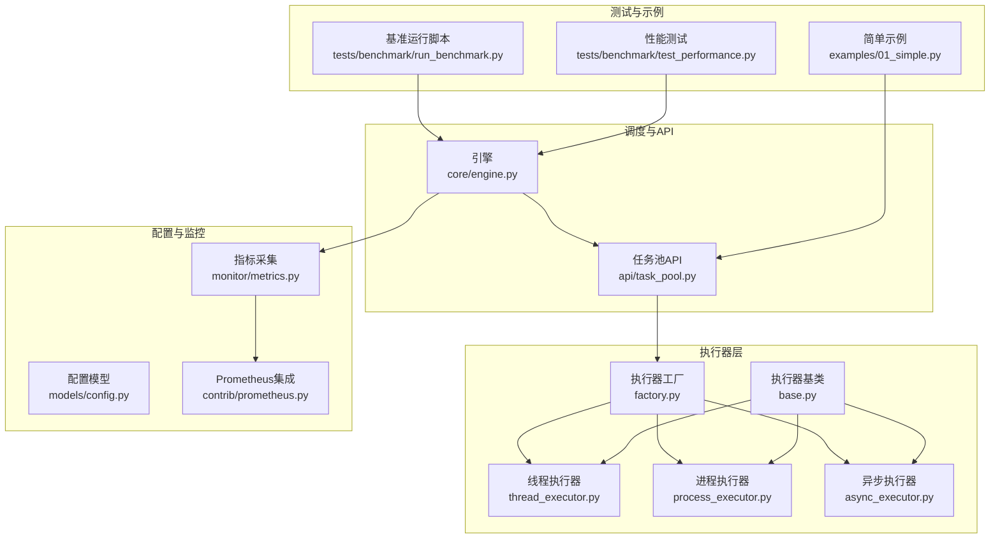
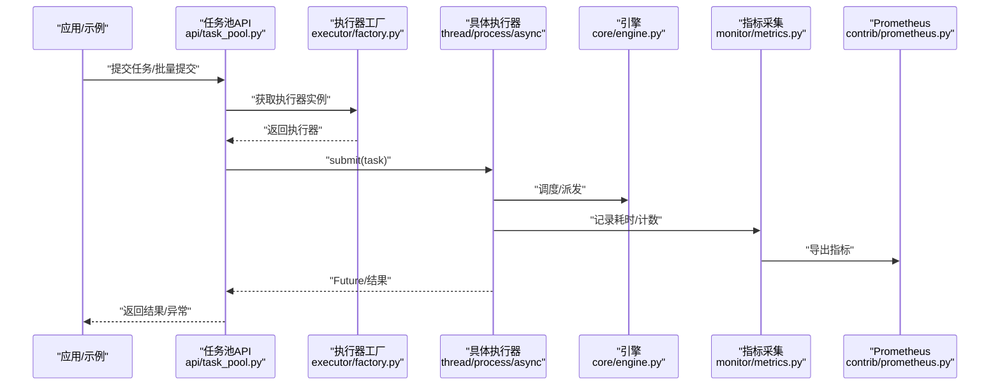
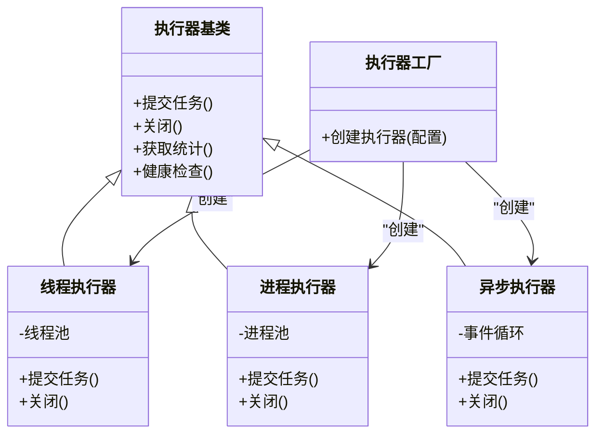
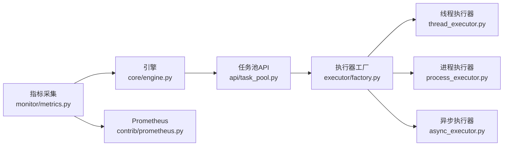

# 执行器优化与调优

<cite>
**本文引用的文件**   
- [src/neotask/executor/base.py](file://src/neotask/executor/base.py)
- [src/neotask/executor/thread_executor.py](file://src/neotask/executor/thread_executor.py)
- [src/neotask/executor/process_executor.py](file://src/neotask/executor/process_executor.py)
- [src/neotask/executor/async_executor.py](file://src/neotask/executor/async_executor.py)
- [src/neotask/executor/factory.py](file://src/neotask/executor/factory.py)
- [src/neotask/core/engine.py](file://src/neotask/core/engine.py)
- [src/neotask/api/task_pool.py](file://src/neotask/api/task_pool.py)
- [src/neotask/models/config.py](file://src/neotask/models/config.py)
- [src/neotask/monitor/metrics.py](file://src/neotask/monitor/metrics.py)
- [src/neotask/contrib/prometheus.py](file://src/neotask/contrib/prometheus.py)
- [tests/benchmark/run_benchmark.py](file://tests/benchmark/run_benchmark.py)
- [tests/benchmark/test_performance.py](file://tests/benchmark/test_performance.py)
- [tests/benchmark/test_performance_simple.py](file://tests/benchmark/test_performance_simple.py)
- [examples/01_simple.py](file://examples/01_simple.py)
</cite>

## 目录
1. [简介](#简介)
2. [项目结构](#项目结构)
3. [核心组件](#核心组件)
4. [架构总览](#架构总览)
5. [详细组件分析](#详细组件分析)
6. [依赖关系分析](#依赖关系分析)
7. [性能考虑](#性能考虑)
8. [故障排查指南](#故障排查指南)
9. [结论](#结论)
10. [附录](#附录)

## 简介
本指南聚焦于任务调度系统中的“执行器”子系统，围绕线程池、进程池与异步执行器的性能特征、适用场景与调优策略展开。文档提供：
- 不同执行器的选择决策树与评估标准
- 线程池大小、进程数量、异步并发度的配置方法
- CPU密集型与I/O密集型的优化策略
- 内存使用优化、垃圾回收与缓存策略
- 监控指标体系、瓶颈识别方法与容量规划建议
- 基准测试说明、对比分析与生产调优案例思路

## 项目结构
与执行器相关的代码主要位于以下模块：
- 执行器抽象与实现：base、thread、process、async、factory
- 引擎与API层：engine、task_pool
- 配置模型：models/config
- 监控与指标：monitor/metrics、contrib/prometheus
- 基准测试：tests/benchmark/*
- 示例用法：examples/*

图表来源
- [src/neotask/executor/base.py](file://src/neotask/executor/base.py)
- [src/neotask/executor/thread_executor.py](file://src/neotask/executor/thread_executor.py)
- [src/neotask/executor/process_executor.py](file://src/neotask/executor/process_executor.py)
- [src/neotask/executor/async_executor.py](file://src/neotask/executor/async_executor.py)
- [src/neotask/executor/factory.py](file://src/neotask/executor/factory.py)
- [src/neotask/core/engine.py](file://src/neotask/core/engine.py)
- [src/neotask/api/task_pool.py](file://src/neotask/api/task_pool.py)
- [src/neotask/models/config.py](file://src/neotask/models/config.py)
- [src/neotask/monitor/metrics.py](file://src/neotask/monitor/metrics.py)
- [src/neotask/contrib/prometheus.py](file://src/neotask/contrib/prometheus.py)
- [tests/benchmark/run_benchmark.py](file://tests/benchmark/run_benchmark.py)
- [tests/benchmark/test_performance.py](file://tests/benchmark/test_performance.py)
- [examples/01_simple.py](file://examples/01_simple.py)

章节来源
- [src/neotask/executor/base.py](file://src/neotask/executor/base.py)
- [src/neotask/executor/thread_executor.py](file://src/neotask/executor/thread_executor.py)
- [src/neotask/executor/process_executor.py](file://src/neotask/executor/process_executor.py)
- [src/neotask/executor/async_executor.py](file://src/neotask/executor/async_executor.py)
- [src/neotask/executor/factory.py](file://src/neotask/executor/factory.py)
- [src/neotask/core/engine.py](file://src/neotask/core/engine.py)
- [src/neotask/api/task_pool.py](file://src/neotask/api/task_pool.py)
- [src/neotask/models/config.py](file://src/neotask/models/config.py)
- [src/neotask/monitor/metrics.py](file://src/neotask/monitor/metrics.py)
- [src/neotask/contrib/prometheus.py](file://src/neotask/contrib/prometheus.py)
- [tests/benchmark/run_benchmark.py](file://tests/benchmark/run_benchmark.py)
- [tests/benchmark/test_performance.py](file://tests/benchmark/test_performance.py)
- [examples/01_simple.py](file://examples/01_simple.py)

## 核心组件
- 执行器基类：定义统一的提交、关闭、状态查询等接口，作为线程/进程/异步执行器的共同契约。
- 线程执行器：基于线程池的并发执行，适合I/O密集型或轻量CPU任务；注意GIL对纯CPU任务的限制。
- 进程执行器：基于多进程隔离执行，适合CPU密集型任务；需关注序列化开销与进程间通信成本。
- 异步执行器：基于事件循环的协程执行，适合高并发I/O任务；避免阻塞调用，合理设置并发度。
- 执行器工厂：根据配置或运行时条件选择合适的执行器实例，屏蔽差异。
- 引擎与任务池API：向上层暴露统一的任务提交与生命周期管理入口，内部委托给具体执行器。
- 配置模型：集中管理执行器相关参数（如线程数、进程数、队列长度、超时等）。
- 监控与指标：采集执行器关键指标（吞吐、延迟、队列深度、错误率等），并支持Prometheus导出。

章节来源
- [src/neotask/executor/base.py](file://src/neotask/executor/base.py)
- [src/neotask/executor/thread_executor.py](file://src/neotask/executor/thread_executor.py)
- [src/neotask/executor/process_executor.py](file://src/neotask/executor/process_executor.py)
- [src/neotask/executor/async_executor.py](file://src/neotask/executor/async_executor.py)
- [src/neotask/executor/factory.py](file://src/neotask/executor/factory.py)
- [src/neotask/core/engine.py](file://src/neotask/core/engine.py)
- [src/neotask/api/task_pool.py](file://src/neotask/api/task_pool.py)
- [src/neotask/models/config.py](file://src/neotask/models/config.py)
- [src/neotask/monitor/metrics.py](file://src/neotask/monitor/metrics.py)
- [src/neotask/contrib/prometheus.py](file://src/neotask/contrib/prometheus.py)

## 架构总览
下图展示了从上层API到执行器的调用路径，以及监控指标的采集点。

图表来源
- [src/neotask/api/task_pool.py](file://src/neotask/api/task_pool.py)
- [src/neotask/executor/factory.py](file://src/neotask/executor/factory.py)
- [src/neotask/executor/thread_executor.py](file://src/neotask/executor/thread_executor.py)
- [src/neotask/executor/process_executor.py](file://src/neotask/executor/process_executor.py)
- [src/neotask/executor/async_executor.py](file://src/neotask/executor/async_executor.py)
- [src/neotask/core/engine.py](file://src/neotask/core/engine.py)
- [src/neotask/monitor/metrics.py](file://src/neotask/monitor/metrics.py)
- [src/neotask/contrib/prometheus.py](file://src/neotask/contrib/prometheus.py)

## 详细组件分析

### 执行器基类与工厂
- 基类职责：定义统一的执行器接口（提交、关闭、健康检查、统计信息），确保各实现一致的行为语义。
- 工厂职责：依据配置或环境自动选择线程/进程/异步执行器，便于在相同API下切换执行模型。

图表来源
- [src/neotask/executor/base.py](file://src/neotask/executor/base.py)
- [src/neotask/executor/thread_executor.py](file://src/neotask/executor/thread_executor.py)
- [src/neotask/executor/process_executor.py](file://src/neotask/executor/process_executor.py)
- [src/neotask/executor/async_executor.py](file://src/neotask/executor/async_executor.py)
- [src/neotask/executor/factory.py](file://src/neotask/executor/factory.py)

章节来源
- [src/neotask/executor/base.py](file://src/neotask/executor/base.py)
- [src/neotask/executor/factory.py](file://src/neotask/executor/factory.py)

### 线程执行器
- 适用场景：I/O密集型任务、网络请求、数据库访问、文件读写等；也可用于轻量CPU计算。
- 关键参数：线程池大小、队列容量、任务超时、拒绝策略。
- 调优要点：
  - I/O任务：线程数可大于CPU核数，经验公式为 N = CPU核数 × (1 + 等待时间/CPU时间)。
  - 队列容量：防止突发流量导致OOM，结合背压与限流。
  - 任务粒度：避免过细任务导致上下文切换开销过大。
  - GIL影响：纯CPU任务收益有限，优先考虑进程执行器。

章节来源
- [src/neotask/executor/thread_executor.py](file://src/neotask/executor/thread_executor.py)

### 进程执行器
- 适用场景：CPU密集型任务、需要隔离的计算、不受GIL限制的并行计算。
- 关键参数：进程数量、共享内存/IPC策略、任务序列化方式、进程重启策略。
- 调优要点：
  - 进程数：通常等于CPU核数或略少，避免过度上下文切换。
  - 序列化开销：大对象频繁跨进程传输会显著降低吞吐，尽量批量化或减少数据量。
  - 资源隔离：利用进程边界进行崩溃隔离与资源控制。
  - 监控：关注进程存活、内存占用、GC次数与耗时。

章节来源
- [src/neotask/executor/process_executor.py](file://src/neotask/executor/process_executor.py)

### 异步执行器
- 适用场景：高并发I/O任务、长连接服务、事件驱动处理。
- 关键参数：并发协程数、事件循环调度策略、超时与取消策略。
- 调优要点：
  - 避免阻塞调用：将阻塞操作放入线程/进程执行器，保持事件循环流畅。
  - 并发度：根据后端资源（DB、外部API）能力调整，避免打满下游。
  - 背压：通过队列或信号量控制并发，防止雪崩。
  - 监控：关注事件循环延迟、协程排队时长、取消成功率。

章节来源
- [src/neotask/executor/async_executor.py](file://src/neotask/executor/async_executor.py)

### 引擎与任务池API
- 引擎：负责任务生命周期管理、调度策略、重试与取消等。
- 任务池API：对外暴露统一接口，内部委托工厂与执行器，屏蔽底层差异。
- 监控集成：在提交、执行、完成阶段埋点，输出关键指标。

章节来源
- [src/neotask/core/engine.py](file://src/neotask/core/engine.py)
- [src/neotask/api/task_pool.py](file://src/neotask/api/task_pool.py)

### 配置模型
- 集中管理执行器相关参数：线程数、进程数、队列长度、超时、重试策略等。
- 建议：
  - 按环境区分配置（开发/测试/生产）。
  - 提供默认值与上限保护，避免误配导致系统不稳定。
  - 动态更新：支持热更新部分参数（如并发度、队列长度）。

章节来源
- [src/neotask/models/config.py](file://src/neotask/models/config.py)

### 监控与指标
- 指标维度：
  - 吞吐：每秒任务提交/完成数
  - 延迟：P50/P90/P99任务执行耗时
  - 队列深度：待执行任务数
  - 错误率：失败任务占比及分类
  - 资源：CPU、内存、GC、上下文切换
- Prometheus集成：提供HTTP端点导出指标，便于接入监控系统。

章节来源
- [src/neotask/monitor/metrics.py](file://src/neotask/monitor/metrics.py)
- [src/neotask/contrib/prometheus.py](file://src/neotask/contrib/prometheus.py)

## 依赖关系分析
- 低耦合：执行器通过基类接口解耦，工厂负责实例化，API层不感知具体实现。
- 监控内聚：指标采集集中在monitor模块，Prometheus集成独立，便于扩展其他导出器。
- 配置驱动：执行器行为由配置模型驱动，便于在不同环境中切换策略。

图表来源
- [src/neotask/api/task_pool.py](file://src/neotask/api/task_pool.py)
- [src/neotask/executor/factory.py](file://src/neotask/executor/factory.py)
- [src/neotask/executor/thread_executor.py](file://src/neotask/executor/thread_executor.py)
- [src/neotask/executor/process_executor.py](file://src/neotask/executor/process_executor.py)
- [src/neotask/executor/async_executor.py](file://src/neotask/executor/async_executor.py)
- [src/neotask/core/engine.py](file://src/neotask/core/engine.py)
- [src/neotask/monitor/metrics.py](file://src/neotask/monitor/metrics.py)
- [src/neotask/contrib/prometheus.py](file://src/neotask/contrib/prometheus.py)

## 性能考虑

### 选择决策树与评估标准
- 任务类型判断：
  - 是否CPU密集型？是→优先进程执行器；否→进入下一步。
  - 是否高并发I/O？是→优先异步执行器；否→进入下一步。
  - 是否需要强隔离与稳定性？是→进程执行器；否→线程执行器。
- 评估标准：
  - 吞吐与延迟目标
  - 资源利用率（CPU/内存）
  - 可扩展性与弹性
  - 运维复杂度（监控、告警、回滚）

### 线程池大小调优
- I/O任务：N ≈ CPU核数 × (1 + 等待时间/CPU时间)，可从2×核数起步，逐步压测上调。
- CPU任务：接近CPU核数，避免过多线程导致上下文切换。
- 队列容量：根据峰值QPS与平均处理时长估算，预留缓冲但防OOM。

### 进程数量配置
- 通常设置为CPU核数或略少，避免超分导致抖动。
- 大对象传输时，考虑批处理与零拷贝策略，降低序列化开销。

### 异步并发度设置
- 根据下游资源能力（DB连接池、外部API限流）设定并发上限。
- 使用信号量或令牌桶控制并发，避免雪崩。
- 避免阻塞调用，必要时将阻塞逻辑下沉至线程/进程执行器。

### CPU密集型任务优化
- 使用进程执行器，充分利用多核。
- 拆分任务为更小的批次，提高并行度。
- 减少跨进程数据传输，采用共享内存或本地缓存。

### I/O密集型任务优化
- 使用异步执行器或线程执行器，提升并发度。
- 连接复用、超时与重试策略完善。
- 引入缓存与预取，降低重复I/O。

### 内存使用优化
- 控制任务对象大小，及时释放引用。
- 使用生成器与流式处理，避免一次性加载大数据。
- 监控堆内存与GC频率，调整JVM/Python GC参数。

### 垃圾回收调优
- 观察GC停顿时间与次数，适当调整触发阈值。
- 避免短生命周期对象爆炸，重用对象池。
- 针对长时间运行的进程，定期触发Minor GC以缓解碎片。

### 缓存策略
- 热点数据本地缓存（LRU/TTL），注意一致性。
- 分布式缓存（Redis）用于跨进程共享。
- 缓存命中率与过期策略纳入监控。

### 监控指标体系
- 核心指标：
  - 任务提交速率、完成速率、失败率
  - P50/P90/P99延迟
  - 队列深度、丢弃任务数
  - CPU/内存/GC/上下文切换
- 可视化与告警：
  - 使用Prometheus+Grafana构建看板
  - 设置阈值告警（延迟突增、错误率飙升、队列积压）

### 瓶颈识别方法
- 分层定位：API层→执行器→下游资源（DB/网络/磁盘）
- 指标关联：延迟升高时查看CPU、内存、GC、锁竞争
- 采样分析：抽样慢任务，定位热点函数与I/O热点

### 容量规划建议
- 压测基线：在典型负载下测量吞吐与延迟，确定安全水位。
- 弹性扩容：根据队列深度与延迟趋势自动扩缩容。
- 冗余设计：多副本部署，避免单点故障。

## 故障排查指南
- 常见问题：
  - 任务堆积：检查队列容量、执行器并发度、下游资源瓶颈
  - 延迟突增：查看CPU/内存/GC、锁竞争、序列化开销
  - 错误率上升：分析异常类型、重试策略、超时配置
- 排查步骤：
  - 查看指标看板，定位异常时段
  - 抽取慢任务样本，分析调用链
  - 调整参数并回归验证

章节来源
- [src/neotask/monitor/metrics.py](file://src/neotask/monitor/metrics.py)
- [src/neotask/contrib/prometheus.py](file://src/neotask/contrib/prometheus.py)

## 结论
- 选择合适执行器是性能优化的第一步：CPU密集型用进程，高并发I/O用异步，轻量任务用线程。
- 参数调优需结合压测与监控，循序渐进，避免激进变更。
- 完善的指标体系与告警机制是稳定运行的保障。
- 在生产环境中，持续迭代优化，关注业务变化带来的新瓶颈。

## 附录

### 基准测试与对比分析
- 基准运行脚本：提供统一入口，组合不同执行器与参数进行压测。
- 性能测试用例：覆盖常见场景（CPU/IO混合、突发流量、长尾延迟）。
- 简单示例：快速上手，验证基本功能与性能基线。

章节来源
- [tests/benchmark/run_benchmark.py](file://tests/benchmark/run_benchmark.py)
- [tests/benchmark/test_performance.py](file://tests/benchmark/test_performance.py)
- [tests/benchmark/test_performance_simple.py](file://tests/benchmark/test_performance_simple.py)
- [examples/01_simple.py](file://examples/01_simple.py)