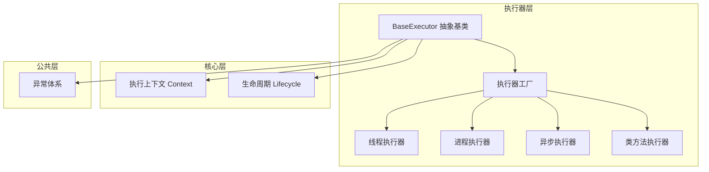
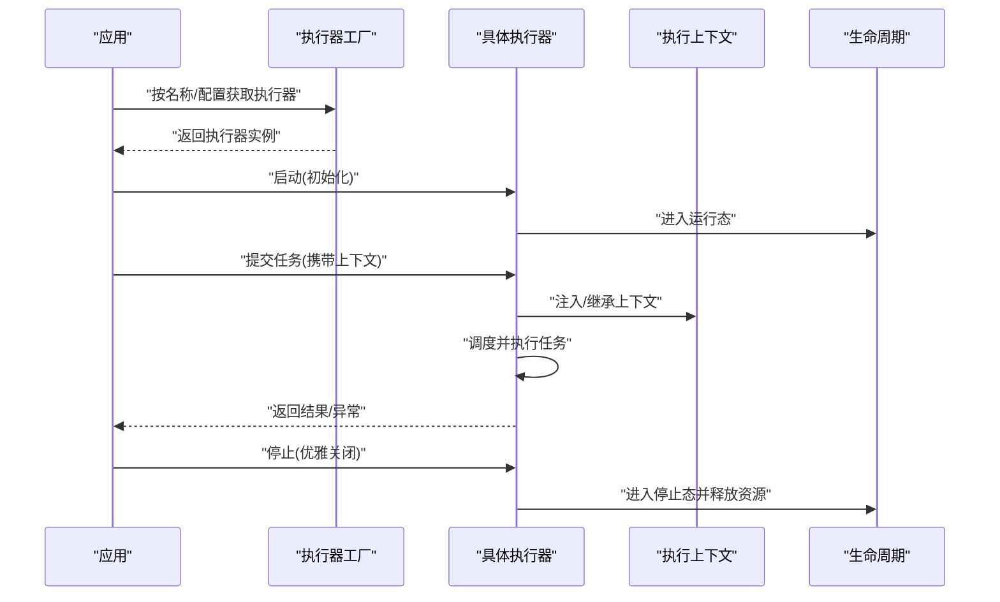
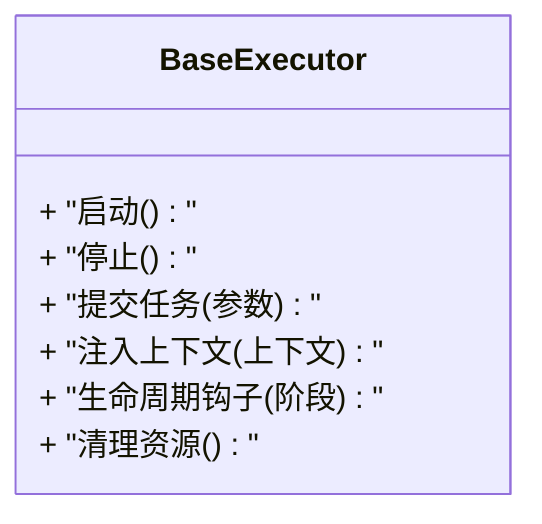
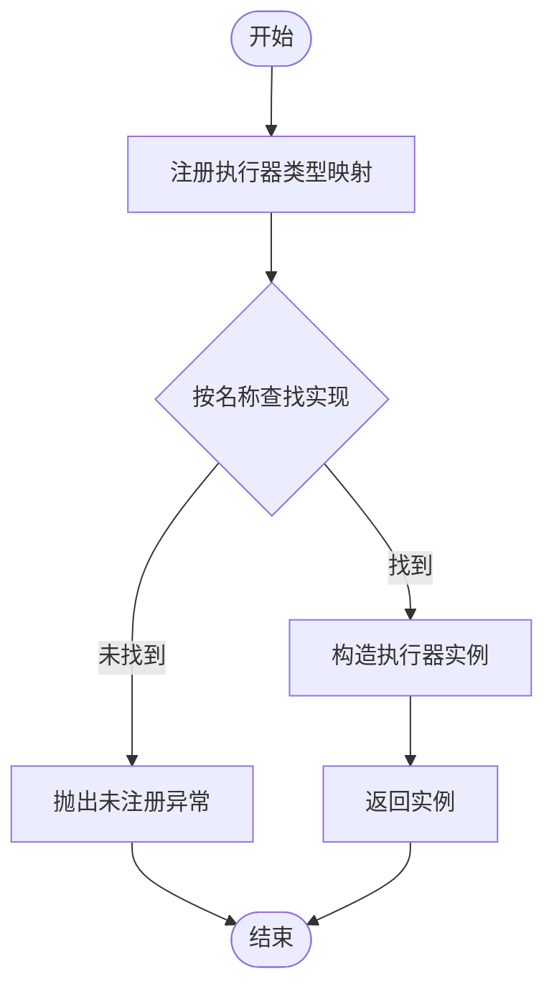
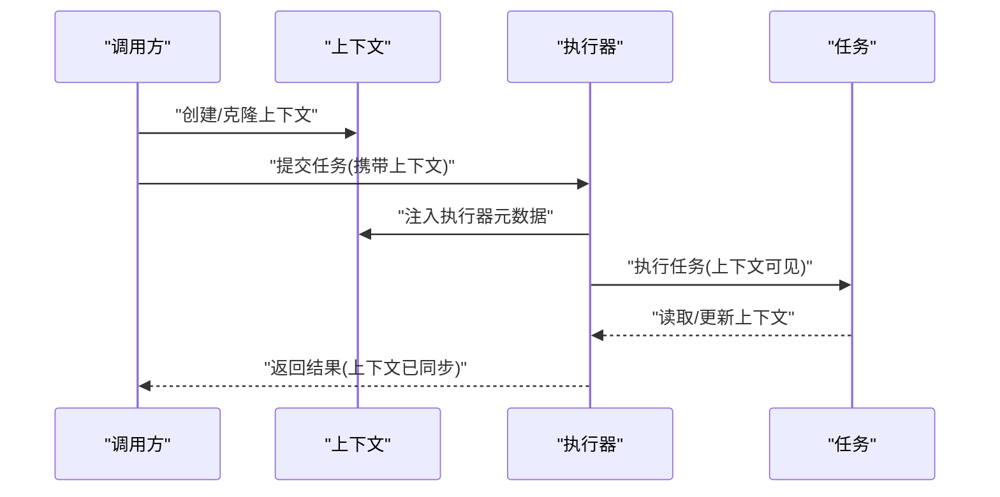
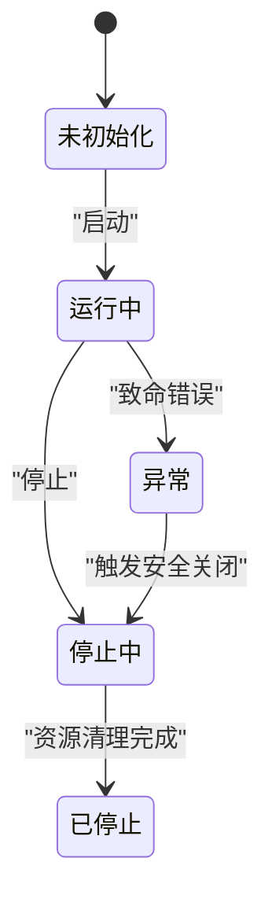
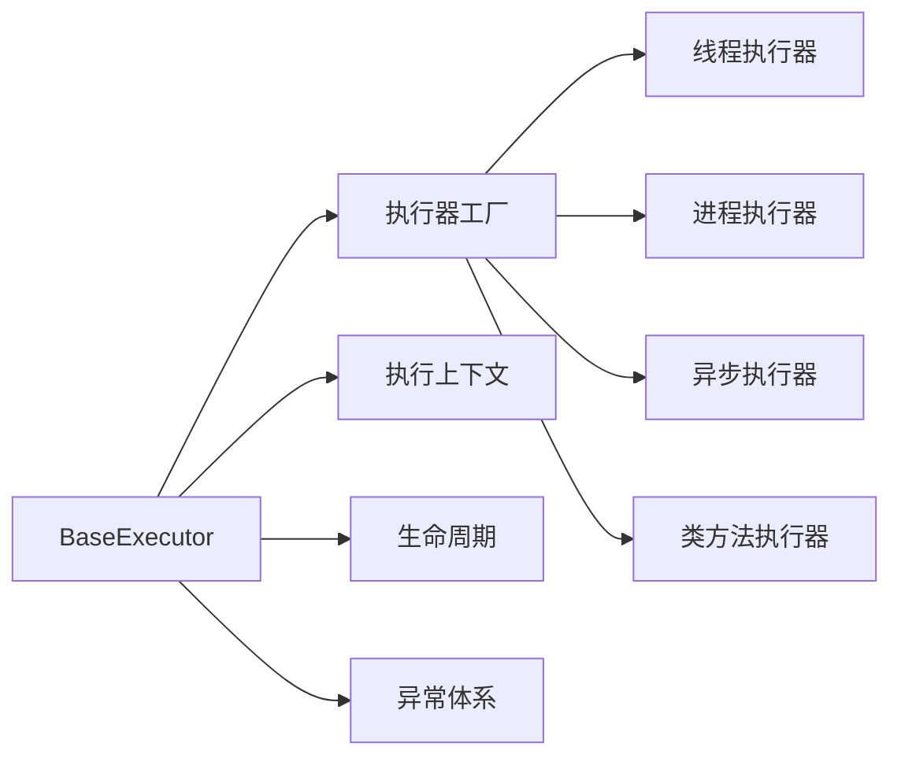

# 执行器基础架构

<cite>
**本文引用的文件**   
- [src/neotask/executor/base.py](file://src/neotask/executor/base.py)
- [src/neotask/executor/factory.py](file://src/neotask/executor/factory.py)
- [src/neotask/executor/thread_executor.py](file://src/neotask/executor/thread_executor.py)
- [src/neotask/executor/process_executor.py](file://src/neotask/executor/process_executor.py)
- [src/neotask/executor/async_executor.py](file://src/neotask/executor/async_executor.py)
- [src/neotask/executor/class_executor.py](file://src/neotask/executor/class_executor.py)
- [src/neotask/core/context.py](file://src/neotask/core/context.py)
- [src/neotask/core/lifecycle.py](file://src/neotask/core/lifecycle.py)
- [src/neotask/common/exceptions.py](file://src/neotask/common/exceptions.py)
- [examples/02_context_manager.py](file://examples/02_context_manager.py)
</cite>

## 目录
1. [简介](#简介)
2. [项目结构](#项目结构)
3. [核心组件](#核心组件)
4. [架构总览](#架构总览)
5. [详细组件分析](#详细组件分析)
6. [依赖关系分析](#依赖关系分析)
7. [性能考量](#性能考量)
8. [故障排查指南](#故障排查指南)
9. [结论](#结论)
10. [附录：自定义执行器开发指南](#附录自定义执行器开发指南)

## 简介
本文件聚焦于任务调度系统中的“执行器基础架构”，围绕以下目标展开：
- 深入解释 BaseExecutor 抽象基类的设计理念和核心接口定义
- 详细说明执行器工厂模式的实现原理，包括注册、发现与创建机制
- 阐述执行上下文的管理和传递机制
- 解释执行器生命周期管理、错误处理策略和资源清理机制
- 提供自定义执行器开发的完整指南，包括接口要求与最佳实践
- 通过具体代码示例路径展示如何扩展和执行器功能

## 项目结构
执行器相关代码集中在 src/neotask/executor 目录下，配合 core 层的上下文与生命周期模块，形成统一的执行框架。

图表来源
- [src/neotask/executor/base.py](file://src/neotask/executor/base.py)
- [src/neotask/executor/factory.py](file://src/neotask/executor/factory.py)
- [src/neotask/executor/thread_executor.py](file://src/neotask/executor/thread_executor.py)
- [src/neotask/executor/process_executor.py](file://src/neotask/executor/process_executor.py)
- [src/neotask/executor/async_executor.py](file://src/neotask/executor/async_executor.py)
- [src/neotask/executor/class_executor.py](file://src/neotask/executor/class_executor.py)
- [src/neotask/core/context.py](file://src/neotask/core/context.py)
- [src/neotask/core/lifecycle.py](file://src/neotask/core/lifecycle.py)
- [src/neotask/common/exceptions.py](file://src/neotask/common/exceptions.py)

章节来源
- [src/neotask/executor/base.py](file://src/neotask/executor/base.py)
- [src/neotask/executor/factory.py](file://src/neotask/executor/factory.py)
- [src/neotask/core/context.py](file://src/neotask/core/context.py)
- [src/neotask/core/lifecycle.py](file://src/neotask/core/lifecycle.py)

## 核心组件
- BaseExecutor 抽象基类：定义执行器的统一契约（启动、停止、提交任务、上下文注入、生命周期钩子、资源清理等），屏蔽底层差异，向上提供一致接口。
- 执行器工厂：维护执行器类型到实现的映射，支持按名称或配置动态创建实例，并提供注册与发现能力。
- 具体执行器实现：
  - 线程执行器：基于线程池并发执行任务
  - 进程执行器：基于多进程隔离执行任务
  - 异步执行器：基于事件循环与协程执行任务
  - 类方法执行器：以类方法为可执行单元的执行器
- 执行上下文：贯穿任务执行全生命周期的键值环境，支持跨调用链传播
- 生命周期：对执行器进行启停、健康检查、优雅关闭等状态管理
- 异常体系：定义执行期常见异常类型，便于上层统一捕获与恢复

章节来源
- [src/neotask/executor/base.py](file://src/neotask/executor/base.py)
- [src/neotask/executor/factory.py](file://src/neotask/executor/factory.py)
- [src/neotask/executor/thread_executor.py](file://src/neotask/executor/thread_executor.py)
- [src/neotask/executor/process_executor.py](file://src/neotask/executor/process_executor.py)
- [src/neotask/executor/async_executor.py](file://src/neotask/executor/async_executor.py)
- [src/neotask/executor/class_executor.py](file://src/neotask/executor/class_executor.py)
- [src/neotask/core/context.py](file://src/neotask/core/context.py)
- [src/neotask/core/lifecycle.py](file://src/neotask/core/lifecycle.py)
- [src/neotask/common/exceptions.py](file://src/neotask/common/exceptions.py)

## 架构总览
下图展示了从工厂创建执行器到任务执行的端到端流程，以及上下文与生命周期的参与点。

图表来源
- [src/neotask/executor/factory.py](file://src/neotask/executor/factory.py)
- [src/neotask/executor/base.py](file://src/neotask/executor/base.py)
- [src/neotask/core/context.py](file://src/neotask/core/context.py)
- [src/neotask/core/lifecycle.py](file://src/neotask/core/lifecycle.py)

## 详细组件分析

### BaseExecutor 抽象基类
设计理念
- 统一契约：所有执行器必须实现的最小接口集合，确保上层无需关心底层差异
- 可扩展性：通过生命周期钩子与上下文注入点，允许在任务前后插入横切逻辑
- 健壮性：内置异常分类与资源清理约定，降低实现成本

核心职责
- 定义执行器生命周期方法（如启动、停止）
- 定义任务提交与执行入口
- 定义上下文注入与传播方式
- 定义资源清理与错误上报约定

图表来源
- [src/neotask/executor/base.py](file://src/neotask/executor/base.py)

章节来源
- [src/neotask/executor/base.py](file://src/neotask/executor/base.py)

### 执行器工厂模式
设计要点
- 注册：将执行器类型名与实现类建立映射
- 发现：根据类型名查找对应实现
- 创建：按需构造实例，并可传入配置参数
- 扩展：新增执行器只需注册，无需修改现有代码

图表来源
- [src/neotask/executor/factory.py](file://src/neotask/executor/factory.py)

章节来源
- [src/neotask/executor/factory.py](file://src/neotask/executor/factory.py)

### 线程执行器
特点
- 基于线程池的并发模型
- 适合 I/O 密集型任务
- 共享内存空间，注意数据竞争

关键行为
- 启动时创建线程池
- 提交任务后分配至工作线程
- 停止时等待任务完成并回收资源

章节来源
- [src/neotask/executor/thread_executor.py](file://src/neotask/executor/thread_executor.py)

### 进程执行器
特点
- 基于多进程的隔离模型
- 适合 CPU 密集型任务
- 进程间通信开销较大

关键行为
- 启动时创建工作进程池
- 序列化任务参数并在子进程执行
- 停止时终止子进程并回收资源

章节来源
- [src/neotask/executor/process_executor.py](file://src/neotask/executor/process_executor.py)

### 异步执行器
特点
- 基于事件循环与协程
- 高并发低开销
- 需要正确管理事件循环

关键行为
- 启动时绑定事件循环
- 提交协程任务并调度执行
- 停止时关闭事件循环并清理资源

章节来源
- [src/neotask/executor/async_executor.py](file://src/neotask/executor/async_executor.py)

### 类方法执行器
特点
- 以类方法作为可执行单元
- 适合面向对象的编排场景

关键行为
- 解析类与方法引用
- 在上下文中实例化对象并调用方法
- 支持依赖注入与上下文透传

章节来源
- [src/neotask/executor/class_executor.py](file://src/neotask/executor/class_executor.py)

### 执行上下文管理与传递
上下文是贯穿任务执行的关键载体，用于传递请求标识、追踪信息、配置片段等。

图表来源
- [src/neotask/core/context.py](file://src/neotask/core/context.py)
- [src/neotask/executor/base.py](file://src/neotask/executor/base.py)

章节来源
- [src/neotask/core/context.py](file://src/neotask/core/context.py)
- [examples/02_context_manager.py](file://examples/02_context_manager.py)

### 生命周期管理
执行器遵循统一的生命周期状态机，确保启停有序、资源可控。

图表来源
- [src/neotask/core/lifecycle.py](file://src/neotask/core/lifecycle.py)
- [src/neotask/executor/base.py](file://src/neotask/executor/base.py)

章节来源
- [src/neotask/core/lifecycle.py](file://src/neotask/core/lifecycle.py)
- [src/neotask/executor/base.py](file://src/neotask/executor/base.py)

### 错误处理策略
- 异常分类：区分可重试与不可重试错误
- 统一捕获：在执行器内部集中捕获并记录
- 恢复策略：结合重试、降级与告警
- 资源清理：无论成功或失败均保证资源释放

章节来源
- [src/neotask/common/exceptions.py](file://src/neotask/common/exceptions.py)
- [src/neotask/executor/base.py](file://src/neotask/executor/base.py)

## 依赖关系分析
执行器模块之间的依赖关系如下：

图表来源
- [src/neotask/executor/base.py](file://src/neotask/executor/base.py)
- [src/neotask/executor/factory.py](file://src/neotask/executor/factory.py)
- [src/neotask/executor/thread_executor.py](file://src/neotask/executor/thread_executor.py)
- [src/neotask/executor/process_executor.py](file://src/neotask/executor/process_executor.py)
- [src/neotask/executor/async_executor.py](file://src/neotask/executor/async_executor.py)
- [src/neotask/executor/class_executor.py](file://src/neotask/executor/class_executor.py)
- [src/neotask/core/context.py](file://src/neotask/core/context.py)
- [src/neotask/core/lifecycle.py](file://src/neotask/core/lifecycle.py)
- [src/neotask/common/exceptions.py](file://src/neotask/common/exceptions.py)

章节来源
- [src/neotask/executor/base.py](file://src/neotask/executor/base.py)
- [src/neotask/executor/factory.py](file://src/neotask/executor/factory.py)
- [src/neotask/core/context.py](file://src/neotask/core/context.py)
- [src/neotask/core/lifecycle.py](file://src/neotask/core/lifecycle.py)
- [src/neotask/common/exceptions.py](file://src/neotask/common/exceptions.py)

## 性能考量
- 线程执行器：合理设置线程池大小，避免过多上下文切换；注意锁粒度与共享状态
- 进程执行器：控制进程数量与序列化开销；尽量使用轻量级数据结构
- 异步执行器：避免阻塞操作；合理使用超时与取消；关注事件循环背压
- 上下文传递：避免过大上下文对象；仅传递必要字段
- 资源清理：确保停止流程快速且幂等，避免长时间阻塞

[本节为通用指导，不直接分析具体文件]

## 故障排查指南
- 执行器未注册：检查工厂注册表是否包含目标类型名
- 上下文丢失：确认上下文是否在提交前创建并在执行器内注入
- 资源泄漏：验证停止流程是否被调用，清理钩子是否正确实现
- 异常未捕获：检查执行器内部异常分类与上报逻辑
- 性能退化：监控线程/进程/协程队列长度与耗时分布

章节来源
- [src/neotask/executor/factory.py](file://src/neotask/executor/factory.py)
- [src/neotask/core/context.py](file://src/neotask/core/context.py)
- [src/neotask/core/lifecycle.py](file://src/neotask/core/lifecycle.py)
- [src/neotask/common/exceptions.py](file://src/neotask/common/exceptions.py)

## 结论
执行器基础架构通过抽象基类统一契约、工厂模式解耦创建、上下文贯穿传递、生命周期规范化管理，形成了可扩展、可观测、可维护的任务执行平台。在此基础上，开发者可以便捷地扩展新的执行器类型，满足多样化业务需求。

[本节为总结性内容，不直接分析具体文件]

## 附录：自定义执行器开发指南

### 接口实现要求
- 继承 BaseExecutor 抽象基类
- 实现最小必要接口：启动、停止、提交任务、上下文注入、资源清理
- 遵循生命周期约定：在适当时机调用生命周期钩子
- 使用异常体系：抛出明确的异常类型以便上层处理

章节来源
- [src/neotask/executor/base.py](file://src/neotask/executor/base.py)
- [src/neotask/common/exceptions.py](file://src/neotask/common/exceptions.py)

### 注册与发现
- 在工厂中注册新执行器类型名与实现类映射
- 通过工厂按名称获取实例，避免硬编码依赖

章节来源
- [src/neotask/executor/factory.py](file://src/neotask/executor/factory.py)

### 上下文使用
- 在提交任务前创建或克隆上下文
- 在执行器内注入执行器元数据
- 在任务中读取/更新上下文，保持链路一致性

章节来源
- [src/neotask/core/context.py](file://src/neotask/core/context.py)
- [examples/02_context_manager.py](file://examples/02_context_manager.py)

### 生命周期与资源清理
- 启动时初始化资源（连接池、线程/进程池等）
- 停止时等待任务完成并释放资源
- 异常路径下也要确保清理

章节来源
- [src/neotask/core/lifecycle.py](file://src/neotask/core/lifecycle.py)
- [src/neotask/executor/base.py](file://src/neotask/executor/base.py)

### 最佳实践
- 明确异常分类与重试策略
- 控制上下文体积，避免过度传递
- 为长耗时任务设置超时与取消
- 做好日志与指标埋点，便于定位问题

[本节为通用指导，不直接分析具体文件]

### 代码示例路径
- 上下文管理器示例：[examples/02_context_manager.py](file://examples/02_context_manager.py)
- 线程执行器参考：[src/neotask/executor/thread_executor.py](file://src/neotask/executor/thread_executor.py)
- 进程执行器参考：[src/neotask/executor/process_executor.py](file://src/neotask/executor/process_executor.py)
- 异步执行器参考：[src/neotask/executor/async_executor.py](file://src/neotask/executor/async_executor.py)
- 类方法执行器参考：[src/neotask/executor/class_executor.py](file://src/neotask/executor/class_executor.py)