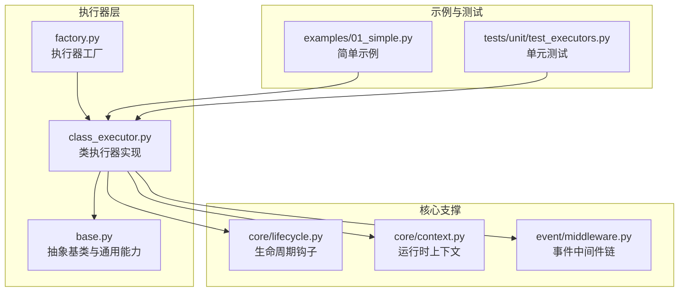
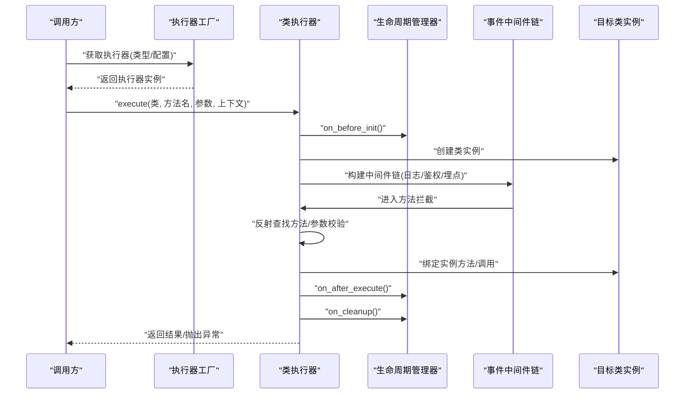
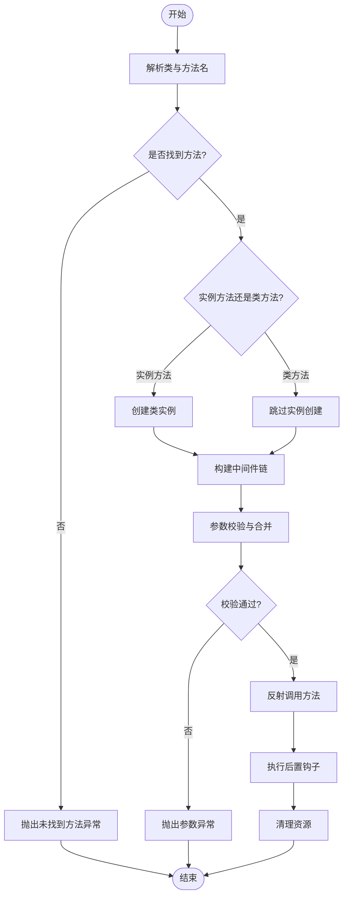
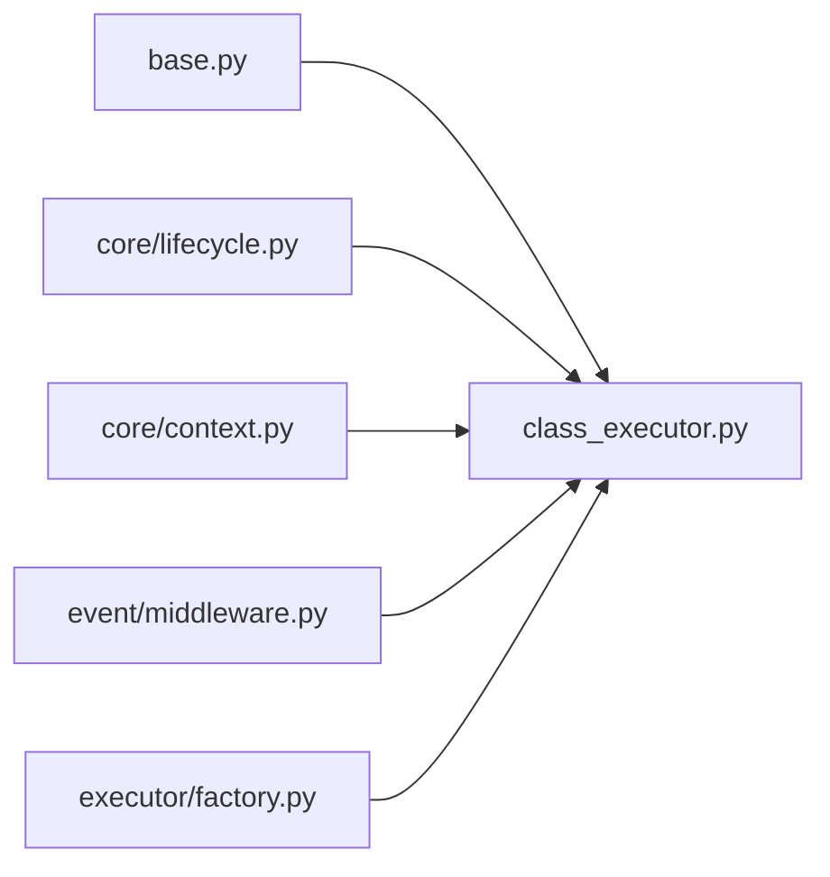

# 类执行器

<cite>
**本文引用的文件**   
- [src/neotask/executor/class_executor.py](file://src/neotask/executor/class_executor.py)
- [src/neotask/executor/base.py](file://src/neotask/executor/base.py)
- [src/neotask/executor/factory.py](file://src/neotask/executor/factory.py)
- [src/neotask/core/lifecycle.py](file://src/neotask/core/lifecycle.py)
- [src/neotask/core/context.py](file://src/neotask/core/context.py)
- [src/neotask/event/middleware.py](file://src/neotask/event/middleware.py)
- [examples/01_simple.py](file://examples/01_simple.py)
- [tests/unit/test_executors.py](file://tests/unit/test_executors.py)
</cite>

## 目录
1. [简介](#简介)
2. [项目结构](#项目结构)
3. [核心组件](#核心组件)
4. [架构总览](#架构总览)
5. [详细组件分析](#详细组件分析)
6. [依赖关系分析](#依赖关系分析)
7. [性能考量](#性能考量)
8. [故障排查指南](#故障排查指南)
9. [结论](#结论)
10. [附录](#附录)

## 简介
本文件围绕“类执行器”（ClassExecutor）的实现与使用进行系统化说明，重点覆盖：
- 如何通过反射机制支持类方法与实例方法的执行、方法绑定与参数处理
- 类实例的生命周期管理、状态保持与资源共享策略
- 装饰器模式在执行器中的应用：方法拦截、权限验证与日志记录
- 继承与多态在执行器中的处理方式
- 面向对象任务设计的最佳实践：类设计模式、接口规范与测试策略
- 实际类任务开发示例与常见问题解决方案

## 项目结构
与类执行器相关的代码主要位于 executor 模块，并与其他核心模块（生命周期、上下文、事件中间件等）协作。下图展示了关键文件与职责划分。

图表来源
- [src/neotask/executor/class_executor.py](file://src/neotask/executor/class_executor.py)
- [src/neotask/executor/base.py](file://src/neotask/executor/base.py)
- [src/neotask/executor/factory.py](file://src/neotask/executor/factory.py)
- [src/neotask/core/lifecycle.py](file://src/neotask/core/lifecycle.py)
- [src/neotask/core/context.py](file://src/neotask/core/context.py)
- [src/neotask/event/middleware.py](file://src/neotask/event/middleware.py)
- [examples/01_simple.py](file://examples/01_simple.py)
- [tests/unit/test_executors.py](file://tests/unit/test_executors.py)

章节来源
- [src/neotask/executor/class_executor.py](file://src/neotask/executor/class_executor.py)
- [src/neotask/executor/base.py](file://src/neotask/executor/base.py)
- [src/neotask/executor/factory.py](file://src/neotask/executor/factory.py)
- [src/neotask/core/lifecycle.py](file://src/neotask/core/lifecycle.py)
- [src/neotask/core/context.py](file://src/neotask/core/context.py)
- [src/neotask/event/middleware.py](file://src/neotask/event/middleware.py)
- [examples/01_simple.py](file://examples/01_simple.py)
- [tests/unit/test_executors.py](file://tests/unit/test_executors.py)

## 核心组件
- 抽象执行器基类：定义统一的执行接口、生命周期钩子、错误处理与上下文注入能力，供具体执行器复用。
- 类执行器：在基类之上提供面向类的任务编排能力，包括类实例的创建、方法发现与调用、参数解析与校验、资源准备与释放。
- 执行器工厂：根据配置或约定选择并返回合适的执行器实例，屏蔽底层差异。
- 生命周期管理器：提供标准化的初始化、运行中、清理等阶段钩子，便于扩展与监控。
- 运行时上下文：为执行过程提供跨阶段的共享数据通道（如请求ID、用户信息、临时缓存）。
- 事件中间件：以可插拔方式对方法调用进行拦截，实现日志、鉴权、指标采集等横切关注点。

章节来源
- [src/neotask/executor/base.py](file://src/neotask/executor/base.py)
- [src/neotask/executor/class_executor.py](file://src/neotask/executor/class_executor.py)
- [src/neotask/executor/factory.py](file://src/neotask/executor/factory.py)
- [src/neotask/core/lifecycle.py](file://src/neotask/core/lifecycle.py)
- [src/neotask/core/context.py](file://src/neotask/core/context.py)
- [src/neotask/event/middleware.py](file://src/neotask/event/middleware.py)

## 架构总览
类执行器的整体流程如下：通过工厂获取执行器；执行器基于目标类与方法名，结合上下文与中间件链完成方法发现、参数绑定、权限校验、日志记录与最终调用；期间贯穿生命周期钩子与异常处理。

图表来源
- [src/neotask/executor/factory.py](file://src/neotask/executor/factory.py)
- [src/neotask/executor/class_executor.py](file://src/neotask/executor/class_executor.py)
- [src/neotask/core/lifecycle.py](file://src/neotask/core/lifecycle.py)
- [src/neotask/event/middleware.py](file://src/neotask/event/middleware.py)

## 详细组件分析

### 类执行器（ClassExecutor）
- 方法发现与反射
  - 支持类方法与实例方法两种调用路径。对于实例方法，先创建类实例再进行绑定与调用；对于类方法，直接通过类对象访问并进行参数校验。
  - 通过反射获取方法对象，解析签名与默认值，将外部传入的参数映射到方法形参，缺失参数时回退到默认值或抛出明确异常。
- 参数处理与校验
  - 统一参数收集入口，合并位置参数、关键字参数与上下文携带的附加字段。
  - 对必填参数进行存在性检查，对类型不匹配给出清晰错误信息，避免静默失败。
- 方法绑定与调用
  - 实例方法：将已创建的实例作为 self 绑定到方法对象后调用。
  - 类方法：通过类对象直接调用，确保类级别资源可用。
- 生命周期与资源管理
  - 在实例创建前后、方法执行前后、清理阶段分别触发生命周期钩子，便于扩展（如连接池预热、统计上报、资源回收）。
  - 提供 try/finally 语义保证资源释放，即使发生异常也能正确清理。
- 中间件与装饰器模式
  - 在执行前构建中间件链，依次执行日志记录、权限验证、指标采集等横切逻辑。
  - 中间件可短路返回（例如鉴权失败），也可包装原始调用以增强行为。
- 继承与多态
  - 子类可通过重写生命周期钩子或中间件注册来定制行为。
  - 不同业务类可实现相同接口，由执行器统一调度，体现多态优势。

图表来源
- [src/neotask/executor/class_executor.py](file://src/neotask/executor/class_executor.py)
- [src/neotask/core/lifecycle.py](file://src/neotask/core/lifecycle.py)
- [src/neotask/event/middleware.py](file://src/neotask/event/middleware.py)

章节来源
- [src/neotask/executor/class_executor.py](file://src/neotask/executor/class_executor.py)
- [src/neotask/core/lifecycle.py](file://src/neotask/core/lifecycle.py)
- [src/neotask/event/middleware.py](file://src/neotask/event/middleware.py)

### 抽象执行器基类（Base Executor）
- 定义统一的 execute 接口与错误处理模板，子类无需重复编写通用逻辑。
- 提供生命周期钩子的默认空实现，子类按需覆盖。
- 封装上下文注入与中间件注册的基础能力，降低耦合。

章节来源
- [src/neotask/executor/base.py](file://src/neotask/executor/base.py)

### 执行器工厂（Executor Factory）
- 根据类型标识或配置项返回具体执行器实例，隐藏构造细节。
- 支持扩展新的执行器类型而无需修改调用方代码。

章节来源
- [src/neotask/executor/factory.py](file://src/neotask/executor/factory.py)

### 生命周期管理器（Lifecycle Manager）
- 提供 on_before_init、on_after_execute、on_cleanup 等标准钩子。
- 保证钩子在异常情况下仍可被调用，确保资源安全释放。

章节来源
- [src/neotask/core/lifecycle.py](file://src/neotask/core/lifecycle.py)

### 运行时上下文（Context）
- 提供键值存储用于跨阶段共享数据（如请求ID、用户信息、临时缓存）。
- 支持隔离作用域，避免并发场景下的数据污染。

章节来源
- [src/neotask/core/context.py](file://src/neotask/core/context.py)

### 事件中间件（Event Middleware）
- 以链式结构组织多个中间件，每个中间件负责单一横切关注点（日志、鉴权、埋点等）。
- 支持短路返回与异常透传，便于组合与调试。

章节来源
- [src/neotask/event/middleware.py](file://src/neotask/event/middleware.py)

## 依赖关系分析
类执行器依赖抽象基类、生命周期、上下文与中间件，并通过工厂对外暴露。

图表来源
- [src/neotask/executor/base.py](file://src/neotask/executor/base.py)
- [src/neotask/executor/class_executor.py](file://src/neotask/executor/class_executor.py)
- [src/neotask/executor/factory.py](file://src/neotask/executor/factory.py)
- [src/neotask/core/lifecycle.py](file://src/neotask/core/lifecycle.py)
- [src/neotask/core/context.py](file://src/neotask/core/context.py)
- [src/neotask/event/middleware.py](file://src/neotask/event/middleware.py)

章节来源
- [src/neotask/executor/class_executor.py](file://src/neotask/executor/class_executor.py)
- [src/neotask/executor/base.py](file://src/neotask/executor/base.py)
- [src/neotask/executor/factory.py](file://src/neotask/executor/factory.py)
- [src/neotask/core/lifecycle.py](file://src/neotask/core/lifecycle.py)
- [src/neotask/core/context.py](file://src/neotask/core/context.py)
- [src/neotask/event/middleware.py](file://src/neotask/event/middleware.py)

## 性能考量
- 反射开销：方法发现与签名解析仅在首次或必要时进行，建议缓存方法元信息以减少重复计算。
- 中间件链长度：过多中间件会增加调用栈深度与序列化/反序列化成本，应遵循单一职责原则精简中间件。
- 实例复用：若业务允许，可在生命周期内复用类实例以减少创建销毁开销，但需注意线程安全与状态隔离。
- 参数校验：尽量在入口处集中校验，避免多次重复检查导致性能退化。
- 资源管理：数据库连接、网络客户端等资源应在生命周期钩子中统一管理与释放，避免泄漏。

[本节为通用指导，不涉及具体文件分析]

## 故障排查指南
- 方法未找到
  - 现象：执行时报错提示无法定位目标方法。
  - 排查：确认类与方法名拼写、可见性与命名空间是否正确；检查是否存在同名重载或别名。
- 参数不匹配
  - 现象：执行时报参数缺失或类型错误。
  - 排查：核对方法签名与传入参数；检查默认值与上下文附加字段是否冲突。
- 权限拒绝
  - 现象：鉴权中间件短路返回。
  - 排查：检查当前上下文的身份信息与权限策略；确认中间件注册顺序。
- 资源未释放
  - 现象：长时间运行后出现连接泄漏或内存增长。
  - 排查：确认生命周期钩子是否被正确触发；在 finally 分支中显式释放资源。
- 并发状态污染
  - 现象：多线程下出现数据错乱。
  - 排查：确保上下文与作用域隔离；避免在类实例上保存可变全局状态。

章节来源
- [src/neotask/executor/class_executor.py](file://src/neotask/executor/class_executor.py)
- [src/neotask/core/lifecycle.py](file://src/neotask/core/lifecycle.py)
- [src/neotask/event/middleware.py](file://src/neotask/event/middleware.py)

## 结论
类执行器通过抽象基类、生命周期钩子、上下文与中间件链的组合，提供了稳定且可扩展的类级任务执行能力。借助反射与参数解析，它既能支持类方法也能支持实例方法；通过装饰器模式实现的中间件链，使日志、鉴权与埋点等横切关注点得以解耦与复用。配合良好的生命周期管理与资源共享策略，类执行器能够在复杂业务场景中保持高内聚、低耦合与易维护。

[本节为总结性内容，不涉及具体文件分析]

## 附录

### 面向对象任务设计最佳实践
- 类设计模式
  - 单一职责：每个类聚焦一个领域职责，避免臃肿。
  - 依赖注入：通过构造函数或上下文注入外部依赖，便于替换与测试。
  - 不可变优先：尽可能使用不可变数据结构减少并发风险。
- 接口规范
  - 明确的输入输出契约：方法签名清晰，文档化参数与返回值。
  - 异常语义一致：区分业务异常与系统异常，便于上层处理。
- 测试策略
  - 单元测试：针对关键方法进行断言，模拟外部依赖。
  - 集成测试：端到端验证执行器与中间件链的正确性。
  - 边界条件：覆盖参数缺失、类型错误、权限不足等场景。

章节来源
- [examples/01_simple.py](file://examples/01_simple.py)
- [tests/unit/test_executors.py](file://tests/unit/test_executors.py)

### 实际类任务开发示例
- 快速上手
  - 参考示例文件，了解如何定义类任务、注册中间件与调用执行器。
- 常见用法
  - 在生命周期钩子中初始化资源（如连接池）、在清理阶段释放资源。
  - 在中间件中记录日志、采集指标与进行权限校验。

章节来源
- [examples/01_simple.py](file://examples/01_simple.py)
- [tests/unit/test_executors.py](file://tests/unit/test_executors.py)