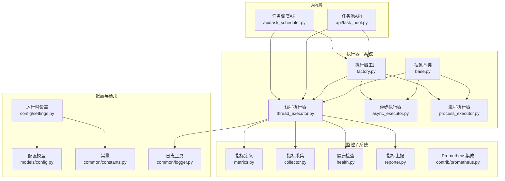
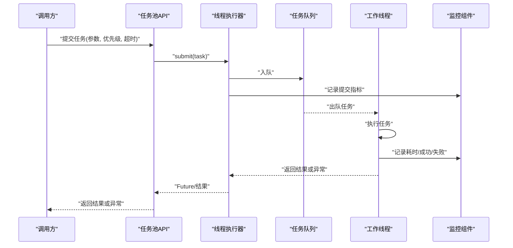
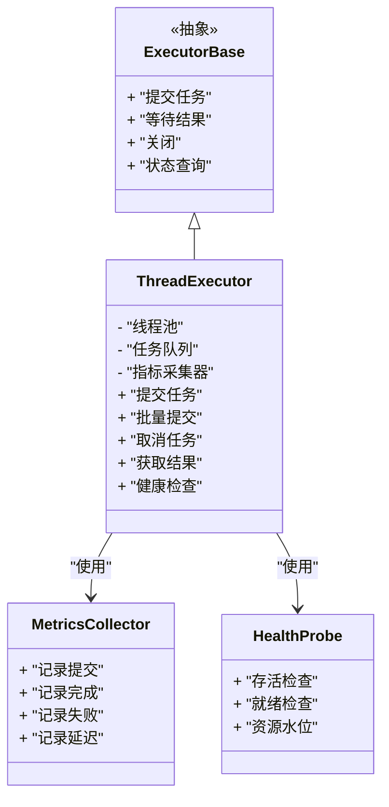
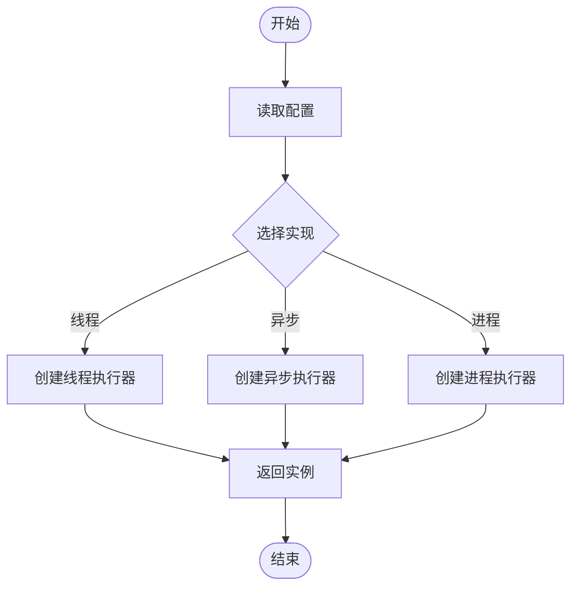
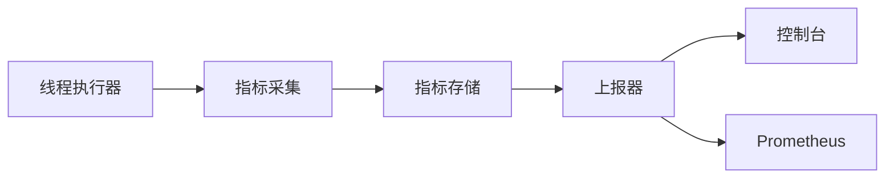
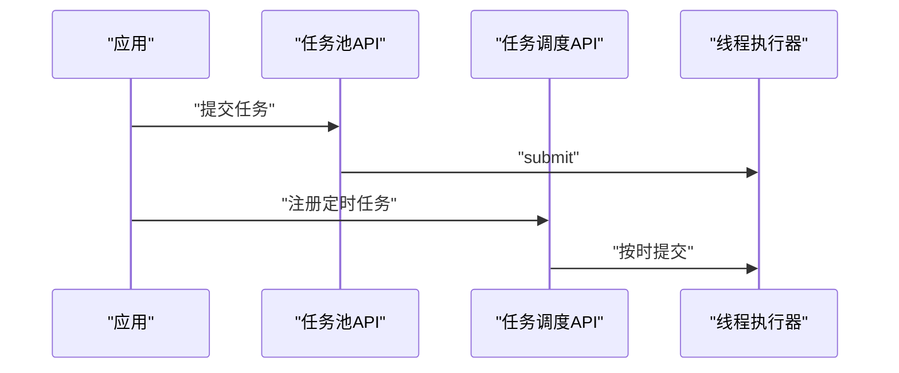
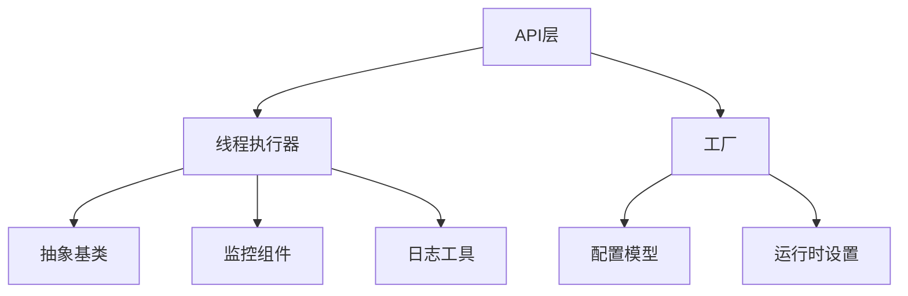

# 线程执行器

<cite>
**本文引用的文件**   
- [thread_executor.py](file://src/neotask/executor/thread_executor.py)
- [base.py](file://src/neotask/executor/base.py)
- [async_executor.py](file://src/neotask/executor/async_executor.py)
- [process_executor.py](file://src/neotask/executor/process_executor.py)
- [factory.py](file://src/neotask/executor/factory.py)
- [exceptions.py](file://src/neotask/executor/exceptions.py)
- [__init__.py](file://src/neotask/executor/__init__.py)
- [metrics.py](file://src/neotask/monitor/metrics.py)
- [collector.py](file://src/neotask/monitor/collector.py)
- [health.py](file://src/neotask/monitor/health.py)
- [reporter.py](file://src/neotask/monitor/reporter.py)
- [prometheus.py](file://src/neotask/contrib/prometheus.py)
- [task_pool.py](file://src/neotask/api/task_pool.py)
- [task_scheduler.py](file://src/neotask/api/task_scheduler.py)
- [config.py](file://src/neotask/models/config.py)
- [settings.py](file://src/neotask/config/settings.py)
- [constants.py](file://src/neotask/common/constants.py)
- [logger.py](file://src/neotask/common/logger.py)
- [test_executors.py](file://tests/unit/test_executors.py)
- [test_performance_simple.py](file://tests/benchmark/test_performance_simple.py)
</cite>

## 目录
1. [简介](#简介)
2. [项目结构](#项目结构)
3. [核心组件](#核心组件)
4. [架构总览](#架构总览)
5. [详细组件分析](#详细组件分析)
6. [依赖关系分析](#依赖关系分析)
7. [性能考量](#性能考量)
8. [故障排查指南](#故障排查指南)
9. [结论](#结论)
10. [附录](#附录)

## 简介
本技术文档聚焦于线程执行器的实现与使用，围绕以下目标展开：
- 深入解析线程执行器的实现原理，包括线程池配置、任务分发机制与并发控制策略
- 说明线程安全保证、资源隔离与内存管理
- 解释线程池大小调优、任务队列管理与背压处理机制
- 阐述异常处理、超时控制与任务取消功能
- 提供性能监控指标与调试技巧
- 给出实际使用场景、配置优化建议，以及与异步执行器、进程执行器的对比分析

## 项目结构
线程执行器位于执行器子系统中，采用“抽象基类 + 多实现”的分层设计。核心文件与职责如下：
- 抽象基类：定义统一的执行器接口与生命周期钩子
- 线程执行器：基于线程池的同步执行实现
- 异步执行器：基于事件循环的异步执行实现
- 进程执行器：基于进程的跨进程执行实现
- 工厂：根据配置选择具体执行器实现
- 监控：指标采集、健康检查与上报
- API：对外暴露的任务池与调度器接口
- 模型与配置：统一配置项与常量
- 测试：单元与基准测试覆盖关键路径

图表来源
- [base.py](file://src/neotask/executor/base.py)
- [thread_executor.py](file://src/neotask/executor/thread_executor.py)
- [async_executor.py](file://src/neotask/executor/async_executor.py)
- [process_executor.py](file://src/neotask/executor/process_executor.py)
- [factory.py](file://src/neotask/executor/factory.py)
- [metrics.py](file://src/neotask/monitor/metrics.py)
- [collector.py](file://src/neotask/monitor/collector.py)
- [health.py](file://src/neotask/monitor/health.py)
- [reporter.py](file://src/neotask/monitor/reporter.py)
- [prometheus.py](file://src/neotask/contrib/prometheus.py)
- [task_pool.py](file://src/neotask/api/task_pool.py)
- [task_scheduler.py](file://src/neotask/api/task_scheduler.py)
- [config.py](file://src/neotask/models/config.py)
- [settings.py](file://src/neotask/config/settings.py)
- [constants.py](file://src/neotask/common/constants.py)
- [logger.py](file://src/neotask/common/logger.py)

章节来源
- [thread_executor.py](file://src/neotask/executor/thread_executor.py)
- [base.py](file://src/neotask/executor/base.py)
- [factory.py](file://src/neotask/executor/factory.py)
- [task_pool.py](file://src/neotask/api/task_pool.py)
- [task_scheduler.py](file://src/neotask/api/task_scheduler.py)
- [metrics.py](file://src/neotask/monitor/metrics.py)
- [collector.py](file://src/neotask/monitor/collector.py)
- [health.py](file://src/neotask/monitor/health.py)
- [reporter.py](file://src/neotask/monitor/reporter.py)
- [prometheus.py](file://src/neotask/contrib/prometheus.py)
- [config.py](file://src/neotask/models/config.py)
- [settings.py](file://src/neotask/config/settings.py)
- [constants.py](file://src/neotask/common/constants.py)
- [logger.py](file://src/neotask/common/logger.py)

## 核心组件
- 抽象基类（ExecutorBase）
  - 定义统一的执行器接口：提交任务、等待结果、关闭、状态查询等
  - 提供生命周期钩子：启动、停止、扩展点
  - 规范错误类型与返回契约
- 线程执行器（ThreadExecutor）
  - 基于线程池的同步执行实现
  - 支持任务提交、批量提交、取消、超时、重试与结果获取
  - 内置指标采集与健康探针
- 工厂（ExecutorFactory）
  - 根据配置创建并返回合适的执行器实例
  - 统一管理执行器生命周期与资源清理
- 监控组件
  - 指标定义与采集：吞吐、延迟、队列长度、活跃线程数等
  - 健康检查：存活、就绪、资源水位
  - 上报：控制台、Prometheus等后端

章节来源
- [base.py](file://src/neotask/executor/base.py)
- [thread_executor.py](file://src/neotask/executor/thread_executor.py)
- [factory.py](file://src/neotask/executor/factory.py)
- [metrics.py](file://src/neotask/monitor/metrics.py)
- [collector.py](file://src/neotask/monitor/collector.py)
- [health.py](file://src/neotask/monitor/health.py)
- [reporter.py](file://src/neotask/monitor/reporter.py)

## 架构总览
线程执行器在整体系统中的位置与交互如下：
- API层通过任务池或调度器向执行器提交任务
- 执行器负责将任务分派到工作线程，维护任务队列与线程池
- 监控组件对执行过程进行指标采集与健康检查
- 工厂负责按配置选择执行器实现，屏蔽底层差异

图表来源
- [task_pool.py](file://src/neotask/api/task_pool.py)
- [thread_executor.py](file://src/neotask/executor/thread_executor.py)
- [metrics.py](file://src/neotask/monitor/metrics.py)
- [collector.py](file://src/neotask/monitor/collector.py)

## 详细组件分析

### 线程执行器（ThreadExecutor）
- 线程池配置
  - 核心线程数、最大线程数、空闲线程存活时间、队列容量、拒绝策略等
  - 可通过配置模型与运行时设置注入
- 任务分发机制
  - 提交任务时优先放入队列，空闲线程从队列取任务执行
  - 支持批量提交与优先级队列
- 并发控制策略
  - 通过线程池限制并发度，避免过载
  - 结合队列容量与拒绝策略实现背压
- 线程安全保证
  - 使用线程安全的队列与锁保护共享状态
  - 任务上下文隔离，避免共享可变状态
- 资源隔离与内存管理
  - 每个任务在独立线程中运行，减少相互影响
  - 及时释放引用，避免长生命周期对象泄漏
- 异常处理、超时控制与任务取消
  - 捕获并包装异常，统一错误语义
  - 支持任务级超时与全局超时
  - 支持任务取消与中断传播
- 监控与诊断
  - 采集提交/完成/失败计数、延迟分布、队列长度、活跃线程数
  - 健康探针暴露存活与就绪状态

图表来源
- [base.py](file://src/neotask/executor/base.py)
- [thread_executor.py](file://src/neotask/executor/thread_executor.py)
- [metrics.py](file://src/neotask/monitor/metrics.py)
- [collector.py](file://src/neotask/monitor/collector.py)
- [health.py](file://src/neotask/monitor/health.py)

章节来源
- [thread_executor.py](file://src/neotask/executor/thread_executor.py)
- [base.py](file://src/neotask/executor/base.py)
- [metrics.py](file://src/neotask/monitor/metrics.py)
- [collector.py](file://src/neotask/monitor/collector.py)
- [health.py](file://src/neotask/monitor/health.py)

### 工厂（ExecutorFactory）
- 根据配置选择执行器实现（线程/异步/进程）
- 统一管理执行器实例的生命周期与资源清理
- 提供统一的创建与销毁接口

图表来源
- [factory.py](file://src/neotask/executor/factory.py)
- [config.py](file://src/neotask/models/config.py)
- [settings.py](file://src/neotask/config/settings.py)

章节来源
- [factory.py](file://src/neotask/executor/factory.py)
- [config.py](file://src/neotask/models/config.py)
- [settings.py](file://src/neotask/config/settings.py)

### 监控与上报
- 指标定义：提交、完成、失败、延迟、队列长度、活跃线程数等
- 采集器：在执行器关键路径埋点，聚合统计
- 健康检查：存活、就绪、资源水位
- 上报：控制台输出、Prometheus导出

图表来源
- [metrics.py](file://src/neotask/monitor/metrics.py)
- [collector.py](file://src/neotask/monitor/collector.py)
- [reporter.py](file://src/neotask/monitor/reporter.py)
- [prometheus.py](file://src/neotask/contrib/prometheus.py)

章节来源
- [metrics.py](file://src/neotask/monitor/metrics.py)
- [collector.py](file://src/neotask/monitor/collector.py)
- [reporter.py](file://src/neotask/monitor/reporter.py)
- [prometheus.py](file://src/neotask/contrib/prometheus.py)

### API层集成
- 任务池API：封装执行器，提供便捷的任务提交与结果获取
- 任务调度API：结合定时与周期性任务，驱动执行器

图表来源
- [task_pool.py](file://src/neotask/api/task_pool.py)
- [task_scheduler.py](file://src/neotask/api/task_scheduler.py)
- [thread_executor.py](file://src/neotask/executor/thread_executor.py)

章节来源
- [task_pool.py](file://src/neotask/api/task_pool.py)
- [task_scheduler.py](file://src/neotask/api/task_scheduler.py)
- [thread_executor.py](file://src/neotask/executor/thread_executor.py)

## 依赖关系分析
- 内部依赖
  - 线程执行器依赖抽象基类、监控组件、日志工具
  - 工厂依赖配置模型与运行时设置
  - API层依赖执行器与监控
- 外部依赖
  - 标准库线程池与队列
  - 可选Prometheus客户端用于指标导出

图表来源
- [thread_executor.py](file://src/neotask/executor/thread_executor.py)
- [base.py](file://src/neotask/executor/base.py)
- [metrics.py](file://src/neotask/monitor/metrics.py)
- [logger.py](file://src/neotask/common/logger.py)
- [factory.py](file://src/neotask/executor/factory.py)
- [config.py](file://src/neotask/models/config.py)
- [settings.py](file://src/neotask/config/settings.py)
- [task_pool.py](file://src/neotask/api/task_pool.py)
- [task_scheduler.py](file://src/neotask/api/task_scheduler.py)

章节来源
- [thread_executor.py](file://src/neotask/executor/thread_executor.py)
- [base.py](file://src/neotask/executor/base.py)
- [metrics.py](file://src/neotask/monitor/metrics.py)
- [logger.py](file://src/neotask/common/logger.py)
- [factory.py](file://src/neotask/executor/factory.py)
- [config.py](file://src/neotask/models/config.py)
- [settings.py](file://src/neotask/config/settings.py)
- [task_pool.py](file://src/neotask/api/task_pool.py)
- [task_scheduler.py](file://src/neotask/api/task_scheduler.py)

## 性能考量
- 线程池大小调优
  - CPU密集型：核心线程数接近CPU核数
  - I/O密集型：适当放大线程数以提升吞吐
  - 混合负载：分层线程池或动态扩缩容
- 任务队列管理
  - 合理设置队列容量，避免内存膨胀
  - 使用优先级队列区分高优任务
- 背压处理
  - 队列满时的拒绝策略：丢弃低优任务、阻塞提交端、快速失败
  - 结合监控阈值触发限流或降级
- 资源隔离与内存管理
  - 避免在任务间共享大对象
  - 及时释放临时对象，防止GC压力
- 监控与观测
  - 关注提交速率、完成速率、P95/P99延迟、队列长度、活跃线程数
  - 结合健康探针评估系统稳定性

[本节为通用指导，不直接分析具体文件]

## 故障排查指南
- 常见问题定位
  - 任务堆积：检查队列长度与消费速率
  - 线程饥饿：观察活跃线程数与任务排队时长
  - 频繁拒绝：调整队列容量或拒绝策略
  - 超时过多：检查任务耗时分布与超时阈值
- 日志与诊断
  - 开启详细日志，记录任务提交、执行、完成与异常
  - 使用健康探针与指标面板辅助定位瓶颈
- 单元测试与基准测试
  - 参考单元测试用例验证关键路径
  - 使用基准测试评估不同配置的吞吐与延迟

章节来源
- [test_executors.py](file://tests/unit/test_executors.py)
- [test_performance_simple.py](file://tests/benchmark/test_performance_simple.py)
- [logger.py](file://src/neotask/common/logger.py)
- [health.py](file://src/neotask/monitor/health.py)
- [metrics.py](file://src/neotask/monitor/metrics.py)

## 结论
线程执行器以清晰的抽象与模块化设计，提供了稳定高效的同步任务执行能力。通过合理的线程池配置、队列管理与背压策略，可在多种负载下保持良好性能与稳定性。配合完善的监控与健康检查，便于在生产环境中持续观测与优化。

[本节为总结性内容，不直接分析具体文件]

## 附录
- 与其他执行器的对比
  - 线程执行器 vs 异步执行器
    - 适用场景：线程执行器适合I/O密集且需要简单同步接口的场景；异步执行器适合高并发I/O与事件驱动场景
    - 性能特征：异步执行器在大量并发I/O下通常具有更低开销与更高吞吐
  - 线程执行器 vs 进程执行器
    - 适用场景：进程执行器适合CPU密集与强隔离需求；线程执行器适合轻量任务与较低隔离要求
    - 性能特征：进程执行器存在进程间通信开销，但具备更强的资源隔离
- 配置优化建议
  - 根据负载类型调整核心线程数与队列容量
  - 启用指标采集与健康检查，建立告警规则
  - 定期做基准测试，验证配置变更效果

章节来源
- [async_executor.py](file://src/neotask/executor/async_executor.py)
- [process_executor.py](file://src/neotask/executor/process_executor.py)
- [thread_executor.py](file://src/neotask/executor/thread_executor.py)
- [metrics.py](file://src/neotask/monitor/metrics.py)
- [health.py](file://src/neotask/monitor/health.py)