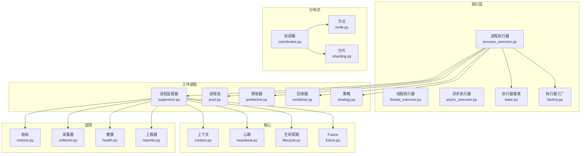
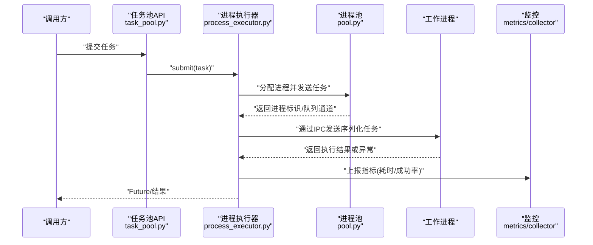
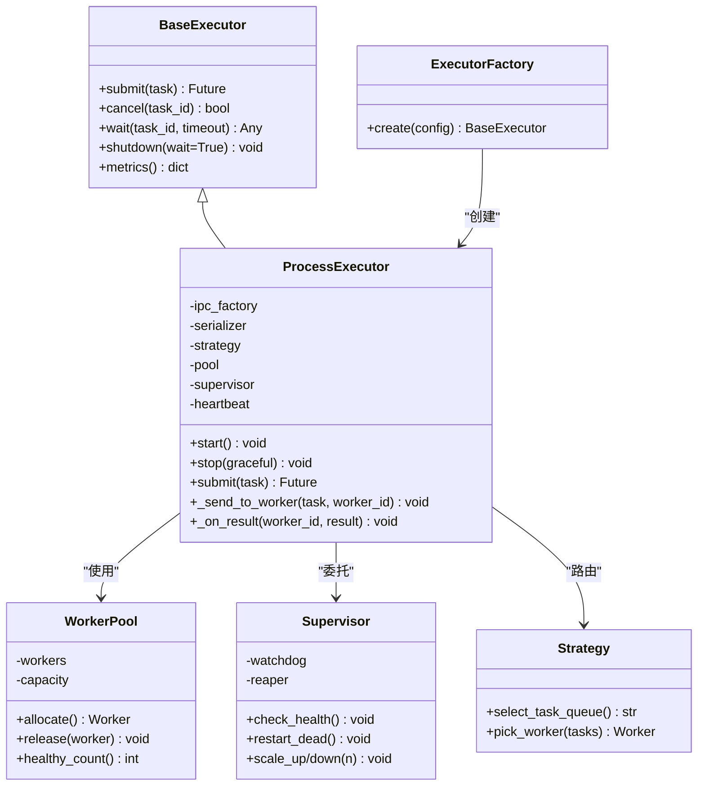
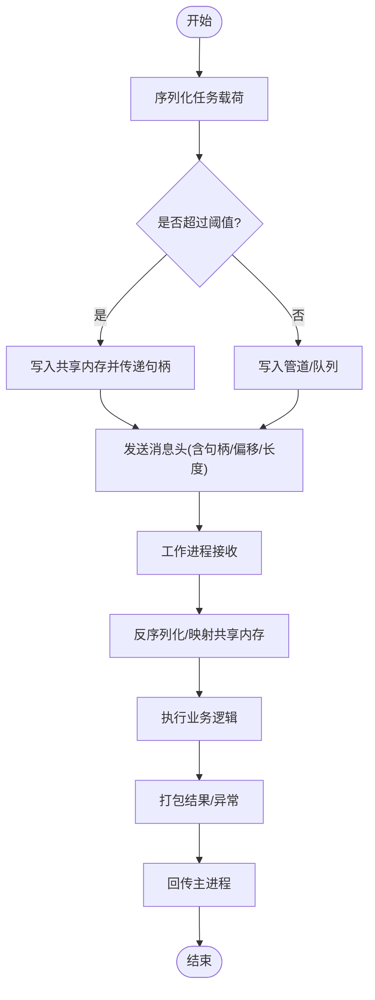
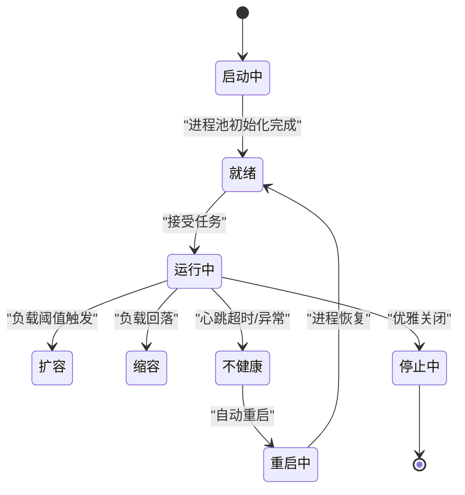
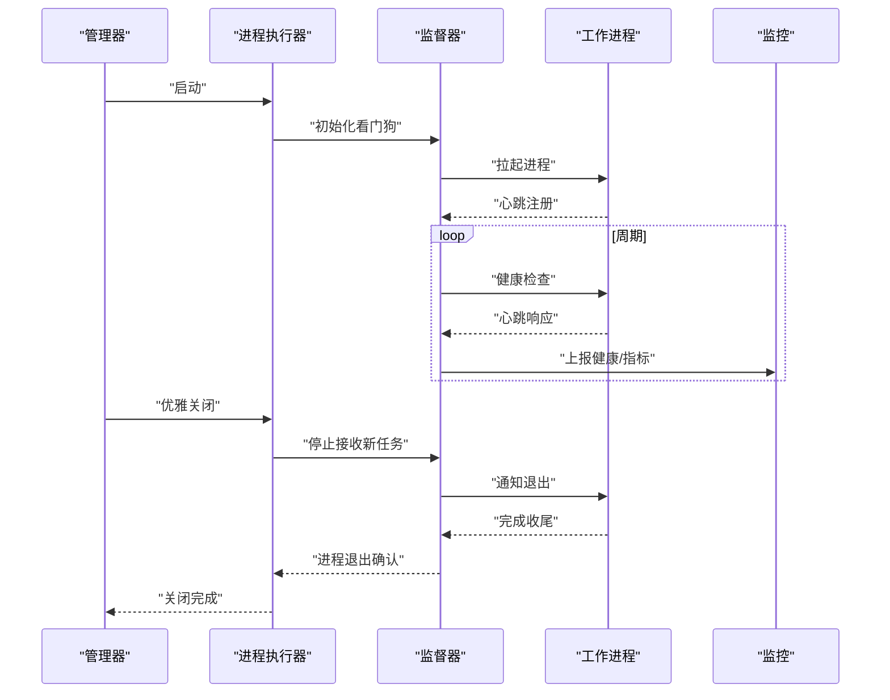
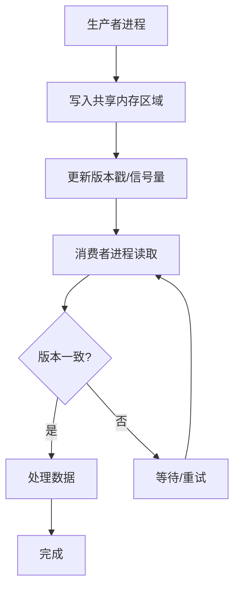
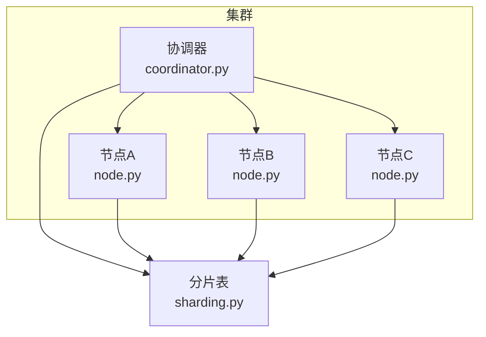
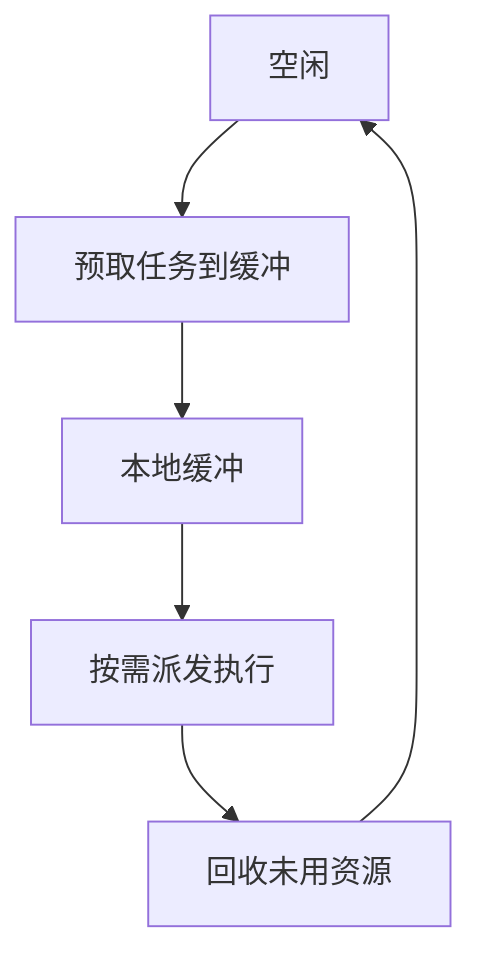
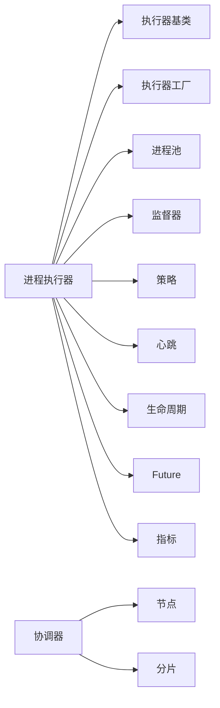

# 进程执行器

<cite>
**本文引用的文件**   
- [process_executor.py](file://src/neotask/executor/process_executor.py)
- [base.py](file://src/neotask/executor/base.py)
- [async_executor.py](file://src/neotask/executor/async_executor.py)
- [thread_executor.py](file://src/neotask/executor/thread_executor.py)
- [factory.py](file://src/neotask/executor/factory.py)
- [exceptions.py](file://src/neotask/executor/exceptions.py)
- [__init__.py](file://src/neotask/executor/__init__.py)
- [task_pool.py](file://src/neotask/api/task_pool.py)
- [task_scheduler.py](file://src/neotask/api/task_scheduler.py)
- [supervisor.py](file://src/neotask/worker/supervisor.py)
- [pool.py](file://src/neotask/worker/pool.py)
- [prefetcher.py](file://src/neotask/worker/prefetcher.py)
- [reclaimer.py](file://src/neotask/worker/reclaimer.py)
- [strategy.py](file://src/neotask/worker/strategy.py)
- [coordinator.py](file://src/neotask/distributed/coordinator.py)
- [node.py](file://src/neotask/distributed/node.py)
- [sharding.py](file://src/neotask/distributed/sharding.py)
- [heartbeat.py](file://src/neotask/core/heartbeat.py)
- [lifecycle.py](file://src/neotask/core/lifecycle.py)
- [context.py](file://src/neotask/core/context.py)
- [future.py](file://src/neotask/core/future.py)
- [metrics.py](file://src/neotask/monitor/metrics.py)
- [collector.py](file://src/neotask/monitor/collector.py)
- [health.py](file://src/neotask/monitor/health.py)
- [reporter.py](file://src/neotask/monitor/reporter.py)
</cite>

## 目录
1. [简介](#简介)
2. [项目结构](#项目结构)
3. [核心组件](#核心组件)
4. [架构总览](#架构总览)
5. [详细组件分析](#详细组件分析)
6. [依赖关系分析](#依赖关系分析)
7. [性能考量](#性能考量)
8. [故障排查指南](#故障排查指南)
9. [结论](#结论)
10. [附录](#附录)

## 简介
本技术文档围绕进程执行器（ProcessExecutor）展开，系统性阐述其多进程执行模型、进程间通信与数据序列化、进程池管理、隔离机制与资源限制、安全考虑、启动监控重启与优雅关闭流程、跨进程状态同步与共享内存使用、IPC 优化、进程级性能调优、内存泄漏检测与故障恢复策略，以及在分布式场景下的进程协调与负载均衡实现细节。文档面向不同层次读者，既提供高层概览，也深入到代码级结构与交互。

## 项目结构
本项目采用分层与按功能域组织相结合的结构：
- executor：执行器抽象与具体实现（线程、异步、进程等）
- worker：工作进程生命周期、预取、回收与调度策略
- distributed：分布式节点、协调器与分片
- core：上下文、心跳、生命周期、Future 等基础能力
- monitor：指标采集、健康检查与上报
- api：对外任务池与调度接口
- storage/queue/lock：存储、队列、锁等基础设施

图表来源
- [process_executor.py:1-200](file://src/neotask/executor/process_executor.py#L1-L200)
- [base.py:1-200](file://src/neotask/executor/base.py#L1-L200)
- [async_executor.py:1-200](file://src/neotask/executor/async_executor.py#L1-L200)
- [thread_executor.py:1-200](file://src/neotask/executor/thread_executor.py#L1-L200)
- [factory.py:1-200](file://src/neotask/executor/factory.py#L1-L200)
- [supervisor.py:1-200](file://src/neotask/worker/supervisor.py#L1-L200)
- [pool.py:1-200](file://src/neotask/worker/pool.py#L1-L200)
- [prefetcher.py:1-200](file://src/neotask/worker/prefetcher.py#L1-L200)
- [reclaimer.py:1-200](file://src/neotask/worker/reclaimer.py#L1-L200)
- [strategy.py:1-200](file://src/neotask/worker/strategy.py#L1-L200)
- [coordinator.py:1-200](file://src/neotask/distributed/coordinator.py#L1-L200)
- [node.py:1-200](file://src/neotask/distributed/node.py#L1-L200)
- [sharding.py:1-200](file://src/neotask/distributed/sharding.py#L1-L200)
- [context.py:1-200](file://src/neotask/core/context.py#L1-L200)
- [heartbeat.py:1-200](file://src/neotask/core/heartbeat.py#L1-L200)
- [lifecycle.py:1-200](file://src/neotask/core/lifecycle.py#L1-L200)
- [future.py:1-200](file://src/neotask/core/future.py#L1-L200)
- [metrics.py:1-200](file://src/neotask/monitor/metrics.py#L1-L200)
- [collector.py:1-200](file://src/neotask/monitor/collector.py#L1-L200)
- [health.py:1-200](file://src/neotask/monitor/health.py#L1-L200)
- [reporter.py:1-200](file://src/neotask/monitor/reporter.py#L1-L200)

章节来源
- [process_executor.py:1-200](file://src/neotask/executor/process_executor.py#L1-L200)
- [base.py:1-200](file://src/neotask/executor/base.py#L1-L200)
- [factory.py:1-200](file://src/neotask/executor/factory.py#L1-L200)
- [supervisor.py:1-200](file://src/neotask/worker/supervisor.py#L1-L200)
- [pool.py:1-200](file://src/neotask/worker/pool.py#L1-L200)
- [prefetcher.py:1-200](file://src/neotask/worker/prefetcher.py#L1-L200)
- [reclaimer.py:1-200](file://src/neotask/worker/reclaimer.py#L1-L200)
- [strategy.py:1-200](file://src/neotask/worker/strategy.py#L1-L200)
- [coordinator.py:1-200](file://src/neotask/distributed/coordinator.py#L1-L200)
- [node.py:1-200](file://src/neotask/distributed/node.py#L1-L200)
- [sharding.py:1-200](file://src/neotask/distributed/sharding.py#L1-L200)
- [context.py:1-200](file://src/neotask/core/context.py#L1-L200)
- [heartbeat.py:1-200](file://src/neotask/core/heartbeat.py#L1-L200)
- [lifecycle.py:1-200](file://src/neotask/core/lifecycle.py#L1-L200)
- [future.py:1-200](file://src/neotask/core/future.py#L1-L200)
- [metrics.py:1-200](file://src/neotask/monitor/metrics.py#L1-L200)
- [collector.py:1-200](file://src/neotask/monitor/collector.py#L1-L200)
- [health.py:1-200](file://src/neotask/monitor/health.py#L1-L200)
- [reporter.py:1-200](file://src/neotask/monitor/reporter.py#L1-L200)

## 核心组件
- 进程执行器（ProcessExecutor）
  - 职责：封装多进程执行模型，负责创建与管理子进程、任务分发、结果收集、异常传播、超时控制、重试与回退。
  - 关键特性：进程隔离、资源限制、可插拔 IPC、序列化策略、监控埋点、优雅关闭。
- 执行器基类（BaseExecutor）
  - 职责：定义统一执行器接口（提交、取消、等待、关闭），提供通用能力（日志、度量、上下文注入）。
- 执行器工厂（ExecutorFactory）
  - 职责：根据配置选择具体执行器（进程/线程/异步），统一管理生命周期。
- 工作进程监督器（Supervisor）
  - 职责：进程池的看门狗，负责进程健康检查、自动重启、资源回收、容量伸缩。
- 进程池（WorkerPool）
  - 职责：维护可用进程集合、分配任务、处理背压与限流、统计利用率。
- 预取器（Prefetcher）
  - 职责：在空闲时预拉取任务到本地缓冲，降低 IPC 延迟。
- 回收器（Reclaimer）
  - 职责：清理僵尸进程、释放句柄、回收内存占用。
- 策略（Strategy）
  - 职责：进程选择策略（轮询、最少负载、亲和性）、任务路由与优先级。
- 分布式协调（Coordinator/Node/Sharding）
  - 职责：集群内进程协调、节点注册发现、分片与负载均衡。
- 核心能力（Context/Heartbeat/Lifecycle/Future）
  - 职责：运行期上下文、心跳保活、生命周期钩子、异步结果对象。
- 监控（Metrics/Collector/Health/Reporter）
  - 职责：指标采集、健康检查、指标上报与告警。

章节来源
- [process_executor.py:1-200](file://src/neotask/executor/process_executor.py#L1-L200)
- [base.py:1-200](file://src/neotask/executor/base.py#L1-L200)
- [factory.py:1-200](file://src/neotask/executor/factory.py#L1-L200)
- [supervisor.py:1-200](file://src/neotask/worker/supervisor.py#L1-L200)
- [pool.py:1-200](file://src/neotask/worker/pool.py#L1-L200)
- [prefetcher.py:1-200](file://src/neotask/worker/prefetcher.py#L1-L200)
- [reclaimer.py:1-200](file://src/neotask/worker/reclaimer.py#L1-L200)
- [strategy.py:1-200](file://src/neotask/worker/strategy.py#L1-L200)
- [coordinator.py:1-200](file://src/neotask/distributed/coordinator.py#L1-L200)
- [node.py:1-200](file://src/neotask/distributed/node.py#L1-L200)
- [sharding.py:1-200](file://src/neotask/distributed/sharding.py#L1-L200)
- [context.py:1-200](file://src/neotask/core/context.py#L1-L200)
- [heartbeat.py:1-200](file://src/neotask/core/heartbeat.py#L1-L200)
- [lifecycle.py:1-200](file://src/neotask/core/lifecycle.py#L1-L200)
- [future.py:1-200](file://src/neotask/core/future.py#L1-L200)
- [metrics.py:1-200](file://src/neotask/monitor/metrics.py#L1-L200)
- [collector.py:1-200](file://src/neotask/monitor/collector.py#L1-L200)
- [health.py:1-200](file://src/neotask/monitor/health.py#L1-L200)
- [reporter.py:1-200](file://src/neotask/monitor/reporter.py#L1-L200)

## 架构总览
进程执行器在多进程环境下将“任务提交—分发—执行—结果回传—监控”形成闭环，并通过监督器与进程池保证高可用与弹性伸缩。

图表来源
- [task_pool.py:1-200](file://src/neotask/api/task_pool.py#L1-L200)
- [process_executor.py:1-200](file://src/neotask/executor/process_executor.py#L1-L200)
- [pool.py:1-200](file://src/neotask/worker/pool.py#L1-L200)
- [metrics.py:1-200](file://src/neotask/monitor/metrics.py#L1-L200)
- [collector.py:1-200](file://src/neotask/monitor/collector.py#L1-L200)

## 详细组件分析

### 进程执行器（ProcessExecutor）
- 设计要点
  - 进程隔离：每个工作进程独立地址空间，避免 GIL 与全局状态污染。
  - IPC 与序列化：支持多种传输（如管道、队列、共享内存）与序列化协议（如 pickle、msgpack、protobuf），可通过配置切换。
  - 任务模型：任务包含元数据（ID、优先级、超时、重试次数、亲和标签）、载荷（可序列化的参数）、回调与上下文。
  - 结果模型：成功值、异常、状态码、耗时、进程信息、追踪 ID。
  - 生命周期：启动、就绪、运行、停止、已停止；支持优雅关闭（drain 未完成任务、拒绝新任务）。
  - 监控埋点：提交/完成/失败计数、P95/P99 耗时、队列长度、进程存活率。
- 关键流程
  - 启动：初始化 IPC、加载策略、预热进程池、注册心跳与健康探针。
  - 提交：校验任务、选择进程、序列化、入队、记录指标。
  - 执行：工作进程反序列化、执行业务逻辑、捕获异常、打包结果、回传。
  - 回收：清理临时文件、释放句柄、更新指标、触发重平衡。
  - 关闭：停止接收新任务、等待进行中任务完成、终止进程、释放资源。
- 错误处理
  - 序列化失败：降级为轻量格式或拆分大对象。
  - 进程崩溃：自动重启、任务重试、标记不健康节点。
  - 超时：中断执行、回收资源、上报超时指标。
  - 死锁/阻塞：心跳超时判定、强制回收。
- 安全考虑
  - 最小权限原则：以受限用户运行工作进程。
  - 输入校验：对任务载荷进行白名单校验与大小限制。
  - 资源隔离：cgroups/ulimit 限制 CPU、内存、文件描述符、网络。
  - 审计与追踪：全链路追踪 ID、敏感字段脱敏。

图表来源
- [base.py:1-200](file://src/neotask/executor/base.py#L1-L200)
- [process_executor.py:1-200](file://src/neotask/executor/process_executor.py#L1-L200)
- [factory.py:1-200](file://src/neotask/executor/factory.py#L1-L200)
- [pool.py:1-200](file://src/neotask/worker/pool.py#L1-L200)
- [supervisor.py:1-200](file://src/neotask/worker/supervisor.py#L1-L200)
- [strategy.py:1-200](file://src/neotask/worker/strategy.py#L1-L200)

章节来源
- [process_executor.py:1-200](file://src/neotask/executor/process_executor.py#L1-L200)
- [base.py:1-200](file://src/neotask/executor/base.py#L1-L200)
- [factory.py:1-200](file://src/neotask/executor/factory.py#L1-L200)
- [pool.py:1-200](file://src/neotask/worker/pool.py#L1-L200)
- [supervisor.py:1-200](file://src/neotask/worker/supervisor.py#L1-L200)
- [strategy.py:1-200](file://src/neotask/worker/strategy.py#L1-L200)

### 进程间通信与数据序列化
- 通信通道
  - 进程内队列/管道：低延迟、适合单机多核。
  - 共享内存：适合大数据块零拷贝传输，需配合引用计数与版本戳避免脏读。
  - 外部总线（可选）：用于跨主机扩展，但会增加延迟与复杂度。
- 序列化策略
  - 默认二进制高效格式（如 msgpack/protobuf），大对象走共享内存+指针传递。
  - 兼容性与容错：版本化 schema、缺失字段容忍、类型校验。
- 优化手段
  - 批量发送与合并响应，减少系统调用。
  - 压缩与分片：对大载荷进行分片与压缩，提升吞吐。
  - 连接复用与池化：减少握手开销。
  - 零拷贝路径：内核态直接转发，避免用户态复制。

图表来源
- [process_executor.py:1-200](file://src/neotask/executor/process_executor.py#L1-L200)
- [pool.py:1-200](file://src/neotask/worker/pool.py#L1-L200)

章节来源
- [process_executor.py:1-200](file://src/neotask/executor/process_executor.py#L1-L200)
- [pool.py:1-200](file://src/neotask/worker/pool.py#L1-L200)

### 进程池管理与资源限制
- 容量与伸缩
  - 固定容量与弹性伸缩：基于负载指标（CPU、队列长度、P99 延迟）动态扩缩容。
  - 亲和性：按任务标签绑定进程，提高缓存命中率。
- 资源限制
  - CPU：按核数与权重分配，防止单进程抢占。
  - 内存：软/硬限制，超限时触发 OOM 保护与重启。
  - I/O：文件描述符、网络端口上限，防止资源耗尽。
- 健康与自愈
  - 心跳检测：周期性探测，超时即标记不健康。
  - 自动重启：指数退避重启，避免雪崩。
  - 优雅退出：等待进行中任务完成，拒绝新任务。

图表来源
- [supervisor.py:1-200](file://src/neotask/worker/supervisor.py#L1-L200)
- [pool.py:1-200](file://src/neotask/worker/pool.py#L1-L200)

章节来源
- [supervisor.py:1-200](file://src/neotask/worker/supervisor.py#L1-L200)
- [pool.py:1-200](file://src/neotask/worker/pool.py#L1-L200)

### 启动、监控、重启与优雅关闭
- 启动流程
  - 解析配置、初始化 IPC、加载策略、启动心跳、预热进程池。
- 监控
  - 指标：提交速率、完成速率、失败率、延迟分布、队列深度、进程存活。
  - 健康：心跳、资源水位、GC 压力、OOM 事件。
- 重启策略
  - 条件：崩溃、长时间无心跳、资源超限。
  - 方式：原地重启、滚动替换、灰度升级。
- 优雅关闭
  - 停止接收新任务、等待进行中任务完成、刷新指标、释放资源、退出进程。

图表来源
- [process_executor.py:1-200](file://src/neotask/executor/process_executor.py#L1-L200)
- [supervisor.py:1-200](file://src/neotask/worker/supervisor.py#L1-L200)
- [heartbeat.py:1-200](file://src/neotask/core/heartbeat.py#L1-L200)
- [metrics.py:1-200](file://src/neotask/monitor/metrics.py#L1-L200)

章节来源
- [process_executor.py:1-200](file://src/neotask/executor/process_executor.py#L1-L200)
- [supervisor.py:1-200](file://src/neotask/worker/supervisor.py#L1-L200)
- [heartbeat.py:1-200](file://src/neotask/core/heartbeat.py#L1-L200)
- [metrics.py:1-200](file://src/neotask/monitor/metrics.py#L1-L200)

### 跨进程状态同步与共享内存
- 状态同步
  - 最终一致性：通过事件总线或外部存储（Redis/DB）同步关键状态。
  - 强一致性：仅在必要时使用分布式锁，避免热点。
- 共享内存
  - 适用场景：大数组、图像、模型权重等只读或写少读多的数据。
  - 并发控制：读写锁、版本号、原子交换，避免竞态。
  - 生命周期：由所有者进程负责释放，其他进程仅持有句柄。
- 优化
  - 预取与缓存：热点数据常驻共享内存，减少重复传输。
  - 增量更新：仅同步差异部分，降低带宽消耗。

图表来源
- [process_executor.py:1-200](file://src/neotask/executor/process_executor.py#L1-L200)
- [pool.py:1-200](file://src/neotask/worker/pool.py#L1-L200)

章节来源
- [process_executor.py:1-200](file://src/neotask/executor/process_executor.py#L1-L200)
- [pool.py:1-200](file://src/neotask/worker/pool.py#L1-L200)

### 分布式场景下的进程协调与负载均衡
- 协调器（Coordinator）
  - 职责：节点注册、领导选举、任务分片、全局状态维护。
- 节点（Node）
  - 职责：本地进程池管理、上报自身能力与负载、参与分片计算。
- 分片（Sharding）
  - 职责：按键空间划分任务，确保同一键路由到同一进程，便于状态局部性。
- 负载均衡
  - 策略：最少连接、加权轮询、亲和路由、热键打散。
  - 自适应：基于实时指标动态调整权重与分片边界。

图表来源
- [coordinator.py:1-200](file://src/neotask/distributed/coordinator.py#L1-L200)
- [node.py:1-200](file://src/neotask/distributed/node.py#L1-L200)
- [sharding.py:1-200](file://src/neotask/distributed/sharding.py#L1-L200)

章节来源
- [coordinator.py:1-200](file://src/neotask/distributed/coordinator.py#L1-L200)
- [node.py:1-200](file://src/neotask/distributed/node.py#L1-L200)
- [sharding.py:1-200](file://src/neotask/distributed/sharding.py#L1-L200)

### 预取与回收机制
- 预取器（Prefetcher）
  - 目标：在空闲时提前拉取任务至本地缓冲，降低首包延迟。
  - 策略：按优先级、亲和性、容量水位动态调整预取数量。
- 回收器（Reclaimer）
  - 目标：及时回收僵尸进程、释放未用句柄、清理临时文件。
  - 策略：定时扫描、事件驱动回收、资源水位触发。

图表来源
- [prefetcher.py:1-200](file://src/neotask/worker/prefetcher.py#L1-L200)
- [reclaimer.py:1-200](file://src/neotask/worker/reclaimer.py#L1-L200)

章节来源
- [prefetcher.py:1-200](file://src/neotask/worker/prefetcher.py#L1-L200)
- [reclaimer.py:1-200](file://src/neotask/worker/reclaimer.py#L1-L200)

## 依赖关系分析
- 内部耦合
  - 进程执行器依赖执行器基类、工厂、进程池、监督器、策略、心跳、生命周期、Future、监控。
  - 分布式模块通过协调器与节点协作，分片表作为路由依据。
- 外部依赖
  - 操作系统进程管理、IPC 原语、序列化库、监控后端（可选 Prometheus/Grafana）。
- 潜在循环依赖
  - 通过接口解耦与事件总线避免直接双向依赖。

图表来源
- [process_executor.py:1-200](file://src/neotask/executor/process_executor.py#L1-L200)
- [base.py:1-200](file://src/neotask/executor/base.py#L1-L200)
- [factory.py:1-200](file://src/neotask/executor/factory.py#L1-L200)
- [pool.py:1-200](file://src/neotask/worker/pool.py#L1-L200)
- [supervisor.py:1-200](file://src/neotask/worker/supervisor.py#L1-L200)
- [strategy.py:1-200](file://src/neotask/worker/strategy.py#L1-L200)
- [heartbeat.py:1-200](file://src/neotask/core/heartbeat.py#L1-L200)
- [lifecycle.py:1-200](file://src/neotask/core/lifecycle.py#L1-L200)
- [future.py:1-200](file://src/neotask/core/future.py#L1-L200)
- [metrics.py:1-200](file://src/neotask/monitor/metrics.py#L1-L200)
- [coordinator.py:1-200](file://src/neotask/distributed/coordinator.py#L1-L200)
- [node.py:1-200](file://src/neotask/distributed/node.py#L1-L200)
- [sharding.py:1-200](file://src/neotask/distributed/sharding.py#L1-L200)

章节来源
- [process_executor.py:1-200](file://src/neotask/executor/process_executor.py#L1-L200)
- [base.py:1-200](file://src/neotask/executor/base.py#L1-L200)
- [factory.py:1-200](file://src/neotask/executor/factory.py#L1-L200)
- [pool.py:1-200](file://src/neotask/worker/pool.py#L1-L200)
- [supervisor.py:1-200](file://src/neotask/worker/supervisor.py#L1-L200)
- [strategy.py:1-200](file://src/neotask/worker/strategy.py#L1-L200)
- [heartbeat.py:1-200](file://src/neotask/core/heartbeat.py#L1-L200)
- [lifecycle.py:1-200](file://src/neotask/core/lifecycle.py#L1-L200)
- [future.py:1-200](file://src/neotask/core/future.py#L1-L200)
- [metrics.py:1-200](file://src/neotask/monitor/metrics.py#L1-L200)
- [coordinator.py:1-200](file://src/neotask/distributed/coordinator.py#L1-L200)
- [node.py:1-200](file://src/neotask/distributed/node.py#L1-L200)
- [sharding.py:1-200](file://src/neotask/distributed/sharding.py#L1-L200)

## 性能考量
- 进程粒度与并行度
  - 根据 CPU 核数与任务特征设置进程数，避免过度上下文切换。
- IPC 优化
  - 批量发送、零拷贝、压缩、分片、连接复用。
- 序列化成本
  - 选择高效格式，避免深拷贝，使用共享内存承载大对象。
- 背压与限流
  - 基于队列长度与 P99 延迟动态限速，防止雪崩。
- 缓存与亲和
  - 热点数据常驻内存，任务亲和到固定进程提升缓存命中。
- 监控与观测
  - 关键指标可视化与告警，定位瓶颈。

[本节为通用指导，无需特定文件来源]

## 故障排查指南
- 常见问题
  - 进程频繁重启：检查心跳超时、OOM、资源限制、异常堆栈。
  - 任务堆积：观察队列长度、进程利用率、IPC 延迟、序列化耗时。
  - 结果不一致：核对序列化版本、共享内存版本戳、幂等性。
  - 分布式抖动：关注协调器健康、节点注册、分片迁移。
- 诊断工具
  - 指标面板：提交/完成/失败、延迟分布、资源水位。
  - 健康探针：心跳、存活时间、最近错误。
  - 日志与追踪：全链路 ID、关键步骤日志、异常堆栈。
- 恢复策略
  - 自动重启与重试、熔断与降级、滚动升级、灰度发布。

章节来源
- [supervisor.py:1-200](file://src/neotask/worker/supervisor.py#L1-L200)
- [metrics.py:1-200](file://src/neotask/monitor/metrics.py#L1-L200)
- [collector.py:1-200](file://src/neotask/monitor/collector.py#L1-L200)
- [health.py:1-200](file://src/neotask/monitor/health.py#L1-L200)
- [reporter.py:1-200](file://src/neotask/monitor/reporter.py#L1-L200)

## 结论
进程执行器通过严格的进程隔离、高效的 IPC 与序列化、健壮的进程池与监督机制，提供了稳定可靠的多进程执行能力。结合分布式协调与分片策略，可在单机与集群环境中实现高吞吐、低延迟与高可用的任务执行。通过完善的监控与自愈策略，系统在复杂生产场景中具备较强的鲁棒性与可运维性。

[本节为总结，无需特定文件来源]

## 附录
- 术语
  - 进程池：一组可复用的工作进程集合。
  - 亲和性：将特定任务固定到某进程以提升缓存命中。
  - 背压：当下游处理能力不足时，上游主动降速。
- 最佳实践
  - 合理设置进程数与队列长度，避免过度排队。
  - 使用高效序列化与共享内存，减少大对象传输成本。
  - 完善监控与告警，建立快速定位与恢复流程。
  - 在分布式场景下，谨慎使用强一致性，优先最终一致性。

[本节为补充说明，无需特定文件来源]