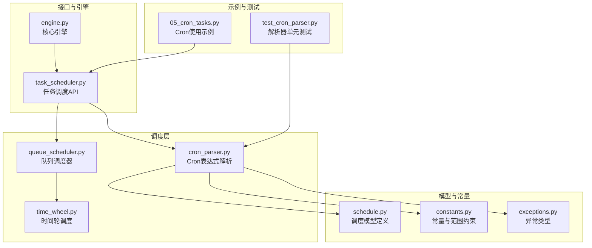
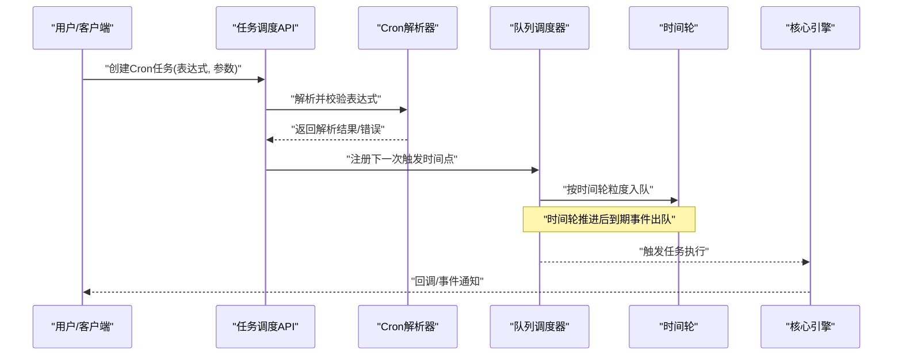
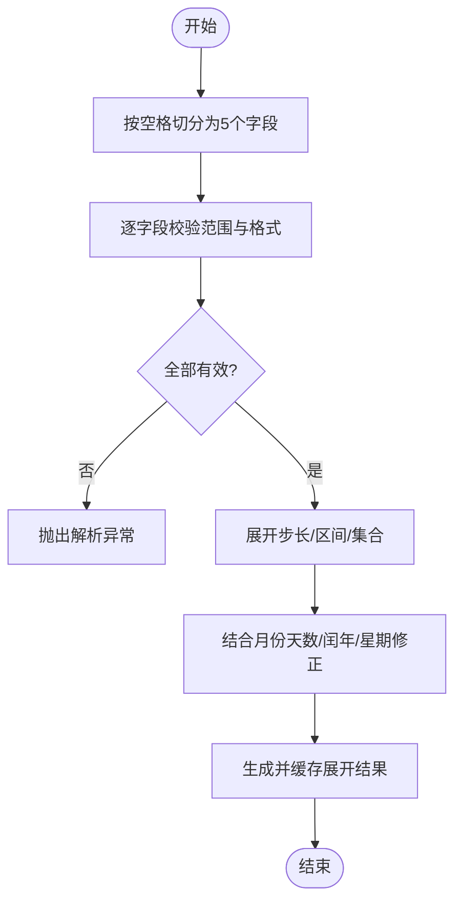
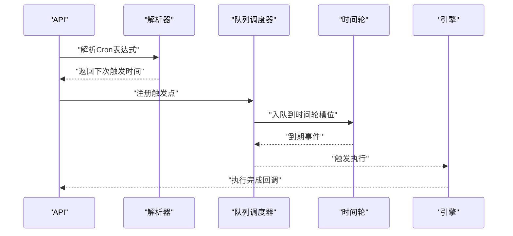
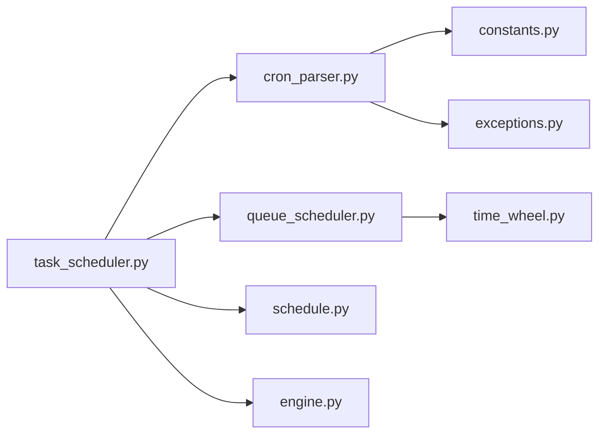

# Cron定时任务

<cite>
**本文引用的文件**   
- [src/neotask/scheduler/cron_parser.py](file://src/neotask/scheduler/cron_parser.py)
- [examples/05_cron_tasks.py](file://examples/05_cron_tasks.py)
- [tests/unit/test_cron_parser.py](file://tests/unit/test_cron_parser.py)
- [src/neotask/models/schedule.py](file://src/neotask/models/schedule.py)
- [src/neotask/core/engine.py](file://src/neotask/core/engine.py)
- [src/neotask/api/task_scheduler.py](file://src/neotask/api/task_scheduler.py)
- [src/neotask/queue/queue_scheduler.py](file://src/neotask/queue/queue_scheduler.py)
- [src/neotask/scheduler/time_wheel.py](file://src/neotask/scheduler/time_wheel.py)
- [src/neotask/common/constants.py](file://src/neotask/common/constants.py)
- [src/neotask/common/exceptions.py](file://src/neotask/common/exceptions.py)
</cite>

## 目录
1. [简介](#简介)
2. [项目结构](#项目结构)
3. [核心组件](#核心组件)
4. [架构总览](#架构总览)
5. [详细组件分析](#详细组件分析)
6. [依赖关系分析](#依赖关系分析)
7. [性能考虑](#性能考虑)
8. [故障排查指南](#故障排查指南)
9. [结论](#结论)
10. [附录](#附录)

## 简介
本章节聚焦于Cron定时任务的创建与管理，涵盖以下主题：
- Cron表达式语法规则与字段说明（分钟、小时、日期、月份、星期）
- Cron解析器的实现原理与性能优化策略
- 丰富的使用场景示例（每分钟执行、每天特定时间、每周特定时间等）
- 表达式验证方法与常见错误处理
- 系统时区兼容性与夏令时处理机制

## 项目结构
围绕Cron定时任务的关键代码分布在调度器、模型、API、队列与测试等模块中。下图展示了与Cron相关的核心文件及其职责。

**图表来源**
- [src/neotask/scheduler/cron_parser.py](file://src/neotask/scheduler/cron_parser.py)
- [src/neotask/scheduler/time_wheel.py](file://src/neotask/scheduler/time_wheel.py)
- [src/neotask/queue/queue_scheduler.py](file://src/neotask/queue/queue_scheduler.py)
- [src/neotask/models/schedule.py](file://src/neotask/models/schedule.py)
- [src/neotask/common/constants.py](file://src/neotask/common/constants.py)
- [src/neotask/common/exceptions.py](file://src/neotask/common/exceptions.py)
- [src/neotask/api/task_scheduler.py](file://src/neotask/api/task_scheduler.py)
- [src/neotask/core/engine.py](file://src/neotask/core/engine.py)
- [examples/05_cron_tasks.py](file://examples/05_cron_tasks.py)
- [tests/unit/test_cron_parser.py](file://tests/unit/test_cron_parser.py)

**章节来源**
- [src/neotask/scheduler/cron_parser.py](file://src/neotask/scheduler/cron_parser.py)
- [src/neotask/models/schedule.py](file://src/neotask/models/schedule.py)
- [src/neotask/api/task_scheduler.py](file://src/neotask/api/task_scheduler.py)
- [src/neotask/queue/queue_scheduler.py](file://src/neotask/queue/queue_scheduler.py)
- [src/neotask/scheduler/time_wheel.py](file://src/neotask/scheduler/time_wheel.py)
- [src/neotask/common/constants.py](file://src/neotask/common/constants.py)
- [src/neotask/common/exceptions.py](file://src/neotask/common/exceptions.py)
- [examples/05_cron_tasks.py](file://examples/05_cron_tasks.py)
- [tests/unit/test_cron_parser.py](file://tests/unit/test_cron_parser.py)

## 核心组件
- Cron表达式解析器：负责将字符串形式的Cron表达式解析为内部可执行的调度规则，包含字段校验、范围检查与语义化展开。
- 调度模型：定义Cron任务的结构化表示，便于持久化、查询与展示。
- 队列调度器：基于时间轮或优先级队列，将即将到期的Cron触发点入队，驱动任务执行。
- 任务调度API：提供创建、更新、删除与查询Cron任务的统一接口。
- 核心引擎：协调解析、调度、执行与监控，确保高吞吐与低延迟。

**章节来源**
- [src/neotask/scheduler/cron_parser.py](file://src/neotask/scheduler/cron_parser.py)
- [src/neotask/models/schedule.py](file://src/neotask/models/schedule.py)
- [src/neotask/queue/queue_scheduler.py](file://src/neotask/queue/queue_scheduler.py)
- [src/neotask/api/task_scheduler.py](file://src/neotask/api/task_scheduler.py)
- [src/neotask/core/engine.py](file://src/neotask/core/engine.py)

## 架构总览
下图展示了从用户调用到任务触发的完整流程，包括Cron解析、时间轮调度、队列入队与执行。

**图表来源**
- [src/neotask/api/task_scheduler.py](file://src/neotask/api/task_scheduler.py)
- [src/neotask/scheduler/cron_parser.py](file://src/neotask/scheduler/cron_parser.py)
- [src/neotask/queue/queue_scheduler.py](file://src/neotask/queue/queue_scheduler.py)
- [src/neotask/scheduler/time_wheel.py](file://src/neotask/scheduler/time_wheel.py)
- [src/neotask/core/engine.py](file://src/neotask/core/engine.py)

## 详细组件分析

### Cron表达式语法规则
- 字段顺序与含义
  - 分钟：0-59
  - 小时：0-23
  - 日期：1-31（受月份天数限制）
  - 月份：1-12
  - 星期：0-6（0通常表示周日，具体以实现为准）
- 通配符与步长
  - “*”表示任意值
  - “*/n”表示每隔n个单位
  - “a-b”表示区间
  - “a-b/n”表示区间内每隔n个单位
  - 多个值可用逗号分隔，如“1,3,5”
- 特殊字符
  - “L”表示月末或周末最后一天（取决于字段）
  - “W”表示工作日最近的工作日
  - “#”表示某月的第几个星期几（例如“5#2”表示第二个星期五）
- 兼容性
  - 支持标准Cron语法扩展；若出现不支持的字符或组合，解析器应返回明确的错误信息

**章节来源**
- [src/neotask/scheduler/cron_parser.py](file://src/neotask/scheduler/cron_parser.py)
- [src/neotask/common/constants.py](file://src/neotask/common/constants.py)
- [src/neotask/common/exceptions.py](file://src/neotask/common/exceptions.py)

### Cron解析器实现原理
- 解析流程
  - 词法切分：按空格分割为五个字段
  - 语法校验：检查每个字段的取值范围与格式
  - 语义展开：将步长、区间、集合等转换为可枚举的时间点集合或迭代器
  - 边界处理：结合月份天数、闰年、星期映射进行修正
- 数据结构
  - 使用位图或集合存储已展开的合法时间点，便于快速判断是否匹配
  - 对高频字段（分钟、小时）采用预计算缓存，降低重复解析开销
- 复杂度
  - 单次解析时间复杂度近似O(n)，n为表达式中的元素数量
  - 空间复杂度与展开后的时间点数量相关，建议按需懒加载与增量计算

**图表来源**
- [src/neotask/scheduler/cron_parser.py](file://src/neotask/scheduler/cron_parser.py)
- [src/neotask/common/constants.py](file://src/neotask/common/constants.py)
- [src/neotask/common/exceptions.py](file://src/neotask/common/exceptions.py)

**章节来源**
- [src/neotask/scheduler/cron_parser.py](file://src/neotask/scheduler/cron_parser.py)
- [src/neotask/common/constants.py](file://src/neotask/common/constants.py)
- [src/neotask/common/exceptions.py](file://src/neotask/common/exceptions.py)

### 调度与执行流程
- 注册与入队
  - 解析成功后，计算下一次触发时间并加入队列调度器
  - 队列调度器根据时间轮粒度将触发点分配到对应槽位
- 到期与执行
  - 时间轮推进后，到期事件出队并交由核心引擎执行
  - 执行完成后，重新计算下一次触发时间并再次入队

**图表来源**
- [src/neotask/api/task_scheduler.py](file://src/neotask/api/task_scheduler.py)
- [src/neotask/scheduler/cron_parser.py](file://src/neotask/scheduler/cron_parser.py)
- [src/neotask/queue/queue_scheduler.py](file://src/neotask/queue/queue_scheduler.py)
- [src/neotask/scheduler/time_wheel.py](file://src/neotask/scheduler/time_wheel.py)
- [src/neotask/core/engine.py](file://src/neotask/core/engine.py)

**章节来源**
- [src/neotask/queue/queue_scheduler.py](file://src/neotask/queue/queue_scheduler.py)
- [src/neotask/scheduler/time_wheel.py](file://src/neotask/scheduler/time_wheel.py)
- [src/neotask/core/engine.py](file://src/neotask/core/engine.py)

### 使用场景与示例路径
以下为常用Cron表达式的典型场景与示例文件路径（不直接展示代码内容）：
- 每分钟执行：参考[示例路径](file://examples/05_cron_tasks.py)
- 每小时整点执行：参考[示例路径](file://examples/05_cron_tasks.py)
- 每天固定时间执行（如每日10:30）：参考[示例路径](file://examples/05_cron_tasks.py)
- 每周一上午9:00执行：参考[示例路径](file://examples/05_cron_tasks.py)
- 每月1号凌晨2:00执行：参考[示例路径](file://examples/05_cron_tasks.py)
- 工作日（周一至周五）上午9:30执行：参考[示例路径](file://examples/05_cron_tasks.py)
- 每隔15分钟执行一次：参考[示例路径](file://examples/05_cron_tasks.py)
- 复杂组合（多值+步长+区间）：参考[示例路径](file://examples/05_cron_tasks.py)

**章节来源**
- [examples/05_cron_tasks.py](file://examples/05_cron_tasks.py)

### 验证方法与错误处理
- 验证方法
  - 在创建任务前调用解析器进行表达式校验
  - 捕获并记录解析异常，向用户提供清晰的错误提示
- 常见错误
  - 字段越界（如分钟>59、小时>23）
  - 非法字符或组合（如不支持的通配符）
  - 日期与月份不匹配（如2月30日）
  - 星期与日期冲突（同时指定导致无解）
- 错误处理策略
  - 返回结构化错误码与消息
  - 提供修复建议（如调整范围、移除冲突字段）

**章节来源**
- [src/neotask/scheduler/cron_parser.py](file://src/neotask/scheduler/cron_parser.py)
- [src/neotask/common/exceptions.py](file://src/neotask/common/exceptions.py)
- [tests/unit/test_cron_parser.py](file://tests/unit/test_cron_parser.py)

### 时区兼容性与夏令时处理
- 时区设置
  - 建议在应用启动时统一配置系统时区，避免不同节点不一致
  - Cron解析与触发时间计算应基于统一的UTC或本地时区
- 夏令时
  - 在时钟回拨期间，可能出现重复触发；需去重或幂等处理
  - 在时钟前进期间，可能出现跳过触发；需补偿策略或告警
- 最佳实践
  - 优先使用UTC存储与计算，展示层再转换为用户本地时区
  - 对关键任务增加幂等键与重试策略，保证一致性

**章节来源**
- [src/neotask/scheduler/cron_parser.py](file://src/neotask/scheduler/cron_parser.py)
- [src/neotask/common/constants.py](file://src/neotask/common/constants.py)

## 依赖关系分析
下图展示了Cron相关模块之间的依赖关系与交互方式。

**图表来源**
- [src/neotask/api/task_scheduler.py](file://src/neotask/api/task_scheduler.py)
- [src/neotask/scheduler/cron_parser.py](file://src/neotask/scheduler/cron_parser.py)
- [src/neotask/queue/queue_scheduler.py](file://src/neotask/queue/queue_scheduler.py)
- [src/neotask/scheduler/time_wheel.py](file://src/neotask/scheduler/time_wheel.py)
- [src/neotask/models/schedule.py](file://src/neotask/models/schedule.py)
- [src/neotask/common/constants.py](file://src/neotask/common/constants.py)
- [src/neotask/common/exceptions.py](file://src/neotask/common/exceptions.py)
- [src/neotask/core/engine.py](file://src/neotask/core/engine.py)

**章节来源**
- [src/neotask/api/task_scheduler.py](file://src/neotask/api/task_scheduler.py)
- [src/neotask/scheduler/cron_parser.py](file://src/neotask/scheduler/cron_parser.py)
- [src/neotask/queue/queue_scheduler.py](file://src/neotask/queue/queue_scheduler.py)
- [src/neotask/scheduler/time_wheel.py](file://src/neotask/scheduler/time_wheel.py)
- [src/neotask/models/schedule.py](file://src/neotask/models/schedule.py)
- [src/neotask/common/constants.py](file://src/neotask/common/constants.py)
- [src/neotask/common/exceptions.py](file://src/neotask/common/exceptions.py)
- [src/neotask/core/engine.py](file://src/neotask/core/engine.py)

## 性能考虑
- 解析优化
  - 预计算与缓存：对常用表达式进行缓存，减少重复解析
  - 懒加载：仅在需要时展开时间点，避免一次性构建大集合
- 调度优化
  - 时间轮粒度：合理设置秒级/分钟级槽位，平衡内存与延迟
  - 批量入队：合并相近时间的触发点，减少锁竞争
- 执行优化
  - 幂等设计：确保重复触发不影响业务正确性
  - 超时与熔断：防止长时间阻塞影响整体吞吐

[本节为通用性能指导，无需列出具体文件来源]

## 故障排查指南
- 常见问题定位
  - 表达式无效：检查字段范围与特殊字符用法
  - 未触发：确认时区设置与夏令时影响
  - 重复触发：检查时钟回拨与幂等处理
- 日志与指标
  - 记录解析失败与触发异常
  - 暴露调度延迟、入队/出队速率等指标
- 复现与回归
  - 使用单元测试覆盖边界条件与异常路径
  - 引入混沌测试验证极端场景下的稳定性

**章节来源**
- [tests/unit/test_cron_parser.py](file://tests/unit/test_cron_parser.py)
- [src/neotask/common/exceptions.py](file://src/neotask/common/exceptions.py)

## 结论
通过完善的Cron解析器、高效的时间轮调度与健壮的异常处理，本系统实现了稳定可靠的定时任务能力。遵循本文的语法规则、验证方法与性能优化建议，可在生产环境中安全地管理各类Cron任务，并妥善处理时区与夏令时带来的复杂性。

[本节为总结性内容，无需列出具体文件来源]

## 附录
- 术语表
  - Cron表达式：用于描述周期性触发条件的字符串
  - 时间轮：基于环形缓冲区的调度数据结构
  - 幂等：多次执行产生相同效果的操作
- 参考文件
  - 示例：[examples/05_cron_tasks.py](file://examples/05_cron_tasks.py)
  - 解析器：[src/neotask/scheduler/cron_parser.py](file://src/neotask/scheduler/cron_parser.py)
  - 模型：[src/neotask/models/schedule.py](file://src/neotask/models/schedule.py)
  - 调度API：[src/neotask/api/task_scheduler.py](file://src/neotask/api/task_scheduler.py)
  - 队列调度：[src/neotask/queue/queue_scheduler.py](file://src/neotask/queue/queue_scheduler.py)
  - 时间轮：[src/neotask/scheduler/time_wheel.py](file://src/neotask/scheduler/time_wheel.py)
  - 常量与异常：[src/neotask/common/constants.py](file://src/neotask/common/constants.py), [src/neotask/common/exceptions.py](file://src/neotask/common/exceptions.py)
  - 单元测试：[tests/unit/test_cron_parser.py](file://tests/unit/test_cron_parser.py)