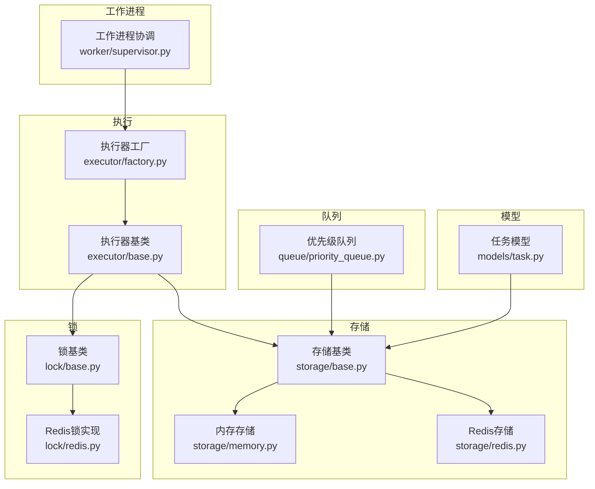
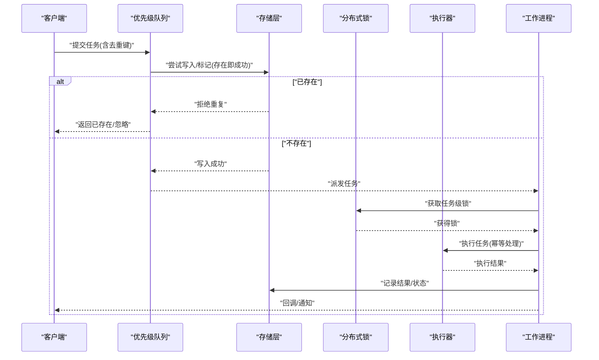
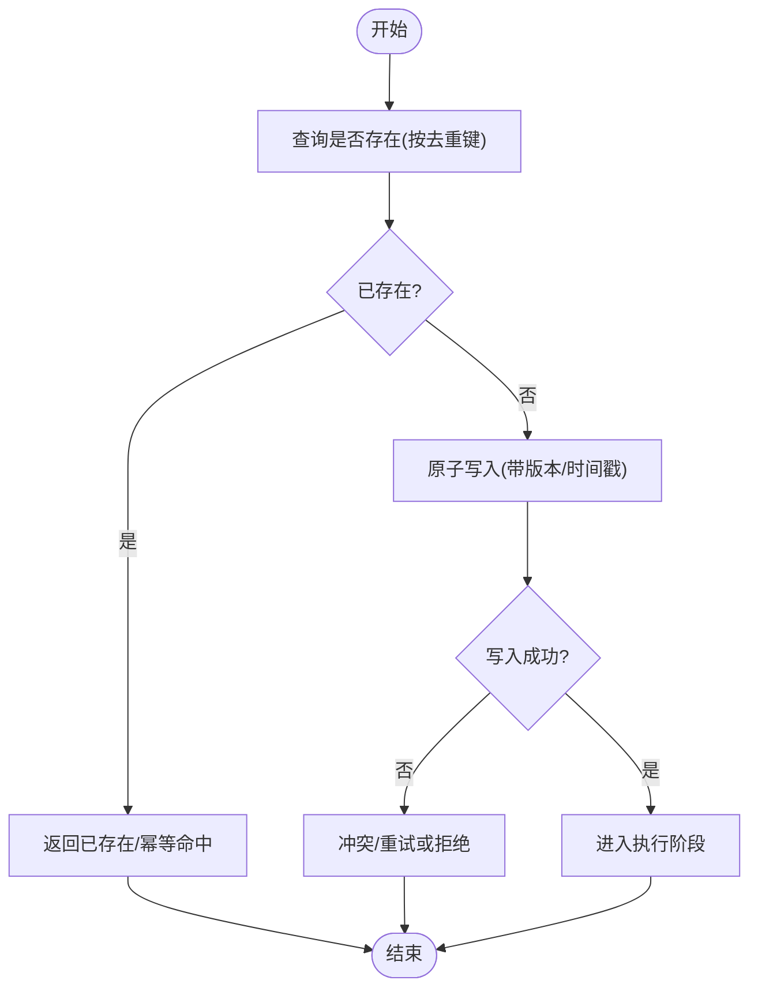
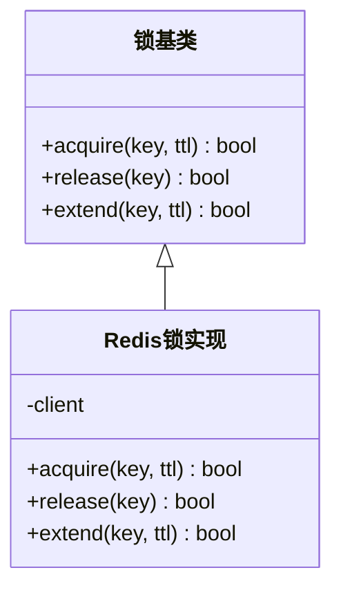
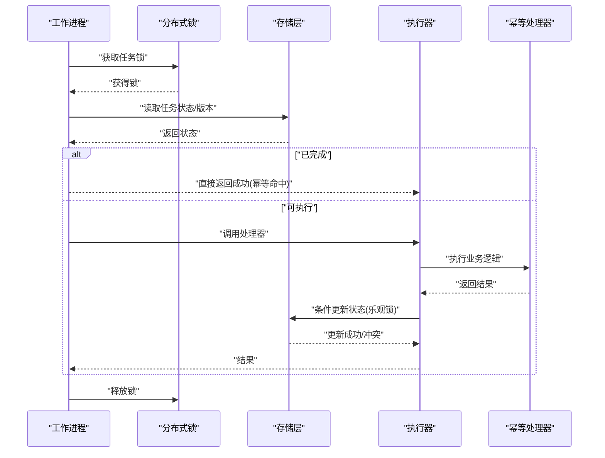
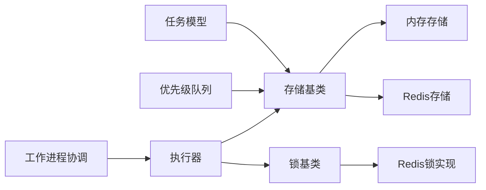

# 任务去重与幂等性

<cite>
**本文引用的文件**   
- [src/neotask/executor/base.py](file://src/neotask/executor/base.py)
- [src/neotask/executor/factory.py](file://src/neotask/executor/factory.py)
- [src/neotask/models/task.py](file://src/neotask/models/task.py)
- [src/neotask/storage/base.py](file://src/neotask/storage/base.py)
- [src/neotask/storage/memory.py](file://src/neotask/storage/memory.py)
- [src/neotask/storage/redis.py](file://src/neotask/storage/redis.py)
- [src/neotask/lock/base.py](file://src/neotask/lock/base.py)
- [src/neotask/lock/redis.py](file://src/neotask/lock/redis.py)
- [src/neotask/queue/priority_queue.py](file://src/neotask/queue/priority_queue.py)
- [src/neotask/worker/supervisor.py](file://src/neotask/worker/supervisor.py)
- [examples/09_retry_and_cancel.py](file://examples/09_retry_and_cancel.py)
</cite>

## 目录
1. [简介](#简介)
2. [项目结构](#项目结构)
3. [核心组件](#核心组件)
4. [架构总览](#架构总览)
5. [详细组件分析](#详细组件分析)
6. [依赖关系分析](#依赖关系分析)
7. [性能考量](#性能考量)
8. [故障排查指南](#故障排查指南)
9. [结论](#结论)
10. [附录](#附录)

## 简介
本文件系统性阐述任务调度系统中的“任务去重”和“幂等执行”机制，覆盖以下要点：
- 任务唯一性标识的生成规则与去重策略（基于任务ID、任务内容、执行参数）
- 幂等性保证的实现原理（状态检查、条件更新、乐观锁）
- 分布式环境下的去重方案（Redis分布式锁、数据库唯一约束）
- 重试场景下的幂等性保障
- 重复执行的检测与恢复机制
- 性能影响分析与最佳实践建议

## 项目结构
围绕去重与幂等的关键模块分布如下：
- 模型层：定义任务结构与唯一性相关字段
- 存储层：提供持久化与去重能力（内存、SQLite、Redis）
- 锁服务：提供分布式锁抽象与Redis实现
- 队列层：入队前过滤重复任务
- 执行器与工厂：封装幂等执行流程与重试策略
- 工作进程协调：统一调度与异常恢复

图表来源
- [src/neotask/models/task.py](file://src/neotask/models/task.py)
- [src/neotask/storage/base.py](file://src/neotask/storage/base.py)
- [src/neotask/storage/memory.py](file://src/neotask/storage/memory.py)
- [src/neotask/storage/redis.py](file://src/neotask/storage/redis.py)
- [src/neotask/lock/base.py](file://src/neotask/lock/base.py)
- [src/neotask/lock/redis.py](file://src/neotask/lock/redis.py)
- [src/neotask/queue/priority_queue.py](file://src/neotask/queue/priority_queue.py)
- [src/neotask/executor/base.py](file://src/neotask/executor/base.py)
- [src/neotask/executor/factory.py](file://src/neotask/executor/factory.py)
- [src/neotask/worker/supervisor.py](file://src/neotask/worker/supervisor.py)

章节来源
- [src/neotask/models/task.py](file://src/neotask/models/task.py)
- [src/neotask/storage/base.py](file://src/neotask/storage/base.py)
- [src/neotask/lock/base.py](file://src/neotask/lock/base.py)
- [src/neotask/executor/base.py](file://src/neotask/executor/base.py)
- [src/neotask/executor/factory.py](file://src/neotask/executor/factory.py)
- [src/neotask/queue/priority_queue.py](file://src/neotask/queue/priority_queue.py)
- [src/neotask/worker/supervisor.py](file://src/neotask/worker/supervisor.py)

## 核心组件
- 任务模型：承载任务元数据与唯一性标识，用于去重键计算与幂等判断
- 存储层：提供“存在即成功”的原子写入语义（如插入时返回是否新增），作为去重与幂等的基石
- 锁服务：在分布式环境下对同一任务维度加锁，避免并发重复执行
- 队列层：入队前进行去重过滤，降低下游压力
- 执行器：封装幂等执行流程，结合重试策略确保最终一致性
- 工作进程协调：负责任务生命周期管理、失败恢复与监控

章节来源
- [src/neotask/models/task.py](file://src/neotask/models/task.py)
- [src/neotask/storage/base.py](file://src/neotask/storage/base.py)
- [src/neotask/storage/memory.py](file://src/neotask/storage/memory.py)
- [src/neotask/storage/redis.py](file://src/neotask/storage/redis.py)
- [src/neotask/lock/base.py](file://src/neotask/lock/base.py)
- [src/neotask/lock/redis.py](file://src/neotask/lock/redis.py)
- [src/neotask/executor/base.py](file://src/neotask/executor/base.py)
- [src/neotask/executor/factory.py](file://src/neotask/executor/factory.py)
- [src/neotask/queue/priority_queue.py](file://src/neotask/queue/priority_queue.py)
- [src/neotask/worker/supervisor.py](file://src/neotask/worker/supervisor.py)

## 架构总览
下图展示从任务提交到执行的全链路中，去重与幂等在各层的落点。

图表来源
- [src/neotask/queue/priority_queue.py](file://src/neotask/queue/priority_queue.py)
- [src/neotask/storage/base.py](file://src/neotask/storage/base.py)
- [src/neotask/lock/base.py](file://src/neotask/lock/base.py)
- [src/neotask/executor/base.py](file://src/neotask/executor/base.py)
- [src/neotask/worker/supervisor.py](file://src/neotask/worker/supervisor.py)

## 详细组件分析

### 任务唯一性标识与去重键
- 任务ID维度：若任务携带稳定ID，可直接以ID为去重键
- 任务内容维度：对不可变内容（函数名、参数序列化）做哈希，得到内容指纹
- 执行参数维度：对关键参数子集做规范化后哈希，形成细粒度去重键
- 组合策略：支持“ID优先，否则内容指纹，最后回退到参数指纹”的降级策略

章节来源
- [src/neotask/models/task.py](file://src/neotask/models/task.py)

### 存储层去重与幂等写入
- 原子写入语义：通过“插入即成功”或“存在即成功”的接口，避免重复写入
- 状态机推进：仅允许向更高终态迁移（如待执行→执行中→完成），防止回退
- 条件更新：使用版本字段或时间戳进行乐观锁校验，冲突则拒绝并提示重试
- 多后端适配：内存、SQLite、Redis均遵循相同接口契约，便于横向扩展

图表来源
- [src/neotask/storage/base.py](file://src/neotask/storage/base.py)
- [src/neotask/storage/memory.py](file://src/neotask/storage/memory.py)
- [src/neotask/storage/redis.py](file://src/neotask/storage/redis.py)

章节来源
- [src/neotask/storage/base.py](file://src/neotask/storage/base.py)
- [src/neotask/storage/memory.py](file://src/neotask/storage/memory.py)
- [src/neotask/storage/redis.py](file://src/neotask/storage/redis.py)

### 分布式锁与并发控制
- 锁粒度：以任务去重键为锁粒度，确保同一任务在同一时刻仅被一个消费者执行
- 锁租约与看门狗：设置过期时间与自动续期，避免死锁
- 锁获取失败：快速失败或退避重试，配合上层幂等逻辑保证最终一致

图表来源
- [src/neotask/lock/base.py](file://src/neotask/lock/base.py)
- [src/neotask/lock/redis.py](file://src/neotask/lock/redis.py)

章节来源
- [src/neotask/lock/base.py](file://src/neotask/lock/base.py)
- [src/neotask/lock/redis.py](file://src/neotask/lock/redis.py)

### 执行器与幂等执行流程
- 幂等处理器约定：处理器需对输入进行幂等判定（例如根据业务主键+版本号）
- 重试安全：在重试路径上先查状态，若已完成则直接返回成功；若执行中则等待或拒绝
- 事务边界：将“状态推进+副作用”置于同一事务或具备原子性的操作中

图表来源
- [src/neotask/executor/base.py](file://src/neotask/executor/base.py)
- [src/neotask/executor/factory.py](file://src/neotask/executor/factory.py)
- [src/neotask/storage/base.py](file://src/neotask/storage/base.py)
- [src/neotask/lock/base.py](file://src/neotask/lock/base.py)

章节来源
- [src/neotask/executor/base.py](file://src/neotask/executor/base.py)
- [src/neotask/executor/factory.py](file://src/neotask/executor/factory.py)

### 队列层去重
- 入队前过滤：在入队时依据去重键查询存储，若已存在则拒绝入队
- 批量去重：对批量任务进行集合去重，减少存储访问次数
- 延迟队列兼容：对延迟任务同样应用去重策略，避免重复延迟入队

章节来源
- [src/neotask/queue/priority_queue.py](file://src/neotask/queue/priority_queue.py)

### 工作进程协调与恢复
- 任务拉取：从队列取出任务后，先进行幂等检查再执行
- 失败恢复：对超时或中断的任务进行重新入队或补偿，同时保持幂等
- 监控上报：记录重复检测、锁竞争、冲突重试等指标，辅助定位问题

章节来源
- [src/neotask/worker/supervisor.py](file://src/neotask/worker/supervisor.py)

### 重试场景下的幂等性
- 重试策略：指数退避、最大重试次数、死信队列兜底
- 幂等保证：每次重试前先读状态，若已完成则直接返回；若执行中则等待或拒绝
- 示例参考：参见示例脚本中的重试与取消用法

章节来源
- [examples/09_retry_and_cancel.py](file://examples/09_retry_and_cancel.py)

## 依赖关系分析
- 低耦合高内聚：存储与锁均为抽象接口，具体实现可替换
- 明确边界：队列负责入队去重，执行器负责运行时幂等，存储负责持久化一致性
- 外部依赖：Redis用于分布式锁与高性能存储，SQLite/内存用于单机或轻量部署

图表来源
- [src/neotask/models/task.py](file://src/neotask/models/task.py)
- [src/neotask/storage/base.py](file://src/neotask/storage/base.py)
- [src/neotask/storage/memory.py](file://src/neotask/storage/memory.py)
- [src/neotask/storage/redis.py](file://src/neotask/storage/redis.py)
- [src/neotask/lock/base.py](file://src/neotask/lock/base.py)
- [src/neotask/lock/redis.py](file://src/neotask/lock/redis.py)
- [src/neotask/queue/priority_queue.py](file://src/neotask/queue/priority_queue.py)
- [src/neotask/executor/base.py](file://src/neotask/executor/base.py)
- [src/neotask/worker/supervisor.py](file://src/neotask/worker/supervisor.py)

章节来源
- [src/neotask/storage/base.py](file://src/neotask/storage/base.py)
- [src/neotask/lock/base.py](file://src/neotask/lock/base.py)
- [src/neotask/executor/base.py](file://src/neotask/executor/base.py)
- [src/neotask/queue/priority_queue.py](file://src/neotask/queue/priority_queue.py)
- [src/neotask/worker/supervisor.py](file://src/neotask/worker/supervisor.py)

## 性能考量
- 去重键选择
  - 短键优先：尽量使用稳定的短键（如任务ID）以减少网络与序列化开销
  - 内容指纹：仅在无稳定ID时使用，注意哈希碰撞概率与CPU成本
- 存储访问
  - 批量去重：合并多次查询，降低往返次数
  - 读写分离：只读副本用于幂等检查，主库用于写入
- 锁竞争
  - 合理设置TTL与续期，避免长持有导致热点任务阻塞
  - 失败快速返回，配合上层重试退避
- 重试与退避
  - 指数退避+抖动，避免雪崩
  - 限制最大重试次数，超限转入死信队列
- 监控与观测
  - 记录重复率、锁命中率、冲突重试次数、平均幂等命中耗时

[本节为通用指导，不直接分析具体文件]

## 故障排查指南
- 常见现象
  - 任务重复执行：检查去重键是否稳定、入队前是否做了存在性判断
  - 锁竞争严重：缩短锁持有时间，优化幂等处理器逻辑
  - 冲突重试过多：检查乐观锁版本字段是否正确递增
- 定位步骤
  - 查看任务状态流转日志，确认是否出现状态回退
  - 核对幂等处理器是否对“已完成”状态短路返回
  - 观察锁获取/释放日志，确认是否存在未释放或过期异常
- 修复建议
  - 修正去重键生成规则，确保业务主键参与
  - 增加幂等前置检查与条件更新
  - 调整重试策略与死信策略

章节来源
- [src/neotask/storage/base.py](file://src/neotask/storage/base.py)
- [src/neotask/lock/base.py](file://src/neotask/lock/base.py)
- [src/neotask/executor/base.py](file://src/neotask/executor/base.py)
- [src/neotask/worker/supervisor.py](file://src/neotask/worker/supervisor.py)

## 结论
通过“入队前去重 + 分布式锁 + 幂等处理器 + 条件更新/乐观锁”的组合策略，系统可在单机与分布式环境下有效避免任务重复执行，并在重试、崩溃恢复等异常场景下保持一致性与最终一致性。建议在生产环境中结合监控指标持续优化去重键设计、锁粒度与重试策略，以获得更佳的吞吐与稳定性。

[本节为总结性内容，不直接分析具体文件]

## 附录
- 示例参考
  - 重试与取消：[examples/09_retry_and_cancel.py](file://examples/09_retry_and_cancel.py)
- 接口契约
  - 存储层：[src/neotask/storage/base.py](file://src/neotask/storage/base.py)
  - 锁服务：[src/neotask/lock/base.py](file://src/neotask/lock/base.py)
  - 执行器：[src/neotask/executor/base.py](file://src/neotask/executor/base.py)