# 任务调度功能

<cite>
**本文引用的文件**   
- [README_zh.md](file://README_zh.md)
- [05_cron_tasks.py](file://examples/05_cron_tasks.py)
- [06_delayed_tasks.py](file://examples/06_delayed_tasks.py)
- [08_periodic.py](file://examples/08_periodic.py)
- [03_priority.py](file://examples/03_priority.py)
- [09_retry_and_cancel.py](file://examples/09_retry_and_cancel.py)
- [task_scheduler.py](file://src/neotask/api/task_scheduler.py)
- [cron_parser.py](file://src/neotask/scheduler/cron_parser.py)
- [time_wheel.py](file://src/neotask/scheduler/time_wheel.py)
- [periodic.py](file://src/neotask/scheduler/periodic.py)
- [priority_queue.py](file://src/neotask/queue/priority_queue.py)
- [delayed_queue.py](file://src/neotask/queue/delayed_queue.py)
- [queue_scheduler.py](file://src/neotask/queue/queue_scheduler.py)
- [engine.py](file://src/neotask/core/engine.py)
- [dispatcher.py](file://src/neotask/core/dispatcher.py)
- [lifecycle.py](file://src/neotask/core/lifecycle.py)
- [context.py](file://src/neotask/core/context.py)
- [future.py](file://src/neotask/core/future.py)
- [heartbeat.py](file://src/neotask/core/heartbeat.py)
- [base.py](file://src/neotask/executor/base.py)
- [async_executor.py](file://src/neotask/executor/async_executor.py)
- [thread_executor.py](file://src/neotask/executor/thread_executor.py)
- [process_executor.py](file://src/neotask/executor/process_executor.py)
- [factory.py](file://src/neotask/executor/factory.py)
- [config.py](file://src/neotask/models/config.py)
- [schedule.py](file://src/neotask/models/schedule.py)
- [task.py](file://src/neotask/models/task.py)
- [memory.py](file://src/neotask/storage/memory.py)
- [redis.py](file://src/neotask/storage/redis.py)
- [sqlite.py](file://src/neotask/storage/sqlite.py)
- [base.py](file://src/neotask/lock/base.py)
- [memory.py](file://src/neotask/lock/memory.py)
- [redis.py](file://src/neotask/lock/redis.py)
- [scanner.py](file://src/neotask/lock/scanner.py)
- [watchdog.py](file://src/neotask/lock/watchdog.py)
- [collector.py](file://src/neotask/monitor/collector.py)
- [health.py](file://src/neotask/monitor/health.py)
- [metrics.py](file://src/neotask/monitor/metrics.py)
- [reporter.py](file://src/neotask/monitor/reporter.py)
- [bus.py](file://src/neotask/event/bus.py)
- [handlers.py](file://src/neotask/event/handlers.py)
- [middleware.py](file://src/neotask/event/middleware.py)
- [coordinator.py](file://src/neotask/distributed/coordinator.py)
- [node.py](file://src/neotask/distributed/node.py)
- [sharding.py](file://src/neotask/distributed/sharding.py)
- [pool.py](file://src/neotask/worker/pool.py)
- [prefetcher.py](file://src/neotask/worker/prefetcher.py)
- [reclaimer.py](file://src/neotask/worker/reclaimer.py)
- [strategy.py](file://src/neotask/worker/strategy.py)
- [supervisor.py](file://src/neotask/worker/supervisor.py)
</cite>

## 目录
1. [简介](#简介)
2. [项目结构](#项目结构)
3. [核心组件](#核心组件)
4. [架构总览](#架构总览)
5. [详细组件分析](#详细组件分析)
6. [依赖关系分析](#依赖关系分析)
7. [性能考量](#性能考量)
8. [故障排查指南](#故障排查指南)
9. [结论](#结论)
10. [附录](#附录)

## 简介
本文件围绕“任务调度”主题，系统性阐述定时任务（Cron表达式）、延迟任务、周期性任务的创建与管理方法；解释优先级队列的实现原理与配置；说明时间轮算法的工作原理与性能优势；并提供丰富的使用场景示例路径。同时覆盖任务去重、幂等性保证、重试机制等高级特性，并给出性能优化建议与故障处理策略。

## 项目结构
本项目采用分层与模块化组织方式：
- API层：对外暴露任务调度接口
- 调度器：Cron解析、时间轮、周期任务管理
- 队列层：优先级队列、延迟队列、队列调度器
- 执行层：异步/线程/进程执行器及工厂
- 存储层：内存/SQLite/Redis持久化
- 锁与分布式：分布式协调、节点管理、分片
- 监控与事件：指标采集、健康检查、事件总线
- Worker与生命周期：工作池、预取、回收、策略、监督

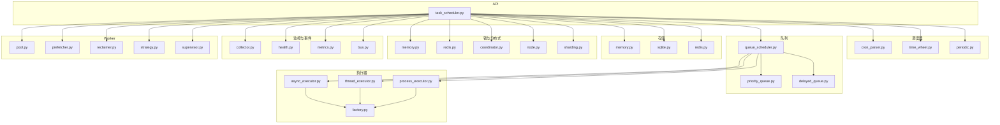

图表来源
- [task_scheduler.py:1-200](file://src/neotask/api/task_scheduler.py#L1-L200)
- [cron_parser.py:1-200](file://src/neotask/scheduler/cron_parser.py#L1-L200)
- [time_wheel.py:1-200](file://src/neotask/scheduler/time_wheel.py#L1-L200)
- [periodic.py:1-200](file://src/neotask/scheduler/periodic.py#L1-L200)
- [priority_queue.py:1-200](file://src/neotask/queue/priority_queue.py#L1-L200)
- [delayed_queue.py:1-200](file://src/neotask/queue/delayed_queue.py#L1-L200)
- [queue_scheduler.py:1-200](file://src/neotask/queue/queue_scheduler.py#L1-L200)
- [async_executor.py:1-200](file://src/neotask/executor/async_executor.py#L1-L200)
- [thread_executor.py:1-200](file://src/neotask/executor/thread_executor.py#L1-L200)
- [process_executor.py:1-200](file://src/neotask/executor/process_executor.py#L1-L200)
- [factory.py:1-200](file://src/neotask/executor/factory.py#L1-L200)
- [memory.py:1-200](file://src/neotask/storage/memory.py#L1-L200)
- [sqlite.py:1-200](file://src/neotask/storage/sqlite.py#L1-L200)
- [redis.py:1-200](file://src/neotask/storage/redis.py#L1-L200)
- [memory.py:1-200](file://src/neotask/lock/memory.py#L1-L200)
- [redis.py:1-200](file://src/neotask/lock/redis.py#L1-L200)
- [coordinator.py:1-200](file://src/neotask/distributed/coordinator.py#L1-L200)
- [node.py:1-200](file://src/neotask/distributed/node.py#L1-L200)
- [sharding.py:1-200](file://src/neotask/distributed/sharding.py#L1-L200)
- [collector.py:1-200](file://src/neotask/monitor/collector.py#L1-L200)
- [health.py:1-200](file://src/neotask/monitor/health.py#L1-L200)
- [metrics.py:1-200](file://src/neotask/monitor/metrics.py#L1-L200)
- [bus.py:1-200](file://src/neotask/event/bus.py#L1-L200)
- [pool.py:1-200](file://src/neotask/worker/pool.py#L1-L200)
- [prefetcher.py:1-200](file://src/neotask/worker/prefetcher.py#L1-L200)
- [reclaimer.py:1-200](file://src/neotask/worker/reclaimer.py#L1-L200)
- [strategy.py:1-200](file://src/neotask/worker/strategy.py#L1-L200)
- [supervisor.py:1-200](file://src/neotask/worker/supervisor.py#L1-L200)

章节来源
- [README_zh.md:1-200](file://README_zh.md#L1-L200)

## 核心组件
- 任务调度API：提供统一的创建、查询、取消、批量提交能力
- Cron解析器：将Cron表达式转换为下一次触发时间点集合或迭代器
- 时间轮：基于环形桶的延迟任务调度结构，支持O(1)入队与近似O(1)出队
- 周期任务管理器：按固定速率或固定间隔重复调度任务
- 优先级队列：基于堆结构的优先队列，支持动态优先级调整
- 延迟队列：结合时间轮或堆实现延迟出队
- 队列调度器：统一从各类队列拉取任务并分发到执行器
- 执行器：异步、线程、进程三种执行模型，统一抽象
- 存储：内存、SQLite、Redis多种后端
- 锁与分布式：内存/Redis锁、节点协调、分片
- 监控与事件：指标、健康检查、事件总线
- Worker：工作池、预取、回收、策略、监督

章节来源
- [task_scheduler.py:1-200](file://src/neotask/api/task_scheduler.py#L1-L200)
- [cron_parser.py:1-200](file://src/neotask/scheduler/cron_parser.py#L1-L200)
- [time_wheel.py:1-200](file://src/neotask/scheduler/time_wheel.py#L1-L200)
- [periodic.py:1-200](file://src/neotask/scheduler/periodic.py#L1-L200)
- [priority_queue.py:1-200](file://src/neotask/queue/priority_queue.py#L1-L200)
- [delayed_queue.py:1-200](file://src/neotask/queue/delayed_queue.py#L1-L200)
- [queue_scheduler.py:1-200](file://src/neotask/queue/queue_scheduler.py#L1-L200)
- [async_executor.py:1-200](file://src/neotask/executor/async_executor.py#L1-L200)
- [thread_executor.py:1-200](file://src/neotask/executor/thread_executor.py#L1-L200)
- [process_executor.py:1-200](file://src/neotask/executor/process_executor.py#L1-L200)
- [factory.py:1-200](file://src/neotask/executor/factory.py#L1-L200)
- [memory.py:1-200](file://src/neotask/storage/memory.py#L1-L200)
- [sqlite.py:1-200](file://src/neotask/storage/sqlite.py#L1-L200)
- [redis.py:1-200](file://src/neotask/storage/redis.py#L1-L200)
- [memory.py:1-200](file://src/neotask/lock/memory.py#L1-L200)
- [redis.py:1-200](file://src/neotask/lock/redis.py#L1-L200)
- [coordinator.py:1-200](file://src/neotask/distributed/coordinator.py#L1-L200)
- [node.py:1-200](file://src/neotask/distributed/node.py#L1-L200)
- [sharding.py:1-200](file://src/neotask/distributed/sharding.py#L1-L200)
- [collector.py:1-200](file://src/neotask/monitor/collector.py#L1-L200)
- [health.py:1-200](file://src/neotask/monitor/health.py#L1-L200)
- [metrics.py:1-200](file://src/neotask/monitor/metrics.py#L1-L200)
- [bus.py:1-200](file://src/neotask/event/bus.py#L1-L200)
- [pool.py:1-200](file://src/neotask/worker/pool.py#L1-L200)
- [prefetcher.py:1-200](file://src/neotask/worker/prefetcher.py#L1-L200)
- [reclaimer.py:1-200](file://src/neotask/worker/reclaimer.py#L1-L200)
- [strategy.py:1-200](file://src/neotask/worker/strategy.py#L1-L200)
- [supervisor.py:1-200](file://src/neotask/worker/supervisor.py#L1-L200)

## 架构总览
下图展示从任务创建到执行的端到端流程，包括调度、队列、执行、存储与监控。

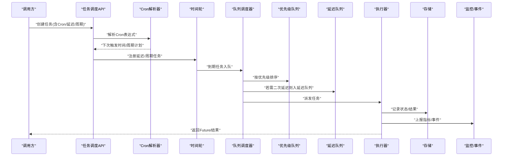

图表来源
- [task_scheduler.py:1-200](file://src/neotask/api/task_scheduler.py#L1-L200)
- [cron_parser.py:1-200](file://src/neotask/scheduler/cron_parser.py#L1-L200)
- [time_wheel.py:1-200](file://src/neotask/scheduler/time_wheel.py#L1-L200)
- [queue_scheduler.py:1-200](file://src/neotask/queue/queue_scheduler.py#L1-L200)
- [priority_queue.py:1-200](file://src/neotask/queue/priority_queue.py#L1-L200)
- [delayed_queue.py:1-200](file://src/neotask/queue/delayed_queue.py#L1-L200)
- [async_executor.py:1-200](file://src/neotask/executor/async_executor.py#L1-L200)
- [memory.py:1-200](file://src/neotask/storage/memory.py#L1-L200)
- [collector.py:1-200](file://src/neotask/monitor/collector.py#L1-L200)
- [bus.py:1-200](file://src/neotask/event/bus.py#L1-L200)

## 详细组件分析

### Cron定时任务
- 功能要点
  - 通过Cron表达式定义复杂的时间规则
  - 解析后生成下一次触发时间或周期计划
  - 与时间轮协作，到期后将任务投递至队列
- 关键实现
  - Cron解析器负责语法解析与合法性校验
  - 调度API根据解析结果注册到时间轮或周期管理器
- 使用示例
  - 参考示例：[05_cron_tasks.py](file://examples/05_cron_tasks.py)

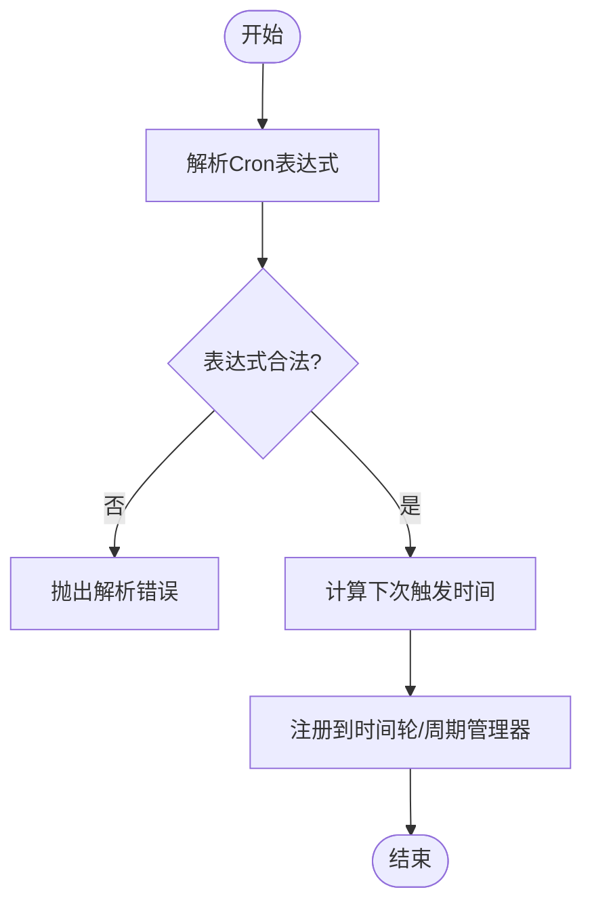

图表来源
- [cron_parser.py:1-200](file://src/neotask/scheduler/cron_parser.py#L1-L200)
- [task_scheduler.py:1-200](file://src/neotask/api/task_scheduler.py#L1-L200)

章节来源
- [cron_parser.py:1-200](file://src/neotask/scheduler/cron_parser.py#L1-L200)
- [task_scheduler.py:1-200](file://src/neotask/api/task_scheduler.py#L1-L200)
- [05_cron_tasks.py:1-200](file://examples/05_cron_tasks.py#L1-L200)

### 延迟任务
- 功能要点
  - 指定未来某个时间点或相对延迟后执行
  - 底层由时间轮或延迟队列驱动
- 关键实现
  - 时间轮以环形桶组织任务，按时间推进出队
  - 延迟队列可配合优先级进行二次排序
- 使用示例
  - 参考示例：[06_delayed_tasks.py](file://examples/06_delayed_tasks.py)

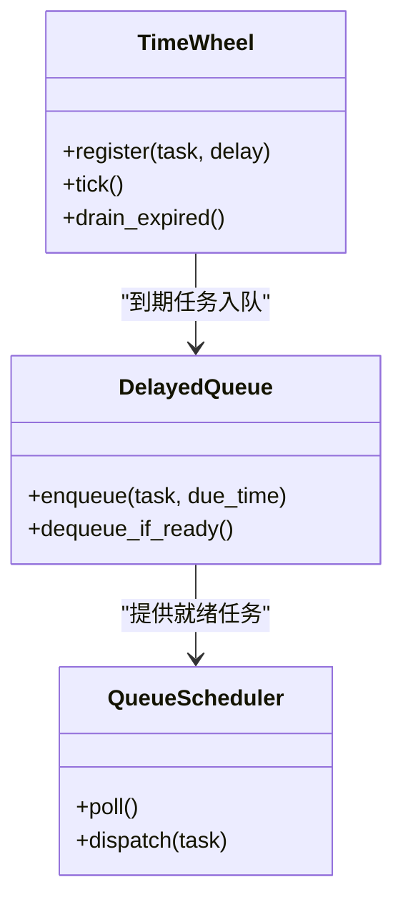

图表来源
- [time_wheel.py:1-200](file://src/neotask/scheduler/time_wheel.py#L1-L200)
- [delayed_queue.py:1-200](file://src/neotask/queue/delayed_queue.py#L1-L200)
- [queue_scheduler.py:1-200](file://src/neotask/queue/queue_scheduler.py#L1-L200)

章节来源
- [time_wheel.py:1-200](file://src/neotask/scheduler/time_wheel.py#L1-L200)
- [delayed_queue.py:1-200](file://src/neotask/queue/delayed_queue.py#L1-L200)
- [queue_scheduler.py:1-200](file://src/neotask/queue/queue_scheduler.py#L1-L200)
- [06_delayed_tasks.py:1-200](file://examples/06_delayed_tasks.py#L1-L200)

### 周期性任务
- 功能要点
  - 固定速率或固定间隔重复执行
  - 可与Cron组合，形成更复杂的调度策略
- 关键实现
  - 周期管理器维护任务的生命周期与下次触发时间
  - 到期后交由队列调度器分发
- 使用示例
  - 参考示例：[08_periodic.py](file://examples/08_periodic.py)

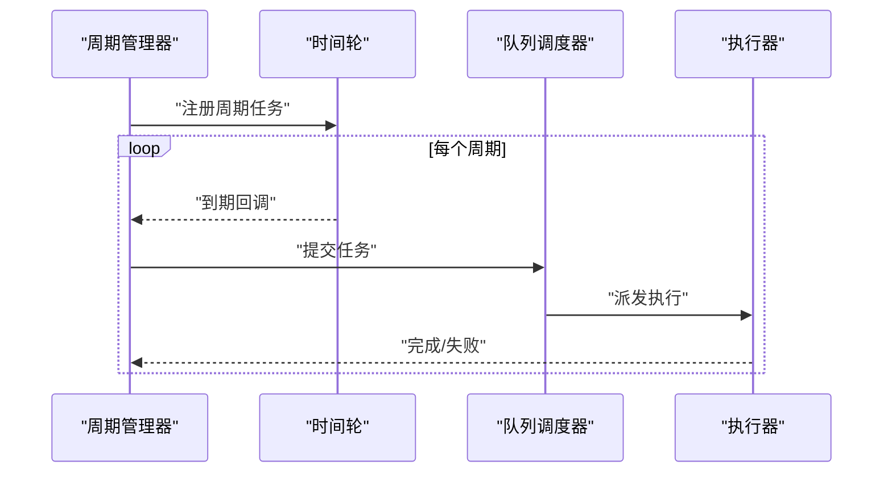

图表来源
- [periodic.py:1-200](file://src/neotask/scheduler/periodic.py#L1-L200)
- [time_wheel.py:1-200](file://src/neotask/scheduler/time_wheel.py#L1-L200)
- [queue_scheduler.py:1-200](file://src/neotask/queue/queue_scheduler.py#L1-L200)
- [async_executor.py:1-200](file://src/neotask/executor/async_executor.py#L1-L200)

章节来源
- [periodic.py:1-200](file://src/neotask/scheduler/periodic.py#L1-L200)
- [08_periodic.py:1-200](file://examples/08_periodic.py#L1-L200)

### 优先级队列
- 功能要点
  - 基于堆结构的高效优先队列
  - 支持动态优先级调整与稳定排序
- 关键实现
  - 入队复杂度O(log n)，出队最小元素O(log n)
  - 与队列调度器集成，确保高优先级任务先执行
- 使用示例
  - 参考示例：[03_priority.py](file://examples/03_priority.py)

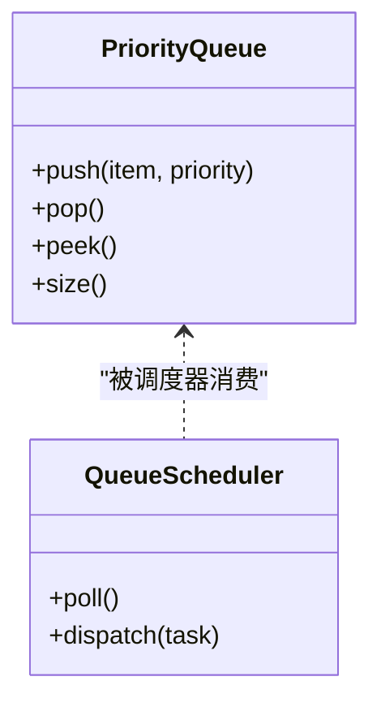

图表来源
- [priority_queue.py:1-200](file://src/neotask/queue/priority_queue.py#L1-L200)
- [queue_scheduler.py:1-200](file://src/neotask/queue/queue_scheduler.py#L1-L200)

章节来源
- [priority_queue.py:1-200](file://src/neotask/queue/priority_queue.py#L1-L200)
- [queue_scheduler.py:1-200](file://src/neotask/queue/queue_scheduler.py#L1-L200)
- [03_priority.py:1-200](file://examples/03_priority.py#L1-L200)

### 时间轮算法
- 工作原理
  - 将时间划分为多个桶，任务按到期时间放入对应桶
  - 随系统时钟推进，逐桶扫描并出队到期任务
- 性能优势
  - 入队近似O(1)，出队摊还O(1)
  - 适合大规模延迟任务与高精度定时场景
- 关键实现
  - 时间轮负责注册、推进、过期任务收集
  - 与延迟队列协同，支持二次排序与去重
- 使用示例
  - 参考示例：[06_delayed_tasks.py](file://examples/06_delayed_tasks.py)

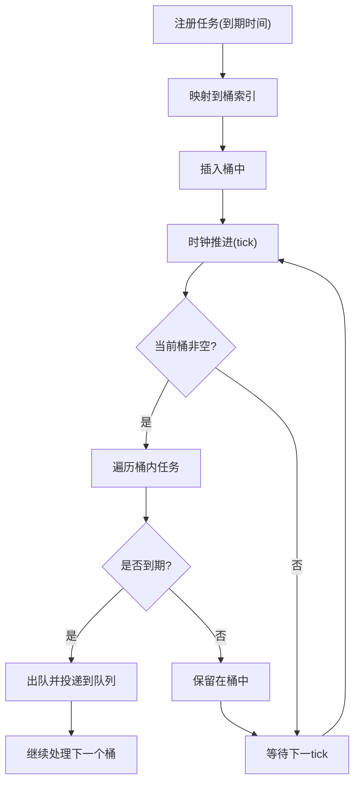

图表来源
- [time_wheel.py:1-200](file://src/neotask/scheduler/time_wheel.py#L1-L200)
- [delayed_queue.py:1-200](file://src/neotask/queue/delayed_queue.py#L1-L200)

章节来源
- [time_wheel.py:1-200](file://src/neotask/scheduler/time_wheel.py#L1-L200)
- [delayed_queue.py:1-200](file://src/neotask/queue/delayed_queue.py#L1-L200)
- [06_delayed_tasks.py:1-200](file://examples/06_delayed_tasks.py#L1-L200)

### 任务去重与幂等性
- 去重策略
  - 基于任务标识或业务键在存储层建立唯一约束
  - 入队前检查是否存在相同任务，避免重复提交
- 幂等性保证
  - 任务执行器侧对同一任务ID进行状态判断
  - 结合分布式锁防止并发重复执行
- 相关实现
  - 存储层唯一性约束与查询
  - 锁模块的获取与释放
- 使用示例
  - 参考示例：[09_retry_and_cancel.py](file://examples/09_retry_and_cancel.py)

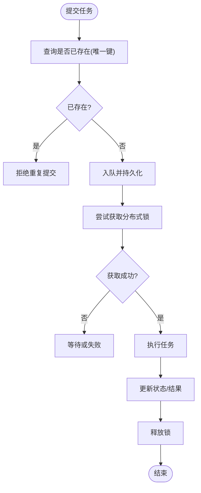

图表来源
- [memory.py:1-200](file://src/neotask/storage/memory.py#L1-L200)
- [redis.py:1-200](file://src/neotask/storage/redis.py#L1-L200)
- [memory.py:1-200](file://src/neotask/lock/memory.py#L1-L200)
- [redis.py:1-200](file://src/neotask/lock/redis.py#L1-L200)
- [task_scheduler.py:1-200](file://src/neotask/api/task_scheduler.py#L1-L200)

章节来源
- [memory.py:1-200](file://src/neotask/storage/memory.py#L1-L200)
- [redis.py:1-200](file://src/neotask/storage/redis.py#L1-L200)
- [memory.py:1-200](file://src/neotask/lock/memory.py#L1-L200)
- [redis.py:1-200](file://src/neotask/lock/redis.py#L1-L200)
- [task_scheduler.py:1-200](file://src/neotask/api/task_scheduler.py#L1-L200)
- [09_retry_and_cancel.py:1-200](file://examples/09_retry_and_cancel.py#L1-L200)

### 重试机制
- 功能要点
  - 支持指数退避、最大重试次数、死信队列
  - 失败任务可自动重试或转入死信队列供人工干预
- 关键实现
  - 执行器捕获异常并触发重试逻辑
  - 监控与事件上报失败与重试信息
- 使用示例
  - 参考示例：[09_retry_and_cancel.py](file://examples/09_retry_and_cancel.py)

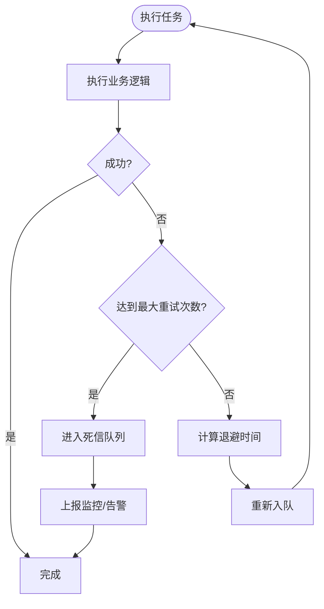

图表来源
- [async_executor.py:1-200](file://src/neotask/executor/async_executor.py#L1-L200)
- [dead_letter.py:1-200](file://src/neotask/queue/dead_letter.py#L1-L200)
- [collector.py:1-200](file://src/neotask/monitor/collector.py#L1-L200)
- [bus.py:1-200](file://src/neotask/event/bus.py#L1-L200)

章节来源
- [async_executor.py:1-200](file://src/neotask/executor/async_executor.py#L1-L200)
- [dead_letter.py:1-200](file://src/neotask/queue/dead_letter.py#L1-L200)
- [collector.py:1-200](file://src/neotask/monitor/collector.py#L1-L200)
- [bus.py:1-200](file://src/neotask/event/bus.py#L1-L200)
- [09_retry_and_cancel.py:1-200](file://examples/09_retry_and_cancel.py#L1-L200)

### 执行器与上下文
- 执行器类型
  - 异步执行器：适用于I/O密集型任务
  - 线程执行器：适用于CPU轻量任务
  - 进程执行器：适用于CPU密集或隔离性要求高的任务
- 上下文与生命周期
  - 任务上下文传递运行时信息
  - 生命周期钩子用于启动、停止、优雅关闭
- 使用示例
  - 参考示例：[01_simple.py](file://examples/01_simple.py)、[02_context_manager.py](file://examples/02_context_manager.py)

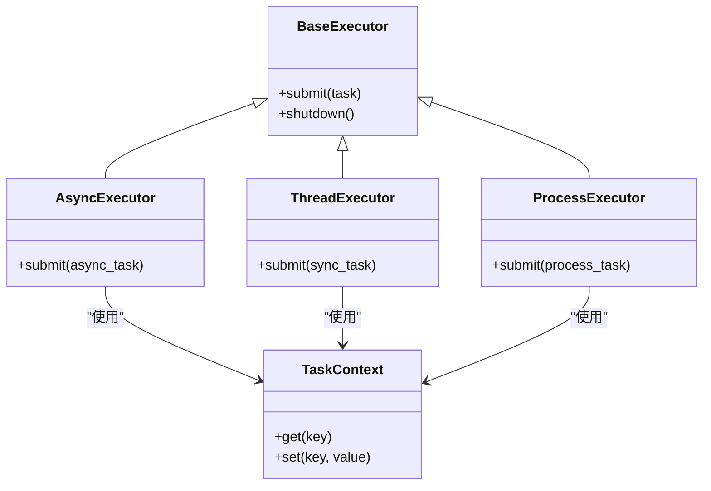

图表来源
- [base.py:1-200](file://src/neotask/executor/base.py#L1-L200)
- [async_executor.py:1-200](file://src/neotask/executor/async_executor.py#L1-L200)
- [thread_executor.py:1-200](file://src/neotask/executor/thread_executor.py#L1-L200)
- [process_executor.py:1-200](file://src/neotask/executor/process_executor.py#L1-L200)
- [context.py:1-200](file://src/neotask/core/context.py#L1-L200)
- [lifecycle.py:1-200](file://src/neotask/core/lifecycle.py#L1-L200)

章节来源
- [base.py:1-200](file://src/neotask/executor/base.py#L1-L200)
- [async_executor.py:1-200](file://src/neotask/executor/async_executor.py#L1-L200)
- [thread_executor.py:1-200](file://src/neotask/executor/thread_executor.py#L1-L200)
- [process_executor.py:1-200](file://src/neotask/executor/process_executor.py#L1-L200)
- [context.py:1-200](file://src/neotask/core/context.py#L1-L200)
- [lifecycle.py:1-200](file://src/neotask/core/lifecycle.py#L1-L200)
- [01_simple.py:1-200](file://examples/01_simple.py#L1-L200)
- [02_context_manager.py:1-200](file://examples/02_context_manager.py#L1-L200)

### 模型与配置
- 任务模型
  - 任务元数据、状态、优先级、重试策略
- 调度配置
  - 调度器参数、执行器选择、存储后端
- 使用示例
  - 参考示例：[99_all_features.py](file://examples/99_all_features.py)

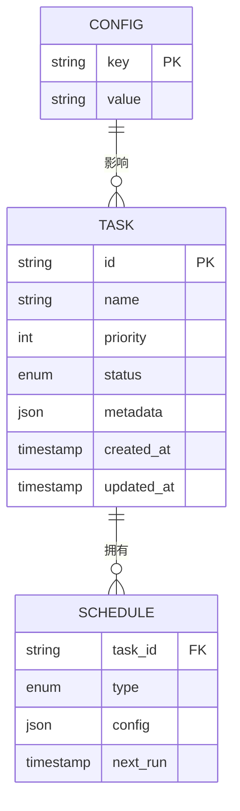

图表来源
- [task.py:1-200](file://src/neotask/models/task.py#L1-L200)
- [schedule.py:1-200](file://src/neotask/models/schedule.py#L1-L200)
- [config.py:1-200](file://src/neotask/models/config.py#L1-L200)

章节来源
- [task.py:1-200](file://src/neotask/models/task.py#L1-L200)
- [schedule.py:1-200](file://src/neotask/models/schedule.py#L1-L200)
- [config.py:1-200](file://src/neotask/models/config.py#L1-L200)
- [99_all_features.py:1-200](file://examples/99_all_features.py#L1-L200)

## 依赖关系分析
- 组件耦合
  - 调度API依赖Cron解析器、时间轮、周期管理器
  - 队列调度器依赖优先级队列与延迟队列
  - 执行器依赖存储与锁模块
  - 监控与事件贯穿全流程
- 外部依赖
  - Redis作为分布式锁与存储后端
  - SQLite作为轻量级本地存储
- 潜在循环依赖
  - 通过接口抽象与工厂模式降低直接耦合

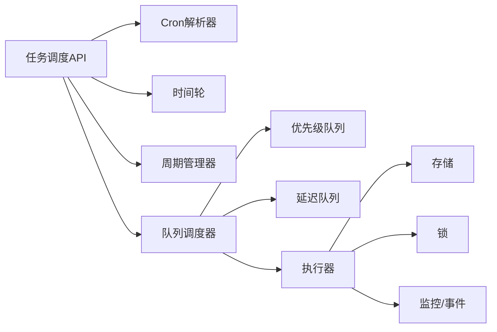

图表来源
- [task_scheduler.py:1-200](file://src/neotask/api/task_scheduler.py#L1-L200)
- [cron_parser.py:1-200](file://src/neotask/scheduler/cron_parser.py#L1-L200)
- [time_wheel.py:1-200](file://src/neotask/scheduler/time_wheel.py#L1-L200)
- [periodic.py:1-200](file://src/neotask/scheduler/periodic.py#L1-L200)
- [queue_scheduler.py:1-200](file://src/neotask/queue/queue_scheduler.py#L1-L200)
- [priority_queue.py:1-200](file://src/neotask/queue/priority_queue.py#L1-L200)
- [delayed_queue.py:1-200](file://src/neotask/queue/delayed_queue.py#L1-L200)
- [async_executor.py:1-200](file://src/neotask/executor/async_executor.py#L1-L200)
- [memory.py:1-200](file://src/neotask/storage/memory.py#L1-L200)
- [redis.py:1-200](file://src/neotask/storage/redis.py#L1-L200)
- [memory.py:1-200](file://src/neotask/lock/memory.py#L1-L200)
- [redis.py:1-200](file://src/neotask/lock/redis.py#L1-L200)
- [collector.py:1-200](file://src/neotask/monitor/collector.py#L1-L200)
- [bus.py:1-200](file://src/neotask/event/bus.py#L1-L200)

章节来源
- [task_scheduler.py:1-200](file://src/neotask/api/task_scheduler.py#L1-L200)
- [cron_parser.py:1-200](file://src/neotask/scheduler/cron_parser.py#L1-L200)
- [time_wheel.py:1-200](file://src/neotask/scheduler/time_wheel.py#L1-L200)
- [periodic.py:1-200](file://src/neotask/scheduler/periodic.py#L1-L200)
- [queue_scheduler.py:1-200](file://src/neotask/queue/queue_scheduler.py#L1-L200)
- [priority_queue.py:1-200](file://src/neotask/queue/priority_queue.py#L1-L200)
- [delayed_queue.py:1-200](file://src/neotask/queue/delayed_queue.py#L1-L200)
- [async_executor.py:1-200](file://src/neotask/executor/async_executor.py#L1-L200)
- [memory.py:1-200](file://src/neotask/storage/memory.py#L1-L200)
- [redis.py:1-200](file://src/neotask/storage/redis.py#L1-L200)
- [memory.py:1-200](file://src/neotask/lock/memory.py#L1-L200)
- [redis.py:1-200](file://src/neotask/lock/redis.py#L1-L200)
- [collector.py:1-200](file://src/neotask/monitor/collector.py#L1-L200)
- [bus.py:1-200](file://src/neotask/event/bus.py#L1-L200)

## 性能考量
- 时间轮优于堆的优势
  - 大规模延迟任务下，时间轮入队与推进开销更低
  - 桶大小与时钟步进粒度需权衡精度与内存占用
- 优先级队列调优
  - 合理设置优先级范围，避免频繁比较
  - 批量出队减少锁竞争
- 执行器选择
  - I/O密集型优先异步执行器
  - CPU密集型考虑进程执行器，注意序列化开销
- 存储层优化
  - Redis用于高吞吐与分布式一致性
  - SQLite用于单机轻量场景，注意事务与索引
- 监控与观测
  - 指标采集与告警有助于定位瓶颈
  - 事件总线用于解耦监控与业务逻辑

[本节为通用指导，不直接分析具体文件]

## 故障排查指南
- 常见问题
  - Cron表达式非法导致无法注册
  - 时间轮推进不及时导致任务延迟
  - 分布式锁冲突导致任务重复或阻塞
  - 重试风暴导致资源耗尽
- 排查步骤
  - 查看监控指标与健康检查
  - 检查事件总线日志与错误上报
  - 验证存储层唯一性与状态一致性
  - 评估锁持有时间与超时配置
- 相关实现
  - 监控采集器与健康检查
  - 心跳与监督器
  - 事件处理器与中间件

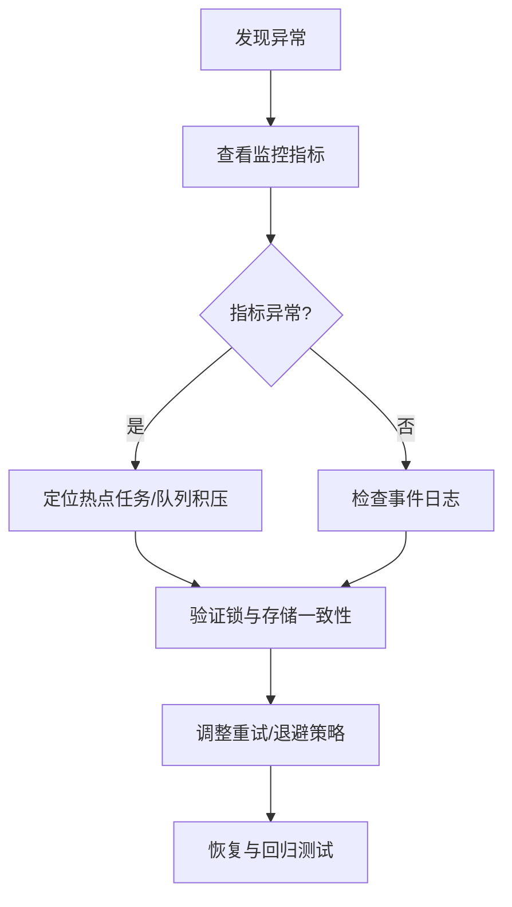

图表来源
- [collector.py:1-200](file://src/neotask/monitor/collector.py#L1-L200)
- [health.py:1-200](file://src/neotask/monitor/health.py#L1-L200)
- [metrics.py:1-200](file://src/neotask/monitor/metrics.py#L1-L200)
- [bus.py:1-200](file://src/neotask/event/bus.py#L1-L200)
- [handlers.py:1-200](file://src/neotask/event/handlers.py#L1-L200)
- [middleware.py:1-200](file://src/neotask/event/middleware.py#L1-L200)
- [heartbeat.py:1-200](file://src/neotask/core/heartbeat.py#L1-L200)
- [supervisor.py:1-200](file://src/neotask/worker/supervisor.py#L1-L200)

章节来源
- [collector.py:1-200](file://src/neotask/monitor/collector.py#L1-L200)
- [health.py:1-200](file://src/neotask/monitor/health.py#L1-L200)
- [metrics.py:1-200](file://src/neotask/monitor/metrics.py#L1-L200)
- [bus.py:1-200](file://src/neotask/event/bus.py#L1-L200)
- [handlers.py:1-200](file://src/neotask/event/handlers.py#L1-L200)
- [middleware.py:1-200](file://src/neotask/event/middleware.py#L1-L200)
- [heartbeat.py:1-200](file://src/neotask/core/heartbeat.py#L1-L200)
- [supervisor.py:1-200](file://src/neotask/worker/supervisor.py#L1-L200)

## 结论
本任务调度系统通过Cron解析、时间轮、周期管理与优先级/延迟队列的组合，提供了灵活且高性能的任务调度能力。结合分布式锁、存储与监控，实现了去重、幂等、重试与可观测性。在生产环境中，应根据任务特征选择合适的执行器与存储后端，并通过监控与事件机制持续优化性能与稳定性。

[本节为总结，不直接分析具体文件]

## 附录
- 快速上手示例
  - 简单任务：[01_simple.py](file://examples/01_simple.py)
  - 上下文管理：[02_context_manager.py](file://examples/02_context_manager.py)
  - 优先级任务：[03_priority.py](file://examples/03_priority.py)
  - 事件示例：[04_events.py](file://examples/04_events.py)
  - Cron任务：[05_cron_tasks.py](file://examples/05_cron_tasks.py)
  - 延迟任务：[06_delayed_tasks.py](file://examples/06_delayed_tasks.py)
  - 批量任务：[07_batch.py](file://examples/07_batch.py)
  - 周期任务：[08_periodic.py](file://examples/08_periodic.py)
  - 重试与取消：[09_retry_and_cancel.py](file://examples/09_retry_and_cancel.py)
  - 任务查询：[10_task_query.py](file://examples/10_task_query.py)
  - 全功能演示：[99_all_features.py](file://examples/99_all_features.py)

章节来源
- [01_simple.py:1-200](file://examples/01_simple.py#L1-L200)
- [02_context_manager.py:1-200](file://examples/02_context_manager.py#L1-L200)
- [03_priority.py:1-200](file://examples/03_priority.py#L1-L200)
- [04_events.py:1-200](file://examples/04_events.py#L1-L200)
- [05_cron_tasks.py:1-200](file://examples/05_cron_tasks.py#L1-L200)
- [06_delayed_tasks.py:1-200](file://examples/06_delayed_tasks.py#L1-L200)
- [07_batch.py:1-200](file://examples/07_batch.py#L1-L200)
- [08_periodic.py:1-200](file://examples/08_periodic.py#L1-L200)
- [09_retry_and_cancel.py:1-200](file://examples/09_retry_and_cancel.py#L1-L200)
- [10_task_query.py:1-200](file://examples/10_task_query.py#L1-L200)
- [99_all_features.py:1-200](file://examples/99_all_features.py#L1-L200)