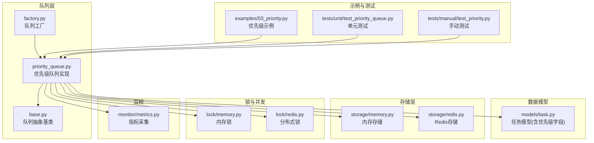
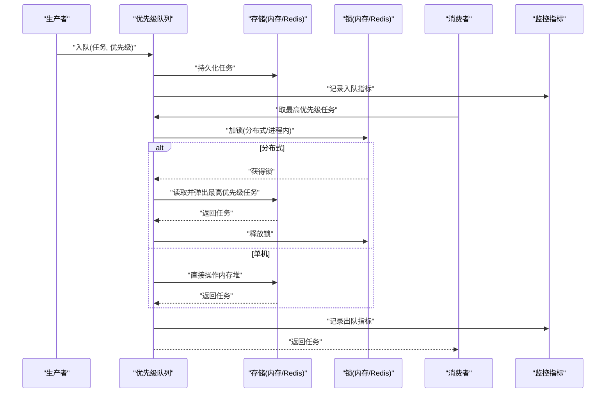
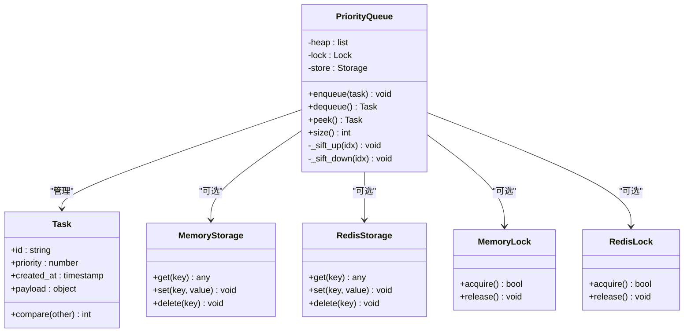
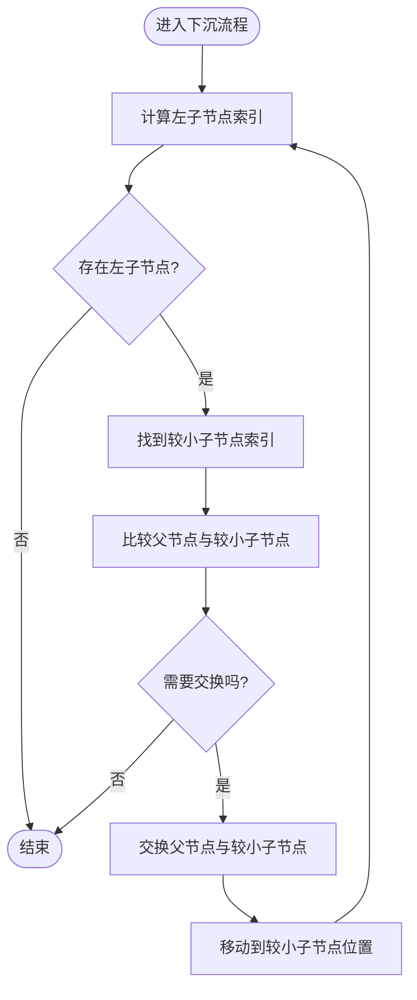
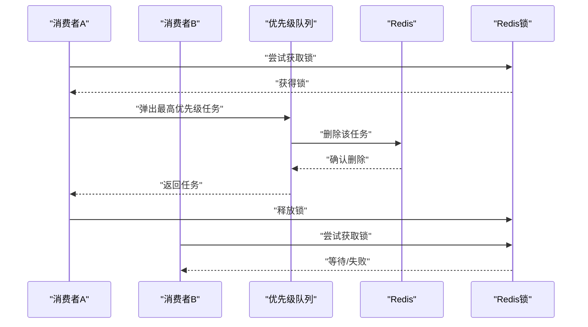
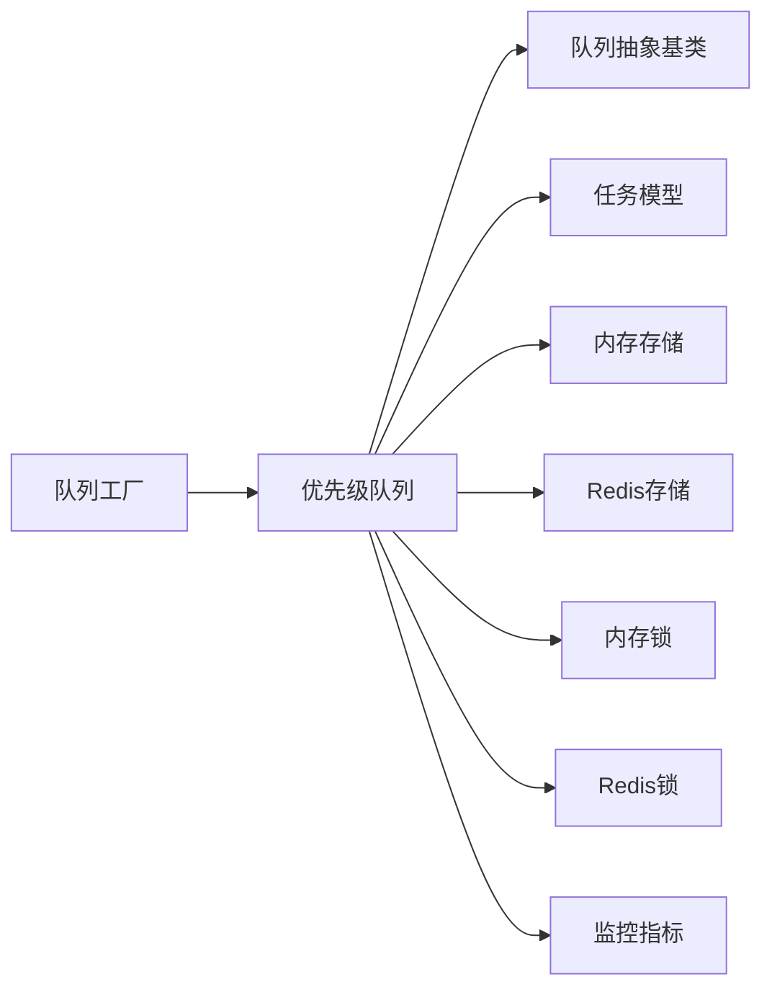

# 优先级队列

<cite>
**本文引用的文件**   
- [src/neotask/queue/priority_queue.py](file://src/neotask/queue/priority_queue.py)
- [src/neotask/queue/base.py](file://src/neotask/queue/base.py)
- [src/neotask/queue/factory.py](file://src/neotask/queue/factory.py)
- [src/neotask/models/task.py](file://src/neotask/models/task.py)
- [examples/03_priority.py](file://examples/03_priority.py)
- [tests/unit/test_priority_queue.py](file://tests/unit/test_priority_queue.py)
- [tests/manual/test_priority.py](file://tests/manual/test_priority.py)
- [src/neotask/storage/memory.py](file://src/neotask/storage/memory.py)
- [src/neotask/storage/redis.py](file://src/neotask/storage/redis.py)
- [src/neotask/lock/memory.py](file://src/neotask/lock/memory.py)
- [src/neotask/lock/redis.py](file://src/neotask/lock/redis.py)
- [src/neotask/monitor/metrics.py](file://src/neotask/monitor/metrics.py)
</cite>

## 目录
1. [简介](#简介)
2. [项目结构](#项目结构)
3. [核心组件](#核心组件)
4. [架构总览](#架构总览)
5. [详细组件分析](#详细组件分析)
6. [依赖关系分析](#依赖关系分析)
7. [性能考虑](#性能考虑)
8. [故障排查指南](#故障排查指南)
9. [结论](#结论)
10. [附录](#附录)

## 简介
本文件围绕任务调度系统中的“优先级队列”进行深入说明，涵盖：
- 优先级的定义规则与数据结构设计
- 堆算法的实现要点与优化策略
- 插入、删除、获取最高优先级元素等操作的时间复杂度
- 典型使用场景示例（紧急任务优先、业务等级划分）
- 持久化与分布式一致性保证方案
- 性能监控与调优建议
- 高并发环境下的锁机制与线程安全设计

## 项目结构
优先级队列位于 queue 模块中，并与模型、存储、锁、监控等子系统协作。下图给出与优先级队列相关的核心文件及其职责概览。

图表来源
- [src/neotask/queue/priority_queue.py](file://src/neotask/queue/priority_queue.py)
- [src/neotask/queue/base.py](file://src/neotask/queue/base.py)
- [src/neotask/queue/factory.py](file://src/neotask/queue/factory.py)
- [src/neotask/models/task.py](file://src/neotask/models/task.py)
- [src/neotask/storage/memory.py](file://src/neotask/storage/memory.py)
- [src/neotask/storage/redis.py](file://src/neotask/storage/redis.py)
- [src/neotask/lock/memory.py](file://src/neotask/lock/memory.py)
- [src/neotask/lock/redis.py](file://src/neotask/lock/redis.py)
- [src/neotask/monitor/metrics.py](file://src/neotask/monitor/metrics.py)
- [examples/03_priority.py](file://examples/03_priority.py)
- [tests/unit/test_priority_queue.py](file://tests/unit/test_priority_queue.py)
- [tests/manual/test_priority.py](file://tests/manual/test_priority.py)

章节来源
- [src/neotask/queue/priority_queue.py](file://src/neotask/queue/priority_queue.py)
- [src/neotask/queue/base.py](file://src/neotask/queue/base.py)
- [src/neotask/queue/factory.py](file://src/neotask/queue/factory.py)
- [src/neotask/models/task.py](file://src/neotask/models/task.py)
- [src/neotask/storage/memory.py](file://src/neotask/storage/memory.py)
- [src/neotask/storage/redis.py](file://src/neotask/storage/redis.py)
- [src/neotask/lock/memory.py](file://src/neotask/lock/memory.py)
- [src/neotask/lock/redis.py](file://src/neotask/lock/redis.py)
- [src/neotask/monitor/metrics.py](file://src/neotask/monitor/metrics.py)
- [examples/03_priority.py](file://examples/03_priority.py)
- [tests/unit/test_priority_queue.py](file://tests/unit/test_priority_queue.py)
- [tests/manual/test_priority.py](file://tests/manual/test_priority.py)

## 核心组件
- 优先级队列实现：提供基于最小堆的优先级队列，支持按优先级出队、插入、删除、查看最高优先级元素等。
- 队列抽象基类：定义统一接口，便于扩展不同队列类型。
- 任务模型：包含优先级字段及排序相关属性，用于比较和持久化。
- 存储适配：内存与 Redis 两种后端，分别对应单机与分布式场景。
- 锁机制：内存锁与分布式锁，保障并发安全与跨进程一致性。
- 监控指标：记录入队、出队、延迟、错误等关键指标，支撑性能分析与调优。

章节来源
- [src/neotask/queue/priority_queue.py](file://src/neotask/queue/priority_queue.py)
- [src/neotask/queue/base.py](file://src/neotask/queue/base.py)
- [src/neotask/models/task.py](file://src/neotask/models/task.py)
- [src/neotask/storage/memory.py](file://src/neotask/storage/memory.py)
- [src/neotask/storage/redis.py](file://src/neotask/storage/redis.py)
- [src/neotask/lock/memory.py](file://src/neotask/lock/memory.py)
- [src/neotask/lock/redis.py](file://src/neotask/lock/redis.py)
- [src/neotask/monitor/metrics.py](file://src/neotask/monitor/metrics.py)

## 架构总览
优先级队列在系统中的作用是“按优先级快速取出下一个应执行的任务”。其整体交互如下：

图表来源
- [src/neotask/queue/priority_queue.py](file://src/neotask/queue/priority_queue.py)
- [src/neotask/storage/memory.py](file://src/neotask/storage/memory.py)
- [src/neotask/storage/redis.py](file://src/neotask/storage/redis.py)
- [src/neotask/lock/memory.py](file://src/neotask/lock/memory.py)
- [src/neotask/lock/redis.py](file://src/neotask/lock/redis.py)
- [src/neotask/monitor/metrics.py](file://src/neotask/monitor/metrics.py)

## 详细组件分析

### 优先级定义与数据结构设计
- 优先级数值越小表示越优先（最小堆语义）。
- 当优先级相同时，通常引入次级排序键（如任务创建时间戳或唯一ID），以保证稳定顺序与可重现性。
- 任务模型中包含优先级字段与可选的次级排序字段，确保比较器能稳定排序。

图表来源
- [src/neotask/models/task.py](file://src/neotask/models/task.py)
- [src/neotask/queue/priority_queue.py](file://src/neotask/queue/priority_queue.py)
- [src/neotask/storage/memory.py](file://src/neotask/storage/memory.py)
- [src/neotask/storage/redis.py](file://src/neotask/storage/redis.py)
- [src/neotask/lock/memory.py](file://src/neotask/lock/memory.py)
- [src/neotask/lock/redis.py](file://src/neotask/lock/redis.py)

章节来源
- [src/neotask/models/task.py](file://src/neotask/models/task.py)
- [src/neotask/queue/priority_queue.py](file://src/neotask/queue/priority_queue.py)

### 堆算法实现与优化
- 内部采用数组表示的最小堆，通过下标父子关系维护堆序。
- 插入时先追加到末尾，再自底向上调整（上浮），使堆恢复有序。
- 删除根节点时，将末尾元素移至根，再自顶向下调整（下沉），选择较小的子节点交换直至满足堆序。
- 优化点：
  - 比较函数尽量轻量，避免不必要的对象构造。
  - 批量构建堆可使用线性时间建堆策略（从最后一个非叶子节点开始下沉）。
  - 在多线程环境下，对堆操作的临界区需加锁保护。

图表来源
- [src/neotask/queue/priority_queue.py](file://src/neotask/queue/priority_queue.py)

章节来源
- [src/neotask/queue/priority_queue.py](file://src/neotask/queue/priority_queue.py)

### 操作与时间复杂度
- 入队（插入）：O(log n)
- 出队（删除最高优先级）：O(log n)
- 查看最高优先级（不删除）：O(1)
- 堆大小查询：O(1)
- 批量入队：均摊 O(n log n)，若使用线性建堆则为 O(n)

章节来源
- [src/neotask/queue/priority_queue.py](file://src/neotask/queue/priority_queue.py)

### 使用示例与场景
- 紧急任务优先：为紧急任务设置更小的优先级值，使其优先被消费。
- 业务等级划分：将业务划分为多个等级（如 P0-P3），P0 最优先。
- 同优先级稳定顺序：结合创建时间戳或唯一 ID，保证相同优先级任务的出队顺序稳定。

参考示例路径：
- [examples/03_priority.py](file://examples/03_priority.py)

章节来源
- [examples/03_priority.py](file://examples/03_priority.py)

### 持久化与分布式一致性
- 单机场景：使用内存存储，堆在进程内存中维护，重启后状态丢失。
- 分布式场景：使用 Redis 作为持久化后端，配合分布式锁保证多消费者竞争时的原子性与一致性。
- 一致性要点：
  - 出队前加锁，防止重复领取同一任务。
  - 出队成功后立即持久化更新（移除已领取任务）。
  - 失败重试时需具备幂等性，避免重复处理。

图表来源
- [src/neotask/queue/priority_queue.py](file://src/neotask/queue/priority_queue.py)
- [src/neotask/storage/redis.py](file://src/neotask/storage/redis.py)
- [src/neotask/lock/redis.py](file://src/neotask/lock/redis.py)

章节来源
- [src/neotask/storage/redis.py](file://src/neotask/storage/redis.py)
- [src/neotask/lock/redis.py](file://src/neotask/lock/redis.py)
- [src/neotask/queue/priority_queue.py](file://src/neotask/queue/priority_queue.py)

### 高并发与线程安全设计
- 单进程多线程：使用内存锁保护堆操作临界区，避免竞态条件。
- 多进程/分布式：使用分布式锁（如 Redis 锁）协调消费者，确保同一时刻只有一个消费者能成功弹出任务。
- 注意事项：
  - 锁粒度应尽量小，仅包裹必要的堆操作与持久化步骤。
  - 超时与重试策略要合理，避免死锁与饥饿。
  - 消费者侧应具备幂等处理逻辑，以应对网络抖动或锁释放异常。

章节来源
- [src/neotask/lock/memory.py](file://src/neotask/lock/memory.py)
- [src/neotask/lock/redis.py](file://src/neotask/lock/redis.py)
- [src/neotask/queue/priority_queue.py](file://src/neotask/queue/priority_queue.py)

### 性能监控与调优建议
- 监控指标：
  - 入队/出队速率、队列长度、平均延迟、错误率。
  - 锁等待时长、锁冲突次数。
- 调优建议：
  - 合理设置优先级范围与次级排序键，减少频繁重排。
  - 批量入队时使用线性建堆策略降低开销。
  - 在高吞吐场景下，适当增大消费者数量，但需平衡锁竞争。
  - 针对热点任务，考虑分片或分区队列以降低单队列压力。

章节来源
- [src/neotask/monitor/metrics.py](file://src/neotask/monitor/metrics.py)
- [src/neotask/queue/priority_queue.py](file://src/neotask/queue/priority_queue.py)

## 依赖关系分析
优先级队列与其依赖的关系如下：

图表来源
- [src/neotask/queue/priority_queue.py](file://src/neotask/queue/priority_queue.py)
- [src/neotask/queue/base.py](file://src/neotask/queue/base.py)
- [src/neotask/queue/factory.py](file://src/neotask/queue/factory.py)
- [src/neotask/models/task.py](file://src/neotask/models/task.py)
- [src/neotask/storage/memory.py](file://src/neotask/storage/memory.py)
- [src/neotask/storage/redis.py](file://src/neotask/storage/redis.py)
- [src/neotask/lock/memory.py](file://src/neotask/lock/memory.py)
- [src/neotask/lock/redis.py](file://src/neotask/lock/redis.py)
- [src/neotask/monitor/metrics.py](file://src/neotask/monitor/metrics.py)

章节来源
- [src/neotask/queue/priority_queue.py](file://src/neotask/queue/priority_queue.py)
- [src/neotask/queue/base.py](file://src/neotask/queue/base.py)
- [src/neotask/queue/factory.py](file://src/neotask/queue/factory.py)
- [src/neotask/models/task.py](file://src/neotask/models/task.py)
- [src/neotask/storage/memory.py](file://src/neotask/storage/memory.py)
- [src/neotask/storage/redis.py](file://src/neotask/storage/redis.py)
- [src/neotask/lock/memory.py](file://src/neotask/lock/memory.py)
- [src/neotask/lock/redis.py](file://src/neotask/lock/redis.py)
- [src/neotask/monitor/metrics.py](file://src/neotask/monitor/metrics.py)

## 性能考虑
- 时间复杂度：入队与出队均为 O(log n)，适合大规模任务的高频调度。
- 空间复杂度：堆结构本身为 O(n)，额外持久化与锁开销取决于后端实现。
- 批处理优化：批量入队建议使用线性建堆；批量出队需谨慎，避免长时间持有锁。
- 热点优化：对高频任务进行分片或分区，降低单队列竞争。
- 监控驱动：通过指标观察瓶颈点（CPU、IO、锁等待），针对性调优。

[本节为通用性能讨论，无需特定文件引用]

## 故障排查指南
- 常见问题：
  - 重复消费：检查分布式锁是否生效，消费者幂等性是否完善。
  - 任务丢失：确认持久化写入是否成功，失败重试与补偿机制是否到位。
  - 优先级错乱：核对比较器实现与次级排序键是否正确。
  - 性能退化：关注锁等待时长与队列长度，必要时扩容消费者或分片。
- 定位方法：
  - 查看监控指标与日志，定位异常时间点与相关任务。
  - 使用单元测试与手动测试复现问题，逐步缩小范围。

章节来源
- [tests/unit/test_priority_queue.py](file://tests/unit/test_priority_queue.py)
- [tests/manual/test_priority.py](file://tests/manual/test_priority.py)

## 结论
优先级队列通过最小堆实现高效的任务调度，结合存储与锁机制可在单机与分布式环境中保持一致性与可靠性。合理的优先级设计与监控调优能够显著提升系统的吞吐与稳定性。

[本节为总结性内容，无需特定文件引用]

## 附录
- 示例路径：
  - [examples/03_priority.py](file://examples/03_priority.py)
- 测试路径：
  - [tests/unit/test_priority_queue.py](file://tests/unit/test_priority_queue.py)
  - [tests/manual/test_priority.py](file://tests/manual/test_priority.py)