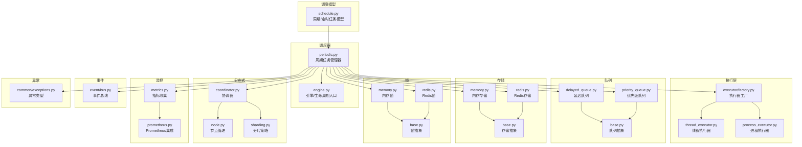
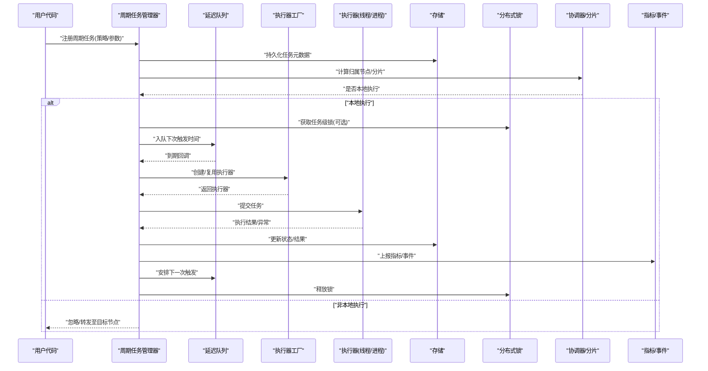
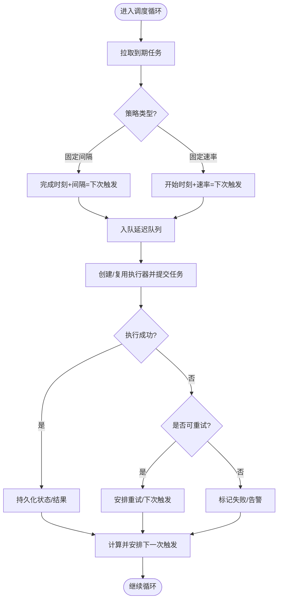
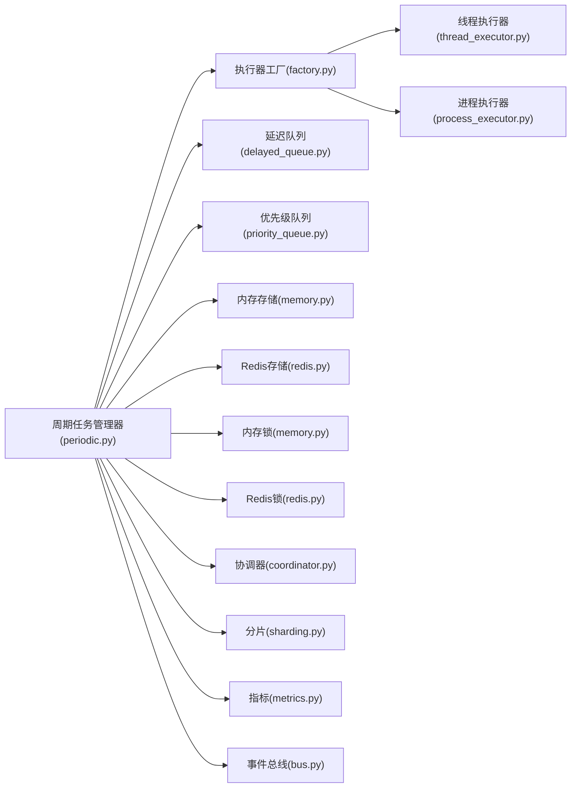

# 周期性任务

<cite>
**本文引用的文件**   
- [examples/08_periodic.py](file://examples/08_periodic.py)
- [src/neotask/scheduler/periodic.py](file://src/neotask/scheduler/periodic.py)
- [src/neotask/models/schedule.py](file://src/neotask/models/schedule.py)
- [src/neotask/core/engine.py](file://src/neotask/core/engine.py)
- [src/neotask/executor/factory.py](file://src/neotask/executor/factory.py)
- [src/neotask/executor/thread_executor.py](file://src/neotask/executor/thread_executor.py)
- [src/neotask/executor/process_executor.py](file://src/neotask/executor/process_executor.py)
- [src/neotask/queue/delayed_queue.py](file://src/neotask/queue/delayed_queue.py)
- [src/neotask/queue/priority_queue.py](file://src/neotask/queue/priority_queue.py)
- [src/neotask/queue/base.py](file://src/neotask/queue/base.py)
- [src/neotask/storage/memory.py](file://src/neotask/storage/memory.py)
- [src/neotask/storage/redis.py](file://src/neotask/storage/redis.py)
- [src/neotask/storage/base.py](file://src/neotask/storage/base.py)
- [src/neotask/lock/memory.py](file://src/neotask/lock/memory.py)
- [src/neotask/lock/redis.py](file://src/neotask/lock/redis.py)
- [src/neotask/lock/base.py](file://src/neotask/lock/base.py)
- [src/neotask/distributed/coordinator.py](file://src/neotask/distributed/coordinator.py)
- [src/neotask/distributed/node.py](file://src/neotask/distributed/node.py)
- [src/neotask/distributed/sharding.py](file://src/neotask/distributed/sharding.py)
- [src/neotask/monitor/metrics.py](file://src/neotask/monitor/metrics.py)
- [src/neotask/contrib/prometheus.py](file://src/neotask/contrib/prometheus.py)
- [src/neotask/event/bus.py](file://src/neotask/event/bus.py)
- [src/neotask/common/exceptions.py](file://src/neotask/common/exceptions.py)
- [tests/unit/test_periodic_manager.py](file://tests/unit/test_periodic_manager.py)
</cite>

## 目录
1. [简介](#简介)
2. [项目结构](#项目结构)
3. [核心组件](#核心组件)
4. [架构总览](#架构总览)
5. [详细组件分析](#详细组件分析)
6. [依赖关系分析](#依赖关系分析)
7. [性能考量](#性能考量)
8. [故障排查指南](#故障排查指南)
9. [结论](#结论)
10. [附录](#附录)

## 简介
本文件围绕“周期性任务”的调度与生命周期管理展开，系统阐述以下主题：
- 周期任务的定义方式与调度策略（固定间隔、固定速率等）
- 启动、停止、暂停、恢复等生命周期操作
- 并发控制与资源管理
- 监控指标与异常处理机制
- 分布式环境下的协调与负载均衡策略
- 示例用法路径（不直接展示代码内容）

## 项目结构
与周期性任务相关的核心模块分布在 scheduler、models、core、executor、queue、storage、lock、distributed、monitor 等子系统中。下图给出与周期任务相关的关键文件及其职责概览。

图表来源
- [src/neotask/models/schedule.py](file://src/neotask/models/schedule.py)
- [src/neotask/scheduler/periodic.py](file://src/neotask/scheduler/periodic.py)
- [src/neotask/core/engine.py](file://src/neotask/core/engine.py)
- [src/neotask/executor/factory.py](file://src/neotask/executor/factory.py)
- [src/neotask/executor/thread_executor.py](file://src/neotask/executor/thread_executor.py)
- [src/neotask/executor/process_executor.py](file://src/neotask/executor/process_executor.py)
- [src/neotask/queue/delayed_queue.py](file://src/neotask/queue/delayed_queue.py)
- [src/neotask/queue/priority_queue.py](file://src/neotask/queue/priority_queue.py)
- [src/neotask/queue/base.py](file://src/neotask/queue/base.py)
- [src/neotask/storage/memory.py](file://src/neotask/storage/memory.py)
- [src/neotask/storage/redis.py](file://src/neotask/storage/redis.py)
- [src/neotask/storage/base.py](file://src/neotask/storage/base.py)
- [src/neotask/lock/memory.py](file://src/neotask/lock/memory.py)
- [src/neotask/lock/redis.py](file://src/neotask/lock/redis.py)
- [src/neotask/lock/base.py](file://src/neotask/lock/base.py)
- [src/neotask/distributed/coordinator.py](file://src/neotask/distributed/coordinator.py)
- [src/neotask/distributed/node.py](file://src/neotask/distributed/node.py)
- [src/neotask/distributed/sharding.py](file://src/neotask/distributed/sharding.py)
- [src/neotask/monitor/metrics.py](file://src/neotask/monitor/metrics.py)
- [src/neotask/contrib/prometheus.py](file://src/neotask/contrib/prometheus.py)
- [src/neotask/event/bus.py](file://src/neotask/event/bus.py)
- [src/neotask/common/exceptions.py](file://src/neotask/common/exceptions.py)

章节来源
- [src/neotask/scheduler/periodic.py](file://src/neotask/scheduler/periodic.py)
- [src/neotask/models/schedule.py](file://src/neotask/models/schedule.py)
- [src/neotask/core/engine.py](file://src/neotask/core/engine.py)

## 核心组件
- 周期任务模型：用于描述周期任务的调度策略、参数、状态等元数据。
- 周期任务管理器：负责注册、启停、暂停/恢复、删除周期任务，以及按策略触发执行。
- 执行器工厂与具体执行器：根据配置选择线程或进程执行器，隔离资源并支持并发。
- 延迟队列与优先级队列：支撑“固定间隔/固定速率”的时间推进与任务排序。
- 存储与锁：持久化任务状态、提供跨实例互斥能力，保障分布式一致性。
- 分布式协调与分片：在多节点间协调周期任务分配与负载分担。
- 监控与事件：采集指标、暴露可观测性，并通过事件总线进行解耦通知。
- 异常体系：统一错误类型与传播路径，便于上层捕获与恢复。

章节来源
- [src/neotask/models/schedule.py](file://src/neotask/models/schedule.py)
- [src/neotask/scheduler/periodic.py](file://src/neotask/scheduler/periodic.py)
- [src/neotask/executor/factory.py](file://src/neotask/executor/factory.py)
- [src/neotask/queue/delayed_queue.py](file://src/neotask/queue/delayed_queue.py)
- [src/neotask/queue/priority_queue.py](file://src/neotask/queue/priority_queue.py)
- [src/neotask/storage/memory.py](file://src/neotask/storage/memory.py)
- [src/neotask/storage/redis.py](file://src/neotask/storage/redis.py)
- [src/neotask/lock/memory.py](file://src/neotask/lock/memory.py)
- [src/neotask/lock/redis.py](file://src/neotask/lock/redis.py)
- [src/neotask/distributed/coordinator.py](file://src/neotask/distributed/coordinator.py)
- [src/neotask/distributed/sharding.py](file://src/neotask/distributed/sharding.py)
- [src/neotask/monitor/metrics.py](file://src/neotask/monitor/metrics.py)
- [src/neotask/event/bus.py](file://src/neotask/event/bus.py)
- [src/neotask/common/exceptions.py](file://src/neotask/common/exceptions.py)

## 架构总览
周期任务从“定义”到“执行”的主流程如下：
- 通过模型定义周期任务（策略、参数、标签等）
- 由周期任务管理器注册并纳入调度循环
- 依据策略将下一次触发时间写入延迟队列
- 到达触发点时，经执行器工厂选择线程/进程执行器运行任务
- 记录结果、更新状态、上报指标、发布事件
- 在分布式场景下，通过协调器与分片策略避免重复执行并均衡负载

图表来源
- [src/neotask/scheduler/periodic.py](file://src/neotask/scheduler/periodic.py)
- [src/neotask/queue/delayed_queue.py](file://src/neotask/queue/delayed_queue.py)
- [src/neotask/executor/factory.py](file://src/neotask/executor/factory.py)
- [src/neotask/executor/thread_executor.py](file://src/neotask/executor/thread_executor.py)
- [src/neotask/executor/process_executor.py](file://src/neotask/executor/process_executor.py)
- [src/neotask/storage/memory.py](file://src/neotask/storage/memory.py)
- [src/neotask/storage/redis.py](file://src/neotask/storage/redis.py)
- [src/neotask/lock/memory.py](file://src/neotask/lock/memory.py)
- [src/neotask/lock/redis.py](file://src/neotask/lock/redis.py)
- [src/neotask/distributed/coordinator.py](file://src/neotask/distributed/coordinator.py)
- [src/neotask/distributed/sharding.py](file://src/neotask/distributed/sharding.py)
- [src/neotask/monitor/metrics.py](file://src/neotask/monitor/metrics.py)
- [src/neotask/event/bus.py](file://src/neotask/event/bus.py)

## 详细组件分析

### 周期任务模型与调度策略
- 模型字段通常包含：任务标识、名称、策略类型（固定间隔/固定速率）、间隔/速率参数、最大并发、超时、重试策略、标签/分组、状态等。
- 固定间隔：每次执行完成后，基于“完成时刻 + 间隔”计算下一次触发时间。
- 固定速率：以“开始时刻 + 速率”为基准计算下一次触发时间，保证整体节奏稳定，即使某次执行耗时较长也能维持节拍。
- 扩展策略：可结合 cron 表达式或自定义规则实现更复杂的周期语义。

章节来源
- [src/neotask/models/schedule.py](file://src/neotask/models/schedule.py)

### 周期任务管理器（生命周期与调度）
- 注册/注销：维护任务集合与索引，支持按标签/分组查询。
- 启动/停止：批量启用/禁用任务；停止时确保正在运行的任务优雅退出。
- 暂停/恢复：对单个任务或一组任务进行临时挂起与恢复。
- 调度循环：读取待触发任务，按策略计算下一次触发时间，入队延迟队列。
- 执行编排：调用执行器工厂选择执行器，提交任务并等待结果。
- 状态同步：将任务状态、最近执行时间、失败次数等持久化。
- 事件与指标：在执行前后、失败重试、状态变更时发布事件并上报指标。

图表来源
- [src/neotask/scheduler/periodic.py](file://src/neotask/scheduler/periodic.py)
- [src/neotask/queue/delayed_queue.py](file://src/neotask/queue/delayed_queue.py)
- [src/neotask/executor/factory.py](file://src/neotask/executor/factory.py)
- [src/neotask/storage/memory.py](file://src/neotask/storage/memory.py)
- [src/neotask/storage/redis.py](file://src/neotask/storage/redis.py)
- [src/neotask/common/exceptions.py](file://src/neotask/common/exceptions.py)

章节来源
- [src/neotask/scheduler/periodic.py](file://src/neotask/scheduler/periodic.py)

### 执行器与并发控制
- 执行器工厂：根据配置选择线程或进程执行器，支持动态切换。
- 线程执行器：适合 I/O 密集型任务，共享进程内存，上下文切换开销低。
- 进程执行器：适合 CPU 密集型或需要强隔离的任务，具备更强的稳定性与资源隔离。
- 并发控制：
  - 任务级并发上限：防止同一任务过度并行导致资源耗尽。
  - 全局并发上限：限制整体吞吐，保护下游依赖。
  - 执行器池大小：根据机器核数与任务特性调优。
- 资源管理：
  - 超时控制：避免长尾任务占用资源。
  - 优雅关闭：停止时等待已提交任务完成或强制中断。

章节来源
- [src/neotask/executor/factory.py](file://src/neotask/executor/factory.py)
- [src/neotask/executor/thread_executor.py](file://src/neotask/executor/thread_executor.py)
- [src/neotask/executor/process_executor.py](file://src/neotask/executor/process_executor.py)

### 延迟队列与优先级队列
- 延迟队列：按触发时间排序，到期后出队并交由调度器处理。
- 优先级队列：在相同时间窗口内，按优先级决定执行顺序。
- 组合使用：先按时间推进，再按优先级消费，兼顾公平性与时效性。

章节来源
- [src/neotask/queue/delayed_queue.py](file://src/neotask/queue/delayed_queue.py)
- [src/neotask/queue/priority_queue.py](file://src/neotask/queue/priority_queue.py)
- [src/neotask/queue/base.py](file://src/neotask/queue/base.py)

### 存储与锁
- 存储后端：
  - 内存存储：轻量、快速，适合单机测试与开发。
  - Redis 存储：支持多实例共享状态，适合生产环境。
- 锁机制：
  - 内存锁：单进程内互斥。
  - Redis 锁：跨进程/跨实例互斥，避免重复执行。
- 一致性：
  - 任务状态原子更新，避免竞态条件。
  - 失败重试与幂等设计，保障最终一致性。

章节来源
- [src/neotask/storage/memory.py](file://src/neotask/storage/memory.py)
- [src/neotask/storage/redis.py](file://src/neotask/storage/redis.py)
- [src/neotask/storage/base.py](file://src/neotask/storage/base.py)
- [src/neotask/lock/memory.py](file://src/neotask/lock/memory.py)
- [src/neotask/lock/redis.py](file://src/neotask/lock/redis.py)
- [src/neotask/lock/base.py](file://src/neotask/lock/base.py)

### 分布式协调与负载均衡
- 协调器：维护集群成员信息、健康检查、领导选举（如需要）。
- 分片策略：基于任务键或标签哈希分配到不同节点，避免热点与重复执行。
- 心跳与容错：节点上下线自动重平衡，任务迁移与恢复。
- 负载均衡：按节点容量/负载动态调整任务分配比例。

章节来源
- [src/neotask/distributed/coordinator.py](file://src/neotask/distributed/coordinator.py)
- [src/neotask/distributed/node.py](file://src/neotask/distributed/node.py)
- [src/neotask/distributed/sharding.py](file://src/neotask/distributed/sharding.py)

### 监控指标与异常处理
- 指标：
  - 任务计数：注册数、运行中、成功、失败、重试次数。
  - 延迟与时延：排队时长、执行时长、端到端时延。
  - 资源：CPU/内存/队列长度等。
- 异常：
  - 统一异常类型与错误码，便于分类统计与告警。
  - 重试策略：指数退避、最大重试次数、死信队列。
- 事件：
  - 任务生命周期事件（注册、启动、执行、完成、失败）。
  - 状态变更事件（暂停、恢复、删除）。

章节来源
- [src/neotask/monitor/metrics.py](file://src/neotask/monitor/metrics.py)
- [src/neotask/contrib/prometheus.py](file://src/neotask/contrib/prometheus.py)
- [src/neotask/event/bus.py](file://src/neotask/event/bus.py)
- [src/neotask/common/exceptions.py](file://src/neotask/common/exceptions.py)

### 示例用法路径
以下为常用周期任务的示例文件路径（不直接展示代码内容）：
- 每秒执行：[examples/08_periodic.py](file://examples/08_periodic.py)
- 每分钟执行：[examples/08_periodic.py](file://examples/08_periodic.py)
- 自定义间隔执行：[examples/08_periodic.py](file://examples/08_periodic.py)

章节来源
- [examples/08_periodic.py](file://examples/08_periodic.py)

## 依赖关系分析
周期任务管理器作为中枢，依赖执行器、队列、存储、锁、分布式协调、监控与事件等子系统。下图展示关键依赖关系。

图表来源
- [src/neotask/scheduler/periodic.py](file://src/neotask/scheduler/periodic.py)
- [src/neotask/executor/factory.py](file://src/neotask/executor/factory.py)
- [src/neotask/executor/thread_executor.py](file://src/neotask/executor/thread_executor.py)
- [src/neotask/executor/process_executor.py](file://src/neotask/executor/process_executor.py)
- [src/neotask/queue/delayed_queue.py](file://src/neotask/queue/delayed_queue.py)
- [src/neotask/queue/priority_queue.py](file://src/neotask/queue/priority_queue.py)
- [src/neotask/storage/memory.py](file://src/neotask/storage/memory.py)
- [src/neotask/storage/redis.py](file://src/neotask/storage/redis.py)
- [src/neotask/lock/memory.py](file://src/neotask/lock/memory.py)
- [src/neotask/lock/redis.py](file://src/neotask/lock/redis.py)
- [src/neotask/distributed/coordinator.py](file://src/neotask/distributed/coordinator.py)
- [src/neotask/distributed/sharding.py](file://src/neotask/distributed/sharding.py)
- [src/neotask/monitor/metrics.py](file://src/neotask/monitor/metrics.py)
- [src/neotask/event/bus.py](file://src/neotask/event/bus.py)

章节来源
- [src/neotask/scheduler/periodic.py](file://src/neotask/scheduler/periodic.py)

## 性能考量
- 执行器选择：I/O 密集优先线程执行器，CPU 密集优先进程执行器。
- 并发上限：合理设置任务级与全局并发上限，避免下游过载。
- 队列容量：为延迟/优先级队列设置合理容量与背压策略。
- 存储与锁：生产环境建议使用 Redis 存储与锁，减少热点与争用。
- 指标采样：高频指标采用降采样或聚合，降低开销。
- 批处理：对短小任务可采用批处理模式提升吞吐。

## 故障排查指南
- 常见问题定位：
  - 任务未触发：检查延迟队列是否到期、分片归属是否正确、锁是否阻塞。
  - 重复执行：确认分布式锁是否生效、分片策略是否一致。
  - 执行缓慢：查看执行器池大小、下游依赖延迟、CPU/内存使用率。
  - 频繁失败：检查异常类型、重试策略、死信队列。
- 诊断手段：
  - 查看指标：成功率、失败率、时延分布、队列积压。
  - 订阅事件：监听任务生命周期事件，定位异常时间点。
  - 日志关联：通过任务 ID 关联执行日志与指标。
- 恢复策略：
  - 重启调度器：清理僵尸任务，重新加载状态。
  - 重置锁：在确认无冲突的情况下清理过期锁。
  - 回滚配置：回退到上一版本并发/队列/存储配置。

章节来源
- [src/neotask/common/exceptions.py](file://src/neotask/common/exceptions.py)
- [src/neotask/monitor/metrics.py](file://src/neotask/monitor/metrics.py)
- [src/neotask/event/bus.py](file://src/neotask/event/bus.py)

## 结论
周期任务的核心在于“明确策略、可靠调度、可控并发、可观测与可恢复”。通过模型化定义、分层执行、持久化与分布式协调，系统能够在单机与集群环境下稳定运行。建议在生产环境中结合 Redis 存储与锁、完善监控与告警，并根据业务特征调优并发与队列参数。

## 附录
- 单元测试参考：
  - 周期任务管理器行为验证：[tests/unit/test_periodic_manager.py](file://tests/unit/test_periodic_manager.py)

章节来源
- [tests/unit/test_periodic_manager.py](file://tests/unit/test_periodic_manager.py)