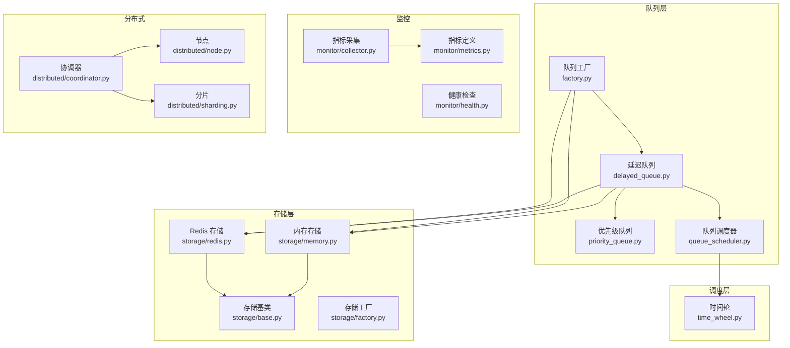
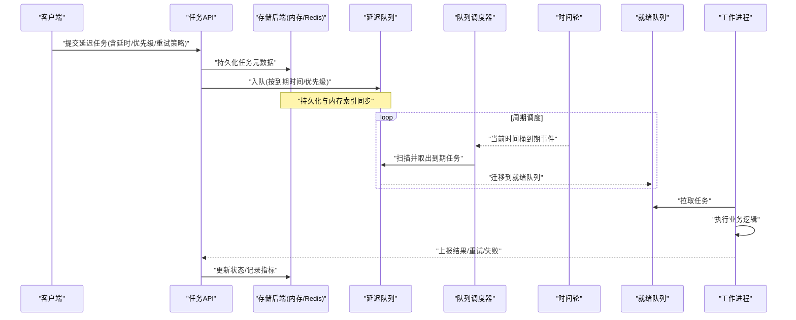
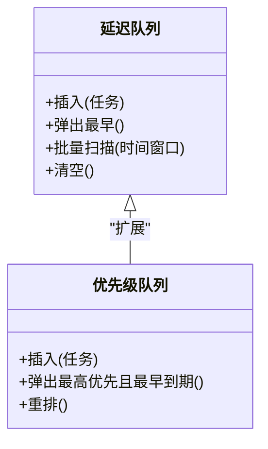
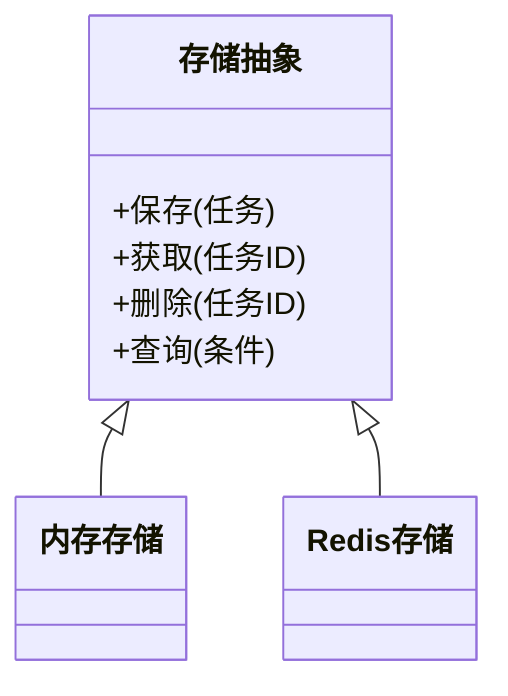
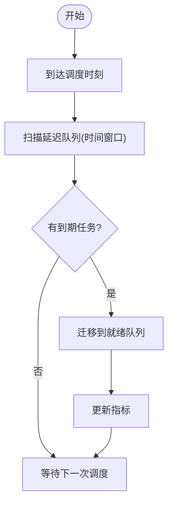
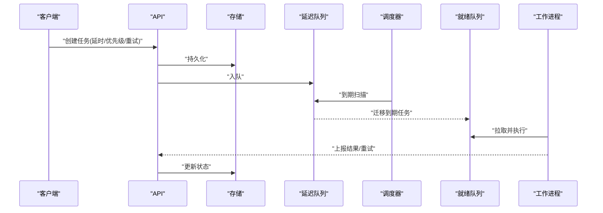
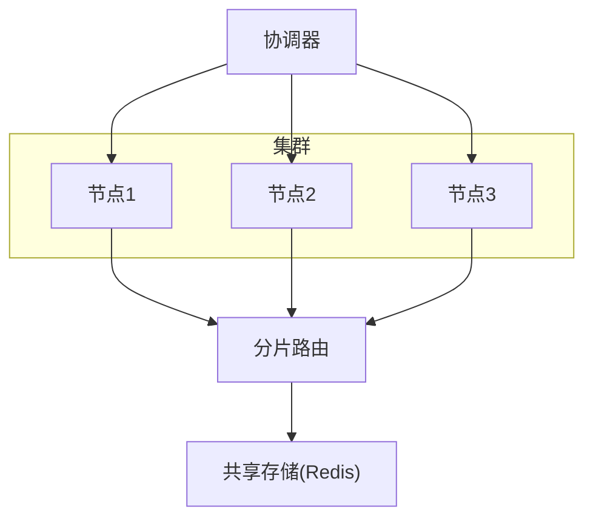
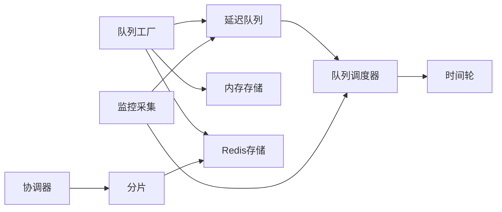

# 延迟任务

<cite>
**本文引用的文件**   
- [delayed_queue.py](file://src/neotask/queue/delayed_queue.py)
- [queue_scheduler.py](file://src/neotask/queue/queue_scheduler.py)
- [priority_queue.py](file://src/neotask/queue/priority_queue.py)
- [base.py](file://src/neotask/queue/base.py)
- [factory.py](file://src/neotask/queue/factory.py)
- [time_wheel.py](file://src/neotask/scheduler/time_wheel.py)
- [memory.py](file://src/neotask/storage/memory.py)
- [redis.py](file://src/neotask/storage/redis.py)
- [base.py](file://src/neotask/storage/base.py)
- [factory.py](file://src/neotask/storage/factory.py)
- [06_delayed_tasks.py](file://examples/06_delayed_tasks.py)
- [03_priority.py](file://examples/03_priority.py)
- [07_batch.py](file://examples/07_batch.py)
- [09_retry_and_cancel.py](file://examples/09_retry_and_cancel.py)
- [collector.py](file://src/neotask/monitor/collector.py)
- [metrics.py](file://src/neotask/monitor/metrics.py)
- [health.py](file://src/neotask/monitor/health.py)
- [coordinator.py](file://src/neotask/distributed/coordinator.py)
- [node.py](file://src/neotask/distributed/node.py)
- [sharding.py](file://src/neotask/distributed/sharding.py)
</cite>

## 目录
1. [简介](#简介)
2. [项目结构](#项目结构)
3. [核心组件](#核心组件)
4. [架构总览](#架构总览)
5. [详细组件分析](#详细组件分析)
6. [依赖关系分析](#依赖关系分析)
7. [性能考量](#性能考量)
8. [故障排查指南](#故障排查指南)
9. [结论](#结论)
10. [附录](#附录)

## 简介
本文件系统性阐述延迟任务的实现与使用，覆盖数据结构、存储机制（Redis 与内存）、创建/调度/执行流程、优先级与批量操作、监控指标与故障恢复，以及分布式环境下的一致性与幂等性保证。文档面向不同技术背景的读者，提供从概念到代码级映射的渐进式说明。

## 项目结构
延迟任务相关能力主要分布在以下模块：
- 队列层：延迟队列、优先级队列、队列调度器、工厂
- 调度层：时间轮
- 存储层：内存与 Redis 两种后端
- 示例：延迟任务、优先级、批量、重试与取消
- 监控：指标采集、健康检查
- 分布式：协调器、节点管理、分片

图表来源
- [delayed_queue.py](file://src/neotask/queue/delayed_queue.py)
- [queue_scheduler.py](file://src/neotask/queue/queue_scheduler.py)
- [priority_queue.py](file://src/neotask/queue/priority_queue.py)
- [time_wheel.py](file://src/neotask/scheduler/time_wheel.py)
- [memory.py](file://src/neotask/storage/memory.py)
- [redis.py](file://src/neotask/storage/redis.py)
- [base.py](file://src/neotask/storage/base.py)
- [factory.py](file://src/neotask/storage/factory.py)
- [collector.py](file://src/neotask/monitor/collector.py)
- [metrics.py](file://src/neotask/monitor/metrics.py)
- [health.py](file://src/neotask/monitor/health.py)
- [coordinator.py](file://src/neotask/distributed/coordinator.py)
- [node.py](file://src/neotask/distributed/node.py)
- [sharding.py](file://src/neotask/distributed/sharding.py)

章节来源
- [delayed_queue.py](file://src/neotask/queue/delayed_queue.py)
- [queue_scheduler.py](file://src/neotask/queue/queue_scheduler.py)
- [priority_queue.py](file://src/neotask/queue/priority_queue.py)
- [time_wheel.py](file://src/neotask/scheduler/time_wheel.py)
- [memory.py](file://src/neotask/storage/memory.py)
- [redis.py](file://src/neotask/storage/redis.py)
- [base.py](file://src/neotask/storage/base.py)
- [factory.py](file://src/neotask/storage/factory.py)
- [collector.py](file://src/neotask/monitor/collector.py)
- [metrics.py](file://src/neotask/monitor/metrics.py)
- [health.py](file://src/neotask/monitor/health.py)
- [coordinator.py](file://src/neotask/distributed/coordinator.py)
- [node.py](file://src/neotask/distributed/node.py)
- [sharding.py](file://src/neotask/distributed/sharding.py)

## 核心组件
- 延迟队列：封装“到期可出队”的语义，内部维护按到期时间排序的结构，支持插入、弹出最近到期项、批量扫描等。
- 优先级队列：在延迟基础上引入优先级维度，用于高优任务优先消费。
- 队列调度器：周期性驱动延迟队列，将到期任务迁移至就绪队列供消费者拉取。
- 时间轮：基于时间桶的调度算法，降低 O(n) 扫描成本，适合大规模延迟任务。
- 存储后端：内存与 Redis 两种实现，分别适用于单机与分布式场景。
- 监控与健康：暴露关键指标并支持健康检查，便于观测与告警。
- 分布式协调：多实例下的任务分配、锁与一致性保障。

章节来源
- [delayed_queue.py](file://src/neotask/queue/delayed_queue.py)
- [priority_queue.py](file://src/neotask/queue/priority_queue.py)
- [queue_scheduler.py](file://src/neotask/queue/queue_scheduler.py)
- [time_wheel.py](file://src/neotask/scheduler/time_wheel.py)
- [memory.py](file://src/neotask/storage/memory.py)
- [redis.py](file://src/neotask/storage/redis.py)
- [collector.py](file://src/neotask/monitor/collector.py)
- [metrics.py](file://src/neotask/monitor/metrics.py)
- [health.py](file://src/neotask/monitor/health.py)
- [coordinator.py](file://src/neotask/distributed/coordinator.py)
- [node.py](file://src/neotask/distributed/node.py)
- [sharding.py](file://src/neotask/distributed/sharding.py)

## 架构总览
下图展示延迟任务从创建到执行的端到端流程，包括调度器、时间轮、延迟队列与存储后端的协作。

图表来源
- [queue_scheduler.py](file://src/neotask/queue/queue_scheduler.py)
- [time_wheel.py](file://src/neotask/scheduler/time_wheel.py)
- [delayed_queue.py](file://src/neotask/queue/delayed_queue.py)
- [memory.py](file://src/neotask/storage/memory.py)
- [redis.py](file://src/neotask/storage/redis.py)

## 详细组件分析

### 延迟队列与优先级处理
- 数据结构
  - 延迟队列：以到期时间为键的有序容器，支持快速定位最早到期项与批量扫描。
  - 优先级队列：在延迟基础上增加优先级字段，比较函数同时考虑优先级与到期时间。
- 复杂度
  - 插入：O(log n)（堆/平衡树）或 O(1)（桶+链表，取决于实现）。
  - 弹出最早到期：O(1) 或 O(log n)。
  - 批量扫描：按时间窗口切分，摊还复杂度接近 O(k + log n)，k 为扫描到的任务数。
- 典型用法
  - 仅延时：设置未来执行时间。
  - 延时+优先级：高优任务即使稍晚到期也可优先消费。
  - 批量入队：减少网络/IO 往返，提升吞吐。

图表来源
- [delayed_queue.py](file://src/neotask/queue/delayed_queue.py)
- [priority_queue.py](file://src/neotask/queue/priority_queue.py)

章节来源
- [delayed_queue.py](file://src/neotask/queue/delayed_queue.py)
- [priority_queue.py](file://src/neotask/queue/priority_queue.py)

### 存储机制：内存与 Redis
- 内存存储
  - 适用场景：单机、开发测试、轻量部署。
  - 特点：低延迟、无外部依赖；进程重启数据丢失。
- Redis 存储
  - 适用场景：分布式、跨进程共享、持久化需求。
  - 特点：强一致读写、原子操作、支持过期与有序集合；需关注网络抖动与序列化开销。
- 统一接口
  - 通过存储抽象与工厂选择具体实现，业务代码无需关心底层差异。

图表来源
- [base.py](file://src/neotask/storage/base.py)
- [memory.py](file://src/neotask/storage/memory.py)
- [redis.py](file://src/neotask/storage/redis.py)
- [factory.py](file://src/neotask/storage/factory.py)

章节来源
- [memory.py](file://src/neotask/storage/memory.py)
- [redis.py](file://src/neotask/storage/redis.py)
- [base.py](file://src/neotask/storage/base.py)
- [factory.py](file://src/neotask/storage/factory.py)

### 调度器与时间轮
- 队列调度器
  - 周期性触发，调用延迟队列的批量扫描接口，将到期任务迁移到就绪队列。
  - 支持可配置扫描间隔与批大小，平衡实时性与吞吐。
- 时间轮
  - 将时间划分为多个桶，每个桶对应一个时间窗口，到期时批量推进任务，避免全量扫描。
  - 适合海量延迟任务，显著降低 CPU 占用。

图表来源
- [queue_scheduler.py](file://src/neotask/queue/queue_scheduler.py)
- [time_wheel.py](file://src/neotask/scheduler/time_wheel.py)
- [delayed_queue.py](file://src/neotask/queue/delayed_queue.py)

章节来源
- [queue_scheduler.py](file://src/neotask/queue/queue_scheduler.py)
- [time_wheel.py](file://src/neotask/scheduler/time_wheel.py)

### 创建、调度与执行流程
- 创建
  - 客户端通过 API 提交任务，指定延时时间、优先级、重试策略等。
  - 任务元数据持久化到存储后端，并在延迟队列中建立索引。
- 调度
  - 调度器按周期扫描，或将任务挂入时间轮桶。
  - 到期后将任务迁移到就绪队列。
- 执行
  - 工作进程从就绪队列拉取任务并执行。
  - 执行成功则更新状态；失败则根据重试策略进行重试或进入死信队列。

图表来源
- [delayed_queue.py](file://src/neotask/queue/delayed_queue.py)
- [queue_scheduler.py](file://src/neotask/queue/queue_scheduler.py)
- [memory.py](file://src/neotask/storage/memory.py)
- [redis.py](file://src/neotask/storage/redis.py)

章节来源
- [06_delayed_tasks.py](file://examples/06_delayed_tasks.py)
- [03_priority.py](file://examples/03_priority.py)
- [07_batch.py](file://examples/07_batch.py)
- [09_retry_and_cancel.py](file://examples/09_retry_and_cancel.py)

### 使用示例与最佳实践
- 延时执行
  - 参考示例路径：[06_delayed_tasks.py](file://examples/06_delayed_tasks.py)
- 优先级处理
  - 参考示例路径：[03_priority.py](file://examples/03_priority.py)
- 批量操作
  - 参考示例路径：[07_batch.py](file://examples/07_batch.py)
- 重试与取消
  - 参考示例路径：[09_retry_and_cancel.py](file://examples/09_retry_and_cancel.py)

章节来源
- [06_delayed_tasks.py](file://examples/06_delayed_tasks.py)
- [03_priority.py](file://examples/03_priority.py)
- [07_batch.py](file://examples/07_batch.py)
- [09_retry_and_cancel.py](file://examples/09_retry_and_cancel.py)

### 监控指标与故障恢复
- 指标采集
  - 采集点：入队/出队速率、延迟分布、重试次数、失败率、队列长度、调度周期耗时等。
  - 参考路径：
    - [collector.py](file://src/neotask/monitor/collector.py)
    - [metrics.py](file://src/neotask/monitor/metrics.py)
- 健康检查
  - 检查项：存储连通性、队列积压、调度器心跳、工作进程存活。
  - 参考路径：[health.py](file://src/neotask/monitor/health.py)
- 故障恢复
  - 存储异常：自动切换/重试，必要时降级到内存模式（仅限单机）。
  - 调度器异常：重启后重新扫描未迁移任务，确保不丢不重。
  - 工作进程异常：超时检测、任务回退到延迟队列或进入死信队列。

章节来源
- [collector.py](file://src/neotask/monitor/collector.py)
- [metrics.py](file://src/neotask/monitor/metrics.py)
- [health.py](file://src/neotask/monitor/health.py)

### 分布式一致性与时序保证
- 一致性
  - 使用分布式锁与原子操作保证同一任务只被一个实例消费。
  - 通过分片将任务空间划分到不同节点，降低热点与单点压力。
- 幂等性
  - 任务携带唯一 ID，执行侧基于 ID 去重，避免重复执行。
  - 对副作用操作采用幂等设计（如数据库 upsert、消息去重表）。
- 协调与发现
  - 协调器负责节点注册、任务再平衡与故障转移。
  - 节点管理维护成员列表与心跳，异常节点的任务由其他节点接管。

图表来源
- [coordinator.py](file://src/neotask/distributed/coordinator.py)
- [node.py](file://src/neotask/distributed/node.py)
- [sharding.py](file://src/neotask/distributed/sharding.py)
- [redis.py](file://src/neotask/storage/redis.py)

章节来源
- [coordinator.py](file://src/neotask/distributed/coordinator.py)
- [node.py](file://src/neotask/distributed/node.py)
- [sharding.py](file://src/neotask/distributed/sharding.py)
- [redis.py](file://src/neotask/storage/redis.py)

## 依赖关系分析
- 队列层依赖存储抽象，通过工厂选择内存或 Redis 实现。
- 调度器依赖延迟队列与时间轮，形成“周期扫描/桶推进”的双通道调度。
- 监控模块独立于核心链路，通过钩子或回调采集指标。
- 分布式模块通过协调器与分片策略，配合共享存储实现一致性。

图表来源
- [factory.py](file://src/neotask/queue/factory.py)
- [delayed_queue.py](file://src/neotask/queue/delayed_queue.py)
- [queue_scheduler.py](file://src/neotask/queue/queue_scheduler.py)
- [time_wheel.py](file://src/neotask/scheduler/time_wheel.py)
- [memory.py](file://src/neotask/storage/memory.py)
- [redis.py](file://src/neotask/storage/redis.py)
- [collector.py](file://src/neotask/monitor/collector.py)
- [coordinator.py](file://src/neotask/distributed/coordinator.py)
- [sharding.py](file://src/neotask/distributed/sharding.py)

章节来源
- [factory.py](file://src/neotask/queue/factory.py)
- [delayed_queue.py](file://src/neotask/queue/delayed_queue.py)
- [queue_scheduler.py](file://src/neotask/queue/queue_scheduler.py)
- [time_wheel.py](file://src/neotask/scheduler/time_wheel.py)
- [memory.py](file://src/neotask/storage/memory.py)
- [redis.py](file://src/neotask/storage/redis.py)
- [collector.py](file://src/neotask/monitor/collector.py)
- [coordinator.py](file://src/neotask/distributed/coordinator.py)
- [sharding.py](file://src/neotask/distributed/sharding.py)

## 性能考量
- 时间轮 vs 全量扫描：当任务规模较大时，时间轮能显著降低 CPU 消耗与扫描延迟。
- 批量操作：批量入队与批量迁移可减少 IO 与网络往返，提高吞吐。
- 存储选型：内存存储延迟更低但不可持久；Redis 具备持久化与原子性，但存在网络与序列化开销。
- 背压与限流：在高负载下限制拉取速率，避免下游服务过载。
- 指标驱动优化：基于监控指标调整扫描间隔、批大小与并发度。

## 故障排查指南
- 常见问题
  - 任务堆积：检查调度器是否正常运行、扫描间隔是否合理、下游消费是否阻塞。
  - 重复执行：确认幂等设计与分布式锁生效情况。
  - 任务丢失：核对存储持久化与迁移原子性，检查异常分支是否回滚。
  - 延迟抖动：评估时间轮桶粒度与调度周期，适当调小桶大小或缩短周期。
- 诊断手段
  - 查看监控指标：入队/出队速率、延迟分布、失败率、队列长度。
  - 健康检查：存储连通性、节点心跳、工作进程存活。
  - 日志追踪：关键路径埋点，结合任务 ID 定位问题。

章节来源
- [collector.py](file://src/neotask/monitor/collector.py)
- [metrics.py](file://src/neotask/monitor/metrics.py)
- [health.py](file://src/neotask/monitor/health.py)

## 结论
延迟任务系统通过“延迟队列 + 时间轮 + 存储后端”的组合，兼顾了低延迟与可扩展性。在分布式环境中，借助协调器、分片与共享存储，可实现一致性与幂等性保障。配合完善的监控与健康检查，可在复杂生产环境中稳定运行。建议在生产环境优先使用 Redis 存储与时间轮调度，并结合批量操作与指标驱动优化，以获得更佳的吞吐与稳定性。

## 附录
- 示例入口
  - 延时执行：[06_delayed_tasks.py](file://examples/06_delayed_tasks.py)
  - 优先级：[03_priority.py](file://examples/03_priority.py)
  - 批量：[07_batch.py](file://examples/07_batch.py)
  - 重试与取消：[09_retry_and_cancel.py](file://examples/09_retry_and_cancel.py)
- 关键实现
  - 延迟队列：[delayed_queue.py](file://src/neotask/queue/delayed_queue.py)
  - 优先级队列：[priority_queue.py](file://src/neotask/queue/priority_queue.py)
  - 调度器：[queue_scheduler.py](file://src/neotask/queue/queue_scheduler.py)
  - 时间轮：[time_wheel.py](file://src/neotask/scheduler/time_wheel.py)
  - 存储抽象与实现：[base.py](file://src/neotask/storage/base.py)、[memory.py](file://src/neotask/storage/memory.py)、[redis.py](file://src/neotask/storage/redis.py)
  - 监控与健康：[collector.py](file://src/neotask/monitor/collector.py)、[metrics.py](file://src/neotask/monitor/metrics.py)、[health.py](file://src/neotask/monitor/health.py)
  - 分布式协调与分片：[coordinator.py](file://src/neotask/distributed/coordinator.py)、[node.py](file://src/neotask/distributed/node.py)、[sharding.py](file://src/neotask/distributed/sharding.py)