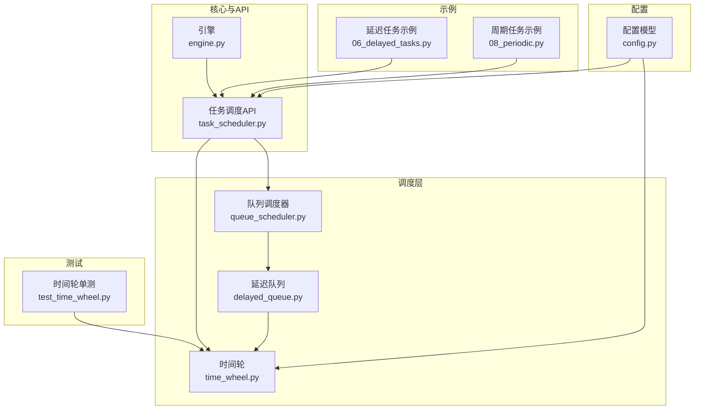
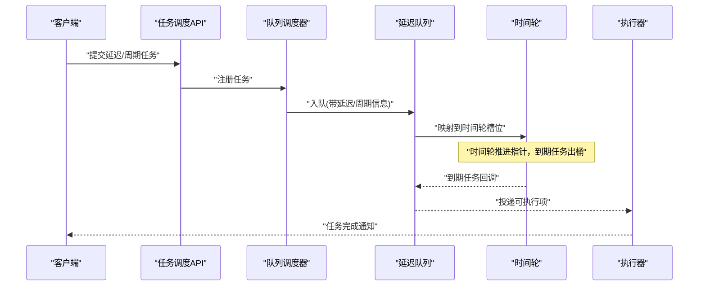
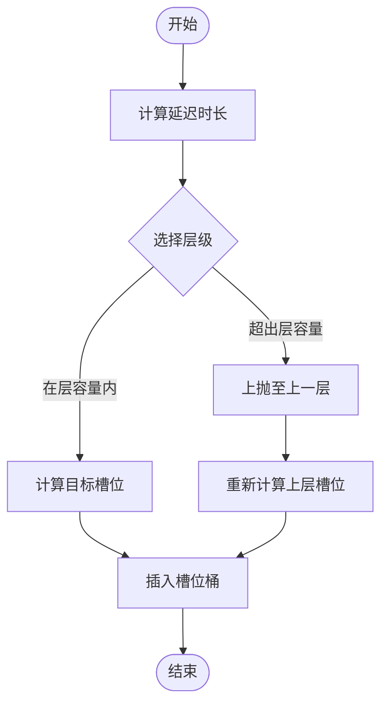
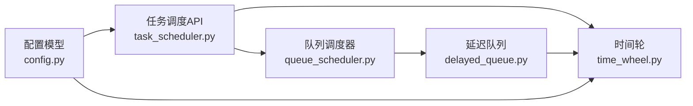

# 时间轮算法

<cite>
**本文引用的文件**   
- [src/neotask/scheduler/time_wheel.py](file://src/neotask/scheduler/time_wheel.py)
- [tests/unit/test_time_wheel.py](file://tests/unit/test_time_wheel.py)
- [examples/06_delayed_tasks.py](file://examples/06_delayed_tasks.py)
- [examples/08_periodic.py](file://examples/08_periodic.py)
- [src/neotask/models/config.py](file://src/neotask/models/config.py)
- [src/neotask/core/engine.py](file://src/neotask/core/engine.py)
- [src/neotask/api/task_scheduler.py](file://src/neotask/api/task_scheduler.py)
- [src/neotask/queue/delayed_queue.py](file://src/neotask/queue/delayed_queue.py)
- [src/neotask/queue/queue_scheduler.py](file://src/neotask/queue/queue_scheduler.py)
</cite>

## 目录
1. [简介](#简介)
2. [项目结构](#项目结构)
3. [核心组件](#核心组件)
4. [架构总览](#架构总览)
5. [详细组件分析](#详细组件分析)
6. [依赖关系分析](#依赖关系分析)
7. [性能考量](#性能考量)
8. [故障排查指南](#故障排查指南)
9. [结论](#结论)
10. [附录](#附录)

## 简介
本文件围绕时间轮（Time Wheel）调度算法，系统阐述其原理、数据结构设计、槽位分配策略与多层层次结构；深入解析任务添加、移除、过期检查等核心操作的实现逻辑；对比时间轮与最小堆、红黑树等调度结构的性能差异与适用场景；提供参数调优指南（槽位数、轮数、精度等），并结合延迟任务与定时任务的典型应用案例进行说明。最后给出内存使用与CPU开销的分析要点，帮助读者在实际工程中高效落地时间轮方案。

## 项目结构
本项目在调度层提供了时间轮的实现，并通过上层调度器与队列子系统集成到整体任务编排流程中。关键位置如下：
- 时间轮核心实现位于调度模块下
- 单元测试覆盖时间轮行为与边界条件
- 示例演示延迟任务与周期任务的用法
- 配置模型提供可调参数入口
- 引擎与API层将时间轮能力暴露给外部调用者
- 队列子系统提供延迟队列与调度器桥接



图表来源
- [src/neotask/scheduler/time_wheel.py](file://src/neotask/scheduler/time_wheel.py)
- [src/neotask/queue/queue_scheduler.py](file://src/neotask/queue/queue_scheduler.py)
- [src/neotask/queue/delayed_queue.py](file://src/neotask/queue/delayed_queue.py)
- [src/neotask/core/engine.py](file://src/neotask/core/engine.py)
- [src/neotask/api/task_scheduler.py](file://src/neotask/api/task_scheduler.py)
- [src/neotask/models/config.py](file://src/neotask/models/config.py)
- [examples/06_delayed_tasks.py](file://examples/06_delayed_tasks.py)
- [examples/08_periodic.py](file://examples/08_periodic.py)
- [tests/unit/test_time_wheel.py](file://tests/unit/test_time_wheel.py)

章节来源
- [src/neotask/scheduler/time_wheel.py](file://src/neotask/scheduler/time_wheel.py)
- [tests/unit/test_time_wheel.py](file://tests/unit/test_time_wheel.py)
- [examples/06_delayed_tasks.py](file://examples/06_delayed_tasks.py)
- [examples/08_periodic.py](file://examples/08_periodic.py)
- [src/neotask/models/config.py](file://src/neotask/models/config.py)
- [src/neotask/core/engine.py](file://src/neotask/core/engine.py)
- [src/neotask/api/task_scheduler.py](file://src/neotask/api/task_scheduler.py)
- [src/neotask/queue/delayed_queue.py](file://src/neotask/queue/delayed_queue.py)
- [src/neotask/queue/queue_scheduler.py](file://src/neotask/queue/queue_scheduler.py)

## 核心组件
- 时间轮（TimeWheel）
  - 负责基于“环形数组+桶”的槽位组织，按当前指针推进完成到期任务的分发。
  - 支持多层级轮（秒级、分钟级、小时级等）以扩展时间跨度并降低扫描成本。
- 槽位（Slot）
  - 每个槽位维护一个任务集合，用于存放到期或待推进的任务。
- 层级（Layer）
  - 每层对应不同的时间粒度与容量，上层轮步长更大、容量更高，形成多级时间轮。
- 调度器集成（QueueScheduler/DelayedQueue）
  - 将时间轮作为底层驱动，对外提供延迟任务与周期任务的统一接口。

章节来源
- [src/neotask/scheduler/time_wheel.py](file://src/neotask/scheduler/time_wheel.py)
- [src/neotask/queue/delayed_queue.py](file://src/neotask/queue/delayed_queue.py)
- [src/neotask/queue/queue_scheduler.py](file://src/neotask/queue/queue_scheduler.py)

## 架构总览
时间轮在系统中的角色是“高精度、低开销”的到期触发器。上层通过API提交延迟/周期任务，由调度器将其映射到时间轮的合适槽位；时间轮主循环推进指针，将到期任务下发至执行通道。



图表来源
- [src/neotask/api/task_scheduler.py](file://src/neotask/api/task_scheduler.py)
- [src/neotask/queue/queue_scheduler.py](file://src/neotask/queue/queue_scheduler.py)
- [src/neotask/queue/delayed_queue.py](file://src/neotask/queue/delayed_queue.py)
- [src/neotask/scheduler/time_wheel.py](file://src/neotask/scheduler/time_wheel.py)

## 详细组件分析

### 时间轮数据结构与槽位分配
- 数据结构
  - 环形数组：每层包含固定数量的槽位，索引由当前时间模槽数得到。
  - 桶集合：每个槽位内保存一组任务，支持快速插入与遍历。
  - 指针推进：主循环按单位步进移动指针，处理当前槽位中的任务。
- 多层级设计
  - 第0层：最小时间粒度（如秒），槽数较少，适合短延迟。
  - 高层：逐级扩大时间跨度与槽数，用于承载更长的延迟或周期性任务。
  - 任务落层：根据延迟时长计算应落入的层级与槽位；若超过当前层容量，则向上层继续映射。
- 槽位分配策略
  - 直接映射：对短延迟任务，按“当前时间+延迟”计算目标槽位。
  - 上抛机制：当延迟超出当前层最大范围时，将任务挂到上层轮，等待上层推进后再下沉回下层。
  - 均匀分布：尽量使任务在各槽位间均匀分布，避免热点槽位导致局部放大。



图表来源
- [src/neotask/scheduler/time_wheel.py](file://src/neotask/scheduler/time_wheel.py)

章节来源
- [src/neotask/scheduler/time_wheel.py](file://src/neotask/scheduler/time_wheel.py)

### 核心操作：添加、移除、过期检查
- 添加任务
  - 输入：任务标识、执行时机（绝对时间或相对延迟）、优先级/上下文等。
  - 过程：确定层级与槽位，将任务加入对应桶；必要时记录索引以便后续删除。
  - 复杂度：O(1) 平均插入（哈希/列表追加）。
- 移除任务
  - 输入：任务标识或句柄。
  - 过程：定位任务所在槽位并从桶中移除；若为惰性删除，则在推进时清理。
  - 复杂度：O(1) 平均（配合索引）或 O(k) 最坏（k为桶大小）。
- 过期检查与推进
  - 主循环按单位时间推进指针，处理当前槽位所有任务。
  - 对于跨层任务，推进过程中可能从上层下沉到下层，确保最终在正确时机触发。
  - 复杂度：每次推进为 O(b)，b为当前槽位任务数；总体摊销接近 O(1)/任务。

```mermaid
sequenceDiagram
participant API as "API"
participant TW as "时间轮"
participant Loop as "推进循环"
participant Exec as "执行器"
API->>TW : "添加任务(延迟/周期)"
TW->>TW : "计算层级与槽位"
TW->>TW : "插入桶"
Loop->>TW : "推进指针"
TW->>TW : "遍历当前槽位任务"
TW->>Exec : "分发到期任务"
Exec-->>Loop : "执行结果"
```

图表来源
- [src/neotask/scheduler/time_wheel.py](file://src/neotask/scheduler/time_wheel.py)
- [src/neotask/api/task_scheduler.py](file://src/neotask/api/task_scheduler.py)

章节来源
- [src/neotask/scheduler/time_wheel.py](file://src/neotask/scheduler/time_wheel.py)
- [src/neotask/api/task_scheduler.py](file://src/neotask/api/task_scheduler.py)

### 与其他调度算法的对比
- 最小堆（优先队列）
  - 优点：天然支持按时间排序，插入/弹出 O(log n)。
  - 缺点：批量推进时需多次弹出，存在较多比较与交换开销。
  - 适用：延迟分布稀疏且总量较小，或需要频繁查询最早到期任务。
- 红黑树（有序集合）
  - 优点：有序存储，支持范围查询与删除，插入/删除 O(log n)。
  - 缺点：常数因子较大，内存占用较高。
  - 适用：需要复杂区间操作与强一致顺序的场景。
- 时间轮
  - 优点：插入/推进摊销 O(1)，高吞吐、低抖动；适合大规模短延迟与周期任务。
  - 缺点：精度受槽位与步进影响；超大延迟需多层结构，增加空间与上抛逻辑。
  - 适用：高并发、海量任务、稳定时间粒度的调度系统。

[本节为概念性对比，不直接分析具体文件]

### 配置参数与调优指南
- 槽位数（每层容量）
  - 原则：根据峰值任务量与延迟分布选择，保证槽位均匀分布且不溢出。
  - 过小：热点槽位导致局部放大；过大：内存浪费与推进开销上升。
- 轮数（层级数量）
  - 原则：覆盖业务最大延迟范围；每层步长通常为下一层的倍数。
  - 过多：上抛路径变长；过少：无法承载长延迟。
- 精度（步进粒度）
  - 原则：与业务容忍度匹配；更细粒度提升准时性但增加推进频率。
- 其他
  - 线程/协程并行推进：在高负载时可考虑多推进器分片。
  - 惰性删除 vs 即时删除：权衡删除成本与内存回收及时性。

章节来源
- [src/neotask/models/config.py](file://src/neotask/models/config.py)
- [src/neotask/scheduler/time_wheel.py](file://src/neotask/scheduler/time_wheel.py)

### 应用案例：延迟任务与定时任务
- 延迟任务
  - 场景：重试退避、超时取消、异步结果缓存过期。
  - 用法：提交任务时指定延迟时长，时间轮在到期后投递执行。
- 定时任务
  - 场景：周期性采集、指标上报、健康检查。
  - 用法：以固定间隔重复注册下一次触发，或在时间轮中维护周期槽位。

章节来源
- [examples/06_delayed_tasks.py](file://examples/06_delayed_tasks.py)
- [examples/08_periodic.py](file://examples/08_periodic.py)
- [src/neotask/api/task_scheduler.py](file://src/neotask/api/task_scheduler.py)

## 依赖关系分析
时间轮与上层调度器、队列子系统以及配置模型之间存在清晰的依赖关系。时间轮作为底层驱动，被延迟队列与调度器组合使用，API层对外暴露统一接口。



图表来源
- [src/neotask/api/task_scheduler.py](file://src/neotask/api/task_scheduler.py)
- [src/neotask/scheduler/time_wheel.py](file://src/neotask/scheduler/time_wheel.py)
- [src/neotask/queue/queue_scheduler.py](file://src/neotask/queue/queue_scheduler.py)
- [src/neotask/queue/delayed_queue.py](file://src/neotask/queue/delayed_queue.py)
- [src/neotask/models/config.py](file://src/neotask/models/config.py)

章节来源
- [src/neotask/api/task_scheduler.py](file://src/neotask/api/task_scheduler.py)
- [src/neotask/scheduler/time_wheel.py](file://src/neotask/scheduler/time_wheel.py)
- [src/neotask/queue/queue_scheduler.py](file://src/neotask/queue/queue_scheduler.py)
- [src/neotask/queue/delayed_queue.py](file://src/neotask/queue/delayed_queue.py)
- [src/neotask/models/config.py](file://src/neotask/models/config.py)

## 性能考量
- 时间复杂度
  - 插入：O(1) 平均
  - 推进：O(b) 每步，b为当前槽位任务数；摊销接近 O(1)/任务
  - 删除：O(1) 平均（有索引）或 O(k) 最坏（无索引）
- 空间复杂度
  - 线性于任务总数与槽位容量；多层结构随最大延迟增长而增加空间。
- CPU开销
  - 主要消耗在推进循环与槽位遍历；可通过调整步进粒度与槽位数平衡。
- 内存使用
  - 槽位数组固定大小；任务对象引用计入内存；惰性删除可减少删除开销但延迟释放。
- 抖动与准时性
  - 步进粒度越小，抖动越低；但推进频率越高，CPU占用上升。
- 可扩展性
  - 水平扩展：多实例分片（按任务ID哈希）；垂直扩展：增大槽位与层级。

[本节为通用性能讨论，不直接分析具体文件]

## 故障排查指南
- 常见问题
  - 任务未按时触发：检查步进粒度与槽位容量是否匹配业务延迟分布。
  - 内存持续增长：确认删除策略是否为即时删除；评估惰性删除带来的延迟释放。
  - 热点槽位：观察槽位分布是否均匀，必要时调整槽位数或引入散列扰动。
  - 上层任务堆积：检查上抛路径是否正确，层级步长是否合理。
- 诊断方法
  - 监控指标：槽位利用率、推进耗时、任务延迟分布、删除失败率。
  - 日志追踪：记录任务落层与槽位映射、推进过程中的异常与重试。
  - 压测验证：在不同负载与延迟分布下进行基准测试，验证参数合理性。

章节来源
- [tests/unit/test_time_wheel.py](file://tests/unit/test_time_wheel.py)
- [src/neotask/scheduler/time_wheel.py](file://src/neotask/scheduler/time_wheel.py)

## 结论
时间轮以其摊销 O(1) 的插入与推进特性，成为高吞吐、低抖动调度系统的优选方案。通过合理的槽位数、层级与步进粒度配置，可在内存与CPU之间取得良好平衡。结合延迟任务与周期任务的典型用例，时间轮能够显著提升任务调度的效率与稳定性。在生产环境中，建议配合完善的监控与压测体系，持续优化参数与架构。

[本节为总结性内容，不直接分析具体文件]

## 附录
- 术语表
  - 槽位：时间轮环形数组中的一个单元，承载到期任务集合。
  - 层级：不同时间粒度与容量的轮，形成多级时间轮结构。
  - 推进：时间轮主循环按步进移动指针并处理到期任务的过程。
- 参考实现与测试
  - 时间轮核心实现与单测可作为进一步研究与二次开发的起点。

[本节为补充信息，不直接分析具体文件]