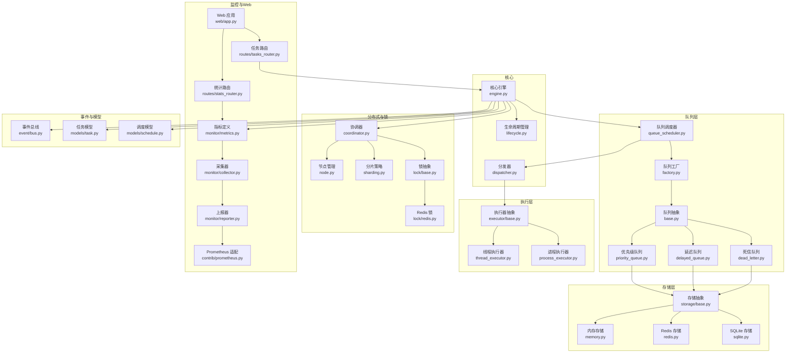
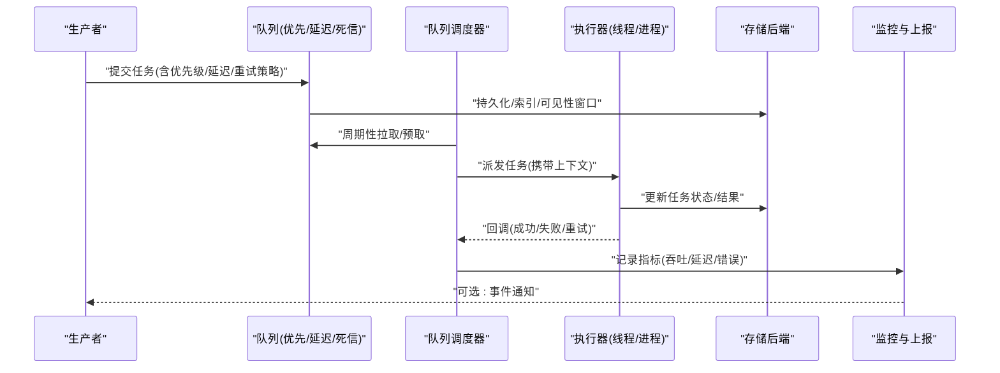
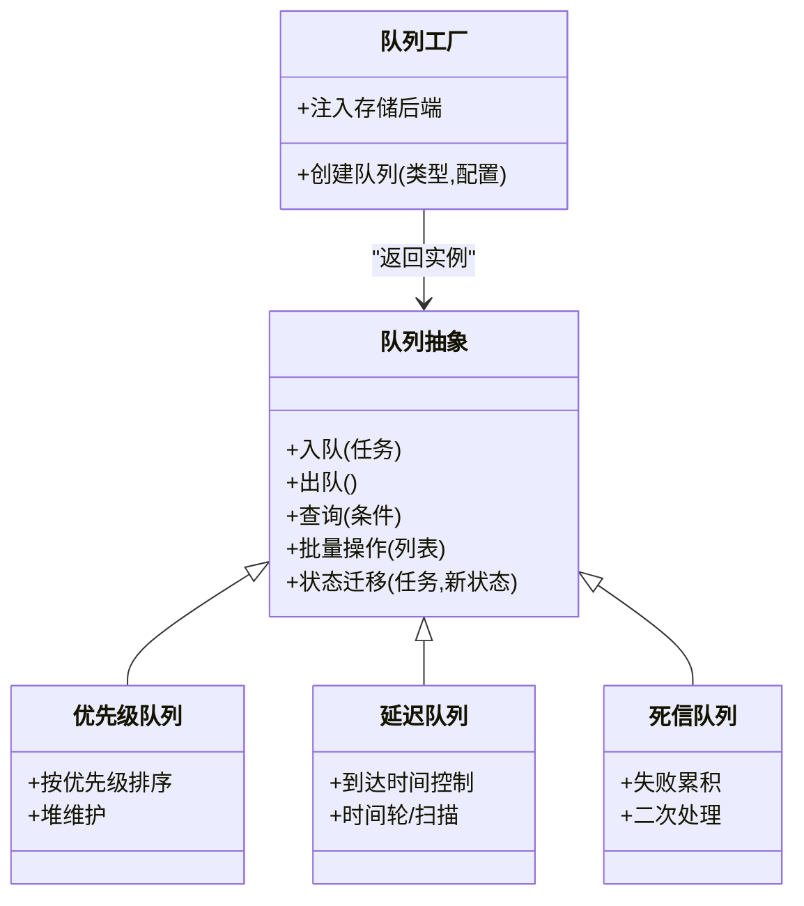
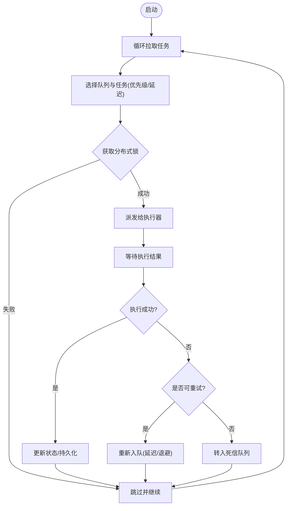
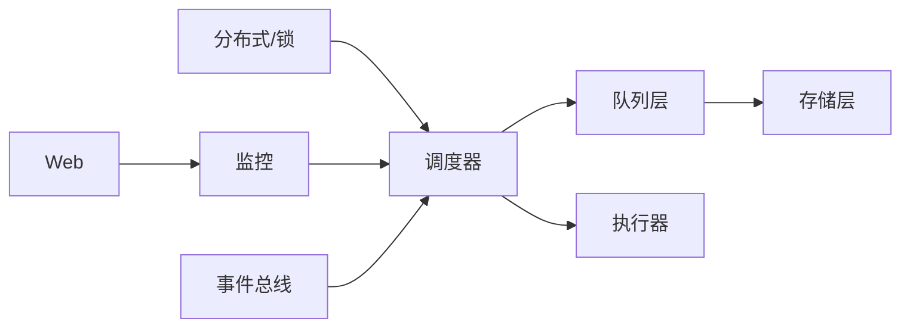

# 任务队列系统

<cite>
**本文引用的文件**   
- [README.md](file://README.md)
- [pyproject.toml](file://pyproject.toml)
- [src/neotask/queue/base.py](file://src/neotask/queue/base.py)
- [src/neotask/queue/priority_queue.py](file://src/neotask/queue/priority_queue.py)
- [src/neotask/queue/delayed_queue.py](file://src/neotask/queue/delayed_queue.py)
- [src/neotask/queue/dead_letter.py](file://src/neotask/queue/dead_letter.py)
- [src/neotask/queue/factory.py](file://src/neotask/queue/factory.py)
- [src/neotask/queue/queue_scheduler.py](file://src/neotask/queue/queue_scheduler.py)
- [src/neotask/storage/base.py](file://src/neotask/storage/base.py)
- [src/neotask/storage/memory.py](file://src/neotask/storage/memory.py)
- [src/neotask/storage/redis.py](file://src/neotask/storage/redis.py)
- [src/neotask/storage/sqlite.py](file://src/neotask/storage/sqlite.py)
- [src/neotask/models/task.py](file://src/neotask/models/task.py)
- [src/neotask/models/schedule.py](file://src/neotask/models/schedule.py)
- [src/neotask/core/engine.py](file://src/neotask/core/engine.py)
- [src/neotask/core/dispatcher.py](file://src/neotask/core/dispatcher.py)
- [src/neotask/core/lifecycle.py](file://src/neotask/core/lifecycle.py)
- [src/neotask/executor/base.py](file://src/neotask/executor/base.py)
- [src/neotask/executor/thread_executor.py](file://src/neotask/executor/thread_executor.py)
- [src/neotask/executor/process_executor.py](file://src/neotask/executor/process_executor.py)
- [src/neotask/monitor/metrics.py](file://src/neotask/monitor/metrics.py)
- [src/neotask/monitor/collector.py](file://src/neotask/monitor/collector.py)
- [src/neotask/monitor/reporter.py](file://src/neotask/monitor/reporter.py)
- [src/neotask/contrib/prometheus.py](file://src/neotask/contrib/prometheus.py)
- [src/neotask/web/app.py](file://src/neotask/web/app.py)
- [src/neotask/web/routes/tasks_router.py](file://src/neotask/web/routes/tasks_router.py)
- [src/neotask/web/routes/stats_router.py](file://src/neotask/web/routes/stats_router.py)
- [src/neotask/event/bus.py](file://src/neotask/event/bus.py)
- [src/neotask/lock/base.py](file://src/neotask/lock/base.py)
- [src/neotask/lock/redis.py](file://src/neotask/lock/redis.py)
- [src/neotask/distributed/coordinator.py](file://src/neotask/distributed/coordinator.py)
- [src/neotask/distributed/node.py](file://src/neotask/distributed/node.py)
- [src/neotask/distributed/sharding.py](file://src/neotask/distributed/sharding.py)
- [tests/unit/test_priority_queue.py](file://tests/unit/test_priority_queue.py)
- [tests/unit/test_delayed_queue.py](file://tests/unit/test_delayed_queue.py)
- [tests/integration/test_failure_recovery.py](file://tests/integration/test_failure_recovery.py)
</cite>

## 目录
1. [简介](#简介)
2. [项目结构](#项目结构)
3. [核心组件](#核心组件)
4. [架构总览](#架构总览)
5. [详细组件分析](#详细组件分析)
6. [依赖关系分析](#依赖关系分析)
7. [性能与容量规划](#性能与容量规划)
8. [故障处理与恢复](#故障处理与恢复)
9. [监控、告警与可观测性](#监控告警与可观测性)
10. [结论](#结论)
11. [附录：最佳实践清单](#附录最佳实践清单)

## 简介
本仓库实现了一个可扩展的任务队列系统，支持多种队列类型（优先级队列、延迟队列、死信队列），提供调度器、执行器、存储后端、分布式协调、锁、事件总线、监控与 Web UI 等能力。其目标是帮助开发者以统一接口构建高吞吐、低延迟、可观测且具备容错能力的异步任务处理平台。

## 项目结构
- 模块按职责分层组织：core（引擎/生命周期）、queue（队列抽象与实现）、storage（持久化后端）、executor（执行器）、distributed（分布式协调与分片）、monitor（指标采集与上报）、web（Web API 与静态页面）、event（事件总线）、lock（分布式锁）等。
- 入口点包括 CLI、Web 应用与示例脚本；测试覆盖单元、集成与基准场景。

图表来源
- [src/neotask/core/engine.py](file://src/neotask/core/engine.py)
- [src/neotask/queue/queue_scheduler.py](file://src/neotask/queue/queue_scheduler.py)
- [src/neotask/queue/factory.py](file://src/neotask/queue/factory.py)
- [src/neotask/queue/base.py](file://src/neotask/queue/base.py)
- [src/neotask/queue/priority_queue.py](file://src/neotask/queue/priority_queue.py)
- [src/neotask/queue/delayed_queue.py](file://src/neotask/queue/delayed_queue.py)
- [src/neotask/queue/dead_letter.py](file://src/neotask/queue/dead_letter.py)
- [src/neotask/storage/base.py](file://src/neotask/storage/base.py)
- [src/neotask/storage/memory.py](file://src/neotask/storage/memory.py)
- [src/neotask/storage/redis.py](file://src/neotask/storage/redis.py)
- [src/neotask/storage/sqlite.py](file://src/neotask/storage/sqlite.py)
- [src/neotask/core/dispatcher.py](file://src/neotask/core/dispatcher.py)
- [src/neotask/executor/base.py](file://src/neotask/executor/base.py)
- [src/neotask/executor/thread_executor.py](file://src/neotask/executor/thread_executor.py)
- [src/neotask/executor/process_executor.py](file://src/neotask/executor/process_executor.py)
- [src/neotask/monitor/metrics.py](file://src/neotask/monitor/metrics.py)
- [src/neotask/monitor/collector.py](file://src/neotask/monitor/collector.py)
- [src/neotask/monitor/reporter.py](file://src/neotask/monitor/reporter.py)
- [src/neotask/contrib/prometheus.py](file://src/neotask/contrib/prometheus.py)
- [src/neotask/web/app.py](file://src/neotask/web/app.py)
- [src/neotask/web/routes/tasks_router.py](file://src/neotask/web/routes/tasks_router.py)
- [src/neotask/web/routes/stats_router.py](file://src/neotask/web/routes/stats_router.py)
- [src/neotask/event/bus.py](file://src/neotask/event/bus.py)
- [src/neotask/lock/base.py](file://src/neotask/lock/base.py)
- [src/neotask/lock/redis.py](file://src/neotask/lock/redis.py)
- [src/neotask/distributed/coordinator.py](file://src/neotask/distributed/coordinator.py)
- [src/neotask/distributed/node.py](file://src/neotask/distributed/node.py)
- [src/neotask/distributed/sharding.py](file://src/neotask/distributed/sharding.py)
- [src/neotask/models/task.py](file://src/neotask/models/task.py)
- [src/neotask/models/schedule.py](file://src/neotask/models/schedule.py)

章节来源
- [README.md](file://README.md)
- [pyproject.toml](file://pyproject.toml)

## 核心组件
- 队列抽象与实现
  - 基础队列接口定义了入队、出队、查询、状态变更等通用操作，所有具体队列均基于该抽象扩展。
  - 优先级队列通过堆结构维护任务优先级，适合“重要先处理”的场景。
  - 延迟队列结合时间轮或定时扫描机制，将任务在到达触发时间前保持不可见，适用于延时执行与退避重试。
  - 死信队列用于收集多次失败或超时的任务，便于人工干预与二次处理。
- 队列调度器
  - 负责从不同队列中拉取任务、进行幂等与并发控制、并投递给执行器。
  - 内部通常包含预取、背压、限流与公平性策略。
- 执行器
  - 线程执行器与进程执行器分别面向轻量与隔离型任务，支持参数传递、上下文传播与结果回写。
- 存储后端
  - 内存存储用于开发与测试；Redis 存储用于生产级持久化与跨进程共享；SQLite 存储用于单机轻量部署。
- 分布式与锁
  - 协调器负责节点注册、健康检查与任务分配；分片策略决定任务归属；分布式锁保障幂等与互斥。
- 监控与 Web
  - 指标定义、采集与上报形成可观测闭环；Prometheus 适配暴露标准指标；Web 提供任务管理与统计视图。

章节来源
- [src/neotask/queue/base.py](file://src/neotask/queue/base.py)
- [src/neotask/queue/priority_queue.py](file://src/neotask/queue/priority_queue.py)
- [src/neotask/queue/delayed_queue.py](file://src/neotask/queue/delayed_queue.py)
- [src/neotask/queue/dead_letter.py](file://src/neotask/queue/dead_letter.py)
- [src/neotask/queue/queue_scheduler.py](file://src/neotask/queue/queue_scheduler.py)
- [src/neotask/executor/base.py](file://src/neotask/executor/base.py)
- [src/neotask/executor/thread_executor.py](file://src/neotask/executor/thread_executor.py)
- [src/neotask/executor/process_executor.py](file://src/neotask/executor/process_executor.py)
- [src/neotask/storage/base.py](file://src/neotask/storage/base.py)
- [src/neotask/storage/memory.py](file://src/neotask/storage/memory.py)
- [src/neotask/storage/redis.py](file://src/neotask/storage/redis.py)
- [src/neotask/storage/sqlite.py](file://src/neotask/storage/sqlite.py)
- [src/neotask/distributed/coordinator.py](file://src/neotask/distributed/coordinator.py)
- [src/neotask/distributed/node.py](file://src/neotask/distributed/node.py)
- [src/neotask/distributed/sharding.py](file://src/neotask/distributed/sharding.py)
- [src/neotask/lock/base.py](file://src/neotask/lock/base.py)
- [src/neotask/lock/redis.py](file://src/neotask/lock/redis.py)
- [src/neotask/monitor/metrics.py](file://src/neotask/monitor/metrics.py)
- [src/neotask/monitor/collector.py](file://src/neotask/monitor/collector.py)
- [src/neotask/monitor/reporter.py](file://src/neotask/monitor/reporter.py)
- [src/neotask/contrib/prometheus.py](file://src/neotask/contrib/prometheus.py)
- [src/neotask/web/app.py](file://src/neotask/web/app.py)
- [src/neotask/web/routes/tasks_router.py](file://src/neotask/web/routes/tasks_router.py)
- [src/neotask/web/routes/stats_router.py](file://src/neotask/web/routes/stats_router.py)

## 架构总览
系统采用“生产者 -> 队列 -> 调度器 -> 执行器 -> 存储/监控”的分层架构。调度器作为中枢，协调多队列、多执行器与分布式能力，并通过事件总线与监控体系对外暴露运行态信息。

图表来源
- [src/neotask/queue/queue_scheduler.py](file://src/neotask/queue/queue_scheduler.py)
- [src/neotask/queue/priority_queue.py](file://src/neotask/queue/priority_queue.py)
- [src/neotask/queue/delayed_queue.py](file://src/neotask/queue/delayed_queue.py)
- [src/neotask/queue/dead_letter.py](file://src/neotask/queue/dead_letter.py)
- [src/neotask/executor/base.py](file://src/neotask/executor/base.py)
- [src/neotask/storage/base.py](file://src/neotask/storage/base.py)
- [src/neotask/monitor/metrics.py](file://src/neotask/monitor/metrics.py)

## 详细组件分析

### 队列抽象与工厂
- 抽象接口
  - 定义统一的入队、出队、查询、批量操作与状态迁移方法，屏蔽底层存储差异。
- 工厂模式
  - 根据配置选择具体队列实现（优先/延迟/死信），并注入对应存储后端与调度策略。

图表来源
- [src/neotask/queue/base.py](file://src/neotask/queue/base.py)
- [src/neotask/queue/priority_queue.py](file://src/neotask/queue/priority_queue.py)
- [src/neotask/queue/delayed_queue.py](file://src/neotask/queue/delayed_queue.py)
- [src/neotask/queue/dead_letter.py](file://src/neotask/queue/dead_letter.py)
- [src/neotask/queue/factory.py](file://src/neotask/queue/factory.py)

章节来源
- [src/neotask/queue/base.py](file://src/neotask/queue/base.py)
- [src/neotask/queue/factory.py](file://src/neotask/queue/factory.py)

### 优先级队列
- 特性
  - 使用堆结构维护任务优先级，确保高优先级任务优先出队。
  - 支持同优先级下的 FIFO 顺序，保证公平性。
- 使用场景
  - 关键路径任务、超时敏感任务、SLA 要求严格的业务。
- 复杂度
  - 入队 O(log n)，出队 O(log n)，查询与批量操作取决于存储实现。
- 优化建议
  - 合理设置优先级粒度，避免过多层级导致堆操作开销上升。
  - 对热点队列启用预取与批处理，降低调度器往返次数。

章节来源
- [src/neotask/queue/priority_queue.py](file://src/neotask/queue/priority_queue.py)
- [tests/unit/test_priority_queue.py](file://tests/unit/test_priority_queue.py)

### 延迟队列
- 特性
  - 任务在到达指定时间前不可见，到达后进入就绪队列供调度器拉取。
  - 常借助时间轮或定时扫描实现高效到期检测。
- 使用场景
  - 延时任务、退避重试、定时清理、补偿任务。
- 复杂度
  - 到期检测接近 O(1) 摊销（时间轮），或 O(k) 扫描（k 为到期桶）。
- 优化建议
  - 调整时间轮槽位数量与粒度，平衡内存占用与精度。
  - 对大量短延迟任务采用合并与批量唤醒策略。

章节来源
- [src/neotask/queue/delayed_queue.py](file://src/neotask/queue/delayed_queue.py)
- [tests/unit/test_delayed_queue.py](file://tests/unit/test_delayed_queue.py)

### 死信队列
- 特性
  - 收集多次失败或达到最大重试次数的任务，防止阻塞主流程。
  - 支持二次消费、告警与人工介入。
- 使用场景
  - 异常任务归档、审计追踪、离线修复。
- 注意事项
  - 需定期巡检与清理，避免无限增长。
  - 与监控告警联动，及时通知运维。

章节来源
- [src/neotask/queue/dead_letter.py](file://src/neotask/queue/dead_letter.py)

### 队列调度器
- 工作机制
  - 周期性地从各队列拉取任务，遵循优先级与延迟约束。
  - 内置预取、限流、背压与公平性策略，避免执行器过载。
  - 与分布式锁配合，确保同一任务仅被一个消费者处理。
- 流程图（简化）

图表来源
- [src/neotask/queue/queue_scheduler.py](file://src/neotask/queue/queue_scheduler.py)
- [src/neotask/lock/base.py](file://src/neotask/lock/base.py)
- [src/neotask/lock/redis.py](file://src/neotask/lock/redis.py)

章节来源
- [src/neotask/queue/queue_scheduler.py](file://src/neotask/queue/queue_scheduler.py)

### 执行器（线程/进程）
- 线程执行器
  - 适合 I/O 密集型与轻量 CPU 任务，上下文切换开销小。
- 进程执行器
  - 适合 CPU 密集或需要强隔离的任务，避免 GIL 限制与资源竞争。
- 共性
  - 支持任务参数序列化、结果回写、异常捕获与重试策略。

章节来源
- [src/neotask/executor/base.py](file://src/neotask/executor/base.py)
- [src/neotask/executor/thread_executor.py](file://src/neotask/executor/thread_executor.py)
- [src/neotask/executor/process_executor.py](file://src/neotask/executor/process_executor.py)

### 存储后端（内存/Redis/SQLite）
- 内存存储
  - 开发调试首选，零外部依赖，但进程重启数据丢失。
- Redis 存储
  - 生产推荐，支持跨进程共享、原子操作与高性能数据结构。
- SQLite 存储
  - 单机轻量部署，简单可靠，适合小规模场景。
- 设计要点
  - 通过抽象接口屏蔽差异；事务与幂等由上层保障；索引与可见性窗口由队列层控制。

章节来源
- [src/neotask/storage/base.py](file://src/neotask/storage/base.py)
- [src/neotask/storage/memory.py](file://src/neotask/storage/memory.py)
- [src/neotask/storage/redis.py](file://src/neotask/storage/redis.py)
- [src/neotask/storage/sqlite.py](file://src/neotask/storage/sqlite.py)

### 分布式与锁
- 协调器与节点管理
  - 节点注册、心跳与健康检查，动态扩缩容。
- 分片策略
  - 按任务键或哈希分片，提升并行度与负载均衡。
- 分布式锁
  - 基于 Redis 的锁实现，保障任务幂等与互斥执行。

章节来源
- [src/neotask/distributed/coordinator.py](file://src/neotask/distributed/coordinator.py)
- [src/neotask/distributed/node.py](file://src/neotask/distributed/node.py)
- [src/neotask/distributed/sharding.py](file://src/neotask/distributed/sharding.py)
- [src/neotask/lock/base.py](file://src/neotask/lock/base.py)
- [src/neotask/lock/redis.py](file://src/neotask/lock/redis.py)

### 监控、Web 与事件
- 指标与采集
  - 定义吞吐、延迟、错误率、队列深度等指标；采集器周期性汇总；上报器推送至后端。
- Prometheus 适配
  - 暴露标准指标端点，便于抓取与可视化。
- Web 界面
  - 任务路由提供任务查询与管理；统计路由展示系统健康与性能概览。
- 事件总线
  - 解耦子系统通信，支持任务生命周期事件发布与订阅。

章节来源
- [src/neotask/monitor/metrics.py](file://src/neotask/monitor/metrics.py)
- [src/neotask/monitor/collector.py](file://src/neotask/monitor/collector.py)
- [src/neotask/monitor/reporter.py](file://src/neotask/monitor/reporter.py)
- [src/neotask/contrib/prometheus.py](file://src/neotask/contrib/prometheus.py)
- [src/neotask/web/app.py](file://src/neotask/web/app.py)
- [src/neotask/web/routes/tasks_router.py](file://src/neotask/web/routes/tasks_router.py)
- [src/neotask/web/routes/stats_router.py](file://src/neotask/web/routes/stats_router.py)
- [src/neotask/event/bus.py](file://src/neotask/event/bus.py)

## 依赖关系分析
- 耦合与内聚
  - 队列层与存储层通过抽象解耦；调度器与执行器通过接口协作；分布式与锁独立于业务逻辑。
- 外部依赖
  - Redis 用于分布式锁与存储；Prometheus 用于指标抓取；Web 框架用于 API 与静态页面。
- 潜在环依赖
  - 通过事件总线与接口抽象避免直接循环引用；调度器不直接依赖具体执行器实现。

图表来源
- [src/neotask/queue/base.py](file://src/neotask/queue/base.py)
- [src/neotask/queue/queue_scheduler.py](file://src/neotask/queue/queue_scheduler.py)
- [src/neotask/storage/base.py](file://src/neotask/storage/base.py)
- [src/neotask/executor/base.py](file://src/neotask/executor/base.py)
- [src/neotask/distributed/coordinator.py](file://src/neotask/distributed/coordinator.py)
- [src/neotask/lock/base.py](file://src/neotask/lock/base.py)
- [src/neotask/monitor/metrics.py](file://src/neotask/monitor/metrics.py)
- [src/neotask/web/app.py](file://src/neotask/web/app.py)
- [src/neotask/event/bus.py](file://src/neotask/event/bus.py)

## 性能与容量规划
- 队列容量规划
  - 预估峰值 QPS 与平均任务大小，计算队列深度上限与存储容量。
  - 为死信队列设置保留策略与自动清理，避免无限增长。
- 调度器调优
  - 调整预取批次大小与并发度，匹配执行器处理能力。
  - 针对延迟队列优化时间轮槽位与扫描频率，减少无效遍历。
- 存储选型
  - 高吞吐与跨进程共享选 Redis；单机轻量选 SQLite；开发调试用内存。
- 背压与限流
  - 当执行器饱和时，调度器应降低拉取速率，避免队列膨胀与内存压力。
- 指标驱动优化
  - 关注吞吐、P99 延迟、错误率与队列深度，结合告警阈值持续调优。

[本节为通用指导，无需特定文件来源]

## 故障处理与恢复
- 任务失败与重试
  - 支持指数退避与最大重试次数；超过阈值的任务转入死信队列。
- 幂等与去重
  - 通过分布式锁与任务唯一键避免重复执行。
- 节点故障
  - 心跳检测与自动剔除；未完成任务可由其他节点接管（基于可见性窗口与锁续期）。
- 数据一致性
  - 存储层事务与原子操作保障状态迁移的一致性；调度器侧做幂等校验。
- 恢复演练
  - 参考集成测试中的故障恢复用例，验证系统在异常场景下的自愈能力。

章节来源
- [src/neotask/queue/dead_letter.py](file://src/neotask/queue/dead_letter.py)
- [src/neotask/lock/redis.py](file://src/neotask/lock/redis.py)
- [src/neotask/distributed/coordinator.py](file://src/neotask/distributed/coordinator.py)
- [tests/integration/test_failure_recovery.py](file://tests/integration/test_failure_recovery.py)

## 监控、告警与可观测性
- 指标维度
  - 吞吐（任务数/秒）、延迟（端到端 P50/P95/P99）、错误率、队列深度、重试次数、死信计数。
- 采集与上报
  - 采集器聚合指标，上报器推送至 Prometheus 或其他后端。
- Web 可视化
  - 任务路由与统计路由提供实时视图，辅助定位瓶颈与异常。
- 告警策略
  - 基于阈值与趋势变化设置告警规则，如队列积压、错误率突增、节点失联。

章节来源
- [src/neotask/monitor/metrics.py](file://src/neotask/monitor/metrics.py)
- [src/neotask/monitor/collector.py](file://src/neotask/monitor/collector.py)
- [src/neotask/monitor/reporter.py](file://src/neotask/monitor/reporter.py)
- [src/neotask/contrib/prometheus.py](file://src/neotask/contrib/prometheus.py)
- [src/neotask/web/routes/stats_router.py](file://src/neotask/web/routes/stats_router.py)

## 结论
本任务队列系统通过清晰的层次划分与模块化设计，提供了灵活的队列类型、高效的调度机制、可靠的分布式能力与完善的监控体系。在生产环境中，建议结合业务特征选择合适的队列与存储后端，并通过指标驱动的容量规划与性能调优，确保系统在高负载下稳定运行。

[本节为总结性内容，无需特定文件来源]

## 附录：最佳实践清单
- 明确任务 SLA 与优先级，合理设计优先级队列层级。
- 对耗时任务启用延迟与重试策略，避免雪崩效应。
- 使用分布式锁与唯一键保障幂等执行。
- 为死信队列设置保留策略与自动化清理。
- 基于 Prometheus 建立告警规则，覆盖关键指标。
- 定期进行故障演练与恢复验证，完善应急预案。

[本节为通用指导，无需特定文件来源]