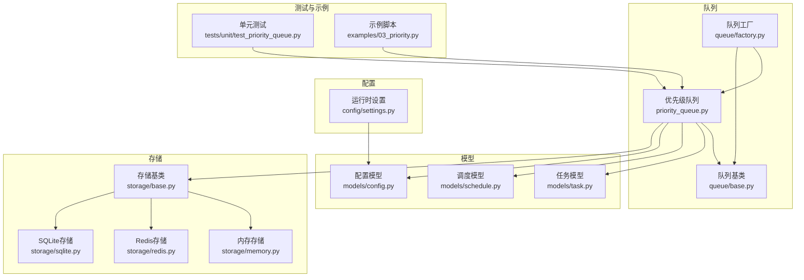
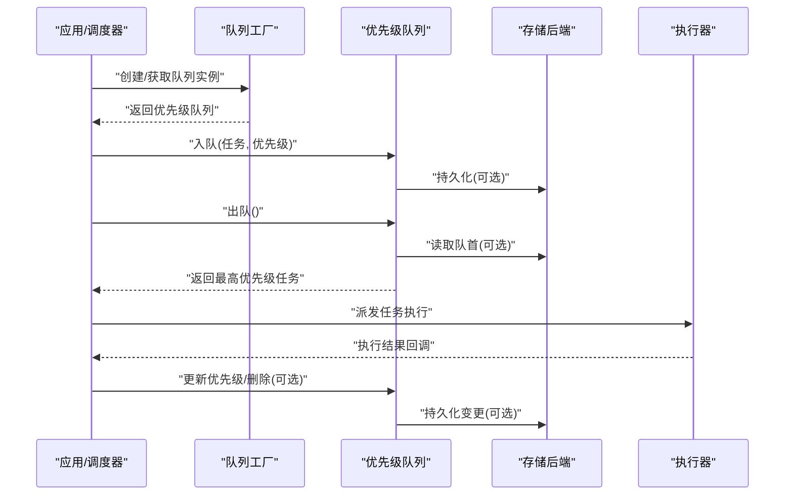
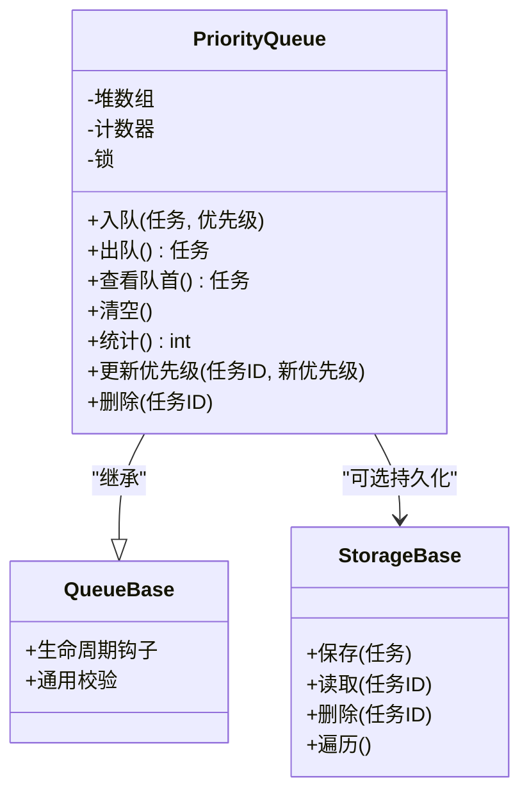
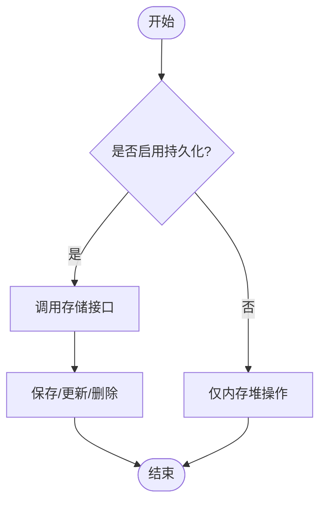
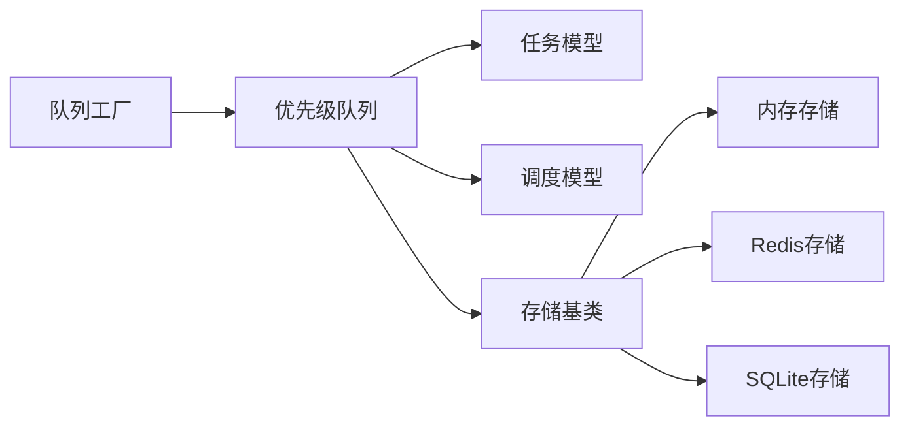

# 优先级队列

<cite>
**本文引用的文件**   
- [priority_queue.py](file://src/neotask/queue/priority_queue.py)
- [base.py](file://src/neotask/queue/base.py)
- [factory.py](file://src/neotask/queue/factory.py)
- [task.py](file://src/neotask/models/task.py)
- [schedule.py](file://src/neotask/models/schedule.py)
- [config.py](file://src/neotask/models/config.py)
- [settings.py](file://src/neotask/config/settings.py)
- [memory.py](file://src/neotask/storage/memory.py)
- [redis.py](file://src/neotask/storage/redis.py)
- [sqlite.py](file://src/neotask/storage/sqlite.py)
- [base.py](file://src/neotask/storage/base.py)
- [test_priority_queue.py](file://tests/unit/test_priority_queue.py)
- [03_priority.py](file://examples/03_priority.py)
</cite>

## 目录
1. [简介](#简介)
2. [项目结构](#项目结构)
3. [核心组件](#核心组件)
4. [架构总览](#架构总览)
5. [详细组件分析](#详细组件分析)
6. [依赖关系分析](#依赖关系分析)
7. [性能考量](#性能考量)
8. [故障排查指南](#故障排查指南)
9. [结论](#结论)
10. [附录](#附录)

## 简介
本文件围绕任务调度系统中的“优先级队列”进行系统化说明，涵盖实现原理、算法设计、堆数据结构优化、动态优先级调整与公平性保证、配置参数与性能调优建议、使用示例与常见场景，以及与存储层的集成和数据持久化策略。目标是帮助读者快速理解并高效使用该队列，同时为二次开发与扩展提供清晰的技术参考。

## 项目结构
优先级队列位于队列子系统内，并与模型层、存储层、配置层以及测试和示例代码紧密协作。下图展示了与优先级队列相关的核心模块及其职责：

图表来源
- [priority_queue.py:1-200](file://src/neotask/queue/priority_queue.py#L1-L200)
- [base.py:1-200](file://src/neotask/queue/base.py#L1-L200)
- [factory.py:1-200](file://src/neotask/queue/factory.py#L1-L200)
- [task.py:1-200](file://src/neotask/models/task.py#L1-L200)
- [schedule.py:1-200](file://src/neotask/models/schedule.py#L1-L200)
- [config.py:1-200](file://src/neotask/models/config.py#L1-L200)
- [settings.py:1-200](file://src/neotask/config/settings.py#L1-L200)
- [base.py:1-200](file://src/neotask/storage/base.py#L1-L200)
- [memory.py:1-200](file://src/neotask/storage/memory.py#L1-L200)
- [redis.py:1-200](file://src/neotask/storage/redis.py#L1-L200)
- [sqlite.py:1-200](file://src/neotask/storage/sqlite.py#L1-L200)
- [test_priority_queue.py:1-200](file://tests/unit/test_priority_queue.py#L1-L200)
- [03_priority.py:1-200](file://examples/03_priority.py#L1-L200)

章节来源
- [priority_queue.py:1-200](file://src/neotask/queue/priority_queue.py#L1-L200)
- [base.py:1-200](file://src/neotask/queue/base.py#L1-L200)
- [factory.py:1-200](file://src/neotask/queue/factory.py#L1-L200)
- [task.py:1-200](file://src/neotask/models/task.py#L1-L200)
- [schedule.py:1-200](file://src/neotask/models/schedule.py#L1-L200)
- [config.py:1-200](file://src/neotask/models/config.py#L1-L200)
- [settings.py:1-200](file://src/neotask/config/settings.py#L1-L200)
- [base.py:1-200](file://src/neotask/storage/base.py#L1-L200)
- [memory.py:1-200](file://src/neotask/storage/memory.py#L1-L200)
- [redis.py:1-200](file://src/neotask/storage/redis.py#L1-L200)
- [sqlite.py:1-200](file://src/neotask/storage/sqlite.py#L1-L200)
- [test_priority_queue.py:1-200](file://tests/unit/test_priority_queue.py#L1-L200)
- [03_priority.py:1-200](file://examples/03_priority.py#L1-L200)

## 核心组件
- 优先级队列（PriorityQueue）
  - 基于最小堆实现，支持按优先级出队，优先级相同则按入队顺序（稳定排序）。
  - 提供入队、出队、查看队首、清空、统计等常用操作。
  - 支持动态更新优先级与删除指定任务。
- 队列基类（Queue Base）
  - 定义统一接口与生命周期钩子，供不同队列类型复用。
- 队列工厂（Queue Factory）
  - 根据配置创建具体队列实例，便于切换存储后端或队列策略。
- 任务与调度模型（Task/Schedule）
  - 承载任务的元数据与调度信息，包含优先级字段及时间相关属性。
- 配置与设置（Config/Settings）
  - 提供默认优先级范围、最大容量、是否启用延迟队列等开关与阈值。
- 存储层（Storage）
  - 抽象存储接口，提供内存、Redis、SQLite三种后端，用于持久化与跨进程共享。

章节来源
- [priority_queue.py:1-200](file://src/neotask/queue/priority_queue.py#L1-L200)
- [base.py:1-200](file://src/neotask/queue/base.py#L1-L200)
- [factory.py:1-200](file://src/neotask/queue/factory.py#L1-L200)
- [task.py:1-200](file://src/neotask/models/task.py#L1-L200)
- [schedule.py:1-200](file://src/neotask/models/schedule.py#L1-L200)
- [config.py:1-200](file://src/neotask/models/config.py#L1-L200)
- [settings.py:1-200](file://src/neotask/config/settings.py#L1-L200)
- [base.py:1-200](file://src/neotask/storage/base.py#L1-L200)
- [memory.py:1-200](file://src/neotask/storage/memory.py#L1-L200)
- [redis.py:1-200](file://src/neotask/storage/redis.py#L1-L200)
- [sqlite.py:1-200](file://src/neotask/storage/sqlite.py#L1-L200)

## 架构总览
优先级队列在系统中的作用是承接上层调度器与底层执行器之间的任务分发，确保高优先级任务优先被消费，同时在多存储后端下保持一致的语义与性能特征。

图表来源
- [factory.py:1-200](file://src/neotask/queue/factory.py#L1-L200)
- [priority_queue.py:1-200](file://src/neotask/queue/priority_queue.py#L1-L200)
- [base.py:1-200](file://src/neotask/storage/base.py#L1-L200)
- [memory.py:1-200](file://src/neotask/storage/memory.py#L1-L200)
- [redis.py:1-200](file://src/neotask/storage/redis.py#L1-L200)
- [sqlite.py:1-200](file://src/neotask/storage/sqlite.py#L1-L200)

## 详细组件分析

### 优先级队列（PriorityQueue）
- 数据结构与算法
  - 内部采用最小堆维护任务序列，堆顶为当前最高优先级任务。
  - 入队：O(log n)，将新元素插入堆尾后上浮至正确位置。
  - 出队：O(log n)，取出堆顶并用最后一个元素替换后下沉恢复堆性质。
  - 查看队首：O(1)。
  - 动态更新优先级：通过标记旧条目并插入新条目，配合惰性清理避免频繁重排。
  - 删除指定任务：通过唯一标识定位并惰性标记，后续出队时跳过已失效项。
- 稳定性与公平性
  - 当优先级相同时，依据入队顺序（单调递增的时间戳或序列号）决定先后，保证稳定排序与先进先出的公平性。
- 并发安全
  - 在多线程或多协程环境下，对关键路径加锁或使用原子操作，确保堆一致性与可见性。
- 与存储层集成
  - 可配置是否持久化；若启用，则在入队、出队、更新、删除时同步到存储后端，保障崩溃恢复与跨进程共享。

图表来源
- [priority_queue.py:1-200](file://src/neotask/queue/priority_queue.py#L1-L200)
- [base.py:1-200](file://src/neotask/queue/base.py#L1-L200)
- [base.py:1-200](file://src/neotask/storage/base.py#L1-L200)

章节来源
- [priority_queue.py:1-200](file://src/neotask/queue/priority_queue.py#L1-L200)
- [base.py:1-200](file://src/neotask/queue/base.py#L1-L200)
- [base.py:1-200](file://src/neotask/storage/base.py#L1-L200)

### 任务与调度模型（Task/Schedule）
- 任务模型
  - 包含任务标识、名称、参数、状态、优先级、创建时间、计划执行时间等字段。
  - 优先级字段参与堆比较，结合入队序号保证稳定性。
- 调度模型
  - 描述定时、周期、延迟等调度策略，与优先级协同决定最终执行顺序。
- 与队列交互
  - 入队时将任务对象序列化或引用存入堆节点；出队时反序列化或直接传递引用给执行器。

章节来源
- [task.py:1-200](file://src/neotask/models/task.py#L1-L200)
- [schedule.py:1-200](file://src/neotask/models/schedule.py#L1-L200)

### 配置与设置（Config/Settings）
- 优先级范围与步长
  - 定义最小/最大优先级值与步长，限制用户传入的优先级合法性。
- 容量与限流
  - 最大队列长度、批量出队大小、超时重试次数等。
- 持久化开关
  - 是否开启落盘、落盘策略（写回/刷盘）、存储后端选择。
- 公平性策略
  - 同优先级是否严格遵循入队顺序、是否允许抢占式插队。

章节来源
- [config.py:1-200](file://src/neotask/models/config.py#L1-L200)
- [settings.py:1-200](file://src/neotask/config/settings.py#L1-L200)

### 存储层集成（Memory/Redis/SQLite）
- 存储基类
  - 定义统一的保存、读取、删除、遍历接口，屏蔽后端差异。
- 内存存储
  - 适用于单机单进程场景，零拷贝、极低延迟。
- Redis存储
  - 适用于分布式环境，支持跨进程共享与高可用；注意网络开销与序列化成本。
- SQLite存储
  - 适用于轻量级本地持久化，适合中小规模任务量与简单部署。

图表来源
- [base.py:1-200](file://src/neotask/storage/base.py#L1-L200)
- [memory.py:1-200](file://src/neotask/storage/memory.py#L1-L200)
- [redis.py:1-200](file://src/neotask/storage/redis.py#L1-L200)
- [sqlite.py:1-200](file://src/neotask/storage/sqlite.py#L1-L200)

章节来源
- [base.py:1-200](file://src/neotask/storage/base.py#L1-L200)
- [memory.py:1-200](file://src/neotask/storage/memory.py#L1-L200)
- [redis.py:1-200](file://src/neotask/storage/redis.py#L1-L200)
- [sqlite.py:1-200](file://src/neotask/storage/sqlite.py#L1-L200)

### 动态优先级调整与公平性保证
- 动态调整机制
  - 支持在运行期提升或降低某任务的优先级，内部通过惰性更新策略减少堆重排成本。
  - 对于高频更新场景，建议批量合并更新以降低锁竞争与I/O压力。
- 公平性保证
  - 同优先级任务按入队顺序出队，避免饥饿；必要时可引入权重或配额控制，防止低优先级任务长期得不到执行。
- 冲突处理
  - 并发更新同一任务优先级时，以最新写入为准；失败时记录告警并回滚局部状态。

章节来源
- [priority_queue.py:1-200](file://src/neotask/queue/priority_queue.py#L1-L200)
- [task.py:1-200](file://src/neotask/models/task.py#L1-L200)

### 使用示例与常见应用场景
- 基本用法
  - 创建队列、入队若干任务、循环出队执行、观察输出顺序是否符合预期。
- 动态调整
  - 在执行过程中提升某个紧急任务的优先级，验证其提前被执行。
- 典型场景
  - 实时告警优先于常规报表生成。
  - 用户请求响应优先于后台批处理任务。
  - 延迟任务与周期性任务混合调度。

章节来源
- [03_priority.py:1-200](file://examples/03_priority.py#L1-L200)
- [test_priority_queue.py:1-200](file://tests/unit/test_priority_queue.py#L1-L200)

## 依赖关系分析
优先级队列依赖任务与调度模型提供业务语义，依赖存储层提供持久化能力，并通过工厂模式解耦创建过程。

图表来源
- [priority_queue.py:1-200](file://src/neotask/queue/priority_queue.py#L1-L200)
- [task.py:1-200](file://src/neotask/models/task.py#L1-L200)
- [schedule.py:1-200](file://src/neotask/models/schedule.py#L1-L200)
- [base.py:1-200](file://src/neotask/storage/base.py#L1-L200)
- [memory.py:1-200](file://src/neotask/storage/memory.py#L1-L200)
- [redis.py:1-200](file://src/neotask/storage/redis.py#L1-L200)
- [sqlite.py:1-200](file://src/neotask/storage/sqlite.py#L1-L200)
- [factory.py:1-200](file://src/neotask/queue/factory.py#L1-L200)

章节来源
- [priority_queue.py:1-200](file://src/neotask/queue/priority_queue.py#L1-L200)
- [task.py:1-200](file://src/neotask/models/task.py#L1-L200)
- [schedule.py:1-200](file://src/neotask/models/schedule.py#L1-L200)
- [base.py:1-200](file://src/neotask/storage/base.py#L1-L200)
- [memory.py:1-200](file://src/neotask/storage/memory.py#L1-L200)
- [redis.py:1-200](file://src/neotask/storage/redis.py#L1-L200)
- [sqlite.py:1-200](file://src/neotask/storage/sqlite.py#L1-L200)
- [factory.py:1-200](file://src/neotask/queue/factory.py#L1-L200)

## 性能考量
- 堆操作复杂度
  - 入队/出队均为 O(log n)，适合大规模任务的高吞吐场景。
- 锁粒度与并发
  - 尽量缩小临界区，避免在堆操作中执行耗时 I/O；持久化操作异步化或批量提交。
- 惰性清理
  - 更新与删除采用标记+惰性清理，减少堆重建成本，但需定期压缩堆以减少内存占用。
- 存储后端选择
  - 单机低延迟首选内存；分布式高可用选 Redis；轻量持久化选 SQLite。
- 批量操作
  - 批量入队/出队可降低锁竞争与序列化开销，提高整体吞吐。

[本节为通用性能指导，不直接分析具体文件]

## 故障排查指南
- 常见问题
  - 优先级异常：检查优先级范围与步长配置，确认任务模型中优先级字段是否正确赋值。
  - 出队顺序不稳定：确认同优先级任务是否具备稳定的入队序号或时间戳。
  - 持久化不一致：核对存储后端连接与事务边界，确保关键路径落盘成功。
  - 并发冲突：检查更新优先级时的锁策略与幂等性。
- 诊断手段
  - 启用日志与指标采集，关注入队/出队耗时、堆大小、锁等待时间。
  - 使用单元测试覆盖边界条件与并发场景，复现问题并回归验证。

章节来源
- [test_priority_queue.py:1-200](file://tests/unit/test_priority_queue.py#L1-L200)
- [priority_queue.py:1-200](file://src/neotask/queue/priority_queue.py#L1-L200)

## 结论
优先级队列以最小堆为核心，结合稳定排序与惰性更新策略，在保证高吞吐的同时兼顾公平性与可扩展性。通过灵活的存储后端与完善的配置选项，可在单机与分布式环境中稳定运行。合理调优与监控有助于进一步提升系统性能与可靠性。

[本节为总结性内容，不直接分析具体文件]

## 附录
- 配置参数建议
  - 优先级范围：根据业务重要性划分区间，避免过多细粒度导致比较开销增大。
  - 最大队列长度：结合内存与存储容量设定，超限时应拒绝入队或触发背压。
  - 持久化策略：高可靠场景开启落盘，结合异步刷盘与批量提交。
- 使用示例路径
  - 基础优先级示例：[03_priority.py:1-200](file://examples/03_priority.py#L1-L200)
  - 单元测试用例：[test_priority_queue.py:1-200](file://tests/unit/test_priority_queue.py#L1-L200)

章节来源
- [03_priority.py:1-200](file://examples/03_priority.py#L1-L200)
- [test_priority_queue.py:1-200](file://tests/unit/test_priority_queue.py#L1-L200)