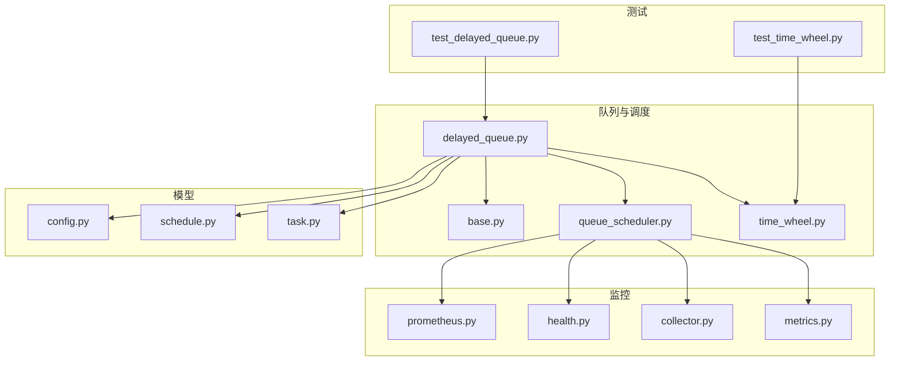
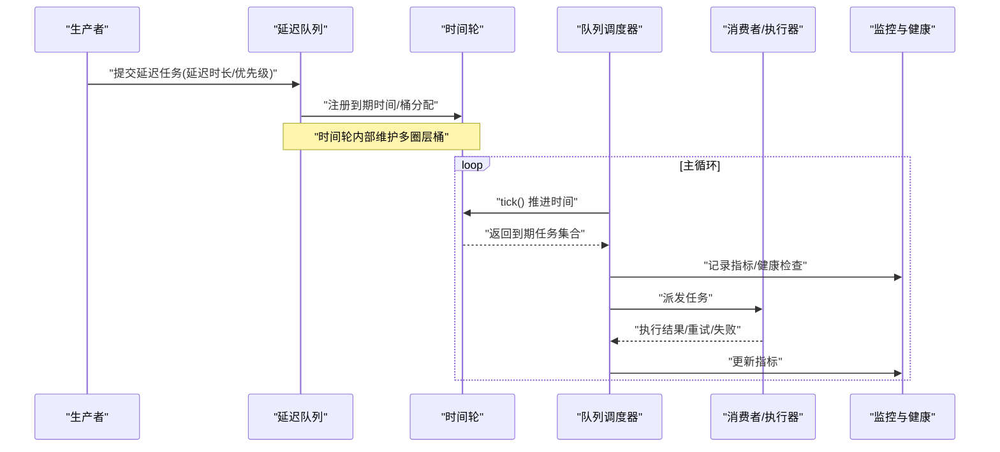
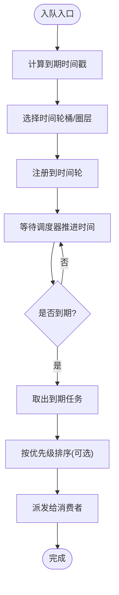
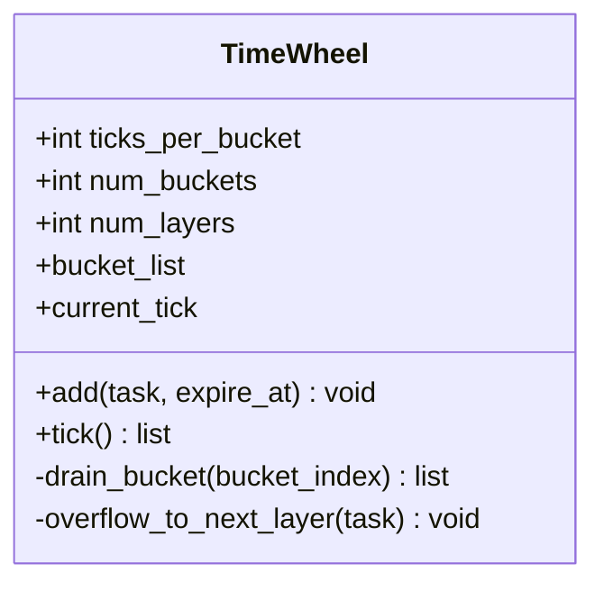
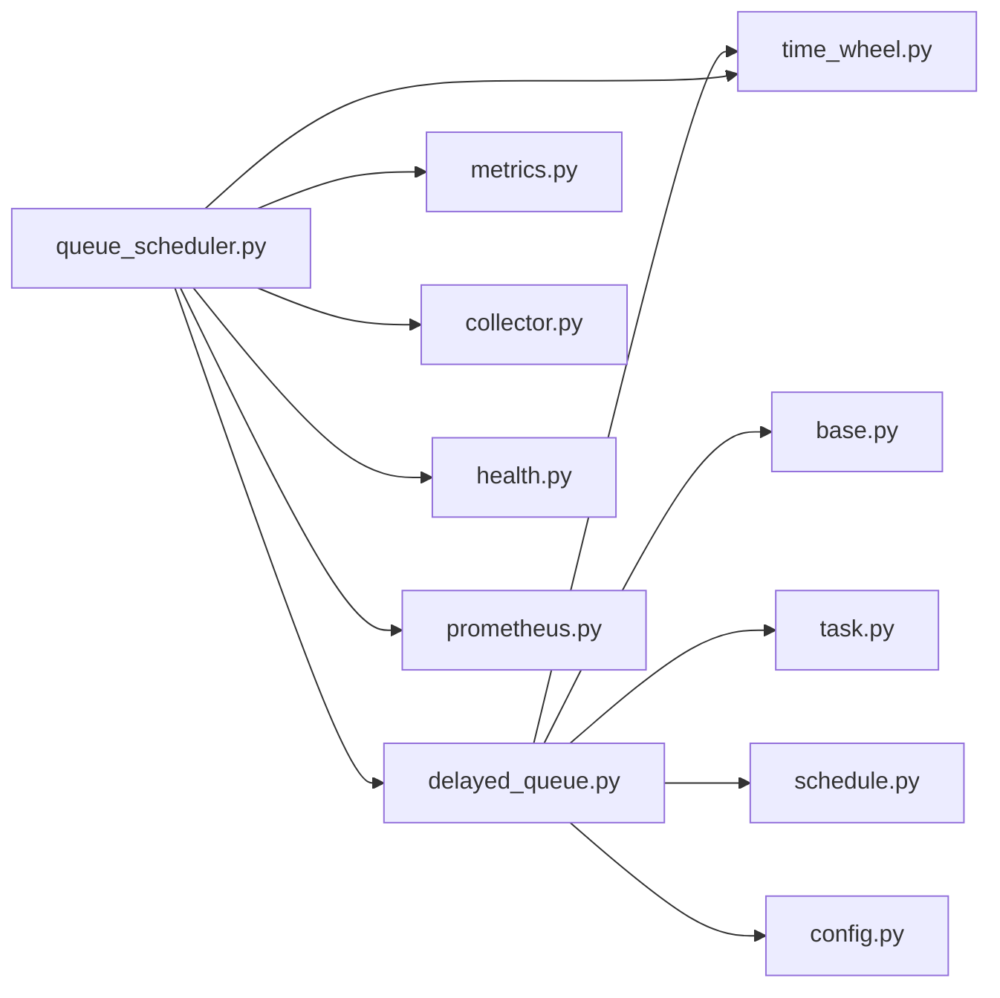

# 延迟队列

<cite>
**本文引用的文件**   
- [delayed_queue.py](file://src/neotask/queue/delayed_queue.py)
- [time_wheel.py](file://src/neotask/scheduler/time_wheel.py)
- [queue_scheduler.py](file://src/neotask/queue/queue_scheduler.py)
- [base.py](file://src/neotask/queue/base.py)
- [task.py](file://src/neotask/models/task.py)
- [schedule.py](file://src/neotask/models/schedule.py)
- [config.py](file://src/neotask/models/config.py)
- [metrics.py](file://src/neotask/monitor/metrics.py)
- [collector.py](file://src/neotask/monitor/collector.py)
- [health.py](file://src/neotask/monitor/health.py)
- [prometheus.py](file://src/neotask/contrib/prometheus.py)
- [test_delayed_queue.py](file://tests/unit/test_delayed_queue.py)
- [test_time_wheel.py](file://tests/unit/test_time_wheel.py)
</cite>

## 目录
1. [简介](#简介)
2. [项目结构](#项目结构)
3. [核心组件](#核心组件)
4. [架构总览](#架构总览)
5. [详细组件分析](#详细组件分析)
6. [依赖关系分析](#依赖关系分析)
7. [性能考量](#性能考量)
8. [故障排查指南](#故障排查指南)
9. [结论](#结论)
10. [附录](#附录)

## 简介
本文件围绕延迟队列的技术实现与调度机制进行深入解析，重点覆盖：
- 时间轮算法在延迟队列中的应用与优化策略
- 延迟任务的触发机制与时间精度控制
- 内存管理与过期清理策略
- 配置选项与性能调优指南
- 监控指标与故障恢复机制

## 项目结构
延迟队列相关代码主要分布在以下模块：
- 队列与调度：queue、scheduler
- 模型定义：models
- 监控与可观测性：monitor、contrib
- 单元测试：tests/unit



图表来源
- [delayed_queue.py](file://src/neotask/queue/delayed_queue.py)
- [time_wheel.py](file://src/neotask/scheduler/time_wheel.py)
- [queue_scheduler.py](file://src/neotask/queue/queue_scheduler.py)
- [base.py](file://src/neotask/queue/base.py)
- [task.py](file://src/neotask/models/task.py)
- [schedule.py](file://src/neotask/models/schedule.py)
- [config.py](file://src/neotask/models/config.py)
- [metrics.py](file://src/neotask/monitor/metrics.py)
- [collector.py](file://src/neotask/monitor/collector.py)
- [health.py](file://src/neotask/monitor/health.py)
- [prometheus.py](file://src/neotask/contrib/prometheus.py)
- [test_delayed_queue.py](file://tests/unit/test_delayed_queue.py)
- [test_time_wheel.py](file://tests/unit/test_time_wheel.py)

章节来源
- [delayed_queue.py](file://src/neotask/queue/delayed_queue.py)
- [time_wheel.py](file://src/neotask/scheduler/time_wheel.py)
- [queue_scheduler.py](file://src/neotask/queue/queue_scheduler.py)
- [base.py](file://src/neotask/queue/base.py)
- [task.py](file://src/neotask/models/task.py)
- [schedule.py](file://src/neotask/models/schedule.py)
- [config.py](file://src/neotask/models/config.py)
- [metrics.py](file://src/neotask/monitor/metrics.py)
- [collector.py](file://src/neotask/monitor/collector.py)
- [health.py](file://src/neotask/monitor/health.py)
- [prometheus.py](file://src/neotask/contrib/prometheus.py)
- [test_delayed_queue.py](file://tests/unit/test_delayed_queue.py)
- [test_time_wheel.py](file://tests/unit/test_time_wheel.py)

## 核心组件
- 延迟队列（DelayedQueue）：封装任务入队、出队、取消、查询等能力，并与时间轮协作完成到期任务的分发。
- 时间轮（TimeWheel）：基于环形桶的定时调度器，支持多圈层以扩展时间范围，提供 tick 推进与 bucket 扫描。
- 队列调度器（QueueScheduler）：协调延迟队列与执行器、监控、健康检查等子系统，驱动主循环与事件分发。
- 基础队列接口（BaseQueue）：定义通用队列行为，供延迟队列与其他队列类型复用。
- 模型（Task/Schedule/Config）：描述任务元数据、调度策略与系统配置项。
- 监控（Metrics/Collector/Health/Prometheus）：采集关键指标、暴露健康状态与 Prometheus 指标。

章节来源
- [delayed_queue.py](file://src/neotask/queue/delayed_queue.py)
- [time_wheel.py](file://src/neotask/scheduler/time_wheel.py)
- [queue_scheduler.py](file://src/neotask/queue/queue_scheduler.py)
- [base.py](file://src/neotask/queue/base.py)
- [task.py](file://src/neotask/models/task.py)
- [schedule.py](file://src/neotask/models/schedule.py)
- [config.py](file://src/neotask/models/config.py)
- [metrics.py](file://src/neotask/monitor/metrics.py)
- [collector.py](file://src/neotask/monitor/collector.py)
- [health.py](file://src/neotask/monitor/health.py)
- [prometheus.py](file://src/neotask/contrib/prometheus.py)

## 架构总览
延迟队列整体由“生产者 -> 延迟队列 -> 时间轮 -> 调度器 -> 消费者”构成。时间轮负责将任务按到期时间放入对应桶；调度器周期性推进时间并消费到期任务；监控与健康检查贯穿全链路。



图表来源
- [delayed_queue.py](file://src/neotask/queue/delayed_queue.py)
- [time_wheel.py](file://src/neotask/scheduler/time_wheel.py)
- [queue_scheduler.py](file://src/neotask/queue/queue_scheduler.py)
- [metrics.py](file://src/neotask/monitor/metrics.py)
- [health.py](file://src/neotask/monitor/health.py)

## 详细组件分析

### 延迟队列（DelayedQueue）
职责与要点
- 入队：根据延迟时长计算目标到期时间，委托时间轮进行桶分配。
- 出队：从时间轮获取到期任务，必要时结合优先级队列进行排序。
- 取消：支持按任务标识移除未到期任务。
- 统计：暴露队列长度、待处理数、已处理数等指标。

关键流程（入队到触发）


图表来源
- [delayed_queue.py](file://src/neotask/queue/delayed_queue.py)
- [time_wheel.py](file://src/neotask/scheduler/time_wheel.py)

章节来源
- [delayed_queue.py](file://src/neotask/queue/delayed_queue.py)

### 时间轮（TimeWheel）
职责与要点
- 数据结构：环形桶数组 + 多圈层（分钟/小时/天等），用于高效管理不同粒度的延迟任务。
- 推进机制：tick 步进当前指针，扫描当前桶并将溢出任务下沉至更高层级桶。
- 复杂度：插入 O(1)，推进均摊 O(1)，扫描桶内任务 O(k)。
- 精度控制：通过 tick 间隔与桶粒度权衡时间精度与 CPU 开销。

类关系图


图表来源
- [time_wheel.py](file://src/neotask/scheduler/time_wheel.py)

章节来源
- [time_wheel.py](file://src/neotask/scheduler/time_wheel.py)

### 队列调度器（QueueScheduler）
职责与要点
- 主循环：周期性调用时间轮 tick，收集到期任务并派发。
- 背压与限流：根据消费者处理能力调整拉取速率。
- 监控集成：采集吞吐、延迟、错误率等指标，上报健康状态。
- 容错：对单次派发异常进行隔离与重试，避免雪崩。

时序图（调度主循环）
```mermaid
sequenceDiagram
participant QS as "队列调度器"
participant TW as "时间轮"
participant Exec as "执行器"
participant Mon as "监控"
loop 每 tick_interval
QS->>TW : "tick()"
TW-->>QS : "到期任务列表"
QS->>Mon : "记录拉取计数/耗时"
for task in tasks :
QS->>Exec : "派发任务"
Exec-->>QS : "结果(成功/失败/重试)"
QS->>Mon : "记录执行结果/重试次数"
end
QS->>Mon : "健康检查/告警阈值判断"
end
```

图表来源
- [queue_scheduler.py](file://src/neotask/queue/queue_scheduler.py)
- [time_wheel.py](file://src/neotask/scheduler/time_wheel.py)
- [metrics.py](file://src/neotask/monitor/metrics.py)
- [health.py](file://src/neotask/monitor/health.py)

章节来源
- [queue_scheduler.py](file://src/neotask/queue/queue_scheduler.py)

### 基础队列接口（BaseQueue）
职责与要点
- 定义通用方法：入队、出队、清空、长度、关闭等。
- 为延迟队列与优先队列提供统一抽象，便于替换与扩展。

章节来源
- [base.py](file://src/neotask/queue/base.py)

### 模型（Task/Schedule/Config）
- Task：任务标识、负载、优先级、重试策略、超时、标签等。
- Schedule：Cron/周期/一次性等调度策略描述。
- Config：延迟队列参数（如 tick 间隔、桶数量、圈层深度）、监控开关、存储后端等。

章节来源
- [task.py](file://src/neotask/models/task.py)
- [schedule.py](file://src/neotask/models/schedule.py)
- [config.py](file://src/neotask/models/config.py)

### 监控与健康（Metrics/Collector/Health/Prometheus）
- Metrics：计数器、直方图、仪表盘等指标定义。
- Collector：指标采集与聚合逻辑。
- Health：健康探针、就绪/存活检查。
- Prometheus：Prometheus 指标导出端点或适配器。

章节来源
- [metrics.py](file://src/neotask/monitor/metrics.py)
- [collector.py](file://src/neotask/monitor/collector.py)
- [health.py](file://src/neotask/monitor/health.py)
- [prometheus.py](file://src/neotask/contrib/prometheus.py)

## 依赖关系分析
延迟队列与时间轮强耦合，调度器作为编排者连接二者，并通过监控模块输出可观测性数据。



图表来源
- [delayed_queue.py](file://src/neotask/queue/delayed_queue.py)
- [time_wheel.py](file://src/neotask/scheduler/time_wheel.py)
- [queue_scheduler.py](file://src/neotask/queue/queue_scheduler.py)
- [base.py](file://src/neotask/queue/base.py)
- [task.py](file://src/neotask/models/task.py)
- [schedule.py](file://src/neotask/models/schedule.py)
- [config.py](file://src/neotask/models/config.py)
- [metrics.py](file://src/neotask/monitor/metrics.py)
- [collector.py](file://src/neotask/monitor/collector.py)
- [health.py](file://src/neotask/monitor/health.py)
- [prometheus.py](file://src/neotask/contrib/prometheus.py)

章节来源
- [delayed_queue.py](file://src/neotask/queue/delayed_queue.py)
- [time_wheel.py](file://src/neotask/scheduler/time_wheel.py)
- [queue_scheduler.py](file://src/neotask/queue/queue_scheduler.py)

## 性能考量
- 时间轮桶粒度与圈层深度
  - 桶数量越大，单桶扫描成本越低，但内存占用上升。
  - 圈层越多，支持的延迟范围越广，但溢出下沉路径更长。
- tick 间隔与时间精度
  - tick 越小，时间精度越高，CPU 消耗增加；需结合业务容忍度平衡。
- 批量拉取与批处理
  - 每次 tick 批量拉取到期任务可降低锁竞争与上下文切换。
- 优先级队列合并
  - 若使用优先级队列，注意排序成本，尽量在桶内维持近似有序或使用堆结构。
- 背压与限流
  - 当消费者慢时，限制拉取速率，避免内存膨胀。
- 内存回收与过期清理
  - 定期清理无效引用与已完成任务，防止内存泄漏。
- 并发安全
  - 确保时间轮与队列操作的线程安全，减少锁粒度。

[本节为通用指导，不直接分析具体文件]

## 故障排查指南
常见问题与定位步骤
- 任务未按预期触发
  - 检查 tick 间隔与时间轮桶粒度是否匹配业务延迟范围。
  - 核对时间轮 current_tick 推进是否正常，是否存在阻塞。
- 时间精度偏差较大
  - 评估 tick 间隔与桶大小，适当缩小 tick 或增大桶数量。
- 内存持续增长
  - 确认是否有任务被重复注册或未正确取消。
  - 检查过期清理策略是否生效，是否存在长尾任务滞留。
- 高延迟与抖动
  - 观察消费者处理能力，启用背压与限流。
  - 检查监控指标中的拉取耗时与执行耗时分布。
- 健康状态异常
  - 查看健康探针返回值与告警阈值，定位具体子系统问题。

章节来源
- [queue_scheduler.py](file://src/neotask/queue/queue_scheduler.py)
- [time_wheel.py](file://src/neotask/scheduler/time_wheel.py)
- [metrics.py](file://src/neotask/monitor/metrics.py)
- [health.py](file://src/neotask/monitor/health.py)

## 结论
延迟队列通过时间轮实现高效的到期任务管理，配合调度器的批处理与监控体系，可在保证精度的同时获得良好的吞吐与稳定性。合理配置桶粒度、tick 间隔与圈层深度，并结合背压与过期清理策略，可有效应对大规模延迟任务场景。

[本节为总结性内容，不直接分析具体文件]

## 附录

### 配置选项与调优建议
- 时间轮相关
  - 桶数量：根据峰值 QPS 与延迟分布调整，降低单桶扫描成本。
  - 圈层深度：根据最大延迟范围设置，避免频繁溢出。
  - tick 间隔：在精度与 CPU 之间折中，通常毫秒级。
- 队列相关
  - 批量拉取大小：提升吞吐，但需考虑内存与延迟。
  - 优先级策略：仅在需要时使用，避免额外排序开销。
- 监控相关
  - 指标采样频率：平衡观测性与开销。
  - 健康探针阈值：根据 SLA 设定。

章节来源
- [config.py](file://src/neotask/models/config.py)
- [metrics.py](file://src/neotask/monitor/metrics.py)
- [collector.py](file://src/neotask/monitor/collector.py)
- [health.py](file://src/neotask/monitor/health.py)

### 监控指标与故障恢复
- 关键指标
  - 入队/出队速率、延迟分位数、错误率、重试次数、内存占用、tick 耗时。
- 健康检查
  - 就绪/存活探针、长时间无推进告警、消费者积压告警。
- 故障恢复
  - 任务重试与退避策略、死信队列归档、断点续跑（持久化）。
- Prometheus 集成
  - 暴露标准指标端点，便于外部监控系统抓取。

章节来源
- [metrics.py](file://src/neotask/monitor/metrics.py)
- [collector.py](file://src/neotask/monitor/collector.py)
- [health.py](file://src/neotask/monitor/health.py)
- [prometheus.py](file://src/neotask/contrib/prometheus.py)

### 单元测试参考
- 延迟队列行为验证：入队/出队/取消/并发安全。
- 时间轮行为验证：tick 推进、桶扫描、溢出下沉、边界条件。

章节来源
- [test_delayed_queue.py](file://tests/unit/test_delayed_queue.py)
- [test_time_wheel.py](file://tests/unit/test_time_wheel.py)