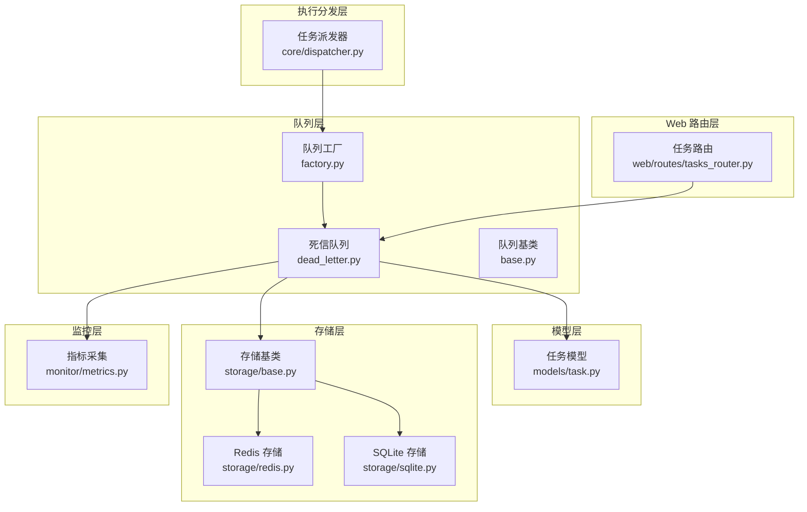
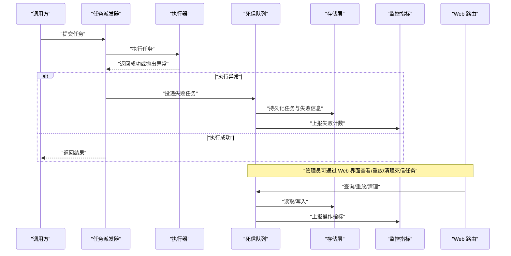
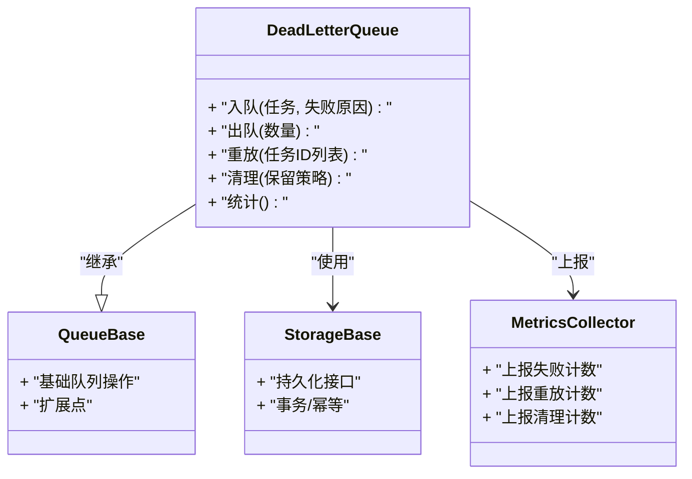
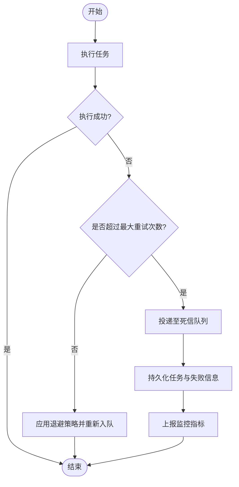
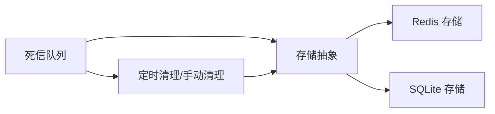
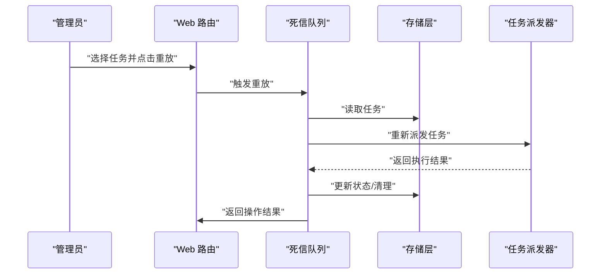
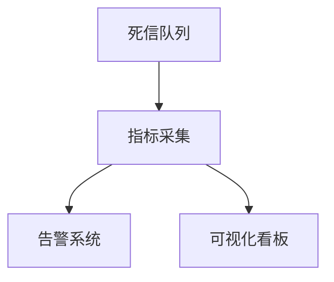
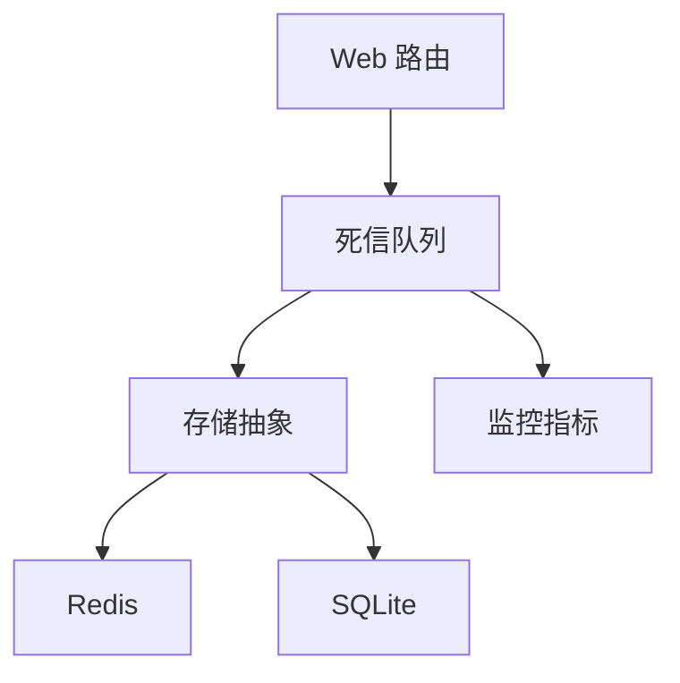

# 死信队列

<cite>
**本文引用的文件**   
- [src/neotask/queue/dead_letter.py](file://src/neotask/queue/dead_letter.py)
- [src/neotask/queue/base.py](file://src/neotask/queue/base.py)
- [src/neotask/queue/factory.py](file://src/neotask/queue/factory.py)
- [src/neotask/models/task.py](file://src/neotask/models/task.py)
- [src/neotask/core/dispatcher.py](file://src/neotask/core/dispatcher.py)
- [src/neotask/storage/base.py](file://src/neotask/storage/base.py)
- [src/neotask/storage/redis.py](file://src/neotask/storage/redis.py)
- [src/neotask/storage/sqlite.py](file://src/neotask/storage/sqlite.py)
- [src/neotask/monitor/metrics.py](file://src/neotask/monitor/metrics.py)
- [src/neotask/web/routes/tasks_router.py](file://src/neotask/web/routes/tasks_router.py)
- [examples/09_retry_and_cancel.py](file://examples/09_retry_and_cancel.py)
</cite>

## 目录
1. [简介](#简介)
2. [项目结构](#项目结构)
3. [核心组件](#核心组件)
4. [架构总览](#架构总览)
5. [详细组件分析](#详细组件分析)
6. [依赖分析](#依赖分析)
7. [性能考虑](#性能考虑)
8. [故障排查指南](#故障排查指南)
9. [结论](#结论)
10. [附录](#附录)

## 简介
本章节聚焦于任务调度系统中的“死信队列”（Dead Letter Queue, DLQ）能力，围绕其设计目的、错误处理机制、进入条件与规则配置、数据持久化与保留策略、重放与人工干预流程、监控告警与统计分析，以及最佳实践与故障排查进行系统化说明。文档旨在帮助开发者与运维人员理解并正确使用该能力，提升系统的可观测性与容错性。

## 项目结构
与死信队列直接相关的代码主要分布在以下模块：
- 队列层：死信队列实现、队列基类、工厂方法
- 模型层：任务模型定义
- 执行分发层：任务派发与异常捕获
- 存储层：持久化接口与具体实现
- 监控层：指标采集
- Web 路由层：对外暴露的查询与管理接口
- 示例：重试与取消的使用方式

图表来源
- [src/neotask/queue/dead_letter.py](file://src/neotask/queue/dead_letter.py)
- [src/neotask/queue/base.py](file://src/neotask/queue/base.py)
- [src/neotask/queue/factory.py](file://src/neotask/queue/factory.py)
- [src/neotask/models/task.py](file://src/neotask/models/task.py)
- [src/neotask/core/dispatcher.py](file://src/neotask/core/dispatcher.py)
- [src/neotask/storage/base.py](file://src/neotask/storage/base.py)
- [src/neotask/storage/redis.py](file://src/neotask/storage/redis.py)
- [src/neotask/storage/sqlite.py](file://src/neotask/storage/sqlite.py)
- [src/neotask/monitor/metrics.py](file://src/neotask/monitor/metrics.py)
- [src/neotask/web/routes/tasks_router.py](file://src/neotask/web/routes/tasks_router.py)

章节来源
- [src/neotask/queue/dead_letter.py](file://src/neotask/queue/dead_letter.py)
- [src/neotask/queue/base.py](file://src/neotask/queue/base.py)
- [src/neotask/queue/factory.py](file://src/neotask/queue/factory.py)
- [src/neotask/models/task.py](file://src/neotask/models/task.py)
- [src/neotask/core/dispatcher.py](file://src/neotask/core/dispatcher.py)
- [src/neotask/storage/base.py](file://src/neotask/storage/base.py)
- [src/neotask/storage/redis.py](file://src/neotask/storage/redis.py)
- [src/neotask/storage/sqlite.py](file://src/neotask/storage/sqlite.py)
- [src/neotask/monitor/metrics.py](file://src/neotask/monitor/metrics.py)
- [src/neotask/web/routes/tasks_router.py](file://src/neotask/web/routes/tasks_router.py)

## 核心组件
- 死信队列实现：负责接收失败任务、记录失败原因、提供重放与清理能力，并与存储和监控集成。
- 队列基类：定义通用队列行为与扩展点，供死信队列复用。
- 队列工厂：根据配置创建不同队列实例，包括死信队列。
- 任务模型：描述任务的结构与状态字段，用于在死信队列中持久化。
- 任务派发器：在执行过程中捕获异常并将任务转入死信队列。
- 存储层：提供统一的持久化接口，支持 Redis 与 SQLite 等后端。
- 监控指标：采集与上报死信相关指标。
- Web 路由：提供对死信任务的查询与管理接口。

章节来源
- [src/neotask/queue/dead_letter.py](file://src/neotask/queue/dead_letter.py)
- [src/neotask/queue/base.py](file://src/neotask/queue/base.py)
- [src/neotask/queue/factory.py](file://src/neotask/queue/factory.py)
- [src/neotask/models/task.py](file://src/neotask/models/task.py)
- [src/neotask/core/dispatcher.py](file://src/neotask/core/dispatcher.py)
- [src/neotask/storage/base.py](file://src/neotask/storage/base.py)
- [src/neotask/storage/redis.py](file://src/neotask/storage/redis.py)
- [src/neotask/storage/sqlite.py](file://src/neotask/storage/sqlite.py)
- [src/neotask/monitor/metrics.py](file://src/neotask/monitor/metrics.py)
- [src/neotask/web/routes/tasks_router.py](file://src/neotask/web/routes/tasks_router.py)

## 架构总览
下图展示了任务从派发到失败并最终进入死信队列的关键路径，以及与存储、监控和 Web 管理接口的交互。

图表来源
- [src/neotask/core/dispatcher.py](file://src/neotask/core/dispatcher.py)
- [src/neotask/queue/dead_letter.py](file://src/neotask/queue/dead_letter.py)
- [src/neotask/storage/base.py](file://src/neotask/storage/base.py)
- [src/neotask/monitor/metrics.py](file://src/neotask/monitor/metrics.py)
- [src/neotask/web/routes/tasks_router.py](file://src/neotask/web/routes/tasks_router.py)

## 详细组件分析

### 死信队列设计与职责
- 设计目的
  - 隔离失败任务，避免阻塞主流程
  - 保留失败上下文，便于问题定位与恢复
  - 提供可控的重放与清理手段，保障系统稳定性
- 核心职责
  - 接收来自派发器的失败任务
  - 持久化任务及失败元数据
  - 提供重放、批量清理、按条件查询等管理能力
  - 上报关键指标以支撑监控告警

图表来源
- [src/neotask/queue/dead_letter.py](file://src/neotask/queue/dead_letter.py)
- [src/neotask/queue/base.py](file://src/neotask/queue/base.py)
- [src/neotask/storage/base.py](file://src/neotask/storage/base.py)
- [src/neotask/monitor/metrics.py](file://src/neotask/monitor/metrics.py)

章节来源
- [src/neotask/queue/dead_letter.py](file://src/neotask/queue/dead_letter.py)
- [src/neotask/queue/base.py](file://src/neotask/queue/base.py)
- [src/neotask/storage/base.py](file://src/neotask/storage/base.py)
- [src/neotask/monitor/metrics.py](file://src/neotask/monitor/metrics.py)

### 进入死信队列的条件与规则配置
- 进入条件
  - 任务执行阶段抛出异常且未被上层捕获
  - 重试次数达到上限后仍失败
  - 其他业务约定的不可恢复错误（如参数校验失败、外部依赖不可用等）
- 规则配置
  - 最大重试次数
  - 重试退避策略（固定间隔、指数退避等）
  - 是否启用死信队列
  - 死信任务保留时长与清理策略
  - 分类标签（按任务类型、错误码等）

图表来源
- [src/neotask/core/dispatcher.py](file://src/neotask/core/dispatcher.py)
- [src/neotask/queue/dead_letter.py](file://src/neotask/queue/dead_letter.py)
- [src/neotask/monitor/metrics.py](file://src/neotask/monitor/metrics.py)

章节来源
- [src/neotask/core/dispatcher.py](file://src/neotask/core/dispatcher.py)
- [src/neotask/queue/dead_letter.py](file://src/neotask/queue/dead_letter.py)
- [src/neotask/monitor/metrics.py](file://src/neotask/monitor/metrics.py)

### 数据持久化与保留策略
- 持久化
  - 通过存储抽象层统一接入，支持多种后端（如 Redis、SQLite）
  - 保存内容包含任务本体、失败原因、时间戳、重试历史等
- 保留策略
  - 基于时间的过期清理（TTL）
  - 基于数量的上限清理（LIFO/FIFO）
  - 可配置的归档或导出能力（视存储实现而定）

图表来源
- [src/neotask/queue/dead_letter.py](file://src/neotask/queue/dead_letter.py)
- [src/neotask/storage/base.py](file://src/neotask/storage/base.py)
- [src/neotask/storage/redis.py](file://src/neotask/storage/redis.py)
- [src/neotask/storage/sqlite.py](file://src/neotask/storage/sqlite.py)

章节来源
- [src/neotask/queue/dead_letter.py](file://src/neotask/queue/dead_letter.py)
- [src/neotask/storage/base.py](file://src/neotask/storage/base.py)
- [src/neotask/storage/redis.py](file://src/neotask/storage/redis.py)
- [src/neotask/storage/sqlite.py](file://src/neotask/storage/sqlite.py)

### 重放机制与人工干预流程
- 自动重放
  - 支持按批次或全量重放
  - 重放前可进行二次校验与转换
  - 重放过程同样受监控与日志覆盖
- 人工干预
  - 通过 Web 界面查看死信任务详情
  - 选择特定任务进行重放或忽略
  - 批量清理过期的死信任务
  - 导出失败样本用于离线分析

图表来源
- [src/neotask/web/routes/tasks_router.py](file://src/neotask/web/routes/tasks_router.py)
- [src/neotask/queue/dead_letter.py](file://src/neotask/queue/dead_letter.py)
- [src/neotask/storage/base.py](file://src/neotask/storage/base.py)
- [src/neotask/core/dispatcher.py](file://src/neotask/core/dispatcher.py)

章节来源
- [src/neotask/web/routes/tasks_router.py](file://src/neotask/web/routes/tasks_router.py)
- [src/neotask/queue/dead_letter.py](file://src/neotask/queue/dead_letter.py)
- [src/neotask/storage/base.py](file://src/neotask/storage/base.py)
- [src/neotask/core/dispatcher.py](file://src/neotask/core/dispatcher.py)

### 监控告警与统计分析
- 指标采集
  - 失败入队计数
  - 重放成功/失败计数
  - 清理任务计数
  - 当前积压数量
- 告警建议
  - 当单位时间内入队速率超过阈值时触发告警
  - 积压数量持续增长时触发告警
  - 重放成功率低于阈值时触发告警
- 统计分析
  - 按任务类型、错误码、时间段进行聚合
  - 生成报表用于复盘与优化

图表来源
- [src/neotask/monitor/metrics.py](file://src/neotask/monitor/metrics.py)
- [src/neotask/queue/dead_letter.py](file://src/neotask/queue/dead_letter.py)

章节来源
- [src/neotask/monitor/metrics.py](file://src/neotask/monitor/metrics.py)
- [src/neotask/queue/dead_letter.py](file://src/neotask/queue/dead_letter.py)

### 最佳实践
- 合理设置重试次数与退避策略，避免雪崩
- 为不同错误类型设置差异化处理策略
- 定期清理过期死信任务，控制存储占用
- 对高价值任务开启强一致的重放与审计
- 结合监控告警建立快速响应机制
- 将死信任务纳入变更评审与回归测试范围

[本节为通用指导，不直接分析具体文件]

### 故障排查指南
- 常见问题
  - 死信任务持续增加：检查上游依赖可用性、重试策略与资源配额
  - 重放失败：核对任务参数、权限与环境变量
  - 存储异常：确认存储后端健康状态与容量
- 排查步骤
  - 查看 Web 界面的任务详情与失败堆栈
  - 核对监控指标趋势与告警事件
  - 复现失败场景并最小化验证
  - 必要时导出样本进行离线分析
- 恢复措施
  - 修复问题后分批重放
  - 清理无效样本，释放存储
  - 调整策略以避免同类问题再次发生

章节来源
- [src/neotask/web/routes/tasks_router.py](file://src/neotask/web/routes/tasks_router.py)
- [src/neotask/monitor/metrics.py](file://src/neotask/monitor/metrics.py)
- [src/neotask/queue/dead_letter.py](file://src/neotask/queue/dead_letter.py)

## 依赖分析
- 耦合关系
  - 死信队列依赖存储抽象层，屏蔽底层差异
  - 与监控模块松耦合，仅通过指标上报接口交互
  - Web 路由通过队列提供的管理接口进行操作
- 外部依赖
  - Redis/SQLite 作为持久化后端
  - 监控系统（Prometheus 等）用于指标收集与告警

图表来源
- [src/neotask/queue/dead_letter.py](file://src/neotask/queue/dead_letter.py)
- [src/neotask/storage/base.py](file://src/neotask/storage/base.py)
- [src/neotask/storage/redis.py](file://src/neotask/storage/redis.py)
- [src/neotask/storage/sqlite.py](file://src/neotask/storage/sqlite.py)
- [src/neotask/monitor/metrics.py](file://src/neotask/monitor/metrics.py)
- [src/neotask/web/routes/tasks_router.py](file://src/neotask/web/routes/tasks_router.py)

章节来源
- [src/neotask/queue/dead_letter.py](file://src/neotask/queue/dead_letter.py)
- [src/neotask/storage/base.py](file://src/neotask/storage/base.py)
- [src/neotask/storage/redis.py](file://src/neotask/storage/redis.py)
- [src/neotask/storage/sqlite.py](file://src/neotask/storage/sqlite.py)
- [src/neotask/monitor/metrics.py](file://src/neotask/monitor/metrics.py)
- [src/neotask/web/routes/tasks_router.py](file://src/neotask/web/routes/tasks_router.py)

## 性能考虑
- 批处理：批量入队与重放可降低 I/O 开销
- 异步化：将重放与清理操作异步执行，避免阻塞主流程
- 索引与分页：对常用查询字段建立索引，提高检索效率
- 存储选型：高吞吐场景优先选择 Redis，复杂查询场景考虑 SQLite 或其他数据库
- 限流与背压：在高负载下限制重放速率，防止放大效应

[本节为通用指导，不直接分析具体文件]

## 故障排查指南
- 快速定位
  - 通过 Web 界面筛选最近失败的死信任务
  - 查看对应指标的突增与波动
- 根因分析
  - 对比失败堆栈与最近变更
  - 检查外部依赖的健康度与延迟
- 恢复与验证
  - 小批量重放验证修复效果
  - 逐步扩大重放规模并观察指标
- 预防改进
  - 完善重试与降级策略
  - 补充自动化测试与混沌工程用例

章节来源
- [src/neotask/web/routes/tasks_router.py](file://src/neotask/web/routes/tasks_router.py)
- [src/neotask/monitor/metrics.py](file://src/neotask/monitor/metrics.py)
- [src/neotask/queue/dead_letter.py](file://src/neotask/queue/dead_letter.py)

## 结论
死信队列是任务调度系统中不可或缺的容错与可观测性基础设施。通过合理的进入条件与规则配置、可靠的持久化与保留策略、完善的重放与人工干预流程，以及全面的监控告警与统计分析，可以显著提升系统的鲁棒性与可维护性。遵循最佳实践并结合实际业务场景进行调优，能够有效降低故障影响面并缩短恢复时间。

[本节为总结性内容，不直接分析具体文件]

## 附录
- 示例参考
  - 重试与取消的使用方式可参考示例脚本，了解如何在业务侧配合死信队列进行错误处理与恢复。

章节来源
- [examples/09_retry_and_cancel.py](file://examples/09_retry_and_cancel.py)