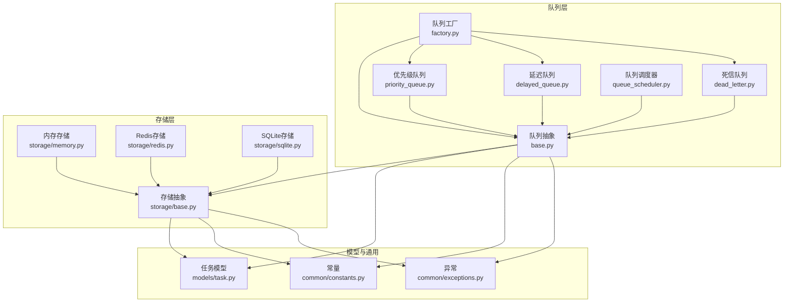
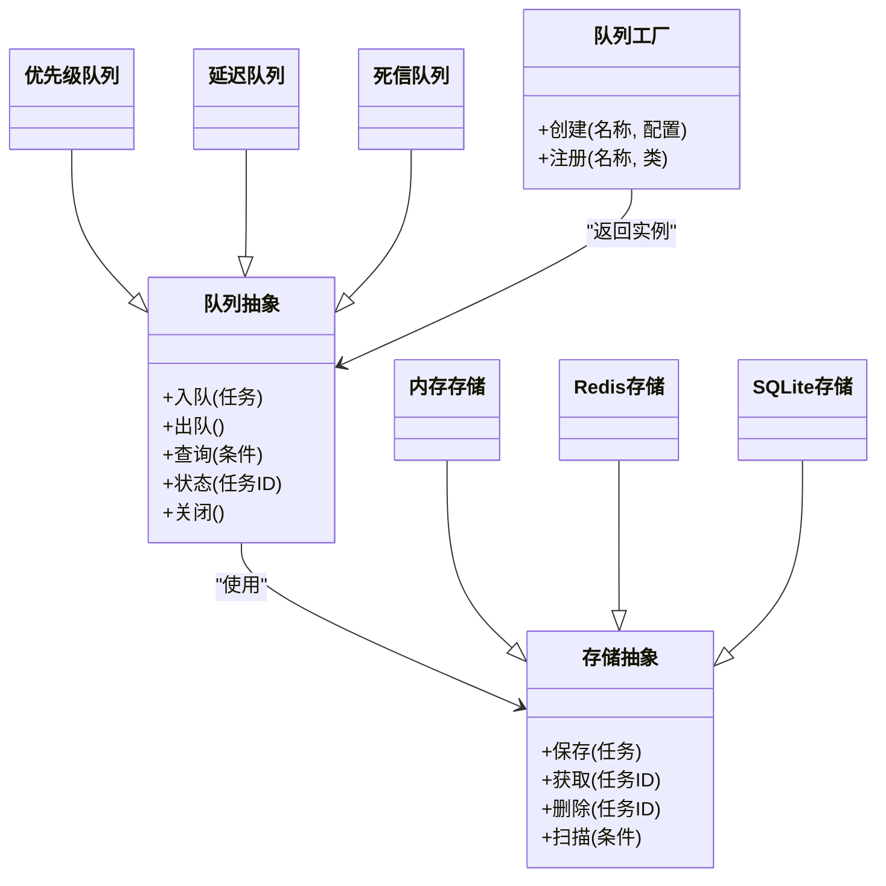
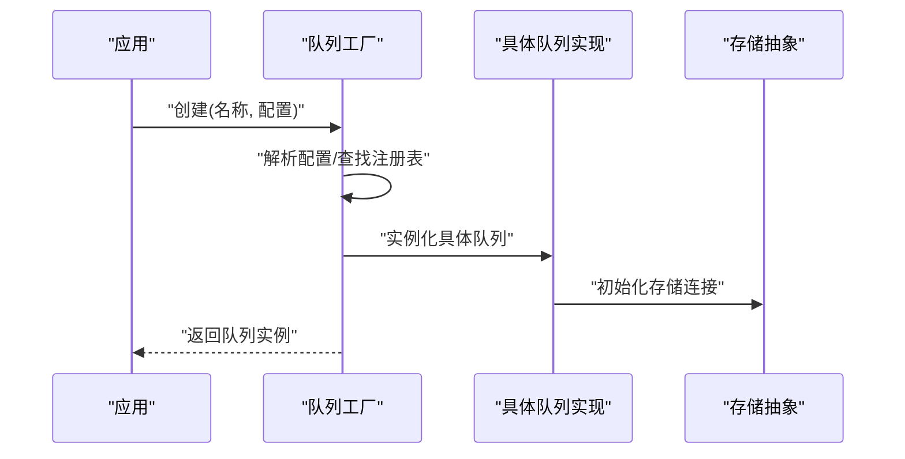
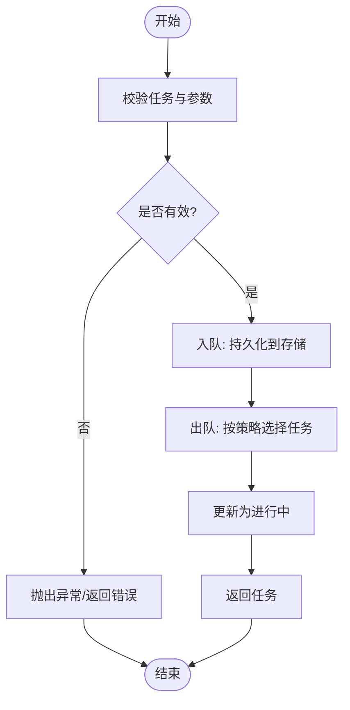
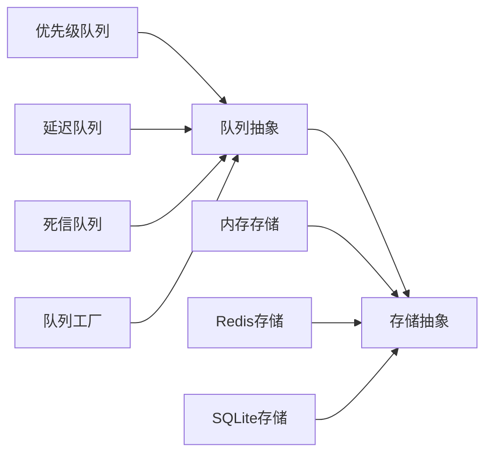

# 队列基础架构

<cite>
**本文引用的文件**
- [src/neotask/queue/base.py](file://src/neotask/queue/base.py)
- [src/neotask/queue/factory.py](file://src/neotask/queue/factory.py)
- [src/neotask/queue/priority_queue.py](file://src/neotask/queue/priority_queue.py)
- [src/neotask/queue/delayed_queue.py](file://src/neotask/queue/delayed_queue.py)
- [src/neotask/queue/dead_letter.py](file://src/neotask/queue/dead_letter.py)
- [src/neotask/queue/queue_scheduler.py](file://src/neotask/queue/queue_scheduler.py)
- [src/neotask/storage/base.py](file://src/neotask/storage/base.py)
- [src/neotask/storage/memory.py](file://src/neotask/storage/memory.py)
- [src/neotask/storage/redis.py](file://src/neotask/storage/redis.py)
- [src/neotask/storage/sqlite.py](file://src/neotask/storage/sqlite.py)
- [src/neotask/models/task.py](file://src/neotask/models/task.py)
- [src/neotask/common/constants.py](file://src/neotask/common/constants.py)
- [src/neotask/common/exceptions.py](file://src/neotask/common/exceptions.py)
- [tests/unit/test_queue.py](file://tests/unit/test_queue.py)
- [tests/unit/test_priority_queue.py](file://tests/unit/test_priority_queue.py)
- [tests/unit/test_delayed_queue.py](file://tests/unit/test_delayed_queue.py)
- [tests/benchmark/run_benchmark.py](file://tests/benchmark/run_benchmark.py)
- [tests/benchmark/test_performance.py](file://tests/benchmark/test_performance.py)
- [docs/性能基准测试.md](file://docs/性能基准测试.md)
</cite>

## 目录
1. [简介](#简介)
2. [项目结构](#项目结构)
3. [核心组件](#核心组件)
4. [架构总览](#架构总览)
5. [详细组件分析](#详细组件分析)
6. [依赖关系分析](#依赖关系分析)
7. [性能考量](#性能考量)
8. [故障排查指南](#故障排查指南)
9. [结论](#结论)
10. [附录](#附录)

## 简介
本文件围绕任务队列系统的基础架构进行系统化说明，重点覆盖：
- 队列抽象接口的设计理念与扩展机制
- 队列工厂模式的实现原理与使用方法
- 队列基本操作（入队、出队、查询）与状态管理
- 自定义队列实现的开发指南与最佳实践
- 队列性能基准测试与监控指标定义

目标是帮助读者快速理解并基于现有抽象构建可扩展、可观测、高性能的队列能力。

## 项目结构
队列相关代码集中在 src/neotask/queue 与 src/neotask/storage 两个模块中，并通过模型与常量提供统一的数据契约与错误语义；测试与基准位于 tests 与 docs 下。

图表来源
- [src/neotask/queue/base.py](file://src/neotask/queue/base.py)
- [src/neotask/queue/factory.py](file://src/neotask/queue/factory.py)
- [src/neotask/queue/priority_queue.py](file://src/neotask/queue/priority_queue.py)
- [src/neotask/queue/delayed_queue.py](file://src/neotask/queue/delayed_queue.py)
- [src/neotask/queue/dead_letter.py](file://src/neotask/queue/dead_letter.py)
- [src/neotask/queue/queue_scheduler.py](file://src/neotask/queue/queue_scheduler.py)
- [src/neotask/storage/base.py](file://src/neotask/storage/base.py)
- [src/neotask/storage/memory.py](file://src/neotask/storage/memory.py)
- [src/neotask/storage/redis.py](file://src/neotask/storage/redis.py)
- [src/neotask/storage/sqlite.py](file://src/neotask/storage/sqlite.py)
- [src/neotask/models/task.py](file://src/neotask/models/task.py)
- [src/neotask/common/constants.py](file://src/neotask/common/constants.py)
- [src/neotask/common/exceptions.py](file://src/neotask/common/exceptions.py)

章节来源
- [src/neotask/queue/base.py](file://src/neotask/queue/base.py)
- [src/neotask/queue/factory.py](file://src/neotask/queue/factory.py)
- [src/neotask/storage/base.py](file://src/neotask/storage/base.py)
- [src/neotask/models/task.py](file://src/neotask/models/task.py)
- [src/neotask/common/constants.py](file://src/neotask/common/constants.py)
- [src/neotask/common/exceptions.py](file://src/neotask/common/exceptions.py)

## 核心组件
- 队列抽象接口：定义统一的入队、出队、查询、生命周期等契约，屏蔽底层存储差异，支持同步/异步风格。
- 队列工厂：按名称或配置创建具体队列实例，集中注册与发现，降低耦合。
- 具体队列实现：
  - 优先级队列：基于优先级的出队策略。
  - 延迟队列：支持任务在指定时间后变为可执行。
  - 死信队列：用于失败重试耗尽后的兜底处理。
- 存储抽象与实现：内存、Redis、SQLite 三种后端，提供持久化与并发安全保证。
- 任务模型与常量：统一任务数据结构、状态枚举与错误类型。

章节来源
- [src/neotask/queue/base.py](file://src/neotask/queue/base.py)
- [src/neotask/queue/priority_queue.py](file://src/neotask/queue/priority_queue.py)
- [src/neotask/queue/delayed_queue.py](file://src/neotask/queue/delayed_queue.py)
- [src/neotask/queue/dead_letter.py](file://src/neotask/queue/dead_letter.py)
- [src/neotask/queue/factory.py](file://src/neotask/queue/factory.py)
- [src/neotask/storage/base.py](file://src/neotask/storage/base.py)
- [src/neotask/storage/memory.py](file://src/neotask/storage/memory.py)
- [src/neotask/storage/redis.py](file://src/neotask/storage/redis.py)
- [src/neotask/storage/sqlite.py](file://src/neotask/storage/sqlite.py)
- [src/neotask/models/task.py](file://src/neotask/models/task.py)
- [src/neotask/common/constants.py](file://src/neotask/common/constants.py)
- [src/neotask/common/exceptions.py](file://src/neotask/common/exceptions.py)

## 架构总览
队列层通过抽象接口与存储层解耦，由工厂负责实例化，上层业务无需关心具体存储与排序策略。

图表来源
- [src/neotask/queue/base.py](file://src/neotask/queue/base.py)
- [src/neotask/queue/priority_queue.py](file://src/neotask/queue/priority_queue.py)
- [src/neotask/queue/delayed_queue.py](file://src/neotask/queue/delayed_queue.py)
- [src/neotask/queue/dead_letter.py](file://src/neotask/queue/dead_letter.py)
- [src/neotask/queue/factory.py](file://src/neotask/queue/factory.py)
- [src/neotask/storage/base.py](file://src/neotask/storage/base.py)
- [src/neotask/storage/memory.py](file://src/neotask/storage/memory.py)
- [src/neotask/storage/redis.py](file://src/neotask/storage/redis.py)
- [src/neotask/storage/sqlite.py](file://src/neotask/storage/sqlite.py)

## 详细组件分析

### 队列抽象接口与扩展机制
- 设计目标
  - 统一入队、出队、查询、状态读取、生命周期管理等核心能力。
  - 屏蔽不同存储后端与排序策略的差异，便于替换与扩展。
- 关键能力
  - 入队：将任务写入队列，支持优先级、延迟等元数据。
  - 出队：按策略取出下一个可执行任务，具备幂等与并发安全。
  - 查询：按条件检索任务集合，支持分页与过滤。
  - 状态管理：读取与更新任务状态，配合常量与异常体系。
- 扩展点
  - 新增队列类型：继承抽象接口，实现特定策略（如优先级、延迟、死信）。
  - 新增存储后端：实现存储抽象，提供一致的数据访问语义。
  - 组合模式：通过装饰器或中间件对入队/出队行为进行增强（如审计、限流）。

章节来源
- [src/neotask/queue/base.py](file://src/neotask/queue/base.py)
- [src/neotask/common/constants.py](file://src/neotask/common/constants.py)
- [src/neotask/common/exceptions.py](file://src/neotask/common/exceptions.py)

### 队列工厂模式
- 职责
  - 根据名称或配置创建具体队列实例。
  - 维护队列类型的注册表，支持动态扩展。
- 使用方式
  - 通过工厂创建默认队列或指定类型的队列。
  - 在应用启动时注册自定义队列类型。
- 扩展方法
  - 新增队列类型后，向工厂注册映射关系。
  - 通过配置驱动选择不同实现（如内存/Redis）。

图表来源
- [src/neotask/queue/factory.py](file://src/neotask/queue/factory.py)
- [src/neotask/queue/base.py](file://src/neotask/queue/base.py)
- [src/neotask/storage/base.py](file://src/neotask/storage/base.py)

章节来源
- [src/neotask/queue/factory.py](file://src/neotask/queue/factory.py)

### 基本操作与状态管理
- 入队流程
  - 校验任务模型与必填字段。
  - 计算优先级/延迟时间等元数据。
  - 调用存储层持久化。
- 出队流程
  - 根据策略选择候选任务（如最高优先级、到期任务）。
  - 原子性转移至“进行中”状态，避免重复消费。
  - 返回任务给消费者。
- 查询流程
  - 构造查询条件（状态、标签、时间范围等）。
  - 委托存储层执行扫描与过滤。
- 状态管理
  - 使用统一的状态枚举与转换规则。
  - 结合异常体系表达失败与边界情况。

图表来源
- [src/neotask/queue/base.py](file://src/neotask/queue/base.py)
- [src/neotask/storage/base.py](file://src/neotask/storage/base.py)
- [src/neotask/common/constants.py](file://src/neotask/common/constants.py)
- [src/neotask/common/exceptions.py](file://src/neotask/common/exceptions.py)

章节来源
- [src/neotask/queue/base.py](file://src/neotask/queue/base.py)
- [src/neotask/storage/base.py](file://src/neotask/storage/base.py)
- [src/neotask/common/constants.py](file://src/neotask/common/constants.py)
- [src/neotask/common/exceptions.py](file://src/neotask/common/exceptions.py)

### 具体队列实现

#### 优先级队列
- 特点
  - 基于优先级数值决定出队顺序。
  - 适合需要资源倾斜与吞吐控制的场景。
- 关键点
  - 入队时记录优先级。
  - 出队时选取最高优先级且满足条件的任务。
- 适用场景
  - 高优任务抢占、批量任务分级处理。

章节来源
- [src/neotask/queue/priority_queue.py](file://src/neotask/queue/priority_queue.py)

#### 延迟队列
- 特点
  - 支持在指定时间点之后才变为可执行。
  - 内部通常借助定时调度器或时间轮推进任务状态。
- 关键点
  - 入队时设置延迟时间。
  - 调度器周期性检查并迁移到期任务。
- 适用场景
  - 延时重试、定时触发、退避策略。

章节来源
- [src/neotask/queue/delayed_queue.py](file://src/neotask/queue/delayed_queue.py)
- [src/neotask/queue/queue_scheduler.py](file://src/neotask/queue/queue_scheduler.py)

#### 死信队列
- 特点
  - 捕获多次重试仍失败的任务，供后续人工干预或离线分析。
- 关键点
  - 与重试策略联动，达到阈值后转入死信。
  - 提供独立查询与导出能力。
- 适用场景
  - 异常隔离、问题定位、补偿处理。

章节来源
- [src/neotask/queue/dead_letter.py](file://src/neotask/queue/dead_letter.py)

### 存储抽象与实现
- 抽象接口
  - 保存、获取、删除、扫描等基本数据操作。
  - 面向任务的序列化/反序列化与索引策略。
- 实现
  - 内存存储：进程内运行，适合单进程与测试。
  - Redis存储：分布式共享，适合多进程/多机部署。
  - SQLite存储：单机轻量持久化，适合小规模场景。
- 选择建议
  - 单机/测试：内存或 SQLite。
  - 生产/分布式：Redis。

章节来源
- [src/neotask/storage/base.py](file://src/neotask/storage/base.py)
- [src/neotask/storage/memory.py](file://src/neotask/storage/memory.py)
- [src/neotask/storage/redis.py](file://src/neotask/storage/redis.py)
- [src/neotask/storage/sqlite.py](file://src/neotask/storage/sqlite.py)

### 任务模型与常量
- 任务模型
  - 包含任务标识、负载、优先级、延迟时间、状态、重试次数等字段。
- 常量
  - 定义任务状态枚举、错误码、默认值等。
- 异常
  - 定义队列与存储相关的异常类型，便于上层统一处理。

章节来源
- [src/neotask/models/task.py](file://src/neotask/models/task.py)
- [src/neotask/common/constants.py](file://src/neotask/common/constants.py)
- [src/neotask/common/exceptions.py](file://src/neotask/common/exceptions.py)

## 依赖关系分析
- 低耦合
  - 队列层仅依赖存储抽象，不感知具体存储实现。
  - 工厂集中管理实例化逻辑，降低业务与实现的耦合。
- 可扩展
  - 新增队列类型只需实现抽象接口并注册到工厂。
  - 新增存储后端只需实现存储抽象。
- 外部依赖
  - Redis 存储依赖 Redis 客户端库。
  - SQLite 存储依赖内置数据库引擎。

图表来源
- [src/neotask/queue/base.py](file://src/neotask/queue/base.py)
- [src/neotask/queue/priority_queue.py](file://src/neotask/queue/priority_queue.py)
- [src/neotask/queue/delayed_queue.py](file://src/neotask/queue/delayed_queue.py)
- [src/neotask/queue/dead_letter.py](file://src/neotask/queue/dead_letter.py)
- [src/neotask/queue/factory.py](file://src/neotask/queue/factory.py)
- [src/neotask/storage/base.py](file://src/neotask/storage/base.py)
- [src/neotask/storage/memory.py](file://src/neotask/storage/memory.py)
- [src/neotask/storage/redis.py](file://src/neotask/storage/redis.py)
- [src/neotask/storage/sqlite.py](file://src/neotask/storage/sqlite.py)

章节来源
- [src/neotask/queue/base.py](file://src/neotask/queue/base.py)
- [src/neotask/queue/factory.py](file://src/neotask/queue/factory.py)
- [src/neotask/storage/base.py](file://src/neotask/storage/base.py)

## 性能考量
- 基准测试入口
  - 提供基准脚本与单元测试，覆盖不同队列与存储组合。
- 关注指标
  - 入队/出队吞吐（QPS）、P95/P99 延迟、CPU/内存占用、存储 I/O 开销。
- 优化方向
  - 批量入队/出队减少网络往返。
  - 合理设置超时与重试上限，避免雪崩。
  - 针对热点键做分片或分区。
  - 选择合适的存储后端（内存/Redis/SQLite）。

章节来源
- [tests/benchmark/run_benchmark.py](file://tests/benchmark/run_benchmark.py)
- [tests/benchmark/test_performance.py](file://tests/benchmark/test_performance.py)
- [docs/性能基准测试.md](file://docs/性能基准测试.md)

## 故障排查指南
- 常见问题
  - 任务未出队：检查延迟时间与调度器是否运行。
  - 重复消费：确认出队操作的原子性与幂等性。
  - 死信堆积：检查重试策略与下游服务可用性。
- 定位手段
  - 查看任务状态与日志。
  - 使用查询接口筛选异常任务。
  - 对比不同存储后端的性能与稳定性。
- 恢复策略
  - 从死信队列重新投递。
  - 调整重试上限与退避策略。
  - 扩容或切换存储后端。

章节来源
- [src/neotask/queue/delayed_queue.py](file://src/neotask/queue/delayed_queue.py)
- [src/neotask/queue/dead_letter.py](file://src/neotask/queue/dead_letter.py)
- [src/neotask/queue/queue_scheduler.py](file://src/neotask/queue/queue_scheduler.py)
- [src/neotask/common/exceptions.py](file://src/neotask/common/exceptions.py)

## 结论
本架构通过清晰的抽象与工厂模式，实现了队列能力的可插拔与可扩展。配合多种存储后端与完善的模型/异常体系，既能满足单机轻量场景，也能支撑分布式生产环境。建议在上线前完成基准测试与容量规划，并结合监控与告警保障稳定性。

## 附录

### 自定义队列实现指南与最佳实践
- 步骤
  - 继承队列抽象接口，实现入队、出队、查询、状态管理等方法。
  - 如需持久化，复用存储抽象或自行实现存储后端。
  - 在工厂中注册新队列类型，以便通过名称创建实例。
- 最佳实践
  - 保持入队/出队的幂等与原子性。
  - 明确状态转换规则，避免非法状态跃迁。
  - 对耗时操作增加超时与重试控制。
  - 输出结构化日志与指标，便于追踪与排障。
  - 编写单元与集成测试，覆盖正常路径与异常分支。

章节来源
- [src/neotask/queue/base.py](file://src/neotask/queue/base.py)
- [src/neotask/queue/factory.py](file://src/neotask/queue/factory.py)
- [src/neotask/storage/base.py](file://src/neotask/storage/base.py)
- [src/neotask/common/exceptions.py](file://src/neotask/common/exceptions.py)

### 单元测试参考
- 队列基础用例
  - 验证入队、出队、查询、状态流转的正确性。
- 优先级与延迟队列
  - 验证优先级顺序与延迟到期迁移。
- 端到端场景
  - 模拟生产者/消费者协作与异常恢复。

章节来源
- [tests/unit/test_queue.py](file://tests/unit/test_queue.py)
- [tests/unit/test_priority_queue.py](file://tests/unit/test_priority_queue.py)
- [tests/unit/test_delayed_queue.py](file://tests/unit/test_delayed_queue.py)