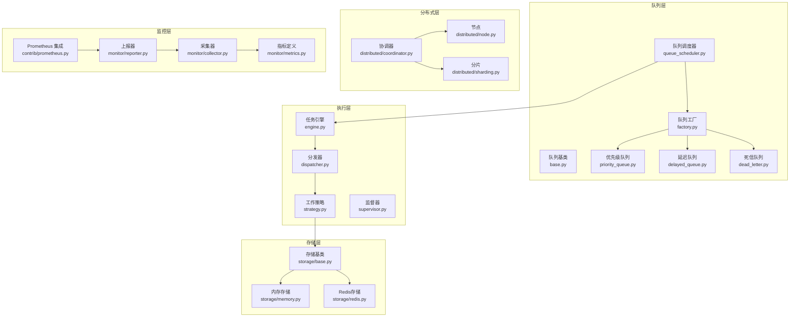
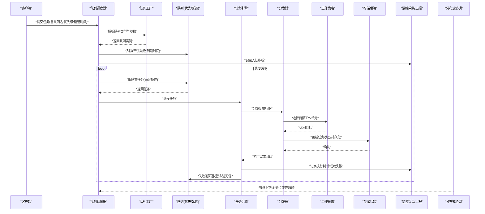
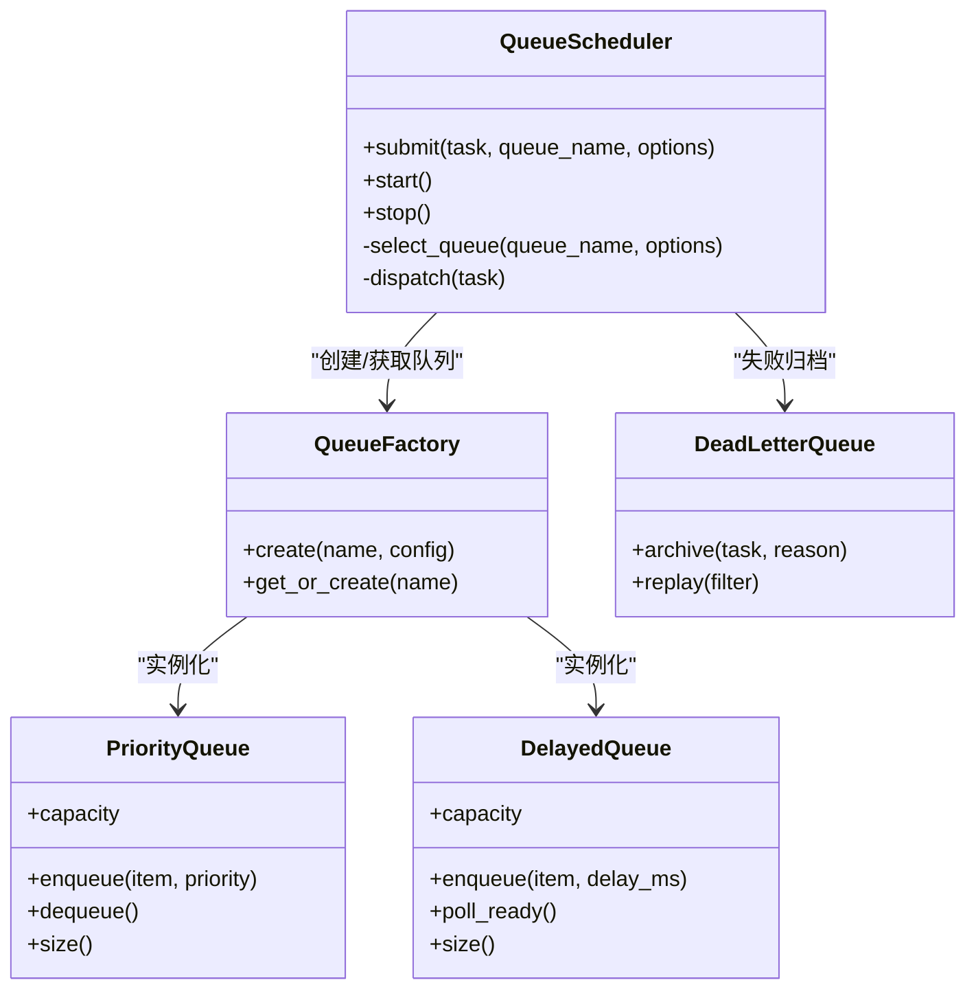
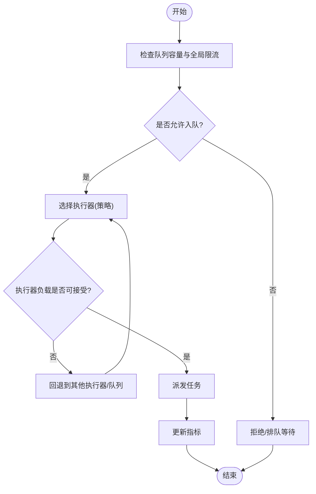
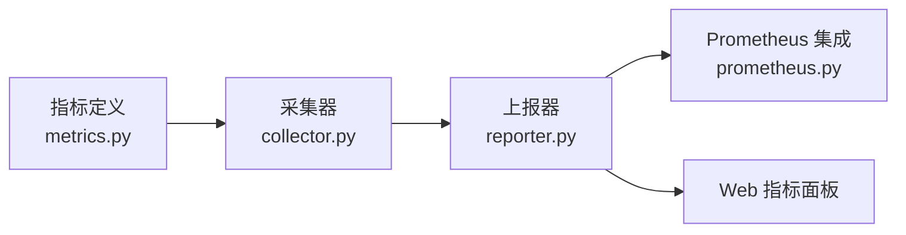
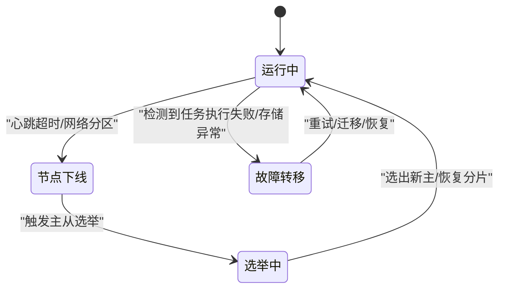
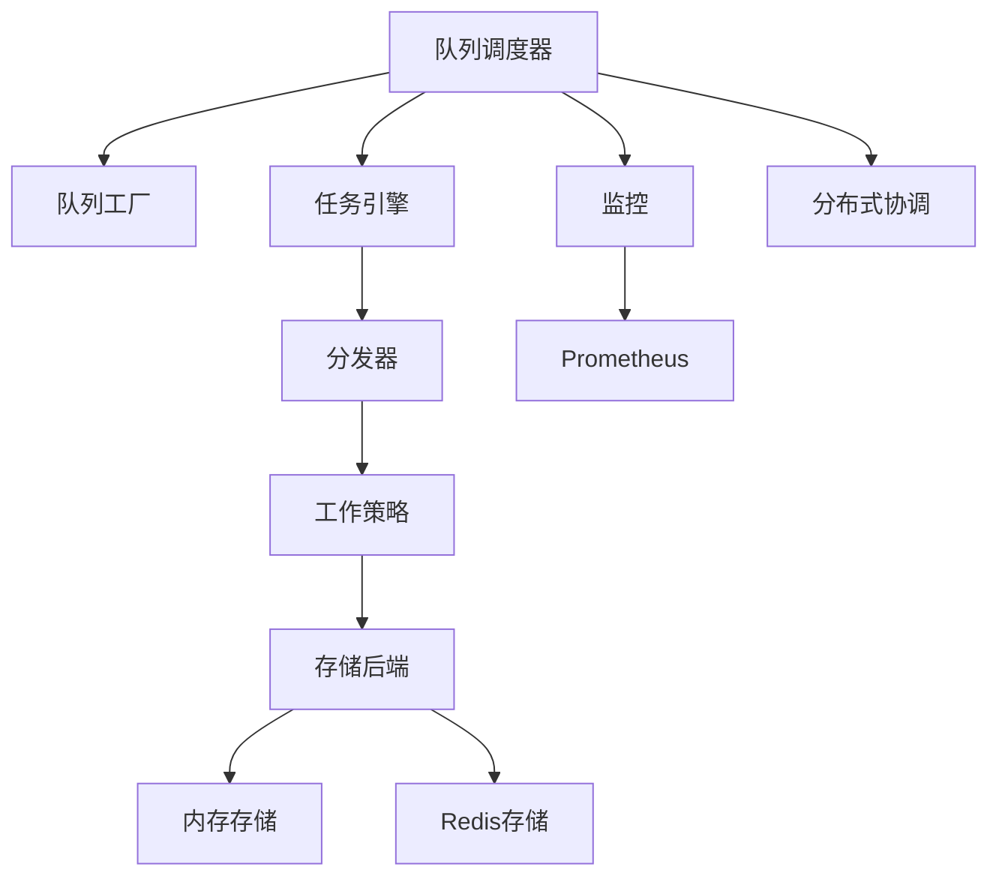

# 队列调度器

<cite>
**本文引用的文件**   
- [src/neotask/queue/queue_scheduler.py](file://src/neotask/queue/queue_scheduler.py)
- [src/neotask/queue/priority_queue.py](file://src/neotask/queue/priority_queue.py)
- [src/neotask/queue/delayed_queue.py](file://src/neotask/queue/delayed_queue.py)
- [src/neotask/queue/base.py](file://src/neotask/queue/base.py)
- [src/neotask/queue/factory.py](file://src/neotask/queue/factory.py)
- [src/neotask/queue/dead_letter.py](file://src/neotask/queue/dead_letter.py)
- [src/neotask/core/engine.py](file://src/neotask/core/engine.py)
- [src/neotask/core/dispatcher.py](file://src/neotask/core/dispatcher.py)
- [src/neotask/worker/strategy.py](file://src/neotask/worker/strategy.py)
- [src/neotask/worker/supervisor.py](file://src/neotask/worker/supervisor.py)
- [src/neotask/storage/base.py](file://src/neotask/storage/base.py)
- [src/neotask/storage/memory.py](file://src/neotask/storage/memory.py)
- [src/neotask/storage/redis.py](file://src/neotask/storage/redis.py)
- [src/neotask/monitor/metrics.py](file://src/neotask/monitor/metrics.py)
- [src/neotask/monitor/collector.py](file://src/neotask/monitor/collector.py)
- [src/neotask/monitor/reporter.py](file://src/neotask/monitor/reporter.py)
- [src/neotask/contrib/prometheus.py](file://src/neotask/contrib/prometheus.py)
- [src/neotask/config/settings.py](file://src/neotask/config/settings.py)
- [src/neotask/models/task.py](file://src/neotask/models/task.py)
- [src/neotask/models/config.py](file://src/neotask/models/config.py)
- [src/neotask/distributed/coordinator.py](file://src/neotask/distributed/coordinator.py)
- [src/neotask/distributed/node.py](file://src/neotask/distributed/node.py)
- [src/neotask/distributed/sharding.py](file://src/neotask/distributed/sharding.py)
</cite>

## 目录
1. [简介](#简介)
2. [项目结构](#项目结构)
3. [核心组件](#核心组件)
4. [架构总览](#架构总览)
5. [详细组件分析](#详细组件分析)
6. [依赖关系分析](#依赖关系分析)
7. [性能考虑](#性能考虑)
8. [故障排查指南](#故障排查指南)
9. [结论](#结论)
10. [附录](#附录)

## 简介
本文件面向“队列调度器”的核心功能与策略，围绕多队列协调、资源分配、负载均衡与容量控制、配置参数与优化建议、监控指标收集与报告、以及故障转移与高可用方案进行系统化说明。文档以代码仓库中的实际实现为依据，提供可追溯的源码定位与可视化图示，帮助读者快速理解并高效使用调度器。

## 项目结构
本项目采用分层与模块化组织方式：
- 队列层：抽象队列接口、优先级队列、延迟队列、死信队列、队列工厂与统一调度入口
- 执行层：任务引擎、分发器、工作进程策略与监督器
- 存储层：内存、Redis、SQLite 等后端
- 分布式层：节点管理、分片、协调器
- 监控层：指标定义、采集、上报与 Prometheus 集成
- 配置与模型：全局设置、任务与配置模型

图表来源
- [src/neotask/queue/queue_scheduler.py](file://src/neotask/queue/queue_scheduler.py)
- [src/neotask/queue/priority_queue.py](file://src/neotask/queue/priority_queue.py)
- [src/neotask/queue/delayed_queue.py](file://src/neotask/queue/delayed_queue.py)
- [src/neotask/queue/dead_letter.py](file://src/neotask/queue/dead_letter.py)
- [src/neotask/queue/factory.py](file://src/neotask/queue/factory.py)
- [src/neotask/core/engine.py](file://src/neotask/core/engine.py)
- [src/neotask/core/dispatcher.py](file://src/neotask/core/dispatcher.py)
- [src/neotask/worker/strategy.py](file://src/neotask/worker/strategy.py)
- [src/neotask/storage/base.py](file://src/neotask/storage/base.py)
- [src/neotask/storage/memory.py](file://src/neotask/storage/memory.py)
- [src/neotask/storage/redis.py](file://src/neotask/storage/redis.py)
- [src/neotask/distributed/coordinator.py](file://src/neotask/distributed/coordinator.py)
- [src/neotask/distributed/node.py](file://src/neotask/distributed/node.py)
- [src/neotask/distributed/sharding.py](file://src/neotask/distributed/sharding.py)
- [src/neotask/monitor/metrics.py](file://src/neotask/monitor/metrics.py)
- [src/neotask/monitor/collector.py](file://src/neotask/monitor/collector.py)
- [src/neotask/monitor/reporter.py](file://src/neotask/monitor/reporter.py)
- [src/neotask/contrib/prometheus.py](file://src/neotask/contrib/prometheus.py)

章节来源
- [src/neotask/queue/queue_scheduler.py](file://src/neotask/queue/queue_scheduler.py)
- [src/neotask/core/engine.py](file://src/neotask/core/engine.py)
- [src/neotask/worker/strategy.py](file://src/neotask/worker/strategy.py)
- [src/neotask/storage/base.py](file://src/neotask/storage/base.py)
- [src/neotask/monitor/metrics.py](file://src/neotask/monitor/metrics.py)

## 核心组件
- 队列调度器：统一接入点，负责多队列选择、路由、容量控制与调度循环
- 队列类型：优先级队列（按权重/优先级出队）、延迟队列（到期触发）、死信队列（失败重试耗尽后归档）
- 任务引擎与分发器：将队列任务下发到具体执行器，驱动生命周期与状态流转
- 工作策略与监督器：决定任务派发策略（如轮询、最少负载），并负责进程/线程池管理与健康检查
- 存储后端：内存、Redis、SQLite 等持久化或缓存能力
- 分布式协调：节点注册、心跳、分片与主从选举，支撑横向扩展与高可用
- 监控体系：指标定义、采集、上报与外部系统对接（如 Prometheus）

章节来源
- [src/neotask/queue/queue_scheduler.py](file://src/neotask/queue/queue_scheduler.py)
- [src/neotask/queue/priority_queue.py](file://src/neotask/queue/priority_queue.py)
- [src/neotask/queue/delayed_queue.py](file://src/neotask/queue/delayed_queue.py)
- [src/neotask/queue/dead_letter.py](file://src/neotask/queue/dead_letter.py)
- [src/neotask/core/engine.py](file://src/neotask/core/engine.py)
- [src/neotask/core/dispatcher.py](file://src/neotask/core/dispatcher.py)
- [src/neotask/worker/strategy.py](file://src/neotask/worker/strategy.py)
- [src/neotask/worker/supervisor.py](file://src/neotask/worker/supervisor.py)
- [src/neotask/storage/base.py](file://src/neotask/storage/base.py)
- [src/neotask/storage/memory.py](file://src/neotask/storage/memory.py)
- [src/neotask/storage/redis.py](file://src/neotask/storage/redis.py)
- [src/neotask/distributed/coordinator.py](file://src/neotask/distributed/coordinator.py)
- [src/neotask/distributed/node.py](file://src/neotask/distributed/node.py)
- [src/neotask/distributed/sharding.py](file://src/neotask/distributed/sharding.py)
- [src/neotask/monitor/metrics.py](file://src/neotask/monitor/metrics.py)
- [src/neotask/monitor/collector.py](file://src/neotask/collector.py)
- [src/neotask/monitor/reporter.py](file://src/neotask/monitor/reporter.py)
- [src/neotask/contrib/prometheus.py](file://src/neotask/contrib/prometheus.py)

## 架构总览
下图展示了从任务入队到执行、再到结果落盘与监控上报的整体流程，以及分布式协调与分片对多实例的影响。

图表来源
- [src/neotask/queue/queue_scheduler.py](file://src/neotask/queue/queue_scheduler.py)
- [src/neotask/queue/factory.py](file://src/neotask/queue/factory.py)
- [src/neotask/queue/priority_queue.py](file://src/neotask/queue/priority_queue.py)
- [src/neotask/queue/delayed_queue.py](file://src/neotask/queue/delayed_queue.py)
- [src/neotask/core/engine.py](file://src/neotask/core/engine.py)
- [src/neotask/core/dispatcher.py](file://src/neotask/core/dispatcher.py)
- [src/neotask/worker/strategy.py](file://src/neotask/worker/strategy.py)
- [src/neotask/storage/base.py](file://src/neotask/storage/base.py)
- [src/neotask/monitor/metrics.py](file://src/neotask/monitor/metrics.py)
- [src/neotask/distributed/coordinator.py](file://src/neotask/distributed/coordinator.py)

## 详细组件分析

### 队列调度器与多队列协调
- 职责
  - 统一接收任务提交请求，根据队列名与策略选择具体队列实例
  - 维护多队列的生命周期与容量上限，避免过载
  - 驱动调度循环，周期性扫描可执行任务并派发
- 关键机制
  - 队列工厂：基于配置动态创建优先级队列、延迟队列、死信队列等
  - 容量控制：每个队列具备最大长度/并发限制，超限则拒绝或阻塞
  - 路由策略：支持按标签/租户/业务域路由到不同队列
  - 事件与中间件：在入队/出队/执行前后注入钩子，用于审计与埋点

图表来源
- [src/neotask/queue/queue_scheduler.py](file://src/neotask/queue/queue_scheduler.py)
- [src/neotask/queue/factory.py](file://src/neotask/queue/factory.py)
- [src/neotask/queue/priority_queue.py](file://src/neotask/queue/priority_queue.py)
- [src/neotask/queue/delayed_queue.py](file://src/neotask/queue/delayed_queue.py)
- [src/neotask/queue/dead_letter.py](file://src/neotask/queue/dead_letter.py)

章节来源
- [src/neotask/queue/queue_scheduler.py](file://src/neotask/queue/queue_scheduler.py)
- [src/neotask/queue/factory.py](file://src/neotask/queue/factory.py)
- [src/neotask/queue/priority_queue.py](file://src/neotask/queue/priority_queue.py)
- [src/neotask/queue/delayed_queue.py](file://src/neotask/queue/delayed_queue.py)
- [src/neotask/queue/dead_letter.py](file://src/neotask/queue/dead_letter.py)

### 资源分配算法与负载均衡
- 资源分配
  - 基于工作策略选择目标执行器（线程/进程/远程节点）
  - 结合队列容量、执行器负载、亲和性标签进行决策
- 负载均衡策略
  - 轮询/加权轮询：适用于同质执行器
  - 最少连接/最少负载：动态感知执行器当前任务数或队列深度
  - 一致性哈希：针对有状态任务，降低迁移成本
- 容量控制
  - 队列级容量上限与背压：超过阈值时拒绝新任务或降级
  - 执行器级并发度限制：防止单点过载
  - 速率限制：按队列或全局限流，保护下游依赖

图表来源
- [src/neotask/worker/strategy.py](file://src/neotask/worker/strategy.py)
- [src/neotask/queue/queue_scheduler.py](file://src/neotask/queue/queue_scheduler.py)
- [src/neotask/monitor/metrics.py](file://src/neotask/monitor/metrics.py)

章节来源
- [src/neotask/worker/strategy.py](file://src/neotask/worker/strategy.py)
- [src/neotask/queue/queue_scheduler.py](file://src/neotask/queue/queue_scheduler.py)
- [src/neotask/monitor/metrics.py](file://src/neotask/monitor/metrics.py)

### 调度器的负载均衡与容量控制策略
- 负载均衡
  - 策略可插拔：通过工作策略模块切换不同算法
  - 动态调整：依据实时指标（队列深度、执行耗时、错误率）自适应
- 容量控制
  - 多级容量：全局、队列、执行器三级上限
  - 背压与熔断：当下游不可用或响应慢时，主动限流或短路
  - 优雅降级：非关键任务进入低优先级队列或延迟执行

章节来源
- [src/neotask/worker/strategy.py](file://src/neotask/worker/strategy.py)
- [src/neotask/queue/queue_scheduler.py](file://src/neotask/queue/queue_scheduler.py)

### 调度器配置参数与性能优化建议
- 关键配置项（示例维度）
  - 队列容量：最大长度、最大并发
  - 调度频率：扫描间隔、批量拉取大小
  - 重试与超时：最大重试次数、重试退避策略、任务超时
  - 存储后端：内存/Redis/SQLite 的选择与连接参数
  - 分布式：节点发现、分片数量、心跳间隔
  - 监控：指标粒度、上报周期、导出格式
- 优化建议
  - 合理设置队列容量与批大小，平衡吞吐与延迟
  - 为热点任务启用专用队列与亲和性策略
  - 使用 Redis 作为共享存储以提升跨进程/跨节点一致性
  - 开启异步 I/O 与连接池，减少锁竞争
  - 定期清理死信队列与过期数据，避免存储膨胀

章节来源
- [src/neotask/config/settings.py](file://src/neotask/config/settings.py)
- [src/neotask/models/config.py](file://src/neotask/models/config.py)
- [src/neotask/storage/base.py](file://src/neotask/storage/base.py)
- [src/neotask/storage/memory.py](file://src/neotask/storage/memory.py)
- [src/neotask/storage/redis.py](file://src/neotask/storage/redis.py)

### 监控指标收集与报告机制
- 指标定义
  - 队列相关：入队速率、出队速率、队列深度、容量利用率
  - 执行相关：任务耗时分布、成功率、失败原因分类
  - 资源相关：CPU/内存占用、I/O 等待、锁等待
- 采集与上报
  - 采集器定时抓取指标，聚合窗口统计
  - 上报器将指标推送至外部系统（如 Prometheus）
  - 可选 Web UI 展示关键指标与健康状态
- 告警与诊断
  - 基于阈值的告警规则（如队列积压、错误率飙升）
  - 关联日志与追踪 ID，快速定位问题根因

图表来源
- [src/neotask/monitor/metrics.py](file://src/neotask/monitor/metrics.py)
- [src/neotask/monitor/collector.py](file://src/neotask/monitor/collector.py)
- [src/neotask/monitor/reporter.py](file://src/neotask/monitor/reporter.py)
- [src/neotask/contrib/prometheus.py](file://src/neotask/contrib/prometheus.py)

章节来源
- [src/neotask/monitor/metrics.py](file://src/neotask/monitor/metrics.py)
- [src/neotask/monitor/collector.py](file://src/neotask/monitor/collector.py)
- [src/neotask/monitor/reporter.py](file://src/neotask/monitor/reporter.py)
- [src/neotask/contrib/prometheus.py](file://src/neotask/contrib/prometheus.py)

### 故障转移与高可用配置方案
- 节点与协调
  - 节点注册与心跳：检测存活，剔除异常节点
  - 主从选举：保证元数据一致性与写唯一性
  - 分片重平衡：节点变化时自动迁移分片，最小化抖动
- 队列与任务高可用
  - 持久化存储：使用 Redis/数据库确保任务不丢失
  - 幂等与去重：任务键去重，避免重复执行
  - 重试与死信：失败任务自动重试，最终进入死信队列人工干预
- 恢复流程
  - 节点重启后重新加入集群，恢复订阅与分片
  - 未完成任务根据状态机恢复或重新派发
  - 监控与告警联动，缩短 MTTR

图表来源
- [src/neotask/distributed/coordinator.py](file://src/neotask/distributed/coordinator.py)
- [src/neotask/distributed/node.py](file://src/neotask/distributed/node.py)
- [src/neotask/distributed/sharding.py](file://src/neotask/distributed/sharding.py)
- [src/neotask/queue/dead_letter.py](file://src/neotask/queue/dead_letter.py)

章节来源
- [src/neotask/distributed/coordinator.py](file://src/neotask/distributed/coordinator.py)
- [src/neotask/distributed/node.py](file://src/neotask/distributed/node.py)
- [src/neotask/distributed/sharding.py](file://src/neotask/distributed/sharding.py)
- [src/neotask/queue/dead_letter.py](file://src/neotask/queue/dead_letter.py)

## 依赖关系分析
- 耦合与内聚
  - 队列调度器与队列工厂松耦合，便于扩展新的队列类型
  - 工作策略独立于执行器，便于替换负载均衡算法
  - 存储后端通过抽象接口隔离，支持热切换
- 外部依赖
  - Redis/数据库：用于持久化与分布式锁
  - Prometheus：指标导出与监控
  - 操作系统线程/进程：执行器载体

图表来源
- [src/neotask/queue/queue_scheduler.py](file://src/neotask/queue/queue_scheduler.py)
- [src/neotask/queue/factory.py](file://src/neotask/queue/factory.py)
- [src/neotask/core/engine.py](file://src/neotask/core/engine.py)
- [src/neotask/core/dispatcher.py](file://src/neotask/core/dispatcher.py)
- [src/neotask/worker/strategy.py](file://src/neotask/worker/strategy.py)
- [src/neotask/storage/base.py](file://src/neotask/storage/base.py)
- [src/neotask/storage/memory.py](file://src/neotask/storage/memory.py)
- [src/neotask/storage/redis.py](file://src/neotask/storage/redis.py)
- [src/neotask/monitor/metrics.py](file://src/neotask/monitor/metrics.py)
- [src/neotask/contrib/prometheus.py](file://src/neotask/contrib/prometheus.py)
- [src/neotask/distributed/coordinator.py](file://src/neotask/distributed/coordinator.py)

章节来源
- [src/neotask/queue/queue_scheduler.py](file://src/neotask/queue/queue_scheduler.py)
- [src/neotask/queue/factory.py](file://src/neotask/queue/factory.py)
- [src/neotask/core/engine.py](file://src/neotask/core/engine.py)
- [src/neotask/core/dispatcher.py](file://src/neotask/core/dispatcher.py)
- [src/neotask/worker/strategy.py](file://src/neotask/worker/strategy.py)
- [src/neotask/storage/base.py](file://src/neotask/storage/base.py)
- [src/neotask/storage/memory.py](file://src/neotask/storage/memory.py)
- [src/neotask/storage/redis.py](file://src/neotask/storage/redis.py)
- [src/neotask/monitor/metrics.py](file://src/neotask/monitor/metrics.py)
- [src/neotask/contrib/prometheus.py](file://src/neotask/contrib/prometheus.py)
- [src/neotask/distributed/coordinator.py](file://src/neotask/distributed/coordinator.py)

## 性能考虑
- 吞吐与延迟权衡
  - 增大批大小提升吞吐但增加尾延迟；需根据 SLA 调优
  - 合理设置扫描间隔与预取数量，避免空转与饥饿
- 锁与并发
  - 减少全局锁范围，尽量使用细粒度锁或无锁数据结构
  - 使用连接池与对象池，降低创建销毁开销
- 存储与网络
  - 批量写入与压缩传输，降低 Redis/DB 压力
  - 本地缓存热点元数据，减少跨进程/跨节点通信
- 观测与回归
  - 建立基准测试与回归门禁，持续验证性能变化
  - 结合指标与链路追踪，定位瓶颈点

[本节为通用指导，无需特定文件引用]

## 故障排查指南
- 常见问题定位
  - 队列积压：检查入队速率、出队速率、执行器负载与容量上限
  - 任务失败：查看错误分类、重试次数、死信队列归档原因
  - 节点异常：关注心跳、分片迁移、主从切换日志
- 诊断工具
  - 指标面板：观察关键指标趋势与阈值告警
  - 日志与追踪：通过任务 ID 串联全链路日志
  - 健康检查：服务就绪与存活探针
- 恢复步骤
  - 扩容执行器或提升并行度
  - 临时降级非关键任务，保障核心路径
  - 清理死信队列，回放必要任务

章节来源
- [src/neotask/monitor/metrics.py](file://src/neotask/monitor/metrics.py)
- [src/neotask/monitor/collector.py](file://src/neotask/monitor/collector.py)
- [src/neotask/monitor/reporter.py](file://src/neotask/monitor/reporter.py)
- [src/neotask/queue/dead_letter.py](file://src/neotask/queue/dead_letter.py)
- [src/neotask/distributed/coordinator.py](file://src/neotask/distributed/coordinator.py)

## 结论
队列调度器通过多队列协调、灵活的资源分配与负载均衡策略、严格的容量控制与完善的监控体系，提供了高吞吐、低延迟且高可用的任务处理能力。配合分布式协调与故障转移机制，可在复杂生产环境中稳定运行。建议在生产部署前充分进行容量规划与压测，并结合业务特性定制策略与指标告警。

[本节为总结性内容，无需特定文件引用]

## 附录
- 术语表
  - 队列：任务的有序集合，支持多种类型（优先、延迟、死信）
  - 执行器：承载任务运行的线程/进程/远程节点
  - 分片：分布式环境下将任务空间划分到多个节点
  - 背压：当消费者处理不过来时，生产者减速或拒绝
- 参考模型
  - 任务模型：包含任务标识、参数、优先级、重试策略、状态等
  - 配置模型：全局与模块级配置项的结构与默认值

章节来源
- [src/neotask/models/task.py](file://src/neotask/models/task.py)
- [src/neotask/models/config.py](file://src/neotask/models/config.py)