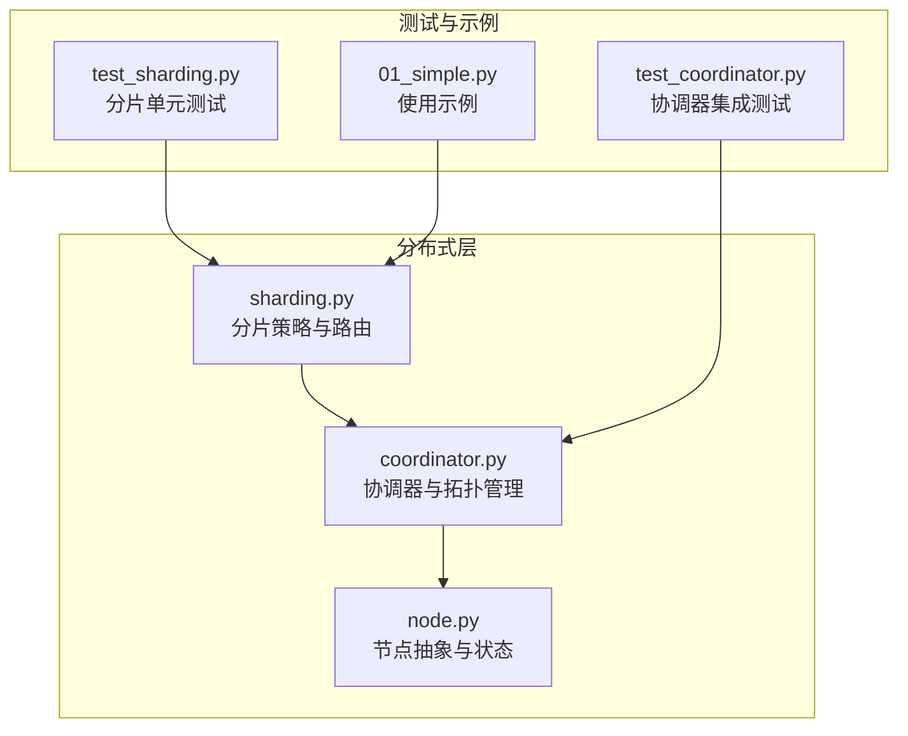
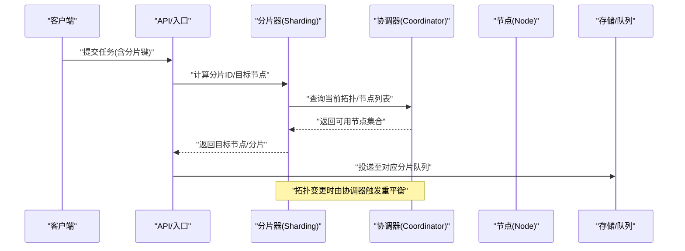
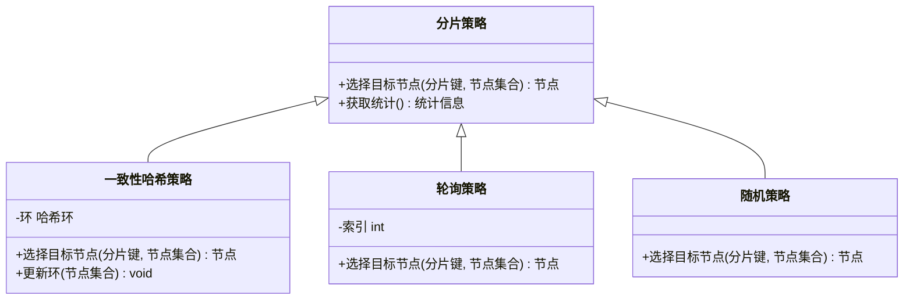
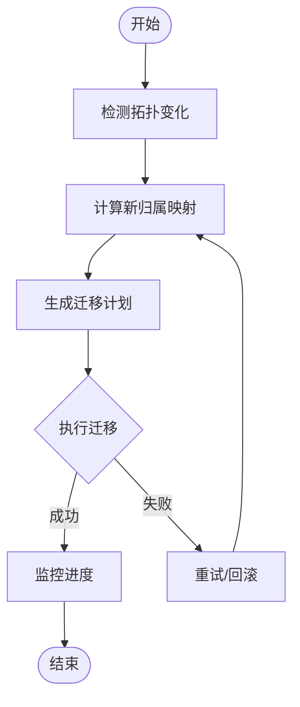
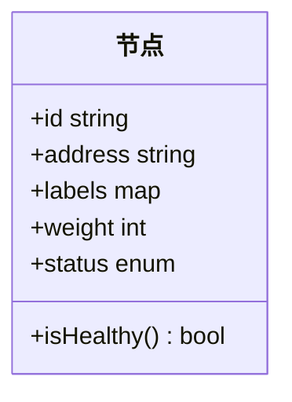
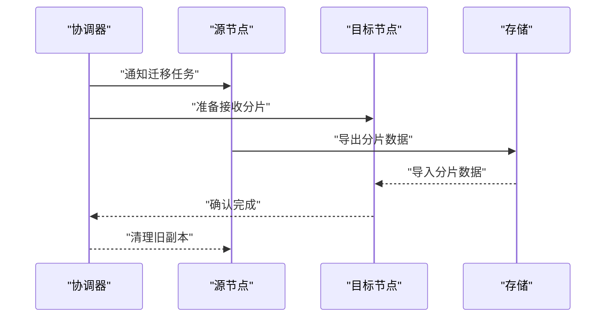
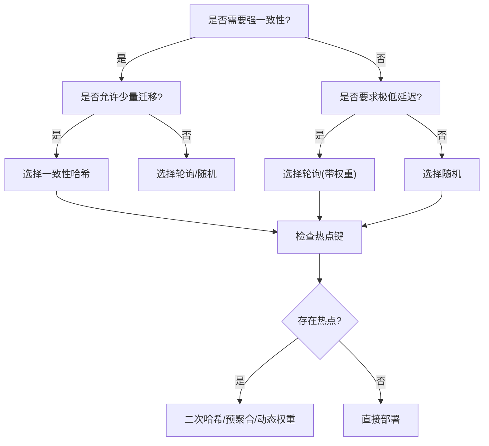
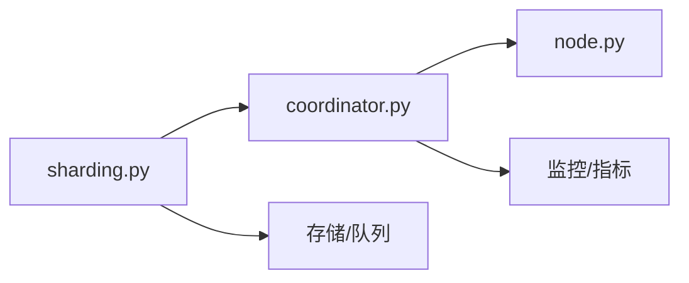

# 任务分片策略

<cite>
**本文引用的文件**   
- [src/neotask/distributed/sharding.py](file://src/neotask/distributed/sharding.py)
- [src/neotask/distributed/coordinator.py](file://src/neotask/distributed/coordinator.py)
- [src/neotask/distributed/node.py](file://src/neotask/distributed/node.py)
- [tests/distributed/test_sharding.py](file://tests/distributed/test_sharding.py)
- [tests/distributed/test_coordinator.py](file://tests/distributed/test_coordinator.py)
- [examples/01_simple.py](file://examples/01_simple.py)
</cite>

## 目录
1. [简介](#简介)
2. [项目结构](#项目结构)
3. [核心组件](#核心组件)
4. [架构总览](#架构总览)
5. [详细组件分析](#详细组件分析)
6. [依赖关系分析](#依赖关系分析)
7. [性能考量](#性能考量)
8. [故障排查指南](#故障排查指南)
9. [结论](#结论)
10. [附录](#附录)

## 简介
本文件围绕“任务分片”的算法设计与实现进行深入解析，重点覆盖以下方面：
- 一致性哈希、轮询分配、随机分配等分片策略的特点与适用场景
- 分片键的选择原则、数据倾斜避免方法与负载均衡机制
- 分片迁移与扩容缩容时的数据重平衡策略
- 分片配置示例与性能调优指南
- 分片策略选择的决策树与最佳实践建议

为便于读者理解，文档在关键章节提供代码级图示与来源标注，确保内容与实际实现一致。

## 项目结构
本项目采用分层模块化组织，分片相关能力位于分布式模块中，测试用例位于 tests/distributed，示例位于 examples。

图表来源
- [src/neotask/distributed/sharding.py](file://src/neotask/distributed/sharding.py)
- [src/neotask/distributed/coordinator.py](file://src/neotask/distributed/coordinator.py)
- [src/neotask/distributed/node.py](file://src/neotask/distributed/node.py)
- [tests/distributed/test_sharding.py](file://tests/distributed/test_sharding.py)
- [tests/distributed/test_coordinator.py](file://tests/distributed/test_coordinator.py)
- [examples/01_simple.py](file://examples/01_simple.py)

章节来源
- [src/neotask/distributed/sharding.py](file://src/neotask/distributed/sharding.py)
- [src/neotask/distributed/coordinator.py](file://src/neotask/distributed/coordinator.py)
- [src/neotask/distributed/node.py](file://src/neotask/distributed/node.py)
- [tests/distributed/test_sharding.py](file://tests/distributed/test_sharding.py)
- [tests/distributed/test_coordinator.py](file://tests/distributed/test_coordinator.py)
- [examples/01_simple.py](file://examples/01_simple.py)

## 核心组件
- 分片策略与路由（sharding）：提供多种分片策略接口与实现，负责将任务映射到具体分片与节点。
- 协调器（coordinator）：维护集群拓扑、节点上下线事件、分片归属与迁移流程。
- 节点抽象（node）：描述节点元信息、健康状态与能力标签，供分片与调度使用。

章节来源
- [src/neotask/distributed/sharding.py](file://src/neotask/distributed/sharding.py)
- [src/neotask/distributed/coordinator.py](file://src/neotask/distributed/coordinator.py)
- [src/neotask/distributed/node.py](file://src/neotask/distributed/node.py)

## 架构总览
下图展示了从任务提交到分片选择与落地的整体流程，以及协调器在拓扑变化时的重平衡职责。

图表来源
- [src/neotask/distributed/sharding.py](file://src/neotask/distributed/sharding.py)
- [src/neotask/distributed/coordinator.py](file://src/neotask/distributed/coordinator.py)
- [src/neotask/distributed/node.py](file://src/neotask/distributed/node.py)

## 详细组件分析

### 分片策略与路由（sharding）
- 设计要点
  - 统一策略接口：所有分片策略需实现一致的“根据分片键选择目标节点”的方法。
  - 可扩展性：新增策略只需实现接口并注册，无需改动调用方。
  - 可观测性：暴露命中统计、失败计数等指标，便于定位热点与异常。
- 常见策略
  - 一致性哈希：对分片键进行哈希后映射到环上，按顺时针找到首个可用节点；扩容缩容仅影响少量键，适合大规模稳定集群。
  - 轮询分配：按顺序遍历可用节点，适合无状态且负载相近的场景。
  - 随机分配：随机选取可用节点，简单但可能引入抖动，适合短生命周期或临时任务。
- 分片键选择原则
  - 均匀性：键空间分布尽量均匀，避免热点。
  - 稳定性：键值不频繁变动，减少迁移成本。
  - 业务语义：优先选择能体现任务归属的键（如租户ID、设备ID）。
- 数据倾斜避免
  - 预聚合：将细粒度键合并为粗粒度键，降低热点概率。
  - 二次哈希：对热点键追加随机后缀，打散后再路由。
  - 动态权重：结合节点容量与负载，调整策略权重。
- 负载均衡机制
  - 节点权重：不同节点可设置不同权重，提升高配节点利用率。
  - 健康感知：剔除不可用节点，避免无效路由。
  - 局部亲和：同一会话或批次尽量落在同节点，减少跨节点通信。

图表来源
- [src/neotask/distributed/sharding.py](file://src/neotask/distributed/sharding.py)

章节来源
- [src/neotask/distributed/sharding.py](file://src/neotask/distributed/sharding.py)
- [tests/distributed/test_sharding.py](file://tests/distributed/test_sharding.py)

### 协调器（coordinator）
- 职责
  - 维护节点注册、心跳与健康状态。
  - 管理分片归属表与迁移计划。
  - 在节点上下线时触发重平衡，保证分片数量与节点数比例合理。
- 重平衡流程
  - 检测拓扑变化（节点加入/离开/降级）。
  - 计算新的分片归属映射。
  - 生成迁移任务，按优先级执行，避免瞬时风暴。
  - 监控迁移进度，失败重试与回滚。

图表来源
- [src/neotask/distributed/coordinator.py](file://src/neotask/distributed/coordinator.py)

章节来源
- [src/neotask/distributed/coordinator.py](file://src/neotask/distributed/coordinator.py)
- [tests/distributed/test_coordinator.py](file://tests/distributed/test_coordinator.py)

### 节点抽象（node）
- 字段与能力
  - 节点标识、地址、版本、能力标签（CPU/内存/IO等）。
  - 健康状态、权重、容量上限。
- 作用
  - 作为分片策略的输入集合。
  - 作为协调器管理的实体，参与心跳与选举。

图表来源
- [src/neotask/distributed/node.py](file://src/neotask/distributed/node.py)

章节来源
- [src/neotask/distributed/node.py](file://src/neotask/distributed/node.py)

### 分片迁移与重平衡策略
- 触发条件
  - 节点上线/下线、健康状态变化、容量阈值告警。
- 迁移步骤
  - 计算目标映射差异集。
  - 分批迁移，限制并发度，避免拥塞。
  - 校验数据一致性，失败自动重试。
- 注意事项
  - 迁移期间保持服务可用性，支持读写路径切换。
  - 记录迁移审计日志，便于追踪与回溯。

图表来源
- [src/neotask/distributed/coordinator.py](file://src/neotask/distributed/coordinator.py)

章节来源
- [src/neotask/distributed/coordinator.py](file://src/neotask/distributed/coordinator.py)

### 分片配置示例与性能调优
- 配置项建议
  - 分片数量：通常为节点数的倍数，便于扩展与迁移。
  - 策略类型：默认一致性哈希，热点场景可切换为加权轮询。
  - 权重与容量：依据节点规格设置权重，避免过载。
  - 迁移并发：控制并发度，避免网络与磁盘瓶颈。
- 性能调优
  - 观察命中率与延迟，识别热点键。
  - 调整哈希桶数量与权重，平滑负载。
  - 启用缓存与批量操作，降低跨节点开销。
  - 监控指标：分片分布、迁移时长、错误率、资源使用率。

章节来源
- [examples/01_simple.py](file://examples/01_simple.py)
- [tests/distributed/test_sharding.py](file://tests/distributed/test_sharding.py)
- [tests/distributed/test_coordinator.py](file://tests/distributed/test_coordinator.py)

### 分片策略选择决策树

[此图为概念性流程图，不直接映射具体源码文件]

## 依赖关系分析
- 内部依赖
  - 分片器依赖协调器提供的节点集合与拓扑信息。
  - 协调器依赖节点抽象进行状态管理与事件处理。
- 外部依赖
  - 存储/队列后端用于持久化分片数据与任务。
  - 监控与指标系统用于采集分片分布与迁移效果。

图表来源
- [src/neotask/distributed/sharding.py](file://src/neotask/distributed/sharding.py)
- [src/neotask/distributed/coordinator.py](file://src/neotask/distributed/coordinator.py)
- [src/neotask/distributed/node.py](file://src/neotask/distributed/node.py)

章节来源
- [src/neotask/distributed/sharding.py](file://src/neotask/distributed/sharding.py)
- [src/neotask/distributed/coordinator.py](file://src/neotask/distributed/coordinator.py)
- [src/neotask/distributed/node.py](file://src/neotask/distributed/node.py)

## 性能考量
- 哈希计算开销：一致性哈希需对每个任务进行哈希，应优化哈希函数与缓存结果。
- 迁移带宽：大分片迁移易造成拥塞，需限流与错峰执行。
- 热点键治理：通过二次哈希与预聚合降低热点概率。
- 权重与容量：合理设置节点权重，避免低配节点成为瓶颈。
- 监控与告警：建立分片分布、迁移时长、错误率等指标的阈值告警。

[本节为通用指导，不直接分析具体文件]

## 故障排查指南
- 常见问题
  - 分片不均：检查分片键分布与权重配置。
  - 迁移失败：查看迁移日志与存储连接状态，确认并发与超时参数。
  - 节点不可用：核对心跳与健康状态，排除网络与资源问题。
- 诊断步骤
  - 拉取分片分布与热点指标。
  - 回放迁移计划与执行日志。
  - 复现最小用例，验证策略与配置。

章节来源
- [tests/distributed/test_sharding.py](file://tests/distributed/test_sharding.py)
- [tests/distributed/test_coordinator.py](file://tests/distributed/test_coordinator.py)

## 结论
- 一致性哈希适用于大规模稳定集群，具备较好的扩缩容特性。
- 轮询与随机策略更简单，适合无状态与短生命周期任务。
- 分片键选择与权重配置是避免倾斜的关键。
- 协调器驱动的重平衡流程保障集群弹性与可用性。
- 完善的监控与调优是长期稳定运行的基础。

[本节为总结性内容，不直接分析具体文件]

## 附录
- 最佳实践建议
  - 以租户或设备维度作为分片键，保证归属明确与分布均匀。
  - 初始分片数量为节点数的2~4倍，预留扩展空间。
  - 迁移任务分批执行，限制并发，避免雪崩。
  - 定期评估热点键，必要时引入二次哈希或预聚合。
  - 建立分片健康巡检与自动化修复流程。

[本节为通用建议，不直接分析具体文件]