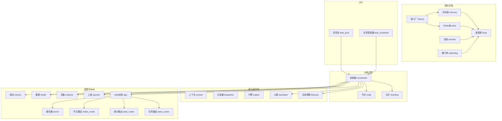
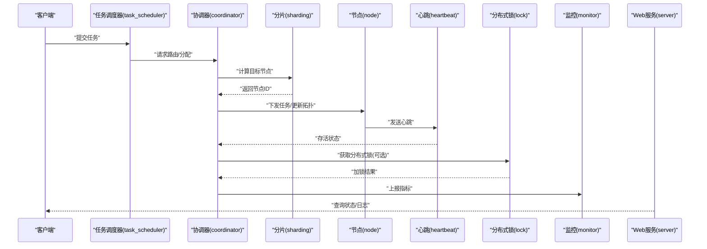
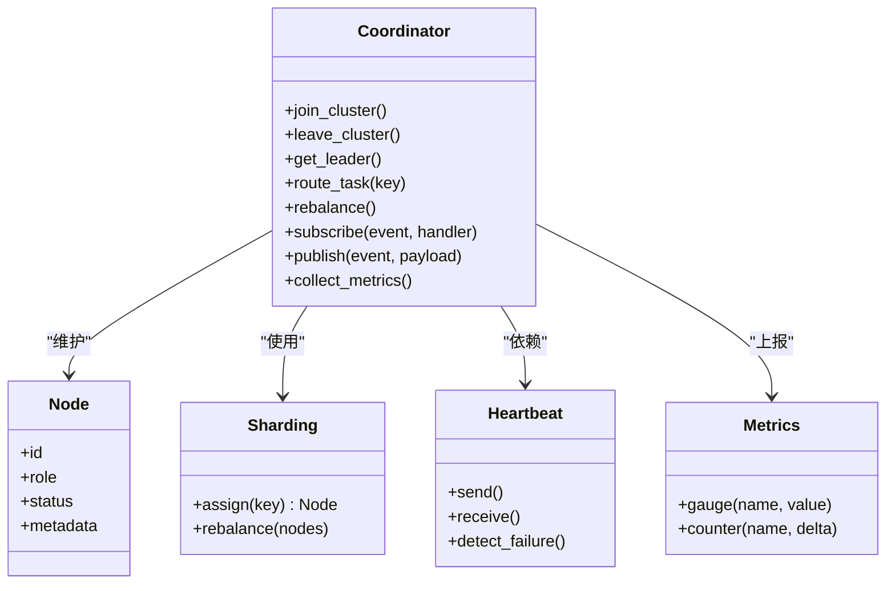
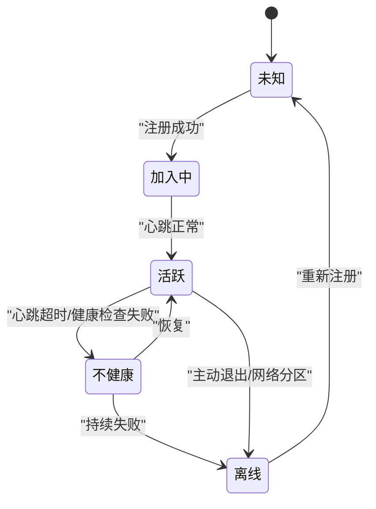
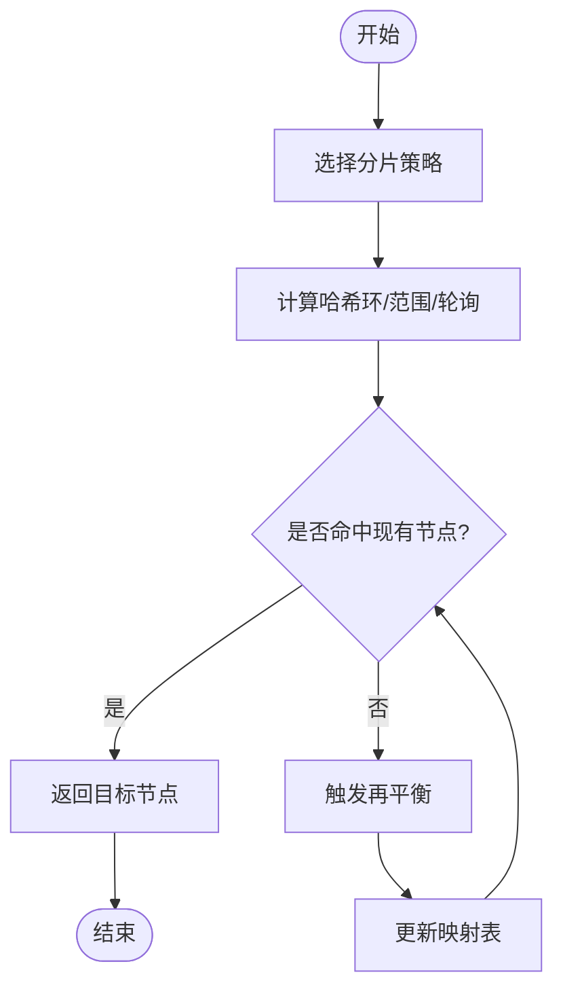
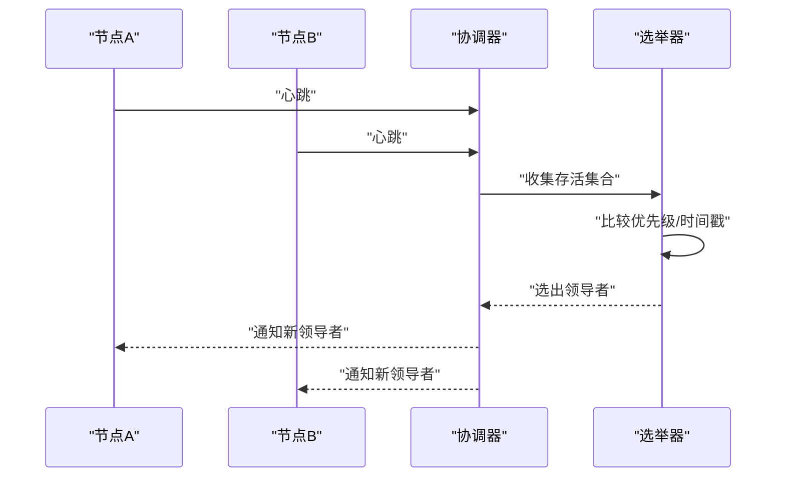
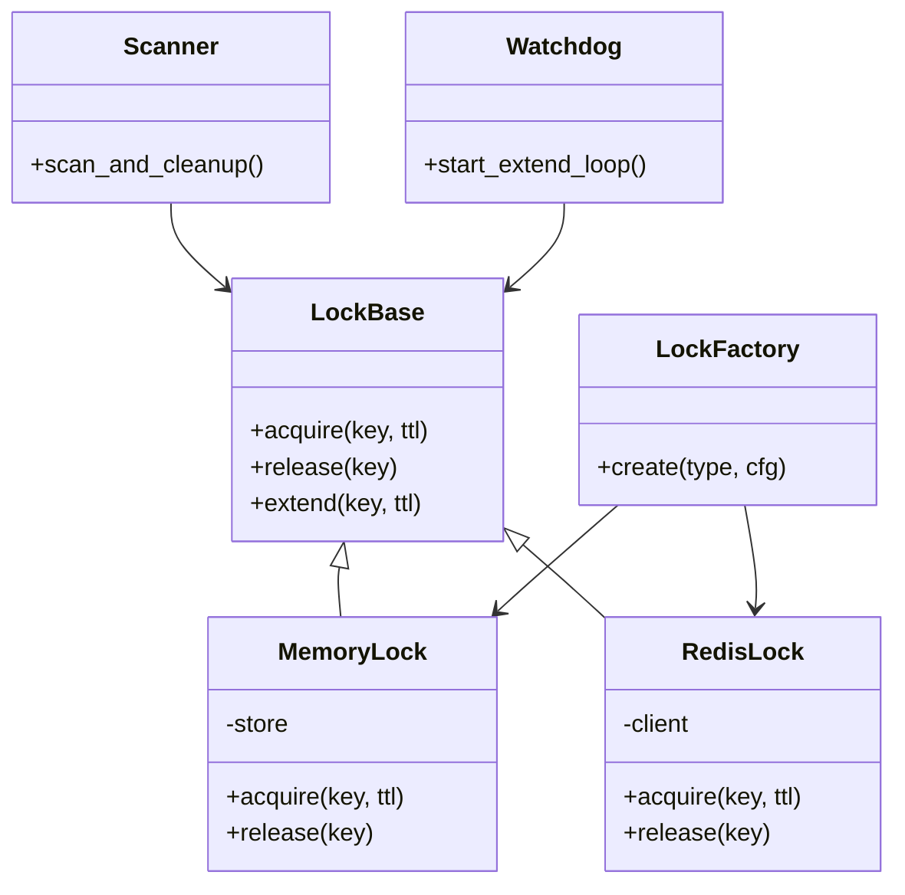
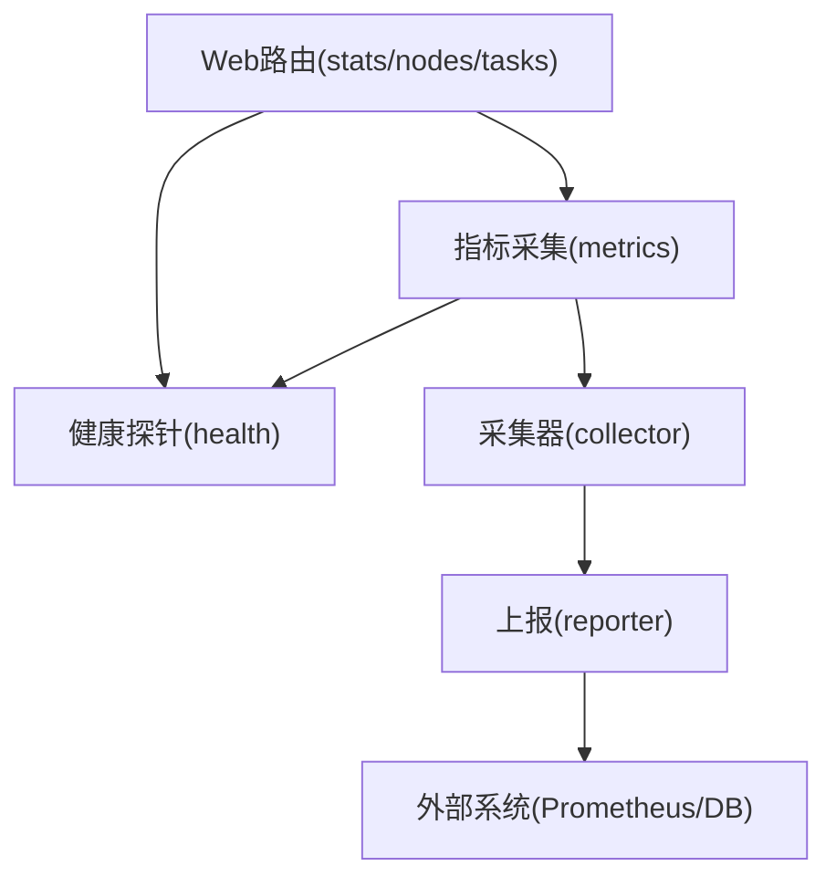
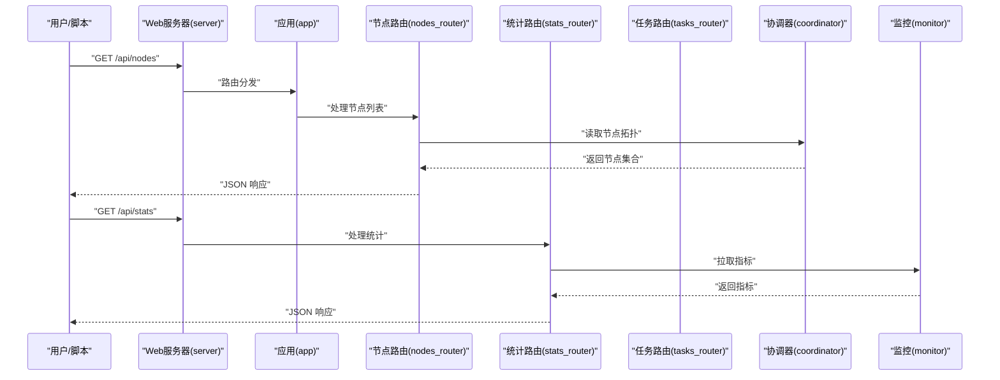
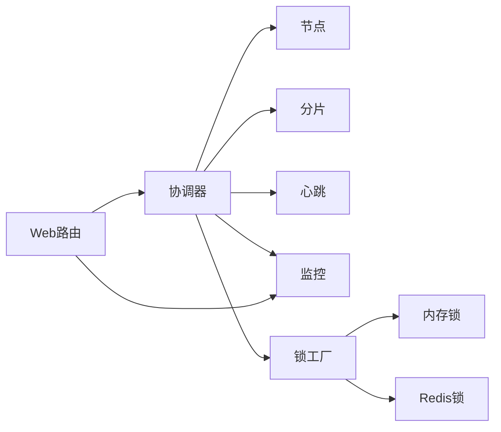

# 分布式协调

<cite>
**本文引用的文件**   
- [README_zh.md](file://README_zh.md)
- [coordinator.py](file://src/neotask/distributed/coordinator.py)
- [node.py](file://src/neotask/distributed/node.py)
- [sharding.py](file://src/neotask/distributed/sharding.py)
- [heartbeat.py](file://src/neotask/core/heartbeat.py)
- [base.py](file://src/neotask/lock/base.py)
- [redis_lock.py](file://src/neotask/lock/redis.py)
- [memory_lock.py](file://src/neotask/lock/memory.py)
- [factory.py](file://src/neotask/lock/factory.py)
- [scanner.py](file://src/neotask/lock/scanner.py)
- [watchdog.py](file://src/neotask/lock/watchdog.py)
- [task_pool.py](file://src/neotask/api/task_pool.py)
- [task_scheduler.py](file://src/neotask/api/task_scheduler.py)
- [context.py](file://src/neotask/core/context.py)
- [dispatcher.py](file://src/neotask/core/dispatcher.py)
- [engine.py](file://src/neotask/core/engine.py)
- [lifecycle.py](file://src/neotask/core/lifecycle.py)
- [settings.py](file://src/neotask/config/settings.py)
- [constants.py](file://src/neotask/common/constants.py)
- [exceptions.py](file://src/neotask/common/exceptions.py)
- [logger.py](file://src/neotask/common/logger.py)
- [metrics.py](file://src/neotask/monitor/metrics.py)
- [health.py](file://src/neotask/monitor/health.py)
- [collector.py](file://src/neotask/monitor/collector.py)
- [reporter.py](file://src/neotask/monitor/reporter.py)
- [nodes_router.py](file://src/neotask/web/routes/nodes_router.py)
- [stats_router.py](file://src/neotask/web/routes/stats_router.py)
- [tasks_router.py](file://src/neotask/web/routes/tasks_router.py)
- [app.py](file://src/neotask/web/app.py)
- [server.py](file://src/neotask/web/server.py)
- [test_coordinator.py](file://tests/distributed/test_coordinator.py)
- [test_node_manager.py](file://tests/distributed/test_node_manager.py)
- [test_heartbeat.py](file://tests/distributed/test_heartbeat.py)
- [test_sharding.py](file://tests/distributed/test_sharding.py)
- [test_distributed_lock.py](file://tests/distributed/test_distributed_lock.py)
- [test_redis_lock.py](file://tests/distributed/test_redis_lock.py)
</cite>

## 目录
1. [简介](#简介)
2. [项目结构](#项目结构)
3. [核心组件](#核心组件)
4. [架构总览](#架构总览)
5. [详细组件分析](#详细组件分析)
6. [依赖关系分析](#依赖关系分析)
7. [性能考虑](#性能考虑)
8. [故障排查指南](#故障排查指南)
9. [结论](#结论)
10. [附录](#附录)

## 简介
本仓库实现了一个面向任务调度的分布式协调子系统，围绕节点管理、服务发现、负载均衡、任务分片、一致性保障与故障恢复等能力构建。系统通过协调器统一编排节点生命周期、心跳检测与领导者选举；基于分片策略将任务路由到合适的执行节点；提供可插拔的分布式锁与监控指标采集；并通过 Web API 暴露集群状态与运维接口。整体设计强调可扩展性、容错性与可观测性，适用于高吞吐、低延迟的任务调度场景。

## 项目结构
分布式相关代码主要位于 distributed、core、lock、monitor、web 等模块：
- distributed：协调器、节点抽象、分片策略
- core：上下文、分发器、引擎、心跳、生命周期
- lock：分布式锁抽象与多种后端实现（内存、Redis）
- monitor：指标、健康检查、采集与上报
- web：REST/WebSocket 路由与应用服务器
- api：对外任务池与调度器接口
- config/common：配置、常量、异常、日志

图表来源
- [coordinator.py:1-200](file://src/neotask/distributed/coordinator.py#L1-L200)
- [node.py:1-200](file://src/neotask/distributed/node.py#L1-L200)
- [sharding.py:1-200](file://src/neotask/distributed/sharding.py#L1-L200)
- [heartbeat.py:1-200](file://src/neotask/core/heartbeat.py#L1-L200)
- [base.py:1-200](file://src/neotask/lock/base.py#L1-L200)
- [memory_lock.py:1-200](file://src/neotask/lock/memory.py#L1-L200)
- [redis_lock.py:1-200](file://src/neotask/lock/redis.py#L1-L200)
- [factory.py:1-200](file://src/neotask/lock/factory.py#L1-L200)
- [scanner.py:1-200](file://src/neotask/lock/scanner.py#L1-L200)
- [watchdog.py:1-200](file://src/neotask/lock/watchdog.py#L1-L200)
- [metrics.py:1-200](file://src/neotask/monitor/metrics.py#L1-L200)
- [health.py:1-200](file://src/neotask/monitor/health.py#L1-L200)
- [collector.py:1-200](file://src/neotask/monitor/collector.py#L1-L200)
- [reporter.py:1-200](file://src/neotask/monitor/reporter.py#L1-L200)
- [nodes_router.py:1-200](file://src/neotask/web/routes/nodes_router.py#L1-L200)
- [stats_router.py:1-200](file://src/neotask/web/routes/stats_router.py#L1-L200)
- [tasks_router.py:1-200](file://src/neotask/web/routes/tasks_router.py#L1-L200)
- [app.py:1-200](file://src/neotask/web/app.py#L1-L200)
- [server.py:1-200](file://src/neotask/web/server.py#L1-L200)
- [task_pool.py:1-200](file://src/neotask/api/task_pool.py#L1-L200)
- [task_scheduler.py:1-200](file://src/neotask/api/task_scheduler.py#L1-L200)

章节来源
- [README_zh.md](file://README_zh.md)

## 核心组件
- 协调器（Coordinator）：负责集群内节点注册、发现、拓扑维护、领导者选举、任务分片与再平衡、事件广播与订阅、与监控/锁/存储的集成。
- 节点（Node）：表示集群中的一个工作单元，承载心跳、角色（主/从）、资源信息、任务亲和与路由元数据。
- 分片（Sharding）：定义任务键到节点的映射策略，支持一致性哈希、范围分片、轮询等，并提供再平衡与迁移辅助。
- 心跳（Heartbeat）：周期性发送存活信号，检测节点失效并触发恢复流程。
- 分布式锁（Lock）：提供跨进程/跨节点的互斥原语，支持内存与 Redis 两种后端，具备看门狗与扫描清理机制。
- 监控（Monitor）：采集指标、健康探针、上报至外部系统，为排障与容量规划提供依据。
- Web 接口：暴露节点、任务、统计等 REST 端点，便于运维与可视化。

章节来源
- [coordinator.py:1-200](file://src/neotask/distributed/coordinator.py#L1-L200)
- [node.py:1-200](file://src/neotask/distributed/node.py#L1-L200)
- [sharding.py:1-200](file://src/neotask/distributed/sharding.py#L1-L200)
- [heartbeat.py:1-200](file://src/neotask/core/heartbeat.py#L1-L200)
- [base.py:1-200](file://src/neotask/lock/base.py#L1-L200)
- [redis_lock.py:1-200](file://src/neotask/lock/redis.py#L1-L200)
- [memory_lock.py:1-200](file://src/neotask/lock/memory.py#L1-L200)
- [factory.py:1-200](file://src/neotask/lock/factory.py#L1-L200)
- [scanner.py:1-200](file://src/neotask/lock/scanner.py#L1-L200)
- [watchdog.py:1-200](file://src/neotask/lock/watchdog.py#L1-L200)
- [metrics.py:1-200](file://src/neotask/monitor/metrics.py#L1-L200)
- [health.py:1-200](file://src/neotask/monitor/health.py#L1-L200)
- [collector.py:1-200](file://src/neotask/monitor/collector.py#L1-L200)
- [reporter.py:1-200](file://src/neotask/monitor/reporter.py#L1-L200)
- [nodes_router.py:1-200](file://src/neotask/web/routes/nodes_router.py#L1-L200)
- [stats_router.py:1-200](file://src/neotask/web/routes/stats_router.py#L1-L200)
- [tasks_router.py:1-200](file://src/neotask/web/routes/tasks_router.py#L1-L200)
- [app.py:1-200](file://src/neotask/web/app.py#L1-L200)
- [server.py:1-200](file://src/neotask/web/server.py#L1-L200)
- [task_pool.py:1-200](file://src/neotask/api/task_pool.py#L1-L200)
- [task_scheduler.py:1-200](file://src/neotask/api/task_scheduler.py#L1-L200)

## 架构总览
下图展示了分布式协调的关键交互：客户端通过 API 提交任务，协调器根据分片策略选择目标节点；节点间通过心跳维持存活状态；领导者负责全局决策（如再平衡），其余节点作为工作节点执行任务；监控与 Web 层提供可观测性与运维入口。

图表来源
- [task_scheduler.py:1-200](file://src/neotask/api/task_scheduler.py#L1-L200)
- [coordinator.py:1-200](file://src/neotask/distributed/coordinator.py#L1-L200)
- [sharding.py:1-200](file://src/neotask/distributed/sharding.py#L1-L200)
- [node.py:1-200](file://src/neotask/distributed/node.py#L1-L200)
- [heartbeat.py:1-200](file://src/neotask/core/heartbeat.py#L1-L200)
- [base.py:1-200](file://src/neotask/lock/base.py#L1-L200)
- [metrics.py:1-200](file://src/neotask/monitor/metrics.py#L1-L200)
- [server.py:1-200](file://src/neotask/web/server.py#L1-L200)

## 详细组件分析

### 协调器（Coordinator）
职责
- 节点注册/注销、拓扑维护与视图同步
- 领导者选举与主备切换
- 任务分片与再平衡触发
- 事件总线与订阅分发
- 与锁、监控、存储等基础设施协作

关键流程
- 启动时初始化分片表、加载历史拓扑、加入集群
- 周期性地收集节点心跳与健康状态，触发再平衡或故障转移
- 处理来自 API 的路由请求，结合当前拓扑与负载进行决策
- 向监控上报集群规模、分片分布、领导者状态等指标

图表来源
- [coordinator.py:1-200](file://src/neotask/distributed/coordinator.py#L1-L200)
- [node.py:1-200](file://src/neotask/distributed/node.py#L1-L200)
- [sharding.py:1-200](file://src/neotask/distributed/sharding.py#L1-L200)
- [heartbeat.py:1-200](file://src/neotask/core/heartbeat.py#L1-L200)
- [metrics.py:1-200](file://src/neotask/monitor/metrics.py#L1-L200)

章节来源
- [coordinator.py:1-200](file://src/neotask/distributed/coordinator.py#L1-L200)
- [test_coordinator.py:1-200](file://tests/distributed/test_coordinator.py#L1-L200)

### 节点管理（Node）
职责
- 标识与描述节点（ID、角色、资源、标签）
- 心跳收发与存活判定
- 与协调器同步状态变更（加入/离开/降级）

要点
- 节点状态机包含：未知、加入中、活跃、不健康、离线
- 健康检查失败阈值与退避重试策略
- 元数据用于亲和路由与容量评估

图表来源
- [node.py:1-200](file://src/neotask/distributed/node.py#L1-L200)
- [heartbeat.py:1-200](file://src/neotask/core/heartbeat.py#L1-L200)

章节来源
- [node.py:1-200](file://src/neotask/distributed/node.py#L1-L200)
- [test_node_manager.py:1-200](file://tests/distributed/test_node_manager.py#L1-L200)
- [test_heartbeat.py:1-200](file://tests/distributed/test_heartbeat.py#L1-L200)

### 任务分片与负载均衡（Sharding）
职责
- 将任务键映射到具体节点，保证均匀分布与可重入
- 在节点增删时触发再平衡，最小化迁移成本
- 支持多种策略（一致性哈希、范围、轮询）

算法要点
- 一致性哈希环：虚拟节点提升均衡性，减少抖动
- 再平衡：按权重或容量动态调整映射，避免热点
- 幂等路由：同一键在不同拓扑下尽量稳定落盘

图表来源
- [sharding.py:1-200](file://src/neotask/distributed/sharding.py#L1-L200)

章节来源
- [sharding.py:1-200](file://src/neotask/distributed/sharding.py#L1-L200)
- [test_sharding.py:1-200](file://tests/distributed/test_sharding.py#L1-L200)

### 心跳检测与领导者选举（Heartbeat & Elector）
职责
- 心跳：周期性上报存活，检测节点失效
- 选举：在可用节点中选择领导者，确保全局决策唯一性

流程
- 节点启动后开启心跳循环
- 协调器聚合心跳，超过阈值标记不健康
- 选举逻辑基于时间戳/优先级/随机扰动，避免脑裂
- 新领导者接管再平衡与全局锁持有者

图表来源
- [heartbeat.py:1-200](file://src/neotask/core/heartbeat.py#L1-L200)
- [coordinator.py:1-200](file://src/neotask/distributed/coordinator.py#L1-L200)

章节来源
- [heartbeat.py:1-200](file://src/neotask/core/heartbeat.py#L1-L200)
- [test_heartbeat.py:1-200](file://tests/distributed/test_heartbeat.py#L1-L200)

### 分布式锁（Distributed Lock）
职责
- 提供跨进程/跨节点的互斥原语
- 支持自动续租与过期释放
- 提供扫描清理与看门狗机制

实现
- 抽象基类定义 acquire/release/extend 接口
- 内存锁用于单机多进程
- Redis 锁用于跨进程/跨主机
- 工厂根据配置创建对应实现
- 扫描器定期清理过期锁，看门狗守护续租

图表来源
- [base.py:1-200](file://src/neotask/lock/base.py#L1-L200)
- [memory_lock.py:1-200](file://src/neotask/lock/memory.py#L1-L200)
- [redis_lock.py:1-200](file://src/neotask/lock/redis.py#L1-L200)
- [factory.py:1-200](file://src/neotask/lock/factory.py#L1-L200)
- [scanner.py:1-200](file://src/neotask/lock/scanner.py#L1-L200)
- [watchdog.py:1-200](file://src/neotask/lock/watchdog.py#L1-L200)

章节来源
- [base.py:1-200](file://src/neotask/lock/base.py#L1-L200)
- [memory_lock.py:1-200](file://src/neotask/lock/memory.py#L1-L200)
- [redis_lock.py:1-200](file://src/neotask/lock/redis.py#L1-L200)
- [factory.py:1-200](file://src/neotask/lock/factory.py#L1-L200)
- [scanner.py:1-200](file://src/neotask/lock/scanner.py#L1-L200)
- [watchdog.py:1-200](file://src/neotask/lock/watchdog.py#L1-L200)
- [test_distributed_lock.py:1-200](file://tests/distributed/test_distributed_lock.py#L1-L200)
- [test_redis_lock.py:1-200](file://tests/distributed/test_redis_lock.py#L1-L200)

### 监控与可观测性（Monitor）
职责
- 指标采集：Gauge/Counter/Histogram 等
- 健康检查：节点、锁、存储、队列等探针
- 上报：对接 Prometheus/自定义后端
- Web 暴露：统计与节点详情

图表来源
- [metrics.py:1-200](file://src/neotask/monitor/metrics.py#L1-L200)
- [health.py:1-200](file://src/neotask/monitor/health.py#L1-L200)
- [collector.py:1-200](file://src/neotask/monitor/collector.py#L1-L200)
- [reporter.py:1-200](file://src/neotask/monitor/reporter.py#L1-L200)
- [stats_router.py:1-200](file://src/neotask/web/routes/stats_router.py#L1-L200)
- [nodes_router.py:1-200](file://src/neotask/web/routes/nodes_router.py#L1-L200)
- [tasks_router.py:1-200](file://src/neotask/web/routes/tasks_router.py#L1-L200)

章节来源
- [metrics.py:1-200](file://src/neotask/monitor/metrics.py#L1-L200)
- [health.py:1-200](file://src/neotask/monitor/health.py#L1-L200)
- [collector.py:1-200](file://src/neotask/monitor/collector.py#L1-L200)
- [reporter.py:1-200](file://src/neotask/monitor/reporter.py#L1-L200)
- [stats_router.py:1-200](file://src/neotask/web/routes/stats_router.py#L1-L200)
- [nodes_router.py:1-200](file://src/neotask/web/routes/nodes_router.py#L1-L200)
- [tasks_router.py:1-200](file://src/neotask/web/routes/tasks_router.py#L1-L200)

### Web 与 API 集成
职责
- 提供节点、任务、统计等 REST 接口
- 聚合协调器与监控数据，供前端或第三方消费
- 与任务池/调度器协同，完成任务查询与状态追踪

图表来源
- [server.py:1-200](file://src/neotask/web/server.py#L1-L200)
- [app.py:1-200](file://src/neotask/web/app.py#L1-L200)
- [nodes_router.py:1-200](file://src/neotask/web/routes/nodes_router.py#L1-L200)
- [stats_router.py:1-200](file://src/neotask/web/routes/stats_router.py#L1-L200)
- [tasks_router.py:1-200](file://src/neotask/web/routes/tasks_router.py#L1-L200)
- [coordinator.py:1-200](file://src/neotask/distributed/coordinator.py#L1-L200)
- [metrics.py:1-200](file://src/neotask/monitor/metrics.py#L1-L200)

章节来源
- [server.py:1-200](file://src/neotask/web/server.py#L1-L200)
- [app.py:1-200](file://src/neotask/web/app.py#L1-L200)
- [nodes_router.py:1-200](file://src/neotask/web/routes/nodes_router.py#L1-L200)
- [stats_router.py:1-200](file://src/neotask/web/routes/stats_router.py#L1-L200)
- [tasks_router.py:1-200](file://src/neotask/web/routes/tasks_router.py#L1-L200)

## 依赖关系分析
- 协调器强依赖节点、分片、心跳与监控；弱依赖锁与存储（按需）。
- 锁模块内部解耦良好：抽象基类+多实现+工厂，便于扩展新后端。
- Web 层仅依赖协调器与监控的数据面，保持轻量。
- 测试覆盖协调器、节点管理、心跳、分片与锁，验证关键路径。

图表来源
- [coordinator.py:1-200](file://src/neotask/distributed/coordinator.py#L1-L200)
- [node.py:1-200](file://src/neotask/distributed/node.py#L1-L200)
- [sharding.py:1-200](file://src/neotask/distributed/sharding.py#L1-L200)
- [heartbeat.py:1-200](file://src/neotask/core/heartbeat.py#L1-L200)
- [factory.py:1-200](file://src/neotask/lock/factory.py#L1-L200)
- [memory_lock.py:1-200](file://src/neotask/lock/memory.py#L1-L200)
- [redis_lock.py:1-200](file://src/neotask/lock/redis.py#L1-L200)
- [nodes_router.py:1-200](file://src/neotask/web/routes/nodes_router.py#L1-L200)
- [stats_router.py:1-200](file://src/neotask/web/routes/stats_router.py#L1-L200)

章节来源
- [coordinator.py:1-200](file://src/neotask/distributed/coordinator.py#L1-L200)
- [factory.py:1-200](file://src/neotask/lock/factory.py#L1-L200)
- [nodes_router.py:1-200](file://src/neotask/web/routes/nodes_router.py#L1-L200)
- [stats_router.py:1-200](file://src/neotask/web/routes/stats_router.py#L1-L200)

## 性能考虑
- 分片策略
  - 一致性哈希环虚拟节点数需权衡均衡性与内存占用
  - 再平衡频率与批量迁移大小影响抖动与吞吐
- 心跳与选举
  - 心跳间隔与超时阈值需匹配网络与负载特征
  - 选举退避与随机扰动降低冲突概率
- 锁与并发
  - Redis 锁的 TTL 与续租周期要合理设置，避免频繁网络往返
  - 扫描清理周期不宜过短，防止额外开销
- 监控与上报
  - 指标粒度与采样率需控制，避免上报风暴
  - 健康检查探针应快速失败，避免阻塞主流程
- 资源与容量
  - 节点元数据中的 CPU/内存/队列长度可用于亲和路由与容量评估
  - 热点键可通过局部再平衡或子分片缓解

[本节为通用指导，无需源码引用]

## 故障排查指南
常见问题与定位步骤
- 节点频繁掉线
  - 检查心跳间隔与超时阈值配置
  - 观察网络延迟与丢包，确认是否存在分区
  - 查看健康探针失败原因与重试次数
- 领导者频繁切换
  - 检查选举优先级与随机扰动参数
  - 确认是否存在时钟漂移或 GC 停顿
- 任务路由不均
  - 校验分片策略与虚拟节点数量
  - 分析任务键分布是否倾斜，必要时引入复合键或预分片
- 锁竞争严重
  - 评估锁粒度与持有时间，优化业务逻辑
  - 检查续租是否生效，避免锁提前过期
- 监控缺失或延迟
  - 核对上报通道连通性与限流策略
  - 检查采集器与上报器的错误日志

章节来源
- [heartbeat.py:1-200](file://src/neotask/core/heartbeat.py#L1-L200)
- [health.py:1-200](file://src/neotask/monitor/health.py#L1-L200)
- [metrics.py:1-200](file://src/neotask/monitor/metrics.py#L1-L200)
- [collector.py:1-200](file://src/neotask/monitor/collector.py#L1-L200)
- [reporter.py:1-200](file://src/neotask/monitor/reporter.py#L1-L200)
- [sharding.py:1-200](file://src/neotask/distributed/sharding.py#L1-L200)
- [redis_lock.py:1-200](file://src/neotask/lock/redis.py#L1-L200)
- [watchdog.py:1-200](file://src/neotask/lock/watchdog.py#L1-L200)

## 结论
该分布式协调子系统以协调器为核心，整合节点管理、心跳检测、领导者选举、任务分片与再平衡、分布式锁与监控等能力，形成高可用、可扩展的任务调度基础平台。通过合理的参数调优与完善的可观测性，可在生产环境中稳定支撑大规模任务处理。建议在生产部署前充分压测分片与锁路径，完善告警与回滚预案。

[本节为总结，无需源码引用]

## 附录

### 分布式部署配置示例
- 节点与心跳
  - 心跳间隔、超时阈值、最大容忍失败次数
  - 节点元数据（CPU/内存/队列长度）用于亲和路由
- 分片与再平衡
  - 分片策略（一致性哈希/范围/轮询）
  - 虚拟节点数量、再平衡阈值与批量大小
- 锁与看门狗
  - 锁 TTL、续租周期、扫描清理间隔
  - Redis 连接池与超时配置
- 监控与上报
  - 指标采集频率、保留时长
  - 上报目标（Prometheus/自定义后端）与认证

章节来源
- [settings.py:1-200](file://src/neotask/config/settings.py#L1-L200)
- [constants.py:1-200](file://src/neotask/common/constants.py#L1-L200)
- [logger.py:1-200](file://src/neotask/common/logger.py#L1-L200)
- [exceptions.py:1-200](file://src/neotask/common/exceptions.py#L1-L200)

### 高级特性使用指南
- 分布式锁
  - 通过工厂创建锁实例，指定类型与配置
  - 使用上下文管理器或显式 acquire/release
  - 开启看门狗自动续租，配合扫描清理过期锁
- 事务管理（概念性说明）
  - 在任务边界内使用分布式锁保护临界区
  - 结合幂等设计与补偿逻辑保证最终一致
  - 对长事务采用分段提交与异步补偿

章节来源
- [factory.py:1-200](file://src/neotask/lock/factory.py#L1-L200)
- [base.py:1-200](file://src/neotask/lock/base.py#L1-L200)
- [redis_lock.py:1-200](file://src/neotask/lock/redis.py#L1-L200)
- [memory_lock.py:1-200](file://src/neotask/lock/memory.py#L1-L200)
- [scanner.py:1-200](file://src/neotask/lock/scanner.py#L1-L200)
- [watchdog.py:1-200](file://src/neotask/lock/watchdog.py#L1-L200)

### 参考与测试
- 单元测试与集成测试覆盖了协调器、节点管理、心跳、分片与锁等关键路径，可作为行为契约与回归保障。

章节来源
- [test_coordinator.py:1-200](file://tests/distributed/test_coordinator.py#L1-L200)
- [test_node_manager.py:1-200](file://tests/distributed/test_node_manager.py#L1-L200)
- [test_heartbeat.py:1-200](file://tests/distributed/test_heartbeat.py#L1-L200)
- [test_sharding.py:1-200](file://tests/distributed/test_sharding.py#L1-L200)
- [test_distributed_lock.py:1-200](file://tests/distributed/test_distributed_lock.py#L1-L200)
- [test_redis_lock.py:1-200](file://tests/distributed/test_redis_lock.py#L1-L200)