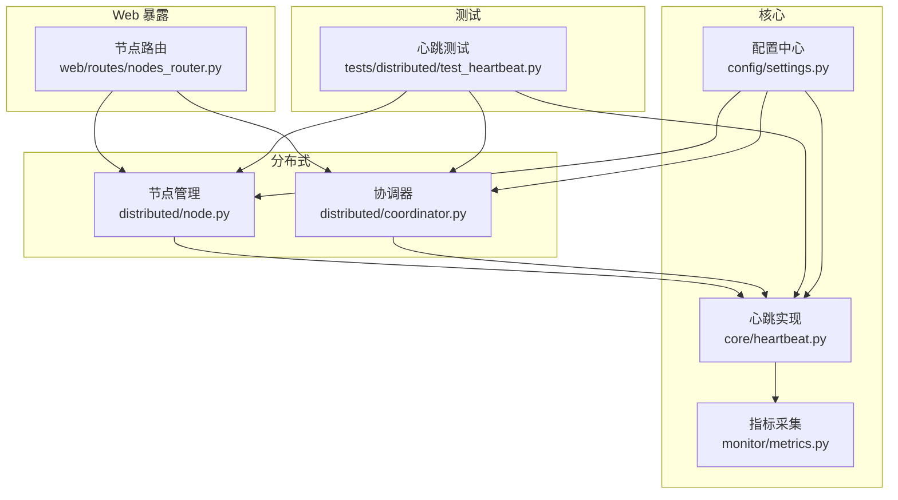
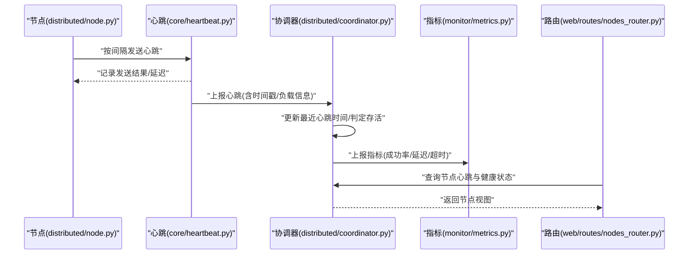
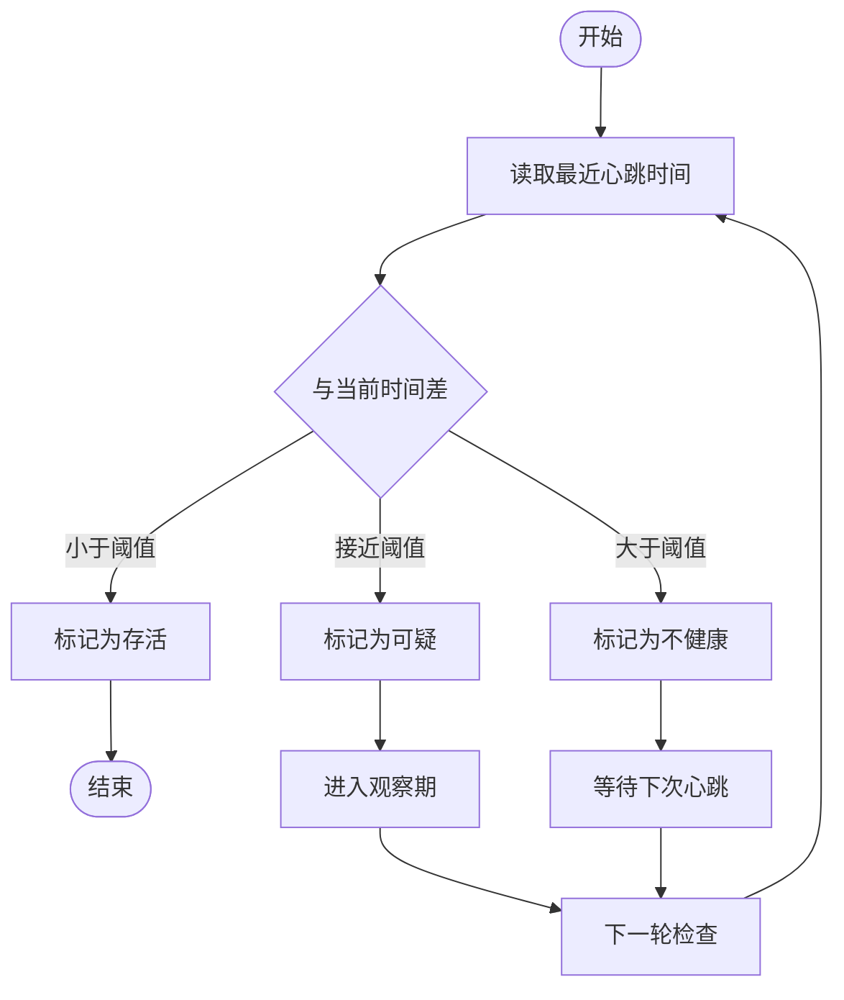
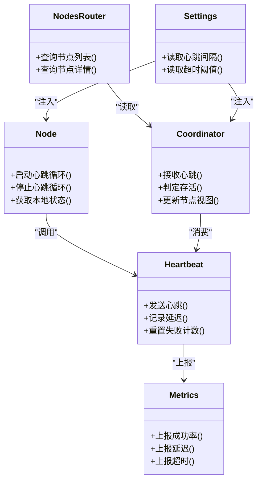

# 心跳检测与监控

<cite>
**本文引用的文件**   
- [src/neotask/core/heartbeat.py](file://src/neotask/core/heartbeat.py)
- [src/neotask/distributed/node.py](file://src/neotask/distributed/node.py)
- [src/neotask/distributed/coordinator.py](file://src/neotask/distributed/coordinator.py)
- [src/neotask/config/settings.py](file://src/neotask/config/settings.py)
- [src/neotask/monitor/metrics.py](file://src/neotask/monitor/metrics.py)
- [src/neotask/web/routes/nodes_router.py](file://src/neotask/web/routes/nodes_router.py)
- [tests/distributed/test_heartbeat.py](file://tests/distributed/test_heartbeat.py)
</cite>

## 目录
1. [简介](#简介)
2. [项目结构](#项目结构)
3. [核心组件](#核心组件)
4. [架构总览](#架构总览)
5. [详细组件分析](#详细组件分析)
6. [依赖关系分析](#依赖关系分析)
7. [性能考量](#性能考量)
8. [故障排查指南](#故障排查指南)
9. [结论](#结论)
10. [附录](#附录)

## 简介
本文件围绕任务调度管理器中的“心跳检测与监控”机制，系统性阐述其设计与实现。内容涵盖：
- 心跳消息格式、发送频率与超时阈值配置
- 节点存活状态判断逻辑与故障检测算法
- 心跳数据的收集、统计与分析方法
- 心跳异常处理策略与告警机制
- 监控配置示例与性能调优建议
- 对系统性能的影响分析与优化方案

## 项目结构
心跳相关能力主要分布在以下模块：
- 核心心跳实现：core/heartbeat.py
- 分布式节点与协调器：distributed/node.py、distributed/coordinator.py
- 配置中心：config/settings.py
- 指标采集与上报：monitor/metrics.py
- Web 暴露接口：web/routes/nodes_router.py
- 单元测试：tests/distributed/test_heartbeat.py

图表来源
- [src/neotask/core/heartbeat.py](file://src/neotask/core/heartbeat.py)
- [src/neotask/distributed/node.py](file://src/neotask/distributed/node.py)
- [src/neotask/distributed/coordinator.py](file://src/neotask/distributed/coordinator.py)
- [src/neotask/config/settings.py](file://src/neotask/config/settings.py)
- [src/neotask/monitor/metrics.py](file://src/neotask/monitor/metrics.py)
- [src/neotask/web/routes/nodes_router.py](file://src/neotask/web/routes/nodes_router.py)
- [tests/distributed/test_heartbeat.py](file://tests/distributed/test_heartbeat.py)

章节来源
- [src/neotask/core/heartbeat.py](file://src/neotask/core/heartbeat.py)
- [src/neotask/distributed/node.py](file://src/neotask/distributed/node.py)
- [src/neotask/distributed/coordinator.py](file://src/neotask/distributed/coordinator.py)
- [src/neotask/config/settings.py](file://src/neotask/config/settings.py)
- [src/neotask/monitor/metrics.py](file://src/neotask/monitor/metrics.py)
- [src/neotask/web/routes/nodes_router.py](file://src/neotask/web/routes/nodes_router.py)
- [tests/distributed/test_heartbeat.py](file://tests/distributed/test_heartbeat.py)

## 核心组件
- 心跳实现（core/heartbeat.py）
  - 负责周期性发送心跳、维护本地最近一次心跳时间戳、计算延迟与失败次数等基础指标。
  - 提供可配置的发送间隔与超时阈值，支持在节点启动时初始化并在生命周期结束时清理资源。
- 节点管理（distributed/node.py）
  - 封装节点身份、角色与运行上下文，集成心跳发送与接收逻辑，维护节点存活状态机。
  - 将心跳事件与节点健康状态联动，触发恢复或降级动作。
- 协调器（distributed/coordinator.py）
  - 集中式视角的心跳观测者，聚合各节点心跳数据，执行超时判定与故障检测，维护全局节点视图。
- 配置中心（config/settings.py）
  - 统一加载心跳相关参数：发送间隔、超时阈值、重试策略、采样窗口等。
- 指标采集（monitor/metrics.py）
  - 采集并导出心跳相关指标（如发送成功率、平均延迟、超时次数），供外部监控系统拉取。
- Web 路由（web/routes/nodes_router.py）
  - 对外暴露节点心跳与健康状态的查询接口，便于运维查看与诊断。
- 测试（tests/distributed/test_heartbeat.py）
  - 覆盖心跳发送、超时判定、状态迁移与异常场景，保障行为正确性。

章节来源
- [src/neotask/core/heartbeat.py](file://src/neotask/core/heartbeat.py)
- [src/neotask/distributed/node.py](file://src/neotask/distributed/node.py)
- [src/neotask/distributed/coordinator.py](file://src/neotask/distributed/coordinator.py)
- [src/neotask/config/settings.py](file://src/neotask/config/settings.py)
- [src/neotask/monitor/metrics.py](file://src/neotask/monitor/metrics.py)
- [src/neotask/web/routes/nodes_router.py](file://src/neotask/web/routes/nodes_router.py)
- [tests/distributed/test_heartbeat.py](file://tests/distributed/test_heartbeat.py)

## 架构总览
心跳体系采用“端侧周期发送 + 集中式观测判定”的架构：
- 每个节点周期性发送心跳到协调器或共享存储；
- 协调器基于超时阈值判定节点是否存活，并更新全局节点视图；
- 指标层持续采集心跳质量指标，Web 层提供查询接口；
- 配置中心驱动所有组件的行为一致性。

图表来源
- [src/neotask/distributed/node.py](file://src/neotask/distributed/node.py)
- [src/neotask/core/heartbeat.py](file://src/neotask/core/heartbeat.py)
- [src/neotask/distributed/coordinator.py](file://src/neotask/distributed/coordinator.py)
- [src/neotask/monitor/metrics.py](file://src/neotask/monitor/metrics.py)
- [src/neotask/web/routes/nodes_router.py](file://src/neotask/web/routes/nodes_router.py)

## 详细组件分析

### 心跳消息格式与传输
- 消息字段
  - 节点标识：唯一 ID，用于区分不同实例
  - 时间戳：本地发送时间，用于计算往返延迟
  - 负载信息：可选，包含 CPU/内存/队列长度等运行时摘要
  - 版本与签名：用于兼容性与完整性校验（若启用）
- 传输通道
  - 通过协调器提供的接口写入共享存储或直接推送至协调器进程
  - 失败重试与退避策略由心跳实现内部处理
- 序列化与压缩
  - 轻量级序列化，避免过大体积影响网络吞吐
  - 在大规模集群中可考虑按需压缩

章节来源
- [src/neotask/core/heartbeat.py](file://src/neotask/core/heartbeat.py)
- [src/neotask/distributed/coordinator.py](file://src/neotask/distributed/coordinator.py)

### 发送频率与超时阈值配置
- 发送频率
  - 由配置项控制，单位通常为毫秒或秒
  - 默认值需兼顾实时性与开销，生产环境可按规模调整
- 超时阈值
  - 超过该时间未收到某节点心跳则标记为不健康
  - 通常设置为发送间隔的若干倍，以容忍抖动
- 其他参数
  - 最大连续失败次数、采样窗口大小、重试次数与退避策略

章节来源
- [src/neotask/config/settings.py](file://src/neotask/config/settings.py)
- [src/neotask/core/heartbeat.py](file://src/neotask/core/heartbeat.py)

### 节点存活状态判断与故障检测算法
- 状态机
  - 存活：最近心跳时间在阈值内
  - 可疑：接近阈值但未超，进入观察期
  - 不健康：超过阈值仍未收到心跳
- 判定逻辑
  - 基于最近一次心跳时间与当前时间的差值进行判定
  - 结合连续失败计数与滑动窗口统计，降低误判概率
- 恢复策略
  - 重新收到有效心跳后从“可疑/不健康”恢复到“存活”
  - 配合幂等去重与防抖，避免频繁状态震荡

图表来源
- [src/neotask/distributed/coordinator.py](file://src/neotask/distributed/coordinator.py)
- [src/neotask/core/heartbeat.py](file://src/neotask/core/heartbeat.py)

章节来源
- [src/neotask/distributed/coordinator.py](file://src/neotask/distributed/coordinator.py)
- [src/neotask/core/heartbeat.py](file://src/neotask/core/heartbeat.py)

### 心跳数据的收集、统计与分析
- 采集点
  - 发送成功/失败计数
  - 单次延迟（RTT）分布与分位数
  - 超时次数与连续失败次数
  - 节点状态切换频次
- 统计维度
  - 按节点、按时间窗口（滑动窗口）、按集群整体汇总
- 分析方法
  - 趋势分析：识别缓慢退化与突发异常
  - 对比分析：不同批次/版本的差异
  - 关联分析：与任务积压、GC 停顿等指标的关联

章节来源
- [src/neotask/monitor/metrics.py](file://src/neotask/monitor/metrics.py)
- [src/neotask/distributed/coordinator.py](file://src/neotask/distributed/coordinator.py)

### 心跳异常处理策略与告警机制
- 异常类型
  - 发送失败：网络抖动、目标不可达、序列化错误
  - 接收超时：节点宕机、GC 停顿、背压导致无法及时响应
  - 数据不一致：时钟漂移、重复/乱序
- 处理策略
  - 指数退避重试与熔断保护
  - 本地缓存最近一次心跳，避免瞬时抖动引发误判
  - 多副本/多路径上报提升鲁棒性（可选）
- 告警规则
  - 连续 N 次失败或延迟超过 P99 阈值触发告警
  - 节点状态长时间处于“可疑/不健康”触发升级告警
  - 与现有告警系统集成（邮件、IM、工单等）

章节来源
- [src/neotask/core/heartbeat.py](file://src/neotask/core/heartbeat.py)
- [src/neotask/distributed/coordinator.py](file://src/neotask/distributed/coordinator.py)
- [src/neotask/monitor/metrics.py](file://src/neotask/monitor/metrics.py)

### 监控配置示例与最佳实践
- 关键配置项
  - 心跳发送间隔：根据集群规模与网络状况设定
  - 超时阈值：通常为发送间隔的 2~3 倍
  - 采样窗口：用于平滑波动，避免误报
  - 重试与退避：限制重试上限，防止雪崩
- 推荐实践
  - 灰度发布时逐步缩短间隔验证稳定性
  - 使用独立线程/协程发送心跳，避免阻塞业务
  - 定期校准节点时钟，减少 RTT 误差
  - 对高价值节点设置更严格的阈值与更高频采样

章节来源
- [src/neotask/config/settings.py](file://src/neotask/config/settings.py)
- [src/neotask/core/heartbeat.py](file://src/neotask/core/heartbeat.py)

### Web 暴露与可视化
- 接口能力
  - 查询节点列表与心跳状态
  - 获取最近心跳时间与延迟统计
  - 导出历史指标快照（可选）
- 使用方式
  - 通过 REST API 拉取节点视图
  - 与前端仪表盘集成展示实时健康度

章节来源
- [src/neotask/web/routes/nodes_router.py](file://src/neotask/web/routes/nodes_router.py)

### 测试与验证
- 覆盖范围
  - 正常发送与接收流程
  - 超时与连续失败场景
  - 状态迁移与恢复
  - 并发与边界条件
- 断言要点
  - 状态机转换符合预期
  - 指标数值在合理区间
  - 异常路径无泄漏与死锁

章节来源
- [tests/distributed/test_heartbeat.py](file://tests/distributed/test_heartbeat.py)

## 依赖关系分析
心跳子系统与周边模块的耦合关系如下：
- 节点与协调器强依赖心跳实现
- 指标模块弱依赖心跳与协调器，仅消费事件与计数器
- Web 路由仅读取协调器的节点视图，不直接访问心跳细节
- 配置中心被多处引用，确保参数一致

图表来源
- [src/neotask/core/heartbeat.py](file://src/neotask/core/heartbeat.py)
- [src/neotask/distributed/node.py](file://src/neotask/distributed/node.py)
- [src/neotask/distributed/coordinator.py](file://src/neotask/distributed/coordinator.py)
- [src/neotask/monitor/metrics.py](file://src/neotask/monitor/metrics.py)
- [src/neotask/web/routes/nodes_router.py](file://src/neotask/web/routes/nodes_router.py)
- [src/neotask/config/settings.py](file://src/neotask/config/settings.py)

章节来源
- [src/neotask/core/heartbeat.py](file://src/neotask/core/heartbeat.py)
- [src/neotask/distributed/node.py](file://src/neotask/distributed/node.py)
- [src/neotask/distributed/coordinator.py](file://src/neotask/distributed/coordinator.py)
- [src/neotask/monitor/metrics.py](file://src/neotask/monitor/metrics.py)
- [src/neotask/web/routes/nodes_router.py](file://src/neotask/web/routes/nodes_router.py)
- [src/neotask/config/settings.py](file://src/neotask/config/settings.py)

## 性能考量
- 发送频率与开销
  - 高频心跳带来更低延迟感知，但增加 CPU 与网络开销
  - 建议在大规模集群中适度降低频率，并结合滑动窗口平滑
- 超时阈值与误判
  - 阈值过小易误判，过大则故障发现慢
  - 建议结合历史延迟分布动态调整
- 指标上报成本
  - 批量上报与降采样可降低外部系统压力
  - 避免在热点路径上执行昂贵操作
- 并发与锁竞争
  - 心跳读写应尽量避免全局锁，采用每节点局部状态
  - 使用无锁数据结构或细粒度锁提升吞吐

[本节为通用指导，无需源码引用]

## 故障排查指南
- 常见问题
  - 节点频繁“可疑/不健康”：检查时钟同步、GC 停顿、CPU 饱和
  - 心跳延迟突增：排查网络拥塞、下游存储/中间件抖动
  - 指标缺失：确认指标上报链路、权限与端口可达
- 定位步骤
  - 查看节点本地最近心跳时间与失败计数
  - 核对协调器收到的心跳时间序列与超时判定日志
  - 比对 Web 接口返回的节点视图与预期
- 快速修复
  - 临时放宽阈值与窗口，恢复服务后再回归严格配置
  - 重启异常节点并观察恢复曲线
  - 隔离问题节点，避免扩散

章节来源
- [src/neotask/core/heartbeat.py](file://src/neotask/core/heartbeat.py)
- [src/neotask/distributed/coordinator.py](file://src/neotask/distributed/coordinator.py)
- [src/neotask/web/routes/nodes_router.py](file://src/neotask/web/routes/nodes_router.py)

## 结论
心跳检测是分布式系统稳定性的基石。通过合理的消息格式、发送频率与超时阈值，配合健壮的状态机与指标采集，可在保证低开销的前提下实现快速故障发现与恢复。建议在生产环境中结合业务特征与集群规模持续调优，并将心跳健康纳入统一的监控与告警体系。

[本节为总结，无需源码引用]

## 附录
- 术语
  - 心跳：节点周期性上报的轻量信号，用于证明自身存活
  - 超时阈值：判定节点不健康的最大无心跳时间
  - 滑动窗口：用于统计一段时间内的指标均值与方差
- 参考
  - 单元测试用例可作为行为契约与回归基线

[本节为补充说明，无需源码引用]