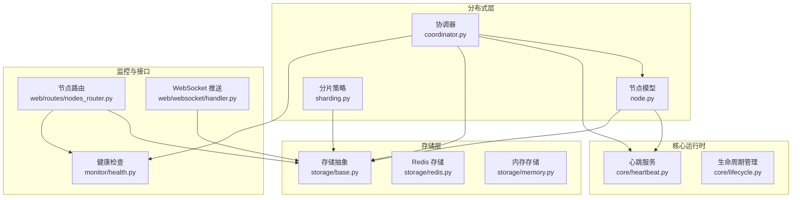
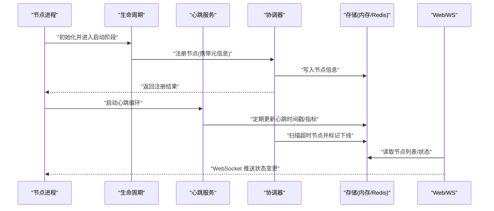
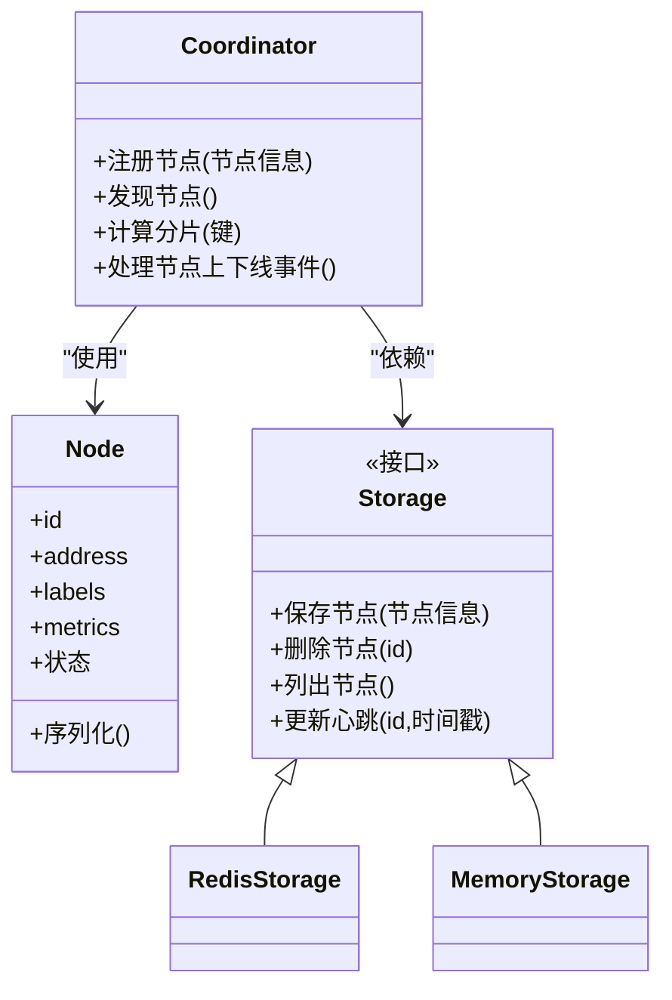
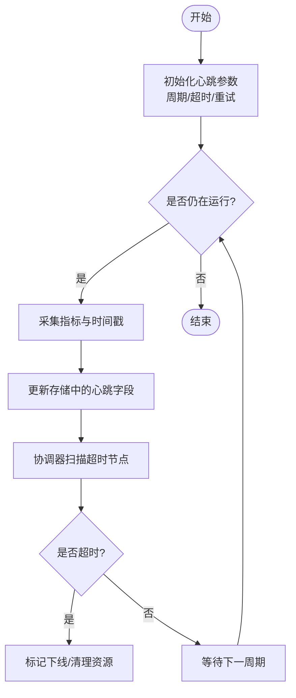
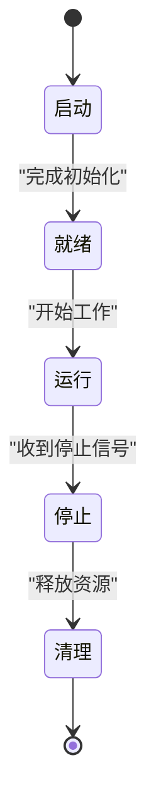
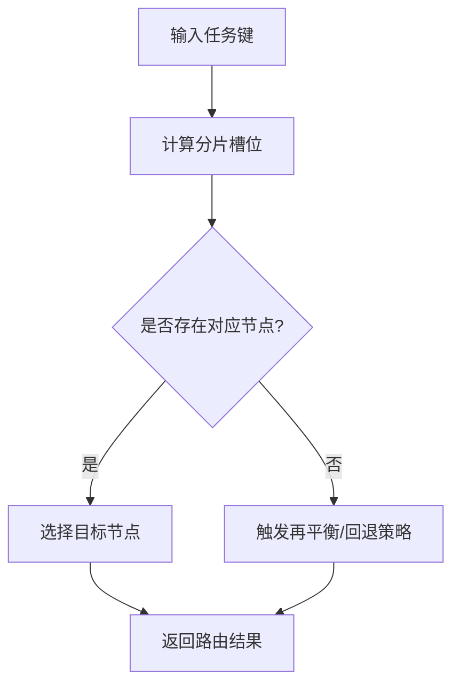
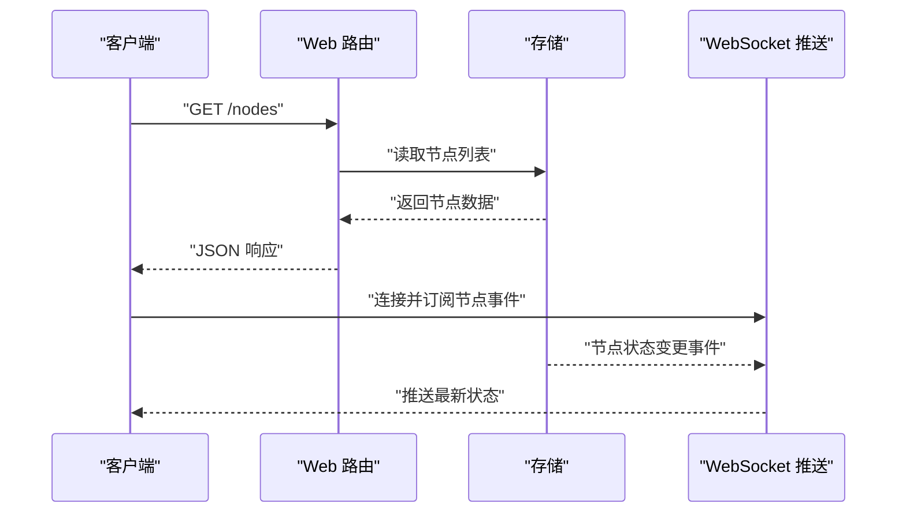
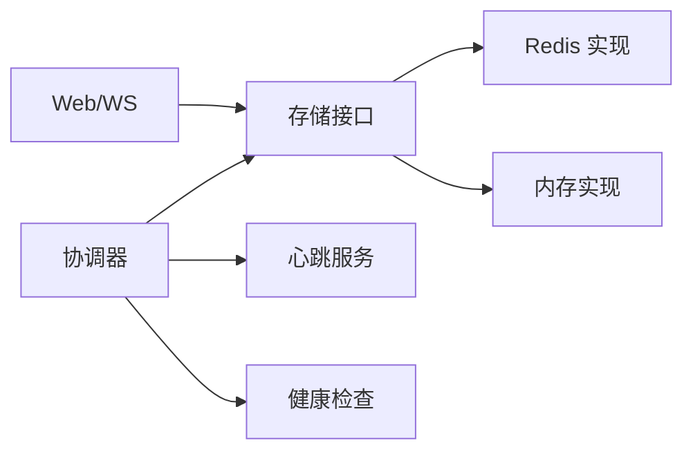

# 节点管理

<cite>
**本文引用的文件**   
- [src/neotask/distributed/coordinator.py](file://src/neotask/distributed/coordinator.py)
- [src/neotask/distributed/node.py](file://src/neotask/distributed/node.py)
- [src/neotask/distributed/sharding.py](file://src/neotask/distributed/sharding.py)
- [src/neotask/core/heartbeat.py](file://src/neotask/core/heartbeat.py)
- [src/neotask/core/lifecycle.py](file://src/neotask/core/lifecycle.py)
- [src/neotask/storage/base.py](file://src/neotask/storage/base.py)
- [src/neotask/storage/redis.py](file://src/neotask/storage/redis.py)
- [src/neotask/storage/memory.py](file://src/neotask/storage/memory.py)
- [src/neotask/monitor/health.py](file://src/neotask/monitor/health.py)
- [src/neotask/web/routes/nodes_router.py](file://src/neotask/web/routes/nodes_router.py)
- [src/neotask/web/websocket/handler.py](file://src/neotask/web/websocket/handler.py)
- [src/neotask/config/settings.py](file://src/neotask/config/settings.py)
- [tests/distributed/test_node_manager.py](file://tests/distributed/test_node_manager.py)
- [tests/distributed/test_heartbeat.py](file://tests/distributed/test_heartbeat.py)
- [tests/distributed/test_integration.py](file://tests/distributed/test_integration.py)
</cite>

## 目录
1. [简介](#简介)
2. [项目结构](#项目结构)
3. [核心组件](#核心组件)
4. [架构总览](#架构总览)
5. [详细组件分析](#详细组件分析)
6. [依赖关系分析](#依赖关系分析)
7. [性能考虑](#性能考虑)
8. [故障排查指南](#故障排查指南)
9. [结论](#结论)
10. [附录](#附录)

## 简介
本文件围绕分布式系统中的“节点管理机制”展开，聚焦于节点的注册、发现、状态监控与生命周期管理；解释节点信息的存储结构、通信协议与数据同步机制；阐述健康检查、故障检测与自动恢复的实现原理；并提供配置示例与集群部署最佳实践，以及节点间通信的性能优化与安全建议。

## 项目结构
与节点管理相关的代码主要分布在以下模块：
- 分布式协调与分片：coordinator、node、sharding
- 心跳与生命周期：core/heartbeat、core/lifecycle
- 存储抽象与实现：storage/base、storage/redis、storage/memory
- 健康监控：monitor/health
- Web 暴露与实时推送：web/routes/nodes_router、web/websocket/handler
- 配置：config/settings
- 测试用例：tests/distributed/*

图表来源
- [src/neotask/distributed/coordinator.py](file://src/neotask/distributed/coordinator.py)
- [src/neotask/distributed/node.py](file://src/neotask/distributed/node.py)
- [src/neotask/distributed/sharding.py](file://src/neotask/distributed/sharding.py)
- [src/neotask/core/heartbeat.py](file://src/neotask/core/heartbeat.py)
- [src/neotask/core/lifecycle.py](file://src/neotask/core/lifecycle.py)
- [src/neotask/storage/base.py](file://src/neotask/storage/base.py)
- [src/neotask/storage/redis.py](file://src/neotask/storage/redis.py)
- [src/neotask/storage/memory.py](file://src/neotask/storage/memory.py)
- [src/neotask/monitor/health.py](file://src/neotask/monitor/health.py)
- [src/neotask/web/routes/nodes_router.py](file://src/neotask/web/routes/nodes_router.py)
- [src/neotask/web/websocket/handler.py](file://src/neotask/web/websocket/handler.py)

章节来源
- [src/neotask/distributed/coordinator.py](file://src/neotask/distributed/coordinator.py)
- [src/neotask/distributed/node.py](file://src/neotask/distributed/node.py)
- [src/neotask/distributed/sharding.py](file://src/neotask/distributed/sharding.py)
- [src/neotask/core/heartbeat.py](file://src/neotask/core/heartbeat.py)
- [src/neotask/core/lifecycle.py](file://src/neotask/core/lifecycle.py)
- [src/neotask/storage/base.py](file://src/neotask/storage/base.py)
- [src/neotask/storage/redis.py](file://src/neotask/storage/redis.py)
- [src/neotask/storage/memory.py](file://src/neotask/storage/memory.py)
- [src/neotask/monitor/health.py](file://src/neotask/monitor/health.py)
- [src/neotask/web/routes/nodes_router.py](file://src/neotask/web/routes/nodes_router.py)
- [src/neotask/web/websocket/handler.py](file://src/neotask/web/websocket/handler.py)

## 核心组件
- 协调器（Coordinator）：负责节点注册、发现、拓扑维护、分片计算与任务路由决策，驱动心跳与健康检查流程。
- 节点（Node）：封装节点元信息（标识、地址、能力、负载等），提供本地状态与对外交互的接口。
- 心跳（Heartbeat）：周期性上报存活与资源指标，支持超时判定与失效剔除。
- 生命周期（Lifecycle）：统一管控节点启动、就绪、运行、停止与清理阶段。
- 存储（Storage）：抽象节点信息与状态持久化，提供 Redis 与内存两种实现。
- 健康监控（Health）：聚合系统级与业务级健康探针，输出健康状态。
- Web 与 WebSocket：对外暴露节点查询接口，并实时推送节点状态变更事件。

章节来源
- [src/neotask/distributed/coordinator.py](file://src/neotask/distributed/coordinator.py)
- [src/neotask/distributed/node.py](file://src/neotask/distributed/node.py)
- [src/neotask/core/heartbeat.py](file://src/neotask/core/heartbeat.py)
- [src/neotask/core/lifecycle.py](file://src/neotask/core/lifecycle.py)
- [src/neotask/storage/base.py](file://src/neotask/storage/base.py)
- [src/neotask/storage/redis.py](file://src/neotask/storage/redis.py)
- [src/neotask/storage/memory.py](file://src/neotask/storage/memory.py)
- [src/neotask/monitor/health.py](file://src/neotask/monitor/health.py)
- [src/neotask/web/routes/nodes_router.py](file://src/neotask/web/routes/nodes_router.py)
- [src/neotask/web/websocket/handler.py](file://src/neotask/web/websocket/handler.py)

## 架构总览
下图展示了节点从启动到加入集群、持续心跳、被监控与发现的全链路流程。

图表来源
- [src/neotask/distributed/coordinator.py](file://src/neotask/distributed/coordinator.py)
- [src/neotask/core/lifecycle.py](file://src/neotask/core/lifecycle.py)
- [src/neotask/core/heartbeat.py](file://src/neotask/core/heartbeat.py)
- [src/neotask/storage/base.py](file://src/neotask/storage/base.py)
- [src/neotask/storage/redis.py](file://src/neotask/storage/redis.py)
- [src/neotask/storage/memory.py](file://src/neotask/storage/memory.py)
- [src/neotask/web/routes/nodes_router.py](file://src/neotask/web/routes/nodes_router.py)
- [src/neotask/web/websocket/handler.py](file://src/neotask/web/websocket/handler.py)

## 详细组件分析

### 节点注册与发现
- 注册流程：节点在生命周期启动阶段向协调器发起注册，携带唯一标识、网络地址、能力标签与初始负载等信息；协调器将节点信息写入存储，并广播新节点事件。
- 发现机制：通过存储中的节点集合进行快照式或增量式发现；协调器可基于分片策略为任务选择目标节点。
- 关键路径参考：
  - 注册入口与协调逻辑：[src/neotask/distributed/coordinator.py](file://src/neotask/distributed/coordinator.py)
  - 节点数据结构与行为：[src/neotask/distributed/node.py](file://src/neotask/distributed/node.py)
  - 存储抽象与实现：[src/neotask/storage/base.py](file://src/neotask/storage/base.py)、[src/neotask/storage/redis.py](file://src/neotask/storage/redis.py)、[src/neotask/storage/memory.py](file://src/neotask/storage/memory.py)

图表来源
- [src/neotask/distributed/coordinator.py](file://src/neotask/distributed/coordinator.py)
- [src/neotask/distributed/node.py](file://src/neotask/distributed/node.py)
- [src/neotask/storage/base.py](file://src/neotask/storage/base.py)
- [src/neotask/storage/redis.py](file://src/neotask/storage/redis.py)
- [src/neotask/storage/memory.py](file://src/neotask/storage/memory.py)

章节来源
- [src/neotask/distributed/coordinator.py](file://src/neotask/distributed/coordinator.py)
- [src/neotask/distributed/node.py](file://src/neotask/distributed/node.py)
- [src/neotask/storage/base.py](file://src/neotask/storage/base.py)
- [src/neotask/storage/redis.py](file://src/neotask/storage/redis.py)
- [src/neotask/storage/memory.py](file://src/neotask/storage/memory.py)

### 心跳与状态监控
- 心跳周期：节点按配置周期上报心跳，包含时间戳与可选指标；协调器根据超时阈值判定节点是否存活。
- 健康检查：聚合系统指标与自定义探针，形成健康状态；异常时触发告警或降级策略。
- 关键路径参考：
  - 心跳服务：[src/neotask/core/heartbeat.py](file://src/neotask/core/heartbeat.py)
  - 健康检查：[src/neotask/monitor/health.py](file://src/neotask/monitor/health.py)
  - 存储更新：[src/neotask/storage/base.py](file://src/neotask/storage/base.py)

图表来源
- [src/neotask/core/heartbeat.py](file://src/neotask/core/heartbeat.py)
- [src/neotask/storage/base.py](file://src/neotask/storage/base.py)
- [src/neotask/distributed/coordinator.py](file://src/neotask/distributed/coordinator.py)

章节来源
- [src/neotask/core/heartbeat.py](file://src/neotask/core/heartbeat.py)
- [src/neotask/monitor/health.py](file://src/neotask/monitor/health.py)
- [src/neotask/storage/base.py](file://src/neotask/storage/base.py)
- [src/neotask/distributed/coordinator.py](file://src/neotask/distributed/coordinator.py)

### 生命周期管理
- 阶段划分：启动、就绪、运行、停止、清理；各阶段钩子用于执行必要的前置/后置逻辑。
- 退出保障：优雅停机确保未完成的心跳与任务收尾，避免脏数据与不一致。
- 关键路径参考：
  - 生命周期框架：[src/neotask/core/lifecycle.py](file://src/neotask/core/lifecycle.py)

图表来源
- [src/neotask/core/lifecycle.py](file://src/neotask/core/lifecycle.py)

章节来源
- [src/neotask/core/lifecycle.py](file://src/neotask/core/lifecycle.py)

### 分片与路由
- 分片策略：基于键值对进行一致性哈希或范围分片，保证任务均匀分布与稳定路由。
- 动态调整：节点上下线时重新计算分片映射，尽量减少迁移成本。
- 关键路径参考：
  - 分片实现：[src/neotask/distributed/sharding.py](file://src/neotask/distributed/sharding.py)
  - 协调器调用：[src/neotask/distributed/coordinator.py](file://src/neotask/distributed/coordinator.py)

图表来源
- [src/neotask/distributed/sharding.py](file://src/neotask/distributed/sharding.py)
- [src/neotask/distributed/coordinator.py](file://src/neotask/distributed/coordinator.py)

章节来源
- [src/neotask/distributed/sharding.py](file://src/neotask/distributed/sharding.py)
- [src/neotask/distributed/coordinator.py](file://src/neotask/distributed/coordinator.py)

### Web 与实时推送
- REST 接口：提供节点列表、详情与健康状态查询。
- WebSocket：订阅节点状态变更事件，便于前端实时展示。
- 关键路径参考：
  - 节点路由：[src/neotask/web/routes/nodes_router.py](file://src/neotask/web/routes/nodes_router.py)
  - WebSocket 处理器：[src/neotask/web/websocket/handler.py](file://src/neotask/web/websocket/handler.py)

图表来源
- [src/neotask/web/routes/nodes_router.py](file://src/neotask/web/routes/nodes_router.py)
- [src/neotask/web/websocket/handler.py](file://src/neotask/web/websocket/handler.py)
- [src/neotask/storage/base.py](file://src/neotask/storage/base.py)

章节来源
- [src/neotask/web/routes/nodes_router.py](file://src/neotask/web/routes/nodes_router.py)
- [src/neotask/web/websocket/handler.py](file://src/neotask/web/websocket/handler.py)

## 依赖关系分析
- 低耦合高内聚：协调器依赖存储抽象，屏蔽底层差异；节点与心跳解耦，便于替换实现。
- 外部依赖：Redis 作为强一致存储提升跨进程可见性；内存存储适合单机调试。
- 潜在环依赖：应避免协调器直接反向依赖具体存储实现，保持接口边界清晰。

图表来源
- [src/neotask/distributed/coordinator.py](file://src/neotask/distributed/coordinator.py)
- [src/neotask/storage/base.py](file://src/neotask/storage/base.py)
- [src/neotask/storage/redis.py](file://src/neotask/storage/redis.py)
- [src/neotask/storage/memory.py](file://src/neotask/storage/memory.py)
- [src/neotask/core/heartbeat.py](file://src/neotask/core/heartbeat.py)
- [src/neotask/monitor/health.py](file://src/neotask/monitor/health.py)
- [src/neotask/web/routes/nodes_router.py](file://src/neotask/web/routes/nodes_router.py)
- [src/neotask/web/websocket/handler.py](file://src/neotask/web/websocket/handler.py)

章节来源
- [src/neotask/distributed/coordinator.py](file://src/neotask/distributed/coordinator.py)
- [src/neotask/storage/base.py](file://src/neotask/storage/base.py)
- [src/neotask/storage/redis.py](file://src/neotask/storage/redis.py)
- [src/neotask/storage/memory.py](file://src/neotask/storage/memory.py)
- [src/neotask/core/heartbeat.py](file://src/neotask/core/heartbeat.py)
- [src/neotask/monitor/health.py](file://src/neotask/monitor/health.py)
- [src/neotask/web/routes/nodes_router.py](file://src/neotask/web/routes/nodes_router.py)
- [src/neotask/web/websocket/handler.py](file://src/neotask/web/websocket/handler.py)

## 性能考虑
- 心跳频率与超时：合理设置心跳间隔与超时阈值，降低存储压力同时保证快速故障检测。
- 批量更新与去抖：合并高频指标上报，减少写放大。
- 存储选型：生产环境建议使用 Redis 以获得跨进程可见性与更好的并发性能；开发环境可使用内存存储。
- 分片再平衡：节点扩缩容时采用增量迁移，避免全量重算带来的抖动。
- 连接池与超时：对存储与网络调用启用连接池与合理的超时/重试策略。

[本节为通用指导，不直接分析具体文件]

## 故障排查指南
- 节点无法注册：检查存储连通性与权限、节点 ID 冲突、网络可达性。
- 频繁上下线：调优心跳周期与超时阈值，确认节点 CPU/内存/IO 瓶颈。
- 分片不均：检查分片键分布与节点能力标签，必要时引入权重或亲和性策略。
- Web/WS 无更新：确认事件发布链路是否正常，存储是否被正确更新。
- 参考测试用例定位问题：
  - 节点管理器集成测试：[tests/distributed/test_node_manager.py](file://tests/distributed/test_node_manager.py)
  - 心跳相关测试：[tests/distributed/test_heartbeat.py](file://tests/distributed/test_heartbeat.py)
  - 端到端集成测试：[tests/distributed/test_integration.py](file://tests/distributed/test_integration.py)

章节来源
- [tests/distributed/test_node_manager.py](file://tests/distributed/test_node_manager.py)
- [tests/distributed/test_heartbeat.py](file://tests/distributed/test_heartbeat.py)
- [tests/distributed/test_integration.py](file://tests/distributed/test_integration.py)

## 结论
该节点管理机制以协调器为核心，结合心跳与健康检查、统一的存储抽象与 Web/WS 接口，实现了可靠的节点注册、发现、监控与生命周期管理。通过分片与路由策略支撑任务分配，配合合理的配置与部署实践，可在多节点环境下获得良好的可用性与扩展性。

## 附录

### 节点配置项（示例）
以下为常见配置项说明，实际键名以配置文件为准：
- 节点标识：用于区分不同节点实例的唯一 ID
- 网络地址：节点对外暴露的地址与端口
- 能力标签：描述节点支持的类型或特性
- 心跳间隔：心跳上报周期（毫秒）
- 心跳超时：判定节点失效的阈值（毫秒）
- 存储后端：内存或 Redis
- Redis 连接：主机、端口、数据库索引、密码等
- Web 服务：监听地址与端口
- 日志级别：控制台与文件输出等级

章节来源
- [src/neotask/config/settings.py](file://src/neotask/config/settings.py)

### 集群部署最佳实践
- 使用 Redis 作为共享存储，确保跨进程可见性与一致性
- 为每个节点分配独立 ID，避免冲突
- 合理设置心跳与超时，兼顾灵敏度与稳定性
- 对 Web 与 WS 接口启用鉴权与访问控制
- 监控与告警：关注节点数、心跳失败率、分片再平衡次数
- 灰度扩缩容：逐步增加节点，观察分片迁移与任务吞吐变化

[本节为通用指导，不直接分析具体文件]