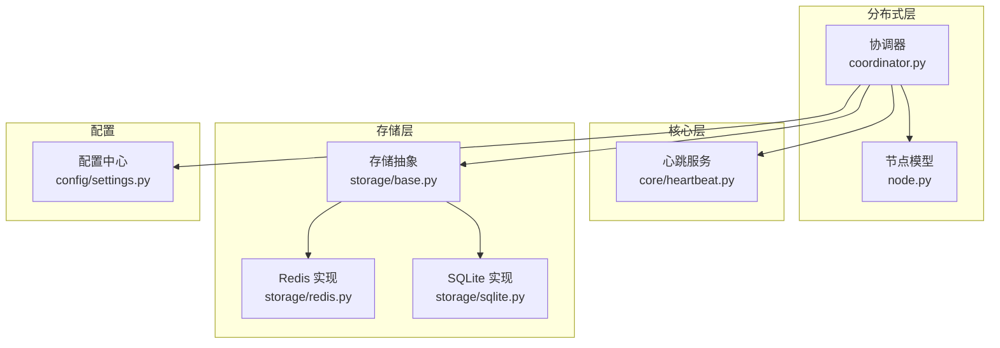
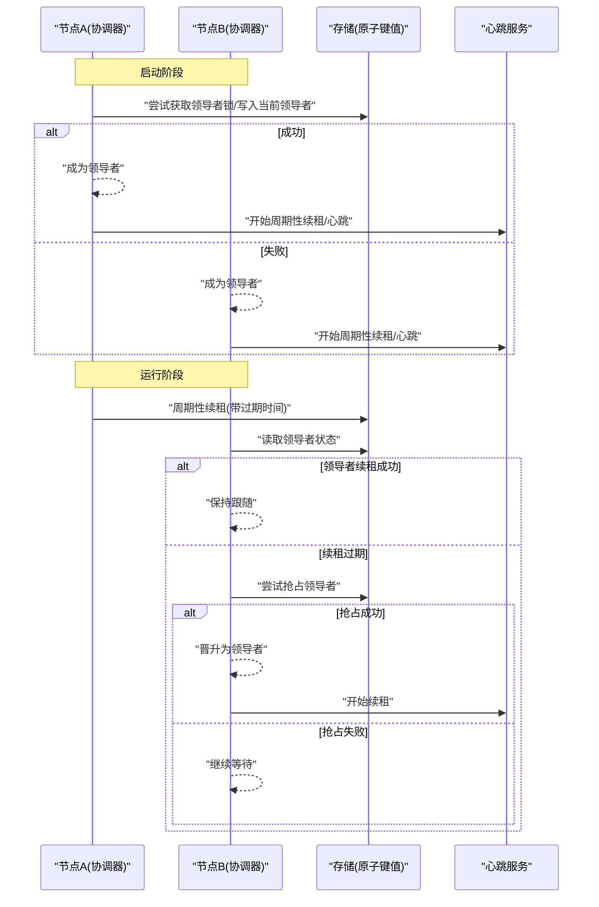
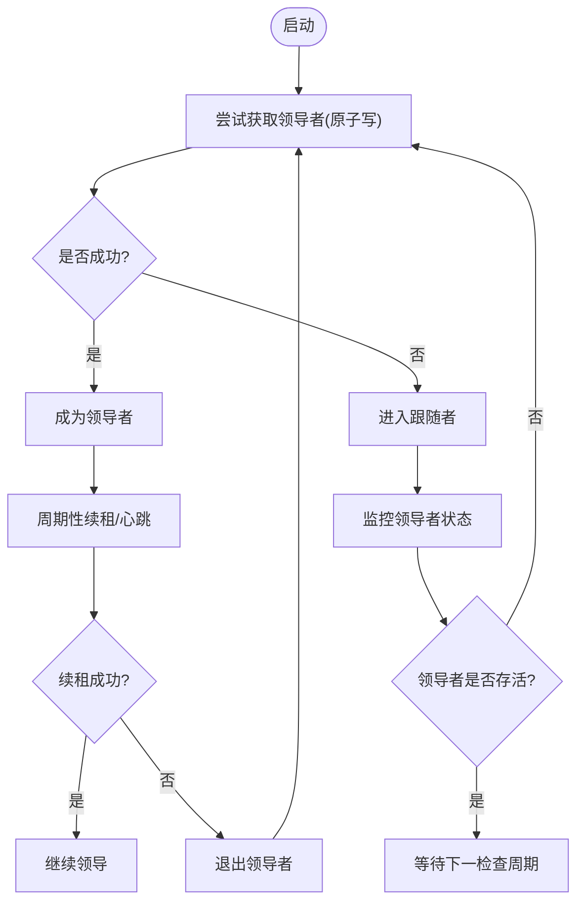
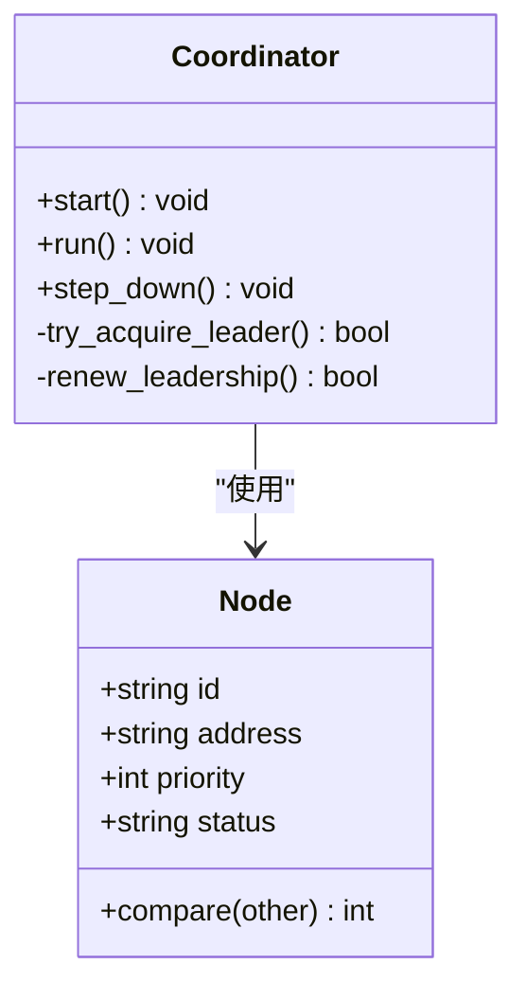
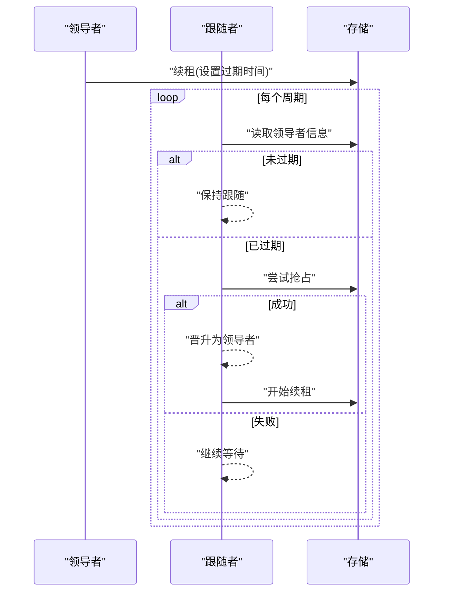
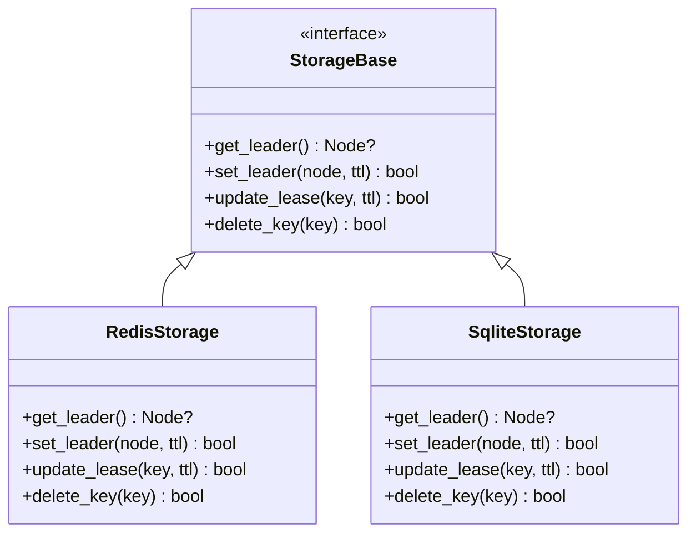
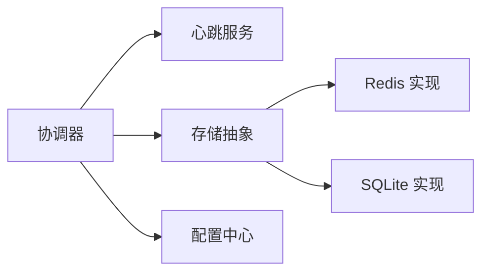

# 领导者选举

<cite>
**本文引用的文件**   
- [src/neotask/distributed/coordinator.py](file://src/neotask/distributed/coordinator.py)
- [src/neotask/distributed/node.py](file://src/neotask/distributed/node.py)
- [src/neotask/core/heartbeat.py](file://src/neotask/core/heartbeat.py)
- [src/neotask/storage/base.py](file://src/neotask/storage/base.py)
- [src/neotask/storage/redis.py](file://src/neotask/storage/redis.py)
- [src/neotask/storage/sqlite.py](file://src/neotask/storage/sqlite.py)
- [src/neotask/config/settings.py](file://src/neotask/config/settings.py)
- [tests/distributed/test_elector.py](file://tests/distributed/test_elector.py)
- [tests/distributed/test_heartbeat.py](file://tests/distributed/test_heartbeat.py)
- [tests/distributed/test_integration.py](file://tests/distributed/test_integration.py)
</cite>

## 目录
1. [简介](#简介)
2. [项目结构](#项目结构)
3. [核心组件](#核心组件)
4. [架构总览](#架构总览)
5. [详细组件分析](#详细组件分析)
6. [依赖关系分析](#依赖关系分析)
7. [性能考量](#性能考量)
8. [故障排查指南](#故障排查指南)
9. [结论](#结论)
10. [附录](#附录)

## 简介
本文件围绕分布式环境下的领导者选举机制，结合代码库中的协调器、节点管理、心跳与存储抽象等模块，系统性阐述：
- 候选节点的产生、投票与领导者确认流程
- 领导者故障转移与脑裂预防
- 网络分区处理与一致性保证
- 选举配置参数与故障恢复实践
- 选举性能分析与容量规划建议

说明：本项目未直接实现 Raft 或 ZAB 协议，而是基于可插拔的持久化存储（如 Redis）与心跳检测构建的轻量级选举与协调机制。其设计目标是在多进程/多实例环境下提供单点领导能力，并支持快速故障转移与高可用。

## 项目结构
与选举相关的核心位置如下：
- 分布式协调与节点管理：distributed 包
- 心跳与存活探测：core.heartbeat
- 存储抽象与具体实现：storage.*
- 配置项：config.settings
- 相关测试：tests/distributed/*

图表来源
- [src/neotask/distributed/coordinator.py](file://src/neotask/distributed/coordinator.py)
- [src/neotask/distributed/node.py](file://src/neotask/distributed/node.py)
- [src/neotask/core/heartbeat.py](file://src/neotask/core/heartbeat.py)
- [src/neotask/storage/base.py](file://src/neotask/storage/base.py)
- [src/neotask/storage/redis.py](file://src/neotask/storage/redis.py)
- [src/neotask/storage/sqlite.py](file://src/neotask/storage/sqlite.py)
- [src/neotask/config/settings.py](file://src/neotask/config/settings.py)

章节来源
- [src/neotask/distributed/coordinator.py](file://src/neotask/distributed/coordinator.py)
- [src/neotask/distributed/node.py](file://src/neotask/distributed/node.py)
- [src/neotask/core/heartbeat.py](file://src/neotask/core/heartbeat.py)
- [src/neotask/storage/base.py](file://src/neotask/storage/base.py)
- [src/neotask/storage/redis.py](file://src/neotask/storage/redis.py)
- [src/neotask/storage/sqlite.py](file://src/neotask/storage/sqlite.py)
- [src/neotask/config/settings.py](file://src/neotask/config/settings.py)

## 核心组件
- 协调器（Coordinator）
  - 职责：维护集群成员视图、发起/参与选举、处理领导者变更事件、与存储交互以持久化元数据。
  - 关键行为：启动时注册自身、周期性心跳、在检测到领导者不可用时触发新一轮选举、将新领导者写入存储并发布事件。
- 节点（Node）
  - 职责：描述节点身份、状态、优先级等元信息；用于比较与排序候选者。
- 心跳（Heartbeat）
  - 职责：周期性上报存活信号；其他节点据此判断领导者是否存活。
- 存储抽象（Storage Base）
  - 职责：定义选举元数据的读写接口（如当前领导者、任期、节点列表等）。
- 存储实现（Redis/SQLite）
  - 职责：提供原子性操作（如 CAS/SETNX）以实现无冲突的领导者抢占与续租。
- 配置（Settings）
  - 职责：集中管理选举超时、心跳间隔、重试策略等可调参数。

章节来源
- [src/neotask/distributed/coordinator.py](file://src/neotask/distributed/coordinator.py)
- [src/neotask/distributed/node.py](file://src/neotask/distributed/node.py)
- [src/neotask/core/heartbeat.py](file://src/neotask/core/heartbeat.py)
- [src/neotask/storage/base.py](file://src/neotask/storage/base.py)
- [src/neotask/storage/redis.py](file://src/neotask/storage/redis.py)
- [src/neotask/storage/sqlite.py](file://src/neotask/storage/sqlite.py)
- [src/neotask/config/settings.py](file://src/neotask/config/settings.py)

## 架构总览
整体采用“协调器 + 心跳 + 可插拔存储”的轻量选举方案。协调器通过存储提供的原子操作完成领导者抢占与续租，心跳负责维持领导者的活跃性，其他节点依据心跳与存储状态进行决策。

图表来源
- [src/neotask/distributed/coordinator.py](file://src/neotask/distributed/coordinator.py)
- [src/neotask/core/heartbeat.py](file://src/neotask/core/heartbeat.py)
- [src/neotask/storage/base.py](file://src/neotask/storage/base.py)
- [src/neotask/storage/redis.py](file://src/neotask/storage/redis.py)

## 详细组件分析

### 协调器与选举流程
- 候选产生
  - 节点启动后向存储发起“领导者抢占”，若成功则进入领导者角色；否则进入跟随者状态并监听变化。
- 投票与确认
  - 本实现不引入显式投票轮次，而是通过存储的原子写操作达成“唯一领导者”的共识。
- 领导者确认
  - 其他节点定期读取存储中的领导者信息，并结合心跳过期时间判定有效性。
- 故障转移
  - 当领导者续租失败或心跳过期，跟随者会尝试抢占；首个成功的节点成为新领导者。

图表来源
- [src/neotask/distributed/coordinator.py](file://src/neotask/distributed/coordinator.py)
- [src/neotask/core/heartbeat.py](file://src/neotask/core/heartbeat.py)
- [src/neotask/storage/base.py](file://src/neotask/storage/base.py)

章节来源
- [src/neotask/distributed/coordinator.py](file://src/neotask/distributed/coordinator.py)
- [src/neotask/core/heartbeat.py](file://src/neotask/core/heartbeat.py)
- [src/neotask/storage/base.py](file://src/neotask/storage/base.py)

### 节点模型与优先级
- 节点包含身份标识、状态、优先级等字段，用于在需要时对候选者进行排序或选择。
- 在简单抢占模式下，优先级可用于辅助决策（例如仅在满足条件时才发起抢占），但核心一致性仍由存储原子操作保障。

图表来源
- [src/neotask/distributed/node.py](file://src/neotask/distributed/node.py)
- [src/neotask/distributed/coordinator.py](file://src/neotask/distributed/coordinator.py)

章节来源
- [src/neotask/distributed/node.py](file://src/neotask/distributed/node.py)
- [src/neotask/distributed/coordinator.py](file://src/neotask/distributed/coordinator.py)

### 心跳与存活探测
- 领导者周期性续租，续租失败即视为失效。
- 跟随者根据心跳过期时间与存储中领导者信息判断是否需要触发新的抢占。

图表来源
- [src/neotask/core/heartbeat.py](file://src/neotask/core/heartbeat.py)
- [src/neotask/storage/base.py](file://src/neotask/storage/base.py)
- [src/neotask/storage/redis.py](file://src/neotask/storage/redis.py)

章节来源
- [src/neotask/core/heartbeat.py](file://src/neotask/core/heartbeat.py)
- [src/neotask/storage/base.py](file://src/neotask/storage/base.py)
- [src/neotask/storage/redis.py](file://src/neotask/storage/redis.py)

### 存储抽象与实现
- 存储抽象定义了领导者元数据的读写接口，确保上层逻辑与底层介质解耦。
- Redis 实现利用原子操作（如 SETNX/EXPIRE 或 Lua 脚本）实现强一致性的抢占与续租。
- SQLite 实现适用于单机/本地场景，适合测试与小型部署。

图表来源
- [src/neotask/storage/base.py](file://src/neotask/storage/base.py)
- [src/neotask/storage/redis.py](file://src/neotask/storage/redis.py)
- [src/neotask/storage/sqlite.py](file://src/neotask/storage/sqlite.py)

章节来源
- [src/neotask/storage/base.py](file://src/neotask/storage/base.py)
- [src/neotask/storage/redis.py](file://src/neotask/storage/redis.py)
- [src/neotask/storage/sqlite.py](file://src/neotask/storage/sqlite.py)

### 配置项与调优
- 典型配置项包括：
  - 心跳间隔：影响故障检测速度与网络开销的平衡
  - 领导者租约时长：决定故障转移窗口大小
  - 重试与退避策略：避免风暴与抖动
  - 存储连接池与超时：影响吞吐与稳定性
- 建议：
  - 生产环境优先使用 Redis 作为存储后端
  - 合理设置心跳与租约，使故障转移时间可控
  - 对网络不稳定环境启用指数退避与最大重试上限

章节来源
- [src/neotask/config/settings.py](file://src/neotask/config/settings.py)

## 依赖关系分析
- 协调器依赖心跳服务与存储抽象
- 存储抽象被 Redis/SQLite 实现继承
- 配置中心为各组件提供统一参数入口

图表来源
- [src/neotask/distributed/coordinator.py](file://src/neotask/distributed/coordinator.py)
- [src/neotask/core/heartbeat.py](file://src/neotask/core/heartbeat.py)
- [src/neotask/storage/base.py](file://src/neotask/storage/base.py)
- [src/neotask/storage/redis.py](file://src/neotask/storage/redis.py)
- [src/neotask/storage/sqlite.py](file://src/neotask/storage/sqlite.py)
- [src/neotask/config/settings.py](file://src/neotask/config/settings.py)

章节来源
- [src/neotask/distributed/coordinator.py](file://src/neotask/distributed/coordinator.py)
- [src/neotask/core/heartbeat.py](file://src/neotask/core/heartbeat.py)
- [src/neotask/storage/base.py](file://src/neotask/storage/base.py)
- [src/neotask/storage/redis.py](file://src/neotask/storage/redis.py)
- [src/neotask/storage/sqlite.py](file://src/neotask/storage/sqlite.py)
- [src/neotask/config/settings.py](file://src/neotask/config/settings.py)

## 性能考量
- 选举延迟
  - 主要受心跳间隔与租约时长影响；缩短两者可降低切换延迟，但会增加存储压力。
- 存储压力
  - 高频续租会导致存储 QPS 上升；可通过批量合并、延长租约或在应用层限流缓解。
- 网络分区
  - 基于“多数派”的严格一致性算法（如 Raft/ZAB）能更好处理分区；本实现依赖单一存储的原子性与可用性，需确保存储高可用。
- 容量规划
  - 预估节点规模与心跳频率，评估存储端 QPS 峰值；为 Redis 预留足够连接数与内存，必要时分片或主从+哨兵/集群。

[本节为通用指导，无需特定文件引用]

## 故障排查指南
- 常见问题
  - 频繁切换：检查心跳间隔与租约时长是否过短；观察存储延迟与错误率。
  - 无法选出领导者：检查存储连通性与权限；确认原子写是否生效。
  - 脑裂风险：确保存储具备强一致语义；避免多写路径竞争同一键。
- 定位手段
  - 查看协调器日志与指标
  - 检查存储中领导者键的状态与 TTL
  - 验证心跳续租是否按时执行
- 参考测试用例
  - 选举流程与边界条件覆盖
  - 心跳与续租行为验证
  - 集成场景下的故障恢复

章节来源
- [tests/distributed/test_elector.py](file://tests/distributed/test_elector.py)
- [tests/distributed/test_heartbeat.py](file://tests/distributed/test_heartbeat.py)
- [tests/distributed/test_integration.py](file://tests/distributed/test_integration.py)

## 结论
本项目采用“协调器 + 心跳 + 可插拔存储”的轻量选举方案，通过存储原子操作实现唯一领导者与快速故障转移。该方案易于部署与维护，适合中小规模集群与任务调度场景。对于需要严格多数派一致性与更强分区容错的场景，可在未来演进中引入 Raft/ZAB 等协议。

[本节为总结性内容，无需特定文件引用]

## 附录
- 术语
  - 领导者：承担主导职责的节点
  - 跟随者：接受领导者指令的节点
  - 租约：领导者持有的短期有效令牌，到期需续租
  - 脑裂：多个节点同时认为自己是领导者
- 最佳实践
  - 使用高可用的存储后端（如 Redis 集群）
  - 合理设置心跳与租约，兼顾切换速度与资源消耗
  - 对异常进行幂等处理，避免重复抢占导致抖动
  - 建立完善的监控与告警，关注存储延迟与选举次数

[本节为概念性内容，无需特定文件引用]