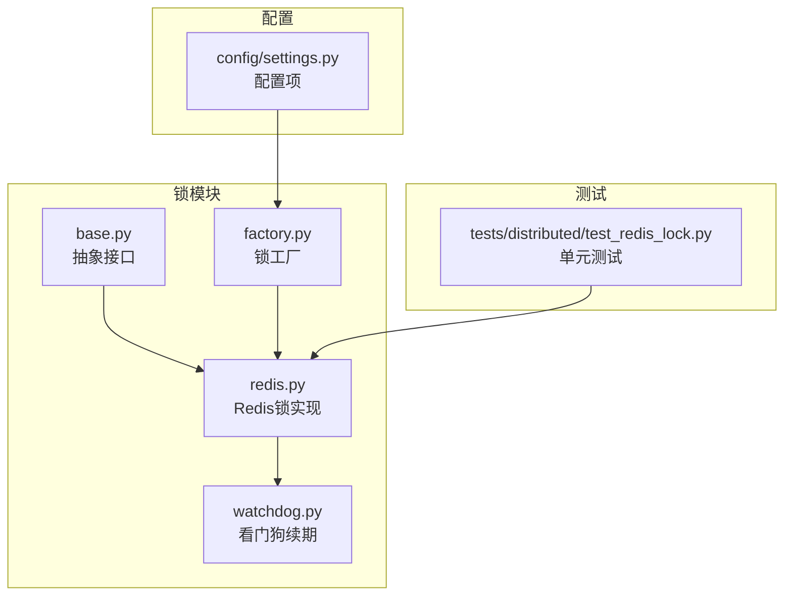
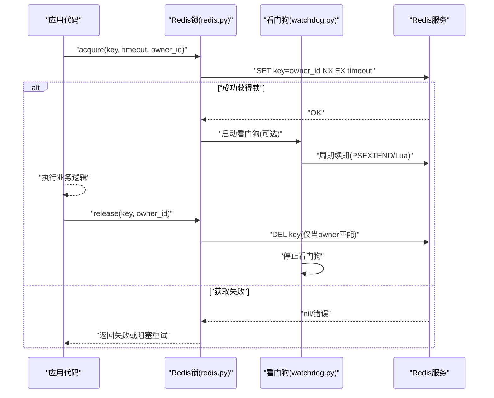
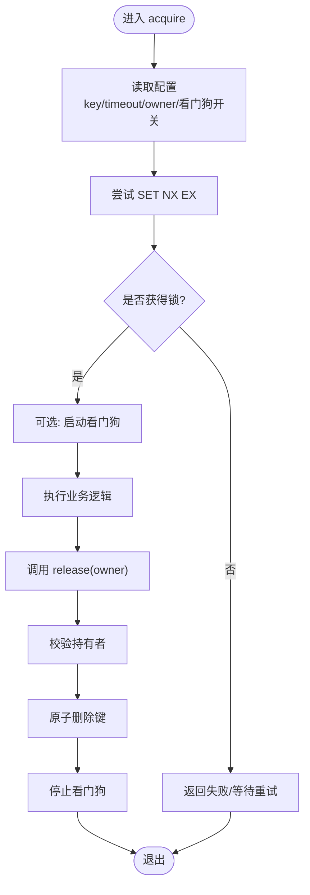
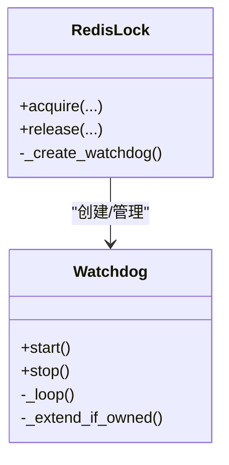
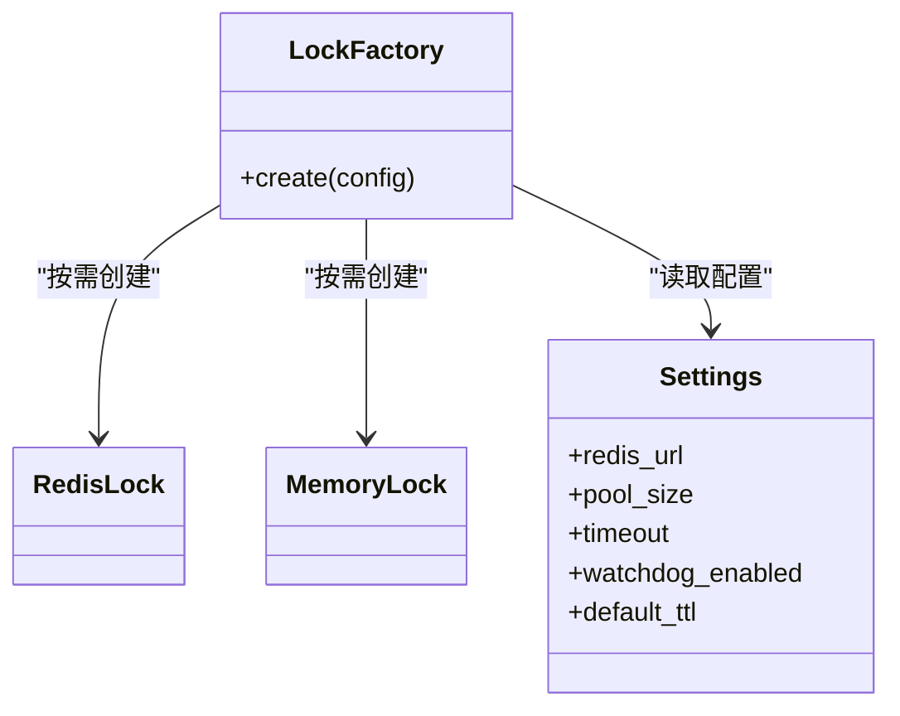
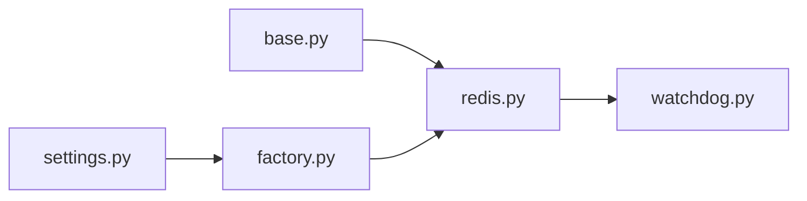

# Redis锁实现

<cite>
**本文引用的文件**   
- [src/neotask/lock/redis.py](file://src/neotask/lock/redis.py)
- [src/neotask/lock/base.py](file://src/neotask/lock/base.py)
- [src/neotask/lock/watchdog.py](file://src/neotask/lock/watchdog.py)
- [src/neotask/lock/factory.py](file://src/neotask/lock/factory.py)
- [tests/distributed/test_redis_lock.py](file://tests/distributed/test_redis_lock.py)
- [src/neotask/config/settings.py](file://src/neotask/config/settings.py)
</cite>

## 目录
1. [简介](#简介)
2. [项目结构](#项目结构)
3. [核心组件](#核心组件)
4. [架构总览](#架构总览)
5. [详细组件分析](#详细组件分析)
6. [依赖关系分析](#依赖关系分析)
7. [性能考虑](#性能考虑)
8. [故障排查指南](#故障排查指南)
9. [结论](#结论)
10. [附录](#附录)

## 简介
本文件聚焦于基于Redis的分布式锁实现，围绕以下目标展开：
- 解释基于Redis SET NX EX命令的原子性锁获取机制
- 说明锁续期、自动释放与故障恢复的处理逻辑
- 提供Redis连接配置、集群支持与性能优化策略
- 给出高可用部署方案与常见故障排查方法

## 项目结构
本项目将分布式锁能力集中在 lock 模块中，并通过工厂进行统一创建。Redis锁的具体实现在 redis.py 中，基础接口在 base.py 中定义，看门狗续期逻辑在 watchdog.py 中，工厂在 factory.py 中。测试用例位于 tests/distributed/test_redis_lock.py。

图表来源
- [src/neotask/lock/base.py](file://src/neotask/lock/base.py)
- [src/neotask/lock/redis.py](file://src/neotask/lock/redis.py)
- [src/neotask/lock/watchdog.py](file://src/neotask/lock/watchdog.py)
- [src/neotask/lock/factory.py](file://src/neotask/lock/factory.py)
- [src/neotask/config/settings.py](file://src/neotask/config/settings.py)
- [tests/distributed/test_redis_lock.py](file://tests/distributed/test_redis_lock.py)

章节来源
- [src/neotask/lock/redis.py](file://src/neotask/lock/redis.py)
- [src/neotask/lock/base.py](file://src/neotask/lock/base.py)
- [src/neotask/lock/watchdog.py](file://src/neotask/lock/watchdog.py)
- [src/neotask/lock/factory.py](file://src/neotask/lock/factory.py)
- [src/neotask/config/settings.py](file://src/neotask/config/settings.py)
- [tests/distributed/test_redis_lock.py](file://tests/distributed/test_redis_lock.py)

## 核心组件
- 抽象接口（base.py）：定义统一的加锁、解锁、上下文管理接口，供不同后端实现复用。
- Redis锁实现（redis.py）：基于Redis键值存储，使用SET NX EX等命令实现互斥；结合Lua脚本保证复杂操作的原子性；可选看门狗线程负责自动续期。
- 看门狗（watchdog.py）：后台任务周期性续期，避免业务执行时间超过锁过期时间导致提前释放。
- 锁工厂（factory.py）：根据配置选择并创建具体锁实例，屏蔽底层差异。
- 配置（settings.py）：集中管理Redis连接参数、超时、重试、看门狗开关等。
- 测试（test_redis_lock.py）：覆盖基本加解锁、并发竞争、异常路径与边界条件。

章节来源
- [src/neotask/lock/base.py](file://src/neotask/lock/base.py)
- [src/neotask/lock/redis.py](file://src/neotask/lock/redis.py)
- [src/neotask/lock/watchdog.py](file://src/neotask/lock/watchdog.py)
- [src/neotask/lock/factory.py](file://src/neotask/lock/factory.py)
- [src/neotask/config/settings.py](file://src/neotask/config/settings.py)
- [tests/distributed/test_redis_lock.py](file://tests/distributed/test_redis_lock.py)

## 架构总览
下图展示了从应用调用到Redis的完整流程，包括加锁、续期、释放与失败回退路径。

图表来源
- [src/neotask/lock/redis.py](file://src/neotask/lock/redis.py)
- [src/neotask/lock/watchdog.py](file://src/neotask/lock/watchdog.py)

## 详细组件分析

### Redis锁实现（基于SET NX EX）
- 原子性加锁
  - 使用“设置键+不存在才设置+设置过期时间”的组合命令，确保在同一原子操作中完成“存在性检查+赋值+过期”，避免竞态条件。
  - 键值通常包含唯一标识（如进程/线程ID），用于后续安全释放。
- 安全释放
  - 释放前校验当前持有者是否仍为发起方，防止误删他人持有的锁。
  - 通过Lua脚本或事务保证“校验+删除”的原子性。
- 锁续期
  - 若业务执行时间不确定或可能超过初始过期时间，可启用看门狗线程周期性延长锁的剩余TTL，直到业务结束主动释放。
  - 续期操作需再次校验持有者身份，避免跨进程续期。
- 自动释放
  - 即使未显式释放，锁也会在TTL到期后由Redis自动清理，避免死锁。
- 故障恢复
  - 网络抖动或短暂不可用时，应配合重试与指数退避策略，降低瞬时失败影响。
  - 主从切换时，建议关注一致性风险并在必要时引入哨兵或集群模式提升可用性。

图表来源
- [src/neotask/lock/redis.py](file://src/neotask/lock/redis.py)
- [src/neotask/lock/watchdog.py](file://src/neotask/lock/watchdog.py)

章节来源
- [src/neotask/lock/redis.py](file://src/neotask/lock/redis.py)
- [src/neotask/lock/watchdog.py](file://src/neotask/lock/watchdog.py)

### 看门狗续期机制
- 触发时机
  - 在成功获取锁后启动，按固定间隔轮询剩余TTL并续期。
- 续期策略
  - 每次续期前再次校验当前持有者，确保只有原持有者能续期。
  - 续期时长一般小于等于初始TTL，避免无限延长。
- 生命周期
  - 业务正常结束时主动停止看门狗；异常退出时依靠TTL自然释放。
- 资源控制
  - 限制最大续期次数或最大运行时长，防止长时间占用资源。

图表来源
- [src/neotask/lock/watchdog.py](file://src/neotask/lock/watchdog.py)
- [src/neotask/lock/redis.py](file://src/neotask/lock/redis.py)

章节来源
- [src/neotask/lock/watchdog.py](file://src/neotask/lock/watchdog.py)
- [src/neotask/lock/redis.py](file://src/neotask/lock/redis.py)

### 锁工厂与配置集成
- 工厂职责
  - 根据配置决定使用内存锁还是Redis锁，并注入连接参数、超时、重试、看门狗开关等。
- 配置要点
  - Redis地址、密码、数据库索引、连接池大小、读写超时、重试次数与退避策略、看门狗开关与续期间隔、锁默认TTL等。
- 扩展性
  - 新增锁后端只需实现基础接口并通过工厂注册即可无缝接入。

图表来源
- [src/neotask/lock/factory.py](file://src/neotask/lock/factory.py)
- [src/neotask/config/settings.py](file://src/neotask/config/settings.py)

章节来源
- [src/neotask/lock/factory.py](file://src/neotask/lock/factory.py)
- [src/neotask/config/settings.py](file://src/neotask/config/settings.py)

### 测试与验证
- 覆盖范围
  - 基本加锁/解锁、重复加锁拒绝、非持有者释放失败、TTL到期自动释放、看门狗续期行为、并发竞争场景等。
- 断言要点
  - 返回值语义、键是否存在、TTL变化、异常抛出类型与消息、看门狗启停状态等。
- 模拟与隔离
  - 可使用Mock或本地Redis容器进行端到端验证。

章节来源
- [tests/distributed/test_redis_lock.py](file://tests/distributed/test_redis_lock.py)

## 依赖关系分析
- 内部依赖
  - Redis锁依赖基础接口定义；看门狗被Redis锁创建与管理；工厂根据配置选择实现。
- 外部依赖
  - Redis客户端库（连接池、超时、重试）、可选Lua脚本引擎（用于原子释放）。
- 耦合与内聚
  - 通过抽象接口解耦上层调用与底层实现；看门狗与锁实现之间通过明确的生命周期接口交互，保持较高内聚。

图表来源
- [src/neotask/lock/base.py](file://src/neotask/lock/base.py)
- [src/neotask/lock/redis.py](file://src/neotask/lock/redis.py)
- [src/neotask/lock/watchdog.py](file://src/neotask/lock/watchdog.py)
- [src/neotask/lock/factory.py](file://src/neotask/lock/factory.py)
- [src/neotask/config/settings.py](file://src/neotask/config/settings.py)

章节来源
- [src/neotask/lock/base.py](file://src/neotask/lock/base.py)
- [src/neotask/lock/redis.py](file://src/neotask/lock/redis.py)
- [src/neotask/lock/watchdog.py](file://src/neotask/lock/watchdog.py)
- [src/neotask/lock/factory.py](file://src/neotask/lock/factory.py)
- [src/neotask/config/settings.py](file://src/neotask/config/settings.py)

## 性能考虑
- 连接与超时
  - 合理设置连接池大小与读写超时，避免连接耗尽与长尾延迟。
- 重试与退避
  - 对瞬时网络错误采用指数退避重试，减少雪崩效应。
- 锁粒度与TTL
  - 尽量缩小锁粒度，缩短临界区；合理设置TTL，兼顾安全性与吞吐。
- 批量与合并
  - 避免频繁加解锁，合并短小操作以减少Redis往返。
- 监控与指标
  - 记录加锁耗时、失败率、TTL命中率、看门狗开销等关键指标，便于容量规划与问题定位。

[本节为通用指导，不直接分析具体文件]

## 故障排查指南
- 常见问题
  - 无法获取锁：检查Redis连通性、权限、键冲突与TTL设置。
  - 锁提前释放：确认业务执行时间是否超过TTL且未开启看门狗；核对续期逻辑是否正确。
  - 误删他人锁：确认释放前持有者校验是否生效，Lua脚本或事务是否原子。
  - 看门狗不工作：检查开关配置、调度间隔、异常捕获与日志。
- 诊断步骤
  - 查看Redis键是否存在及TTL变化；比对持有者ID是否与当前进程一致。
  - 抓取加锁/释放链路日志，定位失败点与重试情况。
  - 评估网络抖动与Redis负载，必要时扩容或调整超时/重试参数。
- 回归验证
  - 使用测试用例复现问题场景，逐步缩小范围直至定位根因。

章节来源
- [tests/distributed/test_redis_lock.py](file://tests/distributed/test_redis_lock.py)
- [src/neotask/lock/redis.py](file://src/neotask/lock/redis.py)
- [src/neotask/lock/watchdog.py](file://src/neotask/lock/watchdog.py)

## 结论
本实现以SET NX EX为核心，结合Lua原子释放与可选看门狗续期，提供了安全、易用且可扩展的Redis分布式锁。通过工厂与配置化设计，可在单机与集群环境中灵活部署，并具备完善的测试覆盖与排障指引。生产环境建议结合哨兵/集群、合理的超时与重试策略以及完善的监控告警，以获得更高的可用性与稳定性。

[本节为总结性内容，不直接分析具体文件]

## 附录

### Redis连接配置与集群支持
- 连接参数
  - 地址、端口、密码、数据库索引、连接池大小、读写超时、重试次数与退避策略。
- 集群模式
  - 建议使用Redis集群或哨兵模式提升可用性；注意跨槽键分布对锁粒度的影响。
- 最佳实践
  - 为不同业务域使用不同的键前缀，避免冲突；为关键路径开启看门狗续期；为短任务关闭看门狗以降低开销。

章节来源
- [src/neotask/config/settings.py](file://src/neotask/config/settings.py)
- [src/neotask/lock/factory.py](file://src/neotask/lock/factory.py)