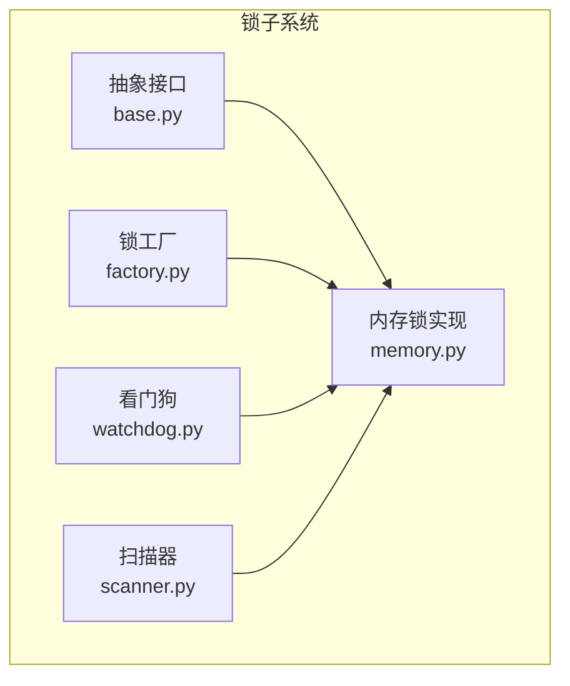
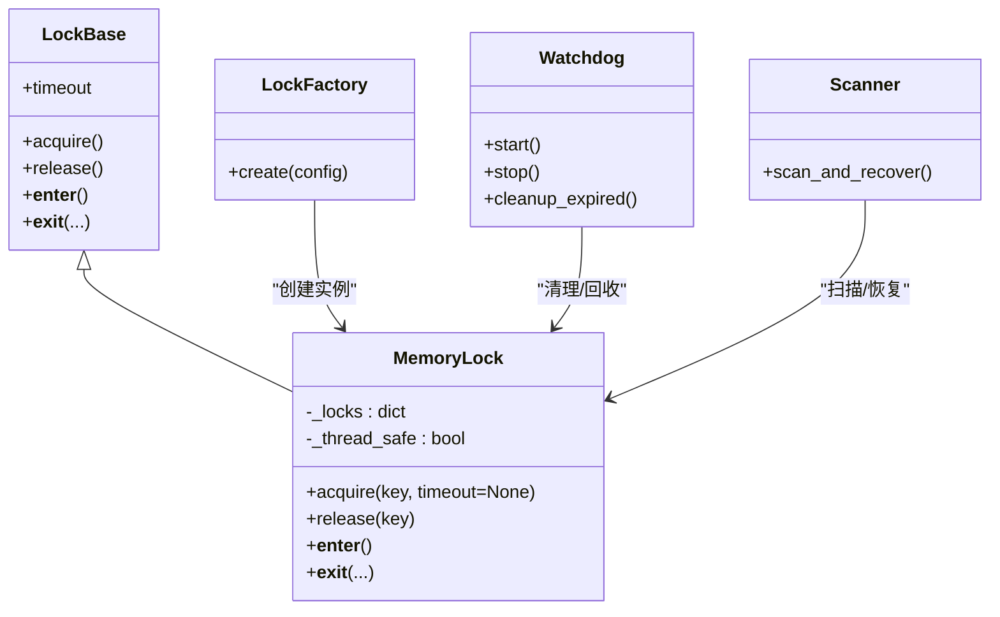
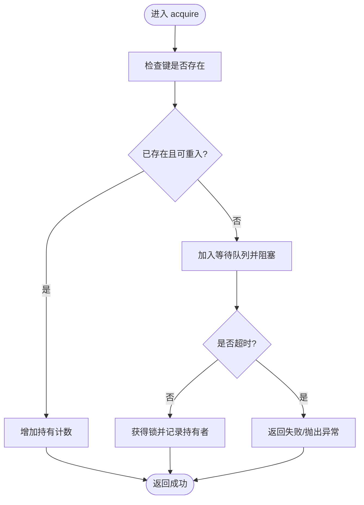
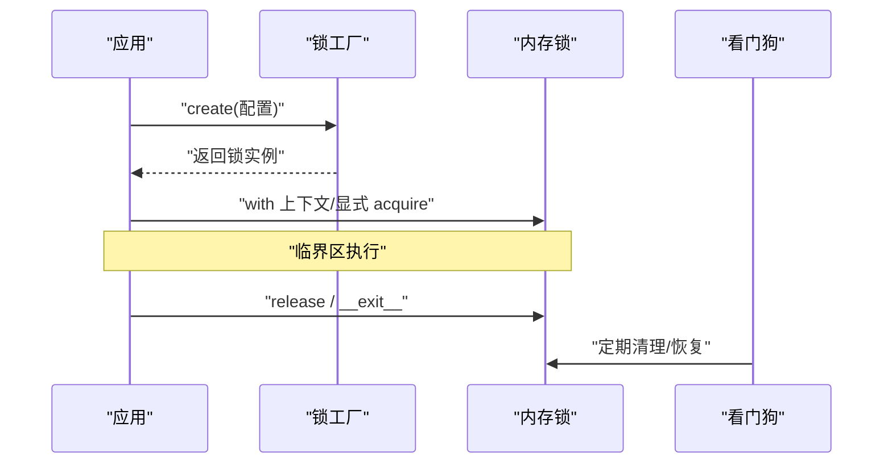
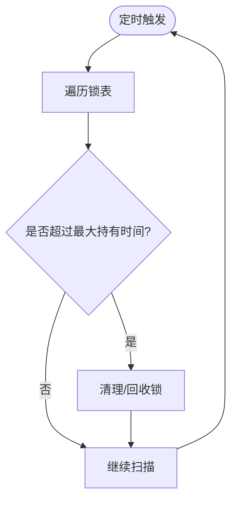
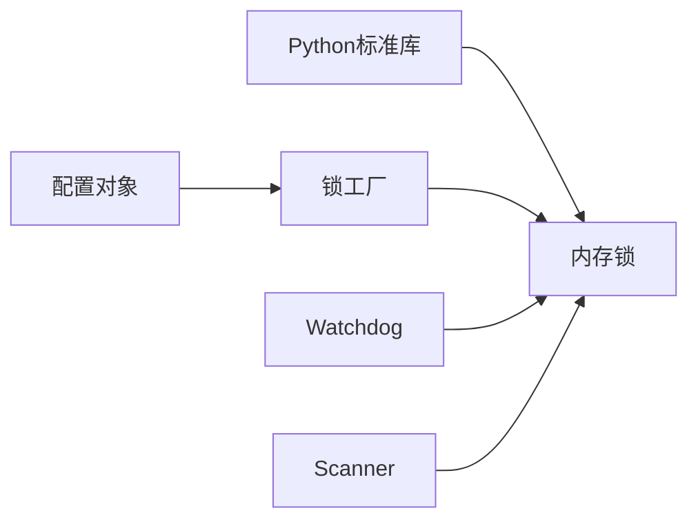

# 内存锁实现

<cite>
**本文引用的文件**   
- [src/neotask/lock/__init__.py](file://src/neotask/lock/__init__.py)
- [src/neotask/lock/base.py](file://src/neotask/lock/base.py)
- [src/neotask/lock/memory.py](file://src/neotask/lock/memory.py)
- [src/neotask/lock/factory.py](file://src/neotask/lock/factory.py)
- [src/neotask/lock/watchdog.py](file://src/neotask/lock/watchdog.py)
- [src/neotask/lock/scanner.py](file://src/neotask/lock/scanner.py)
- [tests/unit/test_locks.py](file://tests/unit/test_locks.py)
- [examples/02_context_manager.py](file://examples/02_context_manager.py)
</cite>

## 目录
1. [简介](#简介)
2. [项目结构](#项目结构)
3. [核心组件](#核心组件)
4. [架构总览](#架构总览)
5. [详细组件分析](#详细组件分析)
6. [依赖关系分析](#依赖关系分析)
7. [性能与适用性](#性能与适用性)
8. [配置与调优](#配置与调优)
9. [使用示例](#使用示例)
10. [故障排查](#故障排查)
11. [结论](#结论)

## 简介
本章节聚焦于“内存锁”的实现原理、使用场景、性能特点、限制条件以及配置与调优。该内存锁基于Python字典与线程安全原语构建，提供进程内互斥能力，适用于单进程多线程或多协程并发下的临界区保护。文档同时给出典型用法与常见问题解决方案，帮助读者在任务调度系统中正确、高效地使用内存锁。

## 项目结构
与内存锁相关的代码位于 lock 子包中，包含抽象接口、具体实现、工厂方法、看门狗与扫描器等模块：
- 抽象接口：定义统一的加锁/解锁语义
- 内存实现：基于字典与线程安全原语的进程内锁
- 工厂：根据配置选择不同锁后端（如内存或分布式）
- 看门狗/扫描器：用于资源清理与异常恢复

图表来源
- [src/neotask/lock/base.py](file://src/neotask/lock/base.py)
- [src/neotask/lock/memory.py](file://src/neotask/lock/memory.py)
- [src/neotask/lock/factory.py](file://src/neotask/lock/factory.py)
- [src/neotask/lock/watchdog.py](file://src/neotask/lock/watchdog.py)
- [src/neotask/lock/scanner.py](file://src/neotask/lock/scanner.py)

章节来源
- [src/neotask/lock/__init__.py](file://src/neotask/lock/__init__.py)
- [src/neotask/lock/base.py](file://src/neotask/lock/base.py)
- [src/neotask/lock/memory.py](file://src/neotask/lock/memory.py)
- [src/neotask/lock/factory.py](file://src/neotask/lock/factory.py)
- [src/neotask/lock/watchdog.py](file://src/neotask/lock/watchdog.py)
- [src/neotask/lock/scanner.py](file://src/neotask/lock/scanner.py)

## 核心组件
- 抽象接口：统一加锁/解锁、上下文管理、超时等能力
- 内存锁：基于字典维护锁状态，结合线程安全原语保证互斥
- 工厂：按配置返回对应锁实例（内存/分布式）
- 看门狗/扫描器：辅助清理过期锁、检测死锁风险

章节来源
- [src/neotask/lock/base.py](file://src/neotask/lock/base.py)
- [src/neotask/lock/memory.py](file://src/neotask/lock/memory.py)
- [src/neotask/lock/factory.py](file://src/neotask/lock/factory.py)
- [src/neotask/lock/watchdog.py](file://src/neotask/lock/watchdog.py)
- [src/neotask/lock/scanner.py](file://src/neotask/lock/scanner.py)

## 架构总览
下图展示内存锁在系统中的位置与交互关系：业务通过工厂获取锁实例，使用上下文管理器或显式调用进行加锁；看门狗与扫描器负责生命周期管理与异常恢复。

图表来源
- [src/neotask/lock/base.py](file://src/neotask/lock/base.py)
- [src/neotask/lock/memory.py](file://src/neotask/lock/memory.py)
- [src/neotask/lock/factory.py](file://src/neotask/lock/factory.py)
- [src/neotask/lock/watchdog.py](file://src/neotask/lock/watchdog.py)
- [src/neotask/lock/scanner.py](file://src/neotask/lock/scanner.py)

## 详细组件分析

### 内存锁实现原理
- 数据结构
  - 使用字典维护键到锁状态的映射，支持多键独立互斥
  - 每个键的锁状态包含持有者标识、计数、等待队列等元信息
- 线程安全
  - 利用线程安全原语对共享状态进行保护，避免竞态条件
  - 支持可重入：同一持有者可多次获取同一把锁
- 超时与阻塞
  - 支持带超时的获取操作，防止无限等待
  - 非阻塞模式可用于快速失败路径
- 上下文管理
  - 提供 with 语句支持，确保异常路径下也能释放锁
- 生命周期
  - 配合看门狗与扫描器，处理长时间未释放的锁、异常退出后的残留状态

图表来源
- [src/neotask/lock/memory.py](file://src/neotask/lock/memory.py)

章节来源
- [src/neotask/lock/memory.py](file://src/neotask/lock/memory.py)

### 工厂与集成点
- 工厂根据配置决定返回内存锁或分布式锁
- 上层组件通过统一接口获取锁实例，屏蔽底层差异
- 便于在单机与集群环境间切换

图表来源
- [src/neotask/lock/factory.py](file://src/neotask/lock/factory.py)
- [src/neotask/lock/memory.py](file://src/neotask/lock/memory.py)
- [src/neotask/lock/watchdog.py](file://src/neotask/lock/watchdog.py)

章节来源
- [src/neotask/lock/factory.py](file://src/neotask/lock/factory.py)
- [src/neotask/lock/memory.py](file://src/neotask/lock/memory.py)

### 看门狗与扫描器
- 看门狗
  - 周期性运行，检测长时间未释放的锁
  - 触发清理或告警，降低死锁风险
- 扫描器
  - 扫描锁表中的异常状态（如持有者为空但锁仍被标记）
  - 自动修复不一致状态，提升系统健壮性

图表来源
- [src/neotask/lock/watchdog.py](file://src/neotask/lock/watchdog.py)
- [src/neotask/lock/scanner.py](file://src/neotask/lock/scanner.py)

章节来源
- [src/neotask/lock/watchdog.py](file://src/neotask/lock/watchdog.py)
- [src/neotask/lock/scanner.py](file://src/neotask/lock/scanner.py)

## 依赖关系分析
- 内部依赖
  - 内存锁依赖线程安全原语与字典结构
  - 工厂依赖配置对象以选择后端
  - 看门狗/扫描器依赖内存锁的内部状态访问
- 外部依赖
  - Python标准库（线程、时间、异常等）
  - 可选监控指标上报（若启用）

图表来源
- [src/neotask/lock/memory.py](file://src/neotask/lock/memory.py)
- [src/neotask/lock/factory.py](file://src/neotask/lock/factory.py)
- [src/neotask/lock/watchdog.py](file://src/neotask/lock/watchdog.py)
- [src/neotask/lock/scanner.py](file://src/neotask/lock/scanner.py)

章节来源
- [src/neotask/lock/memory.py](file://src/neotask/lock/memory.py)
- [src/neotask/lock/factory.py](file://src/neotask/lock/factory.py)
- [src/neotask/lock/watchdog.py](file://src/neotask/lock/watchdog.py)
- [src/neotask/lock/scanner.py](file://src/neotask/lock/scanner.py)

## 性能与适用性
- 性能特点
  - 低延迟：进程内字典查找与轻量级同步，适合高并发短临界区
  - 可扩展性有限：仅作用于单进程，跨进程需分布式锁
- 适用环境
  - 单进程多线程/多协程任务调度
  - 需要细粒度键控互斥的场景（如按任务ID、资源ID加锁）
- 限制条件
  - 不跨进程共享
  - 极端长临界区可能导致锁竞争加剧
  - 大量热点键可能成为瓶颈

[本节为通用指导，无需列出具体文件来源]

## 配置与调优
- 关键参数
  - 默认超时：控制 acquire 的最大等待时间
  - 最大持有时间：看门狗清理阈值，防止长期占用
  - 重试策略：失败后是否重试及退避间隔
  - 日志级别：调试时开启更详细的锁事件日志
- 调优建议
  - 合理设置超时，避免饥饿与级联失败
  - 缩短临界区，减少锁竞争
  - 热点键拆分或引入分片，降低冲突概率
  - 监控锁等待时长与释放失败率，定位热点

章节来源
- [src/neotask/lock/memory.py](file://src/neotask/lock/memory.py)
- [src/neotask/lock/watchdog.py](file://src/neotask/lock/watchdog.py)
- [src/neotask/lock/scanner.py](file://src/neotask/lock/scanner.py)

## 使用示例
- 上下文管理器方式（推荐）
  - 使用 with 语句自动获取与释放锁，异常路径也能保证释放
  - 参考示例路径：[examples/02_context_manager.py](file://examples/02_context_manager.py)
- 单元测试参考
  - 查看测试用例中对内存锁的获取、释放、超时与异常路径覆盖
  - 参考路径：[tests/unit/test_locks.py](file://tests/unit/test_locks.py)

章节来源
- [examples/02_context_manager.py](file://examples/02_context_manager.py)
- [tests/unit/test_locks.py](file://tests/unit/test_locks.py)

## 故障排查
- 常见问题
  - 死锁：嵌套加锁顺序不一致导致循环等待
  - 锁泄漏：异常路径未释放导致后续请求阻塞
  - 饥饿：热点键竞争严重，部分线程长期无法获取
- 诊断手段
  - 启用详细日志，观察 acquire/release 时序
  - 监控锁等待时长分布与释放失败次数
  - 使用扫描器输出当前锁状态快照
- 解决思路
  - 固定加锁顺序，避免嵌套复杂化
  - 使用上下文管理器确保释放
  - 调整超时与重试策略，引入退避
  - 对热点键做分片或降级策略

章节来源
- [src/neotask/lock/watchdog.py](file://src/neotask/lock/watchdog.py)
- [src/neotask/lock/scanner.py](file://src/neotask/lock/scanner.py)
- [tests/unit/test_locks.py](file://tests/unit/test_locks.py)

## 结论
内存锁以简洁高效的进程内互斥机制，满足任务调度中常见的细粒度并发控制需求。通过合理的配置与调优、规范的上下文管理使用方式，以及看门狗与扫描器的辅助，可在保证一致性的同时获得良好的性能表现。对于跨进程或跨节点场景，应切换到分布式锁后端，保持上层接口一致性。