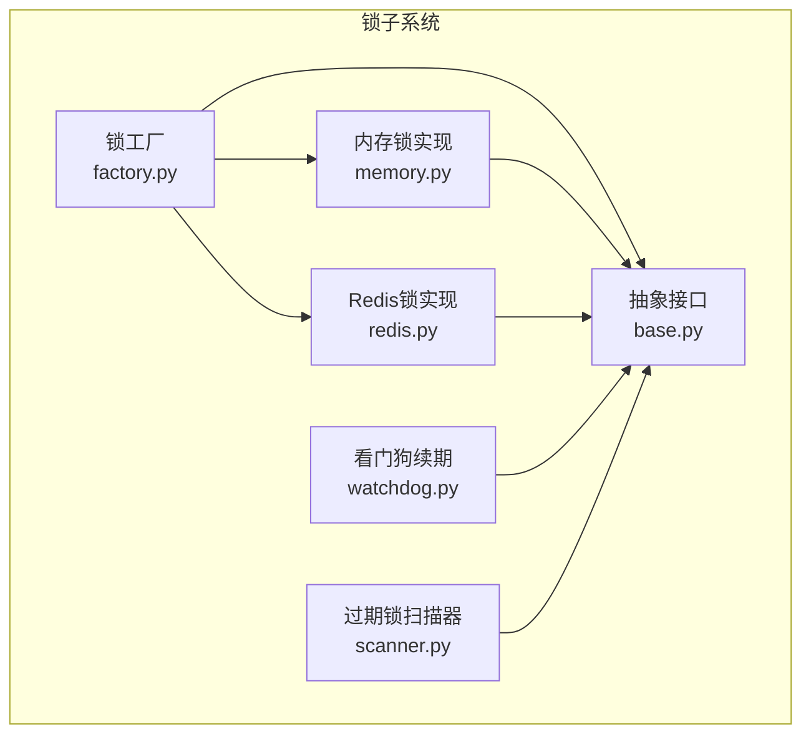
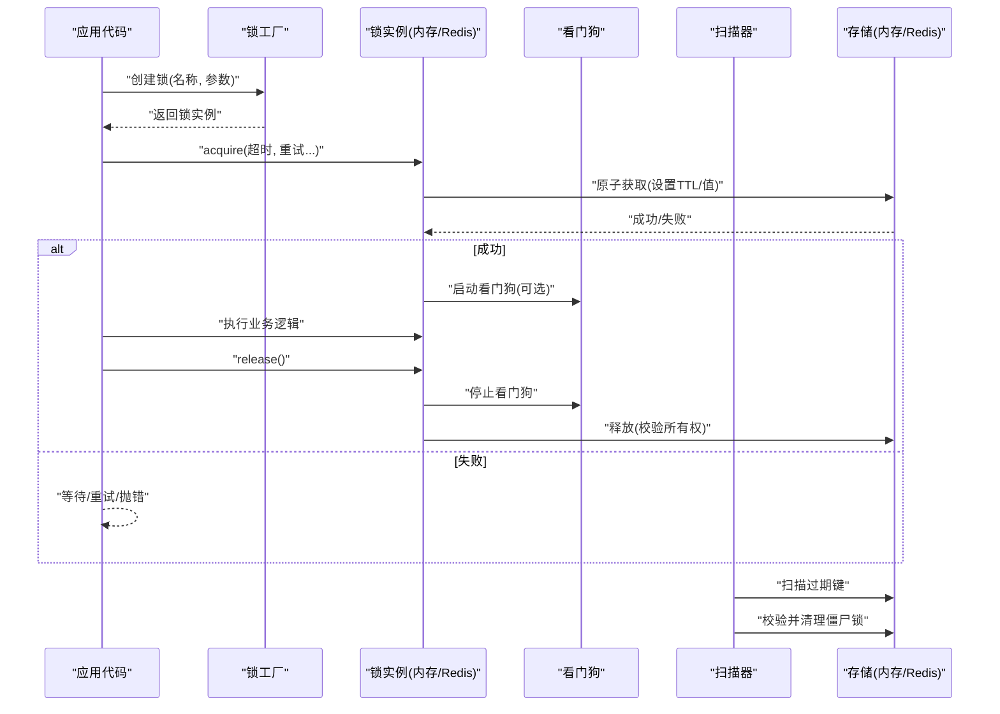
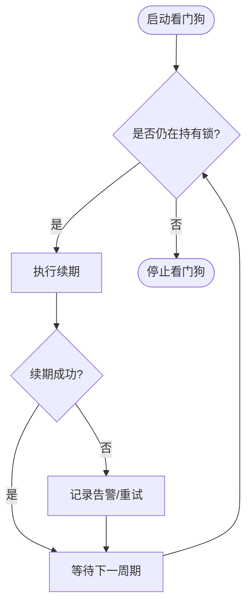
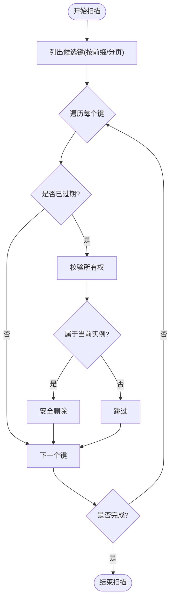
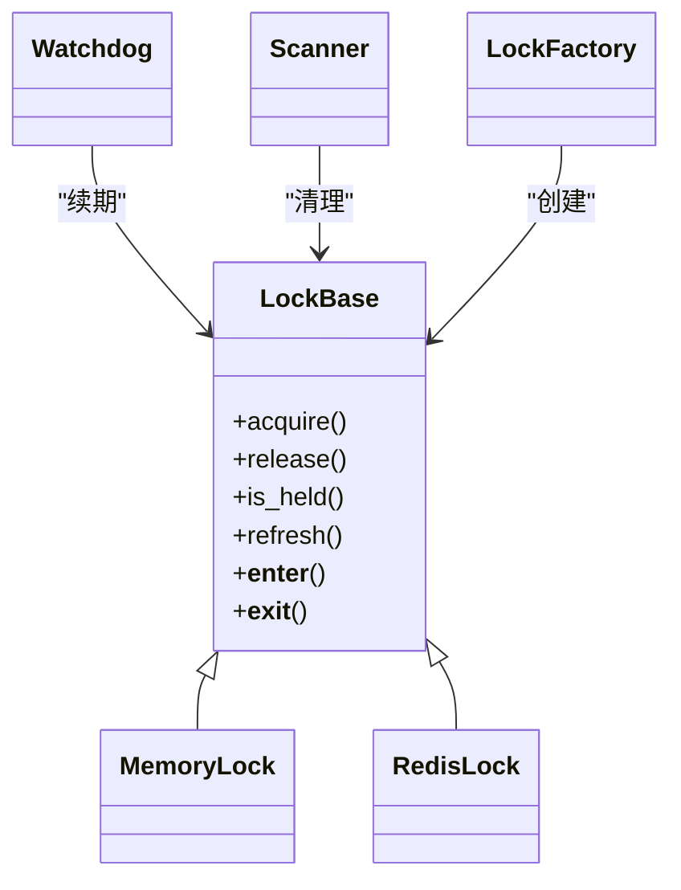

# 分布式锁

<cite>
**本文引用的文件**   
- [src/neotask/lock/base.py](file://src/neotask/lock/base.py)
- [src/neotask/lock/memory.py](file://src/neotask/lock/memory.py)
- [src/neotask/lock/redis.py](file://src/neotask/lock/redis.py)
- [src/neotask/lock/watchdog.py](file://src/neotask/lock/watchdog.py)
- [src/neotask/lock/scanner.py](file://src/neotask/lock/scanner.py)
- [src/neotask/lock/factory.py](file://src/neotask/lock/factory.py)
- [tests/distributed/test_distributed_lock.py](file://tests/distributed/test_distributed_lock.py)
- [tests/distributed/test_redis_lock.py](file://tests/distributed/test_redis_lock.py)
</cite>

## 目录
1. [简介](#简介)
2. [项目结构](#项目结构)
3. [核心组件](#核心组件)
4. [架构总览](#架构总览)
5. [详细组件分析](#详细组件分析)
6. [依赖关系分析](#依赖关系分析)
7. [性能考量](#性能考量)
8. [故障排查指南](#故障排查指南)
9. [结论](#结论)
10. [附录](#附录)

## 简介
本仓库实现了一套可扩展的分布式锁子系统，提供统一的锁抽象接口、内存锁与Redis锁两种后端实现，并配套看门狗续期机制与过期锁扫描器。该子系统可嵌入任务调度与分布式协调场景中，用于跨进程/跨节点的互斥控制、资源保护与幂等保障。

## 项目结构
锁子系统位于 src/neotask/lock 目录下，采用“接口+多实现+工厂”的组织方式：
- base.py：定义锁抽象接口与通用能力（获取、释放、上下文管理、超时与重试等）
- memory.py：基于本地内存的锁实现，适用于单机多线程场景
- redis.py：基于 Redis 的分布式锁实现，支持原子性、过期与续期
- watchdog.py：看门狗线程/协程，自动为长时间持有的锁进行续期
- scanner.py：过期锁扫描器，定期清理异常或超时的锁记录
- factory.py：根据配置选择具体锁实现（内存或Redis）

图表来源
- [src/neotask/lock/base.py](file://src/neotask/lock/base.py)
- [src/neotask/lock/memory.py](file://src/neotask/lock/memory.py)
- [src/neotask/lock/redis.py](file://src/neotask/lock/redis.py)
- [src/neotask/lock/watchdog.py](file://src/neotask/lock/watchdog.py)
- [src/neotask/lock/scanner.py](file://src/neotask/lock/scanner.py)
- [src/neotask/lock/factory.py](file://src/neotask/lock/factory.py)

章节来源
- [src/neotask/lock/base.py](file://src/neotask/lock/base.py)
- [src/neotask/lock/memory.py](file://src/neotask/lock/memory.py)
- [src/neotask/lock/redis.py](file://src/neotask/lock/redis.py)
- [src/neotask/lock/watchdog.py](file://src/neotask/lock/watchdog.py)
- [src/neotask/lock/scanner.py](file://src/neotask/lock/scanner.py)
- [src/neotask/lock/factory.py](file://src/neotask/lock/factory.py)

## 核心组件
- 锁抽象接口
  - 职责：定义获取、释放、上下文管理、是否持有、扩展方法（如刷新、查询状态）等统一契约
  - 设计要点：支持超时、重试、阻塞/非阻塞模式；提供上下文管理器以简化资源释放
- 内存锁
  - 适用场景：单机多线程、测试环境
  - 特点：低延迟、无网络开销；不具备跨进程/跨节点互斥能力
- Redis锁
  - 适用场景：跨进程/跨节点分布式环境
  - 特点：利用Redis原子操作保证互斥；结合TTL与续期避免死锁；需考虑网络抖动与一致性
- 看门狗
  - 作用：在业务执行期间周期性续期，防止因处理耗时导致锁提前过期
  - 策略：按固定周期或动态比例续期；失败时记录告警并尝试恢复
- 扫描器
  - 作用：定时扫描已过期但未被释放的锁，辅助清理僵尸锁
  - 策略：按命名空间/键前缀遍历，校验所有权后安全删除
- 工厂
  - 作用：根据配置返回对应锁实现；便于切换后端与单元测试替换

章节来源
- [src/neotask/lock/base.py](file://src/neotask/lock/base.py)
- [src/neotask/lock/memory.py](file://src/neotask/lock/memory.py)
- [src/neotask/lock/redis.py](file://src/neotask/lock/redis.py)
- [src/neotask/lock/watchdog.py](file://src/neotask/lock/watchdog.py)
- [src/neotask/lock/scanner.py](file://src/neotask/lock/scanner.py)
- [src/neotask/lock/factory.py](file://src/neotask/lock/factory.py)

## 架构总览
下图展示了从应用调用到锁实现的完整流程，以及看门狗与扫描器的协作关系。

图表来源
- [src/neotask/lock/factory.py](file://src/neotask/lock/factory.py)
- [src/neotask/lock/base.py](file://src/neotask/lock/base.py)
- [src/neotask/lock/memory.py](file://src/neotask/lock/memory.py)
- [src/neotask/lock/redis.py](file://src/neotask/lock/redis.py)
- [src/neotask/lock/watchdog.py](file://src/neotask/lock/watchdog.py)
- [src/neotask/lock/scanner.py](file://src/neotask/lock/scanner.py)

## 详细组件分析

### 抽象接口与扩展点
- 关键能力
  - acquire/release：获取与释放锁，支持超时、重试、阻塞/非阻塞
  - __enter__/__exit__：上下文管理器，确保异常路径下也能释放
  - is_held/refresh：查询持有状态与主动刷新（供看门狗使用）
  - 扩展方法：如批量查询、统计指标上报、事件钩子
- 设计原则
  - 面向接口编程：上层仅依赖抽象，屏蔽底层差异
  - 幂等与健壮：释放需校验所有权，避免误删他人锁
  - 可观测性：暴露必要指标与日志点，便于监控与排障

章节来源
- [src/neotask/lock/base.py](file://src/neotask/lock/base.py)

### 内存锁实现
- 原理
  - 使用进程内数据结构维护锁状态（持有者、过期时间等）
  - 通过线程安全原语保证并发访问正确性
- 性能特点
  - 极低延迟，适合单进程多线程
  - 无法跨进程/跨节点互斥
- 适用场景
  - 单机服务内部临界区保护
  - 单元测试与快速验证

章节来源
- [src/neotask/lock/memory.py](file://src/neotask/lock/memory.py)

### Redis锁实现
- 原理
  - 使用原子命令设置键值与过期时间，确保互斥
  - 释放时校验唯一标识，避免误删
  - 结合TTL与看门狗续期，避免长任务导致的死锁
- 性能特点
  - 受网络RTT与Redis集群拓扑影响
  - 高吞吐下需关注连接池、超时与重试策略
- 注意事项
  - 时钟漂移与网络抖动可能导致短暂不一致
  - 建议开启合理的超时与重试，避免雪崩

章节来源
- [src/neotask/lock/redis.py](file://src/neotask/lock/redis.py)

### 看门狗机制
- 目标
  - 在业务执行期间自动续期，防止锁提前过期
- 策略
  - 定时任务按固定周期或动态比例触发续期
  - 续期失败时记录告警，必要时降级或中止任务
- 生命周期
  - 获取成功后启动，释放或异常退出时停止
  - 支持优雅关闭，避免中断正在进行的续期

图表来源
- [src/neotask/lock/watchdog.py](file://src/neotask/lock/watchdog.py)
- [src/neotask/lock/base.py](file://src/neotask/lock/base.py)

章节来源
- [src/neotask/lock/watchdog.py](file://src/neotask/lock/watchdog.py)

### 锁扫描器
- 目标
  - 定期扫描过期但未释放的锁，清理僵尸锁，降低资源泄漏风险
- 策略
  - 按命名空间或键前缀遍历
  - 校验所有权后再删除，避免误删活跃锁
  - 支持分页/游标式扫描，避免对存储造成压力

图表来源
- [src/neotask/lock/scanner.py](file://src/neotask/lock/scanner.py)

章节来源
- [src/neotask/lock/scanner.py](file://src/neotask/lock/scanner.py)

### 锁工厂
- 目标
  - 根据配置动态选择内存锁或Redis锁
- 行为
  - 读取配置项（如后端类型、连接参数）
  - 返回符合抽象接口的锁实例
  - 便于在测试中替换为内存锁

章节来源
- [src/neotask/lock/factory.py](file://src/neotask/lock/factory.py)

## 依赖关系分析
- 耦合与内聚
  - 抽象接口与实现解耦良好，新增后端只需实现接口
  - 看门狗与扫描器依赖抽象接口，不直接耦合具体存储
- 外部依赖
  - Redis锁依赖Redis客户端与连接池
  - 看门狗与扫描器依赖调度器（线程/协程）
- 潜在循环依赖
  - 通过工厂与接口隔离，避免循环引用

图表来源
- [src/neotask/lock/base.py](file://src/neotask/lock/base.py)
- [src/neotask/lock/memory.py](file://src/neotask/lock/memory.py)
- [src/neotask/lock/redis.py](file://src/neotask/lock/redis.py)
- [src/neotask/lock/watchdog.py](file://src/neotask/lock/watchdog.py)
- [src/neotask/lock/scanner.py](file://src/neotask/lock/scanner.py)
- [src/neotask/lock/factory.py](file://src/neotask/lock/factory.py)

章节来源
- [src/neotask/lock/base.py](file://src/neotask/lock/base.py)
- [src/neotask/lock/factory.py](file://src/neotask/lock/factory.py)

## 性能考量
- 内存锁
  - 优势：极低延迟，适合热点临界区
  - 局限：仅限单进程
- Redis锁
  - 关键指标：RTT、QPS、连接池大小、超时与重试
  - 优化建议：
    - 合理设置锁TTL与续期周期，避免频繁续期
    - 使用连接池与批量操作（如适用）
    - 针对热点键做分片或命名空间隔离
- 看门狗与扫描器
  - 控制并发度与频率，避免对Redis造成额外压力
  - 失败重试与退避策略，避免风暴

[本节为通用指导，无需源码引用]

## 故障排查指南
- 常见问题
  - 锁未释放：检查异常路径是否调用释放；确认看门狗是否正确停止
  - 死锁/饥饿：缩短锁粒度，避免长事务；引入公平性或优先级
  - 重复执行：确保释放时校验唯一标识，避免误删
  - 性能抖动：检查网络与Redis负载，调整超时与重试
- 定位手段
  - 启用详细日志与指标上报
  - 使用扫描器输出清理报告
  - 在测试中用内存锁复现问题

章节来源
- [tests/distributed/test_distributed_lock.py](file://tests/distributed/test_distributed_lock.py)
- [tests/distributed/test_redis_lock.py](file://tests/distributed/test_redis_lock.py)

## 结论
本分布式锁子系统通过清晰的抽象接口与多后端实现，兼顾了易用性与可扩展性。内存锁满足单机高性能需求，Redis锁覆盖分布式场景；看门狗与扫描器共同提升鲁棒性。在生产环境中，应结合业务特征调优TTL、续期与重试策略，并完善监控与告警，以确保稳定与高效。

[本节为总结，无需源码引用]

## 附录
- 正确使用示例（参考测试用例）
  - 基本获取与释放
  - 上下文管理器用法
  - 带超时与重试的获取
  - 看门狗与扫描器集成
- 最佳实践
  - 尽量缩小临界区范围
  - 为锁设置合理TTL，避免长期占用
  - 释放前校验所有权，避免误删
  - 对热点键进行命名空间隔离
  - 在异常路径务必释放锁
  - 结合监控与告警，及时发现异常

章节来源
- [tests/distributed/test_distributed_lock.py](file://tests/distributed/test_distributed_lock.py)
- [tests/distributed/test_redis_lock.py](file://tests/distributed/test_redis_lock.py)