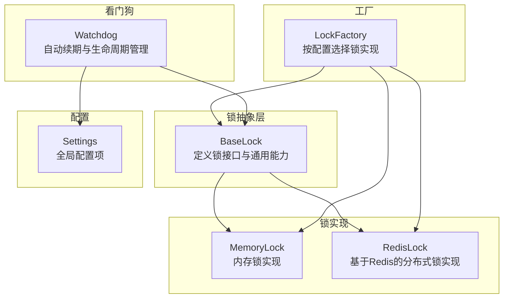
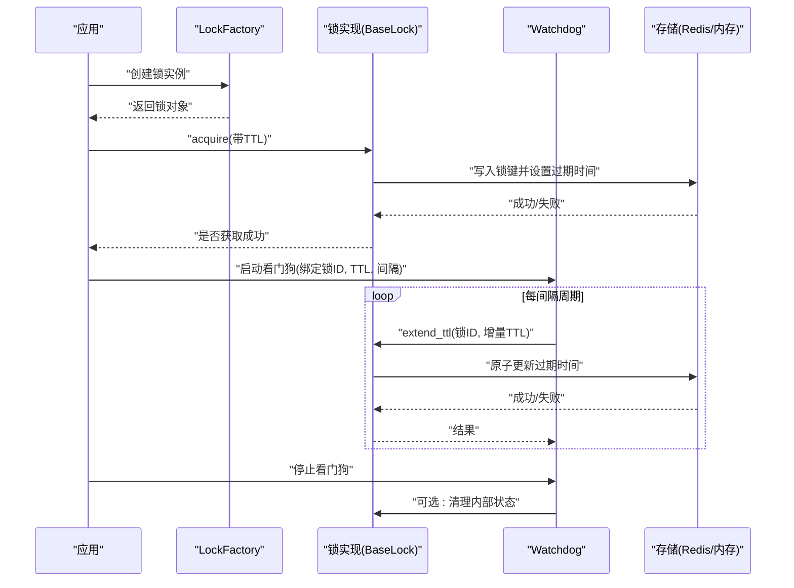
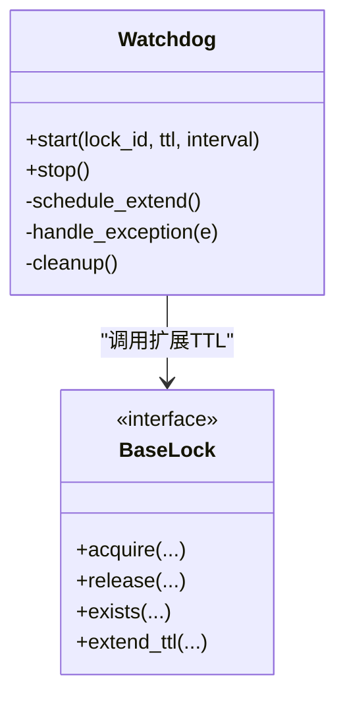
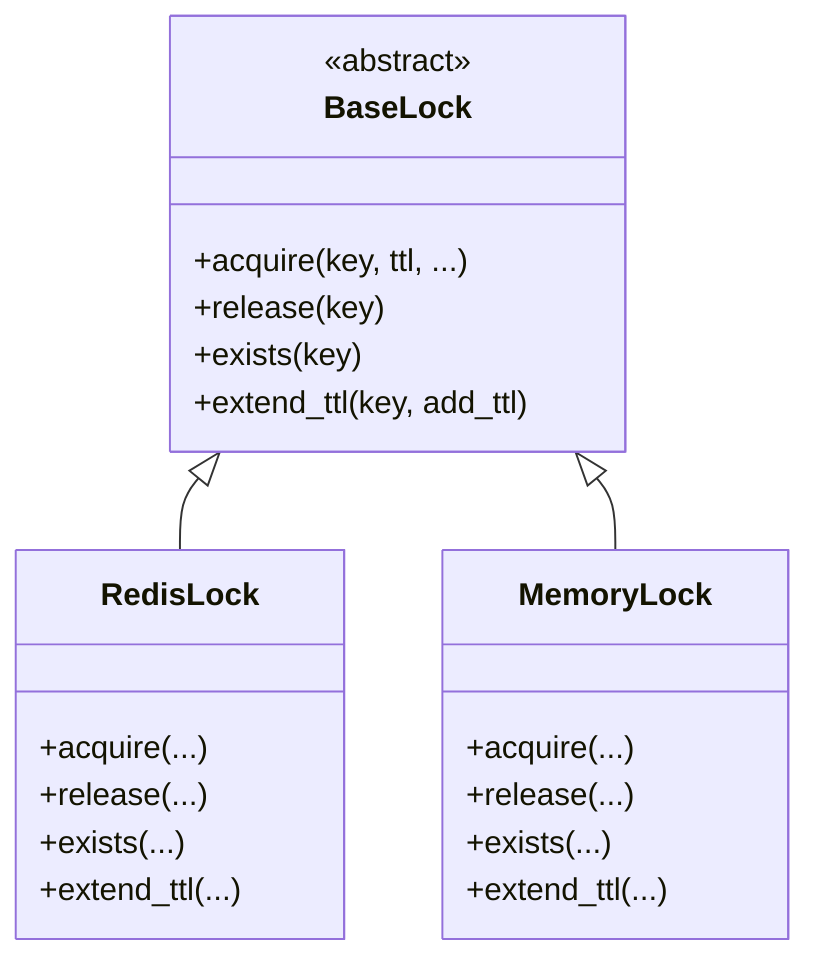
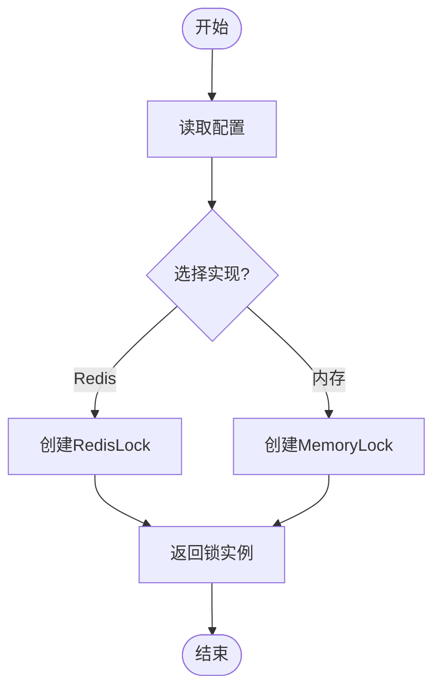
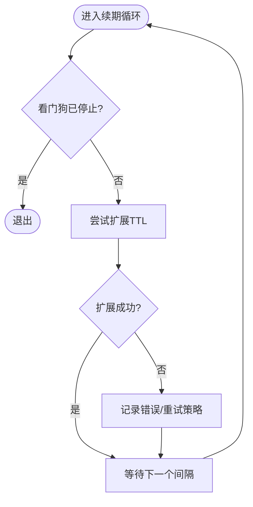
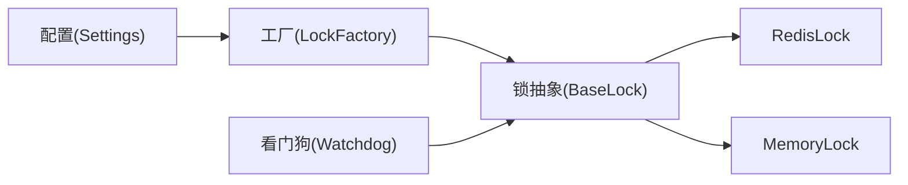
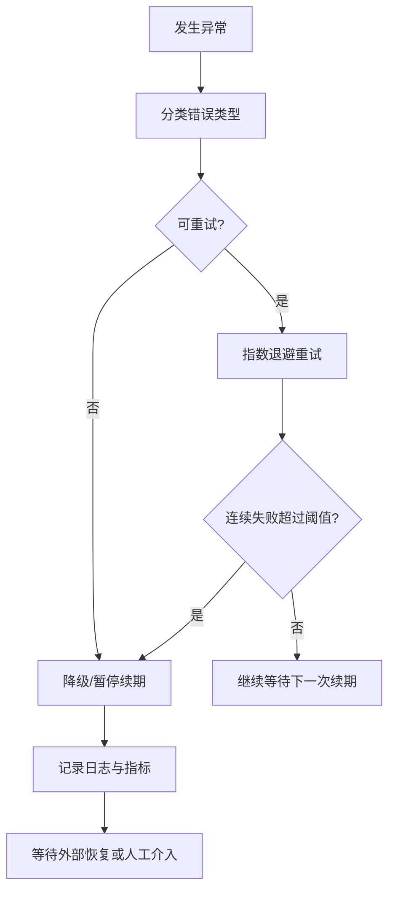

# 看门狗机制

<cite>
**本文引用的文件**   
- [src/neotask/lock/watchdog.py](file://src/neotask/lock/watchdog.py)
- [src/neotask/lock/base.py](file://src/neotask/lock/base.py)
- [src/neotask/lock/factory.py](file://src/neotask/lock/factory.py)
- [src/neotask/lock/redis.py](file://src/neotask/lock/redis.py)
- [src/neotask/lock/memory.py](file://src/neotask/lock/memory.py)
- [src/neotask/config/settings.py](file://src/neotask/config/settings.py)
- [tests/distributed/test_redis_lock.py](file://tests/distributed/test_redis_lock.py)
</cite>

## 目录
1. [简介](#简介)
2. [项目结构](#项目结构)
3. [核心组件](#核心组件)
4. [架构总览](#架构总览)
5. [详细组件分析](#详细组件分析)
6. [依赖关系分析](#依赖关系分析)
7. [性能考虑](#性能考虑)
8. [故障处理与恢复](#故障处理与恢复)
9. [结论](#结论)
10. [附录：配置参数与调优建议](#附录配置参数与调优建议)

## 简介
本文件聚焦于分布式锁的“看门狗”机制，系统性阐述其设计与实现。内容涵盖：
- 自动续期（续约）的工作原理与定时任务调度策略
- 看门狗的启动、停止与资源管理
- 配置参数与性能调优建议
- 异常场景下的故障处理与恢复策略

在看门狗模式下，持有锁的客户端会在锁过期前周期性发起续期请求，从而避免业务执行时间超过锁TTL导致的锁提前释放问题。该机制对长耗时任务、网络抖动和节点重启等场景尤为关键。

## 项目结构
与看门狗相关的代码主要位于分布式锁模块中，围绕统一的锁抽象、具体存储实现以及看门狗调度器展开。

图示来源
- [src/neotask/lock/base.py](file://src/neotask/lock/base.py)
- [src/neotask/lock/memory.py](file://src/neotask/lock/memory.py)
- [src/neotask/lock/redis.py](file://src/neotask/lock/redis.py)
- [src/neotask/lock/factory.py](file://src/neotask/lock/factory.py)
- [src/neotask/lock/watchdog.py](file://src/neotask/lock/watchdog.py)
- [src/neotask/config/settings.py](file://src/neotask/config/settings.py)

章节来源
- [src/neotask/lock/base.py](file://src/neotask/lock/base.py)
- [src/neotask/lock/memory.py](file://src/neotask/lock/memory.py)
- [src/neotask/lock/redis.py](file://src/neotask/lock/redis.py)
- [src/neotask/lock/factory.py](file://src/neotask/lock/factory.py)
- [src/neotask/lock/watchdog.py](file://src/neotask/lock/watchdog.py)
- [src/neotask/config/settings.py](file://src/neotask/config/settings.py)

## 核心组件
- 锁抽象接口（BaseLock）
  - 提供获取、释放、是否存在、扩展TTL等统一方法签名，供不同后端实现复用。
- 具体锁实现
  - MemoryLock：进程内内存锁，适合单机或测试环境。
  - RedisLock：基于Redis原子操作的分布式锁，支持TTL与续期。
- 工厂（LockFactory）
  - 根据配置返回对应锁实现，屏蔽底层差异。
- 看门狗（Watchdog）
  - 负责在锁持有期间周期性触发续期，管理自身生命周期（启动/停止），并处理异常与资源清理。

章节来源
- [src/neotask/lock/base.py](file://src/neotask/lock/base.py)
- [src/neotask/lock/memory.py](file://src/neotask/lock/memory.py)
- [src/neotask/lock/redis.py](file://src/neotask/lock/redis.py)
- [src/neotask/lock/factory.py](file://src/neotask/lock/factory.py)
- [src/neotask/lock/watchdog.py](file://src/neotask/lock/watchdog.py)

## 架构总览
看门狗与锁实现的交互时序如下：

图示来源
- [src/neotask/lock/watchdog.py](file://src/neotask/lock/watchdog.py)
- [src/neotask/lock/base.py](file://src/neotask/lock/base.py)
- [src/neotask/lock/redis.py](file://src/neotask/lock/redis.py)
- [src/neotask/lock/memory.py](file://src/neotask/lock/memory.py)
- [src/neotask/lock/factory.py](file://src/neotask/lock/factory.py)

## 详细组件分析

### 看门狗类（Watchdog）
职责
- 维护一个或多个锁的续期计划
- 周期性触发续期，直到锁被显式释放或看门狗被停止
- 捕获并上报异常，保证调度器健壮性
- 提供启动/停止接口，确保资源安全释放

关键行为
- 启动：注册到调度器，记录锁标识、TTL与续期间隔
- 续期：调用锁实现的扩展TTL方法；若失败则重试或降级
- 停止：取消所有待执行任务，清理引用，防止内存泄漏

图示来源
- [src/neotask/lock/watchdog.py](file://src/neotask/lock/watchdog.py)
- [src/neotask/lock/base.py](file://src/neotask/lock/base.py)

章节来源
- [src/neotask/lock/watchdog.py](file://src/neotask/lock/watchdog.py)

### 锁抽象与实现（BaseLock / RedisLock / MemoryLock）
设计要点
- BaseLock定义统一接口，包括获取、释放、存在性检查与扩展TTL
- RedisLock通过原子操作实现跨进程/跨节点的互斥，并提供TTL与续期
- MemoryLock用于单机场景，简化实现但无跨进程能力

图示来源
- [src/neotask/lock/base.py](file://src/neotask/lock/base.py)
- [src/neotask/lock/redis.py](file://src/neotask/lock/redis.py)
- [src/neotask/lock/memory.py](file://src/neotask/lock/memory.py)

章节来源
- [src/neotask/lock/base.py](file://src/neotask/lock/base.py)
- [src/neotask/lock/redis.py](file://src/neotask/lock/redis.py)
- [src/neotask/lock/memory.py](file://src/neotask/lock/memory.py)

### 工厂（LockFactory）
作用
- 根据配置动态选择锁实现（如Redis或内存）
- 对外暴露一致的创建接口，降低上层耦合

图示来源
- [src/neotask/lock/factory.py](file://src/neotask/lock/factory.py)
- [src/neotask/config/settings.py](file://src/neotask/config/settings.py)

章节来源
- [src/neotask/lock/factory.py](file://src/neotask/lock/factory.py)
- [src/neotask/config/settings.py](file://src/neotask/config/settings.py)

### 自动续期流程（算法视角）

图示来源
- [src/neotask/lock/watchdog.py](file://src/neotask/lock/watchdog.py)
- [src/neotask/lock/base.py](file://src/neotask/lock/base.py)

章节来源
- [src/neotask/lock/watchdog.py](file://src/neotask/lock/watchdog.py)

## 依赖关系分析
- Watchdog依赖锁抽象接口，不关心具体存储实现
- RedisLock依赖Redis客户端与原子命令语义
- MemoryLock依赖进程内数据结构
- LockFactory依赖配置中心以决定使用哪种锁实现

图示来源
- [src/neotask/config/settings.py](file://src/neotask/config/settings.py)
- [src/neotask/lock/factory.py](file://src/neotask/lock/factory.py)
- [src/neotask/lock/base.py](file://src/neotask/lock/base.py)
- [src/neotask/lock/redis.py](file://src/neotask/lock/redis.py)
- [src/neotask/lock/memory.py](file://src/neotask/lock/memory.py)
- [src/neotask/lock/watchdog.py](file://src/neotask/lock/watchdog.py)

章节来源
- [src/neotask/config/settings.py](file://src/neotask/config/settings.py)
- [src/neotask/lock/factory.py](file://src/neotask/lock/factory.py)
- [src/neotask/lock/base.py](file://src/neotask/lock/base.py)
- [src/neotask/lock/redis.py](file://src/neotask/lock/redis.py)
- [src/neotask/lock/memory.py](file://src/neotask/lock/memory.py)
- [src/neotask/lock/watchdog.py](file://src/neotask/lock/watchdog.py)

## 性能考虑
- 续期间隔与TTL比例
  - 建议续期间隔为TTL的三分之一左右，兼顾及时性与开销
- 批量与合并
  - 在高并发下可考虑将多个锁的续期合并执行，减少系统调用次数
- 幂等与原子性
  - 续期应基于原子操作，避免竞态导致锁误释放
- 背压与限流
  - 当续期失败率升高时，适当退避或暂停续期，避免雪崩
- 监控指标
  - 统计续期成功率、失败原因分布、平均延迟与最大延迟

[本节为通用指导，无需特定文件来源]

## 故障处理与恢复
常见异常与策略
- 网络抖动/存储不可用
  - 采用指数退避重试；达到阈值后告警并暂停续期，等待恢复
- 锁已被其他持有者释放
  - 检测到不存在或释放失败时，停止续期并清理资源
- 节点崩溃
  - 依靠TTL自然过期；看门狗停止后不再续期，锁最终超时释放
- 重复启动
  - 同一锁ID仅允许单一看门狗运行，避免重复续期造成竞争

恢复流程

章节来源
- [src/neotask/lock/watchdog.py](file://src/neotask/lock/watchdog.py)
- [tests/distributed/test_redis_lock.py](file://tests/distributed/test_redis_lock.py)

## 结论
看门狗机制通过“锁+定时续期”的组合，有效解决了长耗时任务中的锁提前释放问题。其核心价值在于：
- 将锁的生命周期与业务执行解耦
- 提供健壮的异常处理与资源回收
- 通过合理配置与监控，保障高可用与高性能

在生产环境中，建议结合业务SLA选择合适的TTL与续期间隔，并完善监控与告警，以便快速定位与恢复异常。

[本节为总结性内容，无需特定文件来源]

## 附录：配置参数与调优建议
- 关键参数
  - 锁TTL：锁的初始过期时间
  - 续期间隔：看门狗触发续期的周期
  - 最大重试次数：续期失败时的重试上限
  - 退避策略：指数退避的基础时间与倍数
  - 是否启用看门狗：按场景开关
- 推荐实践
  - 续期间隔约为TTL的1/3~1/2
  - 对热点锁进行限流与合并续期
  - 开启指标采集与告警，关注续期成功率与延迟
  - 在节点异常时依赖TTL自愈，避免长时间持锁

章节来源
- [src/neotask/config/settings.py](file://src/neotask/config/settings.py)
- [src/neotask/lock/watchdog.py](file://src/neotask/lock/watchdog.py)
- [tests/distributed/test_redis_lock.py](file://tests/distributed/test_redis_lock.py)