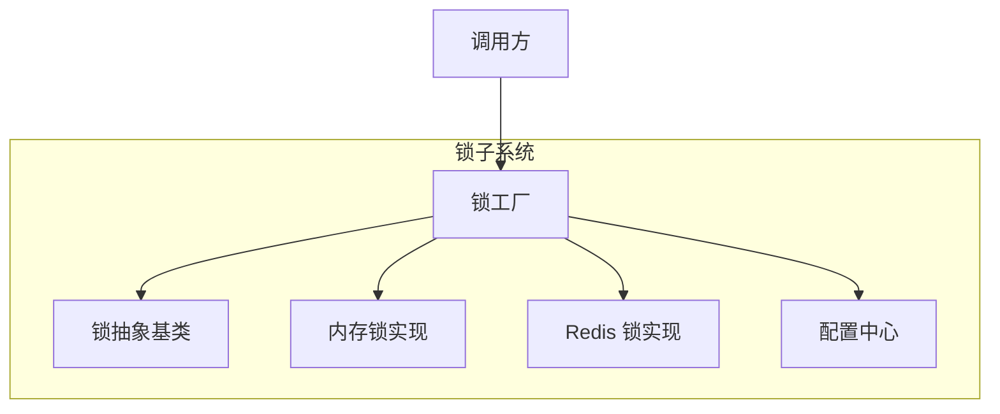
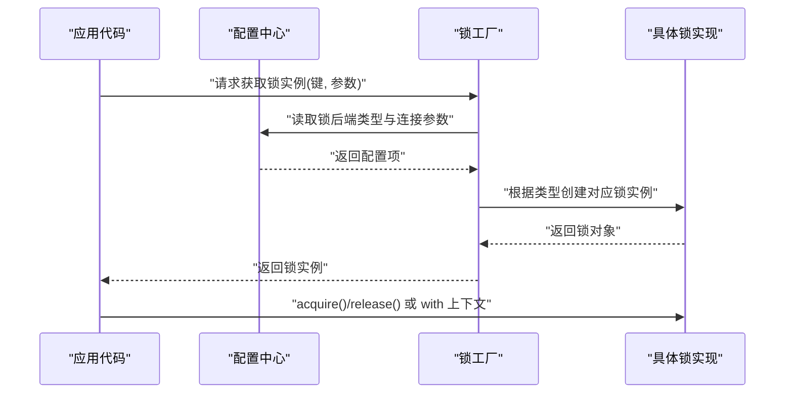
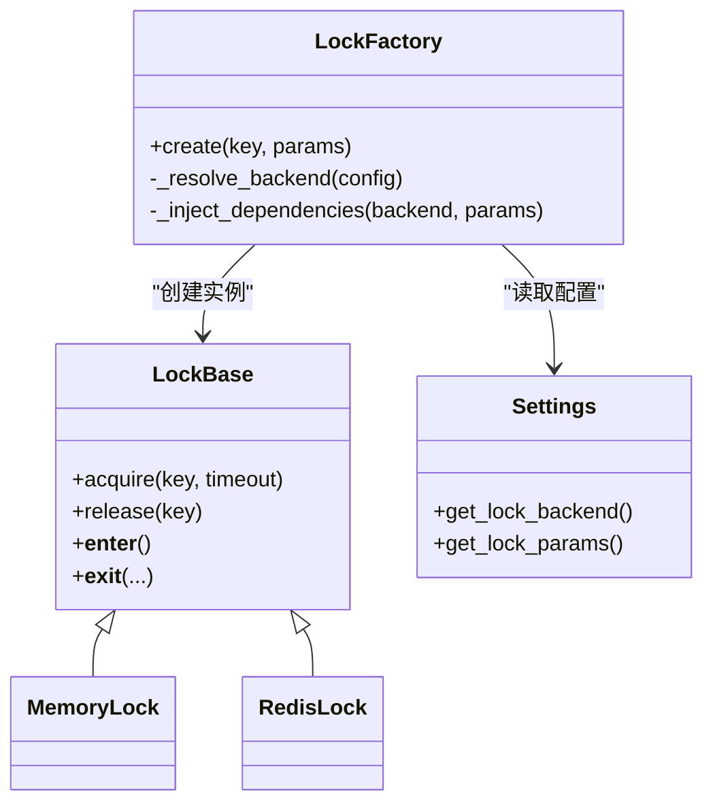
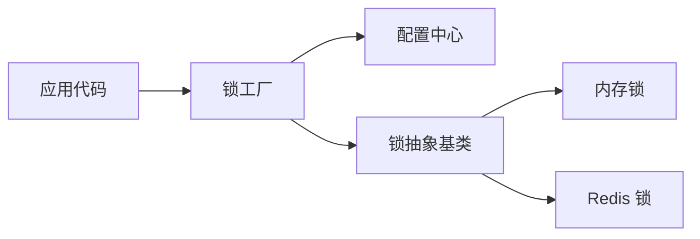

# 锁工厂模式

<cite>
**本文引用的文件**   
- [src/neotask/lock/factory.py](file://src/neotask/lock/factory.py)
- [src/neotask/lock/base.py](file://src/neotask/lock/base.py)
- [src/neotask/lock/memory.py](file://src/neotask/lock/memory.py)
- [src/neotask/lock/redis.py](file://src/neotask/lock/redis.py)
- [src/neotask/config/settings.py](file://src/neotask/config/settings.py)
- [examples/01_simple.py](file://examples/01_simple.py)
- [tests/distributed/test_redis_lock.py](file://tests/distributed/test_redis_lock.py)
</cite>

## 目录
1. [简介](#简介)
2. [项目结构](#项目结构)
3. [核心组件](#核心组件)
4. [架构总览](#架构总览)
5. [详细组件分析](#详细组件分析)
6. [依赖关系分析](#依赖关系分析)
7. [性能考量](#性能考量)
8. [故障排查指南](#故障排查指南)
9. [结论](#结论)
10. [附录](#附录)

## 简介
本文件围绕“锁工厂模式”的实现与应用展开，聚焦于如何根据配置动态创建不同类型的锁实例。文档将解释锁类型选择策略、依赖注入机制、工厂的配置方法与扩展新锁类型的步骤，并提供使用示例与最佳实践。目标读者既包括需要快速上手的开发者，也包括希望深入理解内部设计与扩展点的工程师。

## 项目结构
本项目在 lock 子模块中实现了统一的锁抽象与多种具体实现，并通过工厂类按配置动态装配。关键路径如下：
- 抽象接口与基类：定义锁的统一行为与生命周期
- 内存锁与 Redis 锁：提供进程内与分布式两种典型实现
- 锁工厂：依据配置或注册表选择并创建对应锁实例
- 配置中心：集中管理锁相关参数（如后端类型、连接信息）
- 示例与测试：演示用法与验证不同后端的正确性

图表来源
- [src/neotask/lock/factory.py](file://src/neotask/lock/factory.py)
- [src/neotask/lock/base.py](file://src/neotask/lock/base.py)
- [src/neotask/lock/memory.py](file://src/neotask/lock/memory.py)
- [src/neotask/lock/redis.py](file://src/neotask/lock/redis.py)
- [src/neotask/config/settings.py](file://src/neotask/config/settings.py)

章节来源
- [src/neotask/lock/factory.py](file://src/neotask/lock/factory.py)
- [src/neotask/lock/base.py](file://src/neotask/lock/base.py)
- [src/neotask/lock/memory.py](file://src/neotask/lock/memory.py)
- [src/neotask/lock/redis.py](file://src/neotask/lock/redis.py)
- [src/neotask/config/settings.py](file://src/neotask/config/settings.py)

## 核心组件
- 锁抽象基类：定义获取、释放、上下文管理等统一接口，确保所有锁实现具备一致的行为契约。
- 内存锁：适用于单机进程内的互斥场景，轻量且无外部依赖。
- Redis 锁：基于 Redis 的分布式锁实现，适合多进程或多节点协作。
- 锁工厂：根据配置或注册表决定创建哪种锁，并负责依赖注入（例如 Redis 客户端）。
- 配置中心：提供锁后端类型、超时、重试等参数的读取入口。

章节来源
- [src/neotask/lock/base.py](file://src/neotask/lock/base.py)
- [src/neotask/lock/memory.py](file://src/neotask/lock/memory.py)
- [src/neotask/lock/redis.py](file://src/neotask/lock/redis.py)
- [src/neotask/lock/factory.py](file://src/neotask/lock/factory.py)
- [src/neotask/config/settings.py](file://src/neotask/config/settings.py)

## 架构总览
下图展示了从调用方到锁实现的完整流程，以及工厂如何结合配置进行类型选择与依赖注入。

图表来源
- [src/neotask/lock/factory.py](file://src/neotask/lock/factory.py)
- [src/neotask/config/settings.py](file://src/neotask/config/settings.py)

## 详细组件分析

### 锁抽象基类
- 职责：定义锁的统一 API（获取、释放、超时、上下文管理），为多实现提供一致的契约。
- 设计要点：
  - 明确异常边界与错误语义，便于上层统一处理。
  - 支持可插拔的超时与重试策略，提升鲁棒性。
  - 通过继承体系保证新增实现无需改动调用方。

章节来源
- [src/neotask/lock/base.py](file://src/neotask/lock/base.py)

### 内存锁实现
- 适用场景：单进程并发控制，低延迟、零网络开销。
- 特点：
  - 基于进程内数据结构，无需外部依赖。
  - 适合单元测试与本地开发环境。
- 注意事项：
  - 跨进程无效；如需分布式能力应切换到 Redis 锁。

章节来源
- [src/neotask/lock/memory.py](file://src/neotask/lock/memory.py)

### Redis 锁实现
- 适用场景：多进程/多节点分布式互斥。
- 特点：
  - 依赖 Redis 作为协调器，支持原子操作与过期清理。
  - 需合理设置锁超时与续期策略，避免死锁。
- 集成点：
  - 由工厂注入 Redis 客户端，避免硬编码连接细节。

章节来源
- [src/neotask/lock/redis.py](file://src/neotask/lock/redis.py)

### 锁工厂与类型选择策略
- 职责：
  - 读取配置中的锁后端类型与连接参数。
  - 根据类型选择并创建对应的锁实例。
  - 注入必要的外部依赖（如 Redis 客户端）。
- 类型选择策略：
  - 优先从配置中读取后端类型（如 memory、redis）。
  - 若未显式配置，则采用默认策略（通常为 memory）。
  - 可扩展注册表以支持更多后端。
- 依赖注入：
  - 工厂持有或接收外部依赖（如 Redis 客户端），在创建锁时传入。
  - 避免在锁实现中直接耦合全局状态。

图表来源
- [src/neotask/lock/base.py](file://src/neotask/lock/base.py)
- [src/neotask/lock/memory.py](file://src/neotask/lock/memory.py)
- [src/neotask/lock/redis.py](file://src/neotask/lock/redis.py)
- [src/neotask/lock/factory.py](file://src/neotask/lock/factory.py)
- [src/neotask/config/settings.py](file://src/neotask/config/settings.py)

章节来源
- [src/neotask/lock/factory.py](file://src/neotask/lock/factory.py)
- [src/neotask/config/settings.py](file://src/neotask/config/settings.py)

### 配置方法与扩展新锁类型
- 配置方法：
  - 在配置中心暴露锁后端类型与连接参数读取接口。
  - 常见键包括：后端类型、超时、重试次数、Redis 连接信息等。
- 扩展新锁类型步骤：
  1. 新建锁实现类，继承自锁抽象基类，实现必要方法。
  2. 在工厂的类型映射中注册新后端标识。
  3. 在配置中心添加新后端所需的参数读取逻辑。
  4. 编写单元测试覆盖正常与异常路径。
  5. 更新示例与文档，展示新后端的用法。

章节来源
- [src/neotask/lock/factory.py](file://src/neotask/lock/factory.py)
- [src/neotask/config/settings.py](file://src/neotask/config/settings.py)

### 使用示例与最佳实践
- 基本用法：
  - 通过工厂获取锁实例，随后进行获取与释放，或使用上下文管理器自动管理生命周期。
- 推荐实践：
  - 始终设置合理的超时时间，防止死锁。
  - 对分布式锁启用重试与退避策略，提高稳定性。
  - 在异常分支确保释放锁，避免资源泄漏。
  - 将锁粒度控制在最小范围，减少竞争与阻塞。
  - 在测试中使用内存锁以提升速度，在生产切换至 Redis 锁。

章节来源
- [examples/01_simple.py](file://examples/01_simple.py)
- [tests/distributed/test_redis_lock.py](file://tests/distributed/test_redis_lock.py)

## 依赖关系分析
- 松耦合：
  - 调用方仅依赖锁抽象与工厂，不感知具体实现。
  - 工厂通过配置与依赖注入解耦外部系统（如 Redis）。
- 内聚性：
  - 每个锁实现专注于自身协议与特性，职责单一。
- 潜在风险：
  - 若配置键名变更，需在工厂与配置中心同步更新。
  - 新增后端时需确保工厂注册表与配置读取逻辑保持一致。

图表来源
- [src/neotask/lock/factory.py](file://src/neotask/lock/factory.py)
- [src/neotask/lock/base.py](file://src/neotask/lock/base.py)
- [src/neotask/lock/memory.py](file://src/neotask/lock/memory.py)
- [src/neotask/lock/redis.py](file://src/neotask/lock/redis.py)
- [src/neotask/config/settings.py](file://src/neotask/config/settings.py)

章节来源
- [src/neotask/lock/factory.py](file://src/neotask/lock/factory.py)
- [src/neotask/config/settings.py](file://src/neotask/config/settings.py)

## 性能考量
- 内存锁：
  - 极低延迟，适合高吞吐的单机场景。
  - 注意临界区尽量短小，避免长时间持有锁。
- Redis 锁：
  - 引入网络往返与序列化开销，需评估 QPS 与延迟影响。
  - 合理设置超时与续期，避免频繁刷新导致额外负载。
  - 在高并发下关注 Redis 热点键与锁冲突导致的抖动。
- 通用优化：
  - 批量操作前评估是否需要细粒度锁。
  - 使用指数退避与限流降低锁竞争压力。
  - 监控锁等待时间与失败率，及时调优。

[本节为通用指导，不涉及具体文件分析]

## 故障排查指南
- 常见问题：
  - 锁未释放：检查异常分支是否释放，或在上下文中使用。
  - 死锁：缩短临界区，增加超时与重试。
  - 分布式不一致：确认 Redis 连接与超时配置，避免时钟漂移。
- 定位建议：
  - 打印锁获取与释放的关键日志，包含键、超时与线程/进程 ID。
  - 在测试中模拟超时与网络异常，验证恢复路径。
  - 使用基准测试对比不同后端在相同负载下的表现。

章节来源
- [tests/distributed/test_redis_lock.py](file://tests/distributed/test_redis_lock.py)

## 结论
锁工厂模式在本项目中提供了清晰的后端选择与依赖注入机制，使调用方无需关心具体实现即可按需切换锁后端。通过合理的配置与扩展点，团队可以低成本地接入新的锁实现，并在不同环境中灵活部署。遵循最佳实践与性能优化建议，可在保证正确性的同时获得良好的运行效率。

[本节为总结性内容，不涉及具体文件分析]

## 附录
- 术语说明：
  - 锁抽象基类：定义统一接口的父类。
  - 工厂：根据配置或注册表创建对象的组件。
  - 依赖注入：将外部依赖（如客户端）传入组件而非内部创建。
- 参考路径：
  - 抽象与实现：见锁子模块相关文件。
  - 配置与示例：见配置中心与 examples 目录。

[本节为补充说明，不涉及具体文件分析]