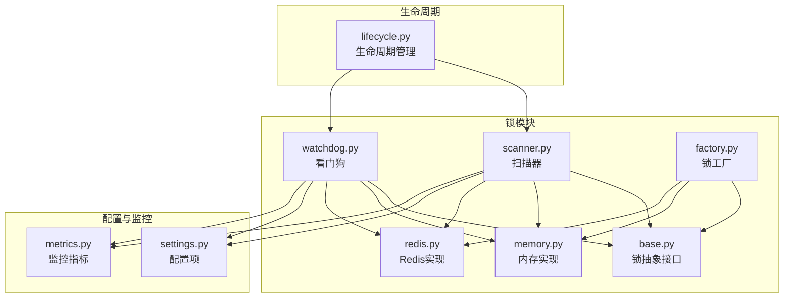
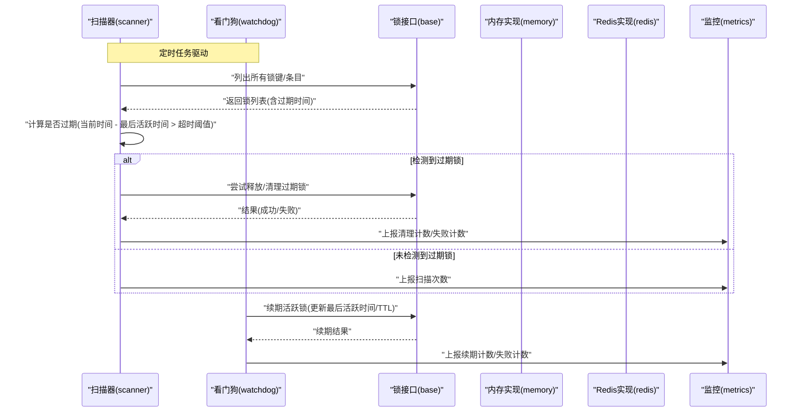
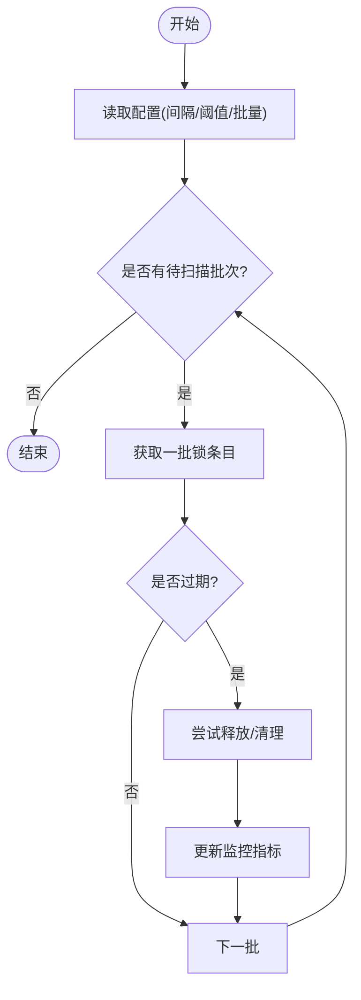
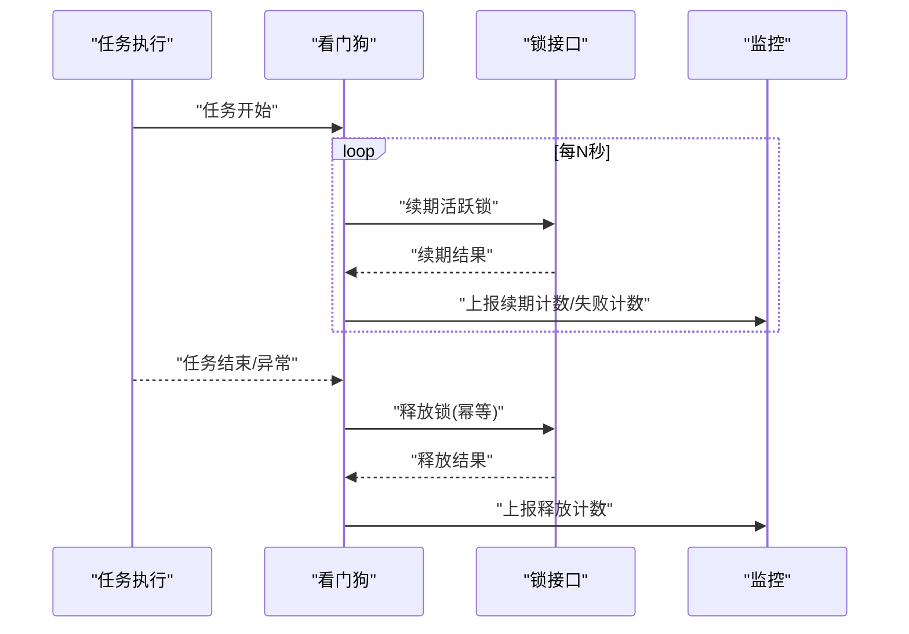
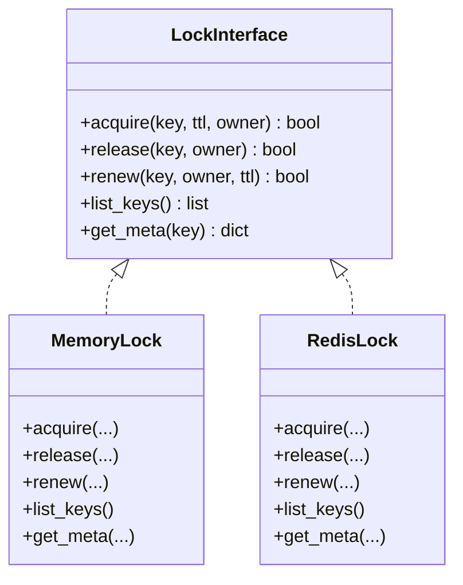
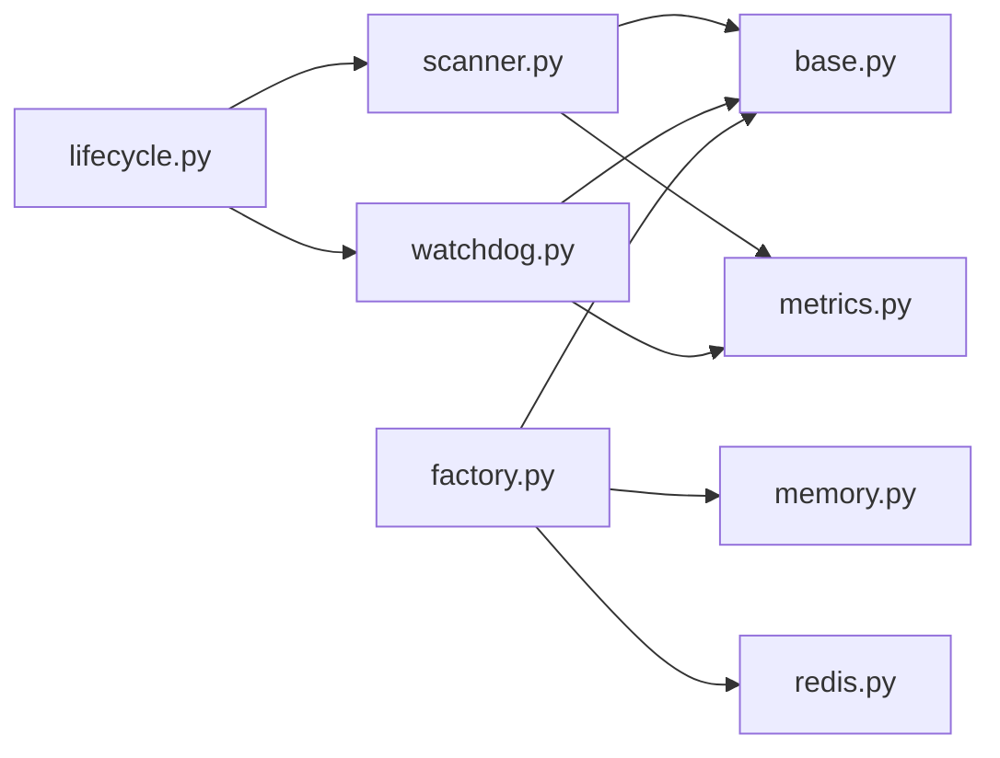

# 锁扫描器

<cite>
**本文引用的文件**   
- [src/neotask/lock/scanner.py](file://src/neotask/lock/scanner.py)
- [src/neotask/lock/watchdog.py](file://src/neotask/lock/watchdog.py)
- [src/neotask/lock/base.py](file://src/neotask/lock/base.py)
- [src/neotask/lock/memory.py](file://src/neotask/lock/memory.py)
- [src/neotask/lock/redis.py](file://src/neotask/lock/redis.py)
- [src/neotask/lock/factory.py](file://src/neotask/lock/factory.py)
- [src/neotask/config/settings.py](file://src/neotask/config/settings.py)
- [src/neotask/monitor/metrics.py](file://src/neotask/monitor/metrics.py)
- [src/neotask/core/lifecycle.py](file://src/neotask/core/lifecycle.py)
- [tests/distributed/test_redis_lock.py](file://tests/distributed/test_redis_lock.py)
</cite>

## 目录
1. [简介](#简介)
2. [项目结构](#项目结构)
3. [核心组件](#核心组件)
4. [架构总览](#架构总览)
5. [详细组件分析](#详细组件分析)
6. [依赖关系分析](#依赖关系分析)
7. [性能考虑](#性能考虑)
8. [故障诊断与排错指南](#故障诊断与排错指南)
9. [结论](#结论)
10. [附录](#附录)

## 简介
本文件围绕“锁扫描器”的功能与实现进行深入说明，重点覆盖：
- 过期锁检测、清理与回收机制
- 扫描器的调度策略与性能优化
- 配置选项与监控指标
- 锁泄漏检测与故障诊断方法

该能力主要位于锁模块的扫描器与看门狗组件中，并与存储后端（内存/Redis）及监控子系统协作。

## 项目结构
锁扫描器相关代码集中在 lock 子包内，关键文件如下：
- scanner.py：扫描器主逻辑，负责周期性地发现并处理过期锁
- watchdog.py：看门狗，用于在任务执行期间续期或终止异常锁
- base.py：锁抽象接口定义
- memory.py / redis.py：具体存储实现（内存/Redis）
- factory.py：锁工厂，按配置选择具体实现
- settings.py：全局配置项（含扫描器参数）
- metrics.py：监控指标采集
- lifecycle.py：生命周期管理（启动/停止扫描器等）

图表来源
- [src/neotask/lock/scanner.py](file://src/neotask/lock/scanner.py)
- [src/neotask/lock/watchdog.py](file://src/neotask/lock/watchdog.py)
- [src/neotask/lock/base.py](file://src/neotask/lock/base.py)
- [src/neotask/lock/memory.py](file://src/neotask/lock/memory.py)
- [src/neotask/lock/redis.py](file://src/neotask/lock/redis.py)
- [src/neotask/lock/factory.py](file://src/neotask/lock/factory.py)
- [src/neotask/config/settings.py](file://src/neotask/config/settings.py)
- [src/neotask/monitor/metrics.py](file://src/neotask/monitor/metrics.py)
- [src/neotask/core/lifecycle.py](file://src/neotask/core/lifecycle.py)

章节来源
- [src/neotask/lock/scanner.py](file://src/neotask/lock/scanner.py)
- [src/neotask/lock/watchdog.py](file://src/neotask/lock/watchdog.py)
- [src/neotask/lock/base.py](file://src/neotask/lock/base.py)
- [src/neotask/lock/memory.py](file://src/neotask/lock/memory.py)
- [src/neotask/lock/redis.py](file://src/neotask/lock/redis.py)
- [src/neotask/lock/factory.py](file://src/neotask/lock/factory.py)
- [src/neotask/config/settings.py](file://src/neotask/config/settings.py)
- [src/neotask/monitor/metrics.py](file://src/neotask/monitor/metrics.py)
- [src/neotask/core/lifecycle.py](file://src/neotask/core/lifecycle.py)

## 核心组件
- 锁抽象接口（base.py）：定义获取、释放、续期、查询等统一方法，屏蔽底层差异
- 存储实现（memory.py、redis.py）：提供不同后端的锁数据持久化与并发控制语义
- 锁工厂（factory.py）：根据配置动态创建对应实现的锁实例
- 扫描器（scanner.py）：周期性遍历锁集合，识别过期锁并触发清理/回收流程
- 看门狗（watchdog.py）：在执行过程中对活跃锁进行心跳续期，防止误判为过期
- 配置（settings.py）：集中管理扫描间隔、超时阈值、批量大小等参数
- 监控（metrics.py）：暴露扫描次数、清理数量、失败计数等指标
- 生命周期（lifecycle.py）：负责扫描器与看门狗的启动、停止与优雅关闭

章节来源
- [src/neotask/lock/base.py](file://src/neotask/lock/base.py)
- [src/neotask/lock/memory.py](file://src/neotask/lock/memory.py)
- [src/neotask/lock/redis.py](file://src/neotask/lock/redis.py)
- [src/neotask/lock/factory.py](file://src/neotask/lock/factory.py)
- [src/neotask/lock/scanner.py](file://src/neotask/lock/scanner.py)
- [src/neotask/lock/watchdog.py](file://src/neotask/lock/watchdog.py)
- [src/neotask/config/settings.py](file://src/neotask/config/settings.py)
- [src/neotask/monitor/metrics.py](file://src/neotask/monitor/metrics.py)
- [src/neotask/core/lifecycle.py](file://src/neotask/core/lifecycle.py)

## 架构总览
下图展示了扫描器与看门狗如何协同工作，以及它们与存储后端和监控系统的交互关系。

图表来源
- [src/neotask/lock/scanner.py](file://src/neotask/lock/scanner.py)
- [src/neotask/lock/watchdog.py](file://src/neotask/lock/watchdog.py)
- [src/neotask/lock/base.py](file://src/neotask/lock/base.py)
- [src/neotask/lock/memory.py](file://src/neotask/lock/memory.py)
- [src/neotask/lock/redis.py](file://src/neotask/lock/redis.py)
- [src/neotask/monitor/metrics.py](file://src/neotask/monitor/metrics.py)

## 详细组件分析

### 扫描器（scanner.py）
- 功能职责
  - 周期性扫描锁集合，识别过期锁
  - 调用锁接口的清理/释放方法完成回收
  - 记录并上报扫描与清理相关的监控指标
- 关键流程
  - 读取配置中的扫描间隔、超时阈值、批量大小等参数
  - 遍历锁条目，比较当前时间与最后活跃时间判断是否过期
  - 对过期锁执行释放/删除操作，统计成功与失败数量
  - 将统计信息上报至监控系统
- 错误处理
  - 对单次扫描/清理过程中的异常进行捕获与重试（可配置）
  - 记录失败原因，便于后续定位问题
- 性能优化
  - 支持分批扫描，避免一次性加载全部锁导致内存峰值
  - 可配置并发度，平衡吞吐与资源占用
  - 使用惰性查询与过滤条件减少无效遍历

图表来源
- [src/neotask/lock/scanner.py](file://src/neotask/lock/scanner.py)
- [src/neotask/monitor/metrics.py](file://src/neotask/monitor/metrics.py)

章节来源
- [src/neotask/lock/scanner.py](file://src/neotask/lock/scanner.py)
- [src/neotask/monitor/metrics.py](file://src/neotask/monitor/metrics.py)

### 看门狗（watchdog.py）
- 功能职责
  - 在任务执行期间对活跃锁进行心跳续期，避免被扫描器误判为过期
  - 在任务异常退出时主动释放锁，降低泄漏风险
- 关键流程
  - 注册任务生命周期钩子（开始/结束/异常）
  - 定期续期活跃锁，更新最后活跃时间或TTL
  - 上报续期成功/失败计数
- 错误处理
  - 续期失败时记录日志并上报指标，必要时触发告警
  - 任务异常时确保幂等释放，避免重复释放导致的副作用

图表来源
- [src/neotask/lock/watchdog.py](file://src/neotask/lock/watchdog.py)
- [src/neotask/lock/base.py](file://src/neotask/lock/base.py)
- [src/neotask/monitor/metrics.py](file://src/neotask/monitor/metrics.py)

章节来源
- [src/neotask/lock/watchdog.py](file://src/neotask/lock/watchdog.py)
- [src/neotask/monitor/metrics.py](file://src/neotask/monitor/metrics.py)

### 锁抽象与存储实现（base.py、memory.py、redis.py）
- 抽象接口（base.py）
  - 定义统一的获取、释放、续期、查询等方法
  - 约定锁元数据字段（如持有者、最后活跃时间、超时阈值等）
- 内存实现（memory.py）
  - 基于进程内数据结构，适合单机测试与轻量场景
  - 注意线程安全与并发访问保护
- Redis实现（redis.py）
  - 利用Redis原子性与TTL特性实现分布式锁
  - 通过过期时间或心跳续期保证锁的生命周期
  - 关注网络延迟与连接池配置

图表来源
- [src/neotask/lock/base.py](file://src/neotask/lock/base.py)
- [src/neotask/lock/memory.py](file://src/neotask/lock/memory.py)
- [src/neotask/lock/redis.py](file://src/neotask/lock/redis.py)

章节来源
- [src/neotask/lock/base.py](file://src/neotask/lock/base.py)
- [src/neotask/lock/memory.py](file://src/neotask/lock/memory.py)
- [src/neotask/lock/redis.py](file://src/neotask/lock/redis.py)

### 锁工厂（factory.py）
- 根据配置选择具体锁实现（内存/Redis）
- 负责初始化与注入必要依赖（如连接池、超时配置）
- 对外暴露统一的创建接口，简化上层调用

章节来源
- [src/neotask/lock/factory.py](file://src/neotask/lock/factory.py)

### 配置与监控（settings.py、metrics.py）
- 配置项（settings.py）
  - 扫描间隔、超时阈值、批量大小、并发度、重试策略等
- 监控指标（metrics.py）
  - 扫描次数、清理数量、失败计数、续期计数、锁泄漏告警等

章节来源
- [src/neotask/config/settings.py](file://src/neotask/config/settings.py)
- [src/neotask/monitor/metrics.py](file://src/neotask/monitor/metrics.py)

### 生命周期管理（lifecycle.py）
- 负责扫描器与看门狗的启动、停止与优雅关闭
- 在应用生命周期事件中协调各组件状态，避免资源泄露

章节来源
- [src/neotask/core/lifecycle.py](file://src/neotask/core/lifecycle.py)

## 依赖关系分析
- 耦合关系
  - 扫描器与看门狗均依赖锁抽象接口，屏蔽底层差异
  - 扫描器与看门狗共同依赖监控模块以输出指标
  - 工厂模块解耦了具体实现的选择逻辑
- 外部依赖
  - Redis实现依赖Redis客户端与连接池
  - 监控可能对接Prometheus或其他指标系统

图表来源
- [src/neotask/lock/scanner.py](file://src/neotask/lock/scanner.py)
- [src/neotask/lock/watchdog.py](file://src/neotask/lock/watchdog.py)
- [src/neotask/lock/base.py](file://src/neotask/lock/base.py)
- [src/neotask/lock/memory.py](file://src/neotask/lock/memory.py)
- [src/neotask/lock/redis.py](file://src/neotask/lock/redis.py)
- [src/neotask/lock/factory.py](file://src/neotask/lock/factory.py)
- [src/neotask/monitor/metrics.py](file://src/neotask/monitor/metrics.py)
- [src/neotask/core/lifecycle.py](file://src/neotask/core/lifecycle.py)

章节来源
- [src/neotask/lock/scanner.py](file://src/neotask/lock/scanner.py)
- [src/neotask/lock/watchdog.py](file://src/neotask/lock/watchdog.py)
- [src/neotask/lock/base.py](file://src/neotask/lock/base.py)
- [src/neotask/lock/memory.py](file://src/neotask/lock/memory.py)
- [src/neotask/lock/redis.py](file://src/neotask/lock/redis.py)
- [src/neotask/lock/factory.py](file://src/neotask/lock/factory.py)
- [src/neotask/monitor/metrics.py](file://src/neotask/monitor/metrics.py)
- [src/neotask/core/lifecycle.py](file://src/neotask/core/lifecycle.py)

## 性能考虑
- 批量与分页
  - 采用分批扫描与惰性查询，降低内存峰值与IO压力
- 并发控制
  - 合理设置并发度，避免过度竞争与上下文切换开销
- 超时与重试
  - 针对网络抖动与后端不稳定，配置合理的超时与重试策略
- 指标采样
  - 对高频指标进行采样聚合，降低监控写入成本
- 存储层优化
  - Redis端使用合适的TTL与原子操作，减少额外查询与竞态

[本节为通用指导，不直接分析具体文件]

## 故障诊断与排错指南
- 常见问题
  - 锁未被释放：检查任务异常路径是否正确释放锁；查看看门狗续期与释放日志
  - 误判过期：核对超时阈值与心跳间隔配置；确认时钟同步与网络延迟
  - 扫描器卡顿：调整批量大小与并发度；检查存储后端健康状态
- 定位步骤
  - 查看监控指标：扫描次数、清理数量、失败计数、续期计数
  - 检查配置：扫描间隔、超时阈值、批量大小、并发度
  - 复现与验证：使用单元测试或集成测试模拟异常场景
- 参考用例
  - 分布式锁测试用例可作为行为验证与回归测试参考

章节来源
- [tests/distributed/test_redis_lock.py](file://tests/distributed/test_redis_lock.py)

## 结论
锁扫描器与看门狗共同构成了健壮的死锁与过期锁治理体系。通过合理的配置与监控，可以有效降低锁泄漏风险，提升系统稳定性。建议在生产环境中持续观测相关指标，并结合业务特征调优扫描策略与超时参数。

[本节为总结性内容，不直接分析具体文件]

## 附录
- 配置清单（示例字段）
  - 扫描间隔：控制扫描频率
  - 超时阈值：判定锁过期的时间窗口
  - 批量大小：每次扫描处理的锁数量
  - 并发度：并行处理上限
  - 重试策略：失败重试次数与退避间隔
- 监控指标（示例）
  - 扫描次数、清理数量、失败计数
  - 续期计数、续期失败计数
  - 锁泄漏告警计数
- 最佳实践
  - 为长耗时任务配置更短的心跳间隔
  - 对高QPS场景启用批量与采样
  - 结合链路追踪定位异常锁来源

[本节为补充信息，不直接分析具体文件]