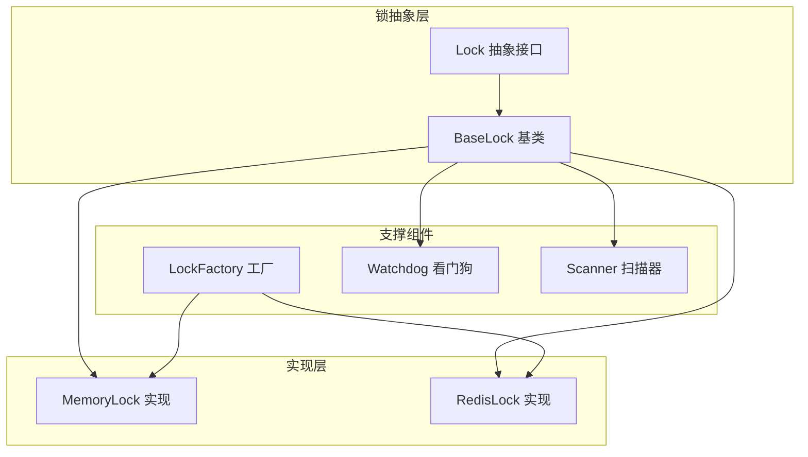
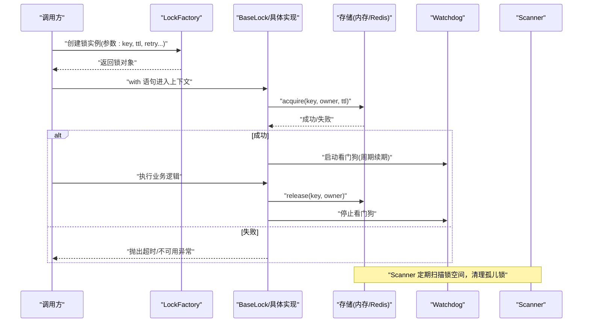
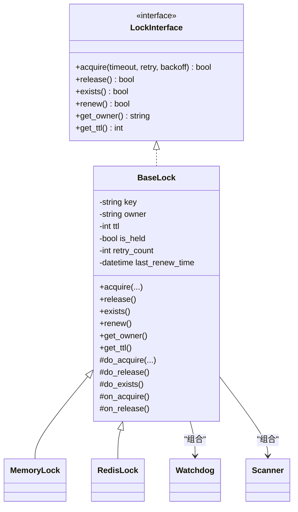
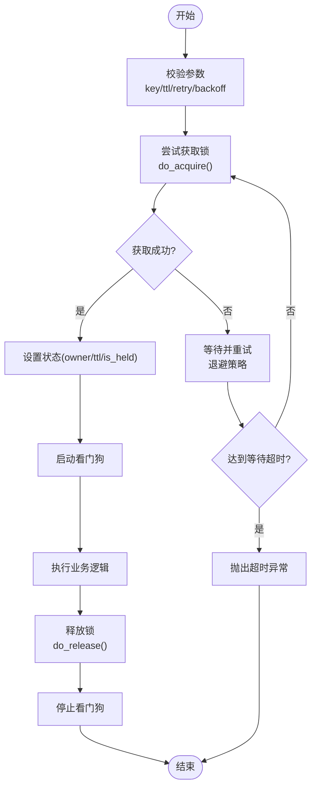
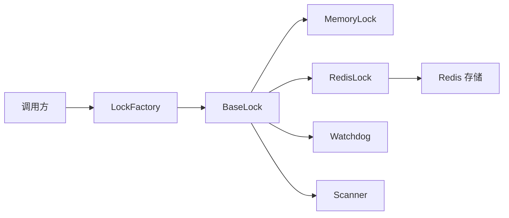

# 锁抽象接口

<cite>
**本文引用的文件**   
- [src/neotask/lock/base.py](file://src/neotask/lock/base.py)
- [src/neotask/lock/memory.py](file://src/neotask/lock/memory.py)
- [src/neotask/lock/redis.py](file://src/neotask/lock/redis.py)
- [src/neotask/lock/factory.py](file://src/neotask/lock/factory.py)
- [src/neotask/lock/watchdog.py](file://src/neotask/lock/watchdog.py)
- [src/neotask/lock/scanner.py](file://src/neotask/lock/scanner.py)
- [tests/distributed/test_distributed_lock.py](file://tests/distributed/test_distributed_lock.py)
- [tests/distributed/test_redis_lock.py](file://tests/distributed/test_redis_lock.py)
</cite>

## 目录
1. [简介](#简介)
2. [项目结构](#项目结构)
3. [核心组件](#核心组件)
4. [架构总览](#架构总览)
5. [详细组件分析](#详细组件分析)
6. [依赖分析](#依赖分析)
7. [性能考虑](#性能考虑)
8. [故障排查指南](#故障排查指南)
9. [结论](#结论)
10. [附录](#附录)

## 简介
本文件聚焦于分布式锁的抽象接口设计，围绕 BaseLock 基类的核心方法与扩展点展开，系统阐述锁状态管理、超时处理与重试机制的设计模式，并提供自定义锁实现的开发指南与最佳实践。同时给出接口设计的扩展性考量与性能优化建议，帮助读者在保持统一抽象的前提下，灵活适配不同存储后端（如内存、Redis）并实现高可用与高性能的分布式锁能力。

## 项目结构
锁子系统位于 src/neotask/lock 目录下，采用“抽象基类 + 多后端实现 + 工厂 + 辅助组件”的分层组织方式：
- base.py：定义 Lock 抽象接口与 BaseLock 基类，提供通用流程编排、超时与重试策略、上下文管理与生命周期钩子等。
- memory.py：基于进程内数据结构的本地锁实现，适用于单进程或测试场景。
- redis.py：基于 Redis 的分布式锁实现，支持原子操作、过期时间、看门狗续期等。
- factory.py：根据配置动态创建具体锁实例，屏蔽后端差异。
- watchdog.py：看门狗组件，负责在持有锁期间自动续期，防止业务执行过长导致锁提前释放。
- scanner.py：扫描器组件，用于清理过期锁、统计锁状态或发现异常节点持有的锁。

图表来源
- [src/neotask/lock/base.py](file://src/neotask/lock/base.py)
- [src/neotask/lock/memory.py](file://src/neotask/lock/memory.py)
- [src/neotask/lock/redis.py](file://src/neotask/lock/redis.py)
- [src/neotask/lock/factory.py](file://src/neotask/lock/factory.py)
- [src/neotask/lock/watchdog.py](file://src/neotask/lock/watchdog.py)
- [src/neotask/lock/scanner.py](file://src/neotask/lock/scanner.py)

章节来源
- [src/neotask/lock/base.py](file://src/neotask/lock/base.py)
- [src/neotask/lock/memory.py](file://src/neotask/lock/memory.py)
- [src/neotask/lock/redis.py](file://src/neotask/lock/redis.py)
- [src/neotask/lock/factory.py](file://src/neotask/lock/factory.py)
- [src/neotask/lock/watchdog.py](file://src/neotask/lock/watchdog.py)
- [src/neotask/lock/scanner.py](file://src/neotask/lock/scanner.py)

## 核心组件
本节从抽象到实现，梳理锁的核心方法、状态模型与关键扩展点。

- 抽象接口与基类职责
  - 抽象接口定义：acquire、release、exists 等基础操作；可选的 get_owner、get_ttl、renew 等增强能力。
  - BaseLock 基类：封装通用流程编排（加锁前校验、幂等检查、超时控制、重试策略）、上下文管理器协议、生命周期钩子（on_acquire/on_release）、错误归一化与指标埋点入口。
  - 状态管理：内部维护锁键、所有者标识、TTL、是否已持有、重试次数、最后续期时间等元信息。
  - 超时与重试：可配置的等待超时、单次获取超时、最大重试次数、退避策略（固定/指数/抖动）。
  - 扩展点：do_acquire/do_release/do_exists 等受保护方法供子类实现；hook 钩子用于注入监控、审计、事件发布等横切逻辑。

- 典型实现要点
  - MemoryLock：使用进程内字典/集合记录锁键与所有者，适合单元测试与单机场景。
  - RedisLock：利用 SET NX EX/PX、原子删除（Lua）等原语保证跨进程安全；结合看门狗进行续期；通过 TTL 避免死锁。
  - Watchdog：后台协程周期性调用 renew，确保长时间任务不会因锁过期被抢占。
  - Scanner：定时扫描锁空间，识别孤儿锁、统计分布、触发告警或自愈。

章节来源
- [src/neotask/lock/base.py](file://src/neotask/lock/base.py)
- [src/neotask/lock/memory.py](file://src/neotask/lock/memory.py)
- [src/neotask/lock/redis.py](file://src/neotask/lock/redis.py)
- [src/neotask/lock/watchdog.py](file://src/neotask/lock/watchdog.py)
- [src/neotask/lock/scanner.py](file://src/neotask/lock/scanner.py)

## 架构总览
下图展示了客户端通过工厂获取锁实例，并在上下文中完成加锁、业务执行、自动续期与释放的完整流程。

图表来源
- [src/neotask/lock/factory.py](file://src/neotask/lock/factory.py)
- [src/neotask/lock/base.py](file://src/neotask/lock/base.py)
- [src/neotask/lock/redis.py](file://src/neotask/lock/redis.py)
- [src/neotask/lock/watchdog.py](file://src/neotask/lock/watchdog.py)
- [src/neotask/lock/scanner.py](file://src/neotask/lock/scanner.py)

## 详细组件分析

### BaseLock 基类与抽象接口
- 关键方法
  - acquire：尝试获取锁，支持等待超时、重试与退避；成功后设置所有者与 TTL，并启动看门狗。
  - release：按所有者幂等释放锁，停止看门狗，清理状态。
  - exists：查询锁是否存在（不阻塞），常用于探测与诊断。
  - renew：续期当前锁的 TTL，由看门狗周期性调用。
  - get_owner/get_ttl：读取当前锁的所有者与剩余 TTL。
- 状态与生命周期
  - 内部状态包括：key、owner、ttl、is_held、retry_count、last_renew_time 等。
  - 生命周期钩子：on_acquire/on_release 允许注入监控、审计、事件等横切逻辑。
- 超时与重试
  - 等待超时：整体获取的最大耗时。
  - 单次获取超时：每次尝试的原子操作超时。
  - 重试策略：最大重试次数、退避算法（固定/指数/抖动）。
- 扩展点
  - do_acquire/do_release/do_exists/renew：受保护的模板方法，子类按需覆盖。
  - hook 钩子：便于接入日志、指标、链路追踪。

图表来源
- [src/neotask/lock/base.py](file://src/neotask/lock/base.py)
- [src/neotask/lock/memory.py](file://src/neotask/lock/memory.py)
- [src/neotask/lock/redis.py](file://src/neotask/lock/redis.py)
- [src/neotask/lock/watchdog.py](file://src/neotask/lock/watchdog.py)
- [src/neotask/lock/scanner.py](file://src/neotask/lock/scanner.py)

章节来源
- [src/neotask/lock/base.py](file://src/neotask/lock/base.py)

### MemoryLock 实现
- 适用场景：单进程、单元测试、快速原型验证。
- 核心特性：
  - 使用进程内数据结构记录锁键与所有者。
  - 无网络开销，延迟极低。
  - 不支持跨进程/跨机器互斥。
- 注意事项：
  - 进程退出后锁立即失效，无需显式释放。
  - 不适合生产环境的多实例部署。

章节来源
- [src/neotask/lock/memory.py](file://src/neotask/lock/memory.py)

### RedisLock 实现
- 适用场景：多进程/多机分布式环境，需要强一致互斥。
- 核心特性：
  - 使用原子 SET NX EX/PX 加锁，Lua 脚本原子删除，避免误删他人锁。
  - 支持 TTL 与续期，结合看门狗保障长任务安全。
  - 可通过配置调整超时、重试、退避策略。
- 注意事项：
  - 时钟漂移与网络抖动可能影响精确性，需合理设置 TTL 与续期间隔。
  - 建议在集群模式下关注主从切换期间的短暂不一致。

章节来源
- [src/neotask/lock/redis.py](file://src/neotask/lock/redis.py)

### Watchdog 看门狗
- 职责：在锁持有期间周期性调用 renew，防止业务执行时间超过 TTL 导致锁被意外释放。
- 行为：
  - 启动时机：成功 acquire 后。
  - 停止时机：release 或异常退出上下文时。
  - 续期策略：按固定周期或自适应周期调用 renew。
- 风险与防护：
  - 避免频繁续期造成额外负载。
  - 在异常路径中确保看门狗及时停止，防止资源泄漏。

章节来源
- [src/neotask/lock/watchdog.py](file://src/neotask/lock/watchdog.py)

### Scanner 扫描器
- 职责：定期扫描锁空间，识别孤儿锁、统计分布、触发告警或自愈。
- 常见动作：
  - 清理过期且无人续期的锁。
  - 收集锁占用率、热点键等指标。
  - 发现异常节点持有的锁并上报。

章节来源
- [src/neotask/lock/scanner.py](file://src/neotask/lock/scanner.py)

### LockFactory 工厂
- 职责：根据配置或运行时参数创建具体锁实例（MemoryLock/RedisLock）。
- 优势：
  - 屏蔽后端差异，统一 API。
  - 便于在测试与生产之间切换实现。

章节来源
- [src/neotask/lock/factory.py](file://src/neotask/lock/factory.py)

### 加锁时序与重试流程

图表来源
- [src/neotask/lock/base.py](file://src/neotask/lock/base.py)
- [src/neotask/lock/redis.py](file://src/neotask/lock/redis.py)
- [src/neotask/lock/watchdog.py](file://src/neotask/lock/watchdog.py)

## 依赖分析
- 组件耦合
  - BaseLock 作为核心抽象，向上暴露稳定接口，向下组合 Watchdog/Scanner，并通过模板方法交由具体实现完成底层细节。
  - MemoryLock/RedisLock 仅依赖各自存储后端，对上层透明。
  - Factory 解耦了客户端与具体实现的选择。
- 外部依赖
  - RedisLock 依赖 Redis 客户端与 Lua 脚本能力。
  - Watchdog/Scanner 依赖调度器或事件循环以周期性执行。
- 潜在循环依赖
  - 通过组合而非继承引入 Watchdog/Scanner，避免循环引用。

图表来源
- [src/neotask/lock/factory.py](file://src/neotask/lock/factory.py)
- [src/neotask/lock/base.py](file://src/neotask/lock/base.py)
- [src/neotask/lock/memory.py](file://src/neotask/lock/memory.py)
- [src/neotask/lock/redis.py](file://src/neotask/lock/redis.py)
- [src/neotask/lock/watchdog.py](file://src/neotask/lock/watchdog.py)
- [src/neotask/lock/scanner.py](file://src/neotask/lock/scanner.py)

章节来源
- [src/neotask/lock/factory.py](file://src/neotask/lock/factory.py)
- [src/neotask/lock/base.py](file://src/neotask/lock/base.py)
- [src/neotask/lock/memory.py](file://src/neotask/lock/memory.py)
- [src/neotask/lock/redis.py](file://src/neotask/lock/redis.py)
- [src/neotask/lock/watchdog.py](file://src/neotask/lock/watchdog.py)
- [src/neotask/lock/scanner.py](file://src/neotask/lock/scanner.py)

## 性能考虑
- 减少不必要的重试
  - 合理设置等待超时与最大重试次数，避免雪崩效应。
  - 使用指数退避+抖动降低竞争集中。
- 缩短临界区
  - 将耗时操作移出锁范围，尽量只保护必要的共享资源访问。
- 续期策略调优
  - 根据业务 SLA 调整 TTL 与续期间隔，避免频繁网络往返。
- 批量与合并
  - 在高并发下，适当合并请求或采用队列化策略降低锁竞争。
- 观测与限流
  - 通过 on_acquire/on_release 钩子采集指标，结合熔断/降级策略保护后端。

[本节为通用指导，不涉及具体文件]

## 故障排查指南
- 常见问题
  - 锁未释放：检查 release 是否在 finally 分支调用；确认看门狗是否正确停止。
  - 误删他人锁：确保 release 使用原子删除并校验所有者。
  - 锁过早过期：增大 TTL 或缩短续期间隔；检查时钟同步。
  - 重试风暴：降低重试频率、增加退避抖动、限制全局重试上限。
- 定位手段
  - 使用 exists 探测锁状态与所有者。
  - 借助 Scanner 输出孤儿锁与热点键。
  - 通过钩子埋点记录加锁/释放/续期轨迹。

章节来源
- [src/neotask/lock/base.py](file://src/neotask/lock/base.py)
- [src/neotask/lock/redis.py](file://src/neotask/lock/redis.py)
- [src/neotask/lock/watchdog.py](file://src/neotask/lock/watchdog.py)
- [src/neotask/lock/scanner.py](file://src/neotask/lock/scanner.py)

## 结论
通过统一的抽象接口与 BaseLock 基类，本项目实现了可扩展、可观测、可运维的分布式锁体系。MemoryLock 与 RedisLock 分别满足单机与分布式场景；Watchdog 与 Scanner 提供了健壮性与可观测性保障；Factory 则简化了集成与切换成本。遵循本文的开发指南与最佳实践，可在保持接口稳定的前提下持续演进锁能力，兼顾正确性、性能与可维护性。

[本节为总结性内容，不涉及具体文件]

## 附录

### 自定义锁实现开发指南
- 步骤
  - 继承 BaseLock，实现 do_acquire/do_release/do_exists/renew 等受保护方法。
  - 在 do_acquire 中完成原子加锁与所有权标记；在 do_release 中完成幂等释放。
  - 若需要持久化状态，确保与 TTL/续期语义一致。
  - 在 on_acquire/on_release 中注入监控与审计。
- 最佳实践
  - 严格校验所有者，避免误删。
  - 合理设置超时与重试，防止雪崩。
  - 在异常路径中确保资源清理（停止看门狗、关闭连接）。
  - 编写充分的单元测试与集成测试，覆盖竞态与异常路径。

章节来源
- [src/neotask/lock/base.py](file://src/neotask/lock/base.py)

### 接口设计与扩展性
- 稳定性
  - 对外暴露最小必要接口，内部通过模板方法与钩子扩展。
- 可替换性
  - 通过 Factory 与依赖注入，轻松替换后端实现。
- 可观测性
  - 钩子与指标埋点贯穿生命周期，便于问题定位与容量规划。

章节来源
- [src/neotask/lock/base.py](file://src/neotask/lock/base.py)
- [src/neotask/lock/factory.py](file://src/neotask/lock/factory.py)

### 参考用例与测试
- 分布式锁端到端测试：验证多进程/多机下的互斥与恢复。
- Redis 锁专项测试：覆盖续期、误删防护、超时与重试路径。

章节来源
- [tests/distributed/test_distributed_lock.py](file://tests/distributed/test_distributed_lock.py)
- [tests/distributed/test_redis_lock.py](file://tests/distributed/test_redis_lock.py)