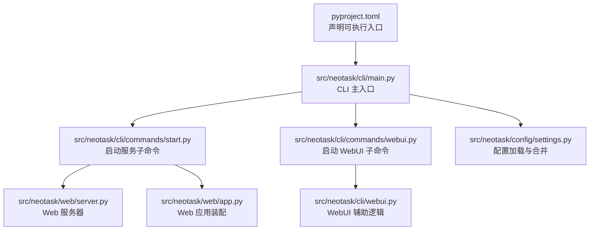
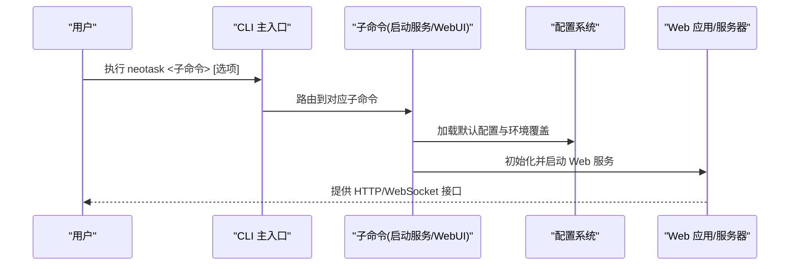
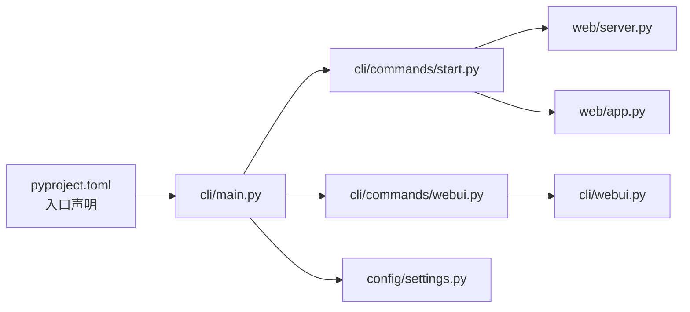

# 命令行工具

<cite>
**本文引用的文件**   
- [src/neotask/cli/main.py](file://src/neotask/cli/main.py)
- [src/neotask/cli/commands/start.py](file://src/neotask/cli/commands/start.py)
- [src/neotask/cli/commands/webui.py](file://src/neotask/cli/commands/webui.py)
- [src/neotask/cli/webui.py](file://src/neotask/cli/webui.py)
- [src/neotask/config/settings.py](file://src/neotask/config/settings.py)
- [src/neotask/web/app.py](file://src/neotask/web/app.py)
- [src/neotask/web/server.py](file://src/neotask/web/server.py)
- [pyproject.toml](file://pyproject.toml)
</cite>

## 目录
1. [简介](#简介)
2. [项目结构](#项目结构)
3. [核心组件](#核心组件)
4. [架构总览](#架构总览)
5. [详细组件分析](#详细组件分析)
6. [依赖关系分析](#依赖关系分析)
7. [性能与扩展性](#性能与扩展性)
8. [故障排查指南](#故障排查指南)
9. [结论](#结论)
10. [附录：CLI 命令速查](#附录cli-命令速查)

## 简介
本章节面向使用命令行工具的用户，聚焦以下目标：
- 启动任务调度服务（后台进程）
- 启动 Web 管理界面
- 交互式界面的操作方法与快捷键
- 批量操作、配置管理与脚本自动化
- 部署集成与自动化运维最佳实践

该 CLI 工具基于 Python 包入口与子命令组织，提供“启动服务”和“启动 WebUI”两类常用能力，并通过配置文件统一管理运行时参数。

## 项目结构
与 CLI 相关的代码主要位于 src/neotask/cli 目录下，包含主入口、子命令实现以及 WebUI 的辅助模块；Web 服务由 src/neotask/web 提供；全局配置由 src/neotask/config 提供；包入口在 pyproject.toml 中声明。

图表来源
- [pyproject.toml](file://pyproject.toml)
- [src/neotask/cli/main.py](file://src/neotask/cli/main.py)
- [src/neotask/cli/commands/start.py](file://src/neotask/cli/commands/start.py)
- [src/neotask/cli/commands/webui.py](file://src/neotask/cli/commands/webui.py)
- [src/neotask/cli/webui.py](file://src/neotask/cli/webui.py)
- [src/neotask/web/server.py](file://src/neotask/web/server.py)
- [src/neotask/web/app.py](file://src/neotask/web/app.py)
- [src/neotask/config/settings.py](file://src/neotask/config/settings.py)

章节来源
- [src/neotask/cli/main.py](file://src/neotask/cli/main.py)
- [src/neotask/cli/commands/start.py](file://src/neotask/cli/commands/start.py)
- [src/neotask/cli/commands/webui.py](file://src/neotask/cli/commands/webui.py)
- [src/neotask/cli/webui.py](file://src/neotask/cli/webui.py)
- [src/neotask/config/settings.py](file://src/neotask/config/settings.py)
- [src/neotask/web/app.py](file://src/neotask/web/app.py)
- [src/neotask/web/server.py](file://src/neotask/web/server.py)
- [pyproject.toml](file://pyproject.toml)

## 核心组件
- CLI 主入口：负责解析顶层命令与子命令，并分发到具体实现。
- 启动服务子命令：用于以守护进程方式运行任务调度服务，支持通过配置项控制端口、存储、队列等。
- 启动 WebUI 子命令：用于启动 Web 管理界面，便于可视化查看任务状态、节点信息、统计指标等。
- Web 服务：基于内置或第三方 ASGI/WSGI 服务器提供 HTTP/WebSocket 接口。
- 配置系统：集中管理默认配置与用户覆盖配置，支持环境变量与配置文件两种来源。

章节来源
- [src/neotask/cli/main.py](file://src/neotask/cli/main.py)
- [src/neotask/cli/commands/start.py](file://src/neotask/cli/commands/start.py)
- [src/neotask/cli/commands/webui.py](file://src/neotask/cli/commands/webui.py)
- [src/neotask/web/server.py](file://src/neotask/web/server.py)
- [src/neotask/web/app.py](file://src/neotask/web/app.py)
- [src/neotask/config/settings.py](file://src/neotask/config/settings.py)

## 架构总览
下图展示了从 CLI 到 Web 服务的调用链路与关键模块职责。

图表来源
- [src/neotask/cli/main.py](file://src/neotask/cli/main.py)
- [src/neotask/cli/commands/start.py](file://src/neotask/cli/commands/start.py)
- [src/neotask/cli/commands/webui.py](file://src/neotask/cli/commands/webui.py)
- [src/neotask/config/settings.py](file://src/neotask/config/settings.py)
- [src/neotask/web/server.py](file://src/neotask/web/server.py)
- [src/neotask/web/app.py](file://src/neotask/web/app.py)

## 详细组件分析

### CLI 主入口与子命令注册
- 功能要点
  - 解析顶层命令与子命令
  - 将通用选项（如日志级别、配置路径）传递给子命令
  - 统一错误处理与退出码
- 交互提示
  - 未提供子命令时显示帮助与可用子命令列表
  - 子命令缺少必要参数时给出明确提示

章节来源
- [src/neotask/cli/main.py](file://src/neotask/cli/main.py)

### 启动服务子命令（后台任务调度）
- 功能要点
  - 启动任务调度器与执行器
  - 绑定 Web 管理端点（可选）
  - 支持通过配置项调整并发、重试、持久化等
- 典型用法
  - 直接启动：neotask start
  - 指定配置：neotask start --config /path/to/config.yaml
  - 指定端口：neotask start --port 8080
  - 指定日志级别：neotask start --log-level INFO
- 关键参数说明
  - --config：配置文件路径
  - --port：Web 服务监听端口
  - --log-level：日志级别（DEBUG/INFO/WARNING/ERROR）
  - --workers：工作进程/线程数（视实现而定）
  - --storage：存储后端选择（memory/sqlite/redis 等）
  - --queue：队列后端选择（memory/priority/delayed 等）
  - --lock：分布式锁后端（memory/redis 等）
  - --host：Web 服务监听地址（默认 0.0.0.0）
  - --daemon：是否以守护进程模式运行（若实现支持）
- 注意事项
  - 端口冲突时会抛出异常并退出
  - 存储/队列/锁后端需正确安装依赖
  - 生产环境建议启用持久化与监控

章节来源
- [src/neotask/cli/commands/start.py](file://src/neotask/cli/commands/start.py)
- [src/neotask/config/settings.py](file://src/neotask/config/settings.py)

### 启动 WebUI 子命令（Web 管理界面）
- 功能要点
  - 启动轻量级 Web 服务，提供任务、节点、统计等页面
  - 支持 WebSocket 实时推送
- 典型用法
  - 直接启动：neotask webui
  - 指定端口：neotask webui --port 8080
  - 指定主机：neotask webui --host 0.0.0.0
  - 指定配置：neotask webui --config /path/to/config.yaml
- 关键参数说明
  - --port：Web 服务监听端口
  - --host：Web 服务监听地址
  - --config：配置文件路径
  - --reload：开发模式下自动重载（若实现支持）
- 访问方式
  - 浏览器打开 http://localhost:<port>/ 或 http://<host>:<port>/

章节来源
- [src/neotask/cli/commands/webui.py](file://src/neotask/cli/commands/webui.py)
- [src/neotask/cli/webui.py](file://src/neotask/cli/webui.py)
- [src/neotask/web/server.py](file://src/neotask/web/server.py)
- [src/neotask/web/app.py](file://src/neotask/web/app.py)

### Web 服务与应用装配
- 功能要点
  - 组装路由、中间件、静态资源与 WebSocket 处理器
  - 根据配置动态启用/禁用特性（如 Prometheus 指标、鉴权等）
- 关键模块
  - server：负责创建并启动 HTTP/WS 服务器
  - app：负责挂载路由与业务逻辑

章节来源
- [src/neotask/web/server.py](file://src/neotask/web/server.py)
- [src/neotask/web/app.py](file://src/neotask/web/app.py)

### 配置系统
- 功能要点
  - 提供默认配置与用户覆盖配置合并机制
  - 支持从环境变量注入配置项
  - 为 CLI 与 Web 服务提供一致的配置视图
- 常见配置项
  - web.host、web.port：Web 服务监听地址与端口
  - log.level：日志级别
  - storage.type、storage.*：存储后端及连接参数
  - queue.type、queue.*：队列后端及连接参数
  - lock.type、lock.*：分布式锁后端及连接参数
  - workers：并发度相关设置
- 优先级
  - 命令行参数 > 配置文件 > 环境变量 > 默认值

章节来源
- [src/neotask/config/settings.py](file://src/neotask/config/settings.py)

### 交互式界面与快捷键
- 启动后通过浏览器访问 WebUI
- 常用操作
  - 任务列表：查看任务状态、重试次数、最近执行时间
  - 任务详情：查看输入输出、错误堆栈、执行上下文
  - 节点管理：查看在线节点、负载与健康状态
  - 统计面板：查看吞吐、延迟、失败率等指标
- 快捷键（若前端实现支持）
  - 刷新：R 或 Ctrl+R
  - 搜索：Ctrl+F
  - 全屏：F11
  - 切换主题：Ctrl+Shift+T（若实现支持）
- 提示
  - 若页面无法加载，检查端口占用与防火墙规则
  - 若 WebSocket 断连，检查跨域与代理配置

章节来源
- [src/neotask/cli/commands/webui.py](file://src/neotask/cli/commands/webui.py)
- [src/neotask/web/app.py](file://src/neotask/web/app.py)

### 批量操作与脚本自动化
- 批量启停
  - 通过 shell 循环调用 CLI 启动不同实例（多端口、多配置）
  - 结合 systemd/supervisor 进行进程管理
- 配置模板
  - 使用 Jinja2 或 envsubst 生成不同环境的配置文件
- 健康检查
  - 定时请求 /health 或 /metrics 判断服务可用性
- 示例流程
  - 读取配置清单 -> 并行启动实例 -> 记录 PID -> 健康检查 -> 失败告警

章节来源
- [src/neotask/cli/commands/start.py](file://src/neotask/cli/commands/start.py)
- [src/neotask/config/settings.py](file://src/neotask/config/settings.py)

### 部署集成与自动化运维最佳实践
- 容器化
  - 使用多阶段构建镜像，仅打包运行期依赖
  - 通过环境变量注入配置，避免硬编码
- 进程管理
  - 使用 systemd 或 supervisor 管理进程生命周期
  - 配置重启策略与资源限制
- 安全加固
  - 仅暴露必要端口，启用反向代理与 TLS
  - 对 WebUI 启用鉴权与访问控制
- 可观测性
  - 启用结构化日志与指标采集
  - 接入日志聚合与告警平台
- 灰度与回滚
  - 按实例维度滚动更新
  - 保留历史版本镜像与配置快照

章节来源
- [src/neotask/config/settings.py](file://src/neotask/config/settings.py)
- [src/neotask/web/server.py](file://src/neotask/web/server.py)

## 依赖关系分析
CLI 与 Web 服务之间的依赖关系如下：

图表来源
- [pyproject.toml](file://pyproject.toml)
- [src/neotask/cli/main.py](file://src/neotask/cli/main.py)
- [src/neotask/cli/commands/start.py](file://src/neotask/cli/commands/start.py)
- [src/neotask/cli/commands/webui.py](file://src/neotask/cli/commands/webui.py)
- [src/neotask/cli/webui.py](file://src/neotask/cli/webui.py)
- [src/neotask/web/server.py](file://src/neotask/web/server.py)
- [src/neotask/web/app.py](file://src/neotask/web/app.py)
- [src/neotask/config/settings.py](file://src/neotask/config/settings.py)

章节来源
- [pyproject.toml](file://pyproject.toml)
- [src/neotask/cli/main.py](file://src/neotask/cli/main.py)
- [src/neotask/cli/commands/start.py](file://src/neotask/cli/commands/start.py)
- [src/neotask/cli/commands/webui.py](file://src/neotask/cli/commands/webui.py)
- [src/neotask/cli/webui.py](file://src/neotask/cli/webui.py)
- [src/neotask/web/server.py](file://src/neotask/web/server.py)
- [src/neotask/web/app.py](file://src/neotask/web/app.py)
- [src/neotask/config/settings.py](file://src/neotask/config/settings.py)

## 性能与扩展性
- 并发模型
  - 合理设置 workers 与线程池大小，避免 CPU/IO 瓶颈
- 存储与队列
  - 生产环境建议使用 Redis 等高性能后端
  - 开启持久化与预取策略提升吞吐
- 监控与调优
  - 关注队列积压、任务失败率、GC 停顿等指标
  - 结合压测结果调整批大小与超时参数

[本节为通用指导，不直接分析具体文件]

## 故障排查指南
- 常见问题
  - 端口被占用：更换端口或释放占用进程
  - 配置错误：检查配置文件语法与必填项
  - 依赖缺失：安装所需后端驱动（Redis、SQLAlchemy 等）
  - 权限问题：确保读写目录与网络端口权限
- 定位方法
  - 提高日志级别，查看完整堆栈
  - 使用 health/metrics 端点快速自检
  - 通过容器日志与编排平台事件追踪

章节来源
- [src/neotask/config/settings.py](file://src/neotask/config/settings.py)
- [src/neotask/web/server.py](file://src/neotask/web/server.py)

## 结论
本 CLI 工具提供了简洁易用的启动命令与 WebUI 管理能力，配合统一的配置系统与可扩展的后端实现，能够满足从单机到集群的多场景需求。在生产环境中，建议结合容器化、进程管理、安全加固与可观测性方案，形成稳定可靠的自动化运维体系。

## 附录：CLI 命令速查
- 启动服务
  - neotask start [--config PATH] [--port PORT] [--log-level LEVEL] [--workers N] [--storage TYPE] [--queue TYPE] [--lock TYPE] [--host HOST]
- 启动 WebUI
  - neotask webui [--port PORT] [--host HOST] [--config PATH]
- 查看帮助
  - neotask --help
  - neotask start --help
  - neotask webui --help

章节来源
- [src/neotask/cli/main.py](file://src/neotask/cli/main.py)
- [src/neotask/cli/commands/start.py](file://src/neotask/cli/commands/start.py)
- [src/neotask/cli/commands/webui.py](file://src/neotask/cli/commands/webui.py)