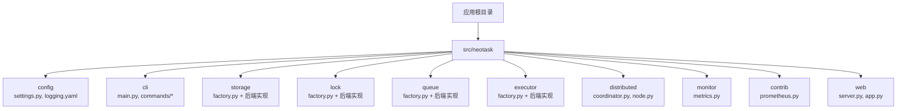
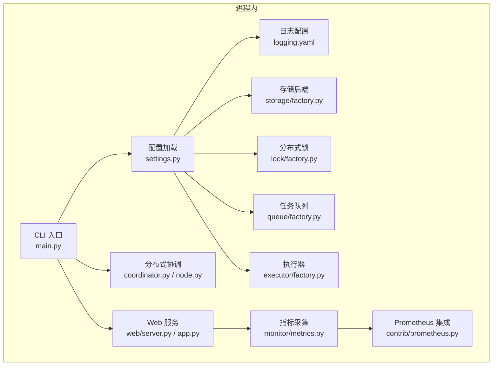

# 安装与配置

<cite>
**本文引用的文件**   
- [README_zh.md](file://README_zh.md)
- [pyproject.toml](file://pyproject.toml)
- [src/neotask/config/settings.py](file://src/neotask/config/settings.py)
- [src/neotask/config/logging.yaml](file://src/neotask/config/logging.yaml)
- [src/neotask/cli/main.py](file://src/neotask/cli/main.py)
- [src/neotask/cli/commands/start.py](file://src/neotask/cli/commands/start.py)
- [src/neotask/cli/commands/webui.py](file://src/neotask/cli/commands/webui.py)
- [src/neotask/storage/factory.py](file://src/neotask/storage/factory.py)
- [src/neotask/lock/factory.py](file://src/neotask/lock/factory.py)
- [src/neotask/queue/factory.py](file://src/neotask/queue/factory.py)
- [src/neotask/executor/factory.py](file://src/neotask/executor/factory.py)
- [src/neotask/distributed/coordinator.py](file://src/neotask/distributed/coordinator.py)
- [src/neotask/distributed/node.py](file://src/neotask/distributed/node.py)
- [src/neotask/monitor/metrics.py](file://src/neotask/monitor/metrics.py)
- [src/neotask/contrib/prometheus.py](file://src/neotask/contrib/prometheus.py)
- [src/neotask/web/server.py](file://src/neotask/web/server.py)
- [src/neotask/web/app.py](file://src/neotask/web/app.py)
</cite>

## 目录
1. [简介](#简介)
2. [项目结构](#项目结构)
3. [核心组件](#核心组件)
4. [架构总览](#架构总览)
5. [详细组件分析](#详细组件分析)
6. [依赖分析](#依赖分析)
7. [性能考虑](#性能考虑)
8. [故障排查指南](#故障排查指南)
9. [结论](#结论)
10. [附录](#附录)

## 简介
本指南面向希望部署和配置任务调度系统的用户，覆盖以下主题：
- 多种安装方式：pip 包管理、源码编译、Docker 容器化
- 配置文件结构与环境变量说明
- 日志配置选项
- 单机与集群部署示例
- 性能调优参数、监控与安全设置
- 常见配置问题排查与解决方案

目标是帮助用户根据实际需求正确完成系统安装与配置。

## 项目结构
本项目采用模块化组织，核心配置与 CLI 入口位于 src/neotask 下，CLI 提供启动命令与 WebUI 服务；存储、锁、队列、执行器、分布式协调等模块通过工厂类进行可插拔选择；监控与 Prometheus 集成在 monitor 与 contrib 中；Web 服务用于可视化与 API。

图表来源
- [src/neotask/config/settings.py](file://src/neotask/config/settings.py)
- [src/neotask/config/logging.yaml](file://src/neotask/config/logging.yaml)
- [src/neotask/cli/main.py](file://src/neotask/cli/main.py)
- [src/neotask/storage/factory.py](file://src/neotask/storage/factory.py)
- [src/neotask/lock/factory.py](file://src/neotask/lock/factory.py)
- [src/neotask/queue/factory.py](file://src/neotask/queue/factory.py)
- [src/neotask/executor/factory.py](file://src/neotask/executor/factory.py)
- [src/neotask/distributed/coordinator.py](file://src/neotask/distributed/coordinator.py)
- [src/neotask/distributed/node.py](file://src/neotask/distributed/node.py)
- [src/neotask/monitor/metrics.py](file://src/neotask/monitor/metrics.py)
- [src/neotask/contrib/prometheus.py](file://src/neotask/contrib/prometheus.py)
- [src/neotask/web/server.py](file://src/neotask/web/server.py)
- [src/neotask/web/app.py](file://src/neotask/web/app.py)

章节来源
- [README_zh.md](file://README_zh.md)
- [pyproject.toml](file://pyproject.toml)

## 核心组件
- 配置中心
  - settings.py：集中定义与加载运行时配置（如存储、锁、队列、执行器、分布式、监控、Web 等）。
  - logging.yaml：基于标准配置的日志输出格式、级别与目标。
- CLI 入口
  - main.py：命令行解析与子命令分发。
  - start.py：启动工作进程或调度器。
  - webui.py：启动 Web 界面与 API。
- 可插拔子系统
  - storage/factory.py：按配置选择内存/SQLite/Redis 等存储后端。
  - lock/factory.py：按配置选择内存/Redis 等锁实现。
  - queue/factory.py：按配置选择优先级/延迟/死信等队列实现。
  - executor/factory.py：按配置选择线程/进程/异步执行器。
- 分布式与节点
  - coordinator.py：集群协调、选举、成员管理等。
  - node.py：节点注册、心跳、状态上报。
- 监控与指标
  - monitor/metrics.py：指标采集与导出。
  - contrib/prometheus.py：Prometheus 暴露端点与抓取。
- Web 服务
  - web/server.py：HTTP 服务器初始化与路由挂载。
  - web/app.py：应用装配与中间件。

章节来源
- [src/neotask/config/settings.py](file://src/neotask/config/settings.py)
- [src/neotask/config/logging.yaml](file://src/neotask/config/logging.yaml)
- [src/neotask/cli/main.py](file://src/neotask/cli/main.py)
- [src/neotask/cli/commands/start.py](file://src/neotask/cli/commands/start.py)
- [src/neotask/cli/commands/webui.py](file://src/neotask/cli/commands/webui.py)
- [src/neotask/storage/factory.py](file://src/neotask/storage/factory.py)
- [src/neotask/lock/factory.py](file://src/neotask/lock/factory.py)
- [src/neotask/queue/factory.py](file://src/neotask/queue/factory.py)
- [src/neotask/executor/factory.py](file://src/neotask/executor/factory.py)
- [src/neotask/distributed/coordinator.py](file://src/neotask/distributed/coordinator.py)
- [src/neotask/distributed/node.py](file://src/neotask/distributed/node.py)
- [src/neotask/monitor/metrics.py](file://src/neotask/monitor/metrics.py)
- [src/neotask/contrib/prometheus.py](file://src/neotask/contrib/prometheus.py)
- [src/neotask/web/server.py](file://src/neotask/web/server.py)
- [src/neotask/web/app.py](file://src/neotask/web/app.py)

## 架构总览
下图展示了典型运行时的关键组件交互关系：CLI 启动后加载配置，创建存储、锁、队列、执行器等基础设施，按需启用分布式协调与监控，并对外提供 Web 服务。

图表来源
- [src/neotask/cli/main.py](file://src/neotask/cli/main.py)
- [src/neotask/config/settings.py](file://src/neotask/config/settings.py)
- [src/neotask/config/logging.yaml](file://src/neotask/config/logging.yaml)
- [src/neotask/storage/factory.py](file://src/neotask/storage/factory.py)
- [src/neotask/lock/factory.py](file://src/neotask/lock/factory.py)
- [src/neotask/queue/factory.py](file://src/neotask/queue/factory.py)
- [src/neotask/executor/factory.py](file://src/neotask/executor/factory.py)
- [src/neotask/distributed/coordinator.py](file://src/neotask/distributed/coordinator.py)
- [src/neotask/distributed/node.py](file://src/neotask/distributed/node.py)
- [src/neotask/monitor/metrics.py](file://src/neotask/monitor/metrics.py)
- [src/neotask/contrib/prometheus.py](file://src/neotask/contrib/prometheus.py)
- [src/neotask/web/server.py](file://src/neotask/web/server.py)
- [src/neotask/web/app.py](file://src/neotask/web/app.py)

## 详细组件分析

### 安装与运行环境要求
- Python 版本与依赖
  - 参考 pyproject.toml 中的依赖声明与构建配置，确保满足最低 Python 版本与第三方库要求。
- 可选外部依赖
  - Redis：当使用 Redis 作为存储、锁或队列后端时需要。
  - SQLite：默认本地持久化存储（无需额外安装）。
- 端口与网络
  - Web 服务监听端口需在防火墙放行。
  - 集群模式下需开放节点间通信端口。

章节来源
- [pyproject.toml](file://pyproject.toml)

### pip 安装与快速启动
- 安装步骤
  - 使用 pip 安装发布包。
  - 验证安装成功与版本信息。
- 快速启动
  - 使用 CLI 启动工作进程或调度器。
  - 使用 CLI 启动 Web 界面。
- 常用参数
  - 通过命令行参数或环境变量覆盖默认配置项（详见“配置与环境变量”小节）。

章节来源
- [pyproject.toml](file://pyproject.toml)
- [src/neotask/cli/main.py](file://src/neotask/cli/main.py)
- [src/neotask/cli/commands/start.py](file://src/neotask/cli/commands/start.py)
- [src/neotask/cli/commands/webui.py](file://src/neotask/cli/commands/webui.py)

### 源码编译与开发环境
- 克隆仓库并进入项目目录。
- 使用项目提供的构建工具链安装依赖（参考 pyproject.toml 的构建与依赖声明）。
- 以可编辑模式安装以便调试。
- 运行测试与基准脚本（scripts 目录下）验证环境。

章节来源
- [pyproject.toml](file://pyproject.toml)

### Docker 容器化部署
- 镜像构建
  - 在项目根目录使用构建工具生成镜像（参考 pyproject.toml 的打包配置）。
- 运行容器
  - 映射 Web 端口与数据卷（如需持久化）。
  - 通过环境变量注入配置（详见“配置与环境变量”小节）。
- 健康检查与重启策略
  - 结合编排平台（如 Kubernetes）配置探针与滚动更新。

章节来源
- [pyproject.toml](file://pyproject.toml)

### 配置文件结构与环境变量
- 配置文件
  - settings.py：集中定义各子系统后端与参数（存储、锁、队列、执行器、分布式、监控、Web 等）。
  - logging.yaml：日志级别、输出目标、格式化规则。
- 环境变量
  - 支持通过环境变量覆盖关键配置项（例如数据库连接、Redis 地址、Web 端口、日志级别等），具体键名以 settings.py 为准。
- 配置优先级
  - 通常顺序为：默认值 < 配置文件 < 环境变量 < 命令行参数（以实际加载逻辑为准）。

章节来源
- [src/neotask/config/settings.py](file://src/neotask/config/settings.py)
- [src/neotask/config/logging.yaml](file://src/neotask/config/logging.yaml)

### 日志配置选项
- 日志级别
  - 可通过配置或环境变量调整全局与模块级日志级别。
- 输出目标
  - 控制台、文件、远程收集器（依据 logging.yaml 与运行时参数）。
- 轮转与保留
  - 建议开启日志轮转与保留策略，避免磁盘占满。
- 结构化日志
  - 建议在业务代码中使用结构化字段，便于检索与分析。

章节来源
- [src/neotask/config/logging.yaml](file://src/neotask/config/logging.yaml)

### 存储后端配置
- 可用后端
  - 内存：适合单机与测试。
  - SQLite：适合单机持久化。
  - Redis：适合多机共享与高吞吐。
- 选择方式
  - 在 settings.py 中指定后端类型与连接参数，或通过环境变量覆盖。
- 注意事项
  - Redis 需要网络可达且具备相应权限。
  - SQLite 路径需具备写入权限。

章节来源
- [src/neotask/storage/factory.py](file://src/neotask/storage/factory.py)
- [src/neotask/config/settings.py](file://src/neotask/config/settings.py)

### 分布式锁配置
- 可用后端
  - 内存锁：单机场景。
  - Redis 锁：跨进程/跨主机互斥。
- 选择方式
  - 在 settings.py 中指定锁后端与连接参数。
- 注意事项
  - 锁超时与重试策略需与业务容忍度匹配。

章节来源
- [src/neotask/lock/factory.py](file://src/neotask/lock/factory.py)
- [src/neotask/config/settings.py](file://src/neotask/config/settings.py)

### 任务队列配置
- 可用后端
  - 优先级队列、延迟队列、死信队列等组合。
- 选择方式
  - 在 settings.py 中指定队列类型与参数（如容量、超时、重试次数）。
- 注意事项
  - 延迟与优先级需权衡 CPU 与内存占用。

章节来源
- [src/neotask/queue/factory.py](file://src/neotask/queue/factory.py)
- [src/neotask/config/settings.py](file://src/neotask/config/settings.py)

### 执行器配置
- 可用后端
  - 线程池、进程池、异步执行器。
- 选择方式
  - 在 settings.py 中指定执行器类型与并发参数（如最大并发数、队列长度）。
- 注意事项
  - CPU 密集型建议使用进程池；IO 密集型建议使用线程池或异步。

章节来源
- [src/neotask/executor/factory.py](file://src/neotask/executor/factory.py)
- [src/neotask/config/settings.py](file://src/neotask/config/settings.py)

### 分布式与集群配置
- 组件
  - coordinator.py：负责集群协调、成员发现与状态同步。
  - node.py：节点注册、心跳与健康检查。
- 关键参数
  - 节点列表、心跳间隔、选举超时、分片策略等。
- 网络要求
  - 节点间需低延迟互通，防火墙放行相关端口。
- 安全
  - 建议启用认证与加密传输（若后端支持）。

章节来源
- [src/neotask/distributed/coordinator.py](file://src/neotask/distributed/coordinator.py)
- [src/neotask/distributed/node.py](file://src/neotask/distributed/node.py)
- [src/neotask/config/settings.py](file://src/neotask/config/settings.py)

### 监控与指标配置
- 内置指标
  - monitor/metrics.py 提供任务、队列、执行器等维度的指标采集。
- Prometheus 集成
  - contrib/prometheus.py 暴露抓取端点，供 Prometheus 拉取。
- 配置要点
  - 开启指标采集、设置采集频率、暴露端口与鉴权（可选）。

章节来源
- [src/neotask/monitor/metrics.py](file://src/neotask/monitor/metrics.py)
- [src/neotask/contrib/prometheus.py](file://src/neotask/contrib/prometheus.py)
- [src/neotask/config/settings.py](file://src/neotask/config/settings.py)

### Web 服务与 WebUI
- 启动方式
  - 通过 CLI 命令启动 Web 服务与 WebUI。
- 配置项
  - 监听地址与端口、静态资源路径、中间件开关等。
- 安全
  - 建议仅在内网暴露或使用反向代理加鉴权。

章节来源
- [src/neotask/cli/commands/webui.py](file://src/neotask/cli/commands/webui.py)
- [src/neotask/web/server.py](file://src/neotask/web/server.py)
- [src/neotask/web/app.py](file://src/neotask/web/app.py)
- [src/neotask/config/settings.py](file://src/neotask/config/settings.py)

## 依赖分析
- 内部依赖
  - CLI 依赖配置加载与各子系统工厂。
  - 存储、锁、队列、执行器均通过工厂按配置动态选择实现。
  - 分布式协调与节点管理依赖配置的网络与超时参数。
  - 监控与 Prometheus 集成由 Web 服务暴露端点。
- 外部依赖
  - Redis：可选，用于存储、锁、队列后端。
  - SQLite：可选，用于本地持久化。
  - Web 框架与 HTTP 服务器：由 Web 层封装。

```mermaid
graph LR
CLI["CLI 入口"] --> CFG["配置中心"]
CFG --> STORE_F["存储工厂"]
CFG --> LOCK_F["锁工厂"]
CFG --> QUEUE_F["队列工厂"]
CFG --> EXEC_F["执行器工厂"]
CLI --> DIST["分布式协调/节点"]
CLI --> WEB["Web 服务"]
WEB --> MON["指标采集"]
MON --> PROM["Prometheus 集成"]
```

图表来源
- [src/neotask/cli/main.py](file://src/neotask/cli/main.py)
- [src/neotask/config/settings.py](file://src/neotask/config/settings.py)
- [src/neotask/storage/factory.py](file://src/neotask/storage/factory.py)
- [src/neotask/lock/factory.py](file://src/neotask/lock/factory.py)
- [src/neotask/queue/factory.py](file://src/neotask/queue/factory.py)
- [src/neotask/executor/factory.py](file://src/neotask/executor/factory.py)
- [src/neotask/distributed/coordinator.py](file://src/neotask/distributed/coordinator.py)
- [src/neotask/distributed/node.py](file://src/neotask/distributed/node.py)
- [src/neotask/monitor/metrics.py](file://src/neotask/monitor/metrics.py)
- [src/neotask/contrib/prometheus.py](file://src/neotask/contrib/prometheus.py)
- [src/neotask/web/server.py](file://src/neotask/web/server.py)

章节来源
- [src/neotask/cli/main.py](file://src/neotask/cli/main.py)
- [src/neotask/config/settings.py](file://src/neotask/config/settings.py)
- [src/neotask/storage/factory.py](file://src/neotask/storage/factory.py)
- [src/neotask/lock/factory.py](file://src/neotask/lock/factory.py)
- [src/neotask/queue/factory.py](file://src/neotask/queue/factory.py)
- [src/neotask/executor/factory.py](file://src/neotask/executor/factory.py)
- [src/neotask/distributed/coordinator.py](file://src/neotask/distributed/coordinator.py)
- [src/neotask/distributed/node.py](file://src/neotask/distributed/node.py)
- [src/neotask/monitor/metrics.py](file://src/neotask/monitor/metrics.py)
- [src/neotask/contrib/prometheus.py](file://src/neotask/contrib/prometheus.py)
- [src/neotask/web/server.py](file://src/neotask/web/server.py)

## 性能考虑
- 执行器并发
  - 根据任务类型选择合适的执行器与并发上限，避免上下文切换与锁竞争。
- 队列与存储
  - 高吞吐场景优先选择 Redis 后端，合理设置队列容量与批处理大小。
- 锁与协调
  - 降低锁粒度与持有时间，合理设置心跳与选举超时，避免脑裂。
- 监控与告警
  - 开启关键指标采集，设置阈值告警，关注队列积压、执行失败率与延迟。
- 资源限制
  - 在容器环境中设置 CPU/内存限制，防止单节点过载影响整体稳定性。

[本节为通用指导，不直接分析具体文件]

## 故障排查指南
- 无法启动 Web 服务
  - 检查端口占用与防火墙规则。
  - 确认 Web 配置项与监听地址是否正确。
- 存储连接失败
  - 校验存储后端类型与连接参数（地址、用户名、密码、数据库名）。
  - 检查网络连通性与权限。
- 锁获取超时
  - 调整锁超时与重试策略，检查是否存在长事务或阻塞操作。
- 队列堆积
  - 提升执行器并发或增加工作节点，优化任务粒度与批处理。
- 指标未上报
  - 确认监控开关与 Prometheus 抓取端点可达。
- 日志无输出或过大
  - 检查日志级别与输出目标，启用轮转与保留策略。

章节来源
- [src/neotask/config/settings.py](file://src/neotask/config/settings.py)
- [src/neotask/config/logging.yaml](file://src/neotask/config/logging.yaml)
- [src/neotask/web/server.py](file://src/neotask/web/server.py)
- [src/neotask/storage/factory.py](file://src/neotask/storage/factory.py)
- [src/neotask/lock/factory.py](file://src/neotask/lock/factory.py)
- [src/neotask/queue/factory.py](file://src/neotask/queue/factory.py)
- [src/neotask/monitor/metrics.py](file://src/neotask/monitor/metrics.py)
- [src/neotask/contrib/prometheus.py](file://src/neotask/contrib/prometheus.py)

## 结论
通过合理的安装方式选择、清晰的配置结构与环境变量管理、完善的日志与监控体系，以及针对单机与集群场景的参数调优，可以稳定高效地运行任务调度系统。建议在生产环境优先使用 Redis 后端与 Prometheus 监控，并结合反向代理与鉴权机制保障安全。

[本节为总结性内容，不直接分析具体文件]

## 附录

### 单机部署配置示例
- 存储：SQLite（本地持久化）
- 锁：内存锁
- 队列：优先级队列
- 执行器：线程池
- Web：启用 WebUI，监听本地端口
- 监控：开启指标采集与 Prometheus 端点

章节来源
- [src/neotask/config/settings.py](file://src/neotask/config/settings.py)
- [src/neotask/storage/factory.py](file://src/neotask/storage/factory.py)
- [src/neotask/lock/factory.py](file://src/neotask/lock/factory.py)
- [src/neotask/queue/factory.py](file://src/neotask/queue/factory.py)
- [src/neotask/executor/factory.py](file://src/neotask/executor/factory.py)
- [src/neotask/monitor/metrics.py](file://src/neotask/monitor/metrics.py)
- [src/neotask/contrib/prometheus.py](file://src/neotask/contrib/prometheus.py)
- [src/neotask/web/server.py](file://src/neotask/web/server.py)

### 集群部署配置示例
- 存储：Redis（多机共享）
- 锁：Redis 锁
- 队列：优先级/延迟队列
- 执行器：进程池或异步执行器
- 分布式：启用协调器与节点注册，配置心跳与选举参数
- Web：仅在内网暴露或使用反向代理
- 监控：全量指标采集与告警

章节来源
- [src/neotask/config/settings.py](file://src/neotask/config/settings.py)
- [src/neotask/storage/factory.py](file://src/neotask/storage/factory.py)
- [src/neotask/lock/factory.py](file://src/neotask/lock/factory.py)
- [src/neotask/queue/factory.py](file://src/neotask/queue/factory.py)
- [src/neotask/executor/factory.py](file://src/neotask/executor/factory.py)
- [src/neotask/distributed/coordinator.py](file://src/neotask/distributed/coordinator.py)
- [src/neotask/distributed/node.py](file://src/neotask/distributed/node.py)
- [src/neotask/monitor/metrics.py](file://src/neotask/monitor/metrics.py)
- [src/neotask/contrib/prometheus.py](file://src/neotask/contrib/prometheus.py)
- [src/neotask/web/server.py](file://src/neotask/web/server.py)

### 环境变量清单（示例键名）
- 存储相关
  - 存储后端类型、连接地址、数据库名、用户名、密码
- 锁相关
  - 锁后端类型、Redis 连接参数、超时与重试
- 队列相关
  - 队列类型、容量、超时、重试次数
- 执行器相关
  - 执行器类型、最大并发数、队列长度
- 分布式相关
  - 节点列表、心跳间隔、选举超时、分片策略
- Web 相关
  - 监听地址与端口、静态资源路径、中间件开关
- 监控相关
  - 指标采集开关、采集频率、Prometheus 端点
- 日志相关
  - 全局日志级别、输出目标、轮转策略

章节来源
- [src/neotask/config/settings.py](file://src/neotask/config/settings.py)
- [src/neotask/config/logging.yaml](file://src/neotask/config/logging.yaml)