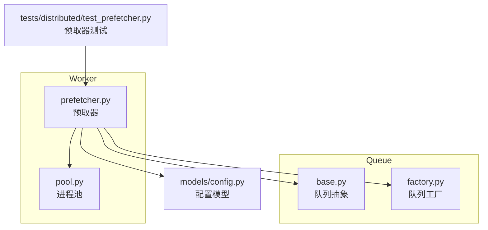
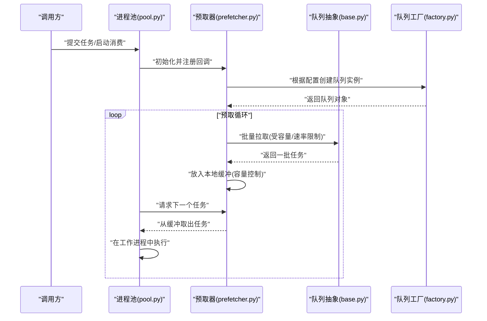
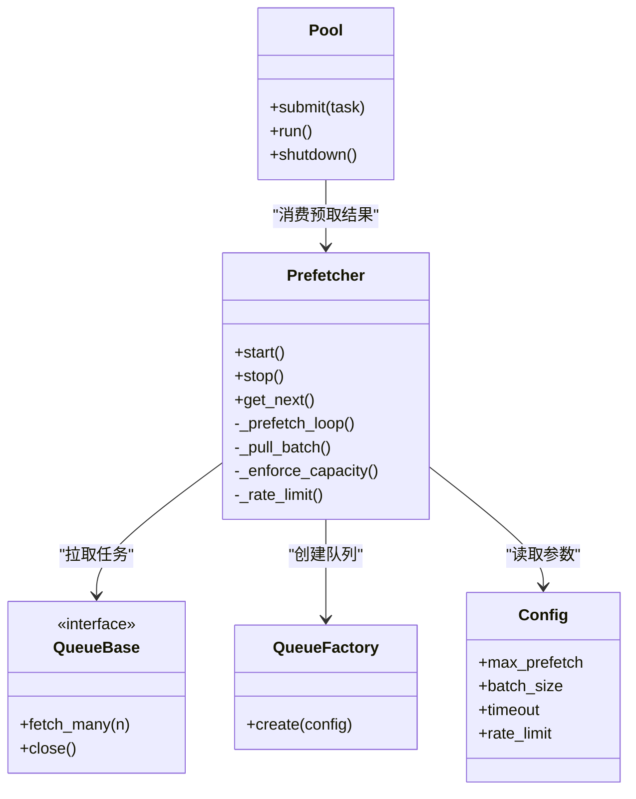
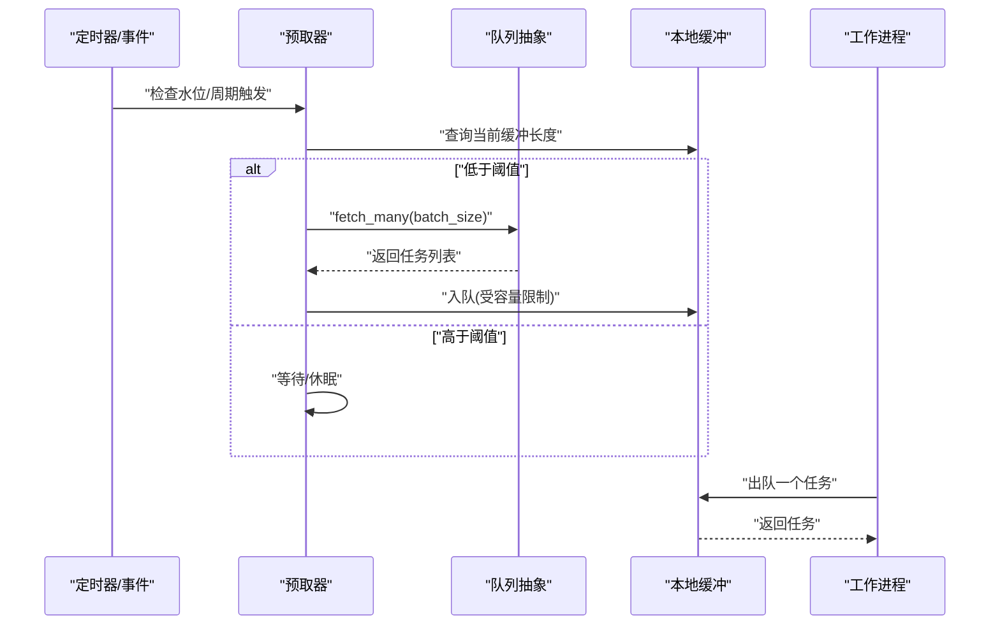
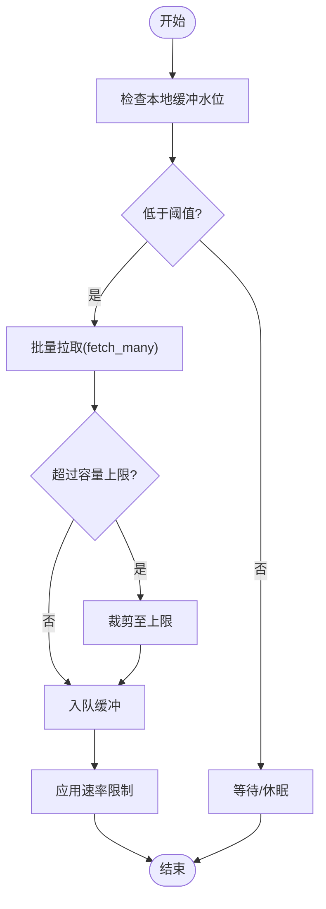
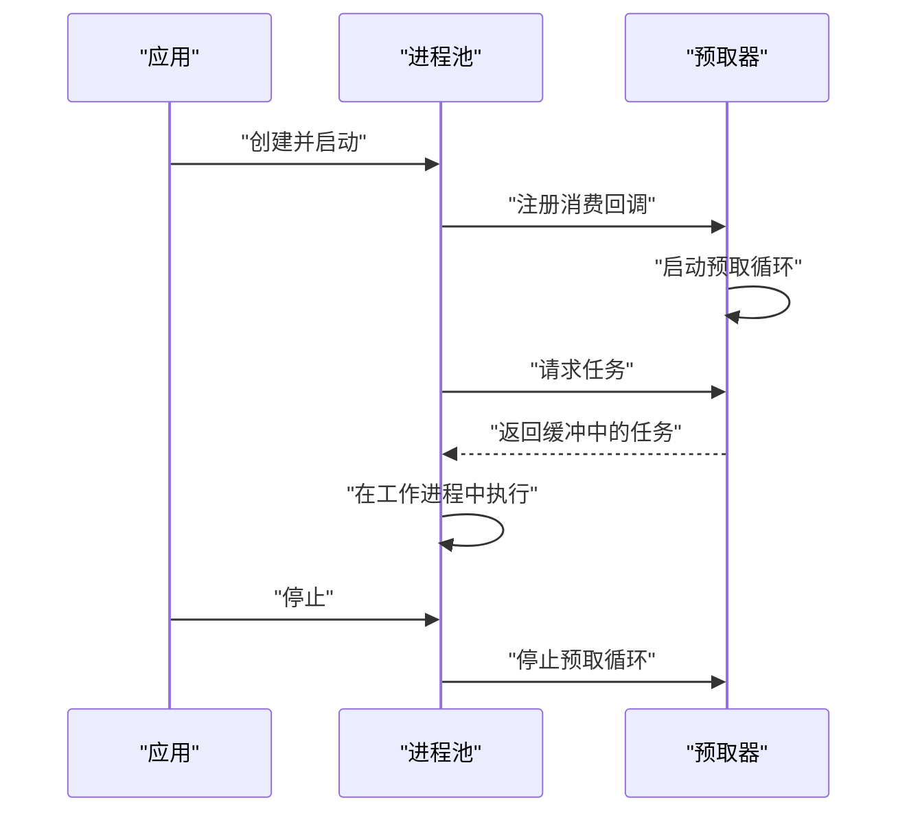
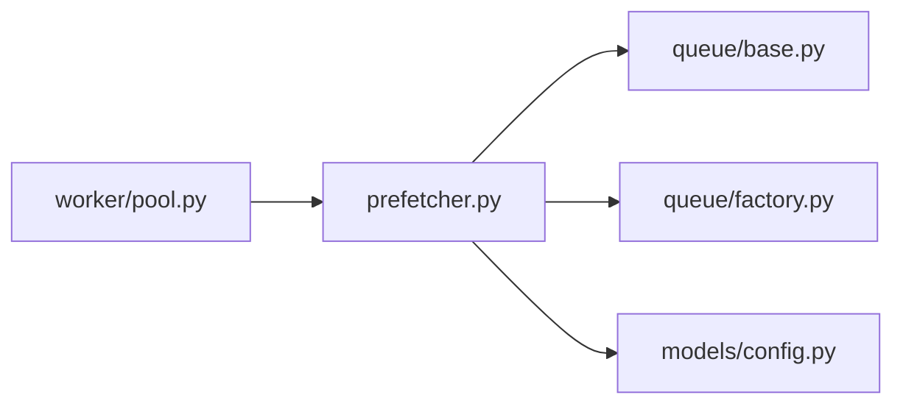

# 任务预取器

<cite>
**本文引用的文件**   
- [src/neotask/worker/prefetcher.py](file://src/neotask/worker/prefetcher.py)
- [src/neotask/worker/pool.py](file://src/neotask/worker/pool.py)
- [src/neotask/queue/base.py](file://src/neotask/queue/base.py)
- [src/neotask/queue/factory.py](file://src/neotask/queue/factory.py)
- [src/neotask/models/config.py](file://src/neotask/models/config.py)
- [tests/distributed/test_prefetcher.py](file://tests/distributed/test_prefetcher.py)
</cite>

## 目录
1. [简介](#简介)
2. [项目结构](#项目结构)
3. [核心组件](#核心组件)
4. [架构总览](#架构总览)
5. [详细组件分析](#详细组件分析)
6. [依赖分析](#依赖分析)
7. [性能考虑](#性能考虑)
8. [故障排查指南](#故障排查指南)
9. [结论](#结论)
10. [附录](#附录)

## 简介
本文件聚焦于“任务预取器”的实现原理与工作机制，围绕以下目标展开：
- 预取策略与触发条件
- 预取数量控制与队列管理
- 预取器如何优化任务执行性能、减少等待时间
- 配置参数说明与性能调优建议
- 预取器与进程池的协作模式

## 项目结构
与任务预取器直接相关的代码位于 worker 与 queue 模块中，并通过配置模型进行参数化。测试用例覆盖分布式场景下的行为验证。

图表来源
- [src/neotask/worker/prefetcher.py](file://src/neotask/worker/prefetcher.py)
- [src/neotask/worker/pool.py](file://src/neotask/worker/pool.py)
- [src/neotask/queue/base.py](file://src/neotask/queue/base.py)
- [src/neotask/queue/factory.py](file://src/neotask/queue/factory.py)
- [src/neotask/models/config.py](file://src/neotask/models/config.py)
- [tests/distributed/test_prefetcher.py](file://tests/distributed/test_prefetcher.py)

章节来源
- [src/neotask/worker/prefetcher.py](file://src/neotask/worker/prefetcher.py)
- [src/neotask/worker/pool.py](file://src/neotask/worker/pool.py)
- [src/neotask/queue/base.py](file://src/neotask/queue/base.py)
- [src/neotask/queue/factory.py](file://src/neotask/queue/factory.py)
- [src/neotask/models/config.py](file://src/neotask/models/config.py)
- [tests/distributed/test_prefetcher.py](file://tests/distributed/test_prefetcher.py)

## 核心组件
- 预取器（Prefetcher）
  - 职责：在消费者侧主动从队列拉取任务到本地缓冲，降低跨进程/跨节点通信延迟，提升吞吐并平滑突发负载。
  - 关键能力：策略选择、批量拉取、容量控制、背压与限流、生命周期管理。
- 进程池（Pool）
  - 职责：提供可复用的工作进程，消费预取器提供的任务；与预取器协同实现“预取-消费”流水线。
- 队列抽象与工厂（Queue Base & Factory）
  - 职责：定义统一的拉取接口与创建不同后端队列实例的能力；预取器通过抽象接口解耦具体存储。
- 配置模型（Config）
  - 职责：集中管理预取相关参数（如最大预取数、批大小、超时等），供运行时注入。

章节来源
- [src/neotask/worker/prefetcher.py](file://src/neotask/worker/prefetcher.py)
- [src/neotask/worker/pool.py](file://src/neotask/worker/pool.py)
- [src/neotask/queue/base.py](file://src/neotask/queue/base.py)
- [src/neotask/queue/factory.py](file://src/neotask/queue/factory.py)
- [src/neotask/models/config.py](file://src/neotask/models/config.py)

## 架构总览
下图展示了预取器在整体系统中的位置与交互关系：预取器作为“拉取代理”，在消费者侧维护一个本地缓冲队列，按需从底层队列拉取任务；进程池中的工作进程从该缓冲中取任务执行，从而减少阻塞和往返开销。

图表来源
- [src/neotask/worker/prefetcher.py](file://src/neotask/worker/prefetcher.py)
- [src/neotask/worker/pool.py](file://src/neotask/worker/pool.py)
- [src/neotask/queue/base.py](file://src/neotask/queue/base.py)
- [src/neotask/queue/factory.py](file://src/neotask/queue/factory.py)

## 详细组件分析

### 预取器类图与职责
预取器通常包含如下职责与方法（以概念性类图表示）：
- 预取策略：决定何时触发预取、每次拉取多少、是否按优先级或权重拉取。
- 容量控制：维护本地缓冲上限，避免内存膨胀。
- 速率限制：防止对下游队列造成压力。
- 生命周期：启动、停止、优雅关闭。

图表来源
- [src/neotask/worker/prefetcher.py](file://src/neotask/worker/prefetcher.py)
- [src/neotask/worker/pool.py](file://src/neotask/worker/pool.py)
- [src/neotask/queue/base.py](file://src/neotask/queue/base.py)
- [src/neotask/queue/factory.py](file://src/neotask/queue/factory.py)
- [src/neotask/models/config.py](file://src/neotask/models/config.py)

章节来源
- [src/neotask/worker/prefetcher.py](file://src/neotask/worker/prefetcher.py)
- [src/neotask/worker/pool.py](file://src/neotask/worker/pool.py)
- [src/neotask/queue/base.py](file://src/neotask/queue/base.py)
- [src/neotask/queue/factory.py](file://src/neotask/queue/factory.py)
- [src/neotask/models/config.py](file://src/neotask/models/config.py)

### 预取流程时序
预取器在运行期持续监控本地缓冲水位，当低于阈值时触发批量拉取；进程池从缓冲中取任务执行，形成“预取-消费”流水线。

图表来源
- [src/neotask/worker/prefetcher.py](file://src/neotask/worker/prefetcher.py)
- [src/neotask/queue/base.py](file://src/neotask/queue/base.py)

章节来源
- [src/neotask/worker/prefetcher.py](file://src/neotask/worker/prefetcher.py)
- [src/neotask/queue/base.py](file://src/neotask/queue/base.py)

### 预取策略与容量控制流程图
预取策略涉及触发条件、批量大小、容量上限与速率限制的综合决策。

图表来源
- [src/neotask/worker/prefetcher.py](file://src/neotask/worker/prefetcher.py)

章节来源
- [src/neotask/worker/prefetcher.py](file://src/neotask/worker/prefetcher.py)

### 预取器与进程池协作
- 进程池负责创建工作进程并调度任务执行。
- 预取器为进程池提供“无阻塞”的任务源：当缓冲为空时，预取器会异步拉取；当有任务时，进程池立即消费。
- 两者通过回调或事件机制协调生命周期（启动、停止、异常恢复）。

图表来源
- [src/neotask/worker/pool.py](file://src/neotask/worker/pool.py)
- [src/neotask/worker/prefetcher.py](file://src/neotask/worker/prefetcher.py)

章节来源
- [src/neotask/worker/pool.py](file://src/neotask/worker/pool.py)
- [src/neotask/worker/prefetcher.py](file://src/neotask/worker/prefetcher.py)

## 依赖分析
- 预取器依赖队列抽象接口，屏蔽不同后端差异；通过工厂创建具体队列实例。
- 预取器依赖配置模型获取运行时参数。
- 进程池依赖预取器作为任务源，二者耦合度低，便于替换与扩展。

图表来源
- [src/neotask/worker/prefetcher.py](file://src/neotask/worker/prefetcher.py)
- [src/neotask/worker/pool.py](file://src/neotask/worker/pool.py)
- [src/neotask/queue/base.py](file://src/neotask/queue/base.py)
- [src/neotask/queue/factory.py](file://src/neotask/queue/factory.py)
- [src/neotask/models/config.py](file://src/neotask/models/config.py)

章节来源
- [src/neotask/worker/prefetcher.py](file://src/neotask/worker/prefetcher.py)
- [src/neotask/worker/pool.py](file://src/neotask/worker/pool.py)
- [src/neotask/queue/base.py](file://src/neotask/queue/base.py)
- [src/neotask/queue/factory.py](file://src/neotask/queue/factory.py)
- [src/neotask/models/config.py](file://src/neotask/models/config.py)

## 性能考虑
- 预取数量与批大小
  - 增大批大小可降低网络/序列化开销，但会增加内存占用与首条任务延迟。
  - 建议结合任务平均耗时与队列吞吐动态调整。
- 容量上限与水位阈值
  - 容量上限用于保护内存；水位阈值决定触发时机，过小会导致频繁拉取，过大会增加延迟。
- 速率限制与背压
  - 对下游队列施加速率限制，避免雪崩；同时配合缓冲容量实现背压。
- 并发与锁
  - 预取循环与消费端需保证线程/进程安全，避免重复拉取或丢失任务。
- 监控与指标
  - 暴露缓冲长度、拉取成功率、平均拉取耗时、丢弃率等指标，辅助定位瓶颈。

[本节为通用指导，不直接分析具体文件]

## 故障排查指南
- 症状：缓冲长期为空，吞吐下降
  - 检查预取触发阈值与批大小是否合理；确认队列拉取接口是否正常返回数据。
- 症状：内存持续增长
  - 检查容量上限与裁剪逻辑是否生效；观察是否存在未释放引用。
- 症状：下游队列被压垮
  - 检查速率限制是否启用；适当降低批大小或提高限速阈值。
- 症状：任务重复或丢失
  - 检查幂等性与去重策略；确认拉取与入队的原子性。
- 参考测试
  - 分布式场景下的预取器行为可通过测试用例复现与回归验证。

章节来源
- [tests/distributed/test_prefetcher.py](file://tests/distributed/test_prefetcher.py)

## 结论
任务预取器通过在消费者侧建立本地缓冲与智能拉取策略，显著降低了任务执行的等待时间与抖动，提升了系统吞吐与稳定性。合理的容量控制、速率限制以及与进程池的协作设计，使其在高并发与分布式环境下具备良好可扩展性。建议在生产环境中结合业务特征与监控指标持续调优。

[本节为总结性内容，不直接分析具体文件]

## 附录
- 配置参数建议（示例字段，具体以实际配置模型为准）
  - max_prefetch：本地缓冲最大容量
  - batch_size：单次拉取任务数
  - timeout：拉取超时时间
  - rate_limit：每秒最大拉取次数
  - water_low/water_high：预取触发水位阈值
- 典型调优路径
  - 先确定任务平均耗时与峰值吞吐，估算合适的批大小与缓冲容量
  - 逐步放宽阈值与批大小，观察延迟与吞吐变化
  - 引入速率限制与监控告警，确保系统稳定

[本节为补充信息，不直接分析具体文件]