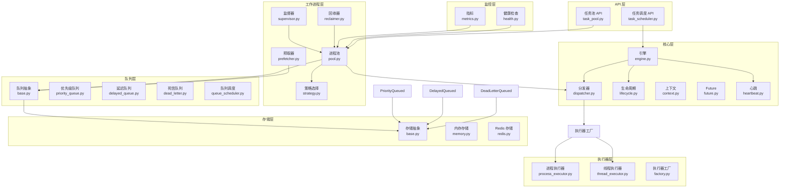
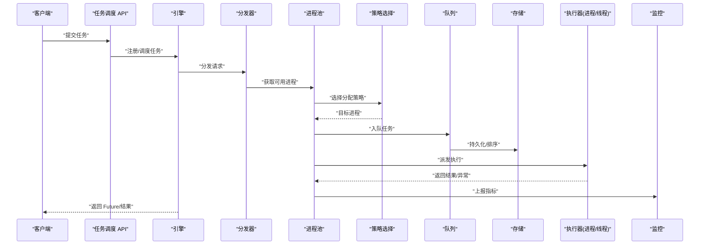
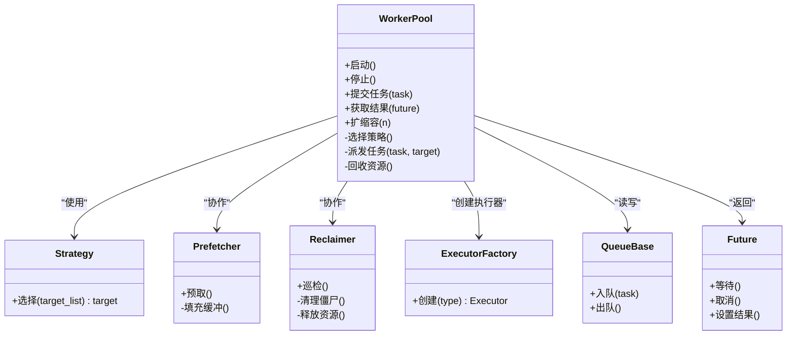
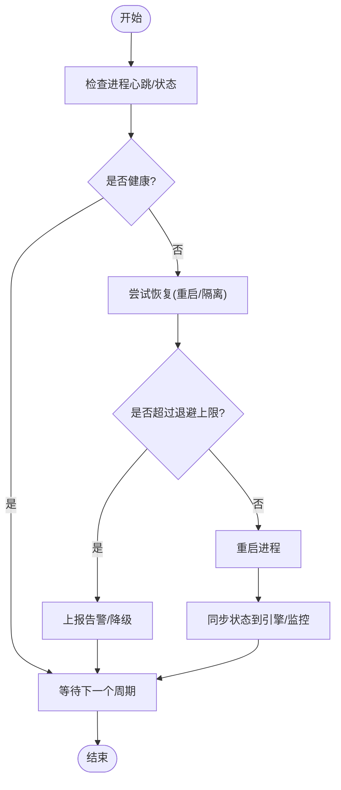
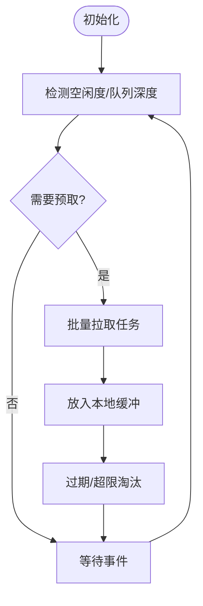
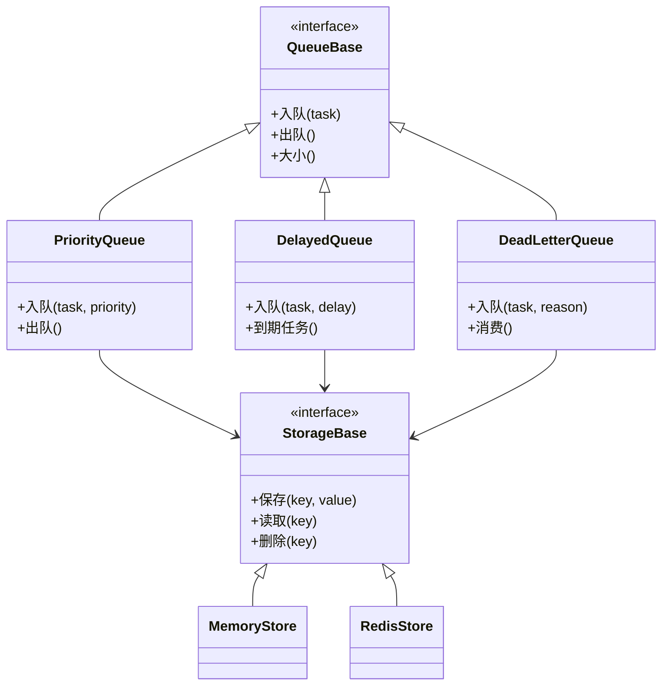
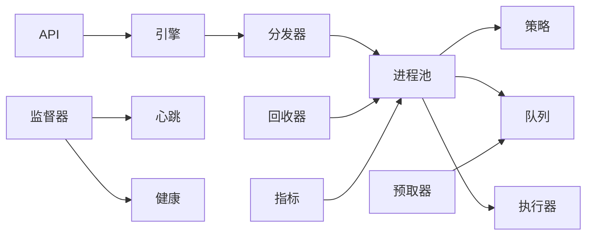

# 工作进程管理

<cite>
**本文引用的文件**   
- [src/neotask/worker/pool.py](file://src/neotask/worker/pool.py)
- [src/neotask/worker/supervisor.py](file://src/neotask/worker/supervisor.py)
- [src/neotask/worker/prefetcher.py](file://src/neotask/worker/prefetcher.py)
- [src/neotask/worker/reclaimer.py](file://src/neotask/worker/reclaimer.py)
- [src/neotask/worker/strategy.py](file://src/neotask/worker/strategy.py)
- [src/neotask/core/engine.py](file://src/neotask/core/engine.py)
- [src/neotask/core/dispatcher.py](file://src/neotask/core/dispatcher.py)
- [src/neotask/core/lifecycle.py](file://src/neotask/core/lifecycle.py)
- [src/neotask/core/context.py](file://src/neotask/core/context.py)
- [src/neotask/core/future.py](file://src/neotask/core/future.py)
- [src/neotask/core/heartbeat.py](file://src/neotask/core/heartbeat.py)
- [src/neotask/queue/base.py](file://src/neotask/queue/base.py)
- [src/neotask/queue/priority_queue.py](file://src/neotask/queue/priority_queue.py)
- [src/neotask/queue/delayed_queue.py](file://src/neotask/queue/delayed_queue.py)
- [src/neotask/queue/dead_letter.py](file://src/neotask/queue/dead_letter.py)
- [src/neotask/queue/queue_scheduler.py](file://src/neotask/queue/queue_scheduler.py)
- [src/neotask/storage/base.py](file://src/neotask/storage/base.py)
- [src/neotask/storage/memory.py](file://src/neotask/storage/memory.py)
- [src/neotask/storage/redis.py](file://src/neotask/storage/redis.py)
- [src/neotask/models/task.py](file://src/neotask/models/task.py)
- [src/neotask/models/config.py](file://src/neotask/models/config.py)
- [src/neotask/common/constants.py](file://src/neotask/common/constants.py)
- [src/neotask/common/exceptions.py](file://src/neotask/common/exceptions.py)
- [src/neotask/monitor/metrics.py](file://src/neotask/monitor/metrics.py)
- [src/neotask/monitor/health.py](file://src/neotask/monitor/health.py)
- [src/neotask/executor/process_executor.py](file://src/neotask/executor/process_executor.py)
- [src/neotask/executor/thread_executor.py](file://src/neotask/executor/thread_executor.py)
- [src/neotask/executor/factory.py](file://src/neotask/executor/factory.py)
- [src/neotask/api/task_pool.py](file://src/neotask/api/task_pool.py)
- [src/neotask/api/task_scheduler.py](file://src/neotask/api/task_scheduler.py)
</cite>

## 目录
1. [简介](#简介)
2. [项目结构](#项目结构)
3. [核心组件](#核心组件)
4. [架构总览](#架构总览)
5. [详细组件分析](#详细组件分析)
6. [依赖关系分析](#依赖关系分析)
7. [性能考虑](#性能考虑)
8. [故障排查指南](#故障排查指南)
9. [结论](#结论)
10. [附录](#附录)

## 简介
本文件系统性阐述工作进程管理系统的设计与实现，覆盖进程池配置、任务预取、进程恢复、监督器机制、策略选择、资源回收、进程间通信、状态同步与负载均衡等关键主题。文档面向不同技术背景的读者，提供从高层架构到代码级实现的渐进式说明，并给出性能调优与故障处理的最佳实践。

## 项目结构
系统采用分层与模块化组织方式：
- worker 层：负责进程池、监督、预取、回收与调度策略
- core 层：引擎、分发、生命周期、上下文、未来对象与心跳
- queue 层：队列抽象、优先级队列、延迟队列、死信队列与队列调度
- storage 层：存储抽象及内存/Redis 实现
- executor 层：执行器抽象（线程/进程）与工厂
- models 层：任务模型与配置模型
- monitor 层：指标与健康检查
- api 层：对外暴露的 API 接口

图表来源
- [src/neotask/worker/pool.py](file://src/neotask/worker/pool.py)
- [src/neotask/worker/supervisor.py](file://src/neotask/worker/supervisor.py)
- [src/neotask/worker/prefetcher.py](file://src/neotask/worker/prefetcher.py)
- [src/neotask/worker/reclaimer.py](file://src/neotask/worker/reclaimer.py)
- [src/neotask/worker/strategy.py](file://src/neotask/worker/strategy.py)
- [src/neotask/core/engine.py](file://src/neotask/core/engine.py)
- [src/neotask/core/dispatcher.py](file://src/neotask/core/dispatcher.py)
- [src/neotask/core/lifecycle.py](file://src/neotask/core/lifecycle.py)
- [src/neotask/core/heartbeat.py](file://src/neotask/core/heartbeat.py)
- [src/neotask/queue/base.py](file://src/neotask/queue/base.py)
- [src/neotask/queue/priority_queue.py](file://src/neotask/queue/priority_queue.py)
- [src/neotask/queue/delayed_queue.py](file://src/neotask/queue/delayed_queue.py)
- [src/neotask/queue/dead_letter.py](file://src/neotask/queue/dead_letter.py)
- [src/neotask/queue/queue_scheduler.py](file://src/neotask/queue/queue_scheduler.py)
- [src/neotask/storage/base.py](file://src/neotask/storage/base.py)
- [src/neotask/storage/memory.py](file://src/neotask/storage/memory.py)
- [src/neotask/storage/redis.py](file://src/neotask/storage/redis.py)
- [src/neotask/executor/process_executor.py](file://src/neotask/executor/process_executor.py)
- [src/neotask/executor/thread_executor.py](file://src/neotask/executor/thread_executor.py)
- [src/neotask/executor/factory.py](file://src/neotask/executor/factory.py)
- [src/neotask/monitor/metrics.py](file://src/neotask/monitor/metrics.py)
- [src/neotask/monitor/health.py](file://src/neotask/monitor/health.py)
- [src/neotask/api/task_pool.py](file://src/neotask/api/task_pool.py)
- [src/neotask/api/task_scheduler.py](file://src/neotask/api/task_scheduler.py)

章节来源
- [src/neotask/worker/pool.py](file://src/neotask/worker/pool.py)
- [src/neotask/core/engine.py](file://src/neotask/core/engine.py)
- [src/neotask/queue/base.py](file://src/neotask/queue/base.py)
- [src/neotask/storage/base.py](file://src/neotask/storage/base.py)
- [src/neotask/executor/factory.py](file://src/neotask/executor/factory.py)

## 核心组件
- 进程池：维护固定或动态数量的工作进程，负责任务分配、生命周期管理与资源隔离。
- 监督器：监控进程健康状态，自动重启异常退出的进程，保障系统可用性。
- 预取器：在空闲时提前拉取任务至本地缓冲，降低网络与队列访问开销，提升吞吐。
- 回收器：定期清理僵尸进程、释放未使用资源、统计并上报指标。
- 策略选择：根据负载、队列类型与任务属性选择最优分配策略（如轮询、最少连接、权重等）。
- 引擎与分发：协调生命周期、心跳、事件与任务分发；将任务路由到合适的执行器。
- 队列与存储：提供统一队列抽象，支持优先级、延迟、死信等语义；底层可插拔存储。
- 执行器：封装线程/进程执行细节，屏蔽差异，提供一致的任务执行接口。
- 监控与指标：采集运行指标、健康状态，支撑告警与可视化。
- API：对外暴露任务提交、查询、控制能力。

章节来源
- [src/neotask/worker/pool.py](file://src/neotask/worker/pool.py)
- [src/neotask/worker/supervisor.py](file://src/neotask/worker/supervisor.py)
- [src/neotask/worker/prefetcher.py](file://src/neotask/worker/prefetcher.py)
- [src/neotask/worker/reclaimer.py](file://src/neotask/worker/reclaimer.py)
- [src/neotask/worker/strategy.py](file://src/neotask/worker/strategy.py)
- [src/neotask/core/engine.py](file://src/neotask/core/engine.py)
- [src/neotask/core/dispatcher.py](file://src/neotask/core/dispatcher.py)
- [src/neotask/queue/base.py](file://src/neotask/queue/base.py)
- [src/neotask/executor/factory.py](file://src/neotask/executor/factory.py)
- [src/neotask/monitor/metrics.py](file://src/neotask/monitor/metrics.py)
- [src/neotask/api/task_pool.py](file://src/neotask/api/task_pool.py)

## 架构总览
系统以“进程池 + 监督器 + 预取/回收”为核心，通过“引擎 + 分发器”驱动任务流转，结合“队列 + 存储”持久化与排序，最终由“执行器”完成实际计算。监控与 API 贯穿全链路，提供可观测性与可控性。

图表来源
- [src/neotask/api/task_scheduler.py](file://src/neotask/api/task_scheduler.py)
- [src/neotask/core/engine.py](file://src/neotask/core/engine.py)
- [src/neotask/core/dispatcher.py](file://src/neotask/core/dispatcher.py)
- [src/neotask/worker/pool.py](file://src/neotask/worker/pool.py)
- [src/neotask/worker/strategy.py](file://src/neotask/worker/strategy.py)
- [src/neotask/queue/base.py](file://src/neotask/queue/base.py)
- [src/neotask/storage/base.py](file://src/neotask/storage/base.py)
- [src/neotask/executor/factory.py](file://src/neotask/executor/factory.py)
- [src/neotask/monitor/metrics.py](file://src/neotask/monitor/metrics.py)

## 详细组件分析

### 进程池（Worker Pool）
- 职责
  - 维护工作进程集合，提供任务派发与结果收集
  - 管理进程生命周期（启动、停止、扩缩容）
  - 与策略模块协作进行负载均衡
  - 与预取器、回收器协同优化吞吐与资源占用
- 关键流程
  - 任务入队：根据策略选择目标进程，写入队列
  - 任务出队：从队列拉取任务，交由执行器执行
  - 结果回传：执行完成后更新状态并通知调用方
- 并发与一致性
  - 使用锁或原子操作保护共享状态
  - 通过 Future 对象实现异步结果等待
- 扩展点
  - 自定义策略、执行器、队列后端

图表来源
- [src/neotask/worker/pool.py](file://src/neotask/worker/pool.py)
- [src/neotask/worker/strategy.py](file://src/neotask/worker/strategy.py)
- [src/neotask/worker/prefetcher.py](file://src/neotask/worker/prefetcher.py)
- [src/neotask/worker/reclaimer.py](file://src/neotask/worker/reclaimer.py)
- [src/neotask/core/future.py](file://src/neotask/core/future.py)
- [src/neotask/queue/base.py](file://src/neotask/queue/base.py)
- [src/neotask/executor/factory.py](file://src/neotask/executor/factory.py)

章节来源
- [src/neotask/worker/pool.py](file://src/neotask/worker/pool.py)
- [src/neotask/core/future.py](file://src/neotask/core/future.py)
- [src/neotask/queue/base.py](file://src/neotask/queue/base.py)
- [src/neotask/executor/factory.py](file://src/neotask/executor/factory.py)

### 监督器（Supervisor）
- 职责
  - 监控进程健康状态（心跳、退出码、资源使用）
  - 自动重启失败进程，保证服务连续性
  - 触发告警与记录诊断信息
- 关键流程
  - 周期巡检：读取心跳与状态，判定健康
  - 异常恢复：按策略重启进程，必要时降级或隔离
  - 状态同步：向引擎与监控上报最新状态
- 健壮性
  - 避免频繁重启风暴（退避策略）
  - 限制最大重启次数与冷却时间

图表来源
- [src/neotask/worker/supervisor.py](file://src/neotask/worker/supervisor.py)
- [src/neotask/core/heartbeat.py](file://src/neotask/core/heartbeat.py)
- [src/neotask/core/engine.py](file://src/neotask/core/engine.py)
- [src/neotask/monitor/health.py](file://src/neotask/monitor/health.py)

章节来源
- [src/neotask/worker/supervisor.py](file://src/neotask/worker/supervisor.py)
- [src/neotask/core/heartbeat.py](file://src/neotask/core/heartbeat.py)
- [src/neotask/monitor/health.py](file://src/neotask/monitor/health.py)

### 任务预取（Prefetcher）
- 目标
  - 减少任务拉取的串行阻塞，提高吞吐
  - 平滑突发流量，降低队列压力峰值
- 工作机制
  - 基于空闲阈值与队列深度动态调整预取数量
  - 本地缓冲与过期策略防止内存膨胀
  - 与优先级队列配合，优先预取高优先级任务
- 风险与对策
  - 过度预取导致内存占用上升：设置上限与淘汰策略
  - 任务过期或取消：预取后需校验有效性

图表来源
- [src/neotask/worker/prefetcher.py](file://src/neotask/worker/prefetcher.py)
- [src/neotask/queue/priority_queue.py](file://src/neotask/queue/priority_queue.py)

章节来源
- [src/neotask/worker/prefetcher.py](file://src/neotask/worker/prefetcher.py)
- [src/neotask/queue/priority_queue.py](file://src/neotask/queue/priority_queue.py)

### 资源回收（Reclaimer）
- 职责
  - 清理僵尸进程、释放句柄与临时文件
  - 统计资源使用并上报指标
  - 触发垃圾回收与内存整理
- 关键点
  - 周期性扫描与惰性回收相结合
  - 安全终止：先软关闭再硬杀，避免数据不一致
  - 与监督器协作，确保回收不影响正在执行的任务

章节来源
- [src/neotask/worker/reclaimer.py](file://src/neotask/worker/reclaimer.py)
- [src/neotask/monitor/metrics.py](file://src/neotask/monitor/metrics.py)

### 策略选择（Strategy）
- 常见策略
  - 轮询：简单公平，适合均匀负载
  - 最少连接：优先选择当前任务数最少的进程
  - 权重/亲和：按历史表现或任务亲和性分配
- 决策依据
  - 进程负载、队列长度、任务优先级、亲和标签
- 可扩展性
  - 策略接口抽象，便于新增自定义策略

章节来源
- [src/neotask/worker/strategy.py](file://src/neotask/worker/strategy.py)

### 引擎与分发（Engine & Dispatcher）
- 引擎
  - 协调生命周期、心跳、事件总线
  - 提供统一的启动/停止/扩缩容入口
- 分发器
  - 接收任务，根据策略选择目标进程
  - 与队列和执行器交互，完成端到端流转
- 上下文与 Future
  - 为任务提供运行时上下文
  - 通过 Future 实现异步结果与取消

章节来源
- [src/neotask/core/engine.py](file://src/neotask/core/engine.py)
- [src/neotask/core/dispatcher.py](file://src/neotask/core/dispatcher.py)
- [src/neotask/core/context.py](file://src/neotask/core/context.py)
- [src/neotask/core/future.py](file://src/neotask/core/future.py)

### 队列与存储（Queue & Storage）
- 队列抽象
  - 统一入队/出队接口，支持优先级、延迟、死信
- 具体实现
  - 优先级队列：按优先级排序
  - 延迟队列：按时钟或时间轮调度
  - 死信队列：失败重试耗尽后的兜底
- 存储后端
  - 内存存储：轻量快速，适合单机测试
  - Redis 存储：分布式持久化与高可用

图表来源
- [src/neotask/queue/base.py](file://src/neotask/queue/base.py)
- [src/neotask/queue/priority_queue.py](file://src/neotask/queue/priority_queue.py)
- [src/neotask/queue/delayed_queue.py](file://src/neotask/queue/delayed_queue.py)
- [src/neotask/queue/dead_letter.py](file://src/neotask/queue/dead_letter.py)
- [src/neotask/storage/base.py](file://src/neotask/storage/base.py)
- [src/neotask/storage/memory.py](file://src/neotask/storage/memory.py)
- [src/neotask/storage/redis.py](file://src/neotask/storage/redis.py)

章节来源
- [src/neotask/queue/base.py](file://src/neotask/queue/base.py)
- [src/neotask/queue/priority_queue.py](file://src/neotask/queue/priority_queue.py)
- [src/neotask/queue/delayed_queue.py](file://src/neotask/queue/delayed_queue.py)
- [src/neotask/queue/dead_letter.py](file://src/neotask/queue/dead_letter.py)
- [src/neotask/storage/base.py](file://src/neotask/storage/base.py)
- [src/neotask/storage/memory.py](file://src/neotask/storage/memory.py)
- [src/neotask/storage/redis.py](file://src/neotask/storage/redis.py)

### 执行器（Executor）
- 线程执行器：适用于 I/O 密集型任务，轻量且切换成本低
- 进程执行器：适用于 CPU 密集型或需要强隔离的任务
- 工厂模式：根据配置或任务属性动态选择执行器

章节来源
- [src/neotask/executor/thread_executor.py](file://src/neotask/executor/thread_executor.py)
- [src/neotask/executor/process_executor.py](file://src/neotask/executor/process_executor.py)
- [src/neotask/executor/factory.py](file://src/neotask/executor/factory.py)

### 监控与指标（Metrics & Health）
- 指标采集：任务吞吐、延迟、错误率、队列深度、进程状态
- 健康检查：心跳、依赖服务可达性、资源阈值
- 集成点：与引擎、进程池、队列和存储对接

章节来源
- [src/neotask/monitor/metrics.py](file://src/neotask/monitor/metrics.py)
- [src/neotask/monitor/health.py](file://src/neotask/monitor/health.py)

### API 接口（Task Pool & Scheduler）
- 任务池 API：提交、查询、取消、扩缩容
- 任务调度 API：定时、周期、延迟任务管理

章节来源
- [src/neotask/api/task_pool.py](file://src/neotask/api/task_pool.py)
- [src/neotask/api/task_scheduler.py](file://src/neotask/api/task_scheduler.py)

## 依赖关系分析
- 松耦合设计
  - 队列与存储通过抽象解耦，便于替换后端
  - 执行器通过工厂注入，支持多实现
- 关键依赖链
  - 引擎 -> 分发器 -> 进程池 -> 策略/队列/执行器
  - 监督器 -> 心跳/健康 -> 引擎/监控
  - 预取器/回收器 -> 进程池/监控
- 潜在循环依赖
  - 通过接口与事件总线降低直接耦合

图表来源
- [src/neotask/core/engine.py](file://src/neotask/core/engine.py)
- [src/neotask/core/dispatcher.py](file://src/neotask/core/dispatcher.py)
- [src/neotask/worker/pool.py](file://src/neotask/worker/pool.py)
- [src/neotask/worker/strategy.py](file://src/neotask/worker/strategy.py)
- [src/neotask/queue/base.py](file://src/neotask/queue/base.py)
- [src/neotask/executor/factory.py](file://src/neotask/executor/factory.py)
- [src/neotask/worker/supervisor.py](file://src/neotask/worker/supervisor.py)
- [src/neotask/core/heartbeat.py](file://src/neotask/core/heartbeat.py)
- [src/neotask/monitor/health.py](file://src/neotask/monitor/health.py)
- [src/neotask/monitor/metrics.py](file://src/neotask/monitor/metrics.py)
- [src/neotask/api/task_pool.py](file://src/neotask/api/task_pool.py)
- [src/neotask/api/task_scheduler.py](file://src/neotask/api/task_scheduler.py)

章节来源
- [src/neotask/core/engine.py](file://src/neotask/core/engine.py)
- [src/neotask/worker/pool.py](file://src/neotask/worker/pool.py)
- [src/neotask/queue/base.py](file://src/neotask/queue/base.py)
- [src/neotask/executor/factory.py](file://src/neotask/executor/factory.py)

## 性能考虑
- 进程池规模
  - 根据 CPU 核数与任务特性（CPU/IO）设定初始与最大进程数
  - 观察队列深度与延迟，动态扩缩容
- 预取策略
  - 合理设置预取上限与缓冲大小，避免内存抖动
  - 结合优先级队列，优先预取高价值任务
- 队列与存储
  - 使用 Redis 作为分布式后端时，注意网络 RTT 与序列化开销
  - 对热点键进行分片或缓存
- 执行器选择
  - CPU 密集用进程执行器，I/O 密集用线程执行器
- 监控与调优
  - 关注吞吐、P99 延迟、错误率、GC 与上下文切换
  - 基于指标逐步调整参数，避免一次性大改

[本节为通用指导，不直接分析具体文件]

## 故障排查指南
- 进程频繁重启
  - 检查心跳与健康状态，确认是否存在外部依赖不可用
  - 查看错误日志与堆栈，定位崩溃原因
- 任务堆积
  - 观察队列深度与预取策略，适当扩大进程池或优化预取
  - 检查执行器是否被阻塞或存在长尾任务
- 资源泄漏
  - 使用回收器报告与指标，定位未释放资源
  - 检查文件句柄、网络连接与内存增长趋势
- 死信队列增长
  - 分析失败原因，完善重试与补偿逻辑
  - 对不可恢复任务进行人工干预或归档

章节来源
- [src/neotask/worker/supervisor.py](file://src/neotask/worker/supervisor.py)
- [src/neotask/monitor/health.py](file://src/neotask/monitor/health.py)
- [src/neotask/monitor/metrics.py](file://src/neotask/monitor/metrics.py)
- [src/neotask/queue/dead_letter.py](file://src/neotask/queue/dead_letter.py)
- [src/neotask/common/exceptions.py](file://src/neotask/common/exceptions.py)

## 结论
本系统通过清晰的层次划分与可插拔设计，实现了高可用、可扩展的工作进程管理。进程池、监督器、预取与回收形成闭环，配合策略选择与均衡机制，有效提升了吞吐与稳定性。借助监控与 API，运维与开发可高效掌控系统状态并进行持续优化。

[本节为总结，不直接分析具体文件]

## 附录
- 配置要点
  - 进程池初始/最大数量、预取上限、超时与重试策略
  - 队列与存储后端选择、分区与副本策略
- 最佳实践
  - 小步快跑地调整参数，结合压测验证
  - 建立完善的告警与自愈策略，减少人工干预
  - 对关键路径进行幂等设计与补偿

[本节为补充信息，不直接分析具体文件]